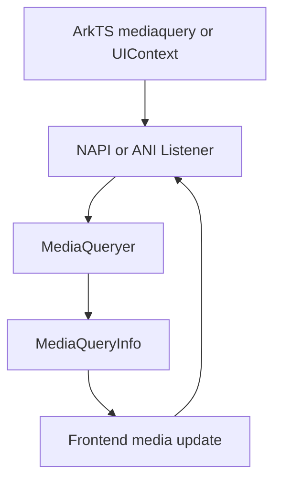
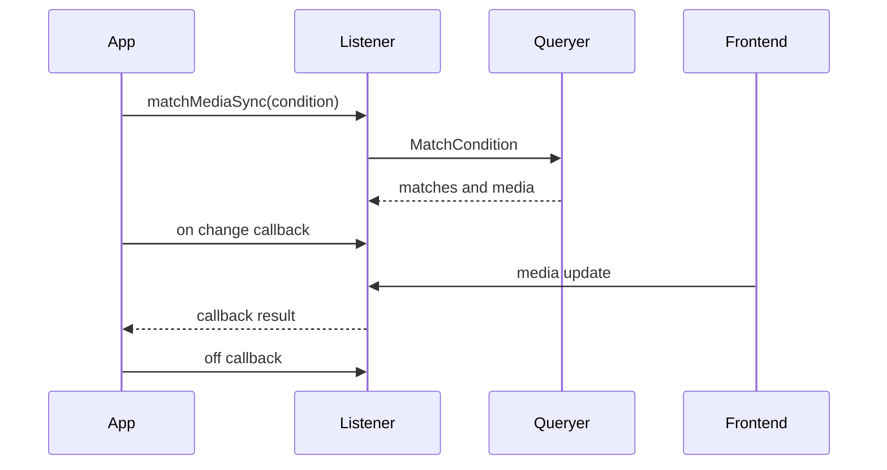

# 架构设计

> MediaQuery 将媒体条件解析、当前媒体特征与应用回调连接为既有的 NAPI/ANI 模块能力；本设计仅补录当前实现。

## 设计元数据

| 字段 | 内容 |
|------|------|
| Design ID | DESIGN-Func-04-20-01 |
| 关联需求 | 已有能力补录（无独立 requirement.md） |
| 关联 Epic | 无 |
| 目标 Feature | Feat-01 媒体条件匹配与监听生命周期 |
| 复杂度 | 标准 |
| 目标版本 | Dynamic API 7 起；Static API 23 起；UIContext API 10 起 |
| Owner | ArkUI SIG |
| 状态 | Baselined（已有实现补录） |

## 需求基线

| 项 | 补充说明 |
|----|----------|
| 条件查询 | 使用 `matchMediaSync(condition)` 产生携带只读 `matches`、`media` 的监听对象。 |
| 动态更新 | 媒体特征变更时由前端更新调度回调；监听者负责注册和注销回调。 |
| 条件边界 | 条件解析覆盖比较表达式、方向、设备类型、圆屏和深色模式，不能仅按尺寸断点解释。 |

## 上下文和现状

### 涉及仓和模块

| 仓库 | 补充架构说明 |
|------|--------------|
| ace_engine | `media_queryer.cpp` 解析条件，`media_query_info.cpp` 提供当前媒体特征。 |
| ace_engine | `js_media_query.cpp` 提供 Dynamic NAPI 的对象、监听与释放实现。 |
| ace_engine | `interfaces/ets/ani/mediaquery/src/mediaquery.cpp` 提供 Static ANI 的等价对象路径。 |
| sdk-js | `@ohos.mediaquery.d.ts`、`.static.d.ets` 和 UIContext 声明定义公开契约。 |

### 调用链层级分析

| 层 | 模块 | 职责 | 修改类型 |
|----|------|------|----------|
| ArkTS API | `@ohos.mediaquery` / UIContext | 声明查询与监听接口 | 存量补录 |
| Dynamic 入口 | `interfaces/napi/kits/mediaquery/js_media_query.cpp` | 校验字符串、生成 Listener、注册/删除 JS callback | 存量补录 |
| Static 入口 | `interfaces/ets/ani/mediaquery/src/mediaquery.cpp` | 生成 ANI Listener、管理回调引用 | 存量补录 |
| 查询核心 | `frameworks/bridge/common/media_query/media_queryer.cpp` | 解析媒体条件并比对 MediaFeature | 存量补录 |
| 特征与调度 | `media_query_info.cpp` / FrontendDelegate | 收集媒体信息并分发更新 | 存量补录 |

### 适用架构规则

| Rule ID | 适用原因 | 设计结论 | 验证方式 |
|---------|----------|----------|----------|
| OH-ARCH-LAYERING | API、绑定和查询核心跨层 | API 仅经 NAPI/ANI 调用查询核心，不反向依赖 ArkTS | 源码审查 |
| OH-ARCH-API-LEVEL | Dynamic/Static/UIContext 版本不同 | 公开签名以 SDK 为准，版本差异显式记录 | SDK 对照 |
| OH-ARCH-ERROR-LOG | 非法参数和重复监听有日志路径 | 不改变现有返回/日志恢复语义 | UT/日志审查 |

## 不涉及项承接

| 维度 | 设计结论 |
|------|----------|
| Native Node C API | 不涉及；MediaQuery 是模块能力，没有专属节点属性。 |
| IPC/持久化 | 不涉及；监听与特征均在当前 ArkUI 前端实例内维护。 |
| 构建 | 沿用 NAPI/ANI 既有 BUILD.gn，不新增 target。 |

## 关键设计决策

| 决策 ID | 问题 | 推荐方案 | 探索过的替代方案 | 取舍理由 | 影响 |
|---------|------|----------|-----------------|----------|------|
| ADR-1 | 查询结果如何承载更新 | 以 Listener 承载结果和回调 | 每次变化重新查询；全局单例回调 | 当前实现为每次查询创建对象并保存条件 | `on/off` 成为生命周期契约 |
| ADR-2 | 条件能力如何归档 | 按解析器实际规则记录比较、方向和设备特征 | 仅记录宽高；按浏览器 CSS 全量承诺 | 当前正则规则是实现边界 | 不虚构未实现语法 |
| ADR-3 | 多入口如何一致 | Dynamic/Static 分别记录签名，UIContext 保持实例作用域 | 强制统一签名；忽略 UIContext | SDK 和绑定形式不同 | 版本矩阵与回调形式分开验证 |

## 设计骨架

### 骨架范围

| 骨架项 | 目标 | 不包含 | 验证方式 |
|--------|------|--------|----------|
| 查询与结果 | 创建 Listener 并计算初始 matches | 新媒体特征 | 条件 UT |
| 监听生命周期 | on/off 注册、重复注册及回调释放 | 应用业务状态 | NAPI/ANI UT |
| 入口兼容 | Dynamic、Static 与 UIContext 路由 | Native Node API | SDK/绑定对照 |

### 骨架 Spec 拆分

| Task ID | 目标 | 受影响文件 | AC |
|---------|------|------------|----|
| TASK-SKELETON-1 | 媒体查询与监听补录 | `Feat-01-media-query-listener-spec.md` | 全部 AC |

## 后续 Task 拆分

| Task ID | 目标 | 受影响文件 | 依赖 |
|---------|------|------------|------|
| TASK-FEAT-01 | 基线化查询、规则和生命周期 | `Feat-01-media-query-listener-spec.md` | SDK、NAPI/ANI、query engine |

## API 签名、Kit 与权限

### 新增 API

| API 签名 | 类型 | Kit | d.ts 位置 | 权限要求 | SysCap |
|----------|------|-----|-----------|----------|--------|
| `matchMediaSync(condition: string)` | Public | ArkUI | `@ohos.mediaquery.d.ts` | 无 | ArkUI.Full |
| `MediaQueryListener.on/off` | Public Dynamic | ArkUI | `@ohos.mediaquery.d.ts` | 无 | ArkUI.Full |
| `MediaQueryListener.onChange/offChange` | Public Static | ArkUI | `@ohos.mediaquery.static.d.ets` | 无 | ArkUI.Full |

### 变更/废弃 API

无；本次仅补录已有接口。

## 构建系统影响

### BUILD.gn 变更

```text
无变更；沿用 interfaces/napi/kits/mediaquery/BUILD.gn 与 interfaces/ets/ani/mediaquery/BUILD.gn。
```

### bundle.json 变更

无新增部件或依赖。

## 可选设计扩展

### 架构图



### 数据流/控制流

| 步骤 | 调用方 | 被调用方 | 数据/接口 | 说明 |
|------|--------|----------|-----------|------|
| 1 | 应用 | 模块入口 | condition string | 创建查询对象 |
| 2 | Listener | MediaQueryer | condition + MediaFeature | 生成初始 matches |
| 3 | 应用 | Listener | on/onChange callback | 注册变更回调 |
| 4 | 前端 | Listener | 更新后的媒体特征 | 回调新的结果 |
| 5 | 应用 | Listener | off/offChange | 删除指定或全部回调 |

### 时序设计



### 测试性设计

| 测试层级 | 测试目标 | Mock 策略 | 验证方式 |
|----------|----------|----------|----------|
| Query engine | 比较、方向和设备特征 | 构造 MediaFeature | `media_query_test.cpp` |
| NAPI/ANI | 创建、注册、注销与重复注册 | Fake callback | UT |
| UIContext | 实例绑定入口 | 多 Pipeline fixture | SDK/集成测试 |

### 接口参数规约

| 接口 | 参数 | 类型 | 合法范围 | 非法处理 | 边界说明 |
|------|------|------|----------|----------|----------|
| matchMediaSync | condition | string | 查询核心可解析条件 | NAPI 参数断言/匹配为 false | 空或非字符串不是有效查询 |
| on/off | callback | Callback | 当前 Listener 的 change callback | 重复注册不加入第二次 | off 无参清除全部回调 |

## 详细设计

### 条件匹配与监听更新

`JSMatchMediaSync` 校验单个字符串参数、读取 `MediaQueryInfo` 后调用 `MediaQueryer::MatchCondition`，再创建 Listener（`interfaces/napi/kits/mediaquery/js_media_query.cpp:415-448`）。解析器分别实现 CSS Level 3/4 数值比较、方向、设备类型、圆屏和深色模式（`frameworks/bridge/common/media_query/media_queryer.cpp:90-250`）。Listener 的重复 callback 不重复保存；`off` 无 callback 时清理全部引用（`js_media_query.cpp:180-255`）。

## 风险和开放问题

| 项 | 类型 | 影响 | 处理方式 | Owner |
|----|------|------|----------|-------|
| 条件语法不是浏览器 CSS 的完整超集 | API | 中 | 仅按解析器和 SDK 实际支持范围验收 | ArkUI SIG |
| Dynamic 与 Static 回调方法名不同 | 兼容性 | 中 | 分入口记录签名，不做文本合并 | ArkUI SIG |

## 设计审批

- [x] 需求基线已确认，设计覆盖 P0/P1 AC
- [x] 不涉及项已承接，N/A 和展开项都有结论
- [x] 涉及仓和模块职责清楚
- [x] 调用链层级分析完整，每层覆盖到位
- [x] 适用架构规则已识别并形成设计结论
- [x] 分层和子系统边界合规
- [x] API 变更有签名、权限、错误码和兼容性说明
- [x] BUILD.gn/bundle.json 影响明确
- [x] 设计输出和后续 Task 拆分明确
- [x] 关键设计决策有理由和影响说明
- [x] 风险和开放问题有 Owner

**结论:** 通过（已有实现补录）。
