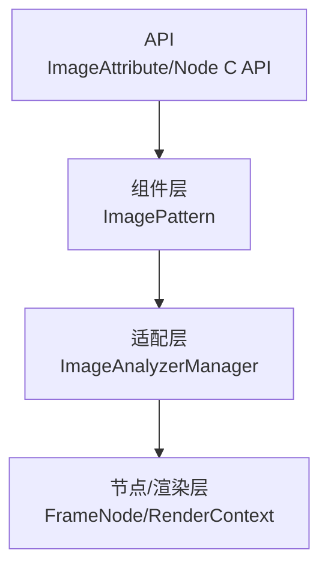
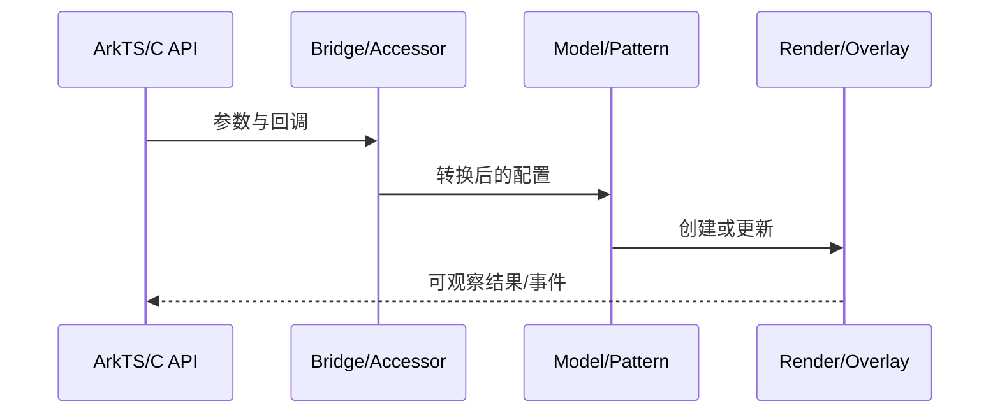
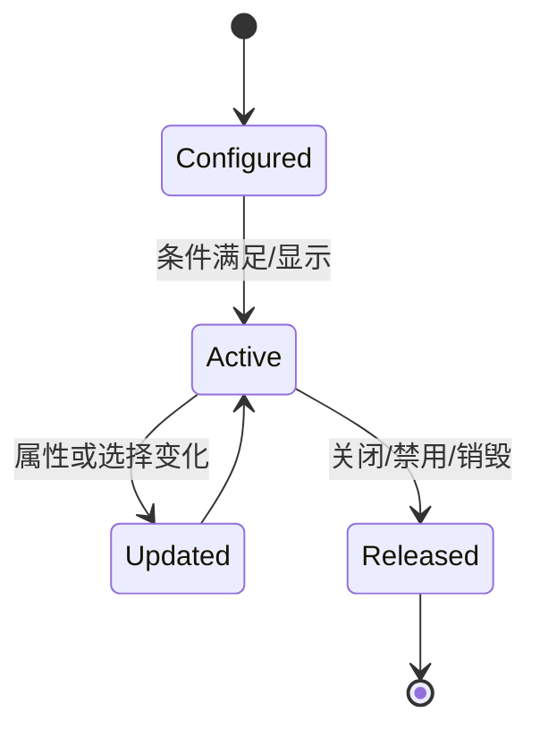
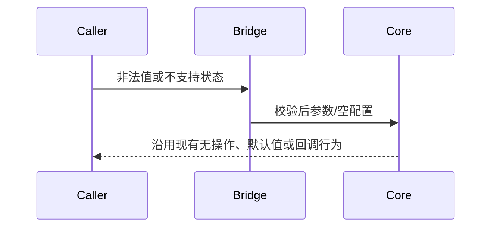

# 架构设计

> 确认目标仓和模块的架构约束、关键设计决策、Spec 拆分方向。

## 设计元数据

| 字段 | 内容 |
|---|---|
| Design ID | DESIGN-Func-04-23-01 |
| 关联需求 | 已有能力补录（无独立 requirement.md） |
| 关联 Epic | 无 |
| 目标 Feature | Feat-01 Image 分析开关、配置与支持条件, Feat-02 Image Analyzer Overlay 生命周期与跨组件管理 |
| 复杂度 | 关键 |
| 目标版本 | Dynamic 11+ / Static 23+ / Node C API 21+ |
| Owner | ArkUI SIG |
| 状态 | Baselined（已有实现补录） |

## 需求基线

> 本设计记录现有实现，不提出产品行为修改。

| 项 | 补充说明（如需） |
|---|---|
| 支持条件 | 开关、解码图、格式/帧数、组件状态和平台能力同时满足 |
| 生命周期 | 禁用立即销毁 overlay；创建/销毁分别报告 FINISHED/STOPPED |

## 上下文和现状

### 涉及仓和模块

| 仓库 | 补充架构说明 |
|---|---|
| interface/sdk-js/api | enableAnalyzer/analyzerConfig 契约 |
| ace_engine/frameworks/core/components_ng/pattern/image | ImagePattern 开关和判定 |
| ace_engine/adapter/ohos/osal | ImageAnalyzerManager 平台 overlay |
| ace_engine/interfaces/native | Node C API 开关 |

### 调用链层级分析

| 层 | 模块 | 职责 | 修改类型 |
|---|---|---|---|
| API | ImageAttribute/Node C API | 设置开关和配置 | 文档补录 |
| 组件层 | ImagePattern | 管理 manager、判定支持条件 | 文档补录 |
| 适配层 | ImageAnalyzerManager | 调用平台分析能力、构建 overlay | 文档补录 |
| 节点/渲染层 | FrameNode/RenderContext | 挂载 overlay、层级和布局 | 文档补录 |

- [x] 调用链每一层都已覆盖
- [x] 每层职责边界清晰
- [x] 每层修改类型明确

### 适用架构规则

| Rule ID | 适用原因 | 设计结论 | 验证方式 |
|---|---|---|---|
| OH-ARCH-LAYERING | 涉及前端到渲染/弹窗链路 | 保持现有单向分层调用 | 架构评审/源码审查 |
| OH-ARCH-SUBSYSTEM | 实现位于 ArkUI 仓内 | 不新增跨子系统依赖 | 依赖检查 |
| OH-ARCH-IPC-SAF | 无新增 IPC/SA | N/A | 源码审查 |
| OH-ARCH-API-LEVEL | 涉及存量公开 API | SDK 声明为契约，内部 accessor 不扩展为 NDK | API 评审 |
| OH-ARCH-COMPONENT-BUILD | 不修改构建边界 | BUILD.gn/bundle.json 无变更 | 索引校验 |
| OH-ARCH-ERROR-LOG | 沿用现有返回/降级行为 | 不新增错误码 | 定向测试 |

## 不涉及项承接

| 维度 | 设计结论 |
|---|---|
| 权限/隐私 | 需要既有 ohos.permission.INTERNET；不新增权限类型或隐私持久化 |
| 持久化/迁移 | 不新增持久化数据和迁移逻辑 |
| 跨进程 | 不新增 IPC、SA 或跨进程协议 |

## 关键设计决策

| 决策 ID | 问题 | 推荐方案 | 探索过的替代方案 | 取舍理由 | 影响 |
|---|---|---|---|---|---|
| ADR-1 | 何时支持分析 | 所有条件合取后返回 true | 仅检查开关、仅检查平台 | 避免 SVG/动图/禁用组件产生错误效果 | Feat-01 |
| ADR-2 | 编译不支持时行为 | 返回 false | 运行时加载失败、抛错 | 保持可选平台能力无操作 | Feat-01 |
| ADR-F2-1 | 禁用行为 | EnableAnalyzer(false) 立即 DestroyAnalyzerOverlay | 只置标志、延迟清理 | 防止残留交互层 | Feat-02 |
| ADR-F2-2 | overlay 层级和焦点 | ZIndex=INT32_MAX 且 Focusable=false | 普通层级、可聚焦 | 确保分析交互覆盖图像但不抢焦点 | Feat-02 |
| ADR-F2-3 | 状态回调 | 创建 FINISHED、销毁 STOPPED | 统一成功、无回调 | 现有外部状态可观测 | Feat-02 |

## 设计骨架

### 骨架范围

| 骨架项 | 目标 | 不包含 | 验证方式 |
|---|---|---|---|
| 规格补录 | 固定现有 API、边界和兼容行为 | 不修改产品实现 | spec 校验 + 源码审查 |
| 共享设计 | 同一 FuncID 的 Feat 共用 design.md | 不建立 Feat 独立 H2 | 章节检查 |

### 骨架 Spec 拆分

| Task ID | 目标 | 受影响文件 | AC |
|---|---|---|---|
| TASK-SKELETON-1 | Feat-01 Image 分析开关、配置与支持条件 | Feat-01-image-analyzer-support-spec.md | 见对应 spec |
| TASK-SKELETON-2 | Feat-02 Image Analyzer Overlay 生命周期与跨组件管理 | Feat-02-image-analyzer-overlay-lifecycle-spec.md | 见对应 spec |

## 后续 Task 拆分

| Task ID | 目标 | 受影响文件 | 依赖 |
|---|---|---|---|
| TASK-042301-01 | Feat-01 Image 分析开关、配置与支持条件 | Feat-01-image-analyzer-support-spec.md | 源码与 SDK 契约 |
| TASK-042301-02 | Feat-02 Image Analyzer Overlay 生命周期与跨组件管理 | Feat-02-image-analyzer-overlay-lifecycle-spec.md | 源码与 SDK 契约 |

## API 签名、Kit 与权限

### 新增 API

> 本次不新增 API；下表记录存量开放面。

| API 签名 | 类型 | Kit | d.ts 位置 | 权限要求 | SysCap |
|---|---|---|---|---|---|
| Image.enableAnalyzer(boolean) | Public | ArkUI | interface/sdk-js/api/@internal/component/ets/image.d.ts | ohos.permission.INTERNET | SystemCapability.ArkUI.ArkUI.Full |
| Image.analyzerConfig(ImageAnalyzerConfig) | System | ArkUI | interface/sdk-js/api/@internal/component/ets/image.d.ts | ohos.permission.INTERNET | SystemCapability.ArkUI.ArkUI.Full |
| NODE_IMAGE_ENABLE_ANALYZER | Public C API | ArkUI Native | interfaces/native/native_node.h | 无新增 | ArkUI |

### 变更/废弃 API

| 原有 API | 变更类型 | 新 API | 迁移说明 |
|---|---|---|---|
| N/A | 无 | N/A | 无 |

## 构建系统影响

### BUILD.gn 变更

```text
无。本文档补录现有实现，不修改 BUILD.gn。
```

### bundle.json 变更

无新增 component 或依赖关系。

## 可选设计扩展

### 架构图



### 数据流/控制流

| 步骤 | 调用方 | 被调用方 | 数据/接口 | 说明 |
|---|---|---|---|---|
| 1 | ImageAttribute/Node C API | ImagePattern | 设置开关和配置 | 沿现有链路传递 |
| 2 | ImagePattern | ImageAnalyzerManager | 管理 manager、判定支持条件 | 沿现有链路传递 |
| 3 | ImageAnalyzerManager | FrameNode/RenderContext | 调用平台分析能力、构建 overlay | 沿现有链路传递 |
| 4 | FrameNode/RenderContext | 渲染结果/回调 | 挂载 overlay、层级和布局 | 沿现有链路传递 |

### 时序设计



### 数据模型设计

`ImagePattern` 保存 `isEnableAnalyzer_` 和 `shared_ptr<ImageAnalyzerManager>`；manager 保存 `AnalyzerUIConfig`、overlayData、宿主弱引用和 overlay build 状态。

### 算法与状态机



### 测试性设计

| 测试层级 | 测试目标 | Mock 策略 | 验证方式 |
|---|---|---|---|
| 源码契约 | SDK 与实现映射 | 无 | 路径和行号审查 |
| 组件/预览 | 主路径与边界条件 | 平台能力按现有 mock | 定向 UT 或 previewer 用例 |
| 兼容性 | API 版本差异 | 设置 target API | 版本矩阵审查 |

### 异常传播时序图



### 资源所有权矩阵

| 资源 | 创建方 | 持有方 | 销毁触发 | 实际释放 | 异常回收 |
|---|---|---|---|---|---|
| ImageAnalyzerManager | ImagePattern | ImagePattern | Pattern 销毁/释放 | shared_ptr | 编译不支持时不创建 |
| Analyzer OverlayNode | ImageAnalyzerManager | 宿主 FrameNode | 禁用/销毁 | SetOverlayNode(nullptr) | 销毁前 ReleaseImageAnalyzer |
| NAPI handle scope | ImageAnalyzerManager | 当前调用栈 | 节点构建/更新结束 | napi_close_handle_scope | 打开失败直接返回 |

### 接口参数规约

| 接口 | 参数 | 类型 | 合法范围 | 非法处理 | 边界说明 |
|---|---|---|---|---|---|
| enableAnalyzer | enable | boolean | true/false | false 销毁 overlay | 默认 false |
| analyzerConfig | config | ImageAnalyzerConfig | SDK 定义类型 | 未启用时无操作 | 类型不可动态修改 |
| NODE_IMAGE_ENABLE_ANALYZER | value[0].i32 | int32 | 至少一个参数 | PARAM_INVALID | 转换为 bool |

### 线程与并发模型

| 操作 | 发起线程 | 回调线程 | 跨进程边界 | 线程安全 | 重入约束 |
|---|---|---|---|---|---|
| API 调用 | UI/ArkTS 线程 | UI/ArkTS 线程 | 无 | 沿用容器与 UI 线程约束 | 回调内修改配置按 SDK 生命周期说明生效 |

## 详细设计

### 支持条件

ImagePattern 依次检查 manager、enable、image、SVG、帧数和平台能力。

实现证据：`frameworks/core/components_ng/pattern/image/image_pattern.cpp:2625`。
### 平台附加条件

组件 enabled、非 obscured、NoRepeat 后再查询平台支持。

实现证据：`adapter/ohos/osal/image_analyzer_manager.cpp:252`。
### Overlay 创建

挂载宿主、设最高 ZIndex、禁用焦点并回调 FINISHED。

实现证据：`adapter/ohos/osal/image_analyzer_manager.cpp:71`。
### 销毁和布局

销毁解绑并 STOPPED；布局使用 MATCH_PARENT/TOP_LEFT 和 padding 偏移。

实现证据：`adapter/ohos/osal/image_analyzer_manager.cpp:229`。

## 风险和开放问题

| 项 | 类型 | 影响 | 处理方式 | Owner |
|---|---|---|---|---|
| 设备或编译不支持时功能无效果 | 架构 | 高 | 规格明确多条件和 false 返回 | ArkUI SIG |
| overlay 最高层可能覆盖普通 overlay 内容 | 架构 | 中 | 保持现有 INT32_MAX 行为并做交互回归 | ArkUI SIG |
| 状态回调一次后被清空 | API | 中 | 测试 FINISHED/STOPPED 时机 | ArkUI SIG |

## 设计审批

- [x] 需求基线已确认，设计覆盖 P0/P1 AC
- [x] 不涉及项已承接，N/A 和展开项都有结论
- [x] 涉及仓和模块职责清楚
- [x] 调用链层级分析完整，每层覆盖到位
- [x] 适用架构规则已识别并形成设计结论
- [x] 分层和子系统边界合规
- [x] API 变更有签名、权限、错误码和兼容性说明
- [x] BUILD.gn/bundle.json 影响明确
- [x] 设计输出和后续 Task 拆分明确
- [x] 关键设计决策有理由和影响说明
- [x] 风险和开放问题有 Owner

**结论:** 通过（已有实现补录）。
