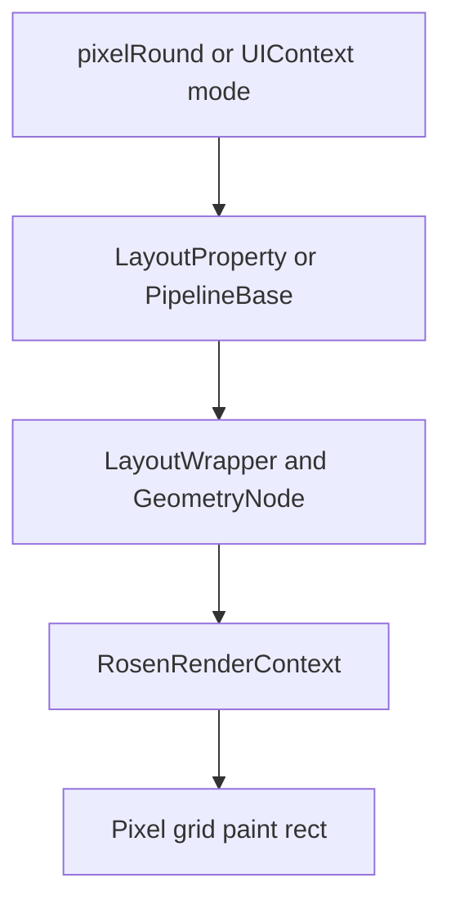
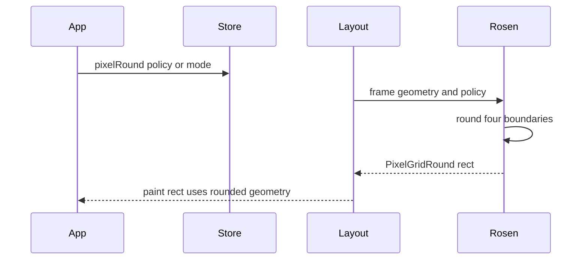

# 架构设计

> 像素取整通过组件级 `pixelRound` 策略与页面级 PixelRoundMode 协同，将浮点布局几何传播为可用于渲染的像素网格矩形；本设计仅补录既有实现。

## 设计元数据

| 字段 | 内容 |
|------|------|
| Design ID | DESIGN-Func-04-24-01 |
| 关联需求 | 已有能力补录（无独立 requirement.md） |
| 关联 Epic | 无 |
| 目标 Feature | Feat-01 像素取整策略与布局渲染传播 |
| 复杂度 | 复杂 |
| 目标版本 | Dynamic component API 11 起；UIContext API 18 起；Static/C API 23/21 起 |
| Owner | ArkUI SIG |
| 状态 | Baselined（已有实现补录） |

## 需求基线

| 项 | 补充说明 |
|----|----------|
| 组件级策略 | `pixelRound` 为 start/top/end/bottom 分别指定舍入策略，未指定方向按默认取整。 |
| 页面级模式 | UIContext 写入 Pipeline 的 PixelRoundMode，默认 `PIXEL_ROUND_ON_LAYOUT_FINISH`。 |
| 几何传播 | 取整结果写入 GeometryNode 的 PixelGridRound offset/size，并进入 LayoutWrapper 与 RenderContext 的 paint rect。 |

## 上下文和现状

### 涉及仓和模块

| 仓库 | 补充架构说明 |
|------|--------------|
| sdk-js | Common、Modifier、UIContext Dynamic/Static SDK 定义公开契约。 |
| ace_engine | ViewAbstract、bridge 和 node modifier 解析并保存组件策略。 |
| ace_engine | PipelineBase 保存页面模式，LayoutWrapper 传播已取整的矩形。 |
| ace_engine | RosenRenderContext 按边缘策略计算最终 offset、size 和边框几何。 |
| Native API | `layout.h` 提供 Policy 对象与四边 set/get。 |

### 调用链层级分析

| 层 | 模块 | 职责 | 修改类型 |
|----|------|------|----------|
| ArkTS/C API | Common、UIContext、`layout.h` | 声明策略和模式 | 存量补录 |
| Bridge/Modifier | `ArkComponent.ts`、common bridge、node modifier | 将策略转换为内部标志并写节点 | 存量补录 |
| 属性与 Pipeline | `view_abstract.cpp`、`layout_property.cpp`、`pipeline_base.h` | 保存组件 Policy 和页面 Mode | 存量补录 |
| Layout | `layout_wrapper.cpp`、`frame_node.cpp` | 使用 PixelGridRoundRect 更新 paint rect | 存量补录 |
| Render | `rosen_render_context.cpp` | 对每边执行 round/ceil/floor 并写 GeometryNode | 存量补录 |

### 适用架构规则

| Rule ID | 适用原因 | 设计结论 | 验证方式 |
|---------|----------|----------|----------|
| OH-ARCH-LAYERING | 属性、布局和渲染分层 | API 只写策略/模式；实际几何在 Layout/Render 消费 | 源码审查 |
| OH-ARCH-API-LEVEL | Dynamic/Static/C API 版本不同 | 以 SDK 和 `layout.h` 的 since 为公开边界 | SDK/C API 对照 |
| OH-ARCH-SUBSYSTEM | Rosen 负责最终渲染适配 | 无将 Rosen 算法暴露为 ArkTS API 的反向依赖 | UT/渲染测试 |

## 不涉及项承接

| 维度 | 设计结论 |
|------|----------|
| 持久化/IPC | 不涉及；策略和模式仅保存于当前节点/Pipeline。 |
| 新布局算法 | 不涉及；取整消费现有 Frame/Geometry 结果。 |
| 构建 | 不新增 target 或部件。 |

## 关键设计决策

| 决策 ID | 问题 | 推荐方案 | 探索过的替代方案 | 取舍理由 | 影响 |
|---------|------|----------|-----------------|----------|------|
| ADR-1 | 组件策略与页面模式是否合并 | 分开记录 `PixelRoundPolicy` 与 `PixelRoundMode` | 仅组件属性；全局开关替代策略 | 存储和作用域不同 | AC 分别验证 |
| ADR-2 | 四边如何取整 | 使用 start/top/end/bottom 独立 flag | 单一 round；只处理 width/height | Rosen 实现按边缘计算绝对右/下边界 | 防止边缘策略被丢失 |
| ADR-3 | 取整效果如何验证 | 检查 GeometryNode 和 paint rect 传播 | 仅检查 API setter；只看截图 | LayoutWrapper 与 RenderContext 都消费结果 | 覆盖布局到绘制链路 |
| ADR-4 | 特殊设备如何处理 | 保留二合一设备 force-floor 现有分支为风险 | 统一跨设备数学规则 | 实现存在设备判断 | 多设备差异可见 |

## 设计骨架

### 骨架范围

| 骨架项 | 目标 | 不包含 | 验证方式 |
|--------|------|--------|----------|
| 策略 API | 固化四边 Policy 和 C API 对象 | 新枚举 | SDK/C API UT |
| 页面模式 | 固化 UIContext 到 Pipeline 的模式写入 | 全局系统配置 | UIContext UT |
| 布局渲染 | 固化 GeometryNode/paint rect/Rosen 路径 | 组件专属布局规则 | pixel_round UT |

### 骨架 Spec 拆分

| Task ID | 目标 | 受影响文件 | AC |
|---------|------|------------|----|
| TASK-SKELETON-1 | 像素策略与传播补录 | `Feat-01-pixel-rounding-policy-propagation-spec.md` | 全部 AC |

## 后续 Task 拆分

| Task ID | 目标 | 受影响文件 | 依赖 |
|---------|------|------------|------|
| TASK-FEAT-01 | 基线化策略、模式和几何传播 | `Feat-01-pixel-rounding-policy-propagation-spec.md` | SDK、Layout、Rosen、C API |

## API 签名、Kit 与权限

### 新增 API

| API 签名 | 类型 | Kit | d.ts 位置 | 权限要求 | SysCap |
|----------|------|-----|-----------|----------|--------|
| `pixelRound(value: PixelRoundPolicy)` | Public Dynamic | ArkUI | `common.d.ts:25313-25322` | 无 | ArkUI.Full |
| `pixelRound(value?: PixelRoundPolicy)` | Public Static | ArkUI | `common.static.d.ets:11515-11521` | 无 | ArkUI.Full |
| `set/getPixelRoundMode()` | Public UIContext | ArkUI | `UIContext.d.ts:5581-5602` | 无 | ArkUI.Full |
| `OH_ArkUI_PixelRoundPolicy_*` | Public C API | Native ArkUI | `node_attributes/layout.h:905-997` | 无 | Native ArkUI |

### 变更/废弃 API

无；本次仅补录已有接口。

## 构建系统影响

### BUILD.gn 变更

```text
无变更；沿用 common/layout/render 与 Native node 既有源集。
```

### bundle.json 变更

无新增部件或依赖。

## 可选设计扩展

### 架构图



### 数据流/控制流

| 步骤 | 调用方 | 被调用方 | 数据/接口 | 说明 |
|------|--------|----------|-----------|------|
| 1 | ArkTS/C API | Bridge/Modifier | PixelRoundPolicy | 写入组件策略 |
| 2 | UIContext | PipelineBase | PixelRoundMode | 写入页面模式 |
| 3 | Layout | GeometryNode | frame offset/size | 保存 PixelGridRound rect |
| 4 | LayoutWrapper | RenderContext | adjusted paint rect | 加入取整 rect 差值 |
| 5 | Rosen | GeometryNode | round/ceil/floor 结果 | 写回最终 offset/size |

### 时序设计



### 测试性设计

| 测试层级 | 测试目标 | Mock 策略 | 验证方式 |
|----------|----------|----------|----------|
| SDK/Modifier | Policy 和 mode 参数 | fake node | SDK/Modifier UT |
| Layout | GeometryNode offset/size | FrameNode fixture | pixel_round UT |
| Render | round/ceil/floor 与边框 | fake RS node | Rosen UT/金图 |
| C API | create/set/get/dispose | C API fixture | `layout.h` UT |

### 接口参数规约

| 接口 | 参数 | 类型 | 合法范围 | 非法处理 | 边界说明 |
|------|------|------|----------|----------|----------|
| pixelRound | value | PixelRoundPolicy | 四边可选策略 | 未设置方向使用默认取整 | 不等同页面模式 |
| setPixelRoundMode | mode | PixelRoundMode | SDK 枚举 | 非法数值保持既有 JS bridge 忽略路径 | 默认 ON_LAYOUT_FINISH |
| C Policy | policy/value | 指针/枚举 | 非空对象与公开枚举 | 以 C API 返回/参数契约为准 | 调用方 dispose |

## 详细设计

### 组件策略、页面模式与最终几何

Dynamic `pixelRound` 的公开契约从 API 11 开始，Static 从 API 23 开始；策略允许分别配置 start/top/end/bottom（`common.d.ts:25313-25322,33942-33997`；`common.static.d.ets:11515-11521,14290-14330`）。UIContext 的 set/get 模式从 API 18 起，默认模式为 `PIXEL_ROUND_ON_LAYOUT_FINISH`（`UIContext.d.ts:5581-5602`；`frameworks/core/pipeline/pipeline_base.h:1092-1099`）。

LayoutWrapper 以 `PixelGridRoundRect` 与 frame rect 的差值更新 paint rect（`frameworks/core/components_ng/layout/layout_wrapper.cpp:314,383`）。RosenRenderContext 用相对 left/top 和绝对 right/bottom 分别执行 round/force ceil/force floor，随后写回 GeometryNode 的 offset/size（`frameworks/core/components_ng/render/adapter/rosen_render_context.cpp:4319-4468`）。二合一设备在 force-floor 组合下保留特殊分支，属于实现兼容性边界。

## 风险和开放问题

| 项 | 类型 | 影响 | 处理方式 | Owner |
|----|------|------|----------|-------|
| Dynamic、Static、C API 的 since 不一致 | API | 中 | 分通道记录版本，不虚构统一最小版本 | ArkUI SIG |
| 二合一设备 force-floor 例外 | 兼容性 | 中 | 保留现有分支并纳入设备回归 | ArkUI SIG |
| 只验证 setter 会漏掉 paint rect | 测试 | 高 | 同时验证 GeometryNode、LayoutWrapper 和 RenderContext | ArkUI SIG |

## 设计审批

- [x] 需求基线已确认，设计覆盖 P0/P1 AC
- [x] 不涉及项已承接，N/A 和展开项都有结论
- [x] 涉及仓和模块职责清楚
- [x] 调用链层级分析完整，每层覆盖到位
- [x] 适用架构规则已识别并形成设计结论
- [x] 分层和子系统边界合规
- [x] API 变更有签名、权限、错误码和兼容性说明
- [x] BUILD.gn/bundle.json 影响明确
- [x] 设计输出和后续 Task 拆分明确
- [x] 关键设计决策有理由和影响说明
- [x] 风险和开放问题有 Owner

**结论:** 通过（已有实现补录）。
