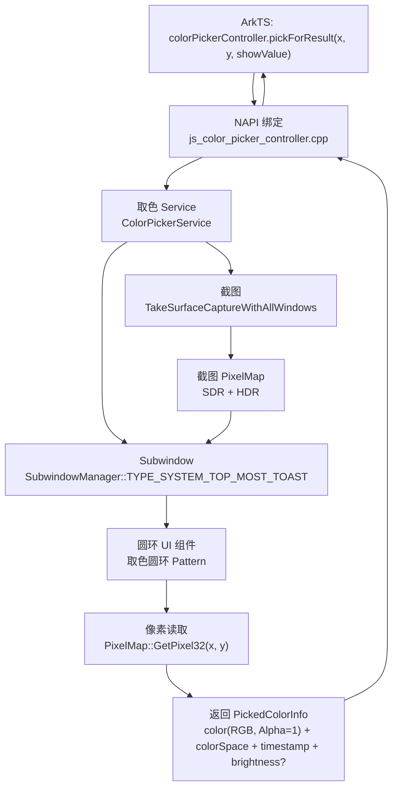
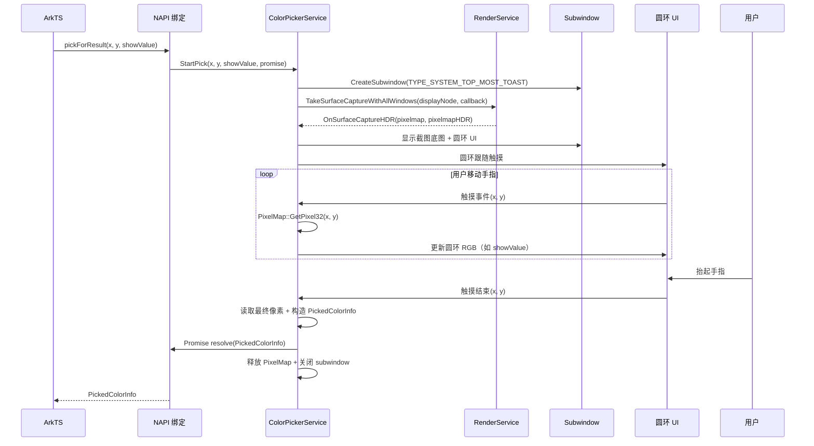

# 架构设计

> 全局取色器（colorPickerController）通过 NAPI 绑定 + 取色 Service + Subwindow 圆环 UI + TakeSurfaceCapture 截图 + PixelMap 像素读取，为应用提供系统级全局取色能力。

## 设计元数据

| 字段 | 内容 |
|------|------|
| Design ID | DESIGN-Func-04-26-01 |
| 关联需求 | FEAT-COLORPICKER / 20260807938436 |
| 关联 design-docs PR | [OpenHarmonyAI/design-docs#109](https://gitcode.com/OpenHarmonyAI/design-docs/pull/109) |
| 关联 docs PR | [openharmony/docs#162671](https://gitcode.com/openharmony/docs/pull/162671) |
| 目标 Feature | Feat-01 |
| 复杂度 | 中等（5 人月） |
| 目标版本 | OpenHarmony-7.1（@since 26.2.0） |
| Owner | ArkUI SIG + API SIG |
| 状态 | Draft |

## 需求基线摘要

- 新增全局取色 `colorPickerController` Public API（@since 26.2.0），d.ts 已声明，C++ 实现 + NAPI 绑定完全缺失
- `colorPickerController.pickForResult(x?, y?, showValue?): Promise<PickedColorInfo>` — 启动取色，显示圆环 UI，用户抬起手指后返回颜色值
- `PickedColorInfo`：`color`（RGB，Alpha 固定 1）、`colorSpace`、`timestamp`、`brightness?`（HDR）
- 取色圆环 UI 为系统级顶层覆盖（SubwindowManager subwindow），截图遮盖底图
- 全屏截图通过 `TakeSurfaceCaptureWithAllWindows`（RenderService），支持 SDR+HDR
- 截图 PixelMap 取色完成后立即释放，不持久化、不传输到应用层
- 像素值直接从截图 PixelMap 读取触点坐标像素（非 effectKit dominant/average 计算）
- 视频音频不暂停
- 错误码：401（参数错误）、801（设备不支持）、权限错误、截图失败错误

## 代码事实基线

| 事实项 | 代码引用（文件:行） | 对设计的约束 |
|--------|-------------------|-------------|
| d.ts 已声明 `colorPickerController` 命名空间 + `PickedColorInfo` 接口 | `interface/sdk-js/api/@ohos.arkui.colorPickerController.d.ts:102-130,34-79` | API 签名以 d.ts 为真相源 |
| NAPI 目录为空 | `interfaces/napi/kits/eyedropper_picker/`（0 文件） | 需新建 NAPI 模块 |
| NAPI 聚合未注册 | `interfaces/napi/kits/napi_lib.gni:17-54` | 需在 `napi_lib.gni` 添加 `arkui/color_picker_controller` |
| NAPI 模块注册模式参考 | `interfaces/napi/kits/color_sampler/js_color_sampler.cpp:395-420` | `napi_module` + `__attribute__((constructor))` + `nm_modname` |
| TakeSurfaceCapture 接口 | `foundation/graphic/graphic_2d/rosen/modules/render_service_client/core/transaction/rs_interfaces.h:422-424` | `TakeSurfaceCaptureWithAllWindows` — 全屏截图含所有窗口 |
| SurfaceCaptureCallback 回调 | `foundation/graphic/graphic_2d/rosen/modules/render_service_base/include/transaction/rs_client_render_comm_def_info.h:24-33` | `OnSurfaceCapture(pixelmap)` + `OnSurfaceCaptureHDR(pixelmap, pixelmapHDR)` |
| ace_engine 截图 precedent | `frameworks/core/components_ng/render/adapter/component_snapshot.cpp:36-129` | `CustomizedCallback : public SurfaceCaptureCallback`；CaptureError→ACE 错误码映射 |
| SubwindowManager 单例 | `frameworks/base/subwindow/subwindow_manager.h:78` | `GetInstance()` 单例；`AddSubwindow`/`RemoveSubwindow`/`GetSubwindow` |
| Subwindow 类型枚举 | `frameworks/base/subwindow/subwindow.h:47-57` | `SubwindowType::TYPE_SYSTEM_TOP_MOST_TOAST=0` — 系统顶层覆盖 |
| 像素读取：PixelMap 直接读 | `Media::PixelMap` 的 `GetPixel32(x, y)` | 从截图 PixelMap 直接读取触点坐标像素值，Alpha 固定为 1 |
| effectKit ColorPicker（不用于本场景） | `foundation/graphic/graphic_2d/rosen/modules/effect/color_picker/include/color_picker.h:76-146` | effectKit 计算 dominant/average 色，不适用于单像素读取 |

## 设计约束

1. **d.ts 为 API 真相源**：`colorPickerController` 命名空间签名、`PickedColorInfo` 接口以 d.ts 为准（`colorPickerController.d.ts:1-132`）。
2. **禁止手编 generated 文件**：`**/generated/` 不可直接修改。
3. **截图不持久化**：PixelMap 取色完成后立即释放，不写入磁盘，不传输到应用层。
4. **Alpha 固定为 1**：返回的 `PickedColorInfo.color` 的 Alpha 通道固定为 1（不透明），不从 PixelMap 读取 Alpha。
5. **视频音频不暂停**：取色仅视觉遮盖，不干预媒体播放。
6. **复用 TakeSurfaceCapture**：不新建截图接口，复用 graphic_2d 的 `TakeSurfaceCaptureWithAllWindows`。
7. **复用 SubwindowManager**：不新建窗口管理机制，复用 ace_engine 的 SubwindowManager。

## 非目标

- 手写笔其他高级特性（压感、倾斜检测等）
- 与历史接口签名完全一致
- ArkTS 独立 C API
- 存量接口废弃和 Kit 适配
- per-node ColorPicker（contrast/luminance）——不同特性，不修改

## 方案概述

整体技术路线为「NAPI 绑定 + 取色 Service + Subwindow 圆环 UI + TakeSurfaceCapture 截图 + PixelMap 像素读取」。

核心流程：
1. 应用调用 `colorPickerController.pickForResult(x, y, showValue)` → NAPI 绑定层将 JS 调用转为 C++ 取色 Service 调用
2. 取色 Service 创建 subwindow（系统顶层覆盖），在 subwindow 中渲染全屏截图底图 + 取色圆环 UI
3. Service 调用 `TakeSurfaceCaptureWithAllWindows` 获取全屏截图 PixelMap（SDR+HDR）
4. 截图 PixelMap 作为 subwindow 底图显示（遮盖效果）
5. 用户移动手指/触控笔 → 圆环跟随移动 → 实时从 PixelMap 读取触点像素值 → 如 `showValue=true` 在圆环上显示 RGB
6. 用户抬起手指 → 读取最终触点像素值 → 构造 `PickedColorInfo`（Alpha 固定 1）→ Promise resolve → 释放 PixelMap → 关闭 subwindow

## 架构图



## 模块影响

| 子系统 | 仓库 | 模块/路径 | 影响类型 | 相关设计决策 |
|--------|------|-----------|---------|-------------|
| ArkUI | ace_engine | `interfaces/napi/kits/eyedropper_picker/`（新建 `js_color_picker_controller.h/.cpp` + `BUILD.gn`） | 新增 NAPI 绑定模块 | ADR-1 |
| ArkUI | ace_engine | `interfaces/napi/kits/napi_lib.gni` | 新增模块到 `common_napi_libs` 聚合 | ADR-1 |
| ArkUI | ace_engine | `frameworks/core/components_ng/pattern/color_picker/`（新建 `color_picker_service.h/.cpp` + `color_picker_ring_pattern.h/.cpp`） | 新增取色 Service + 圆环 UI Pattern | ADR-2, ADR-3 |
| ArkUI | ace_engine | `frameworks/core/components_ng/`（复用 `component_snapshot.cpp` 的 SurfaceCaptureCallback 模式） | 复用截图 precedent | ADR-4 |
| ArkUI | ace_engine | `frameworks/base/subwindow/`（复用 SubwindowManager） | 复用 subwindow 机制 | ADR-3 |

## 关键设计决策

### ADR-1: NAPI 模块 — 新建 `eyedropper_picker` 目录 + `colorPickerController` 模块名

| 决策 ID | 问题 | 推荐方案 | 备选方案 | 选择理由 |
|---------|------|----------|----------|---------|
| ADR-1 | NAPI 绑定如何实现？ | 在 `interfaces/napi/kits/eyedropper_picker/` 新建 `js_color_picker_controller.h/.cpp` + `BUILD.gn`，模块名 `arkui.colorPickerController`；参照 `color_sampler` 模式 | 在 declarative_frontend JS 层实现 | NAPI 模块模式是 ace_engine 标准；`color_sampler` 是最近邻的兄弟模块 |

### ADR-2: 像素读取 — 直接从 PixelMap 读取，非 effectKit ColorPicker

| 决策 ID | 问题 | 推荐方案 | 备选方案 | 选择理由 |
|---------|------|----------|----------|---------|
| ADR-2 | 如何读取触点像素值？ | 从截图 PixelMap 直接调用 `GetPixel32(x, y)` 读取触点坐标的单像素值，Alpha 固定为 1 | 使用 effectKit ColorPicker 计算 dominant/average 色 | effectKit 计算整图主色/平均色，非单像素值；直接读取更简单、精确 |

### ADR-3: 圆环 UI — Subwindow 系统顶层覆盖

| 决策 ID | 问题 | 推荐方案 | 备选方案 | 选择理由 |
|---------|------|----------|----------|---------|
| ADR-3 | 圆环 UI 如何承载？ | 通过 `SubwindowManager` 创建 `TYPE_SYSTEM_TOP_MOST_TOAST` subwindow | 使用 OverlayManager 窗口内覆盖 | 取色圆环需全屏遮盖，是系统级顶层覆盖；OverlayManager 是窗口内覆盖，无法覆盖其他窗口 |

### ADR-4: 截图 — 复用 TakeSurfaceCaptureWithAllWindows

| 决策 ID | 问题 | 推荐方案 | 备选方案 | 选择理由 |
|---------|------|----------|----------|---------|
| ADR-4 | 如何获取全屏截图？ | 复用 graphic_2d 的 `TakeSurfaceCaptureWithAllWindows` | 新建截图接口 | ace_engine 已有 precedent；支持全屏含所有窗口；支持 SDR+HDR 回调 |

### ADR-5: 截图不持久化 — 取色完成后立即释放

| 决策 ID | 问题 | 推荐方案 | 备选方案 | 选择理由 |
|---------|------|----------|----------|---------|
| ADR-5 | 截图 PixelMap 生命周期？ | 取色完成后立即释放，不持久化、不传输到应用层 | 缓存 PixelMap 供多次取色 | 隐私合规约束：截图含屏幕内容，不应持久化或暴露 |

## 状态归属与不变量

- **Ownership**: 取色状态 owner 为 `ColorPickerService`，key 为 `isPicking_`（bool）、`pixelMap_`（`shared_ptr<Media::PixelMap>`）、`promise_`（`napi_ref`），创建时机为 `pickForResult` 调用，清理触发为取色完成/取消。
- **Lifecycle**: `pixelMap_` 创建于 `OnSurfaceCapture` 回调，释放于取色结束；`promise_` 创建于 NAPI 层，resolve/reject 于取色完成/失败。不变量：PixelMap 不持久化。
- **Concurrency**: 取色 Service 在 UI 线程管理 subwindow；`TakeSurfaceCapture` 回调在 RenderService 线程，需 PostTask 到 UI 线程更新 UI。
- **Compatibility**: 新增 opt-in API，不影响现有应用。

### 状态机

```
取色状态流转：

[空闲] → pickForResult(x, y, showValue)
    ↓
[启动中] 创建 subwindow + 调用 TakeSurfaceCaptureWithAllWindows
    ├─ 截图成功 → [OnSurfaceCapture] 获取 PixelMap → [取色中] 显示截图底图 + 圆环
    │       ↓
    │   用户移动手指/触控笔 → 圆环跟随 → 实时读取像素 → 显示 RGB（如 showValue=true）
    │       ↓
    │   用户抬起手指 → 读取最终像素 → 构造 PickedColorInfo → Promise resolve
    │       ↓
    │   [清理] 释放 PixelMap + 关闭 subwindow → [空闲]
    │
    ├─ 截图失败 → [错误] Promise reject（截图失败错误码）→ [空闲]
    └─ 权限未授予 → [错误] Promise reject（权限错误码）→ [空闲]
```

## 时序设计



## 风险与缓解

| 风险 | 可能性 | 影响 | 缓解措施 |
|------|--------|------|----------|
| TakeSurfaceCapture 延迟导致圆环显示滞后 | 中 | 用户体验差 | 先显示圆环 UI（空底图），截图到达后再填充底图 |
| HDR 像素读取不正确 | 中 | brightness 值错误 | 参照 component_snapshot.cpp 的 HDR 处理路径 |
| PixelMap 内存泄漏 | 低 | 内存泄漏 | 取色结束/取消/异常路径均确保释放 PixelMap |
| 触摸事件与 subwindow 事件分发冲突 | 中 | 圆环不跟随 | 确保 subwindow 接管触摸事件 |
| 非触摸设备调用 | 低 | 用户体验差 | 启动时检查设备类型，不支持则抛出 801 |

## API 签名

### 新增 Public API（d.ts 已声明）

```typescript
// colorPickerController.d.ts:34-79
interface PickedColorInfo {
  color: common2D.Color;
  colorSpace: colorSpaceManager.ColorSpace;
  timestamp: number;
  brightness?: number;
}

// colorPickerController.d.ts:102-130
declare namespace colorPickerController {
  function pickForResult(
    x?: number,
    y?: number,
    showValue?: boolean
  ): Promise<PickedColorInfo>;
}
// @syscap SystemCapability.ArkUI.ArkUI.Full
// @since 26.2.0 dynamic
// @throws { BusinessError } 401 - Parameter error.
// @throws { BusinessError } 801 - Capability not supported on current device.
```

### 新增 C/NDK API

```c
// 头文件: native_type.h
int32_t OH_ArkUI_ColorPickerController_PickForResult(
    int32_t x, int32_t y, bool showValue, ArkUI_PickForResultCallback callback);

typedef struct {
    uint32_t alpha;
    uint32_t red;
    uint32_t green;
    uint32_t blue;
    OH_NativeColorSpaceManager* colorSpace;
    uint64_t timestamp;
    float brightness;
} ArkUI_PickedColorInfo;

typedef void (*ArkUI_PickForResultCallback)(
    int32_t errCode, const ArkUI_PickedColorInfo* result);
```

## BUILD.gn / bundle.json 影响

- `interfaces/napi/kits/eyedropper_picker/BUILD.gn` — 新建（参照 `color_sampler/BUILD.gn` 模板）
- `interfaces/napi/kits/napi_lib.gni` — 在 `common_napi_libs` 中添加 `arkui/color_picker_controller`
- `frameworks/core/components_ng/pattern/color_picker/BUILD.gn` — 新建（如需独立编译目标）
- 不修改现有 `BUILD.gn`、`bundle.json`（新文件）

## 交付跟踪

| 仓库 | PR | 状态 |
|------|-----|------|
| openharmony/arkui_ace_engine | [#89119](https://gitcode.com/openharmony/arkui_ace_engine/pull/89119) | open |
| openharmony/interface_sdk-js | [#35427](https://gitcode.com/openharmony/interface_sdk-js/pull/35427) | open |
| openharmony/interface_sdk_c | [#6122](https://gitcode.com/openharmony/interface_sdk_c/pull/6122) | open |
| openharmony/docs | [#162671](https://gitcode.com/openharmony/docs/pull/162671) | open |
