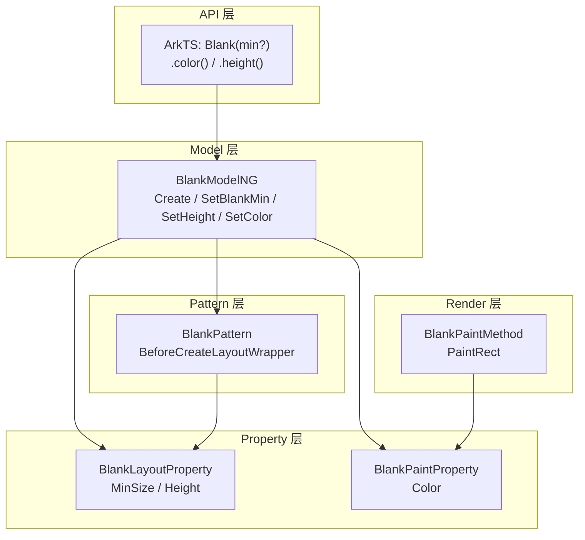

# 架构设计

> Blank 组件是 ArkUI 布局类组件中的空白占位组件，在 Row/Column/Flex 等弹性容器中自动填充剩余空间。

## 设计元数据

| 字段 | 内容 |
|------|------|
| Design ID | DESIGN-Func-05-01-01 |
| 关联需求 | 已有能力补录（无独立 requirement.md） |
| 关联 Epic | 无 |
| 目标 Feature | Feat-01 Blank 组件 |
| 复杂度 | 中等 |
| 目标版本 | API 7 起支持，API 10 有核心行为变更 |
| Owner | ArkUI SIG |
| 状态 | Baselined（已有实现补录） |

## 需求基线

| 字段 | 内容 |
|------|------|
| 问题陈述 | 在弹性布局中需要一种占位组件，能自动填充容器剩余空间并提供最小尺寸保证 |
| 核心目标 | （Feat-01）提供 Blank 空白占位组件，支持 min/color/height 三个自有属性，API 10+ 具备父容器方向感知的自动 Flex 布局能力 |
| P0 AC | AC-1.1 ~ AC-1.6（创建与参数）、AC-2.1 ~ AC-2.4（颜色）、AC-3.1 ~ AC-3.3（高度）、AC-4.1 ~ AC-4.8（自动布局） |

## 上下文和现状

### 涉及仓和模块

| 仓库 | 模块路径 | 当前职责 | 本 Feature 影响 |
|------|----------|----------|-----------------|
| ace_engine | `frameworks/core/components_ng/pattern/blank/` | Blank 组件 Pattern/LayoutProperty/PaintProperty 定义 | 全量涉及 |
| ace_engine | `frameworks/core/components_ng/pattern/blank/blank_model_ng.cpp` | Blank NG Model 层，创建和属性设置 | 全量涉及 |
| ace_engine | `frameworks/bridge/declarative_frontend/jsview/js_blank.cpp` | JS 桥接层，处理 JS→C++ 调用 | 全量涉及 |
| ace_engine | `frameworks/bridge/declarative_frontend/ark_component/src/ArkBlank.ts` | ArkTS 组件定义 | 全量涉及 |
| ace_engine | `frameworks/core/components_v2/inspector/blank_composed_element.cpp` | Inspector 诊断支持 | 全量涉及 |

### 调用链层级分析

| 层 | 模块 | 职责 | 修改类型 |
|----|------|------|----------|
| JS Bridge | `frameworks/bridge/declarative_frontend/jsview/js_blank.cpp/.h` | JS→C++ 调用桥接，解析 Blank 构造参数和属性 | 无修改（规格补录） |
| JS Bridge (Model) | `frameworks/bridge/declarative_frontend/jsview/models/blank_model_impl.cpp/.h` | 旧框架 Model 实现（Bridge 侧） | 无修改（规格补录） |
| ArkTS Modifier | `frameworks/bridge/declarative_frontend/ark_component/src/ArkBlank.ts` | ArkTS 组件定义，属性修改器 | 无修改（规格补录） |
| Model | `frameworks/core/components_ng/pattern/blank/blank_model_ng.cpp/.h` | NG Model 层：Create + SetBlankMin/SetHeight/SetColor | 无修改（规格补录） |
| Pattern | `frameworks/core/components_ng/pattern/blank/blank_pattern.cpp/.h` | 自动 Flex 布局逻辑（BeforeCreateLayoutWrapper），API 版本门控 | 无修改（规格补录） |
| LayoutProperty | `frameworks/core/components_ng/pattern/blank/blank_layout_property.h` | 存储 MinSize/Height，脏标记 PROPERTY_UPDATE_MEASURE_SELF_AND_PARENT | 无修改（规格补录） |
| PaintProperty | `frameworks/core/components_ng/pattern/blank/blank_paint_property.h` | 存储 Color，脏标记 PROPERTY_UPDATE_RENDER | 无修改（规格补录） |
| Paint | `frameworks/core/components_ng/pattern/blank/blank_paint_method.cpp/.h` | 绘制带颜色的矩形（PaintRect） | 无修改（规格补录） |
| C-API | `frameworks/core/interfaces/native/node/blank_modifier.cpp/.h` | C API 属性 Set/Reset 委托层 | 无修改（规格补录） |

### 适用架构规则

| 规则 ID | 设计结论 |
|---------|----------|
| OH-ARCH-01 | 组件遵循 Pattern-Property-PaintMethod 三层架构 |
| OH-ARCH-02 | 布局属性与渲染属性分离存储（LayoutProperty vs PaintProperty） |
| OH-ARCH-03 | API 版本差异通过 Container::LessThanAPIVersion 门控 |

## 不涉及项承接

| 维度 | 结论 |
|------|------|
| 性能 | N/A — Blank 为轻量组件，无额外性能设计 |
| 安全与权限 | N/A — Blank 不涉及安全敏感操作 |
| 兼容性 | 展开设计 — API 9 vs 10 FlexShrink 差异需兼容性声明 |
| API/SDK | 展开设计 — ArkTS API 签名需与 SDK 定义交叉验证 |
| IPC/跨进程 | N/A — Blank 为纯 UI 组件，不涉及 IPC |
| 构建与部件 | N/A — Blank 源码已包含在 ace_core_ng_source_set 中 |

## 关键设计决策

| 决策 ID | 问题 | 推荐方案 | 探索过的替代方案 | 取舍理由 | 影响 |
|---------|------|----------|------------------|----------|------|
| ADR-1 | Blank 如何自动填充剩余空间 | 通过在每次布局前（BeforeCreateLayoutWrapper）动态设置 FlexGrow/FlexShrink/AlignSelf | 在创建时静态设置（API < 10 方式） | 动态方式可响应布局属性变化，支持条件性设置（有显式尺寸时不设置） | API >= 10 的自动布局行为更灵活，但会覆盖外部显式设置的 Flex 属性 |
| ADR-2 | FlexShrink 在 API 10 的默认值 | 1.0（可收缩） | 0.0（不可收缩，与 API 9 一致） | API 10 改为 1.0 使 Blank 在空间不足时等比收缩，避免溢出 | API 版本间行为不兼容，需在兼容性声明中标注 |
| ADR-3 | min 负值处理策略 | 静默钳位为 0.0 VP | 抛出异常或使用绝对值 | 静默钳位保持向后兼容，不中断应用运行 | 开发者不会收到负值警告 |
| ADR-4 | min 属性在 API < 10 的实现 | 同时设置 FlexBasis 和 MinSize | 仅设置 FlexBasis | 双写确保 API 9 行为一致（FlexBasis 影响 Flex 布局） | API 9 的 min 参数对 FlexBasis 有副作用 |
| ADR-5 | 属性脏标记分级 | MinSize/Height 使用 PROPERTY_UPDATE_MEASURE_SELF_AND_PARENT；Color 使用 PROPERTY_UPDATE_RENDER | 统一使用 PROPERTY_UPDATE_MEASURE | 分级减少不必要的重测量：颜色变更仅触发重绘，不影响布局 | 性能优化，需开发者理解不同属性的更新代价 |

## 设计骨架

### 骨架范围

| 骨架项 | 目标 | 不包含 | 验证方式 |
|--------|------|--------|----------|
| BlankLayoutProperty | 存储 MinSize/Height | 其他布局属性 | 代码审查 |
| BlankPaintProperty | 存储 Color | 其他渲染属性 | 代码审查 |
| BlankPattern | 自动布局逻辑 | 手势/焦点处理 | 单元测试 |
| BlankModelNG | 创建和属性设置 API | 旧版 Model 实现 | 单元测试 |

### 骨架 Spec 拆分

| Task ID | 目标 | 受影响文件 | AC |
|---------|------|------------|-----|
| TASK-SKELETON-1 | BlankLayoutProperty 定义 | `blank_layout_property.h` | AC-1.2, AC-3.3 |
| TASK-SKELETON-2 | BlankPaintProperty 定义 | `blank_paint_property.h` | AC-2.1, AC-2.2 |
| TASK-SKELETON-3 | BlankPattern 自动布局 | `blank_pattern.cpp` | AC-4.1 ~ AC-4.8 |
| TASK-SKELETON-4 | BlankModelNG 创建流程 | `blank_model_ng.cpp` | AC-1.1, AC-1.5, AC-1.6 |

## 后续 Task 拆分

| Task ID | 目标 | 受影响文件 | 依赖 |
|---------|------|------------|------|
| TASK-1 | Blank 组件全部行为规格 | Feat-01-blank-component-spec.md | 无 |

## API 签名、Kit 与权限

### 新增 API

| API 签名 | 类型 | d.ts 位置 | 权限要求 | SysCap |
|----------|------|-----------|----------|--------|
| `Blank(min?: Length)` | Public | `blank.d.ts` | - | - |
| `color(value: ResourceColor): T` | Public | `common.d.ts` | - | - |
| `height(value: Length): T` | Public | `common.d.ts` | - | - |

### 变更/废弃 API

| 原有 API | 变更类型 | 新 API | 迁移说明 |
|----------|----------|--------|----------|
| — | — | — | 无变更/废弃 API |

## 构建系统影响

### BUILD.gn 变更

```
无变更。Blank 组件实现位于 ace_core_ng_source_set，已有构建配置覆盖。
```

### bundle.json 变更

无变更。

## 可选设计扩展

### 架构图



### 数据流/控制流

| 步骤 | 调用方 | 被调用方 | 数据/接口 | 说明 |
|------|--------|----------|-----------|------|
| 1 | ArkTS | BlankModelNG::Create | — | 创建 FrameNode（tag=V2::BLANK_ETS_TAG） |
| 2 | Create | BlankLayoutProperty | FlexGrow/FlexShrink/AlignSelf/Height (API<10) 或 ResetCalcMinSize (API>=10) | 按 API 版本设置初始属性 |
| 3 | ArkTS | BlankModelNG::SetBlankMin | Dimension min | 设置最小尺寸，负值钳位为 0 |
| 4 | BlankPattern | BeforeCreateLayoutWrapper | 父容器类型 + selfIdealSize | API>=10 时动态计算 Flex 属性 |
| 5 | BeforeCreateLayoutWrapper | BlankLayoutProperty | FlexGrow/FlexShrink/AlignSelf/CalcMinSize | 根据主轴/交叉轴条件设置 |
| 6 | BlankPaintMethod | PaintRect | Color + LayoutSize | 绘制带颜色的矩形 |

### 数据模型设计

**ArkTS (API 层类型)**

```typescript
interface BlankAttribute extends CommonMethod<BlankAttribute> {
  color(value: ResourceColor): BlankAttribute;
  height(value: Length): this;
}

// 构造函数
declare function Blank(min?: Length): BlankAttribute;
```

**C++ (框架层结构)**

```cpp
// 布局属性
struct BlankLayoutProperty : LayoutProperty {
  std::optional<Dimension> propMinSize_;  // 最小尺寸
  std::optional<Dimension> propHeight_;   // 显式高度
  // 脏标记: PROPERTY_UPDATE_MEASURE_SELF_AND_PARENT
};

// 渲染属性
struct BlankPaintProperty : PaintProperty {
  std::optional<Color> propColor_;  // 背景颜色，默认 TRANSPARENT
  // 脏标记: PROPERTY_UPDATE_RENDER
};
```

## 详细设计

### Blank 组件创建流程

**创建入口**: `BlankModelNG::Create()` (`blank_model_ng.cpp:23-41`)

```
1. ClaimNodeId() 获取节点 ID
2. FrameNode::GetOrCreateFrameNode(BLANK_ETS_TAG, nodeId, BlankPattern)
3. IF API < 10:
     设置 FlexGrow=1.0, FlexShrink=0.0, AlignSelf=STRETCH, Height=0.0VP
   ELSE:
     ResetCalcMinSize()
4. Push 到 ViewStackProcessor
```

### 自动 Flex 布局算法（API >= 10）

**入口**: `BlankPattern::BeforeCreateLayoutWrapper()` (`blank_pattern.cpp:69-114`)

```
1. 获取 host 节点和父节点
2. IF API < 10: RETURN（不执行动态计算）
3. 获取父容器的 FlexDirection:
   - Row → ROW
   - Column → COLUMN
   - Flex → 读取 FlexLayoutProperty.flexDirection
   - 其他 → ROW（默认）
4. ResetAlignSelf / ResetFlexGrow / ResetFlexShrink
5. 检查 selfIdealSize:
   - 主轴有显式值 → mainAxisHasSize=true
   - 交叉轴有显式值 → crossAxisHasSize=true
6. IF !crossAxisHasSize → AlignSelf=STRETCH
7. IF !mainAxisHasSize → FlexGrow=1.0, FlexShrink=1.0
8. IF MinSize 有值:
   - IF 父容器为 Row AND CalcMinSize.Width 无值
       → UpdateCalcMinSize(CalcLength(blankMin), nullopt)
   - IF 父容器为 Column AND CalcMinSize.Height 无值
       → UpdateCalcMinSize(nullopt, CalcLength(blankMin))
```

### 属性脏标记策略

| 属性 | 存储位置 | 脏标记 | 触发范围 |
|------|----------|--------|----------|
| MinSize | BlankLayoutProperty | PROPERTY_UPDATE_MEASURE_SELF_AND_PARENT | 自身 + 父节点重新测量 |
| Height | BlankLayoutProperty | PROPERTY_UPDATE_MEASURE_SELF_AND_PARENT | 自身 + 父节点重新测量 |
| Color | BlankPaintProperty | PROPERTY_UPDATE_RENDER | 仅自身重绘 |

**设计理由**: MinSize 和 Height 变更会影响 Flex 容器的布局分配，因此需要父节点重新测量。Color 变更仅影响渲染外观，不需要重新布局。

### 绘制逻辑

**入口**: `BlankPaintMethod::PaintRect()` (`blank_paint_method.cpp:25-56`)

```
1. 获取 BlankPaintProperty，默认 Color=TRANSPARENT
2. 获取 LayoutSize 和 Offset
3. 创建 Brush，设置颜色
4. 绘制 Rect（额外 +1px 处理像素对齐）
5. Rosen 后端：设置 DrawRegion
```

## 风险和开放问题

| 项 | 类型 | 影响 | 处理方式 | Owner |
|----|------|------|----------|-------|
| API 9→10 FlexShrink 行为变更 | 兼容性 | 高 | 在兼容性声明中标注，提供迁移指导 | ArkUI SIG |
| BeforeCreateLayoutWrapper 每次布局前 Reset Flex 属性 | 架构 | 中 | 文档化行为，建议开发者在 OnModifyDone 中设置自定义 Flex | ArkUI SIG |
| 非 Flex 系父容器默认按 ROW 处理 | 文档 | 低 | 在规格中明确说明默认行为 | ArkUI SIG |
| min 负值静默钳位无警告 | API | 低 | 保持当前行为（不中断应用），在文档中说明 | ArkUI SIG |
| SDK height() 未声明为 Blank 专有方法 | 文档 | 中 | SDK 仅声明 color()，height() 继承自 CommonMethod；但内部 ArkBlankComponent 覆写 height 存入 BlankLayoutProperty::propHeight_。在规格兼容性声明中标注 | ArkUI SIG |
| SDK 构造参数 min 类型不含 Resource | 兼容性 | 低 | SDK 签名为 `number \| string`，但 JS 桥接层接受 Dimension 解析。在规格中标注为 SDK-vs-源码偏差 | ArkUI SIG |
| height 设置与重置走不同属性路径 | 架构 | 高 | SetBlankHeight 写入 BlankLayoutProperty::propHeight_；resetBlankHeight 清除通用 LayoutProperty::selfIdealSize.Height。BeforeCreateLayoutWrapper 仅检查 selfIdealSize。resetBlankHeight 后 propHeight_ 残留但无实际布局效果 | ArkUI SIG |

## 设计审批

- [x] 需求基线已确认，设计覆盖 P0/P1 AC
- [x] 不涉及项已承接，N/A 和展开项都有结论
- [x] 涉及仓和模块职责清楚
- [x] 适用架构规则已识别并形成设计结论
- [x] 分层和子系统边界合规
- [x] API 变更有签名、权限、错误码和兼容性说明
- [x] BUILD.gn/bundle.json 影响明确
- [x] 设计输出和后续 Task 拆分明确
- [x] 关键设计决策有理由和影响说明
- [x] 风险和开放问题有 Owner

**结论:** 通过（已有实现补录）
