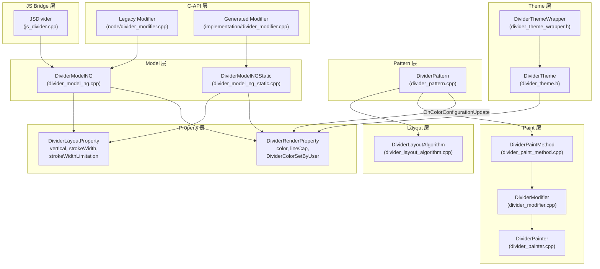

# 架构设计

> 确认目标仓和模块的架构约束、关键设计决策、Spec 拆分方向。

## 设计元数据

| 属性 | 值 |
|------|-----|
| Design ID | DESIGN-Func-05-01-02 |
| 关联需求 | 已有能力补录（无独立 requirement.md） |
| 关联 Epic | 无 |
| 目标 Feature | Feat-01: Divider 组件全量规格 |
| 复杂度 | 简单 |
| 目标版本 | API 7+ |
| Owner | ArkUI SIG |
| 状态 | Baselined（已有实现补录） |

## 需求基线

> 需求基线详见 proposal.md。以下仅列出设计阶段需要额外强调的要点。

| 项 | 补充说明（如需） |
|----|------------------|
| Divider 为纯视觉组件 | 无交互行为、无子组件、不可获焦。设计仅涉及布局和绘制两个阶段 |
| strokeWidth 默认值有版本分支 | API<10 取 DividerTheme::GetStokeWidth()（1.0_vp），API>=10 取 1.0_px |
| 颜色主题跟随 | 未用户设色时自动跟随深色/浅色模式切换，用户设色后锁定 |

## 上下文和现状

### 涉及仓和模块

| 仓库 | 补充架构说明 |
|------|-------------|
| foundation/arkui/ace_engine | Divider 实现完全在 ace_engine 内部，不依赖外部子系统 |

### 调用链层级分析

| 层 | 模块 | 职责 | 修改类型 |
|----|------|------|---------|
| JS Bridge 层 | `frameworks/bridge/declarative_frontend/jsview/js_divider.cpp` | 解析 JS 参数，分发到 DividerModel | 无修改（补录） |
| Model 层 | `frameworks/core/components_ng/pattern/divider/divider_model_ng.cpp` | 属性写入到 LayoutProperty / RenderProperty | 无修改（补录） |
| Model 层（静态） | `frameworks/core/components_ng/pattern/divider/divider_model_ng_static.cpp` | 静态前端的属性写入（optional 参数风格） | 无修改（补录） |
| Layout Property 层 | `frameworks/core/components_ng/pattern/divider/divider_layout_property.h` | 存储 vertical, strokeWidth, strokeWidthLimitation | 无修改（补录） |
| Render Property 层 | `frameworks/core/components_ng/pattern/divider/divider_render_property.h` | 存储 color, lineCap, DividerColorSetByUser | 无修改（补录） |
| Pattern 层 | `frameworks/core/components_ng/pattern/divider/divider_pattern.cpp` | OnDirtyLayoutWrapperSwap 缓存布局结果；OnColorConfigurationUpdate 处理主题切换 | 无修改（补录） |
| Layout Algorithm 层 | `frameworks/core/components_ng/pattern/divider/divider_layout_algorithm.cpp` | MeasureContent：根据 vertical/strokeWidth 计算尺寸，裁剪 constrainStrokeWidth | 无修改（补录） |
| Paint Method 层 | `frameworks/core/components_ng/pattern/divider/divider_paint_method.cpp` | UpdateContentModifier：ROUND/SQUARE 端点时补偿长度和偏移 | 无修改（补录） |
| Modifier 层 | `frameworks/core/components_ng/pattern/divider/divider_modifier.cpp` | onDraw：BUTT→SQUARE 隐式升级；委托 DividerPainter 绘制 | 无修改（补录） |
| Painter 层 | `frameworks/core/components_ng/render/divider_painter.cpp` | DrawLine：RSPen 绘制分割线，BUTT 和 SQUARE/ROUND 有不同坐标计算 | 无修改（补录） |
| Theme 层 | `frameworks/core/components/divider/divider_theme.h` + `divider_theme_wrapper.h` | 提供默认 color 和 strokeWidth；token theme 仅覆盖 color | 无修改（补录） |
| C-API Legacy 层 | `frameworks/core/interfaces/native/node/divider_modifier.cpp` | 4 属性 set/reset，通过 DividerModelNG 静态方法操作 FrameNode | 无修改（补录） |
| C-API Generated 层 | `frameworks/core/interfaces/native/implementation/divider_modifier.cpp` | 4 属性 set（optional 参数风格），通过 DividerModelNGStatic 操作 FrameNode | 无修改（补录） |

- [x] 调用链每一层都已覆盖（从最上层到最底层）
- [x] 每层职责边界清晰，无跨层违规调用
- [x] 每层修改类型明确

### 适用架构规则

| Rule ID | 适用原因 | 设计结论 | 验证方式 |
|---------|---------|---------|---------|
| OH-ARCH-LAYERING | JS Bridge → Model → Property → Algorithm/Paint 标准四层 | 调用方向单向向下，无反向依赖 | 代码评审 |
| OH-ARCH-SUBSYSTEM | Divider 不依赖外部子系统 | N/A — 无跨子系统调用 | N/A |
| OH-ARCH-IPC-SAF | N/A — 纯 UI 组件 | 无 IPC 调用 | N/A |
| OH-ARCH-API-LEVEL | Divider 全部 API 为 Public，@since 7 | SysCap: SystemCapability.ArkUI.ArkUI.Full，无权限要求 | API 评审 |
| OH-ARCH-COMPONENT-BUILD | Divider 已在现有 BUILD.gn 中 | 无 BUILD.gn 变更 | 构建验证 |
| OH-ARCH-ERROR-LOG | 无自定义错误码 | 无效输入静默回退到默认值，不输出错误码 | 单测 |

## 不涉及项承接

| 维度 | 设计结论 |
|------|---------|
| 子组件支持 | N/A — Divider 为叶子节点，不接受子组件 |
| 焦点/键盘交互 | N/A — FocusType=NODE 不可获焦 |
| 手势/事件 | N/A — 无自定义手势识别器；支持通用事件（onTouch/onClick 等由 JSInteractableView 继承） |
| 动画 | 仅 strokeWidth 和 color 为 AnimatableProperty，可参与隐式动画 |
| 无障碍 | N/A — 纯视觉分割线，无无障碍 action |

## 关键设计决策

| 决策 ID | 问题 | 推荐方案 | 探索过的替代方案 | 取舍理由 | 影响 |
|---------|------|---------|----------------|---------|------|
| ADR-1 | strokeWidth 默认值在 API 10 前后不同 | API>=10 固定 1.0_px，API<10 取 DividerTheme | 方案 B：统一使用 theme 值 | 1px 是物理像素，跨设备渲染一致性更好；但 API<10 存量应用需保持兼容 | strokeWidth 未设时不同 API 版本渲染可能不同 |
| ADR-2 | LineCap BUTT 在 strokeWidthLimitation=true 时被隐式升级为 SQUARE | 在 DividerModifier::onDraw 中替换 | 方案 B：在 Model 层直接存 SQUARE | 保持 Property 层存储用户原始值，仅在最终绘制阶段做转换，方便 Inspector 回显 | 用户设 BUTT 但实际绘制 SQUARE，可能导致混淆 |
| ADR-3 | 用户设色后主题切换是否覆盖颜色 | DividerColorSetByUser 标志追踪，用户设色后不覆盖 | 方案 B：始终跟随主题 | 用户显式设置的颜色应被尊重，否则会导致预期外的视觉变化 | 需在 ResetDividerColor 时清除标志 |
| ADR-4 | C-API 存在 legacy 和 generated 两套 modifier 路径 | legacy 通过 DividerModelNG 静态方法，generated 通过 DividerModelNGStatic | 方案 B：统一为一套 | generated 是静态前端的新路径，使用 optional 参数风格更符合新架构；legacy 需保持兼容 | Reset 语义不同：legacy 清空值，generated 回退到 theme 色 |
| ADR-5 | Token Theme 仅覆盖 color 不覆盖 strokeWidth | ApplyTokenTheme 中只设 color_ | 方案 B：同时覆盖 strokeWidth | strokeWidth 的 token 值无标准定义，theme 仅提供 color token | 切换 token theme 时 strokeWidth 保持不变 |

## 设计骨架

### 骨架范围

| 骨架项 | 目标 | 不包含 | 验证方式 |
|--------|------|--------|---------|
| Divider 全量 4 属性规格 | 覆盖 vertical/color/strokeWidth/lineCap 的行为、布局、绘制、主题适配 | 不含通用属性（width/height/padding 等由通用属性 spec 覆盖） | UT + 手动验证 |

### 骨架 Spec 拆分

| Task ID | 目标 | 受影响文件 | AC |
|---------|------|-----------|-----|
| TASK-SKELETON-1 | Feat-01 Divider 全量规格 | divider_model*.cpp/h, divider_pattern*.cpp/h, divider_layout_*.cpp/h, divider_paint_*.cpp/h, divider_modifier*.cpp/h, js_divider.cpp/h | AC-1.1~AC-2.5 |

## 后续 Task 拆分

| Task ID | 目标 | 受影响文件 | 依赖 |
|---------|------|-----------|------|
| TASK-01 | Feat-01 Divider 全量规格基线 | 见骨架 Spec 拆分 | 无 |

## API 签名、Kit 与权限

### 新增 API

N/A — 已有能力补录，无新增 API。

### 变更/废弃 API

N/A — 无 API 变更。

**已有 API 签名参考（补录）：**

| API 签名 | 类型 | Kit | d.ts 位置 | 权限要求 | SysCap |
|---------|------|-----|-----------|---------|--------|
| `Divider(): DividerAttribute` | Public | ArkUI | `@internal/component/ets/divider.d.ts` | 无 | SystemCapability.ArkUI.ArkUI.Full |
| `.vertical(value: boolean): DividerAttribute` | Public | ArkUI | 同上 | 无 | 同上 |
| `.color(value: ResourceColor): DividerAttribute` | Public | ArkUI | 同上 | 无 | 同上 |
| `.strokeWidth(value: number \| string): DividerAttribute` | Public | ArkUI | 同上 | 无 | 同上 |
| `.lineCap(value: LineCapStyle): DividerAttribute` | Public | ArkUI | 同上 | 无 | 同上 |

## 构建系统影响

### BUILD.gn 变更

无变更 — Divider 已在现有 BUILD.gn 中注册。

### bundle.json 变更

无变更。

## 可选设计扩展

### 架构图



### 数据模型设计

**Property 存储结构：**

```typescript
// DividerLayoutProperty (触发 PROPERTY_UPDATE_MEASURE)
interface DividerLayoutProperty extends LayoutProperty {
    Vertical?: boolean;          // 默认 false（水平）
    StrokeWidth?: Dimension;     // 默认 1px(API>=10) / theme(API<10)
    StrokeWidthLimitation?: boolean; // 默认 true（内部属性）
}

// DividerRenderProperty (触发 PROPERTY_UPDATE_RENDER)
interface DividerRenderProperty extends PaintProperty {
    DividerColor?: Color;        // 默认 DividerTheme::GetColor()
    DividerColorSetByUser?: boolean; // 默认 false（内部标志）
    LineCap?: LineCap;           // 默认 LineCap::BUTT
}
```

**DividerModifier 动画属性：**

| 属性 | 类型 | 可动画 |
|------|------|--------|
| strokeWidth_ | AnimatablePropertyFloat | 是 |
| color_ | AnimatablePropertyColor | 是 |
| dividerLength_ | PropertyFloat | 否 |
| lineCap_ | PropertyInt | 否 |
| vertical_ | PropertyBool | 否 |
| offset_ | PropertyOffsetF | 否 |
| strokeWidthLimitation_ | PropertyBool | 否 |

## 详细设计

### 布局算法（MeasureContent）

**源码**: `divider_layout_algorithm.cpp:26-73`

```
输入: vertical, strokeWidth, selfIdealSize, percentReference, contentConstraint
输出: SizeF(constrainStrokeWidth 或 dividerLength, ...)

1. 解析 strokeWidth → 像素值（不为正则用默认值）
2. 读 vertical（默认 false）
3. 水平分割线:
   - dividerLength = selfIdealSize.Width() ?? percentReference.Width()
   - constrainStrokeWidth = strokeWidth
   - if strokeWidthLimitation: constrainStrokeWidth = min(constrainStrokeWidth, dividerLength)
   - if selfIdealSize.Height() 有值: constrainStrokeWidth = min(constrainStrokeWidth, height)
   - 结果: SizeF(dividerLength, constrainStrokeWidth)
4. 垂直分割线:
   - dividerLength = selfIdealSize.Height() ?? percentReference.Height()
   - constrainStrokeWidth 同上裁剪逻辑（对称轴互换）
   - 结果: SizeF(constrainStrokeWidth, dividerLength)
5. Constrain(minSize, maxSize)
```

### 绘制流程（Paint）

**源码**: `divider_paint_method.cpp:28-68` → `divider_modifier.cpp:40-49` → `divider_painter.cpp:21-50`

```
1. PaintMethod::UpdateContentModifier:
   - 读 color（默认 theme color）、lineCap（默认 BUTT）
   - if lineCap == SQUARE || ROUND:
     dividerLength += constrainStrokeWidth  // 补偿端点延伸
     offset 沿主轴后移 constrainStrokeWidth/2
     设置 boundsRect
   - 推送到 DividerModifier

2. DividerModifier::onDraw:
   - if strokeWidthLimitation == true && lineCap == BUTT:
     lineCap = SQUARE  // 隐式升级
   - 创建 DividerPainter，调用 DrawLine

3. DividerPainter::DrawLine:
   - RSPen: antiAlias=true, width=constrainStrokeWidth, capStyle, color
   - BUTT: 起止点偏移 strokeWidth/2（垂直于线方向）
   - SQUARE/ROUND: 起止点偏移 strokeWidth/2（双轴），终点长度减 strokeWidth
   - canvas.DrawLine(start, end)
```

### 主题与颜色更新

**源码**: `divider_pattern.cpp:36-85` + `divider_render_property.h:109-134`

```
1. 用户设 color:
   - DividerModelNG::DividerColor() → UpdateDividerColor()
   - 设 DividerColorSetByUser = true (当 ConfigChangePerform 开启)

2. 系统颜色配置变更 (深色/浅色切换):
   - DividerPattern::OnColorConfigurationUpdate()
   - if DividerColorSetByUser == true: 跳过更新
   - if DividerColorSetByUser == false: 调用 UpdateDividerColorByTheme()

3. Token Theme 应用:
   - DividerThemeWrapper::ApplyTokenTheme()
   - 仅覆盖 color_ = theme.Colors()->CompDivider()
   - strokeWidth 不受 token theme 影响

4. 颜色重置:
   - DividerModelNG::ResetDividerColor() → 清除 color 值 + DividerColorSetByUser=false
   - DividerModelNGStatic::SetDividerColor(nullopt) → 回退到 theme color (UpdateDividerColorByTheme)
```

## 风险和开放问题

| 项 | 类型 | 影响 | 处理方式 | Owner |
|----|------|------|---------|-------|
| `vertical` ToJsonValue 默认值与运行时默认值不一致（JSON: true, 运行时: false） | API | 低 | 标注为已知行为差异，Inspector 显示可能误导 | ArkUI SIG |
| LineCap BUTT 被隐式升级为 SQUARE | API | 低 | 标注为已知内部行为。strokeWidthLimitation 为内部属性不对外暴露，此行为不影响公开 API 语义 | ArkUI SIG |
| C-API legacy 和 generated 两套路径 Reset 语义不同 | 架构 | 中 | legacy: 清空值；generated: 回退到 theme 色。两者行为不同可能导致不同 C-API 版本的行为差异 | ArkUI SIG |
| DividerTheme 字段命名 typo: `stokeWidth_` 缺少 'r' | 架构 | 低 | 已有存量代码依赖此命名，修改有 ABI 风险。标注为已知问题 | ArkUI SIG |
| Token Theme 仅覆盖 color 不覆盖 strokeWidth | API | 低 | 当前 token 体系无 strokeWidth token 定义。若后续增加需同步更新 ApplyTokenTheme | ArkUI SIG |

## 设计审批

- [x] 需求基线已确认，设计覆盖 P0/P1 AC
- [x] 不涉及项已承接，N/A 和展开项都有结论
- [x] 涉及仓和模块职责清楚
- [x] 调用链层级分析完整，每层覆盖到位
- [x] 适用架构规则已识别并形成设计结论
- [x] 分层和子系统边界合规
- [x] API 变更有签名、权限、错误码和兼容性说明
- [x] BUILD.gn/bundle.json 影响明确
- [x] 设计输出和后续 Task 拆分明确
- [x] 关键设计决策有理由和影响说明
- [x] 风险和开放问题有 Owner

**结论:** 通过（已有实现补录）
