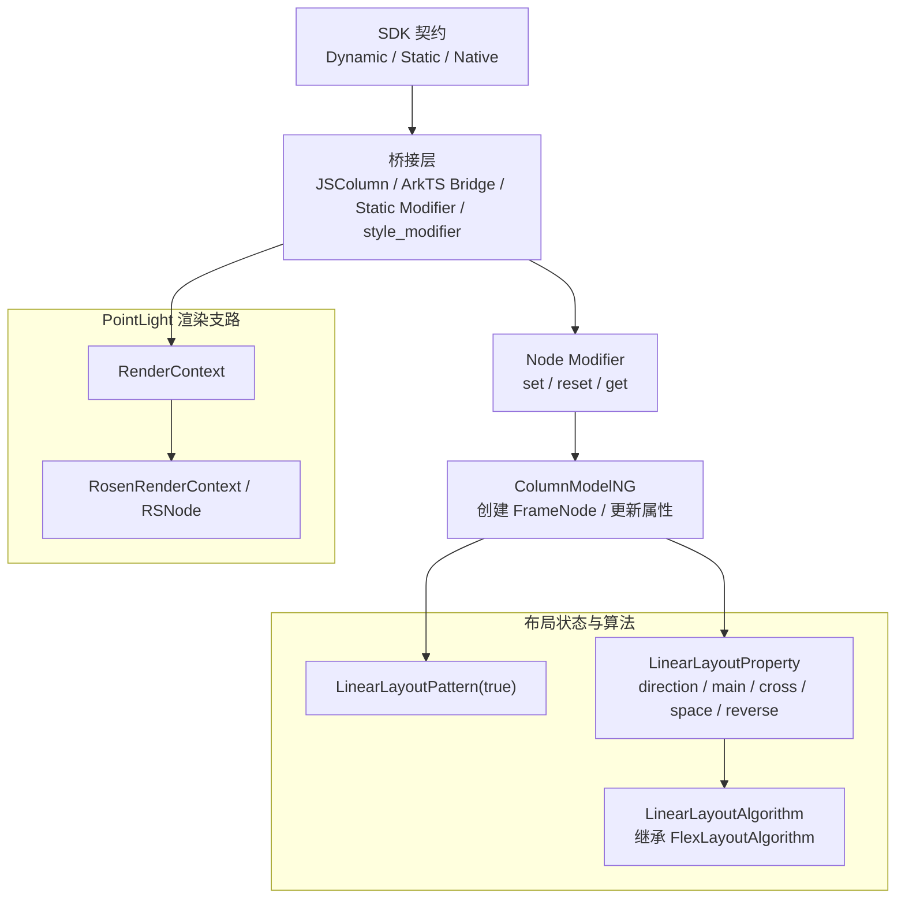
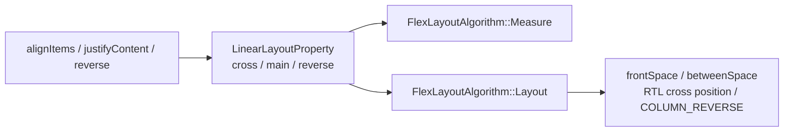
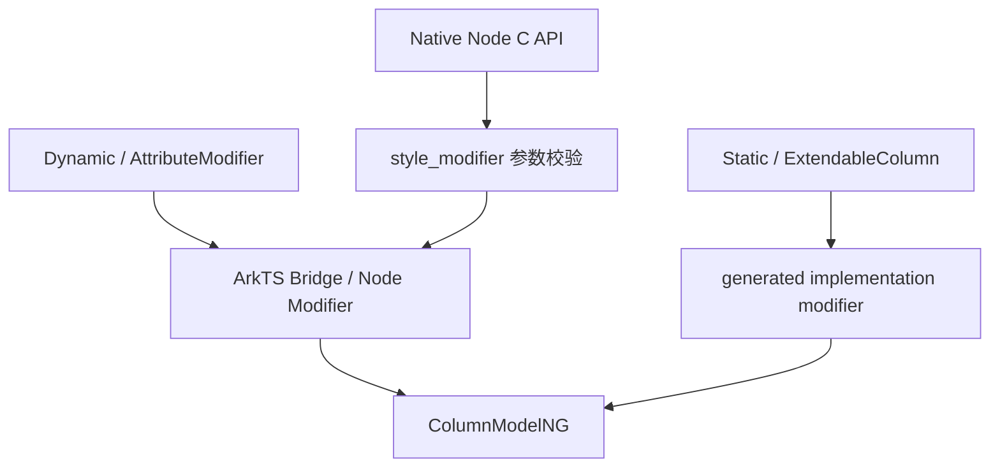
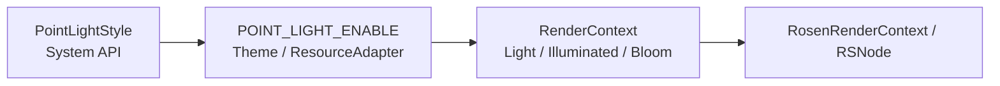
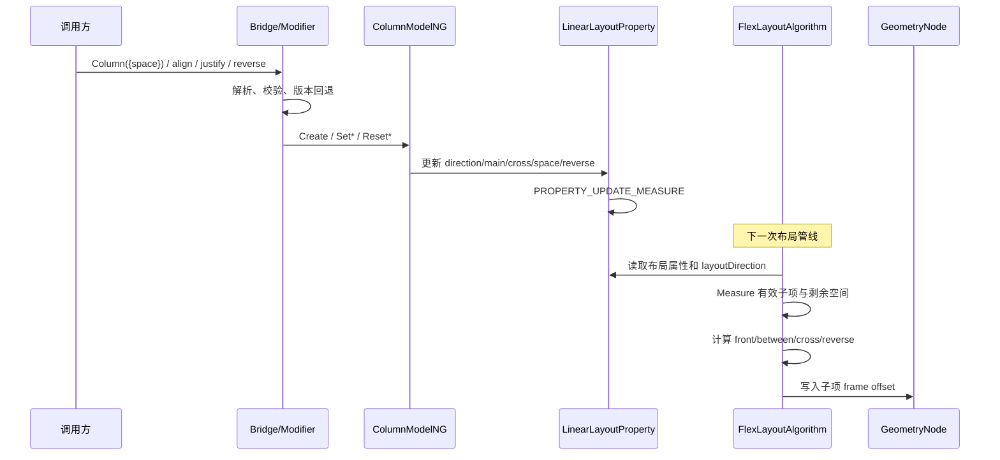
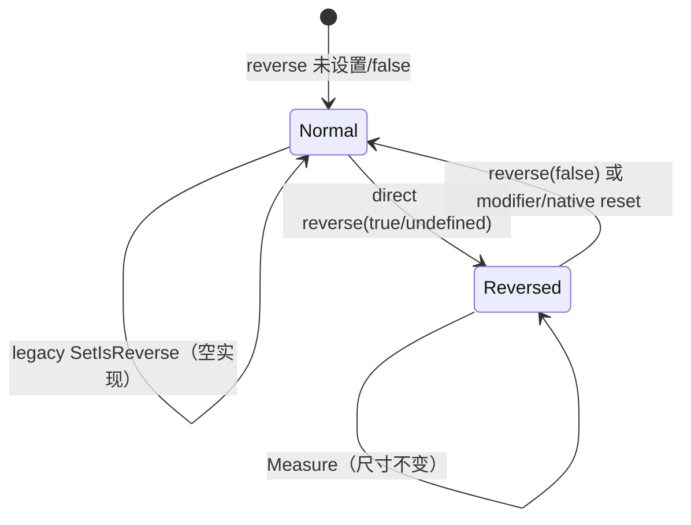
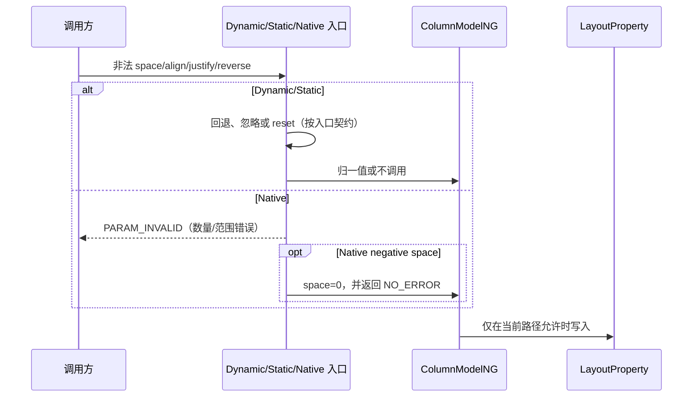

# 架构设计

> Column 功能域的架构设计基线，依据 ace_engine 与 interface_sdk-js 的既有实现补录。

## 设计元数据

| 字段 | 内容 |
|------|------|
| Design ID | DESIGN-Func-05-01-03 |
| 关联需求 | 已有能力补录（无独立 requirement.md） |
| 关联 Epic | 无 |
| 目标 Feature | Feat-01 Column 创建、尺寸与子项间距；Feat-02 Column 对齐与反向排列；Feat-03 Column 多范式接口与版本兼容；Feat-04 Column PointLight 系统光效 |
| 复杂度 | 复杂 |
| 目标版本 | API 7–26 |
| Owner | ArkUI SIG |
| 状态 | Baselined（已有实现补录） |

## 需求基线

> 本功能域无 proposal.md；以下基线直接承接已批准的存量规格与源码证据，不表示新增实现需求。

| 项 | 补充说明（如需） |
|----|------------------|
| Feat-01 基线 | 固化 COLUMN FrameNode、内容自适应尺寸、显式 space 与 Resource 更新生命周期 |
| Feat-02 基线 | 固化主轴/交叉轴对齐、空间分布公式、RTL、alignSelf 与 reverse 布局语义 |
| Feat-03 基线 | 固化 Dynamic、Static、Modifier、ExtendableColumn、Native set/reset/get、legacy 与 API 7–26 差异 |
| Feat-04 基线 | 固化 PointLight 的 System API、构建门控、主题资源、RenderContext 与 Rosen 行为 |
| 设计原则 | 当前实现即规格；本次只补录文档、注册表和生成索引，不修改产品代码或 SDK |

## 上下文和现状

### 涉及仓和模块

| 仓库 | 补充架构说明 |
|------|--------------|
| interface_sdk-js — `api/@internal/component/ets/column.d.ts` | Dynamic Column、ColumnOptions/V2、alignItems、justifyContent、pointLight、reverse 与版本元数据的权威契约 |
| interface_sdk-js — `api/arkui/component/column.static.d.ets` | Static Column、setColumnOptions、style builder 与 ExtendableColumn 的权威契约 |
| interface_sdk-js — `api/arkui/ColumnModifier.d.ts` | Dynamic AttributeModifier 类型与开放版本契约 |
| ace_engine — `frameworks/bridge/declarative_frontend/jsview/js_column.cpp` | Classic Dynamic 参数解析、API 版本回退和模型调用 |
| ace_engine — `frameworks/bridge/declarative_frontend/engine/jsi/nativeModule/arkts_native_column_bridge.cpp` | ArkTS Native Bridge 的对齐属性解析和 reset 路径 |
| ace_engine — `frameworks/core/interfaces/native/implementation/column_modifier.cpp` | Static/generated modifier 的 options 与 PointLight 映射 |
| ace_engine — `interfaces/native/node/style_modifier.cpp` | Public Native Node 属性的参数数量、范围、错误码及 set/reset/get 分派 |
| ace_engine — `frameworks/core/interfaces/native/node/column_modifier.cpp` | Node modifier 到 ColumnModelNG 的直接桥接及 reset 默认值 |
| ace_engine — `frameworks/core/components_ng/pattern/linear_layout/column_model_ng.cpp` | FrameNode 创建、Resource space 管理和布局属性读写 |
| ace_engine — `frameworks/core/components_ng/pattern/linear_layout/linear_layout_pattern.h` | 非原子容器、LayoutProperty/Algorithm 工厂、Focus Scope 与诊断 dump |
| ace_engine — `frameworks/core/components_ng/pattern/flex/flex_layout_property.h` | FlexDirection、主/交叉轴对齐、space、reverse 属性组及 Measure 脏标记 |
| ace_engine — `frameworks/core/components_ng/pattern/flex/flex_layout_algorithm.cpp` | 测量、间距分布、RTL、reverse 和子项最终定位算法 |
| ace_engine — `frameworks/core/components_ng/render/adapter/rosen_render_context.cpp` | PointLight 状态向 Rosen 节点的像素转换与提交 |

### 调用链层级分析

| 层 | 模块 | 职责 | 修改类型 |
|----|------|------|----------|
| SDK 契约层 | `interface_sdk-js/.../column.d.ts`、`column.static.d.ets` | 声明 Dynamic/Static 签名、开放范围和 API 版本 | Feat-01~04 存量分析（无代码修改） |
| Classic Dynamic 桥接 | `declarative_frontend/jsview/js_column` | 解析 options、align、justify、reverse，执行 API 版本回退 | Feat-01~03 存量分析（无代码修改） |
| ArkTS Modifier 桥接 | `engine/jsi/nativeModule/arkts_native_column_bridge`、`ark_component/src/ArkColumn.ts` | 将 AttributeModifier 增量状态转换为 node modifier set/reset | Feat-03 存量分析（无代码修改） |
| Static/generated 桥接 | `core/interfaces/native/implementation/column_modifier` | 将 Static union/options 与 PointLight 字段映射到模型和 RenderContext | Feat-03/04 存量分析（无代码修改） |
| Public Native 分派 | `interfaces/native/node/style_modifier` | 校验 ArkUI_AttributeItem 并分派 Column/Row 共用属性 | Feat-03 存量分析（无代码修改） |
| Node modifier | `core/interfaces/native/node/column_modifier` | 将原始值、单位和 reset 转换为 ColumnModelNG 调用 | Feat-03 存量分析（无代码修改） |
| Model 层 | `core/components_ng/pattern/linear_layout/column_model_ng` | 创建 COLUMN FrameNode，固定纵向方向，更新/读取属性 | Feat-01~03 存量分析（无代码修改） |
| Pattern/Property 层 | `linear_layout_pattern`、`linear_layout_property`、`flex_layout_property` | 持有 LayoutProperty、创建 LinearLayoutAlgorithm、注册资源更新器并标脏 | Feat-01/02 存量分析（无代码修改） |
| Measure 算法层 | `pattern/flex/flex_layout_algorithm` | 测量有效子项，计算已占用尺寸、剩余空间和容器尺寸 | Feat-01/02 存量分析（无代码修改） |
| Layout 算法层 | `pattern/flex/flex_layout_algorithm` | 应用 main/cross 对齐、RTL、reverse，写入子项 frame offset | Feat-02 存量分析（无代码修改） |
| RenderContext 层 | `core/components_ng/render/render_context`、`base/view_abstract` | 保存 PointLight、受光与 bloom 状态，不参与 Column Measure | Feat-04 存量分析（无代码修改） |
| Rosen 后端层 | `render/adapter/rosen_render_context` | 将光源维度换算为 px 并提交 RSNode、请求下一帧 | Feat-04 存量分析（无代码修改） |

检查结论：调用链从 SDK 到布局/渲染后端均已覆盖；调用方向保持自上而下，未发现本次文档补录引入的跨层依赖。

### 适用架构规则

| Rule ID | 适用原因 | 设计结论 | 验证方式 |
|---------|----------|----------|----------|
| OH-ARCH-LAYERING | 同一属性经过 SDK、桥接、Model、Property 和 Algorithm | 保持单向调用；布局属性由 Algorithm 消费，PointLight 由 RenderContext/Rosen 消费 | 架构评审/依赖检查 |
| OH-ARCH-SUBSYSTEM | PointLight 跨 ace_engine 与 Rosen 后端边界 | 仅通过既有 RenderContext 适配层提交，不新增直接 Rosen 依赖 | 代码审查/依赖检查 |
| OH-ARCH-IPC-SAF | Column 属性不跨进程、不访问 SA | N/A；所有状态在当前 UI Pipeline 内处理 | 代码审查 |
| OH-ARCH-API-LEVEL | 能力从 API 7 延伸至 API 26 | 以 canonical SDK 的 `@since` 与 dynamic/static 标记为准，版本偏差单列风险 | API 评审/XTS |
| OH-ARCH-COMPONENT-BUILD | PointLight 受 `POINT_LIGHT_ENABLE` 控制 | 不新增 target 或部件；关闭宏时入口保持无操作 | 构建矩阵验证 |
| OH-ARCH-ERROR-LOG | Dynamic 与 Native 存在非法输入 | 沿用既有回退、错误码和日志，不新增错误码 | UT/fuzz/hilog |

## 不涉及项承接

> 本次无 proposal.md；本节按存量规格中已识别的维度给出设计结论。

| 维度 | 设计结论 |
|------|----------|
| 性能 | 涉及；布局属性继续统一触发 `PROPERTY_UPDATE_MEASURE`，不新增算法复杂度或后台任务 |
| 安全与权限 | 核心布局不涉及权限；PointLight 为 System API，但实现不新增权限检查或敏感数据处理 |
| 兼容性 | 涉及；保留 API 版本、legacy pipeline、多通道默认值和非法输入差异 |
| API/SDK | 涉及；Dynamic、Static、Modifier 与 Native 签名均需映射到源码证据 |
| IPC/跨进程 | N/A；Column 状态不跨进程、不经 SA/IPC |
| 构建与部件 | 涉及但无变更；仅记录既有 `POINT_LIGHT_ENABLE` 门控 |
| 持久化与迁移 | N/A；Column 属性随 FrameNode 生命周期存在，无磁盘格式或升级迁移 |
| 分布式能力 | N/A；无跨设备状态同步 |

## 关键设计决策

| 决策 ID | 问题 | 推荐方案 | 探索过的替代方案 | 取舍理由 | 影响 |
|---------|------|----------|-----------------|----------|------|
| ADR-1 | Column 是否实现独立纵向算法 | 复用 `LinearLayoutAlgorithm -> FlexLayoutAlgorithm`，由 Pattern 的 vertical 标记固定 `FlexDirection::COLUMN` | 方案A：Column 自建算法；方案B：使用未接入生产链的 LinearLayoutUtils | 当前生产实现已经共享 Flex 测量与定位逻辑；补录必须以真实调用链为准 | space、对齐、reverse 与 Flex 子项属性共享算法语义 |
| ADR-2 | Resource space 如何响应配置变化 | 在 Pattern 中以 `column.space` 注册弱引用更新器；合法新值更新属性并标记 Measure，非法值按入口既有路径忽略或 reset | 方案A：每次 Measure 重新解析；方案B：只解析一次不响应配置变化 | keyed updater 兼顾配置响应和生命周期安全，避免布局热路径重复解析 | 首次解析、更新回调和显式 reset 存在可观察差异 |
| ADR-F2-1 | 显式 space 与 Space* 分布同时存在时谁优先 | Start/Center/End 使用显式 space；SpaceBetween/Around/Evenly 忽略显式 space并仅按剩余空间公式分布 | 方案A：两者相加；方案B：先扣显式 space 再分配余量 | 当前算法在空间分布模式下不把显式 space 计入已占用尺寸，可避免双重间距 | 组合使用时最终 gap 与构造参数不同，必须重点测试 |
| ADR-F2-2 | reverse 与 RTL 如何组合 | reverse 仅在 Layout 翻转纵向主轴；RTL 仅镜像交叉轴 Start/End | 方案A：reverse 同时改变测量顺序；方案B：RTL 也翻转纵向主轴 | 现有 Measure 尺寸与声明顺序稳定，视觉定位在 Layout 完成 | 无障碍/焦点声明顺序不因 reverse 重排 |
| ADR-F3-1 | direct undefined、modifier reset 与 legacy 如何组合 | 保持各入口既有语义，不把 undefined 统一解释为 reset | 方案A：全部 reset false；方案B：全部采用 SDK 默认 true | 统一语义会改变已发布路径的可观察行为 | Dynamic direct、Static、Modifier、Native 和 legacy 必须分别验证 |
| ADR-F3-2 | 多通道默认值与非法值是否归一 | 不归一；记录 Dynamic、Static、Native fresh getter、reset、枚举空洞和负值处理的事实差异 | 方案A：文档统一为 SDK 理想语义；方案B：修改实现后再补录 | 存量补录要求“当前实现即规格”，隐去偏差会造成不可复现的验收条件 | Native fresh justify 为 AUTO(0)，reset 后为 Start(1)；raw 非法值存在写回风险 |
| ADR-F3-3 | API 7–26 的契约来源如何判定 | 对外签名和版本以 interface_sdk-js canonical 文件为准，ace_engine 中间类型或注记冲突仅列风险 | 方案A：以任一实现文件注释为准；方案B：取所有通道交集 | SDK 是开发者可见契约；实现细节仍需作为兼容边界记录 | API 18 Resource、API 23 Static、API 26 扩展能力按版本隔离 |
| ADR-F4-1 | PointLight 是否进入布局属性模型 | 与 Column 布局解耦，状态存入 RenderContext，由主题资源补全效果并经 RosenRenderContext 提交 | 方案A：放入 LinearLayoutProperty；方案B：Column 自有 PaintProperty | 光效不改变尺寸或子项位置；RenderContext 是既有渲染状态边界 | 受编译开关、ThemeConstants/ResourceAdapter 和 Rosen 节点可用性约束 |

## 设计骨架

### 骨架范围

| 骨架项 | 目标 | 不包含 | 验证方式 |
|--------|------|--------|----------|
| 容器创建 | 固化 COLUMN FrameNode、vertical Pattern 和默认属性 | 通用 View 属性 | NG 创建与 Inspector UT |
| 线性布局 | 固化 Measure/Layout、space、main/cross 对齐和 reverse | FlexWrap、Grid、LazyColumn 算法 | Layout UT 与源码追溯 |
| 接口映射 | 覆盖 Dynamic/Static/Modifier/Native set/reset/get | 与 Column 无关的 Native 属性 | SDK 编译检查、Native UT |
| 资源与渲染 | 覆盖 Resource space 与 PointLight 环境门控 | 新主题资源、新渲染特效 | 配置更新测试、构建矩阵、Rosen 集成测试 |

### 骨架 Spec 拆分

| Task ID | 目标 | 受影响文件 | AC |
|---------|------|------------|-----|
| TASK-SKELETON-1 | 建立创建、自适应尺寸、space 与 Resource 证据链 | `Feat-01-column-creation-size-space-spec.md` | Feat-01 全部 AC |
| TASK-SKELETON-2 | 建立对齐、空间分布、RTL 与 reverse 证据链 | `Feat-02-column-alignment-reverse-spec.md` | Feat-02 全部 AC |
| TASK-SKELETON-3 | 建立多范式、Native 与版本兼容矩阵 | `Feat-03-column-multi-paradigm-version-spec.md` | Feat-03 全部 AC |
| TASK-SKELETON-4 | 建立 PointLight 环境与渲染证据链 | `Feat-04-column-point-light-spec.md` | Feat-04 全部 AC |

## 后续 Task 拆分

| Task ID | 目标 | 受影响文件 | 依赖 |
|---------|------|------------|------|
| TASK-FEAT-01 | 基线化创建、尺寸与子项间距规格 | `Feat-01-column-creation-size-space-spec.md` | 本 Design、Dynamic SDK 与 NG/Flex 源码 |
| TASK-FEAT-02 | 基线化对齐与反向排列规格 | `Feat-02-column-alignment-reverse-spec.md` | Feat-01 space 定义、Flex Layout 源码 |
| TASK-FEAT-03 | 基线化多范式接口与版本兼容规格 | `Feat-03-column-multi-paradigm-version-spec.md` | Dynamic/Static SDK、Modifier 与 Native 源码 |
| TASK-FEAT-04 | 基线化 PointLight 系统光效规格 | `Feat-04-column-point-light-spec.md` | System SDK、主题、RenderContext 与 Rosen 源码 |

## API 签名、Kit 与权限

> 下表登记已存在的 API，不代表本次新增接口。

### 新增 API

| API 签名 | 类型 | Kit | d.ts 位置 | 权限要求 | SysCap |
|----------|------|-----|------------|----------|--------|
| `Column(options?: ColumnOptions \| ColumnOptionsV2)` | Public | ArkUI | `api/@internal/component/ets/column.d.ts:110-159` | 无 | ArkUI.Full |
| `alignItems(value: HorizontalAlign): ColumnAttribute` | Public | ArkUI | `api/@internal/component/ets/column.d.ts:162-186` | 无 | ArkUI.Full |
| `justifyContent(value: FlexAlign): ColumnAttribute` | Public | ArkUI | `api/@internal/component/ets/column.d.ts:188-200` | 无 | ArkUI.Full |
| `pointLight(value: PointLightStyle): ColumnAttribute` | System | ArkUI | `api/@internal/component/ets/column.d.ts:201-211` | System API 可见性 | ArkUI.Full |
| `reverse(isReversed: Optional<boolean>): ColumnAttribute` | Public | ArkUI | `api/@internal/component/ets/column.d.ts:212-226` | 无 | ArkUI.Full |
| Static `Column(options, content_)` | Public | ArkUI | `api/arkui/component/column.static.d.ets:71-121` | 无 | ArkUI.Full |
| `setColumnOptions(options?): this` | Public | ArkUI | `api/arkui/component/column.static.d.ets:123-177` | 无 | ArkUI.Full |
| Static style builder / `ExtendableColumn` | Public | ArkUI | `api/arkui/component/column.static.d.ets:179-232` | 无 | ArkUI.Full |
| `NODE_COLUMN_ALIGN_ITEMS` / `NODE_COLUMN_JUSTIFY_CONTENT` | Public C API | ArkUI Native | `interfaces/native/native_node.h:8399-8411` | 无 | ArkUI.Full |
| `NODE_LINEAR_LAYOUT_SPACE` / `NODE_LINEAR_LAYOUT_REVERSE` | Public C API | ArkUI Native | `interfaces/native/native_node.h:8412-8435` | 无 | ArkUI.Full |

### 变更/废弃 API

| 原有 API | 变更类型 | 新 API | 迁移说明 |
|----------|----------|--------|----------|
| 无 | 无 | 无 | 本次仅补录已有 API，无迁移要求 |

## 构建系统影响

### BUILD.gn 变更

```text
无变更。Column 布局沿用 ace_core_ng 既有源集；PointLight 继续受既有 POINT_LIGHT_ENABLE 编译开关控制。
```

### bundle.json 变更

无新增 component、依赖关系或 bundle 配置。

## 可选设计扩展

### 架构图

#### 功能域架构总览



#### 对齐与反向架构图（Feat-02）



#### 多范式接口架构图（Feat-03）



#### PointLight 架构图（Feat-04）



### 数据流/控制流

| 步骤 | 调用方 | 被调用方 | 数据/接口 | 说明 |
|------|--------|----------|-----------|------|
| 1 | ArkTS/Static/Native 调用方 | 对应 SDK/Native 入口 | options、align、justify、reverse、PointLight | 编译期或运行期入口选择 |
| 2 | Bridge/style_modifier | Node modifier/ColumnModelNG | 已解析枚举、Dimension、bool | 各通道执行自己的非法值和 reset 规则 |
| 3 | ColumnModelNG | FrameNode/LinearLayoutProperty | COLUMN tag、FlexDirection、属性值 | 创建或更新，并触发 Measure 脏标记 |
| 4 | Pipeline | LinearLayoutAlgorithm | LayoutConstraintF + 子项列表 | 测量有效子项并计算容器尺寸 |
| 5 | FlexLayoutAlgorithm | GeometryNode | frontSpace、betweenSpace、cross position | 应用对齐、RTL 和 reverse 后写子项偏移 |
| 6 | 配置变更 | `column.space` updater | ResourceObject -> CalcDimension | 合法更新标记 Measure；弱引用失效时退出 |
| 7 | PointLight 入口 | RenderContext/RosenRenderContext | light position/intensity/color/illuminated/bloom | 不经过 LayoutProperty，不改变布局尺寸 |

### 时序设计



### 数据模型设计

#### 功能域数据模型总览

```typescript
// SDK 层（既有类型的结构化摘要）
interface ColumnOptions {
  space?: string | number;
}

interface ColumnOptionsV2 {
  space?: string | number | Resource;
}

interface PointLightStyle {
  lightSource?: LightSource;
  illuminated?: IlluminatedType;
  bloom?: number;
}
```

```cpp
// Framework 层（概念映射，字段由宏生成）
struct FlexLayoutAttribute {
    optional<FlexDirection> flexDirection; // Column 固定为 COLUMN
    optional<FlexAlign> mainAxisAlign;
    optional<FlexAlign> crossAxisAlign;
    optional<Dimension> space;
    optional<bool> isReverse;
};

// PointLight 不进入 FlexLayoutAttribute，而由 RenderContext 持有：
// LightPosition / LightIntensity / LightColor /
// LightIlluminated / IlluminatedBorderWidth / Bloom / BackShadow。
```

| 状态 | 持有位置 | 生命周期/存储方案 |
|------|----------|-------------------|
| Column 布局属性 | FrameNode 的 LinearLayoutProperty | 随 FrameNode 生命周期存在，无持久化 |
| Resource space 更新器 | LinearLayoutPattern 的 `column.space` 资源映射 | 弱引用 FrameNode；配置变更或显式 ResetResObj 管理 |
| PointLight 状态 | FrameNode 的 RenderContext | 随渲染节点存在，无磁盘存储 |

#### 对齐与反向数据模型（Feat-02）

```cpp
// FlexLayoutAttribute 中由 Feat-02 消费的既有字段
optional<FlexAlign> mainAxisAlign;
optional<FlexAlign> crossAxisAlign;
optional<bool> isReverse;
```

#### 多范式接口映射（Feat-03）

| 通道 | 入口表示 | 最终状态 |
|------|----------|----------|
| Dynamic/Modifier | ArkTS 值或增量 modifier | LinearLayoutProperty/RenderContext |
| Static | generated union/options | LinearLayoutProperty/RenderContext |
| Native | ArkUI_AttributeItem | ColumnModelNG getter/setter/resetter |

#### PointLight 数据模型（Feat-04）

```cpp
// RenderContext 中的既有状态组
LightPosition / LightIntensity / LightColor;
LightIlluminated / IlluminatedBorderWidth;
Bloom / BackShadow;
```

### 算法与状态机

主轴空间分布公式（`n` 为有效子项数，`remain` 为剩余主轴空间）：

| mainAxisAlign | frontSpace | betweenSpace | 显式 space |
|---------------|------------|--------------|------------|
| Start | 0 | `space` | 生效 |
| Center | `remain / 2` | `space` | 生效 |
| End | `remain` | `space` | 生效 |
| SpaceBetween | 0 | `n > 1 ? remain / (n - 1) : 0` | 忽略 |
| SpaceAround | `n > 0 ? remain / (2n) : 0` | `n > 0 ? remain / n : 0` | 忽略 |
| SpaceEvenly | `n > 0 ? remain / (n + 1) : 0` | 同 frontSpace | 忽略 |



### 测试性设计

| 测试层级 | 测试目标 | Mock 策略 | 验证方式 |
|----------|----------|-----------|----------|
| NG Unit Test | 创建、默认值、space、main/cross 对齐、reverse | 构造 FrameNode 与固定 LayoutConstraint | 检查 frame size/offset/property |
| Resource Test | `column.space` 配置更新与非法新值 | Mock ResourceObject/配置变化 | 检查属性和 Measure dirty flag |
| Native Unit Test | set/reset/get、错误码、负值和枚举空洞 | 构造 ArkUI_AttributeItem | 比对返回码与 getter |
| SDK Compile Test | API 7–26 可见性和 Static/Dynamic 边界 | 不需要运行时 Mock | 按 API level 编译样例 |
| Render Integration | PointLight 完整、关闭和上下文缺失路径 | 构建开关 + Theme/RSNode Mock | 检查 RenderContext/RSNode 状态 |

### 异常传播时序图



| 异常场景 | 传播/恢复结论 |
|----------|---------------|
| Dynamic space 解析失败 | API 10+ 归一为 0；不抛出异常 |
| direct NG negative space | 记录错误日志并保留旧属性 |
| Native 参数数量/范围错误 | 返回 `PARAM_INVALID`；不进入正常写入路径 |
| PointLight 编译开关关闭 | 入口无操作；不产生布局或渲染错误 |
| Theme/ResourceAdapter 缺失 | Static 在修改前退出；Dynamic 可能在 lightSource 后退出 |

### 资源所有权矩阵

| 资源 | 创建方 | 持有方 | 销毁触发 | 实际释放 | 异常回收 |
|------|--------|--------|----------|----------|----------|
| FrameNode/Pattern | ColumnModelNG/FrameNode 工厂 | UI 树 | 节点移除 | AceType 引用计数 | 标准 UI 树回收 |
| `column.space` updater | ColumnModelNG | LinearLayoutPattern | 节点销毁或 ResetResObj | Pattern 资源映射释放 | 回调只持有 WeakPtr，升级失败即退出 |
| RenderContext | FrameNode/Pattern | FrameNode | 节点销毁 | AceType 引用计数 | 无跨节点裸所有权 |
| RSNode 光效状态 | RosenRenderContext | Rosen 后端 | RenderContext/RSNode 销毁 | 后端资源生命周期 | 空 RSNode 时检查后退出 |

### 接口参数规约

| 接口 | 参数 | 类型 | 合法范围 | 非法处理 | 边界说明 |
|------|------|------|----------|----------|----------|
| Column/options | space | number/string/Resource | 可解析且值非负 | Dynamic API 10+ 回退 0；direct Model 负值不覆盖 | PERCENT/CALC 在无参 ConvertToPx 路径为 0 |
| alignItems | value | HorizontalAlign/raw int | Public Start/Center/End | Dynamic API 10+ 回退 Center；Native 越界返回错误 | 子项 alignSelf 优先 |
| justifyContent | value | FlexAlign/raw int | Public Start/Center/End/Between/Around/Evenly | Dynamic API 10+ 回退 Start；Native 仅检查连续 1..8 | raw 4/5 为公开枚举空洞 |
| reverse | isReversed | bool/raw int | Public boolean；Native 非负 int | direct undefined 写 true；Native 负值返回错误 | reset 写 false；legacy 无效果 |
| pointLight | value | PointLightStyle | 依 SDK 字段类型 | 环境缺失时无操作或部分应用 | 依赖构建开关、主题和 Rosen |

### 线程与并发模型

| 操作 | 发起线程 | 回调线程 | 跨进程边界 | 线程安全 | 重入约束 |
|------|----------|----------|------------|----------|----------|
| 属性 set/reset/get | UI 线程 | 同步 | 无 | 依赖 UI Pipeline 单线程模型 | 不支持并发修改同一 FrameNode |
| Measure/Layout | UI 布局阶段 | 同步 | 无 | Pipeline 串行调度 | Layout 中不得重入属性构建 |
| Resource 配置更新 | 配置更新调度进入 UI 上下文 | UI 上下文 | 无 | WeakPtr 防止悬空节点 | 同 key 更新覆盖当前缓存值 |
| PointLight 提交 | UI/渲染属性更新路径 | Rosen 请求下一帧 | 无 IPC 设计要求 | RenderContext/RSNode 既有线程约束 | 空上下文或空节点立即退出 |

并发结论：Column 不引入异步回调、锁或 IPC；所有写入沿既有 UI Pipeline 串行执行。

## 详细设计

### 创建、默认状态与测量入口（Feat-01）

`ColumnModelNG::Create` 使用 `COLUMN_ETS_TAG` 创建 `LinearLayoutPattern(true)`，入栈后写入 `FlexDirection::COLUMN`；直接创建 FrameNode 的路径执行同样初始化。Pattern 创建 `LinearLayoutProperty` 和 `LinearLayoutAlgorithm`，后者继承 `FlexLayoutAlgorithm` 并开启 linear-layout feature。证据见 `frameworks/core/components_ng/pattern/linear_layout/column_model_ng.cpp:24-40,128-136`、`frameworks/core/components_ng/pattern/linear_layout/linear_layout_pattern.h:34-55` 和 `frameworks/core/components_ng/pattern/linear_layout/linear_layout_algorithm.h:28-36`。

算法初始化时读取 space，默认 main 为 `FLEX_START`；linear-layout 模式默认 cross 为 `CENTER`，并依据 Pattern vertical 标记再次固定方向为 `COLUMN`。reverse 未设置时 getter 缺省 false。证据见 `frameworks/core/components_ng/pattern/flex/flex_layout_algorithm.cpp:230-263` 和 `frameworks/core/components_ng/pattern/linear_layout/column_model_ng.cpp:180-207`。

布局属性 `FlexDirection/MainAxisAlign/CrossAxisAlign/Space/IsReverse` 均使用 `PROPERTY_UPDATE_MEASURE`，因此任一属性更新进入下一轮 Measure，而非只做绘制刷新。证据见 `frameworks/core/components_ng/pattern/flex/flex_layout_property.h:63-68`。

未显式给出主轴理想尺寸时，linear-layout feature 将主轴标记为自适应；无限、AUTO、WRAP 或 FIX 主轴在子项测量后收敛到 `allocatedSize_`。最终主轴/交叉轴分别加上 padding/border 并钳制到 min/max，API 26+ 还会在写入 frame size 前重测单轴 match-parent 子项。证据见 `frameworks/core/components_ng/pattern/flex/flex_layout_algorithm.cpp:1163-1285,1287-1364`。

### space 与剩余空间分布（Feat-01/Feat-02）

普通 Start/Center/End 模式中，算法把 `space * (validSizeCount - 1)` 计入已占用主轴尺寸；有效子项排除 GONE 与离流节点。空间分布模式不计显式 space，随后按剩余空间计算 frontSpace/betweenSpace。证据见 `frameworks/core/components_ng/pattern/flex/flex_layout_algorithm.cpp:1531-1554,1628-1657`。

`Dimension::ConvertToPx()` 只直接处理 NONE/PX/VP/FP/LPX，其他单位在无参照尺寸路径返回 0。因此即使内部解析形成 PERCENT/CALC space，当前布局读取也不能把它解释为相对 Column 高度的间距。证据见 `frameworks/base/geometry/dimension.cpp:209-229` 和 `frameworks/core/components_ng/pattern/flex/flex_layout_algorithm.cpp:241-248`。

### 主轴、交叉轴、RTL 与子项覆盖（Feat-02）

Column 的 main axis 始终为纵向。`IsStartTopLeft` 对 COLUMN 固定返回 true、对 COLUMN_REVERSE 返回 false；locale/`layoutDirection` 的 RTL 只参与横向 cross position 镜像。子项显式 `alignSelf` 存在时覆盖 Column 的 crossAxisAlign。证据见 `frameworks/core/components_ng/pattern/flex/flex_layout_algorithm.cpp:45-69,1567-1678,1826-1836`。

对于 `n <= 1` 的空间分布，算法通过条件分支避免 `(n - 1)` 除零；无子项时 front/between space 保持安全值。对应公式和行为必须以布局 UT 验证，而不能仅检查 Property getter。证据见 `frameworks/core/components_ng/pattern/flex/flex_layout_algorithm.cpp:1628-1657`。

### reverse 的测量、布局与重置（Feat-02/Feat-03）

reverse 属性不参与子项尺寸测量；Layout 阶段读取 `IsReverse` 后将方向翻为 `COLUMN_REVERSE`，再从主轴尾部向前放置子项。因此容器与子项测量尺寸不变，只有最终视觉 offset 改变。证据见 `frameworks/core/components_ng/pattern/flex/flex_layout_algorithm.cpp:230-263,1567-1589,1691-1739`。

Classic Dynamic `reverse` 收到非 boolean（包括 undefined）时写 true；Node modifier reset 明确写 false。legacy `ColumnModelImpl::SetIsReverse` 当前为空实现。三条路径不得在文档中合并为单一“undefined 等于 reset”规则。证据见 `frameworks/bridge/declarative_frontend/jsview/js_column.cpp:113-119`、`frameworks/core/interfaces/native/node/column_modifier.cpp:99-110` 和 `frameworks/bridge/declarative_frontend/jsview/models/column_model_impl.h:24-30`。

### Dynamic、Static、Modifier 与 Native 边界（Feat-03）

Classic Dynamic 从 API 10 起对解析失败的 space 回退为 0，对非法 align/justify 分别回退 Center/Start。Static `setColumnOptions(undefined)` 的 union 空分支不更新旧值，而空 options 或负 space 经 Static Model reset。证据见 `frameworks/bridge/declarative_frontend/jsview/js_column.cpp:44-57,89-111`、`frameworks/core/interfaces/native/implementation/column_modifier.cpp:101-116` 和 `frameworks/core/components_ng/pattern/linear_layout/column_model_ng_static.cpp:23-30`。

Native `NODE_COLUMN_ALIGN_ITEMS` 仅接受公开 0..2 并映射到内部 1..3；justify 检查连续 1..8，因此 4/5 也可通过。Native space 的单个负数被钳为 0 且返回成功，reverse 接受任意非负整数并转换为 bool。证据见 `interfaces/native/node/style_modifier.cpp:12589-12662,20466-20573`。

新建 Node 的 justify getter 以 `AUTO(0)` 为缺省，但 reset 写 `FLEX_START(1)`；align bridge 在 API 10+ 回退后仍无条件写 raw 枚举。以上是现存契约偏差，不在设计补录中修正。证据见 `frameworks/core/components_ng/pattern/linear_layout/column_model_ng.cpp:180-191` 和 `frameworks/core/interfaces/native/node/column_modifier.cpp:22-65`。

### Resource space 生命周期（Feat-01）

Resource 构造与 setter 以 `column.space` 为 key 在 Pattern 注册更新器，回调只持有 FrameNode WeakPtr；配置变化后重新解析缓存值，合法值更新 Property 并 `MarkDirtyNode(PROPERTY_UPDATE_MEASURE)`。setter 更新回调遇负值 reset，而首次构造或首次 setter 的负值不覆盖属性，形成既有时序差异。证据见 `frameworks/core/components_ng/pattern/linear_layout/column_model_ng.cpp:43-125`。

切换到非 Resource space 或 reset 时，Node modifier 调用 `ResetResObj("column.space")`，避免后续配置变化覆盖显式数值。证据见 `frameworks/core/interfaces/native/node/column_modifier.cpp:75-96`。

### PointLight 渲染支路（Feat-04）

Dynamic PointLight 仅在 `POINT_LIGHT_ENABLE` 下编译执行；它先解析 lightSource，再获取 ResourceAdapter 补全 bloom radius/color 和 illuminated border width，因此 adapter 缺失时可能只应用前半段。证据见 `frameworks/bridge/declarative_frontend/jsview/js_view_abstract.cpp:10160-10203`。

Static 路径先检查 ThemeConstants，再设置/清除 RenderContext optional 字段；bloom 和 illuminated reset 仍使用主题值构造阴影或边框。证据见 `frameworks/core/interfaces/native/implementation/column_modifier.cpp:143-177` 和 `frameworks/core/components_ng/base/view_abstract_model_static.cpp:1128-1166`。

Rosen 提交光源位置时，x/y 百分比相对当前 paint rect 换算，普通单位直接转 px，z 百分比不支持；各属性更新后请求下一帧。这一支路不读写 LinearLayoutProperty，因此不改变 Column Measure/Layout。证据见 `frameworks/core/components_ng/render/adapter/rosen_render_context.cpp:6541-6603`。

### API 版本与开放范围（Feat-03）

| API | 已有能力 | 设计边界 |
|-----|----------|----------|
| 7 | Column、space、alignItems | Dynamic 基础容器 |
| 8 | justifyContent | 主轴对齐 |
| 11 | pointLight | System API，受构建/主题/渲染环境门控 |
| 12 | reverse、Dynamic ColumnModifier | direct undefined 与 reset 分开定义 |
| 18 | ColumnOptionsV2 Resource space | canonical SDK 支持 Resource |
| 23 | Static Column、Native linear space/reverse | 不包含 API 26 扩展入口 |
| 26 | setColumnOptions、style builder、ExtendableColumn | 仅 Static 新版本可见 |

版本证据见 `interface/sdk-js/api/@internal/component/ets/column.d.ts:110-226` 和 `interface/sdk-js/api/arkui/component/column.static.d.ets:71-232`。

## 风险和开放问题

| 项 | 类型 | 影响 | 处理方式 | Owner |
|----|------|------|----------|-------|
| Feat-02：空间分布忽略显式 space | 兼容性 | 中 | 在 AC、公式与组合 UT 中明确，不修改算法 | ArkUI SIG |
| Feat-03：reverse direct undefined 与 reset 不同 | API | 中 | 分通道记录并做 Dynamic/Modifier 对照测试 | ArkUI SIG |
| Feat-03：legacy reverse 为空实现 | 兼容性 | 中 | 规格明确限定 NG pipeline；legacy 作为风险保留 | ArkUI SIG |
| Feat-03：Native fresh justify getter 为 AUTO、reset 后为 Start | API | 中 | Native getter/reset UT 固化当前结果 | ArkUI SIG |
| Feat-03：raw 非法对齐值可写入 | 可靠性 | 中 | 类型安全 API 不依赖该行为；保留 fuzz/异常 UT | ArkUI SIG |
| Feat-01：Resource space 首次与更新负值处理不同 | 兼容性 | 低 | 按时序分别测试，记录 updater 生命周期 | ArkUI SIG |
| Feat-01：PERCENT/CALC space 转换为 0 | API | 中 | 不宣称相对间距能力，保留源码证据 | ArkUI SIG |
| Feat-04：PointLight 开关/主题缺失导致无操作或部分应用 | 构建 | 中 | 使用构建开关与上下文矩阵验证 | ArkUI SIG |
| Feat-03：Modifier 版本注记和 Resource 中间类型不一致 | API | 低 | 对外以 canonical SDK 为准，中间层仅列实现风险 | ArkUI SIG |

## 设计审批

- [x] 需求基线已确认，设计覆盖 P0/P1 AC
- [x] 不涉及项已承接，N/A 和展开项都有结论
- [x] 涉及仓和模块职责清楚
- [x] 调用链层级分析完整，每层覆盖到位
- [x] 适用架构规则已识别并形成设计结论
- [x] 分层和子系统边界合规
- [x] API 变更有签名、权限、错误码和兼容性说明
- [x] BUILD.gn/bundle.json 影响明确
- [x] 设计输出和后续 Task 拆分明确
- [x] 关键设计决策有理由和影响说明
- [x] 风险和开放问题有 Owner

**结论:** 通过（已有实现补录）
