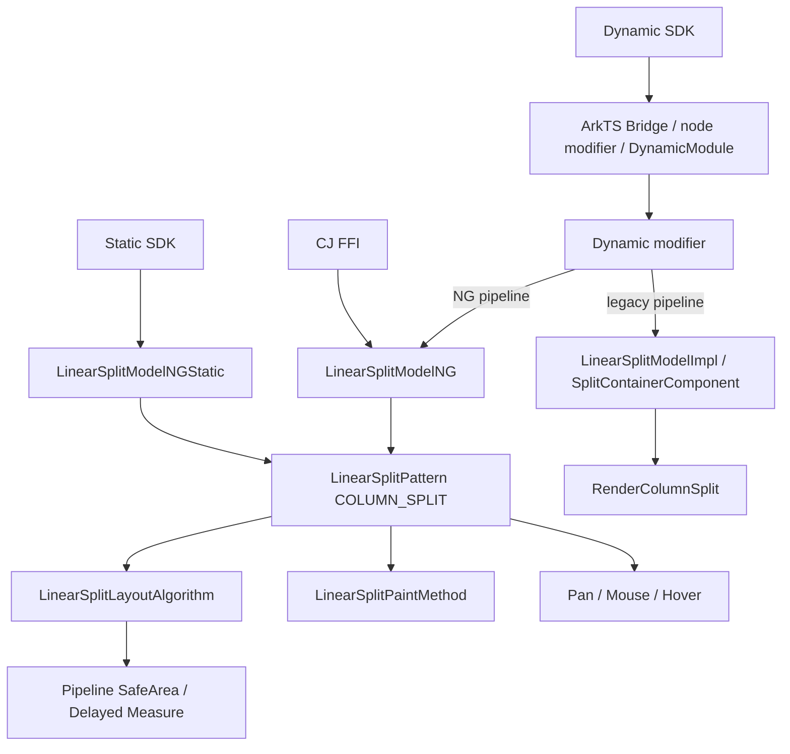
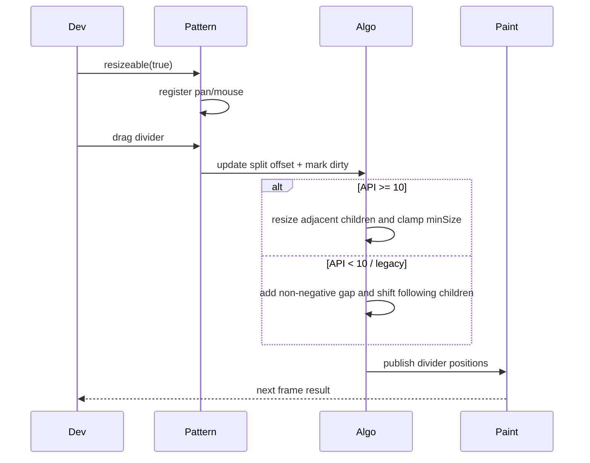
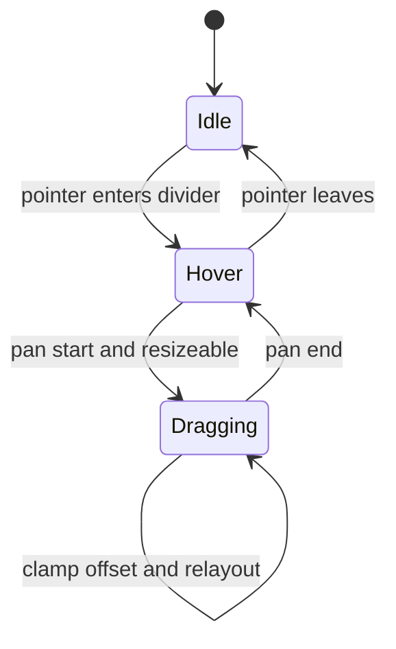
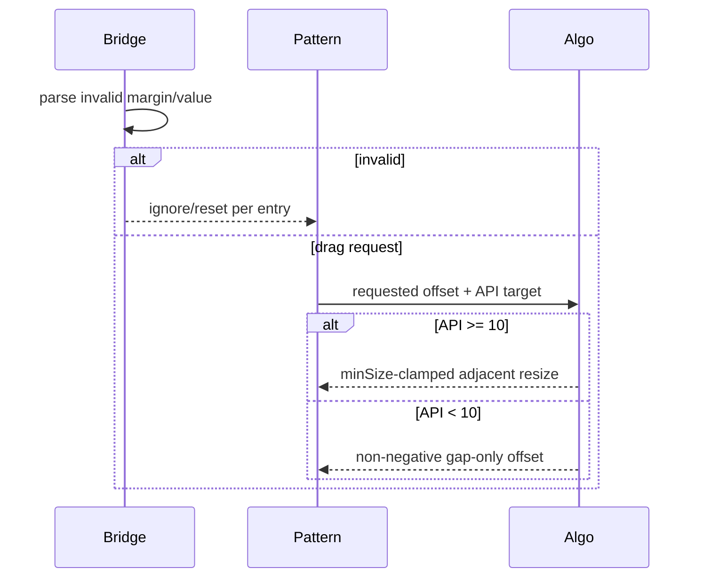

# 架构设计

> ColumnSplit 功能域的架构设计基线，依据 ace_engine 与 interface_sdk-js 既有实现补录。

## 设计元数据

| 字段 | 内容 |
|------|------|
| Design ID | DESIGN-Func-05-01-04 |
| 关联需求 | 已有能力补录（无独立 requirement.md） |
| 关联 Epic | 无 |
| 目标 Feature | Feat-01 垂直布局与绘制；Feat-02 拖拽；Feat-03 divider margin |
| 复杂度 | 复杂 |
| 目标版本 | API 7–26 |
| Owner | ArkUI SIG |
| 状态 | Baselined（已有实现补录） |

## 需求基线

> 本功能域无 proposal.md；以下直接承接已批准的存量规格和源码证据。

| 项 | 补充说明（如需） |
|----|------------------|
| 布局基线 | API>=10 按可见项纵向布局；API<10 遍历全部构建项（包括 GONE）并绘制水平 divider |
| 交互基线 | API>=10 调整相邻尺寸并钳制 minSize；API<10/legacy 只增加非负 gap 并平移后续项 |
| 样式基线 | divider margin 由 ColumnSplit NG 路径消费；legacy 路径保持既有 no-op |
| 兼容基线 | API 10 前后测量布局算法、多范式接口和安全区调度分别保留 |

## 上下文和现状

### 涉及仓和模块

| 仓库 | 补充架构说明 |
|------|--------------|
| interface_sdk-js — `column_split.d.ts` / `columnSplit.static.d.ets` | Dynamic/Static 签名、since 和开放范围 |
| ace_engine — `bridge/arkts_native_column_split_bridge.cpp`、`column_split_dynamic_module.cpp`、`column_split_dynamic_modifier.cpp` | 组件化参数解析、node modifier 与 NG/legacy 运行时分派 |
| ace_engine — `linear_split_model_ng.cpp` / `linear_split_model_ng_static.cpp` / `linear_split_model_impl.cpp` | 分别创建 NG FrameNode、Static FrameNode 或 legacy SplitContainerComponent |
| ace_engine — `linear_split_pattern.*` | 拖拽事件、鼠标样式、offset 状态和 PaintMethod |
| ace_engine — `linear_split_layout_algorithm.cpp` | API 10 前后测量布局、安全区与延迟测量 |
| ace_engine — `linear_split_paint_method.cpp` | divider 几何和绘制 |

### 调用链层级分析

| 层 | 模块 | 职责 | 修改类型 |
|----|------|------|----------|
| SDK | Dynamic/Static ColumnSplit | 声明创建、resizeable、divider 参数和版本 | 存量分析 |
| Bridge | JS/ArkTS/Static modifier | 解析并分派 set/reset | 存量分析 |
| Model | LinearSplitModelNG / LinearSplitModelNGStatic / LinearSplitModelImpl | 按入口与 pipeline 创建 NG/Static/legacy 节点并写属性 | 存量分析 |
| Pattern | LinearSplitPattern | 持有拖拽状态并注册输入事件 | 存量分析 |
| Layout | LinearSplitLayoutAlgorithm | 测量、布局、API 分支和安全区处理 | 存量分析 |
| Paint | LinearSplitPaintMethod | 绘制水平 divider | 存量分析 |
| Pipeline | PipelineContext | 延迟测量、安全区和脏节点调度 | 存量分析 |

检查结论：SDK 至 Pipeline/Paint 全链路已覆盖，未引入跨层修改。

### 适用架构规则

| Rule ID | 适用原因 | 设计结论 | 验证方式 |
|---------|----------|----------|----------|
| OH-ARCH-LAYERING | 属性跨 SDK、Model、Pattern、Algorithm | 保持单向依赖，Algorithm 不反向调用 SDK | 架构评审 |
| OH-ARCH-SUBSYSTEM | 无新增跨子系统依赖 | 使用既有 ArkUI 输入与绘制设施 | 依赖检查 |
| OH-ARCH-IPC-SAF | 无 IPC/SA | N/A | 代码审查 |
| OH-ARCH-API-LEVEL | API 7–26 且 API 10 为算法分界 | SDK since 为准，行为分支显式测试 | XTS/UT |
| OH-ARCH-COMPONENT-BUILD | 无新 target | 沿用既有 BUILD | 构建验证 |
| OH-ARCH-ERROR-LOG | 非法 margin/拖拽边界 | Dynamic 对数值范围/有限性缺少统一校验；Static/CAPI 可保留负值，偏差显式进入风险 | UT/Fuzz |

## 不涉及项承接

| 维度 | 设计结论 |
|------|----------|
| 性能 | 涉及；布局和拖拽按子项数线性处理 |
| 安全与权限 | 不涉及权限或敏感数据 |
| 兼容性 | 涉及；保留 API 10 的 GONE/拖拽/安全区分支、legacy divider no-op 和多范式差异 |
| 构建 | 涉及但无变更 |
| IPC/持久化/分布式 | N/A |

## 关键设计决策

| 决策 ID | 问题 | 推荐方案 | 探索过的替代方案 | 取舍理由 | 影响 |
|---------|------|----------|-----------------|----------|------|
| ADR-1 | 是否为 ColumnSplit 新建算法 | 与 RowSplit 共用 LinearSplitAlgorithm，以 SplitType 分派轴向 | 独立算法；复用 Flex | 当前实现已共享测量、拖拽和绘制状态 | API 10 分支需同时覆盖但轴向独立断言 |
| ADR-2 | API 10 前后算法是否统一描述 | 保留两套可观察路径：API<10 不过滤 GONE、使用 gap-only drag 且不执行安全区延迟路径；API>=10 使用可见项、相邻尺寸和 minSize | 只写新算法；强行归一 | 存量应用 target 行为不同 | API 9/10 参数化验证 |
| ADR-3 | divider margin 如何兼容 legacy | NG 生效，legacy no-op 明示为风险 | 文档宣称全路径生效；修改 legacy | 当前实现即规格，不虚构支持 | 各管线分开验收 |
| ADR-4 | 拖拽与安全区何处处理 | Pattern 管输入，Algorithm 约束几何，Pipeline 处理延迟测量 | 全放 Pattern；同步强制测量 | 保持职责清晰和既有调度 | resizeable 与 ignore safe area 组合测试 |

### 多范式接口与版本边界

多范式和版本差异是该组件的架构约束，不单独拆分为功能规格。公开签名以 SDK 为准，动态、静态和 CJ 入口不得互相推断未声明的能力。

| 入口/版本 | 既有契约 | 实现路径与边界 |
|-----------|----------|----------------|
| Dynamic API 7+ | `ColumnSplit()` 创建组件 | Bridge 经 node modifier、DynamicModule/dynamic modifier，按当前 pipeline 选择 `LinearSplitModelNG` 或 `LinearSplitModelImpl` |
| Dynamic divider API 10+ | 可设置分隔线及两侧 margin | NG 路径写入 divider；legacy `SetDivider` 为空实现，不能宣称 legacy 生效 |
| AttributeModifier API 12/20 | `applyNormalAttribute` 应用公开属性 | 仅按 Modifier SDK 声明的 set/reset 生效 |
| Static API 23+ | `ColumnSplit(content?)`、resizeable、divider、attributeModifier | static modifier 经 `LinearSplitModelNGStatic` 创建 FrameNode |
| Static Builder API 26 | `ColumnSplit(style, content?)` 与空 options 初始化 | 先应用 style/options，再构建可选 content；不增加未公开参数 |
| CJ FFI | 创建组件与 resizeable | `DynamicModule::GetModel` 取得 NG Model；divider 只记录实际公开 FFI 覆盖 |
| reset/undefined | 各入口恢复当前入口默认值 | 不把其他范式签名或 reset 语义静默套用 |

验证以 Dynamic NG/legacy、Static、CJ 及 API 7/10/12/20/23/26 的 SDK/bridge 矩阵为准；重点覆盖 legacy divider no-op、Builder/options 顺序和入口级 reset。

## 设计骨架

### 骨架范围

| 骨架项 | 目标 | 不包含 | 验证方式 |
|--------|------|--------|----------|
| 布局绘制 | 纵向子项与水平 divider | 通用 View 属性 | Layout/Paint UT |
| 拖拽 | 命中、offset、约束和鼠标反馈 | 手势通用框架 | Input UT |
| margin | divider 上下/起止边距 | 全局 divider 组件 | Pixel UT |
| 接口兼容 | Dynamic/Static/modifier/legacy | 新 API 设计 | SDK/Bridge 对照 |

### 骨架 Spec 拆分

| Task ID | 目标 | 受影响文件 | AC |
|---------|------|------------|-----|
| TASK-SKELETON-1 | 布局与 divider | `Feat-01-column-split-vertical-layout-rendering-spec.md` | Feat-01 全部 AC |
| TASK-SKELETON-2 | resizeable 拖拽 | `Feat-02-column-split-resizeable-drag-spec.md` | Feat-02 全部 AC |
| TASK-SKELETON-3 | divider margin | `Feat-03-column-split-divider-margin-spec.md` | Feat-03 全部 AC |

## 后续 Task 拆分

| Task ID | 目标 | 受影响文件 | 依赖 |
|---------|------|------------|------|
| TASK-FEAT-01 | 基线化纵向布局绘制 | Feat-01 spec | SDK、Layout/Paint 源码 |
| TASK-FEAT-02 | 基线化拖拽边界 | Feat-02 spec | Pattern、Algorithm |
| TASK-FEAT-03 | 基线化 divider margin | Feat-03 spec | NG/legacy 路径 |

## API 签名、Kit 与权限

> 下列均为已有接口。

### 新增 API

| API 签名 | 类型 | Kit | d.ts 位置 | 权限要求 | SysCap |
|----------|------|-----|------------|----------|--------|
| `ColumnSplit()` | Public | ArkUI | `api/@internal/component/ets/column_split.d.ts` | 无 | ArkUI.Full |
| `resizeable(value: boolean)` | Public | ArkUI | 同上 | 无 | ArkUI.Full |
| `divider(value: ColumnSplitDividerStyle)` | Public | ArkUI | 同上 | 无 | ArkUI.Full |
| Static ColumnSplit | Public | ArkUI | `api/arkui/component/columnSplit.static.d.ets` | 无 | ArkUI.Full |

### 变更/废弃 API

| 原有 API | 变更类型 | 新 API | 迁移说明 |
|----------|----------|--------|----------|
| 无 | 无 | 无 | 本次仅补录 |

## 构建系统影响

### BUILD.gn 变更

```text
无变更；继续使用 linear_split 既有源集。
```

### bundle.json 变更

无新增部件或依赖。

## 可选设计扩展

### 架构图



### 数据流/控制流

| 步骤 | 调用方 | 被调用方 | 数据/接口 | 说明 |
|------|--------|----------|-----------|------|
| 1 | Dynamic/Static/CJ | Bridge/Module/Model | resizeable/divider | 按入口选择 NG、NGStatic 或 legacy Model |
| 2 | Model | Pattern/Property 或 legacy component | SplitType、margin、开关 | NG 标脏；legacy divider no-op |
| 3 | Pipeline | Algorithm | constraint、children、API target | 选择旧/新算法 |
| 4 | Input | Pattern | drag delta | 更新 divider offset |
| 5 | Paint | Canvas | divider geometry | 绘制水平线 |

### 时序设计



### 数据模型设计

```cpp
struct LinearSplitState {
    SplitType type; // COLUMN_SPLIT
    bool resizeable;
    std::vector<float> childrenDragPos;
    std::vector<float> splitLength;
    std::vector<float> dragSplitOffset; // API<10 gap-only path
    Dimension startMargin;
    Dimension endMargin;
};
```

### 算法与状态机



### 测试性设计

| 测试层级 | 测试目标 | Mock 策略 | 验证方式 |
|----------|----------|-----------|----------|
| SDK/Bridge | 参数和版本 | Mock VM value | 单测 |
| Pattern | 拖拽/cursor/状态字段 | 注入 GestureEvent/PanEnd/OnModifyDone | API 9/10 与字段级生命周期 UT |
| Layout | API 9/10、GONE、安全区 | 构造 LayoutWrapper | API 9 全构建项、API 10 可见项/安全区断言 |
| Paint | divider/margin | Mock Canvas | 正常值、负/非有限输入与两轮布局断言 |

### 异常传播时序图



### 资源所有权矩阵

| 资源 | 创建方 | 持有方 | 销毁触发 | 实际释放 | 异常回收 |
|------|--------|--------|----------|----------|----------|
| FrameNode/Pattern | Model | UI tree | 节点销毁 | RefPtr | 弱引用退出 |
| 拖拽事件 | Pattern | EventHub | detach | EventHub | 注销回调 |
| offset 数组 | Pattern/Algorithm | Pattern | 属性 flag 变化/节点销毁 | vector | PanEnd 保留 childrenDragPos；OnModifyDone 清 childrenDragPos 但保留 dragSplitOffset |

### 接口参数规约

| 接口 | 参数 | 类型 | 合法范围 | 非法处理 | 边界说明 |
|------|------|------|----------|----------|----------|
| resizeable | value | boolean | true/false | 入口默认/reset | false 禁止拖拽 |
| divider | start/endMargin | Length | SDK 声明的有效 Dimension | 解析失败/reset 走默认；当前 Dynamic 未拦截负/非有限 Number，Static/CAPI 可保留负值 | legacy no-op；childrenDragPos 为空时 startMargin 有双累计风险 |

### 线程与并发模型

| 操作 | 发起线程 | 回调线程 | 跨进程边界 | 线程安全 | 重入约束 |
|------|----------|----------|------------|----------|----------|
| 设置属性/布局/拖拽 | UI | UI | 无 | UI 线程串行 | 事件内标脏、下帧布局 |

## 详细设计

### 纵向布局与 API 版本

API target 低于 10 调用 `MeasureBeforeAPI10/LayoutBeforeAPI10`，遍历全部构建项且不滤除 GONE；API 10 起才按可见子项和 layout policy 测量，ignore-safe-area 修正与延迟 bundle 也只在该新分支执行。证据：`frameworks/core/components_ng/pattern/linear_split/linear_split_layout_algorithm.cpp:51-55,177-205,214-245,276-345,365-459,509-636,691-721`。

### 拖拽与 margin

Pattern 命中 divider 后按版本处理 Y offset：API>=10 移动 `childrenDragPos_` 并按相邻子项最小高度钳制；API<10/legacy 只累计非负 `dragSplitOffset_`，在 divider 后增加 gap 并平移后续子项。PanEnd 只清当前拖拽标志/索引；属性 flag 变化清 `childrenDragPos_` 而保留旧版 offset。divider 数值当前缺少统一负值/有限性校验；`childrenDragPos_` 为空时 index>0 的 startMargin 被累计两次，后续布局一次。legacy ColumnSplit divider setter 保持 no-op。证据：`frameworks/core/components_ng/pattern/linear_split/linear_split_pattern.cpp:113-165,289-369,463-581`；`frameworks/core/components_ng/pattern/linear_split/linear_split_layout_algorithm.cpp:410-493,521-636`；`frameworks/core/components_ng/pattern/linear_split/linear_split_paint_method.cpp:41-64`。

## 风险和开放问题

| 项 | 类型 | 影响 | 处理方式 | Owner |
|----|------|------|----------|-------|
| API 10 双算法长期分支 | 架构 | 中 | API 9/10 参数化回归 | ArkUI SIG |
| legacy divider margin no-op | API | 中 | 文档明示并单独测试，不在补录中改实现 | ArkUI SIG |
| 安全区延迟测量组合 | 测试 | 中 | 与 Func-04-02-01 联合用例 | ArkUI SIG |
| API<10 不过滤 GONE 且仅做 gap-only drag | 兼容性 | 高 | API 9/10 GONE 与拖拽矩阵 | ArkUI SIG |
| Dynamic/Static divider 对负值和非有限值校验不统一 | 可靠性 | 高 | 保留 SDK 契约并增加通道级边界测试 | ArkUI SIG |
| childrenDragPos 为空时 startMargin 双累计 | 布局 | 高 | 同一树首轮/后续帧 offset 对照 | ArkUI SIG |
| ColumnSplit 末项 end-only 约束分支不可达 | 布局 | 中 | 锁定末项实际 start+end 约束并跟踪实现修复 | ArkUI SIG |

## 设计审批

- [x] 需求基线已确认，设计覆盖 P0/P1 AC
- [x] 不涉及项已承接，N/A 和展开项都有结论
- [x] 涉及仓和模块职责清楚
- [x] 调用链层级分析完整，每层覆盖到位
- [x] 适用架构规则已识别并形成设计结论
- [x] 分层和子系统边界合规
- [x] API 变更有签名、权限、错误码和兼容性说明
- [x] BUILD.gn/bundle.json 影响明确
- [x] 设计输出和后续 Task 拆分明确
- [x] 关键设计决策有理由和影响说明
- [x] 风险和开放问题有 Owner

**结论:** 通过（已有实现补录）。
