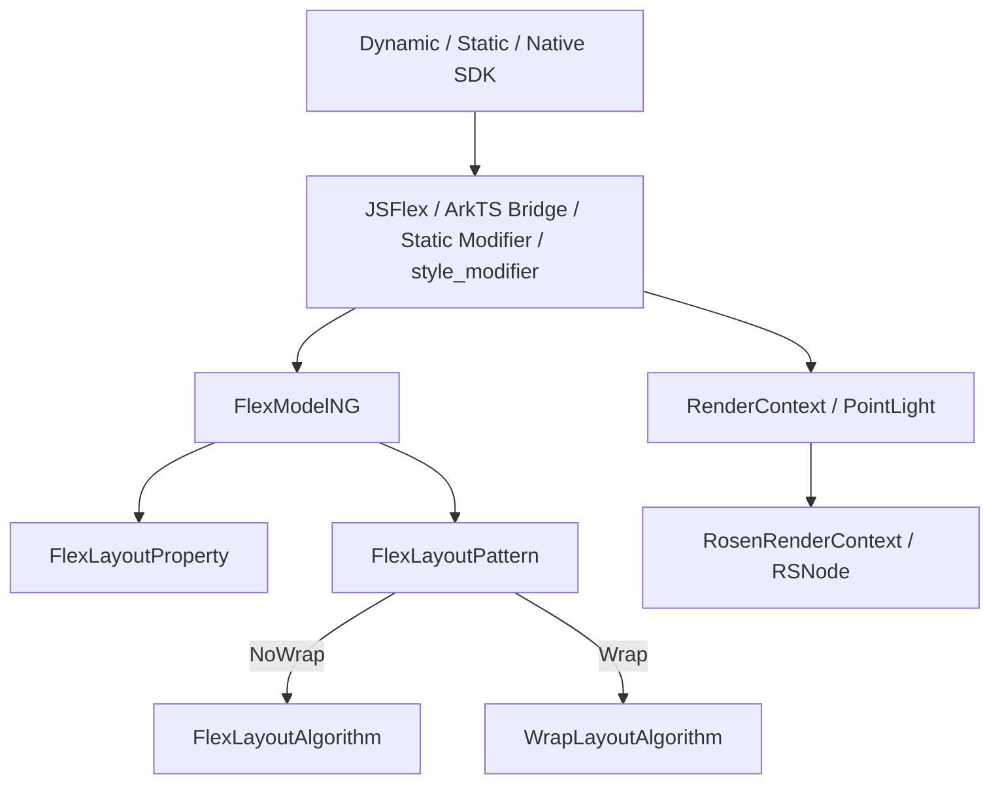
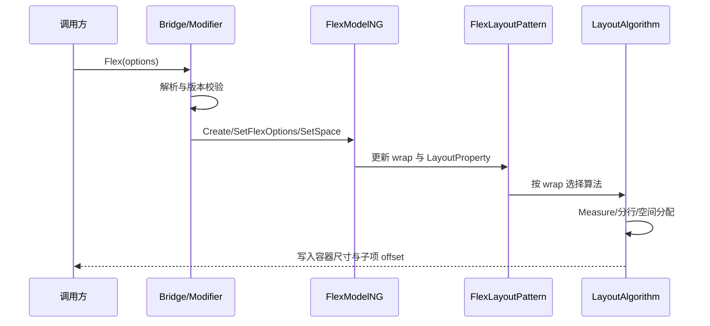
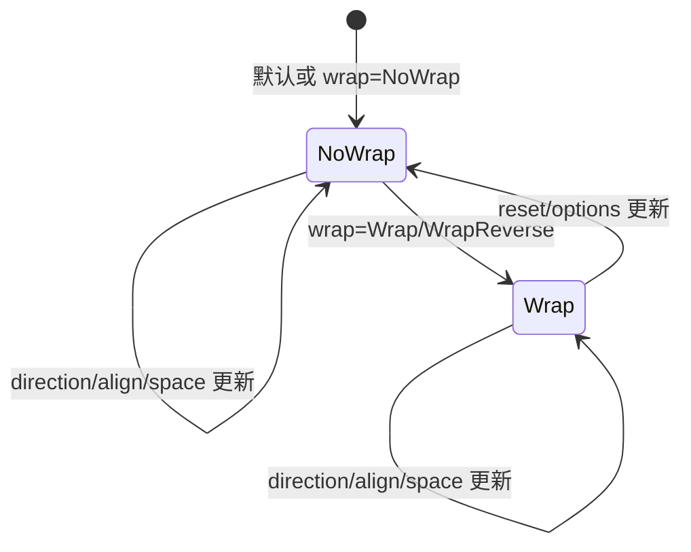
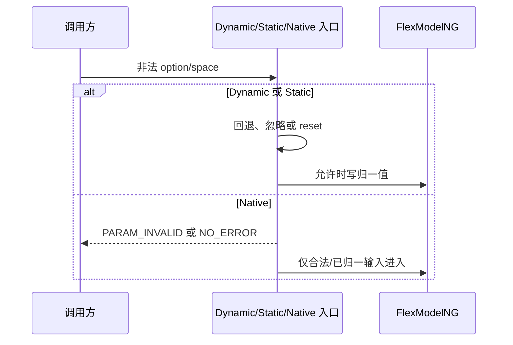

# 架构设计

> Flex 功能域的存量架构设计基线，依据 ace_engine 与 interface_sdk-js 已有实现补录；本文档不提出产品代码变更。

## 设计元数据

| 字段 | 内容 |
|------|------|
| Design ID | DESIGN-Func-05-01-05 |
| 关联需求 | 已有能力补录（无独立 requirement.md） |
| 关联 Epic | 无 |
| 目标 Feature | Feat-01 Flex 单行弹性布局与轴向对齐；Feat-02 Flex 多行换行与内容对齐；Feat-03 Flex 主轴与交叉轴间距；Feat-04 Flex 多范式接口与版本兼容；Feat-05 Flex PointLight 系统光效 |
| 复杂度 | 复杂 |
| 目标版本 | API 7–26 |
| Owner | ArkUI SIG |
| 状态 | Baselined（已有实现补录） |

## 需求基线

> 本功能域无 proposal.md。以下内容直接承接现有 SDK 契约、生产调用链和测试，遵循“当前实现即规格”；实现与公开契约的偏差只作为风险记录。

| 项 | 补充说明（如需） |
|----|------------------|
| Feat-01 基线 | 固化 Flex 不换行模式的创建、方向、主轴/交叉轴对齐、尺寸收敛、RTL 与反向方向语义 |
| Feat-02 基线 | 固化 Wrap 模式的换行分组、行内定位、alignContent、多行尺寸及 API 12 自适应行为 |
| Feat-03 基线 | 固化 `space.main`、`space.cross` 的解析、应用范围、Space* 组合和非法值边界 |
| Feat-04 基线 | 固化 Dynamic、Static、AttributeModifier、Native C API、legacy pipeline 及 API 7–26 兼容矩阵 |
| Feat-05 基线 | 固化 PointLight System API、构建门控、主题资源、RenderContext 与 Rosen 提交路径 |
| 设计原则 | 只补录规格、设计和注册元数据；不修改 ace_engine、interface_sdk-js 或生成代码 |

## 上下文和现状

### 涉及仓和模块

| 仓库/模块 | 补充架构说明 |
|-----------|--------------|
| interface_sdk-js — `interface/sdk-js/api/@internal/component/ets/flex.d.ts` | Dynamic FlexOptions、FlexSpaceOptions、FlexAttribute 与 API 版本元数据的权威契约 |
| interface_sdk-js — `interface/sdk-js/api/arkui/component/flex.static.d.ets` | Static Flex、component/style builder、`setFlexOptions` 和 PointLight 契约 |
| ace_engine — `frameworks/bridge/declarative_frontend/jsview/js_flex_impl.cpp` | Classic Dynamic options 解析、Wrap/NoWrap 分派和 legacy binding |
| ace_engine — `frameworks/bridge/declarative_frontend/jsview/js_flex.cpp` | NG/legacy 模型选择和 API 10 参数校验 |
| ace_engine — `frameworks/bridge/declarative_frontend/engine/jsi/nativeModule/arkts_native_flex_bridge.cpp` | AttributeModifier options 与 space 的 ArkTS Native Bridge |
| ace_engine — `frameworks/bridge/declarative_frontend/ark_component/src/ArkFlex.ts` | 增量 modifier 状态、diff 和 reset 调度 |
| ace_engine — `frameworks/core/interfaces/native/implementation/flex_modifier.cpp` | Static/generated options、模式切换与 PointLight 映射 |
| ace_engine — `interfaces/native/node/style_modifier.cpp` | Public Native Node 参数校验、错误码和 set/reset/get 分派 |
| ace_engine — `frameworks/core/interfaces/native/node/flex_modifier.cpp` | 原始值到 FlexModelNG 的 node modifier 映射 |
| ace_engine — `frameworks/core/components_ng/pattern/flex/flex_model_ng.cpp` | FrameNode 创建、Flex/Wrap 模式切换和属性读写 |
| ace_engine — `frameworks/core/components_ng/pattern/flex/flex_layout_pattern.h` | 根据 `wrap` 选择 FlexLayoutAlgorithm 或 WrapLayoutAlgorithm |
| ace_engine — `frameworks/core/components_ng/pattern/flex/flex_layout_algorithm.cpp` | 单行测量、空间分配、轴向对齐、RTL 和子项定位 |
| ace_engine — `frameworks/core/components_ng/pattern/flex/wrap_layout_algorithm.cpp` | 换行分组、多行测量、alignContent 和行内定位 |
| ace_engine — `frameworks/core/components_ng/render/adapter/rosen_render_context.cpp` | PointLight 状态的像素换算、RSNode 提交与请求下一帧 |

### 调用链层级分析

| 层 | 模块 | 职责 | 修改类型 |
|----|------|------|----------|
| SDK 契约层 | Dynamic/Static Flex 声明 | 定义 options、space、PointLight、开放范围与版本 | Feat-01~05 存量分析 |
| Classic Dynamic 桥接 | `js_flex` / `js_flex_impl` | 解析方向、换行、对齐和间距，选择 NG 或 legacy Model | Feat-01~04 存量分析 |
| ArkTS Modifier 桥接 | `ArkFlex.ts` / `arkts_native_flex_bridge` | 把增量属性转换为 node modifier 的 set/reset 调用 | Feat-03/04 存量分析 |
| Static/generated 桥接 | `implementation/flex_modifier.cpp` | 转换 Static union/options，分派 Flex/Wrap 并写 PointLight | Feat-02/04/05 存量分析 |
| Public Native 分派 | `interfaces/native/node/style_modifier.cpp` | 校验 `ArkUI_AttributeItem` 并分派 Flex options/space | Feat-04 存量分析 |
| Node modifier | `core/interfaces/native/node/flex_modifier.cpp` | 原始枚举、Dimension 到 FlexModelNG 的 set/reset/get | Feat-03/04 存量分析 |
| Model/Pattern 层 | `flex_model_ng` / `flex_layout_pattern` | 创建 FLEX FrameNode、切换算法模式并持有布局属性 | Feat-01~04 存量分析 |
| Measure/Layout 层 | `flex_layout_algorithm` / `wrap_layout_algorithm` | 测量子项、分行、分配剩余空间并写 GeometryNode offset | Feat-01~03 存量分析 |
| RenderContext 层 | `view_abstract` / `render_context` | 保存 PointLight、illuminated 和 bloom 状态 | Feat-05 存量分析 |
| Rosen 后端层 | `rosen_render_context` | 将光源单位转为 px 并提交 RSNode | Feat-05 存量分析 |

现状调用链保持 SDK → Bridge/Modifier → Model/Property → Algorithm 或 RenderContext → Rosen 的单向依赖；本次文档补录不改变任何依赖方向。

### 适用架构规则

| Rule ID | 适用原因 | 设计结论 | 验证方式 |
|---------|----------|----------|----------|
| OH-ARCH-LAYERING | 同一 options 经多层转换后进入布局算法 | 保持单向调用，算法只消费 LayoutProperty | 架构评审、依赖检查 |
| OH-ARCH-API-LEVEL | Dynamic API 7、space API 12、Static API 23、builder API 26 并存 | 对外版本以 canonical SDK `@since` 为准 | SDK 编译矩阵、XTS |
| OH-ARCH-COMPONENT-BUILD | PointLight 受 `POINT_LIGHT_ENABLE` 控制 | 沿用既有宏，不新增 target 或部件依赖 | 构建矩阵 |
| OH-ARCH-ERROR-LOG | Dynamic/Native 存在非法 options 或间距 | 保留既有回退、错误码和日志语义 | UT、fuzz |
| OH-ARCH-SUBSYSTEM | PointLight 需要 Rosen 后端 | 只通过 RenderContext 适配层提交 | 依赖检查、渲染集成测试 |
| OH-ARCH-IPC-SAF | Flex 不访问 SA/IPC | N/A，全部状态位于当前 UI Pipeline | 代码审查 |

## 不涉及项承接

| 维度 | 设计结论 |
|------|----------|
| 性能 | 涉及但不新增指标；继续使用线性子项遍历和按行分组，不引入后台任务 |
| 安全与权限 | 核心布局无权限；PointLight 为 System API，但实现不处理敏感数据 |
| 兼容性 | 涉及；保留 API、pipeline、Dynamic/Static/Native 与 reset 差异 |
| API/SDK | 涉及；所有公开签名以 interface_sdk-js canonical 文件为准 |
| IPC/跨进程 | N/A；无 SA、IPC 或跨进程状态 |
| 构建与部件 | 无新增变更；只记录 PointLight 既有编译门控 |
| 持久化与迁移 | N/A；布局和光效状态随 FrameNode 生命周期存在 |
| 分布式能力 | N/A；无跨设备同步 |

## 关键设计决策

| 决策 ID | 问题 | 推荐方案 | 探索过的替代方案 | 取舍理由 | 影响 |
|---------|------|----------|-----------------|----------|------|
| ADR-1 | Flex 如何承载单行和换行两类行为 | 一个 FLEX FrameNode 由 `FlexLayoutPattern` 按 `wrap` 选择 FlexLayoutAlgorithm 或 WrapLayoutAlgorithm | 为 Wrap 建独立组件；在一个算法中混合所有分支 | 当前生产实现已在 Pattern 层分派，能够共享属性而隔离测量策略 | Feat-01/02 共用 options，但算法和验收边界分开 |
| ADR-2 | 单行 Flex 的轴向语义如何确定 | 先由 direction 建立主/交叉轴，再结合 RTL 与 `*_REVERSE` 决定视觉起点；Measure 保持声明数据，Layout 写最终 offset | 在 Measure 阶段重排 child list；仅依赖文本方向 | 当前实现把尺寸计算与视觉顺序解耦，避免破坏子项身份和焦点顺序 | Feat-01 必须组合验证四种 direction 与 RTL |
| ADR-F2-1 | Wrap 的换行与行间分布如何分工 | Measure 先按主轴容量形成行，再由 Layout 使用 justifyContent/alignItems/alignContent 布置行内和多行 | 先做全局对齐后切行；复用单行算法强行模拟 | 分行信息是 alignContent 的输入，顺序与现有 WrapLayoutAlgorithm 一致 | 单行时 alignContent 不产生多行分布效果 |
| ADR-F2-2 | API 12 的自适应变化如何记录 | 保留 WrapLayoutAlgorithm 的 API 12 版本分支，不将新行为回灌低版本 | 所有版本统一最新行为 | 存量应用依赖旧版本约束解释，补录不得重写兼容边界 | 需要按目标 API 版本验证容器尺寸 |
| ADR-F3-1 | 显式 main/cross space 与 Space* 对齐如何组合 | main space 仅在 Start/Center/End 生效；SpaceBetween/Around/Evenly 使用剩余空间公式；cross space 参与换行行距 | 两者叠加；统一忽略显式 space | 当前算法避免主轴双重间距，同时保留多行固定行距 | 构造参数与最终 gap 在 Space* 下可能不同 |
| ADR-F3-2 | 非法、百分比和 CALC space 如何处理 | 保留各入口解析与算法换算的当前结果，不新增统一归一层 | 全部拒绝；全部按容器百分比换算 | 公开契约、Dynamic bridge、Native 和 `ConvertToPx()` 事实存在边界差异 | 风险在规格中显式记录并要求回归 |
| ADR-F4-1 | 多范式接口是否强行统一 reset 语义 | 不统一，分别固化 Classic Dynamic、AttributeModifier、Static 和 Native 事实 | 把 undefined/reset 全部解释为默认 options | 统一会改变已发布通道行为，违反存量补录原则 | Feat-04 建立逐通道 set/reset/get 矩阵 |
| ADR-F4-2 | 对外版本与实现注记冲突时采用哪个来源 | 对外契约以 interface_sdk-js canonical SDK 为准，实现偏差只列风险 | 以任意中间生成文件为准；取所有实现交集 | canonical SDK 是开发者可见、可编译的权威界面 | API 23/26 能力按 SDK 隔离 |
| ADR-F5-1 | PointLight 是否进入 Flex LayoutProperty | 光效保持在 RenderContext，主题资源补全后由 RosenRenderContext 提交 | 放入 FlexLayoutProperty；建立 Flex 专用 PaintProperty | 光效不改变测量或子项位置，RenderContext 是共享渲染状态边界 | 关闭构建宏或上下文缺失时布局仍正常 |

## 设计骨架

### 骨架范围

| 骨架项 | 目标 | 不包含 | 验证方式 |
|--------|------|--------|----------|
| 单行弹性布局 | direction、justifyContent、alignItems、尺寸和 RTL/reverse | 多行换行 | NG/Layout UT |
| 多行换行 | 行分组、alignContent、行内定位、自适应尺寸 | Grid/Lazy 布局 | Wrap Layout UT |
| 双轴间距 | main/cross space、单位、非法值和对齐组合 | 通用 margin/padding | 参数矩阵、Native UT |
| 多范式接口 | Dynamic/Static/Modifier/Native/legacy 和版本矩阵 | 非 Flex Native 属性 | SDK 编译、C API UT |
| 系统光效 | PointLight 构建、主题、RenderContext、Rosen | 新主题资源或新渲染效果 | 构建矩阵、渲染测试 |

### 骨架 Spec 拆分

| Task ID | 目标 | 受影响文件 | AC |
|---------|------|------------|-----|
| TASK-SKELETON-1 | 建立单行轴向布局证据链 | `Feat-01-flex-single-line-axis-layout-spec.md` | Feat-01 全部 AC |
| TASK-SKELETON-2 | 建立换行和 alignContent 证据链 | `Feat-02-flex-wrap-content-alignment-spec.md` | Feat-02 全部 AC |
| TASK-SKELETON-3 | 建立 main/cross space 证据链 | `Feat-03-flex-main-cross-space-spec.md` | Feat-03 全部 AC |
| TASK-SKELETON-4 | 建立多范式与版本兼容矩阵 | `Feat-04-flex-multi-paradigm-version-spec.md` | Feat-04 全部 AC |
| TASK-SKELETON-5 | 建立 PointLight 环境与渲染证据链 | `Feat-05-flex-point-light-spec.md` | Feat-05 全部 AC |

## 后续 Task 拆分

| Task ID | 目标 | 受影响文件 | 依赖 |
|---------|------|------------|------|
| TASK-FEAT-01 | 评审并基线化单行轴向布局 | `Feat-01-flex-single-line-axis-layout-spec.md` | 本 Design、Dynamic SDK、FlexLayoutAlgorithm |
| TASK-FEAT-02 | 评审并基线化换行与内容对齐 | `Feat-02-flex-wrap-content-alignment-spec.md` | Feat-01 轴向定义、WrapLayoutAlgorithm |
| TASK-FEAT-03 | 评审并基线化双轴间距 | `Feat-03-flex-main-cross-space-spec.md` | Feat-01/02、各接口解析路径 |
| TASK-FEAT-04 | 评审并基线化多范式兼容矩阵 | `Feat-04-flex-multi-paradigm-version-spec.md` | Dynamic/Static SDK、Modifier、Native |
| TASK-FEAT-05 | 评审并基线化 PointLight | `Feat-05-flex-point-light-spec.md` | System SDK、主题、RenderContext、Rosen |

## API 签名、Kit 与权限

> 下表登记已存在 API，不代表本次新增接口。

### 新增 API

| API 签名 | 类型 | Kit | d.ts 位置 | 权限要求 | SysCap |
|----------|------|-----|------------|----------|--------|
| `Flex(value?: FlexOptions)` | Public | ArkUI | `interface/sdk-js/api/@internal/component/ets/flex.d.ts:30-172` | 无 | ArkUI.Full |
| `FlexOptions.space?: FlexSpaceOptions` | Public | ArkUI | `interface/sdk-js/api/@internal/component/ets/flex.d.ts:97-147` | 无 | ArkUI.Full |
| `pointLight(value: PointLightStyle)` | System | ArkUI | `interface/sdk-js/api/@internal/component/ets/flex.d.ts:175-198` | System API 可见性 | ArkUI.Full |
| Static `Flex(options, content_)` | Public | ArkUI | `interface/sdk-js/api/arkui/component/flex.static.d.ets:31-165` | 无 | ArkUI.Full |
| Static builder / `setFlexOptions` | Public | ArkUI | `interface/sdk-js/api/arkui/component/flex.static.d.ets:145-200` | 无 | ArkUI.Full |
| `NODE_FLEX_OPTION` / `NODE_FLEX_SPACE` | Public C API | ArkUI Native | `interfaces/native/native_node.h:8467-8504` | 无 | ArkUI.Full |

### 变更/废弃 API

| 原有 API | 变更类型 | 新 API | 迁移说明 |
|----------|----------|--------|----------|
| 无 | 无 | 无 | 本次仅补录存量接口，无迁移要求 |

## 构建系统影响

### BUILD.gn 变更

```text
无变更。Flex/Wrap 算法沿用 ace_core_ng 既有源集；PointLight 继续受 POINT_LIGHT_ENABLE 编译开关控制。
```

### bundle.json 变更

无新增 component、依赖或 bundle 配置。

## 可选设计扩展

### 架构图



### 数据流/控制流

| 步骤 | 调用方 | 被调用方 | 数据/接口 | 说明 |
|------|--------|----------|-----------|------|
| 1 | ArkTS/Static/Native 调用方 | 对应入口 | direction、wrap、align、space | 根据语言范式进入桥接层 |
| 2 | Bridge/style_modifier | node modifier/FlexModelNG | 已解析枚举和 Dimension | 执行通道自己的校验/reset |
| 3 | FlexModelNG | FlexLayoutProperty/Pattern | options 与模式 | 设置属性并标记 Measure |
| 4 | Pattern | Flex 或 Wrap Algorithm | wrap 状态 | 选择单行或多行算法 |
| 5 | Algorithm | GeometryNode | child constraint、剩余空间 | 计算尺寸、分行和 offset |
| 6 | PointLight 入口 | RenderContext/Rosen | light/illuminated/bloom | 独立于 Measure/Layout |

### 时序设计



### 数据模型设计

```typescript
interface FlexOptions {
  direction?: FlexDirection;
  wrap?: FlexWrap;
  justifyContent?: FlexAlign;
  alignItems?: ItemAlign;
  alignContent?: FlexAlign;
  space?: { main?: Length; cross?: Length };
}
```

| 状态 | 持有位置 | 生命周期 |
|------|----------|----------|
| direction/wrap/align/space | FrameNode 的 FlexLayoutProperty | 随 FrameNode 存在，更新触发 Measure |
| 单行测量中间量 | FlexLayoutAlgorithm 实例 | 单次布局周期 |
| 行分组与行尺寸 | WrapLayoutAlgorithm 实例 | 单次布局周期 |
| PointLight 状态 | RenderContext | 随渲染节点存在，不持久化 |

### 算法与状态机

| 模式 | 选择条件 | 主算法 | 关键输出 |
|------|----------|--------|----------|
| NoWrap | `wrap == NoWrap` | FlexLayoutAlgorithm | 单行容器尺寸、front/between space、child offset |
| Wrap/WrapReverse | `wrap != NoWrap` | WrapLayoutAlgorithm | 行分组、每行主轴分布、行间 cross 分布 |



### 测试性设计

| 测试层级 | 测试目标 | Mock 策略 | 验证方式 |
|----------|----------|-----------|----------|
| NG/Layout UT | 四方向、对齐、RTL、尺寸收敛 | 固定 FrameNode 与 LayoutConstraint | 检查 frame size/offset/property |
| Wrap UT | 分行、WrapReverse、alignContent、单行边界 | 固定子项尺寸与容器容量 | 检查行数和行/子项 offset |
| Modifier/Native UT | set/reset/get、参数数量、枚举、间距 | 构造 AttributeItem/raw values | 检查返回码和属性 |
| SDK Compile Test | API 7/12/23/26 可见性 | 目标 API 编译样例 | 编译通过/不可见性符合预期 |
| Render Integration | PointLight 门控与 RS 提交 | Theme/ResourceAdapter/RSNode Mock | 检查状态与帧请求 |

### 异常传播时序图



### 资源所有权矩阵

| 资源 | 创建方 | 持有方 | 销毁触发 | 实际释放 | 异常回收 |
|------|--------|--------|----------|----------|----------|
| FLEX FrameNode/Pattern | FlexModelNG/FrameNode 工厂 | UI 树 | 节点移除 | AceType 引用计数 | 标准 UI 树回收 |
| FlexLayoutProperty | Pattern/FrameNode | FrameNode | 节点销毁 | AceType 引用计数 | 无跨节点裸所有权 |
| Algorithm 中间状态 | Pattern | 布局周期 | 本轮布局结束 | 算法对象生命周期 | 下一次布局重新计算 |
| RenderContext/RSNode | FrameNode/RosenRenderContext | FrameNode/Rosen | 节点销毁 | 各自生命周期系统 | 空上下文路径提前返回 |

### 接口参数规约

| 接口 | 参数 | 类型 | 合法范围 | 非法处理 | 边界说明 |
|------|------|------|----------|----------|----------|
| Flex | direction | FlexDirection | Row/RowReverse/Column/ColumnReverse | Dynamic API 10+ 回退 Row | 与 RTL 共同决定视觉起点 |
| Flex | wrap | FlexWrap | NoWrap/Wrap/WrapReverse | Dynamic API 10+ 回退 NoWrap | 决定算法选择 |
| Flex | justify/align | FlexAlign/ItemAlign | SDK 声明枚举 | 各入口按当前路径回退/reset | alignContent 只在多行有可见效果 |
| Flex | space.main/cross | Length | SDK 要求非负且不支持百分比 | parser/Model/Native 保留当前边界 | main 与 cross 消费算法不同 |
| pointLight | value | PointLightStyle | SDK 字段范围 | 环境缺失时无操作或部分应用 | 依赖宏、主题和 Rosen |

### 线程与并发模型

所有布局属性更新、Measure/Layout 和 RenderContext 写入均运行在既有 UI Pipeline 线程模型中；本文档不引入新线程、锁、任务队列或跨线程所有权。Resource/theme 访问继续遵循当前 PipelineContext 生命周期检查。

## 详细设计

### 单行轴向布局

`FlexModelNG` 创建 FLEX FrameNode 并写入 options。`FlexLayoutPattern` 在 NoWrap 模式创建 `FlexLayoutAlgorithm`；算法读取 direction、主/交叉轴对齐、文本方向和约束，测量有效子项后把最终尺寸夹紧到 min/max。Layout 阶段根据 direction reverse 与 RTL 计算起点，保持声明子项身份不变，只写 GeometryNode offset。证据见 `frameworks/core/components_ng/pattern/flex/flex_model_ng.cpp:22-161`、`frameworks/core/components_ng/pattern/flex/flex_layout_algorithm.cpp:230-263,1230-1364,1567-1734`。

### 多行换行与内容对齐

Wrap 模式由 `WrapLayoutAlgorithm` 读取 direction、wrap、justifyContent、alignItems、alignContent 和双轴间距。Measure 按可用主轴容量形成行并记录每行主/交叉轴尺寸；Layout 先计算 alignContent 的行集合偏移，再在每行内执行主轴和交叉轴定位。API 12 分支保留新的自适应约束解释。证据见 `frameworks/core/components_ng/pattern/flex/wrap_layout_algorithm.cpp:29-43,68-205,321-359,464-536,571-718`。

### 双轴间距

`space.main` 在单行或每行有效子项之间使用，三种 Space* 主轴模式以剩余空间公式覆盖固定 main gap；`space.cross` 只在多行之间形成固定基础距离，再与 alignContent 的剩余空间分布组合。Model 对负值不写入，公开 SDK 明确 percentage 不支持；实际 bridge 和无参像素换算的偏差作为兼容风险保留。证据见 `frameworks/core/components_ng/pattern/flex/flex_model_ng.cpp:287-336`、`frameworks/core/components_ng/pattern/flex/flex_layout_algorithm.cpp:1628-1657` 和 `frameworks/core/components_ng/pattern/flex/wrap_layout_algorithm.cpp:464-536`。

### 多范式接口与版本

Classic Dynamic 通过 `js_flex_impl` 区分 NoWrap/Wrap；AttributeModifier 经 `ArkFlex.ts` 和 ArkTS Native Bridge；Static/generated 直接转换 options 并按模式调用 Model；Public Native C API 通过 `NODE_FLEX_OPTION` 与 `NODE_FLEX_SPACE` 提供 set/reset/get。API 7/12/23/26 分别建立基础、space、Static、builder 的边界，不推断未在 canonical SDK 注册的能力。

### PointLight 渲染

PointLight 是所有容器共享的 RenderContext 光效支路。入口在编译宏打开时解析 LightSource、illuminated 和 bloom，主题资源提供阴影/颜色等效果，RosenRenderContext 转换位置单位并写 RSNode；任一路径都不修改 FlexLayoutProperty 或布局结果。

## 风险和开放问题

| 风险 ID | 风险说明 | 影响 | 缓解/跟踪 |
|---------|----------|------|-----------|
| RISK-1 | Dynamic ArkTS Flex Bridge 在解析 main space 时读取 `crossArg`，与参数命名和 SDK 语义不一致 | AttributeModifier 的 main/cross 间距可能错误映射 | 作为现状风险写入 Feat-03/04；用非对称 main/cross 用例回归，不在本次修复 |
| RISK-2 | Dynamic options reset 只重置 options，node modifier 的 `ResetFlexOptions` 未重置独立 space | 删除或替换构造 options 后可能残留旧间距 | 在 Feat-04 记录通道级 reset 事实；增设生命周期回归用例 |
| RISK-3 | Dynamic、Static、Native 对非法枚举、负值、percentage/CALC 的处理未完全统一 | 跨范式迁移可能出现不同视觉结果 | 使用接口矩阵定界；不把某一路径推断为全局契约 |
| RISK-4 | PointLight Dynamic 路径可能先写部分 lightSource 状态后因 ResourceAdapter 缺失退出；另一 modifier 路径存在空适配器解引用风险 | 环境异常时状态不完整或稳定性风险 | Feat-05 明确异常场景与构建/上下文测试，不修改实现 |
| RISK-5 | Static PointLight 的 z 坐标转换条件与 x/y 分支不一致 | 特定 Dimension/Resource 输入可能产生不同位置 | 记录 converter 证据并用三轴非对称用例跟踪 |

开放问题仅限后续产品缺陷是否立项；不阻塞本次存量规格文档评审。

## 设计审批

| 角色 | 审批人 | 状态 | 意见 |
|------|--------|------|------|
| 架构 Owner | ArkUI SIG | Draft | 待按存量规格流程评审 |
| Feature Owner | ArkUI SIG | Draft | Feat-01~05 证据链已在本文档建立 |
| 测试 Owner | ArkUI SIG | Draft | 需按 VM 和版本矩阵复核既有用例覆盖 |
