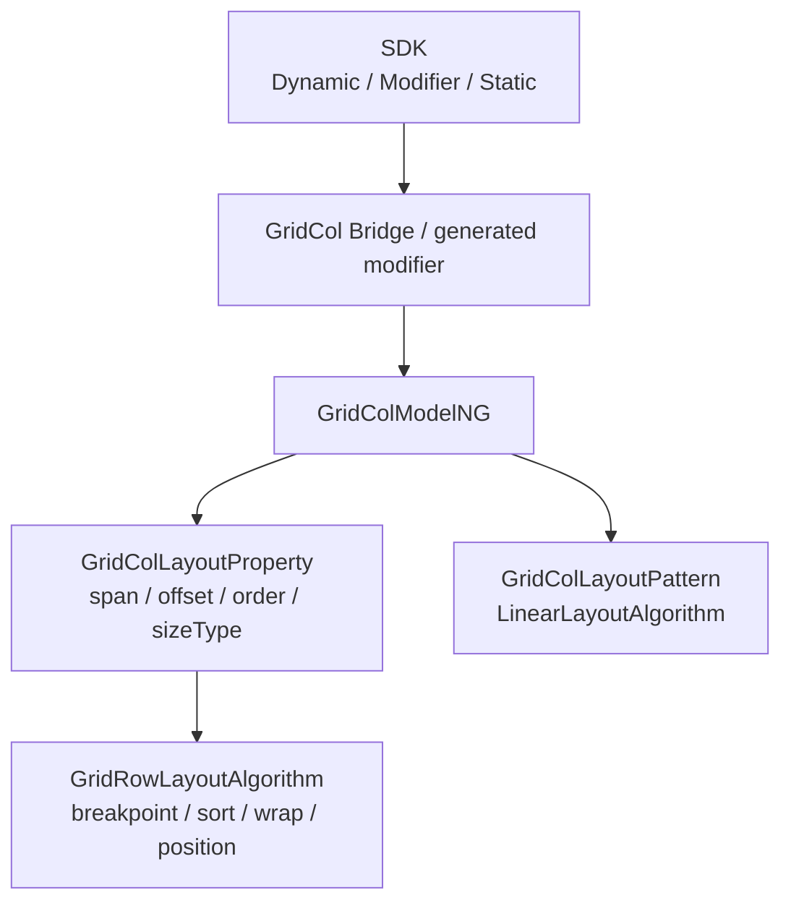
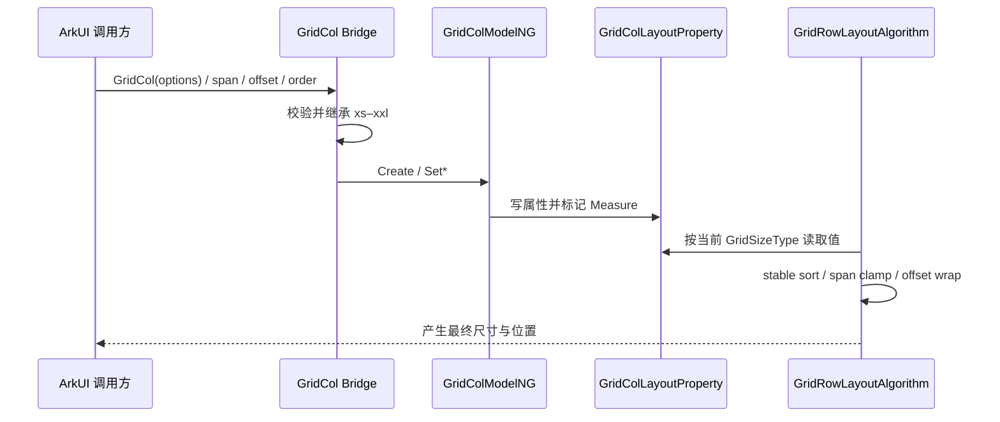
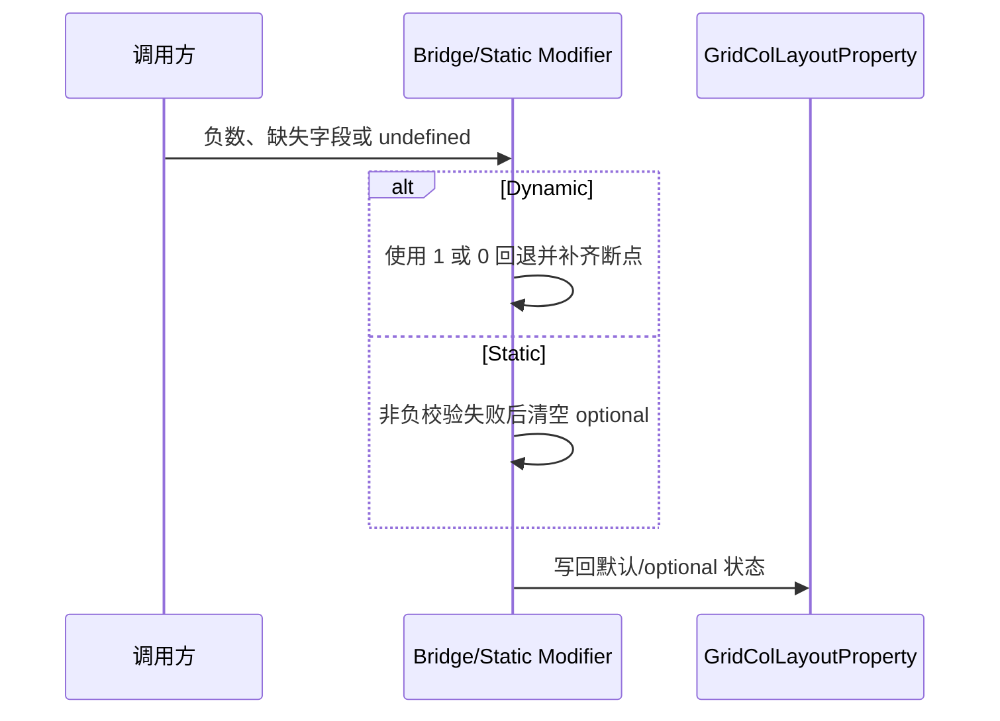

# 架构设计

> GridCol 功能域的共享设计基线：补录响应式占列、偏移与排序、多范式接口及其与 GridRow 的职责边界。

## 设计元数据

| 属性 | 值 |
|------|-----|
| Design ID | DESIGN-Func-05-01-06 |
| 关联需求 | 已有能力补录（无独立 requirement.md） |
| 关联 Epic | 无 |
| 目标 Feature | Feat-01 GridCol 创建与响应式占列, Feat-02 GridCol 偏移、排序与协同布局, Feat-03 GridCol 多范式接口与版本兼容 |
| 复杂度 | 标准 |
| 目标版本 | API 9–26 |
| Owner | ArkUI SIG |
| 状态 | Baselined（已有实现补录） |

## 需求基线

> 本域没有 proposal.md；当前实现及 canonical SDK 声明共同构成存量规格证据，二者不一致时只登记兼容风险。

| 项 | 补充说明（如需） |
|----|------------------|
| 容器身份 | GridCol 必须作为 GridRow 的子组件，且公开契约只允许一个子组件；证据见 `interface/sdk-js/api/@internal/component/ets/grid_col.d.ts:274-287` |
| 响应式属性 | `span`、`offset`、`order` 均保存 xs–xxl 六档值；API 20 仅改变 span 缺失低断点的继承方式 |
| 协同边界 | GridCol 只保存每个断点的占列、偏移、顺序并布局自身内容；换行、列宽、gutter、RTL 和行对齐由 GridRow 计算 |
| 多范式 | Dynamic API 9、AttributeModifier API 12、Static API 23、options/builder API 26 均映射到同一 NG 属性模型 |

## 上下文和现状

### 涉及仓和模块

| 仓库 | 补充架构说明 |
|------|--------------|
| interface/sdk-js | 定义 Dynamic/Static/Modifier 的公开签名、`@since`、默认值与父子约束 |
| arkui_ace_engine/frameworks/core/components_ng/pattern/grid_col | 创建 GridCol FrameNode，持有 GridColLayoutProperty，并提供 Dynamic/Static modifier |
| arkui_ace_engine/frameworks/core/components_ng/pattern/grid_row | 读取 GridCol 属性，完成列宽、offset 换行、order 排序和最终位置计算 |
| arkui_ace_engine/frameworks/core/components_ng/pattern/gridlayout | 提供 xs–xxl 数据模型及 API 20 前后的继承工具 |
| arkui_ace_engine/frameworks/core/interfaces | 暴露内部 ArkUI/CJ modifier ABI；GridCol 不在公开 Native node type 列表中 |

### 调用链层级分析

| 层 | 模块 | 职责 | 修改类型 |
|----|------|------|----------|
| SDK 声明层 | `grid_col.d.ts`、`gridCol.static.d.ets`、GridColModifier | 声明构造、属性、版本和可见范围 | 已有实现补录 |
| ArkTS Bridge 层 | `arkts_native_grid_col_bridge.cpp` | 解析标量/对象，按 API target 选择 span 继承规则 | 已有实现补录 |
| Modifier 层 | `grid_col_dynamic_modifier.cpp`、`grid_col_static_modifier.cpp` | set/reset、Static union 转换和 CJ/internal ABI 接入 | 已有实现补录 |
| Model/Node 层 | `grid_col_model_ng.cpp` | 创建 GRID_COL FrameNode 并更新布局属性 | 已有实现补录 |
| Property/Pattern 层 | `grid_col_layout_property.h`、`grid_col_layout_pattern.h` | 保存六档属性，提供纵向 LinearLayoutAlgorithm 与焦点范围 | 已有实现补录 |
| 父容器算法层 | `grid_row_layout_algorithm.cpp` | 选择当前断点值，排序、换行、测量并定位 GridCol | 已有实现补录 |

- [x] 调用链从公开声明到父容器布局消费均已覆盖
- [x] GridCol 与 GridRow 的属性所有权、算法所有权分离
- [x] 各层仅记录现有行为，不提出产品源码修改

### 适用架构规则

| Rule ID | 适用原因 | 设计结论 | 验证方式 |
|---------|----------|----------|----------|
| OH-ARCH-LAYERING | 涉及 SDK、Bridge、Modifier、Model、Property、Algorithm | 只允许上层解析后写属性，GridRow 算法通过 LayoutProperty 消费，不反向依赖 Bridge | 架构评审/依赖检查 |
| OH-ARCH-SUBSYSTEM | GridCol 与 GridRow 同属 ArkUI NG 布局 | 不新增跨子系统调用 | 代码评审 |
| OH-ARCH-IPC-SAF | 不访问 SA/IPC | N/A，状态仅在 UI 节点和布局管线内流转 | 代码审查 |
| OH-ARCH-API-LEVEL | 存在 API 9/12/20/23/26 边界 | 对外版本以 canonical SDK 为准，实现分支作为兼容证据 | API 评审/XTS |
| OH-ARCH-COMPONENT-BUILD | 不新增构建目标 | BUILD.gn 与 bundle.json 保持不变 | 构建检查 |
| OH-ARCH-ERROR-LOG | 非法属性需降级 | 复用各入口既有默认值/reset 行为，不新增错误码 | UT/fuzz |

## 不涉及项承接

| 维度 | 设计结论 |
|------|----------|
| 安全与权限 | Public ArkUI 布局接口，不读取敏感数据，不新增权限 |
| IPC/跨进程 | N/A；无 SA、IPC 或远端状态 |
| 数据持久化 | N/A；属性随 FrameNode 生命周期存在 |
| 构建与部件 | 无变更；沿用现有 ArkUI 组件构建目标 |
| 性能 | 涉及但无新增指标；GridRow 既有线性遍历完成测量与排序 |
| 兼容性 | 涉及；重点保留 API 20 span 继承变化和 Dynamic/Static reset 差异 |
| Native API | 不新增独立 NDK 能力；仅记录内部 modifier ABI 及公开 Native node type 缺失事实 |

## 关键设计决策

| 决策 ID | 问题 | 推荐方案 | 探索过的替代方案 | 取舍理由 | 影响 |
|---------|------|----------|-----------------|----------|------|
| ADR-1 | GridCol 是否自行决定栅格位置 | GridCol 仅持有 span/offset/order，由 GridRow 算法统一选择断点并定位 | 方案A：GridCol 自行计算 x/y；方案B：每个 GridCol 独立读取窗口断点 | 当前实现由父容器掌握总列数、gutter、行状态和 RTL，只有父容器拥有完整约束 | Feat-01/02 必须把换行和定位写成协同结果 |
| ADR-2 | API 20 span 继承如何固化 | API 20 前 xs 缺失使用 1、其余向前继承；API 20 起首个有效值向低档补齐、其余仍向前继承 | 方案A：所有版本统一旧规则；方案B：offset/order 一并切换新规则 | SDK 与 Bridge 都只对 span 建立 API 20 分支，统一会破坏既有应用布局 | 版本升级时未显式设置 xs/sm 的应用可能改变占列 |
| ADR-F2-1 | offset 超过剩余列时如何处理 | 由 GridRow 计算跨行数；当前行能容纳 offset 但容纳不了 span 时换到下一行 offset=0，大 offset 可跨多行 | 方案A：截断 offset；方案B：把 span 强行压入本行 | 当前算法保留 offset 的行推进语义并限制 span 不超过总列数 | 需要覆盖等于边界、跨一行和跨多行 |
| ADR-F2-2 | order 相同时如何保持稳定 | 使用 list stable sort 按当前断点 order 升序；相同 order 保持原子项顺序 | 方案A：用节点 ID 二次排序；方案B：重建子列表 | SDK 要求同值按代码顺序，`std::list::sort` 的稳定性与现有实现一致 | 未设置 order 的 0 值项排在正值项之前 |
| ADR-F3-1 | 多范式默认和非法输入是否统一 | 不跨通道强制归一；分别记录 Dynamic、Static、modifier 的解析、undefined/reset 与非负校验 | 方案A：只写 SDK 理想语义；方案B：修改实现后补录 | 存量补录必须可复现实装行为，偏差只能列为风险 | 各通道测试矩阵必须分开 |
| ADR-F3-2 | GridCol 是否声明公开 Native node API | 不声明；仅登记内部 Arkoala/CJ modifier，公开 Native node type 中没有 GridRow/GridCol | 方案A：把内部 ABI 当 Public C API；方案B：为本域新增 NDK 目标 | 内部 ABI 不是开发者公开契约，且本轮明确不建设独立 NDK 域 | 接口规格不得承诺 Native 创建 GridCol |

## 设计骨架

### 骨架范围

| 骨架项 | 目标 | 不包含 | 验证方式 |
|--------|------|--------|----------|
| 创建与 span | 固化节点身份、单子项约束、默认值和六档响应式继承 | GridRow 断点如何选取 | SDK/NG UT、源码追溯 |
| offset/order | 固化六档偏移、稳定排序及换行协同 | GridRow gutter、alignItems 的完整定义 | GridRow layout UT |
| 多范式 | 固化 Dynamic/Modifier/Static 的版本和 set/reset | 新增公开 Native API | SDK 编译测试、modifier UT |

### 骨架 Spec 拆分

| Task ID | 目标 | 受影响文件 | AC |
|---------|------|------------|-----|
| TASK-SKELETON-1 | 创建、容器约束、span 与 API 20 继承 | `Feat-01-grid-col-creation-responsive-span-spec.md` | Feat-01 全部 AC |
| TASK-SKELETON-2 | offset、order、稳定排序和协同换行 | `Feat-02-grid-col-offset-order-layout-spec.md` | Feat-02 全部 AC |
| TASK-SKELETON-3 | Dynamic/Modifier/Static/内部 ABI 兼容 | `Feat-03-grid-col-multi-paradigm-version-spec.md` | Feat-03 全部 AC |

## 后续 Task 拆分

| Task ID | 目标 | 受影响文件 | 依赖 |
|---------|------|------------|------|
| TASK-FEAT-01 | 补录创建与响应式占列规格 | `Feat-01-grid-col-creation-responsive-span-spec.md` | Dynamic/Static SDK、GridCol Model/Property |
| TASK-FEAT-02 | 补录偏移、顺序及父容器协作规格 | `Feat-02-grid-col-offset-order-layout-spec.md` | Feat-01、GridRow layout algorithm |
| TASK-FEAT-03 | 补录多范式和版本兼容矩阵 | `Feat-03-grid-col-multi-paradigm-version-spec.md` | Feat-01/02、Modifier 与 Arkoala ABI |

## API 签名、Kit 与权限

> 下表登记既有公开接口，不表示本次新增 API。

### 新增 API

| API 签名 | 类型 | Kit | d.ts 位置 | 权限要求 | SysCap |
|----------|------|-----|------------|----------|--------|
| `GridCol(option?: GridColOptions): GridColAttribute` | Public | ArkUI | `interface/sdk-js/api/@internal/component/ets/grid_col.d.ts:199-212` | 无 | ArkUI.Full |
| `span(value: number \| GridColColumnOption)` | Public | ArkUI | `interface/sdk-js/api/@internal/component/ets/grid_col.d.ts:226-240` | 无 | ArkUI.Full |
| `gridColOffset(value: number \| GridColColumnOption)` | Public | ArkUI | `interface/sdk-js/api/@internal/component/ets/grid_col.d.ts:242-255` | 无 | ArkUI.Full |
| `order(value: number \| GridColColumnOption)` | Public | ArkUI | `interface/sdk-js/api/@internal/component/ets/grid_col.d.ts:257-271` | 无 | ArkUI.Full |
| Static `GridCol(option?, content_?)` | Public | ArkUI | `interface/sdk-js/api/arkui/component/gridCol.static.d.ets:187-202` | 无 | ArkUI.Full |
| Static `setGridColOptions(options?)` / builder overload | Public | ArkUI | `interface/sdk-js/api/arkui/component/gridCol.static.d.ets:164-219` | 无 | ArkUI.Full |

### 变更/废弃 API

| 原有 API | 变更类型 | 新 API | 迁移说明 |
|----------|----------|--------|----------|
| 无 | 无 | 无 | 本次为存量能力补录；API 20 的 span 继承差异属于既有版本行为 |

## 构建系统影响

### BUILD.gn 变更

```text
无变更。GridCol 继续使用 ace_engine 现有 GridCol、GridRow 和 gridlayout 源集。
```

### bundle.json 变更

无新增 component、依赖或 bundle 配置。

## 可选设计扩展

### 架构图



### 数据流/控制流

| 步骤 | 调用方 | 被调用方 | 数据/接口 | 说明 |
|------|--------|----------|-----------|------|
| 1 | ArkTS/Static 调用方 | SDK 入口 | GridColOptions 或单属性值 | 入口版本决定可用签名 |
| 2 | Bridge/Modifier | 解析器 | 标量或 xs–xxl 对象 | 过滤负数并补齐缺失断点 |
| 3 | Modifier | GridColModelNG | GridContainerSize | 创建或更新 Span/Offset/Order |
| 4 | Pipeline | GridRowLayoutAlgorithm | 当前 GridSizeType、总列数、gutter | 读取 GridCol 当前档属性 |
| 5 | GridRowLayoutAlgorithm | GridCol child | 理想宽度与偏移 | 排序、换行、测量并定位 |

### 时序设计



### 数据模型设计

```typescript
interface GridColColumnOption {
  xs?: number;
  sm?: number;
  md?: number;
  lg?: number;
  xl?: number;
  xxl?: number;
}

interface GridColOptions {
  span?: number | GridColColumnOption;
  offset?: number | GridColColumnOption;
  order?: number | GridColColumnOption;
}
```

```cpp
// V2::GridContainerSize 保存 xs/sm/md/lg/xl/xxl 六档整数。
// GridColLayoutProperty 以 PROPERTY_UPDATE_MEASURE 持有：
// Span, Offset, Order；SizeType 由 GridRow 在测量时更新。
```

| 状态 | 持有方 | 生命周期 |
|------|--------|----------|
| span/offset/order 六档值 | GridColLayoutProperty | 随 GridCol FrameNode |
| 当前 sizeType | GridColLayoutProperty | 每次 GridRow Measure 依据当前断点更新 |
| 行内 offset、跨行数 | GridRowLayoutAlgorithm 临时结构 | 单次布局过程 |

### 算法与状态机

span 继承：

```text
API target < 20:
  xs 缺失 -> 1；sm..xxl 缺失 -> 前一档
API target >= 20:
  找到首个有效 span 并回填 xs；sm..xxl 缺失 -> 前一档
offset/order:
  xs 缺失 -> 0；sm..xxl 缺失 -> 前一档
```

父容器测量的核心公式：

- `effectiveSpan = min(gridCol.span[sizeType], gridRow.columns[sizeType])`；
- 子项宽度为 `columnUnitWidth * effectiveSpan + gutterX * (effectiveSpan - 1)`；
- 当剩余列小于 `offset + effectiveSpan` 时进入换行分支。实现见 `frameworks/core/components_ng/pattern/grid_row/grid_row_layout_algorithm.cpp:44-80,120-189`。

### 测试性设计

| 测试层级 | 测试目标 | Mock 策略 | 验证方式 |
|----------|----------|-----------|----------|
| SDK compile | API 9/12/23/26 可见性 | 指定 API level 编译 | Dynamic/Modifier/Static 签名 |
| GridCol NG UT | Create、默认值、set/reset | 构造 FrameNode | 检查 LayoutProperty |
| GridRow layout UT | span/offset/order 协同 | 固定 columns/gutter/child size | 检查行号、宽度与 offset |
| 版本矩阵 | API 19 与 API 20 span 继承 | 相同缺省对象、不同 target | 比对 xs/sm 的最终值 |
| Fuzz/非法值 | 负数、缺字段、undefined | 入口参数矩阵 | 检查默认或 reset 且不崩溃 |

### 异常传播时序图



| 异常场景 | 传播/恢复结论 |
|----------|---------------|
| span 标量为负 | Dynamic 回退 1；Static 非负校验清空 optional |
| offset/order 标量为负 | Dynamic 回退 0；Static 非负校验清空 optional |
| GridRow 中出现非 GridCol 子项 | 父算法跳过该子项，不把它计入栅格行 |
| GridCol 不在 GridRow 下 | 不存在完整栅格列上下文，公开契约不保证独立布局结果 |

### 资源所有权矩阵

| 资源 | 创建方 | 持有方 | 销毁触发 | 实际释放 | 异常回收 |
|------|--------|--------|----------|----------|----------|
| GridCol FrameNode | GridColModelNG | UI 树 | 节点移除 | AceType 引用计数 | UI 树标准回收 |
| GridColLayoutProperty | Pattern/FrameNode | FrameNode | 节点销毁 | AceType 引用计数 | Reset 清空属性 |
| 布局临时行数据 | GridRowLayoutAlgorithm | 单次算法实例 | 布局结束 | 容器析构 | 下次 Measure 重建 |

### 接口参数规约

| 接口 | 参数 | 类型 | 合法范围 | 非法处理 | 边界说明 |
|------|------|------|----------|----------|----------|
| GridCol/span | value | number/GridColColumnOption | 非负整数；0 合法 | Dynamic 回退 1；Static 清空 optional | 0 不参与布局/渲染 |
| gridColOffset | value | number/GridColColumnOption | 非负整数 | Dynamic 回退 0；Static 清空 optional | 可超过单行剩余列并触发跨行 |
| order | value | number/GridColColumnOption | 非负整数 | Dynamic 回退 0；Static 清空 optional | 相同值保持源码顺序 |
| setGridColOptions | options | GridColOptions/undefined | API 26 Static | undefined 清空 Static optional | 不改变 Dynamic API 9 构造签名 |

### 线程与并发模型

| 操作 | 发起线程 | 回调线程 | 跨进程边界 | 线程安全 | 重入约束 |
|------|----------|----------|------------|----------|----------|
| 创建/属性更新 | UI 线程 | 无回调 | 无 | 依赖 UI 树串行更新 | 不支持跨线程并发写节点 |
| Measure/Layout | UI 布局线程 | 无回调 | 无 | 单次 Pipeline 内顺序执行 | 脏标记进入后续布局周期 |

## 详细设计

### 创建与响应式占列

GridColModelNG 创建 `GRID_COL_ETS_TAG` FrameNode，并写入 span/offset/order；Pattern 非原子，创建 GridColLayoutProperty 和纵向 LinearLayoutAlgorithm。证据见 `frameworks/core/components_ng/pattern/grid_col/grid_col_model_ng.cpp:24-58`、`frameworks/core/components_ng/pattern/grid_col/grid_col_layout_pattern.h:28-54`。六档属性均声明为 `PROPERTY_UPDATE_MEASURE`，当前档 getter 的缺省值分别是 1/0/0，见 `frameworks/core/components_ng/pattern/grid_col/grid_col_layout_property.h:29-75`。

Dynamic Bridge 在 API target 20 前使用 `InheritGridContainerSize(..., 1)`，API 20 起对 span 使用 `InheritGridColumnsNG`；offset/order 保持默认 0 和向前继承。证据见 `frameworks/core/components_ng/pattern/grid_col/bridge/arkts_native_grid_col_bridge.cpp:68-190,212-237`。

### 偏移、排序与协同布局

GridRow 在测量开始时对 GridCol 列表按当前断点 order 排序，跳过非 GridCol 子项，把 span 限制到总列数后计算 offset 是否换行。宽度由有效 span 和横向 gutter 共同决定。证据见 `frameworks/core/components_ng/pattern/grid_row/grid_row_layout_algorithm.cpp:120-189,587-599`。

大 offset 的跨行数和新行 offset 通过整数除法及余数计算；若余数加 span 再次超过总列数，则额外换一行并以 0 offset 放置。证据见 `frameworks/core/components_ng/pattern/grid_row/grid_row_layout_algorithm.cpp:44-80`。

### 多范式与版本映射

Dynamic 创建和属性自 API 9 可用；Dynamic modifier 自 API 12 可用；Static 类型、属性和构造自 API 23 可用，`setGridColOptions` 与 builder overload 自 API 26 可用。声明证据见 `interface/sdk-js/api/@internal/component/ets/grid_col.d.ts:189-287`、`interface/sdk-js/api/arkui/GridColModifier.d.ts:24-57` 和 `interface/sdk-js/api/arkui/component/gridCol.static.d.ets:123-219`。

Dynamic modifier 提供 NG、legacy 和 CJ 路由并在 reset 时恢复 1/0/0，见 `frameworks/core/components_ng/pattern/grid_col/bridge/grid_col_dynamic_modifier.cpp:49-137,182-300`。Static modifier 对任一负断点执行 optional 清空，并分别写 span/offset/order，见 `frameworks/core/components_ng/pattern/grid_col/bridge/grid_col_static_modifier.cpp:35-45,111-181`。

## 风险和开放问题

| 项 | 类型 | 影响 | 处理方式 | Owner |
|----|------|------|----------|-------|
| API 20 升级改变缺失低断点 span | API | 中 | Spec 明确版本矩阵；推荐应用显式配置所需断点 | ArkUI SIG |
| Static 断点继承实现仍采用 xs 默认后向前继承，未显式按 API 20 Dynamic 规则分流 | API | 中 | 仅列通道风险，Static 测试按当前实现验证 | ArkUI SIG |
| 内部 Arkoala/CJ modifier 易被误认为公开 Native API | 架构 | 中 | API 表只登记 SDK Public；内部 ABI 仅在设计说明 | ArkUI SIG |
| GridCol 脱离 GridRow 时没有完整栅格语义 | 测试 | 低 | 构造用例必须把 GridCol 放在 GridRow 下；独立使用仅做容错观察 | ArkUI SIG |

## 设计审批

- [x] 需求基线已确认，设计覆盖 P0/P1 AC
- [x] 不涉及项已承接，N/A 和展开项都有结论
- [x] 涉及仓和模块职责清楚
- [x] 调用链层级分析完整，每层覆盖到位
- [x] 适用架构规则已识别并形成设计结论
- [x] 分层和子系统边界合规
- [x] API 变更有签名、权限、错误码和兼容性说明
- [x] BUILD.gn/bundle.json 影响明确
- [x] 设计输出和后续 Task 拆分明确
- [x] 关键设计决策有理由和影响说明
- [x] 风险和开放问题有 Owner

**结论:** 通过（已有实现补录）。
