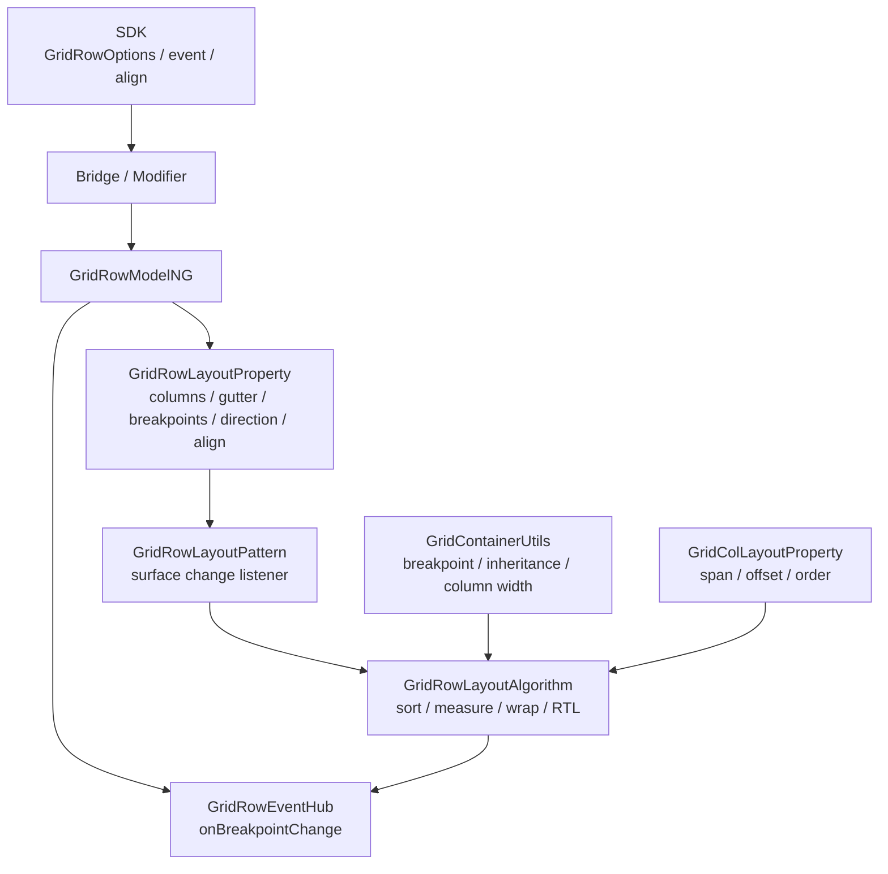
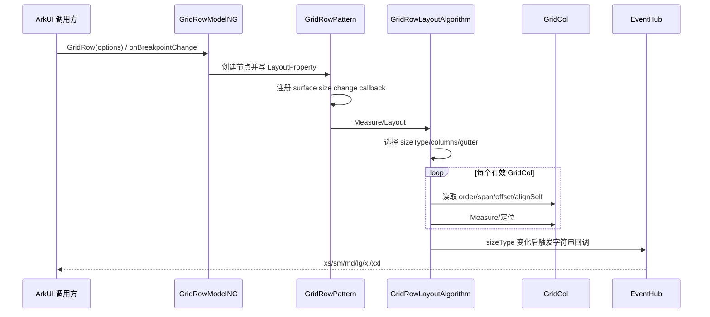
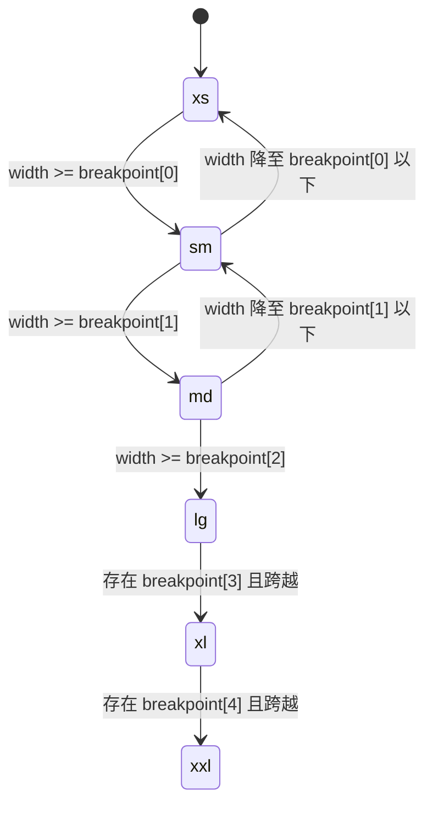
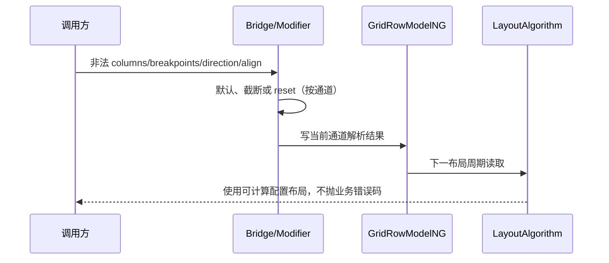

# 架构设计

> GridRow 功能域的共享设计基线：补录响应式列系统、gutter、断点事件、排列/RTL 及多范式接口。

## 设计元数据

| 属性 | 值 |
|------|-----|
| Design ID | DESIGN-Func-05-01-07 |
| 关联需求 | 已有能力补录（无独立 requirement.md） |
| 关联 Epic | 无 |
| 目标 Feature | Feat-01 GridRow 列系统与间距, Feat-02 GridRow 响应式断点与变更事件, Feat-03 GridRow 排列、换行、对齐与 RTL, Feat-04 GridRow 多范式接口与版本兼容 |
| 复杂度 | 复杂 |
| 目标版本 | API 9–26 |
| Owner | ArkUI SIG |
| 状态 | Baselined（已有实现补录） |

## 需求基线

> 本域没有 proposal.md；canonical SDK 决定公开接口和版本，ace_engine 当前实现决定可验收的存量运行行为。

| 项 | 补充说明（如需） |
|----|------------------|
| 栅格列系统 | GridRow 持有 xs–xxl 总列数与横纵 gutter，并按内容宽度计算单位列宽 |
| 响应式断点 | 默认断点为 320vp/600vp/840vp，reference 默认 WindowSize；当前断点决定 GridRow 和全部 GridCol 的档位 |
| 排列职责 | GridRow 只接受 GridCol 作为有效栅格子项，负责 order、span/offset 换行、alignItems 和 RTL |
| 版本边界 | API 20 改变 columns 默认值与缺失低档继承；API 23/26 增加 Static 表面 |

## 上下文和现状

### 涉及仓和模块

| 仓库 | 补充架构说明 |
|------|--------------|
| interface/sdk-js | Dynamic/Static/Modifier 公开契约、枚举、默认值、`@since` |
| arkui_ace_engine/frameworks/core/components_v2/grid_layout | 六档 columns/gutter/breakpoint 基础数据模型 |
| arkui_ace_engine/frameworks/core/components_ng/pattern/gridlayout | 解析当前断点、继承 columns/gutter、计算单位列宽 |
| arkui_ace_engine/frameworks/core/components_ng/pattern/grid_row | Model、Property、Pattern、EventHub 和 LayoutAlgorithm |
| arkui_ace_engine/frameworks/core/components_ng/pattern/grid_col | 向 GridRow 提供当前断点 span/offset/order |
| arkui_ace_engine/frameworks/core/interfaces | Dynamic/Static/CJ 内部 modifier ABI；无公开 Native GridRow node type |

### 调用链层级分析

| 层 | 模块 | 职责 | 修改类型 |
|----|------|------|----------|
| SDK 声明层 | `grid_row.d.ts`、`gridRow.static.d.ets`、GridRowModifier | 声明 options、事件、对齐和版本 | 已有实现补录 |
| Bridge 解析层 | `arkts_native_grid_row_bridge.cpp` | 解析 columns/gutter/breakpoints/direction/align/callback | 已有实现补录 |
| Modifier 层 | `grid_row_dynamic_modifier.cpp`、`grid_row_static_modifier.cpp` | create、set/reset、事件注册和通道转换 | 已有实现补录 |
| Model 层 | `grid_row_model_ng.cpp` | 创建 FrameNode、写布局属性、绑定事件 | 已有实现补录 |
| Property/Pattern 层 | `grid_row_layout_property.h`、`grid_row_layout_pattern.cpp` | 保存状态并监听窗口/组件尺寸变化 | 已有实现补录 |
| Shared utility 层 | `grid_container_utils.cpp` | 选择断点、继承六档值、处理资源 gutter | 已有实现补录 |
| Layout/Event 层 | `grid_row_layout_algorithm.cpp`、`grid_row_event_hub.h` | 测量/换行/对齐/RTL，并在断点变化后回调 | 已有实现补录 |

- [x] 调用链覆盖 SDK 到布局结果及事件回调
- [x] GridRow 与 GridCol 的容器/子项职责清晰
- [x] Dynamic、Static、legacy 和内部 ABI 均单独识别

### 适用架构规则

| Rule ID | 适用原因 | 设计结论 | 验证方式 |
|---------|----------|----------|----------|
| OH-ARCH-LAYERING | 多层解析和布局消费 | SDK/Bridge 只写 Model/Property，Algorithm 不依赖 Bridge | 架构评审 |
| OH-ARCH-SUBSYSTEM | 同属 ArkUI 布局子系统 | 不新增跨子系统依赖 | 依赖检查 |
| OH-ARCH-IPC-SAF | 无 SA/IPC | 所有状态和回调在当前 UI Pipeline | 代码审查 |
| OH-ARCH-API-LEVEL | API 9/10/12/20/23/26 | 公开版本以 canonical SDK 为准；实现偏差单列风险 | API 评审/XTS |
| OH-ARCH-COMPONENT-BUILD | 不新增构建目标 | BUILD.gn/bundle.json 无变化 | 构建验证 |
| OH-ARCH-ERROR-LOG | 断点和枚举存在非法输入 | 按入口保留默认、截断或 reset，不新增错误码 | UT/fuzz |

## 不涉及项承接

| 维度 | 设计结论 |
|------|----------|
| 权限与安全 | Public ArkUI 布局能力，无权限和敏感数据 |
| IPC/跨进程 | N/A；事件不跨进程 |
| 持久化/迁移 | N/A；状态随 FrameNode 生命周期 |
| 构建与部件 | 无变更 |
| 性能 | 涉及；断点选择为固定上限比较，子项测量及排序沿用现有算法 |
| 多窗口 | 涉及；WindowSize/ComponentSize 可触发重测和 breakpoint 回调 |
| Native API | 不建设独立 NDK 域；内部 modifier 不视为 Public Native API |

## 关键设计决策

| 决策 ID | 问题 | 推荐方案 | 探索过的替代方案 | 取舍理由 | 影响 |
|---------|------|----------|-----------------|----------|------|
| ADR-1 | 总列数与 gutter 由谁持有 | GridRow 以六档 GridContainerSize/Gutter 持有，GridCol 仅持有占列输入 | 方案A：每个 GridCol 复制总列数；方案B：全局单例栅格配置 | 父容器拥有内容宽度和全部子项，能统一计算列宽和换行 | Feat-01 定义容器侧公式，GridCol spec 仅引用结果 |
| ADR-2 | API 20 columns 如何兼容 | API 20 前默认六档 12；API 20 起默认 2/4/8/12/12/12，并由首个有效配置回填低档 | 方案A：始终默认 12；方案B：只改变默认值不改变继承 | SDK 和 Create Bridge 同时具有版本分支，需完整保留 | 未显式 columns 的升级应用会得到不同小屏列数 |
| ADR-F2-1 | 断点参照如何选择 | WindowSize 读取窗口/页面宽度，ComponentSize 读取 GridRow 内容宽度；用户断点优先于系统和默认断点 | 方案A：统一使用窗口；方案B：只允许用户断点 | 两种参照均为公开 API，且组件嵌套场景需要局部宽度 | 回调和当前 sizeType 必须使用同一参照 |
| ADR-F2-2 | 断点事件何时触发 | Layout 后比较新旧 sizeType，仅变化时通过 EventHub 回调 xs–xxl 字符串 | 方案A：尺寸每变一次都回调；方案B：Measure 前回调 | 只报告语义断点变化，避免像素级尺寸变化产生冗余回调 | ComponentSize 回调中修改自身 padding/margin 有反馈风险 |
| ADR-F3-1 | direction 与 RTL 如何组合 | effective reverse 为 RowReverse XOR RTL，并在最终 Layout 镜像位置 | 方案A：RTL 忽略 direction；方案B：Measure 阶段重排子列表 | 当前算法以逻辑行不变、最终位置镜像实现组合语义 | 视觉顺序与 order 稳定排序可独立验证 |
| ADR-F3-2 | alignSelf 与 alignItems 冲突谁优先 | 子项 alignSelf 优先；Stretch 时对未显式尺寸子项按行高重测 | 方案A：父 alignItems 总是覆盖；方案B：只改 offset 不重测 | SDK 明确子项优先，Stretch 需要可观察尺寸变化 | 需覆盖 Start/Center/End/Stretch 与子项 override |
| ADR-F4-1 | 多范式异常值是否统一 | 不强制归一，分别补录 Dynamic、Static、legacy 的当前处理 | 方案A：只写 SDK 理想行为；方案B：先修改实现 | 当前任务不改源码，通道差异必须作为风险可追溯 | direction raw cast、breakpoint 截断、Static 对齐扩展分别测试 |
| ADR-F4-2 | 是否提供 Public Native GridRow API | 不提供；只记录内部 ArkUI/CJ modifier | 方案A：把 Arkoala 结构写成 Public；方案B：新增 NDK node | 公开 Native NodeType 不含 GridRow，不能扩大开放范围 | Feat-04 的接口清单不含 Public C API |

## 设计骨架

### 骨架范围

| 骨架项 | 目标 | 不包含 | 验证方式 |
|--------|------|--------|----------|
| columns/gutter | 默认值、继承、资源更新、列宽公式 | GridCol 专有属性解析细节 | GridRow Measure UT |
| breakpoints/event | 参照、优先级、sizeType、回调 | 应用业务回调逻辑 | resize/event UT |
| arrangement | order、wrap、align、direction/RTL、layout policy | 非 GridCol 通用布局 | Layout UT |
| multi-paradigm | Dynamic/Static/Modifier/legacy/内部 ABI | Public Native GridRow | SDK 编译与 modifier UT |

### 骨架 Spec 拆分

| Task ID | 目标 | 受影响文件 | AC |
|---------|------|------------|-----|
| TASK-SKELETON-1 | columns、gutter 和列宽 | `Feat-01-grid-row-columns-gutter-spec.md` | Feat-01 全部 AC |
| TASK-SKELETON-2 | breakpoint 选择与事件 | `Feat-02-grid-row-breakpoints-event-spec.md` | Feat-02 全部 AC |
| TASK-SKELETON-3 | 排列、对齐、RTL | `Feat-03-grid-row-arrangement-alignment-rtl-spec.md` | Feat-03 全部 AC |
| TASK-SKELETON-4 | 多范式与版本 | `Feat-04-grid-row-multi-paradigm-version-spec.md` | Feat-04 全部 AC |

## 后续 Task 拆分

| Task ID | 目标 | 受影响文件 | 依赖 |
|---------|------|------------|------|
| TASK-FEAT-01 | 补录列系统与 gutter | `Feat-01-grid-row-columns-gutter-spec.md` | SDK、GridRow Model、grid_container_utils |
| TASK-FEAT-02 | 补录断点与回调 | `Feat-02-grid-row-breakpoints-event-spec.md` | Feat-01 六档模型、Pattern/EventHub |
| TASK-FEAT-03 | 补录排列、换行、对齐、RTL | `Feat-03-grid-row-arrangement-alignment-rtl-spec.md` | Feat-01/02、GridCol 属性 |
| TASK-FEAT-04 | 补录多范式版本矩阵 | `Feat-04-grid-row-multi-paradigm-version-spec.md` | Dynamic/Static SDK 与 modifier |

## API 签名、Kit 与权限

> 以下均为既有 API。

### 新增 API

| API 签名 | 类型 | Kit | d.ts 位置 | 权限要求 | SysCap |
|----------|------|-----|------------|----------|--------|
| `GridRow(option?: GridRowOptions): GridRowAttribute` | Public | ArkUI | `interface/sdk-js/api/@internal/component/ets/grid_row.d.ts:453-476` | 无 | ArkUI.Full |
| `onBreakpointChange(callback: (breakpoints: string) => void)` | Public | ArkUI | `interface/sdk-js/api/@internal/component/ets/grid_row.d.ts:488-507` | 无 | ArkUI.Full |
| `alignItems(value: ItemAlign): GridRowAttribute` | Public | ArkUI | `interface/sdk-js/api/@internal/component/ets/grid_row.d.ts:509-526` | 无 | ArkUI.Full |
| Static `GridRow(option?, content_?)` | Public | ArkUI | `interface/sdk-js/api/arkui/component/gridRow.static.d.ets:360-375` | 无 | ArkUI.Full |
| Static `setGridRowOptions(options?)` / builder | Public | ArkUI | `interface/sdk-js/api/arkui/component/gridRow.static.d.ets:316-392` | 无 | ArkUI.Full |

### 变更/废弃 API

| 原有 API | 变更类型 | 新 API | 迁移说明 |
|----------|----------|--------|----------|
| GridRowOptions.columns | 变更 | 签名不变 | API 20 起默认值及低断点继承改变；建议显式配置所需断点 |

## 构建系统影响

### BUILD.gn 变更

```text
无变更。继续使用 GridRow、GridCol、gridlayout 和既有 generated modifier 源集。
```

### bundle.json 变更

无新增 component 或依赖。

## 可选设计扩展

### 架构图



### 数据流/控制流

| 步骤 | 调用方 | 被调用方 | 数据/接口 | 说明 |
|------|--------|----------|-----------|------|
| 1 | ArkTS/Static 调用方 | Bridge/Modifier | GridRowOptions | 解析 columns/gutter/breakpoints/direction |
| 2 | Modifier | GridRowModelNG | 六档对象、BreakPoints、枚举 | 写 LayoutProperty 或 EventHub |
| 3 | 窗口/组件尺寸变化 | GridRowPattern | FrameNode | 标记 Measure dirty |
| 4 | GridRowLayoutAlgorithm | GridContainerUtils | reference width、断点表 | 选 sizeType、columns、gutter、列宽 |
| 5 | GridRowLayoutAlgorithm | GridColLayoutProperty | span/offset/order/alignSelf | 排序、换行、测量和行内对齐 |
| 6 | Layout 完成 | GridRowEventHub | xs–xxl 字符串 | 仅 sizeType 变化时回调 |

### 时序设计



### 数据模型设计

```typescript
interface GridRowOptions {
  gutter?: Length | GutterOption;
  columns?: number | GridRowColumnOption;
  breakpoints?: BreakPoints;
  direction?: GridRowDirection;
}

interface BreakPoints {
  value?: Array<string>;
  reference?: BreakpointsReference;
}
```

```cpp
// GridRowLayoutProperty 持有 PROPERTY_UPDATE_MEASURE 状态：
// Columns, Gutter, BreakPoints, Direction, AlignItems, SizeType。
// GridRowEventHub 持有 onBreakpointChange callback。
```

| 状态 | 持有方 | 生命周期 |
|------|--------|----------|
| 六档 columns/gutter | GridRowLayoutProperty | 随 GridRow FrameNode |
| breakpoint 配置与当前 sizeType | GridRowLayoutProperty | 配置随节点；sizeType 每次测量更新 |
| breakpoint callback | GridRowEventHub | 注册至 reset 或节点销毁 |
| 行分组/偏移临时数据 | GridRowLayoutAlgorithm | 单次测量/布局 |

### 算法与状态机

单位列宽：

```text
contentWidth = GridRow frame width - horizontal padding/border
columnUnitWidth =
  (contentWidth - gutterX * (columns - 1)) / columns
childWidth =
  columnUnitWidth * span + gutterX * (span - 1)
```

断点优先级：用户自定义 > 系统栅格配置 > 默认 320/600/840；sizeType 由参照宽度跨过的阈值数量确定。实现见 `frameworks/core/components_ng/pattern/gridlayout/grid_container_utils.cpp:62-128`。



### 测试性设计

| 测试层级 | 测试目标 | Mock 策略 | 验证方式 |
|----------|----------|-----------|----------|
| SDK compile | API 9/10/12/23/26 | 指定 API level | Dynamic/Static/Modifier 可见性 |
| GridRow NG UT | 创建、默认值、set/reset | 固定 FrameNode | 检查 LayoutProperty/EventHub |
| Breakpoint UT | Window/Component、默认/用户/系统 | Mock Pipeline/window/config | 检查 sizeType 与回调 |
| Layout UT | 列宽、换行、align、RTL | 固定 GridCol 尺寸和属性 | 检查 frame size/offset |
| 版本矩阵 | API target 19/20 | 相同 options | 检查 columns 六档最终值 |

### 异常传播时序图



| 异常场景 | 当前处理 |
|----------|----------|
| columns <= 0 | Dynamic 使用当前版本默认 columns |
| breakpoint 非递增 | canonical SDK 要求默认；modifier 实现存在截断风险 |
| direction raw 非法枚举 | SDK 要求 Row；Dynamic setter 直接传值，列为风险 |
| alignItems 非四个支持值 | API 10+ Dynamic Bridge 写 Start |
| 非 GridCol 子项 | Measure 跳过 |

### 资源所有权矩阵

| 资源 | 创建方 | 持有方 | 销毁触发 | 实际释放 | 异常回收 |
|------|--------|--------|----------|----------|----------|
| GridRow FrameNode/Pattern | GridRowModelNG | UI 树 | 节点移除 | AceType 引用计数 | 标准 UI 树回收 |
| surface change callback | GridRowPattern | Pipeline/Pattern | detach/节点销毁 | callback id 注销 | 弱节点检查 |
| breakpoint callback | 应用/Bridge | GridRowEventHub | reset/节点销毁 | std::function 释放 | 非函数输入执行 reset |
| gutter ResourceObject | Model/Property | Gutter 六档对象 | reset/节点销毁 | 引用计数 | 配置更新标记 Measure |

### 接口参数规约

| 接口 | 参数 | 类型 | 合法范围 | 非法处理 | 边界说明 |
|------|------|------|----------|----------|----------|
| GridRow/columns | value | number/GridRowColumnOption | 整数 >0 | 使用版本默认值 | API 20 默认/继承改变 |
| GridRow/gutter | value | Length/GutterOption | 可解析、非负 | 默认 0 | x/y 可各自为六档对象 |
| GridRow/breakpoints | value | BreakPoints | 1–5 个严格递增 vp 值 | canonical 默认；modifier 有截断风险 | reference 默认 WindowSize |
| GridRow/direction | value | GridRowDirection | Row/RowReverse | canonical 默认 Row | 与 RTL 组合为异或反向 |
| alignItems | value | ItemAlign | Start/Center/End/Stretch | Dynamic API 10+ 回退 Start | child alignSelf 优先 |

### 线程与并发模型

| 操作 | 发起线程 | 回调线程 | 跨进程边界 | 线程安全 | 重入约束 |
|------|----------|----------|------------|----------|----------|
| 属性更新 | UI 线程 | 无 | 无 | UI 树串行更新 | 不支持跨线程并发写 |
| Measure/Layout | UI Pipeline | 无 | 无 | 布局周期内顺序执行 | sizeType 变化后才调事件 |
| onBreakpointChange | UI/ArkTS 执行上下文 | 同 UI callback 上下文 | 无 | Bridge 设置 callback node | ComponentSize 回调内不建议修改自身 padding/margin |

## 详细设计

### 列系统与 gutter

GridRowModelNG 在 API target 20 前创建六档 12 列，在 API 20 起使用 2/4/8/12/12/12；columns/gutter/breakpoints/direction/alignItems 均进入 LayoutProperty。证据见 `frameworks/core/components_ng/pattern/grid_row/grid_row_model_ng.cpp:22-65,115-177` 和 `frameworks/core/components_v2/grid_layout/grid_container_util_class.h:31-56,105-219`。

GridContainerUtils 对 columns 执行版本继承，对 gutter 的 x/y 分别补齐六档并处理 ResourceObject；测量时依据 columns、gutter 和内容宽度求单位列宽。证据见 `frameworks/core/components_ng/pattern/gridlayout/grid_container_utils.cpp:130-221,246-408`。

### 响应式断点与事件

WindowSize 读取窗口或页面宽度，ComponentSize 使用组件可用宽度；用户定义断点优先于系统配置和默认断点。证据见 `frameworks/core/components_ng/pattern/gridlayout/grid_container_utils.cpp:62-128`。Pattern 注册 surface size change 回调并标记 Measure，见 `frameworks/core/components_ng/pattern/grid_row/grid_row_layout_pattern.cpp:22-70`。

Layout 后当前 sizeType 变化才调用 EventHub，回调值为 xs–xxl 字符串，见 `frameworks/core/components_ng/pattern/grid_row/grid_row_layout_algorithm.cpp:254-277` 和 `frameworks/core/components_ng/pattern/grid_row/grid_row_event_hub.h:24-44`。

### 排列、对齐与 RTL

算法先 stable sort GridCol，再按 span/offset 分行，span 以 columns 为上限；alignSelf 优先于 alignItems，Stretch 可触发子项重测。证据见 `frameworks/core/components_ng/pattern/grid_row/grid_row_layout_algorithm.cpp:120-251,587-599`。

effective reverse 的实现条件是 `(RowReverse && LTR) || (Row && RTL)`，定位阶段据此镜像行内位置。证据见 `frameworks/core/components_ng/pattern/grid_row/grid_row_layout_algorithm.cpp:344-394,442-490`。

### 多范式与版本兼容

Dynamic 构造/回调自 API 9、alignItems 自 API 10、Dynamic modifier 自 API 12、Static 自 API 23、Static options/builder 自 API 26。canonical 证据见 `interface/sdk-js/api/@internal/component/ets/grid_row.d.ts:453-545`、`interface/sdk-js/api/arkui/GridRowModifier.d.ts:24-57`、`interface/sdk-js/api/arkui/component/gridRow.static.d.ets:306-392`。

Dynamic Bridge 对 API target 20 分流 columns 解析，并分别注册 breakpoints、gutter、direction、align 和事件。证据见 `frameworks/core/components_ng/pattern/grid_row/bridge/arkts_native_grid_row_bridge.cpp:386-680`。公开 Native NodeType 列表不含 GridRow；内部 ABI 见 `frameworks/core/interfaces/arkoala/arkoala_api.h:8911-8926`。

## 风险和开放问题

| 项 | 类型 | 影响 | 处理方式 | Owner |
|----|------|------|----------|-------|
| Modifier breakpoint 对非递增数组采用截断而非整体默认 | API | 中 | 作为实现偏差风险记录；测试区分构造与 modifier 通道 | ArkUI SIG |
| Dynamic direction setter 对数字直接转发，未限制 Row/RowReverse | API | 中 | canonical 仍写非法回退 Row；raw 值行为仅作风险测试 | ArkUI SIG |
| Static alignItems 转换接受 Auto/Baseline，宽于 Dynamic SDK 声明 | API | 中 | 各表面分别验证，不扩大 Dynamic 契约 | ArkUI SIG |
| legacy dynamic modifier 多个 setter 为空实现 | 架构 | 中 | Feat-04 明确旧管线限制；NG 为主要验收路径 | ArkUI SIG |
| ComponentSize 回调修改自身 padding/margin 可能形成反馈布局 | 测试 | 低 | 保留 SDK 使用限制并加入重入测试 | ArkUI SIG |

## 设计审批

- [x] 需求基线已确认，设计覆盖 P0/P1 AC
- [x] 不涉及项已承接，N/A 和展开项都有结论
- [x] 涉及仓和模块职责清楚
- [x] 调用链层级分析完整，每层覆盖到位
- [x] 适用架构规则已识别并形成设计结论
- [x] 分层和子系统边界合规
- [x] API 变更有签名、权限、错误码和兼容性说明
- [x] BUILD.gn/bundle.json 影响明确
- [x] 设计输出和后续 Task 拆分明确
- [x] 关键设计决策有理由和影响说明
- [x] 风险和开放问题有 Owner

**结论:** 通过（已有实现补录）。
