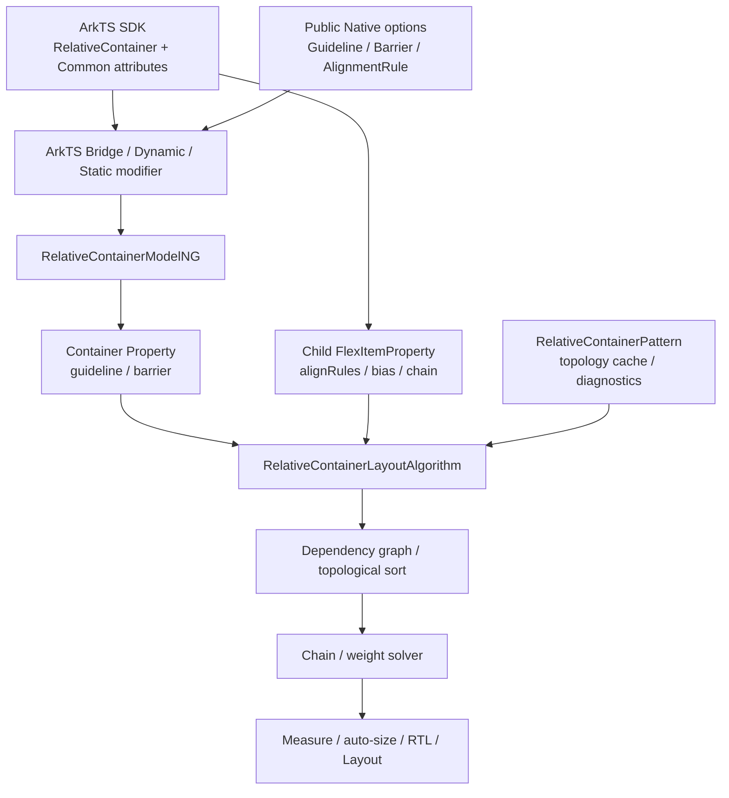
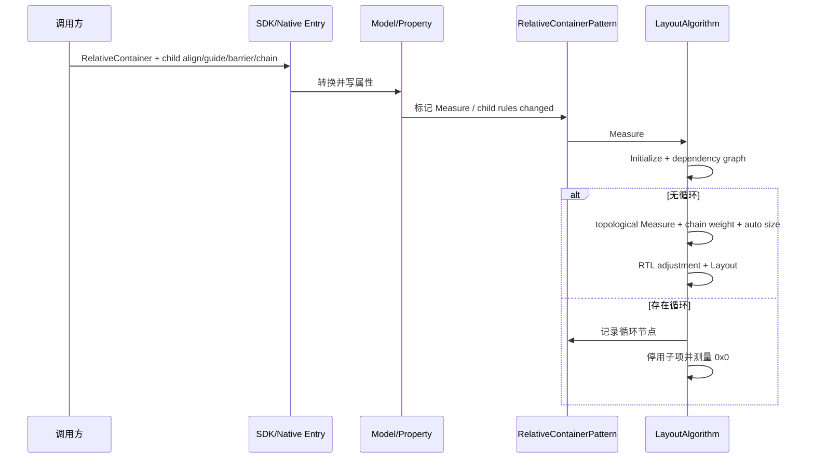
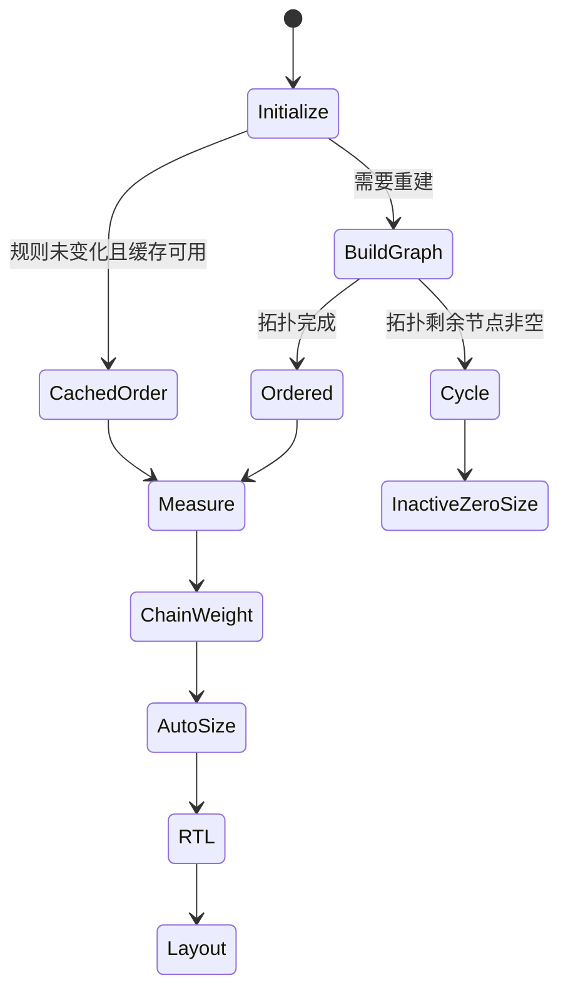
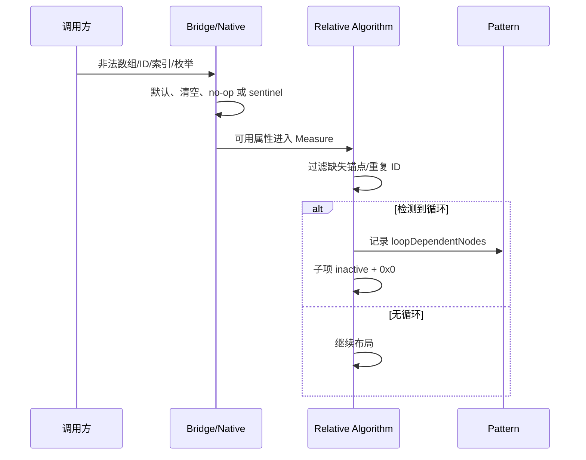

# 架构设计

> RelativeContainer 功能域的共享设计基线：补录锚定与自适应尺寸、依赖图、辅助线/屏障、链式布局、多范式及 Native 公共结构。

## 设计元数据

| 属性 | 值 |
|------|-----|
| Design ID | DESIGN-Func-05-01-08 |
| 关联需求 | 已有能力补录（无独立 requirement.md） |
| 关联 Epic | 无 |
| 目标 Feature | Feat-01 RelativeContainer 锚定与自适应尺寸, Feat-02 RelativeContainer 依赖图、循环检测与偏置, Feat-03 RelativeContainer 辅助线、屏障与 RTL, Feat-04 RelativeContainer 链式布局与权重, Feat-05 RelativeContainer 多范式与原生接口兼容 |
| 复杂度 | 复杂 |
| 目标版本 | API 9–26 |
| Owner | ArkUI SIG |
| 状态 | Baselined（已有实现补录） |

## 需求基线

> 本域没有 proposal.md。公开接口和版本以 canonical SDK 为准；ace_engine 当前算法、Native 实现和旧管线用于补录可观测运行行为。

| 项 | 补充说明（如需） |
|----|------------------|
| 容器与锚定 | RelativeContainer 支持多个子项；子项通过通用 `alignRules` 指向容器、兄弟、guideline 或 barrier |
| 自适应尺寸 |未显式宽高默认 100%；API 11 起 `auto` 支持内容自适应，但该轴存在对容器的直接/间接依赖时不自适应 |
| 依赖求解 |算法为 child/barrier 构图并拓扑排序；循环时不猜测顺序，而是停用子项并以 0 尺寸测量 |
| 扩展锚点 |guideline/barrier/localized barrier 自 API 12；chainMode 自 API 12，chainWeight 自 API 14 |
| 多范式与 Native |Dynamic API 9/12、Static API 23/26；Native guideline/barrier/alignment option 自 API 12，归入 Feat-05 而不建立独立 NDK 域 |

## 上下文和现状

### 涉及仓和模块

| 仓库 | 补充架构说明 |
|------|--------------|
| interface/sdk-js | RelativeContainer、Common alignRules/chainMode/chainWeight、Static/Modifier 声明 |
| arkui_ace_engine/frameworks/core/components_ng/pattern/relative_container | Model、Property、Pattern、拓扑/链/自适应布局算法和 modifier |
| arkui_ace_engine/frameworks/core/components_ng/property | FlexItemProperty 保存子项 align rules、bias、chain style/weight |
| arkui_ace_engine/interfaces/native/node_attributes | Public C guideline/barrier/alignment option 声明 |
| arkui_ace_engine/interfaces/native/node | Public C option 的生命周期和 set/get 实现 |
| arkui_ace_engine/frameworks/core/components/relative_container | legacy 管线实现，作为兼容边界 |

### 调用链层级分析

| 层 | 模块 | 职责 | 修改类型 |
|----|------|------|----------|
| SDK 声明层 | `relative_container.d.ts`、`common.d.ts`、Static/Modifier |声明容器、锚定、guide/barrier、chain 和版本 | 已有实现补录 |
| Public Native 层 | `interfaces/native/node_attributes/layout.h` |创建/销毁/设置/读取 guideline、barrier、alignment option | 已有实现补录 |
| Bridge/Modifier 层 | ArkTS bridge、dynamic/static modifier |解析数组/枚举/Dimension，执行 set/reset/get | 已有实现补录 |
| Model/Property 层 | `relative_container_model_ng.cpp`、`relative_container_layout_property.h` |创建节点，保存 guideline/barrier 并响应资源更新 | 已有实现补录 |
| Child property 层 | CommonMethod/FlexItemProperty |保存 align rules、bias、chainMode、chainWeight | 已有实现补录 |
| Pattern 层 | `relative_container_pattern.h` |缓存拓扑结果、监控子项规则变化、Dump 循环节点 | 已有实现补录 |
| Algorithm 层 | `relative_container_layout_algorithm.cpp` |初始化锚点、构图、拓扑、测量、自适应、链、RTL、布局 | 已有实现补录 |
| Legacy 层 | classic relative_container |兼容旧 Pipeline | 已有实现补录 |

- [x] Dynamic/Static/Native 到 NG 算法链路已覆盖
- [x] 容器属性和子项 Common 属性所有权分离
- [x] legacy 仅作为兼容证据，不替代 NG 规格

### 适用架构规则

| Rule ID | 适用原因 | 设计结论 | 验证方式 |
|---------|----------|----------|----------|
| OH-ARCH-LAYERING |跨 SDK/Native/Bridge/Property/Algorithm |上层只构造数据，算法只读取 Property，不反向依赖 API 层 | 架构评审 |
| OH-ARCH-SUBSYSTEM |Public Native 与 ArkUI NG 交界 |通过既有 node option/modifier 接口进入，不新增跨子系统依赖 | 依赖检查 |
| OH-ARCH-IPC-SAF |不经 SA/IPC |所有锚点和布局状态在当前进程 UI 树 | 代码审查 |
| OH-ARCH-API-LEVEL | API 9/11/12/14/20/23/26 | 对外版本以 SDK 与 Public Native 接口注记为准 | API 评审/XTS |
| OH-ARCH-COMPONENT-BUILD |不新增目标 |BUILD.gn/bundle.json 不变 | 构建验证 |
| OH-ARCH-ERROR-LOG |循环、非法 ID、索引、枚举 |复用 Dump/log、默认值、no-op/sentinel，不新增错误码 | UT/fuzz/hilog |

## 不涉及项承接

| 维度 | 设计结论 |
|------|----------|
| 权限与敏感数据 |不涉及；Public ArkUI/Native 布局接口无需权限 |
| IPC/分布式 | N/A；无跨进程/设备同步 |
| 持久化与迁移 | N/A；状态随 FrameNode/Native option 生命周期 |
| 构建与部件 |无变更 |
| 性能 |涉及；拓扑排序、链识别和布局与节点/边数量相关，继续使用既有缓存 |
| 多窗口/RTL |涉及；尺寸约束改变自适应结果，localized rules/barrier 参与 RTL 镜像 |
| NDK 独立功能域 |不涉及；Public Native 证据仅作为 RelativeContainer 多范式表面并入 Feat-05 |

## 关键设计决策

| 决策 ID | 问题 | 推荐方案 | 探索过的替代方案 | 取舍理由 | 影响 |
|---------|------|----------|-----------------|----------|------|
| ADR-1 |子项如何表达相对位置 |子项通过 FlexItemProperty 保存水平/垂直 align rules，锚点可为容器、兄弟、guideline 或 barrier |方案A：容器集中保存全部规则；方案B：直接修改子项 position |当前 Common API 属于子项，分散存储能与声明树节点生命周期一致 |容器算法需收集全部子项规则后再测量 |
| ADR-2 | auto/wrapContent 如何避免父子循环 |若子项在某轴直接或间接依赖容器，则该轴不由该子项推动自适应；其他子项包围盒决定容器尺寸 |方案A：迭代至收敛；方案B：忽略所有锚点直接包裹 |现有算法以依赖分析阻止不收敛，同时保留无容器依赖子项的自适应 |API 11 auto 与 API 20 LayoutPolicy 需分别验证 |
| ADR-F2-1 |有向依赖如何确定测量顺序 |对合法 child/barrier 依赖构图并拓扑排序，复用 Pattern 缓存但在规则变化后重算 |方案A：声明顺序测量；方案B：递归 DFS 即时测量 |拓扑顺序可覆盖跨多级锚定并提供循环检测结果 |缺失锚点不入边，循环节点可 Dump |
| ADR-F2-2 |循环依赖如何恢复 |检测到环时报告/记录循环节点，停用全部子项并按 0x0 测量 |方案A：删除最后一条边；方案B：按声明顺序猜测 |任意断环会产生不稳定、依赖顺序的 UI；当前实现选择确定性失败 |异常场景可直接观测节点 active/size |
| ADR-F2-3 | bias 如何应用 |仅在同一轴两端锚定且有理想尺寸时按剩余距离乘 bias；负值回退 0.5 |方案A：始终应用；方案B：把 bias 截断到 0..1 |当前实现只检验非负，>1 行为必须列风险而非规范化 |测试覆盖 0、0.5、1、负数和 >1 风险 |
| ADR-F3-1 | guideline start/end 冲突 |start 优先；两者缺失/非法时 start=0；auto 轴只能使用非百分比 start |方案A：end 优先；方案B：两值求平均 |SDK 和 modifier 明确 start 优先，避免双义 |资源更新仍需保留优先级 |
| ADR-F3-2 | barrier 如何从多个引用求值 |LEFT/TOP 取最小边，RIGHT/BOTTOM 取最大边；忽略缺失/GONE 引用 |方案A：使用首个引用；方案B：缺一项即整条 barrier 失效 |极值语义符合屏障定义并允许条件隐藏节点 |空/重复 ID 和 barrier 依赖需加入拓扑 |
| ADR-F3-3 | localized 水平语义如何处理 |START/END 转为逻辑方向后，RTL 阶段统一镜像子项 x 偏移 |方案A：解析时直接交换全部规则；方案B：只镜像 barrier 不镜像子项 |最终统一镜像避免多处重复翻转 |localized alignRules 与 barrier 使用同一 RTL 基线 |
| ADR-F4-1 |链如何形成 |只有相邻节点用互相匹配的左右或上下规则连接、链端锚点合法且节点数>1 时成链 |方案A：只凭 chainMode 聚合；方案B：任何共享锚点都成链 |当前算法要求双向相邻约束，能确定严格顺序和端点 |GONE 节点不参与空间/计数 |
| ADR-F4-2 |三种 ChainStyle 如何分配余量 |SPREAD 分配 n+1 个间隔，SPREAD_INSIDE 分配 n-1 个内部间隔，PACKED 以 bias 放置无间隔整体 |方案A：复用 Flex justify；方案B：固定等间距 |当前实现直接依据两端 anchor distance 和内容尺寸计算 |内容超过锚距时 SPREAD/INSIDE 居中溢出，PACKED 按 bias 溢出 |
| ADR-F4-3 | chainWeight 如何分配尺寸 |先扣除无正权重项固有尺寸，再按正权重/总权重分配剩余空间；剩余<=0 时该轴理想尺寸为 0 |方案A：权重叠加固有尺寸；方案B：所有项都按权重 |SDK 明确忽略加权项固有尺寸，当前算法与之对应 |API 14/23 版本和双轴权重需验证 |
| ADR-F5-1 |多范式如何共享状态 |Dynamic/Static/Native 正常路径都转换为 GuidelineInfo/BarrierInfo/AlignmentRule 并写 NG Property |方案A：各通道独立算法；方案B：只支持 Dynamic |共享算法避免语义分叉，入口差异单列风险 |Static API 23/26、Native API 12 均需映射 |
| ADR-F5-2 | Native option 生命周期如何表达 |Create/Dispose 明确所有权；越界/null setter no-op，getter 返回 sentinel/空值 |方案A：抛 C++ 异常；方案B：由节点隐式拥有 option |C API 需要调用方可控生命周期与无异常边界 |Feat-05 必须包含内存和错误边界 |

## 设计骨架

### 骨架范围

| 骨架项 | 目标 | 不包含 | 验证方式 |
|--------|------|--------|----------|
| anchor/auto |创建、alignRules、margin、默认/auto/LayoutPolicy |guide/barrier/chain 细节 |Layout UT |
| dependency/bias |构图、拓扑、缓存、循环、合法锚点、bias |Public API 表面重复 |Dependency UT/Dump |
| guideline/barrier |ID、方向、位置、极值、GONE、localized RTL |Native option 生命周期 |Guideline/Barrier UT |
| chain/weight |成链、三种 style、GONE、bias、权重重测 |通用 Flex chain |Chain UT |
| multi/native |Dynamic/Static/Public Native/legacy/internal modifier |独立 NDK 域 |SDK/XTS/Native UT |

### 骨架 Spec 拆分

| Task ID | 目标 | 受影响文件 | AC |
|---------|------|------------|-----|
| TASK-SKELETON-1 |锚定、自适应和 margin | `Feat-01-relative-container-anchor-auto-size-spec.md` | Feat-01 全部 AC |
| TASK-SKELETON-2 |依赖图、循环和 bias | `Feat-02-relative-container-dependency-bias-spec.md` | Feat-02 全部 AC |
| TASK-SKELETON-3 |guideline、barrier、RTL | `Feat-03-relative-container-guideline-barrier-spec.md` | Feat-03 全部 AC |
| TASK-SKELETON-4 |chain style 与 weight | `Feat-04-relative-container-chain-weight-spec.md` | Feat-04 全部 AC |
| TASK-SKELETON-5 |多范式、Native、版本兼容 | `Feat-05-relative-container-multi-paradigm-native-spec.md` | Feat-05 全部 AC |

## 后续 Task 拆分

| Task ID | 目标 | 受影响文件 | 依赖 |
|---------|------|------------|------|
| TASK-FEAT-01 |补录锚定与自适应尺寸 | `Feat-01-relative-container-anchor-auto-size-spec.md` | Relative SDK、Common alignRules、algorithm |
| TASK-FEAT-02 |补录依赖图与偏置 | `Feat-02-relative-container-dependency-bias-spec.md` | Feat-01、Pattern/Algorithm |
| TASK-FEAT-03 |补录辅助线和屏障 | `Feat-03-relative-container-guideline-barrier-spec.md` | Feat-01/02、Model/Modifier |
| TASK-FEAT-04 |补录链与权重 | `Feat-04-relative-container-chain-weight-spec.md` | Feat-01/02、Common chain APIs |
| TASK-FEAT-05 |补录多范式与 Public Native | `Feat-05-relative-container-multi-paradigm-native-spec.md` |前四 Feat、Static/Native SDK |

## API 签名、Kit 与权限

> 以下登记存量接口。

### 新增 API

| API 签名 | 类型 | Kit | d.ts 位置 | 权限要求 | SysCap |
|----------|------|-----|------------|----------|--------|
| `RelativeContainer(): RelativeContainerAttribute` | Public | ArkUI | `interface/sdk-js/api/@internal/component/ets/relative_container.d.ts:21-43` | 无 | ArkUI.Full |
| `alignRules(value: AlignRuleOption): T` | Public | ArkUI | `interface/sdk-js/api/@internal/component/ets/common.d.ts:23128-23142` | 无 | ArkUI.Full |
| `alignRules(value: LocalizedAlignRuleOptions): T` | Public | ArkUI | `interface/sdk-js/api/@internal/component/ets/common.d.ts:23143-23160` | 无 | ArkUI.Full |
| `guideLine(value: Array<GuideLineStyle>)` | Public | ArkUI | `interface/sdk-js/api/@internal/component/ets/relative_container.d.ts:378-392` | 无 | ArkUI.Full |
| `barrier(value: Array<BarrierStyle \| LocalizedBarrierStyle>)` | Public | ArkUI | `interface/sdk-js/api/@internal/component/ets/relative_container.d.ts:394-421` | 无 | ArkUI.Full |
| `chainMode(direction: Axis, style: ChainStyle): T` | Public | ArkUI | `interface/sdk-js/api/@internal/component/ets/common.d.ts:23162-23177` | 无 | ArkUI.Full |
| `chainWeight(options: ChainWeightOptions): T` | Public | ArkUI | `interface/sdk-js/api/@internal/component/ets/common.d.ts:19894-19915` | 无 | ArkUI.Full |
| Static RelativeContainer/`setRelativeContainerOptions`/`ExtendableRelativeContainer` | Public | ArkUI | `interface/sdk-js/api/arkui/component/relativeContainer.static.d.ets:267-383` | 无 | ArkUI.Full |
| `OH_ArkUI_GuidelineOption_*` | Public C API | ArkUI Native | `interfaces/native/node_attributes/layout.h:263-358` | 无 | ArkUI.Full |
| `OH_ArkUI_BarrierOption_*` | Public C API | ArkUI Native | `interfaces/native/node_attributes/layout.h:360-448` | 无 | ArkUI.Full |
| `OH_ArkUI_AlignmentRuleOption_*` | Public C API | ArkUI Native | `interfaces/native/node_attributes/layout.h:450-675` | 无 | ArkUI.Full |

### 变更/废弃 API

| 原有 API | 变更类型 | 新 API | 迁移说明 |
|----------|----------|--------|----------|
| `AlignRuleOption` 左右规则 | 变更 | `LocalizedAlignRuleOptions` start/end overload | API 12 起优先用 localized 规则支持 RTL；旧 left/right 继续兼容 |

## 构建系统影响

### BUILD.gn 变更

```text
无变更。继续使用 RelativeContainer NG/legacy、Common 属性、generated modifier 和 Native node_attributes 现有源集。
```

### bundle.json 变更

无新增 component 或依赖。

## 可选设计扩展

### 架构图



### 数据流/控制流

| 步骤 | 调用方 | 被调用方 | 数据/接口 | 说明 |
|------|--------|----------|-----------|------|
| 1 | ArkTS/Static/Native | Bridge/Modifier | guide/barrier/align/chain 数据 |执行入口校验和类型转换 |
| 2 | Modifier | Model/Child Property | GuidelineInfo、BarrierInfo、AlignRulesItem |容器与子项分别存储 |
| 3 | Pipeline | Algorithm::Initialize |children、guidelines、barriers |建立 ID 映射、虚拟锚点和链候选 |
| 4 | Algorithm | dependency solver |anchor edge、barrier reference |拓扑排序或检测循环 |
| 5 | Algorithm | child Measure |拓扑顺序、约束、auto/LayoutPolicy |计算尺寸和普通锚点位置 |
| 6 | Algorithm | chain solver |端点、style、bias、weight |重测加权项并写链偏移 |
| 7 | Algorithm | RTL/Layout |recordOffsetMap |镜像并布局子节点 |

### 时序设计



### 数据模型设计

```typescript
interface AlignRuleOption {
  left?: HorizontalAlignParam;
  right?: HorizontalAlignParam;
  middle?: HorizontalAlignParam;
  top?: VerticalAlignParam;
  bottom?: VerticalAlignParam;
  center?: VerticalAlignParam;
  bias?: Bias;
}

interface GuideLineStyle {
  id: string;
  direction: Axis;
  position: { start?: Dimension; end?: Dimension };
}

interface BarrierStyle {
  id: string;
  direction: BarrierDirection;
  referencedId: Array<string>;
}
```

```cpp
// RelativeContainerLayoutProperty:
// vector<GuidelineInfo>, vector<BarrierInfo>，均 PROPERTY_UPDATE_MEASURE。
// Child FlexItemProperty:
// AlignRulesItem, BiasPair, horizontal/vertical ChainInfo, ChainWeightPair。
// Algorithm runtime:
// idNodeMap, recordOffsetMap, incomingDegreeMap, reliedOnMap,
// horizontalChains, verticalChains, renderList。
```

| 状态 | 持有方 | 生命周期 |
|------|--------|----------|
| guideline/barrier 配置 | RelativeContainerLayoutProperty | 随容器节点 |
| alignRules/bias/chain |子节点 FlexItemProperty | 随子节点 |
|拓扑缓存/循环诊断 | RelativeContainerPattern |规则不变时跨布局复用 |
|依赖图、offset、chain param | LayoutAlgorithm |单次布局 |
|Public C option |Native 调用方 |Create 至 Dispose |

### 算法与状态机



链余量公式：

- SPREAD：`gap=(anchorDistance-contentSize)/(n+1)`，首项前同样一个 gap；
- SPREAD_INSIDE：`gap=(anchorDistance-contentSize)/(n-1)`，首尾贴端点；
- PACKED：gap=0，`start=(anchorDistance-contentSize)*bias`；
- 正权重项尺寸：`remainingSpace*itemWeight/totalWeight`。实现见 `frameworks/core/components_ng/pattern/relative_container/relative_container_layout_algorithm.cpp:768-879,1144-1254`。

### 测试性设计

| 测试层级 | 测试目标 | Mock 策略 | 验证方式 |
|----------|----------|-----------|----------|
| SDK compile | API 9/11/12/14/23/26 |指定 API level |签名、overload、Static/Modifier |
| Relative NG UT |锚点、自适应、依赖图、循环 |固定 child id/size/rules |检查 frame size/offset/active |
| Guide/Barrier UT |位置、极值、GONE、RTL |构造参考节点矩形 |检查虚拟锚点 offset |
| Chain UT |三种 style、bias、weight、GONE |固定端点和子项尺寸 |检查 gap/size/offset |
| Native UT |Create/Dispose/set/get/index/null |不需要 ArkTS |检查生命周期和 sentinel/no-op |
| Dump/diagnostic |拓扑缓存和循环节点 |开启 debug property |检查 Pattern 输出 |

### 异常传播时序图



| 异常场景 | 当前恢复 |
|----------|----------|
|缺失/非法 anchor |不加入有效依赖边，该规则不产生有效锚定 |
|重复/空 guideline/barrier ID |跳过后续无效虚拟锚点 |
|循环依赖 |记录诊断，停用并 0x0 测量子项 |
|guideline start/end 同时给出 |start 优先 |
|Native null/越界 |setter no-op；getter 返回 sentinel/空值 |

### 资源所有权矩阵

| 资源 | 创建方 | 持有方 | 销毁触发 | 实际释放 | 异常回收 |
|------|--------|--------|----------|----------|----------|
| RelativeContainer FrameNode | ModelNG | UI 树 |节点移除 | AceType 引用计数 |标准 UI 树回收 |
|拓扑缓存/诊断 | Pattern | Pattern |规则变化/节点销毁 |容器成员释放 |重建覆盖缓存 |
|Guideline/Barrier ResourceObject | ModelNG | Property/资源回调 |reset/节点销毁 |引用计数 |弱引用失效退出 |
|Native GuidelineOption | OH_ArkUI_*_Create |调用方 |显式 Dispose | delete |null Dispose no-op |
|Native BarrierOption | OH_ArkUI_*_Create |调用方 |显式 Dispose | delete |null Dispose no-op |
|Native AlignmentRuleOption | OH_ArkUI_*_Create |调用方 |显式 Dispose | delete |null Dispose no-op |

### 接口参数规约

| 接口 | 参数 | 类型 | 合法范围 | 非法处理 | 边界说明 |
|------|------|------|----------|----------|----------|
| alignRules | anchor | string |容器特殊 ID、现存 child、guideline、barrier |该方向规则忽略 |start/end 支持 RTL |
| alignRules | bias | number pair |canonical 比率；默认 0.5 |负值实现回退 0.5 |实现接受 >1，列风险 |
| guideLine | position | start/end Dimension |auto 轴须 start 且非百分比 |缺失/非法 start=0 |同时给出 start 优先 |
| barrier | referencedId | string[] |容器内有效 ID |缺失/GONE 引用跳过 |LEFT/TOP min，RIGHT/BOTTOM max |
| chainMode | direction/style | Axis/ChainStyle |Horizontal/Vertical；三种 style |不形成合法链则无链效果 |只在链头设置生效 |
| chainWeight | horizontal/vertical | number |正值参与分配 |非正值按非加权项 |仅 RelativeContainer 父项生效 |

### 线程与并发模型

| 操作 | 发起线程 | 回调线程 | 跨进程边界 | 线程安全 | 重入约束 |
|------|----------|----------|------------|----------|----------|
|属性设置 | UI 线程 |无 |无 |UI 树串行写 |不支持跨线程并发改同节点 |
|Measure/Layout | UI Pipeline |无 |无 |Algorithm 与 Pattern 使用 mutex |规则变化进入后续 Measure |
|Native option set/get |调用线程 |无 |无 |option 由调用方独占 |Dispose 后不得继续访问 |

## 详细设计

### 锚定与自适应尺寸

RelativeContainerModelNG 创建节点并保存 guideline/barrier；Pattern 生成专用算法和 Property。证据见 `frameworks/core/components_ng/pattern/relative_container/relative_container_model_ng.cpp:23-67,81-173`、`frameworks/core/components_ng/pattern/relative_container/relative_container_layout_property.h:25-51`。

Measure 初始化子项/虚拟锚点，alignRules 生效时关闭显式 position。API 11+ margin 表示到锚点的距离；auto 或 API 20 LayoutPolicy 根据是否依赖容器决定该轴能否由子项推动。证据见 `frameworks/core/components_ng/pattern/relative_container/relative_container_layout_algorithm.cpp:882-1074,1257-1313,2061-2232`。

### 依赖图、循环与偏置

算法将合法 child/barrier 依赖加入 incomingDegreeMap，缺失锚点不入边；Pattern 缓存拓扑列表并在子项规则改变后失效。检测到循环时报告并将子项设为 inactive、测量 0x0。证据见 `frameworks/core/components_ng/pattern/relative_container/relative_container_layout_algorithm.cpp:78-169,1479-1605`、`frameworks/core/components_ng/pattern/relative_container/relative_container_pattern.h:29-179`。

bias 只在同轴两端对齐且子项有理想尺寸时应用；负值回退 0.5，见 `frameworks/core/components_ng/pattern/relative_container/relative_container_layout_algorithm.cpp:1789-1809`。

### 辅助线、屏障与 RTL

Guideline start 优先于 end，位置缺失为 start=0；无效/重复 ID 被过滤。Barrier 从有效、非 GONE 引用的矩形求最小/最大边，并可依赖其他 barrier。证据见 `frameworks/core/components_ng/pattern/relative_container/relative_container_layout_algorithm.cpp:198-408`。

localized START/END 在算法中归一化，并在 RTL 阶段镜像 child x offset，见 `frameworks/core/components_ng/pattern/relative_container/relative_container_layout_algorithm.cpp:2244-2278`。

### 链式布局与权重

链识别要求双向相邻锚定并至少两个节点；SPREAD/SPREAD_INSIDE/PACKED 根据两端锚距、内容总尺寸、节点数和 bias 计算。证据见 `frameworks/core/components_ng/pattern/relative_container/relative_container_layout_algorithm.cpp:410-623,768-879`。

正 chainWeight 触发二次测量：先从端点空间扣除无权重项尺寸，再按权重比分配；GONE 节点不参与空间和计数。证据见 `frameworks/core/components_ng/pattern/relative_container/relative_container_layout_algorithm.cpp:625-645,807-835,1144-1254`。

### 多范式与原生接口

Dynamic RelativeContainer API 9，guide/barrier/localized/chain API 12，chainWeight API 14；Static API 23，Static builder/Extendable API 26。证据见 `interface/sdk-js/api/@internal/component/ets/relative_container.d.ts:21-465`、`interface/sdk-js/api/@internal/component/ets/common.d.ts:19894-19915,23128-23177`、`interface/sdk-js/api/arkui/component/relativeContainer.static.d.ets:23-383`。

Public Native API 12 提供 GuidelineOption、BarrierOption、AlignmentRuleOption 的 Create/Dispose/set/get，具体实现进行 null/index 检查，见 `interfaces/native/node_attributes/layout.h:263-675` 和 `interfaces/native/node/node_node_relative_container.cpp:23-409`。内部 dynamic getter 使用函数静态快照，属于潜在陈旧状态风险，见 `frameworks/core/components_ng/pattern/relative_container/bridge/relative_container_dynamic_modifier.cpp:109-145`。

## 风险和开放问题

| 项 | 类型 | 影响 | 处理方式 | Owner |
|----|------|------|----------|-------|
| bias 实现只校验非负，>1 仍参与计算 | API | 中 | canonical 按比率使用；>1 仅列实现风险并做负向测试 | ArkUI SIG |
| dynamic modifier guide/barrier getter 使用函数静态快照 | 架构 | 中 |不得依赖跨节点/更新后的 getter 新鲜度；安排回归 | ArkUI SIG |
| BarrierDirection 顶层 SDK 注记 SysCap 与成员注记不一致 | API | 低 |以成员及组件 ArkUI.Full 契约为主，记录 SDK 文档风险 | ArkUI SIG |
| API 11 runtime gate 与 guide/barrier API 12 声明相邻 | API | 低 |对外仍按 API 12 开放；实现 gate 不扩大 API 11 表面 | ArkUI SIG |
| Native setter/getter 多为 no-op/sentinel，缺少错误码 | API | 中 |接口规格明确无错误码和可观测回退 | ArkUI SIG |
| legacy 与 NG 对 GONE/非法锚点细节可能不同 | 测试 | 中 |NG 为主基线；legacy 只按可复现路径单独验证 | ArkUI SIG |

## 设计审批

- [x] 需求基线已确认，设计覆盖 P0/P1 AC
- [x] 不涉及项已承接，N/A 和展开项都有结论
- [x] 涉及仓和模块职责清楚
- [x] 调用链层级分析完整，每层覆盖到位
- [x] 适用架构规则已识别并形成设计结论
- [x] 分层和子系统边界合规
- [x] API 变更有签名、权限、错误码和兼容性说明
- [x] BUILD.gn/bundle.json 影响明确
- [x] 设计输出和后续 Task 拆分明确
- [x] 关键设计决策有理由和影响说明
- [x] 风险和开放问题有 Owner

**结论:** 通过（已有实现补录）。
