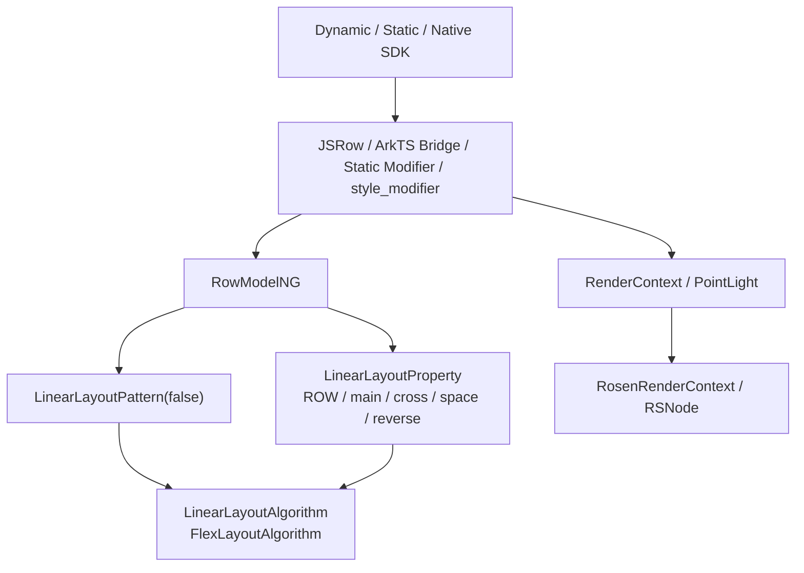
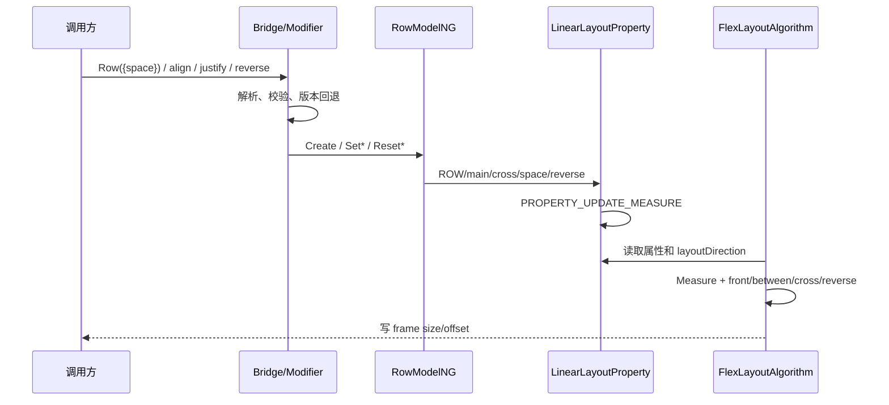
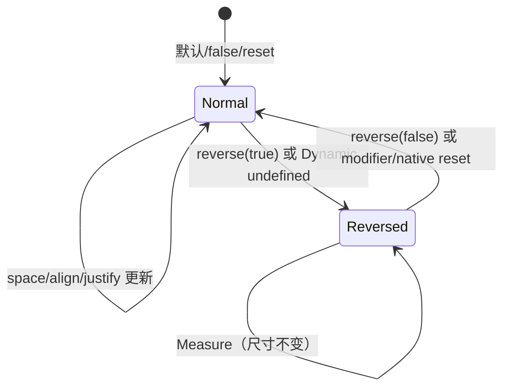
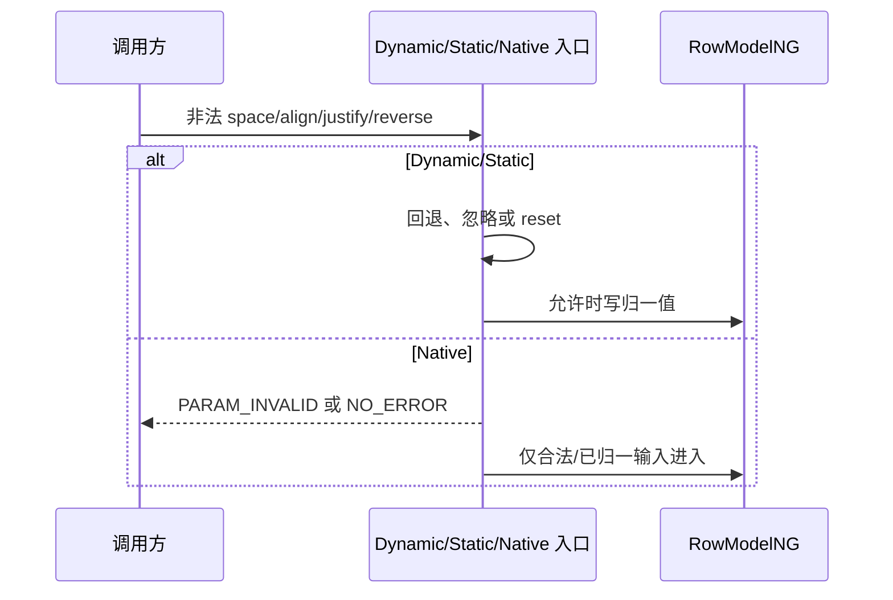

# 架构设计

> Row 功能域的存量架构设计基线，依据 ace_engine 与 interface_sdk-js 已有实现补录；本文档不提出产品代码变更。

## 设计元数据

| 字段 | 内容 |
|------|------|
| Design ID | DESIGN-Func-05-01-09 |
| 关联需求 | 已有能力补录（无独立 requirement.md） |
| 关联 Epic | 无 |
| 目标 Feature | Feat-01 Row 创建、尺寸与子项间距；Feat-02 Row 对齐与反向排列；Feat-03 Row 多范式接口与版本兼容；Feat-04 Row PointLight 系统光效 |
| 复杂度 | 复杂 |
| 目标版本 | API 7–26 |
| Owner | ArkUI SIG |
| 状态 | Baselined（已有实现补录） |

## 需求基线

> 本功能域无 proposal.md。以下基线以正式 SDK 注册和生产源码为准，遵循“当前实现即规格”；接口之间的实现偏差仅列风险。

| 项 | 补充说明（如需） |
|----|------------------|
| Feat-01 基线 | 固化 ROW FrameNode、水平内容自适应、显式 space、API 18 Resource 更新与非法输入 |
| Feat-02 基线 | 固化 VerticalAlign、主轴空间分布、RTL、alignSelf 与 API 12 reverse |
| Feat-03 基线 | 固化 Dynamic、Static、AttributeModifier、Native C API、legacy/NG 和 API 7–26 版本矩阵 |
| Feat-04 基线 | 固化 PointLight System API、构建门控、主题资源、RenderContext 与 Rosen 路径 |
| 设计原则 | 仅补录文档和后续注册元数据；不修改产品源码、SDK 或生成文件 |

## 上下文和现状

### 涉及仓和模块

| 仓库/模块 | 补充架构说明 |
|-----------|--------------|
| interface_sdk-js — `interface/sdk-js/api/@internal/component/ets/row.d.ts` | Dynamic RowOptions/V2、alignItems、justifyContent、reverse、PointLight 和版本元数据 |
| interface_sdk-js — `interface/sdk-js/api/arkui/component/row.static.d.ets` | Static Row、`setRowOptions`、builder 与 ExtendableRow 契约 |
| interface_sdk-js — `interface/sdk-js/api/arkui/RowModifier.d.ts` | Dynamic RowModifier API 12 与 cross-platform API 20 契约 |
| ace_engine — `frameworks/bridge/declarative_frontend/jsview/js_row.cpp` | Dynamic 参数解析、API 10 回退、pipeline 分派与属性 binding |
| ace_engine — `frameworks/bridge/declarative_frontend/jsview/models/row_model_impl.cpp` | legacy Row 创建和水平 MIN/MIN 尺寸策略 |
| ace_engine — `frameworks/bridge/declarative_frontend/engine/jsi/nativeModule/arkts_native_row_bridge.cpp` | AttributeModifier 对齐、space、reverse 的 set/reset 解析 |
| ace_engine — `frameworks/bridge/declarative_frontend/ark_component/src/ArkRow.ts` | Row modifier 增量状态、diff 与 reset 调度 |
| ace_engine — `frameworks/core/interfaces/native/implementation/row_modifier.cpp` | Static/generated options、属性、reverse 与 PointLight 映射 |
| ace_engine — `interfaces/native/node/style_modifier.cpp` | Public Native Row/LinearLayout 属性校验、错误码与分派 |
| ace_engine — `frameworks/core/interfaces/native/node/row_modifier.cpp` | 原始值到 RowModelNG 的 node modifier 映射 |
| ace_engine — `frameworks/core/components_ng/pattern/linear_layout/row_model_ng.cpp` | ROW FrameNode 创建、Resource space 更新和属性读写 |
| ace_engine — `frameworks/core/components_ng/pattern/linear_layout/row_model_ng_static.cpp` | Static options 的设置与 reset 语义 |
| ace_engine — `frameworks/core/components_ng/pattern/linear_layout/linear_layout_pattern.h` | 非原子容器、算法/属性工厂、Focus Scope 和 dump |
| ace_engine — `frameworks/core/components_ng/pattern/linear_layout/linear_layout_algorithm.h` | 继承 FlexLayoutAlgorithm 并启用 linear feature |
| ace_engine — `frameworks/core/components_ng/pattern/flex/flex_layout_algorithm.cpp` | 水平测量、对齐、RTL、reverse、间距和最终定位 |
| ace_engine — `frameworks/core/components_ng/render/adapter/rosen_render_context.cpp` | PointLight 到 Rosen 的单位换算和 RSNode 提交 |

### 调用链层级分析

| 层 | 模块 | 职责 | 修改类型 |
|----|------|------|----------|
| SDK 契约层 | Dynamic/Static/Modifier 声明 | 规定签名、默认值、开放范围和 API 版本 | Feat-01~04 存量分析 |
| Classic Dynamic 桥接 | `js_row.cpp` | 解析 space/useAlign/align/justify/reverse，选择 NG 或 legacy Model | Feat-01~03 存量分析 |
| ArkTS Modifier 桥接 | `ArkRow.ts` / `arkts_native_row_bridge.cpp` | 将增量值转为 node modifier set/reset | Feat-01~03 存量分析 |
| Static/generated 桥接 | `implementation/row_modifier.cpp` | 转换 Static options/属性并映射 PointLight | Feat-01~04 存量分析 |
| Public Native 分派 | `style_modifier.cpp` | 校验 AttributeItem 并分派 Row/共用 LinearLayout 属性 | Feat-03 存量分析 |
| Node modifier | `native/node/row_modifier.cpp` | 原始值、单位和 reset 转 RowModelNG 调用 | Feat-03 存量分析 |
| Model 层 | `row_model_ng.cpp` / `_static.cpp` | 创建 ROW FrameNode、固定 Row 方向、管理资源和属性 | Feat-01~03 存量分析 |
| Pattern/Property 层 | `linear_layout_pattern/property` | 持有布局属性、资源更新器，创建 LinearLayoutAlgorithm | Feat-01/02 存量分析 |
| Measure/Layout 层 | `flex_layout_algorithm.cpp` | 按水平主轴测量，计算 front/between/cross/reverse offset | Feat-01/02 存量分析 |
| Render/Rosen 层 | RenderContext / RosenRenderContext | 保存并提交 PointLight，不参与 Row Measure | Feat-04 存量分析 |

调用链保持 SDK → Bridge/Modifier → RowModelNG/LayoutProperty → LinearLayoutAlgorithm/FlexLayoutAlgorithm 或 RenderContext → Rosen 的单向依赖。

### 适用架构规则

| Rule ID | 适用原因 | 设计结论 | 验证方式 |
|---------|----------|----------|----------|
| OH-ARCH-LAYERING | Row 属性跨 SDK、桥接、Model、Property、Algorithm | 保持单向调用；布局算法只消费属性 | 架构评审、依赖检查 |
| OH-ARCH-API-LEVEL | API 7/8/11/12/18/20/23/26 能力并存 | 对外版本以 canonical SDK/native header 为准 | SDK 编译矩阵、XTS |
| OH-ARCH-COMPONENT-BUILD | PointLight 受宏控制 | 沿用 `POINT_LIGHT_ENABLE`，不新增 target | 构建矩阵 |
| OH-ARCH-ERROR-LOG | space/align/reverse/Native 输入可非法 | 保留当前回退、日志和错误码 | UT、fuzz |
| OH-ARCH-SUBSYSTEM | 光效跨 Rosen 边界 | 仅通过 RenderContext 适配层 | 依赖检查、集成测试 |
| OH-ARCH-IPC-SAF | Row 不访问 SA/IPC | N/A；状态只在 UI Pipeline 内 | 代码审查 |

## 不涉及项承接

| 维度 | 设计结论 |
|------|----------|
| 性能 | 涉及但不新增指标；继续使用线性子项遍历和 Measure 脏标记 |
| 安全与权限 | 核心布局无权限；PointLight 为 System API，不处理敏感数据 |
| 兼容性 | 涉及；保留 pipeline、版本、通道 default/reset 和非法输入差异 |
| API/SDK | 涉及；Dynamic/Static/Modifier/Native 均需证据映射 |
| IPC/跨进程 | N/A；无跨进程状态 |
| 构建与部件 | 无变更；只记录 PointLight 既有门控 |
| 持久化与迁移 | N/A；属性随 FrameNode 生命周期存在 |
| 分布式能力 | N/A；无跨设备同步 |

## 关键设计决策

| 决策 ID | 问题 | 推荐方案 | 探索过的替代方案 | 取舍理由 | 影响 |
|---------|------|----------|-----------------|----------|------|
| ADR-1 | Row 是否实现独立水平算法 | 创建 `LinearLayoutPattern(false)` 并固定 `FlexDirection::ROW`，通过 `LinearLayoutAlgorithm -> FlexLayoutAlgorithm` 完成测量和定位 | Row 自建算法；直接用通用 Flex Pattern | 生产链已复用 Flex 算法，并用 linear feature 提供 Row 默认值 | Row 与 Column 共享公式，但主交叉轴和默认交叉对齐不同 |
| ADR-2 | Resource space 如何响应配置变化 | Pattern 以 `row.space` 管理弱引用资源更新器；合法新值更新并标记 Measure，显式值/reset 移除资源对象 | 每次 Measure 解析；只解析一次 | 当前 keyed updater 兼顾配置响应和生命周期安全 | API 18 首次解析、更新、负值与销毁路径需分别验收 |
| ADR-F2-1 | Row 的对齐枚举如何映射 | `VerticalAlign` 映射 Flex cross-axis；`FlexAlign` 映射水平主轴；子项 alignSelf 优先 | 使用 ItemAlign 直接替代 SDK VerticalAlign | 保留公开 API 类型并复用算法内部 FlexAlign | Dynamic 非法 align API 10+ 回退 Center/Start |
| ADR-F2-2 | reverse 与 RTL 如何组合 | reverse 翻转水平主轴推进，RTL 镜像水平 Start/End；算法组合两者一次，Measure 尺寸不变 | reverse 重排 child list；RTL 仅影响文本 | 当前实现保持声明身份，只在 Layout 改 offset | 无障碍/焦点声明顺序与视觉顺序可能不同 |
| ADR-F2-3 | 显式 space 与 Space* 谁优先 | Start/Center/End 使用固定 space；SpaceBetween/Around/Evenly 忽略显式 space并按剩余空间分配 | 两者叠加 | 与共享 Flex 算法一致，避免双重间距 | 用户设置 space 但 Space* 下最终 gap 不等于该值 |
| ADR-F3-1 | 多通道 reset/default 是否统一 | 不统一；按 Dynamic direct、AttributeModifier、Static、Native、legacy 各自事实验收 | 全部 reset false/默认 Start | 统一会改变已发布行为 | direct reverse(undefined)=true，而 modifier/native reset=false 等需单列 |
| ADR-F3-2 | 版本与正式注册冲突时采用何者 | 对外签名以 interface_sdk-js canonical 与 public native header 为准 | 以任一实现注释为准；取实现交集 | SDK 是应用编译可见契约 | API 18 V2、23 Static、26 ExtendableRow 按版本隔离 |
| ADR-F3-3 | Native 共用 LinearLayout 属性如何归属 | `NODE_LINEAR_LAYOUT_SPACE/REVERSE` 作为 Row/Column 共用属性，Row 特有 align ID 独立分派 | 为 Row 重复定义全部属性 ID | 复用现有公共 ABI，避免文档虚构 Row 专用 ID | Native 规格必须区分 Row 特有和共用属性 |
| ADR-F4-1 | PointLight 是否进入 Row LayoutProperty | 保持 RenderContext 支路，主题补全后经 Rosen 提交 | 放入 LinearLayoutProperty 或 Row PaintProperty | 光效不影响布局，RenderContext 是共享边界 | 宏关闭/上下文缺失时 Row 仍正常布局 |

## 设计骨架

### 骨架范围

| 骨架项 | 目标 | 不包含 | 验证方式 |
|--------|------|--------|----------|
| 创建与尺寸 | ROW FrameNode、水平自适应、约束、space/Resource | FlexWrap/Grid | NG/Layout/Resource UT |
| 对齐与反向 | VerticalAlign、justify、RTL、alignSelf、reverse | Column 纵向行为 | Layout 参数矩阵 |
| 多范式接口 | Dynamic/Static/Modifier/Native/legacy 与版本 | 非 Row Native 属性 | 编译矩阵、C API UT |
| 系统光效 | PointLight 宏、主题、RenderContext、Rosen | 新主题或新效果 | 构建/渲染测试 |

### 骨架 Spec 拆分

| Task ID | 目标 | 受影响文件 | AC |
|---------|------|------------|-----|
| TASK-SKELETON-1 | 建立创建、尺寸、space/Resource 证据链 | `Feat-01-row-creation-size-space-spec.md` | Feat-01 全部 AC |
| TASK-SKELETON-2 | 建立对齐、RTL、reverse 证据链 | `Feat-02-row-alignment-reverse-spec.md` | Feat-02 全部 AC |
| TASK-SKELETON-3 | 建立多范式和版本矩阵 | `Feat-03-row-multi-paradigm-version-spec.md` | Feat-03 全部 AC |
| TASK-SKELETON-4 | 建立 PointLight 渲染证据链 | `Feat-04-row-point-light-spec.md` | Feat-04 全部 AC |

## 后续 Task 拆分

| Task ID | 目标 | 受影响文件 | 依赖 |
|---------|------|------------|------|
| TASK-FEAT-01 | 评审并基线化创建、尺寸与间距 | `Feat-01-row-creation-size-space-spec.md` | 本 Design、RowModelNG、FlexLayoutAlgorithm |
| TASK-FEAT-02 | 评审并基线化对齐与反向 | `Feat-02-row-alignment-reverse-spec.md` | Feat-01、共享 Flex 算法 |
| TASK-FEAT-03 | 评审并基线化多范式与版本 | `Feat-03-row-multi-paradigm-version-spec.md` | Dynamic/Static SDK、Modifier、Native |
| TASK-FEAT-04 | 评审并基线化 PointLight | `Feat-04-row-point-light-spec.md` | System SDK、主题、RenderContext、Rosen |

## API 签名、Kit 与权限

> 下表登记已有 API，不代表本次新增。

### 新增 API

| API 签名 | 类型 | Kit | d.ts 位置 | 权限要求 | SysCap |
|----------|------|-----|------------|----------|--------|
| `Row(options?: RowOptions \| RowOptionsV2)` | Public | ArkUI | `interface/sdk-js/api/@internal/component/ets/row.d.ts:21-145` | 无 | ArkUI.Full |
| `alignItems(value: VerticalAlign)` | Public | ArkUI | `interface/sdk-js/api/@internal/component/ets/row.d.ts:159-178` | 无 | ArkUI.Full |
| `justifyContent(value: FlexAlign)` | Public | ArkUI | `interface/sdk-js/api/@internal/component/ets/row.d.ts:179-196` | 无 | ArkUI.Full |
| `pointLight(value: PointLightStyle)` | System | ArkUI | `interface/sdk-js/api/@internal/component/ets/row.d.ts:197-209` | System API 可见性 | ArkUI.Full |
| `reverse(isReversed: Optional<boolean>)` | Public | ArkUI | `interface/sdk-js/api/@internal/component/ets/row.d.ts:210-229` | 无 | ArkUI.Full |
| Static `Row(options, content_)` | Public | ArkUI | `interface/sdk-js/api/arkui/component/row.static.d.ets:31-172` | 无 | ArkUI.Full |
| Static `setRowOptions` / style builder / ExtendableRow | Public | ArkUI | `interface/sdk-js/api/arkui/component/row.static.d.ets:112-225` | 无 | ArkUI.Full |
| `NODE_ROW_ALIGN_ITEMS` / `NODE_ROW_JUSTIFY_CONTENT` | Public C API | ArkUI Native | `interfaces/native/native_node.h:8437-8465` | 无 | ArkUI.Full |
| `NODE_LINEAR_LAYOUT_SPACE` / `NODE_LINEAR_LAYOUT_REVERSE` | Public C API | ArkUI Native | `interfaces/native/native_node.h:8413-8435` | 无 | ArkUI.Full |

### 变更/废弃 API

| 原有 API | 变更类型 | 新 API | 迁移说明 |
|----------|----------|--------|----------|
| API 7–17 anonymous constructor object | 命名规范化 | API 18 `RowOptions` / `RowOptionsV2` | 历史起始版本保留，既有调用不受影响 |

## 构建系统影响

### BUILD.gn 变更

```text
无变更。Row 沿用 ace_core_ng 既有 LinearLayout/Flex 算法源集；PointLight 继续受 POINT_LIGHT_ENABLE 控制。
```

### bundle.json 变更

无新增 component、依赖或 bundle 配置。

## 可选设计扩展

### 架构图



### 数据流/控制流

| 步骤 | 调用方 | 被调用方 | 数据/接口 | 说明 |
|------|--------|----------|-----------|------|
| 1 | ArkTS/Static/Native | 对应入口 | options、align、justify、reverse | 选择语言通道 |
| 2 | Bridge/style_modifier | node modifier/RowModelNG | 枚举、Dimension、bool | 执行通道校验与 reset |
| 3 | RowModelNG | FrameNode/LayoutProperty/Pattern | ROW、属性、资源 updater | 创建或标记 Measure |
| 4 | Pipeline | LinearLayoutAlgorithm | constraints、child list | 水平测量与尺寸夹紧 |
| 5 | FlexLayoutAlgorithm | GeometryNode | front/between/cross/reverse/RTL | 写子项 offset |
| 6 | PointLight 入口 | RenderContext/Rosen | light/illuminated/bloom | 独立渲染支路 |

### 时序设计



### 数据模型设计

```typescript
interface RowOptions { space?: string | number }
interface RowOptionsV2 { space?: string | number | Resource }
interface RowState {
  alignItems: VerticalAlign;
  justifyContent: FlexAlign;
  reverse: boolean;
}
```

| 状态 | 持有位置 | 生命周期 |
|------|----------|----------|
| direction/main/cross/space/reverse | FrameNode 的 LinearLayoutProperty | 随节点存在，更新触发 Measure |
| `row.space` 资源 updater | LinearLayoutPattern | 弱引用节点，配置更新或 reset 管理 |
| Measure/Layout 中间量 | LinearLayoutAlgorithm/FlexLayoutAlgorithm | 单次布局周期 |
| PointLight 状态 | RenderContext/RSNode | 随渲染节点存在 |

### 算法与状态机

| justifyContent | frontSpace | betweenSpace | 显式 space |
|----------------|------------|--------------|------------|
| Start | 0 | space | 生效 |
| Center | remain/2 | space | 生效 |
| End | remain | space | 生效 |
| SpaceBetween | 0 | `n>1 ? remain/(n-1) : 0` | 忽略 |
| SpaceAround | `n>0 ? remain/(2n) : 0` | `n>0 ? remain/n : 0` | 忽略 |
| SpaceEvenly | `n>0 ? remain/(n+1) : 0` | 同 frontSpace | 忽略 |



### 测试性设计

| 测试层级 | 测试目标 | Mock 策略 | 验证方式 |
|----------|----------|-----------|----------|
| NG/Layout UT | 创建、尺寸、space、对齐、RTL、reverse | 固定 FrameNode/约束/子项 | 检查 property/frame/offset |
| Resource UT | `row.space` 首次解析与配置更新 | Mock ResourceObject | 检查值和 Measure dirty |
| Modifier/Native UT | set/reset/get、范围、错误码 | AttributeItem/raw value | 比对返回码和 getter |
| SDK Compile Test | API 7–26 和 Dynamic/Static 可见性 | 目标 API 编译样例 | 编译结果 |
| Render Integration | PointLight 门控/上下文/RSNode | Theme/ResourceAdapter/RSNode Mock | 检查状态和帧请求 |

### 异常传播时序图



### 资源所有权矩阵

| 资源 | 创建方 | 持有方 | 销毁触发 | 实际释放 | 异常回收 |
|------|--------|--------|----------|----------|----------|
| ROW FrameNode/Pattern | RowModelNG/FrameNode 工厂 | UI 树 | 节点移除 | AceType 引用计数 | 标准 UI 树回收 |
| `row.space` updater | RowModelNG | LinearLayoutPattern | 节点销毁/reset | Pattern 映射释放 | WeakPtr 升级失败退出 |
| LayoutProperty/Algorithm | Pattern/FrameNode | FrameNode/布局周期 | 节点销毁/布局结束 | 引用计数/对象生命周期 | 下一布局重新计算 |
| RenderContext/RSNode | FrameNode/Rosen | FrameNode/后端 | 节点销毁 | 各自生命周期 | 空上下文提前返回 |

### 接口参数规约

| 接口 | 参数 | 类型 | 合法范围 | 非法处理 | 边界说明 |
|------|------|------|----------|----------|----------|
| Row/options | space | number/string/Resource | 可解析且非负 | Dynamic API 10+ 回退 0；Model 负值不覆盖 | Resource 为 API 18 V2 |
| alignItems | value | VerticalAlign/raw int | Top/Center/Bottom/Stretch 对应实现范围 | Dynamic API 10+ 回退 Center | 子项 alignSelf 优先 |
| justifyContent | value | FlexAlign/raw int | Start/Center/End/三种 Space* | Dynamic API 10+ 回退 Start | 显式 space 在 Space* 下忽略 |
| reverse | value | Optional<boolean>/raw int | boolean；Native 合法范围 | Dynamic 非 bool 写 true；reset false | API 12+ |
| pointLight | value | PointLightStyle | SDK 字段范围 | 上下文缺失按路径退出 | System API、宏门控 |

### 线程与并发模型

Row 属性、Resource 更新、Measure/Layout 和 RenderContext 写入沿用既有 UI Pipeline 线程模型；本设计不新增线程、锁、队列或跨线程所有权。资源回调只持有 FrameNode 弱引用。

## 详细设计

### 创建、尺寸与间距

RowModelNG 创建 ROW FrameNode、`LinearLayoutPattern(false)` 并固定 `FlexDirection::ROW`。未显式宽高时，共享算法按有效子项累计水平主轴尺寸、取最大垂直交叉轴尺寸，加入 padding/border 后按约束夹紧。space 只连接相邻有效子项；API 18 Resource 以 `row.space` updater 响应配置变化。证据见 `frameworks/core/components_ng/pattern/linear_layout/row_model_ng.cpp:24-139,141-212` 和 `frameworks/core/components_ng/pattern/flex/flex_layout_algorithm.cpp:1163-1364`。

### 对齐、RTL 与反向

alignItems 映射垂直交叉轴，默认 Center；justifyContent 映射水平主轴，默认 Start。算法按剩余空间计算 front/between space，子项 alignSelf 优先覆盖。reverse 只改变水平视觉推进；RTL 也作用于水平 Start/End，两者按算法组合一次。证据见 `frameworks/core/components_ng/pattern/flex/flex_layout_algorithm.cpp:53-91,230-263,1567-1734`。

### 多范式与版本

Dynamic 基础自 API 7，justifyContent 自 API 8，PointLight 自 API 11，reverse 与 RowModifier 自 API 12，Resource options 自 API 18；Dynamic modifier cross-platform 自 API 20；Static/Static modifier自 API 23；style builder、setRowOptions 与 ExtendableRow 自 API 26。Native 使用 Row 特有 align ID 和共用 LinearLayout space/reverse ID。

### PointLight 渲染

PointLight 通过通用 ViewAbstract/RenderContext 路径写光源、受光与 bloom，再由 RosenRenderContext 转换位置 Dimension 并提交 RSNode；不改变 Row LayoutProperty 或测量结果。

## 风险和开放问题

| 风险 ID | 风险说明 | 影响 | 缓解/跟踪 |
|---------|----------|------|-----------|
| RISK-1 | Dynamic direct `reverse(undefined/non-bool)` 写 true，而 modifier/native reset 写 false | 同一代码意图跨通道可能呈现不同视觉顺序 | Feat-02/03 分通道验收，迁移时显式传 boolean |
| RISK-2 | Dynamic、Static、Native 对非法枚举、负 space 和 fresh/reset 默认值不完全统一 | 跨范式结果可能不同 | 建立 set/reset/get 矩阵，不做隐式归一 |
| RISK-3 | Native justify 的连续范围校验可能包含公开 FlexAlign 枚举空洞 | raw C 输入可能写入非公开语义值 | 只把 SDK 声明值作为正常契约；空洞输入列异常/风险测试 |
| RISK-4 | PointLight Dynamic 路径可能部分写状态后因 ResourceAdapter 缺失退出，另一路径存在空适配器风险 | 异常环境下状态不完整或稳定性风险 | 空上下文与部分状态测试跟踪，本次不修复 |
| RISK-5 | Static PointLight z 坐标转换条件与 x/y 不一致，reset 通道也存在差异 | 特定输入/清理路径不一致 | 非对称三轴与分通道 reset 回归 |

开放问题仅限后续是否针对实现风险立项，不阻塞存量规格补录评审。

## 设计审批

| 角色 | 审批人 | 状态 | 意见 |
|------|--------|------|------|
| 架构 Owner | ArkUI SIG | Draft | 待按存量规格流程评审 |
| Feature Owner | ArkUI SIG | Draft | Feat-01~04 证据链已建立 |
| 测试 Owner | ArkUI SIG | Draft | 需按 VM 和版本矩阵复核测试覆盖 |
