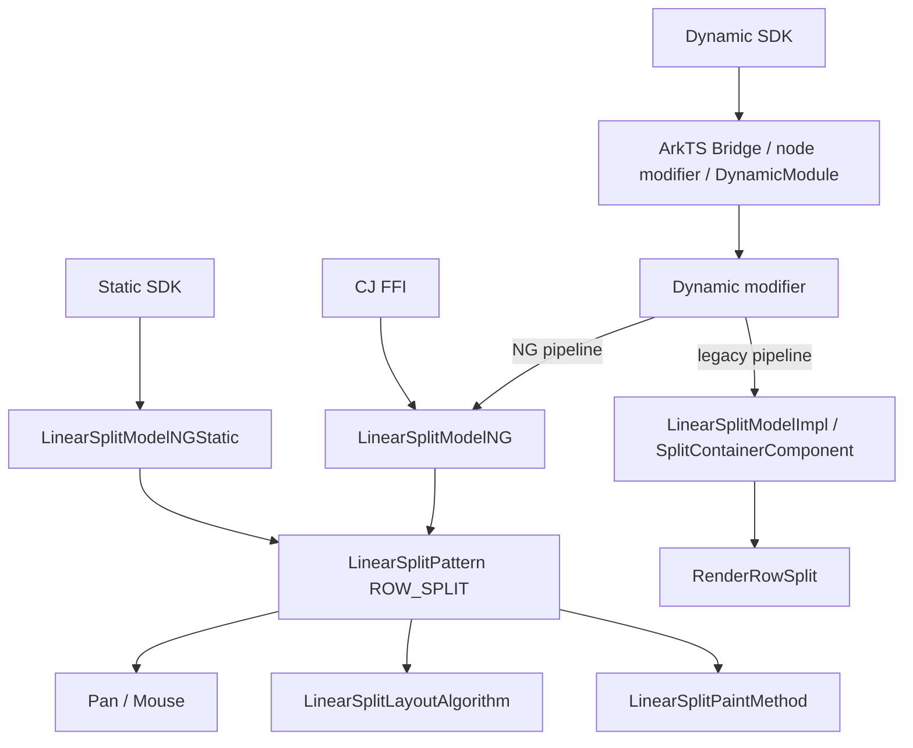
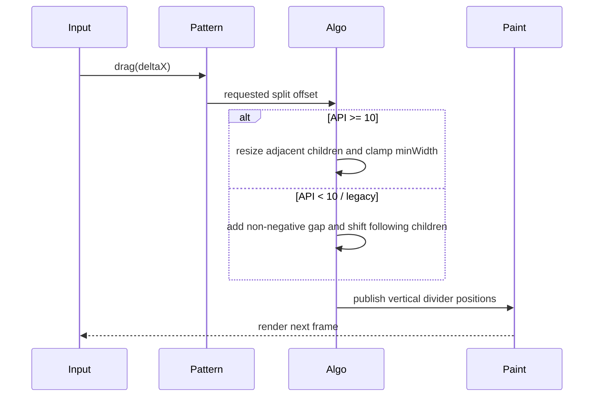
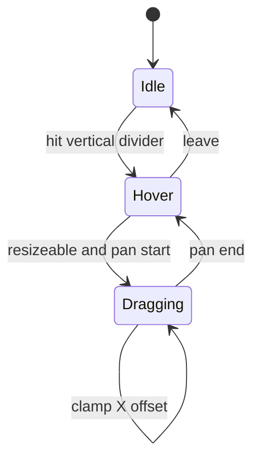
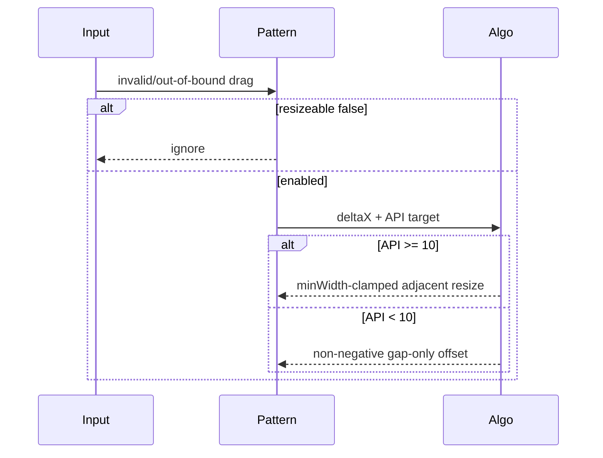

# 架构设计

> RowSplit 功能域的架构设计基线，依据 ace_engine 与 interface_sdk-js 既有实现补录。

## 设计元数据

| 字段 | 内容 |
|------|------|
| Design ID | DESIGN-Func-05-01-10 |
| 关联需求 | 已有能力补录（无独立 requirement.md） |
| 关联 Epic | 无 |
| 目标 Feature | Feat-01 水平布局与绘制；Feat-02 拖拽 |
| 复杂度 | 复杂 |
| 目标版本 | API 7–26 |
| Owner | ArkUI SIG |
| 状态 | Baselined（已有实现补录） |

## 需求基线

> 本功能域无 proposal.md；以下直接承接存量规格和源码证据。

| 项 | 补充说明（如需） |
|----|------------------|
| 布局基线 | API>=10 按可见项横向布局；API<10 遍历全部构建项（包括 GONE）并绘制垂直 divider |
| 交互基线 | API>=10 调整相邻尺寸并钳制 minWidth；API<10/legacy 只增加非负 gap 并平移后续项 |
| 兼容基线 | API 10 前后算法、GONE、安全区和 Dynamic/Static 路径分别保留 |

## 上下文和现状

### 涉及仓和模块

| 仓库 | 补充架构说明 |
|------|--------------|
| interface_sdk-js — `row_split.d.ts` / `rowSplit.static.d.ets` | 公开签名与版本 |
| ace_engine — `bridge/arkts_native_row_split_bridge.cpp`、`row_split_dynamic_module.cpp`、`row_split_dynamic_modifier.cpp` | 组件化参数解析、node modifier 与 NG/legacy 运行时分派 |
| ace_engine — `linear_split_model_ng.cpp` / `linear_split_model_ng_static.cpp` / `linear_split_model_impl.cpp` | 分别创建 NG FrameNode、Static FrameNode 或 legacy SplitContainerComponent |
| ace_engine — `linear_split_pattern.*` | 输入事件与拖拽状态 |
| ace_engine — `linear_split_layout_algorithm.cpp` | 横向测量布局与版本分支 |
| ace_engine — `linear_split_paint_method.cpp` | 垂直 divider 绘制 |

### 调用链层级分析

| 层 | 模块 | 职责 | 修改类型 |
|----|------|------|----------|
| SDK | Dynamic/Static RowSplit | 声明创建和 resizeable | 存量分析 |
| Bridge | JS/ArkTS/Static modifier | 解析、set/reset | 存量分析 |
| Model | LinearSplitModelNG / LinearSplitModelNGStatic / LinearSplitModelImpl | 按入口与 pipeline 创建 NG/Static/legacy 节点和属性 | 存量分析 |
| Pattern | LinearSplitPattern | 拖拽/鼠标/hover 状态 | 存量分析 |
| Layout | LinearSplitLayoutAlgorithm | API 分支、横向几何、安全区 | 存量分析 |
| Paint | LinearSplitPaintMethod | 绘制垂直分隔线 | 存量分析 |
| Pipeline | PipelineContext | 脏节点和延迟测量 | 存量分析 |

检查结论：完整覆盖 SDK 到绘制/Pipeline 层级，无本次代码修改。

### 适用架构规则

| Rule ID | 适用原因 | 设计结论 | 验证方式 |
|---------|----------|----------|----------|
| OH-ARCH-LAYERING | 多层属性和交互链 | 保持 SDK→Model→Pattern/Algorithm 单向依赖 | 架构评审 |
| OH-ARCH-SUBSYSTEM | 无新增跨子系统 | 使用既有输入与渲染模块 | 依赖检查 |
| OH-ARCH-IPC-SAF | 无 IPC/SA | N/A | 审查 |
| OH-ARCH-API-LEVEL | API 7–26，API 10 算法分界 | SDK since 为准 | XTS/UT |
| OH-ARCH-COMPONENT-BUILD | 无新构建目标 | 沿用 linear_split BUILD | 构建验证 |
| OH-ARCH-ERROR-LOG | 非法拖拽/输入 | 沿用既有钳制和日志 | Fuzz/UT |

## 不涉及项承接

| 维度 | 设计结论 |
|------|----------|
| 性能 | 涉及；测量布局按子项线性遍历 |
| 兼容性 | 涉及；API 10 的 GONE/拖拽/安全区分支和多范式 NG/legacy 路径单列 |
| 安全与权限 | N/A；不处理权限/敏感数据 |
| 构建 | 涉及但无变更 |
| IPC/持久化/分布式 | N/A |

## 关键设计决策

| 决策 ID | 问题 | 推荐方案 | 探索过的替代方案 | 取舍理由 | 影响 |
|---------|------|----------|-----------------|----------|------|
| ADR-1 | RowSplit 是否独立实现 | 共享 LinearSplit，以 ROW_SPLIT 选择 X 轴 | 独立算法；Flex 替代 | 当前实现减少重复且保留分割交互 | 与 ColumnSplit 共用回归但独立几何 |
| ADR-2 | API 10 分支 | 保留两套路径：API<10 不过滤 GONE、使用 gap-only drag 且不执行安全区延迟路径；API>=10 使用可见项、相邻尺寸和 minWidth | 只记录新算法；合并分支 | target 行为可观察 | API 9/10 必测 |
| ADR-3 | 拖拽职责 | Pattern 管事件；API>=10 Algorithm 做相邻几何钳制，API<10/legacy 仅平移后续项 | 全在 Pattern；全在手势层 | 保持当前版本化布局行为 | 拖拽后下帧重排 |
| ADR-4 | 多范式一致性 | Dynamic 按 pipeline 选择 LinearSplitModelNG/Impl，Static 使用 NGStatic，CJ 取得 NG Model | 强制签名一致；各自独立实现 | 兼容已发布入口和 legacy pipeline | NG/legacy/Static/CJ 对照测试 |

### 多范式接口与版本边界

多范式和版本差异由 Design 统一说明，不独立拆分规格。公开 API 以 RowSplit SDK 声明为准，不能从 ColumnSplit 推断 RowSplit 的 divider-style 能力。

| 入口/版本 | 既有契约 | 实现路径与边界 |
|-----------|----------|----------------|
| Dynamic API 7+ | `RowSplit()` 创建组件 | Bridge 经 node modifier、DynamicModule/dynamic modifier，按当前 pipeline 选择 `LinearSplitModelNG` 或 `LinearSplitModelImpl` |
| AttributeModifier API 12/20 | `applyNormalAttribute` 应用公开属性 | 仅按 Modifier SDK 声明的属性生效 |
| Static API 23+ | `RowSplit(content?)`、resizeable、attributeModifier | static modifier 经 `LinearSplitModelNGStatic` 创建 FrameNode |
| Static Builder API 26 | `RowSplit(style, content?)` 与空 options 初始化 | 先应用 style/options，再构建可选 content |
| CJ FFI | 创建组件与 resizeable | `DynamicModule::GetModel` 取得 NG Model 并转发 ROW_SPLIT 路径 |
| divider-style | RowSplit 不存在该组件专属公开 API | 不从 ColumnSplit 类推接口、行为或测试预期 |
| reset/undefined | 当前入口恢复 resizeable 默认 false | 不套用其他范式签名或默认值 |

验证以 Dynamic NG/legacy、Static、CJ 及 API 7/12/20/23/26 的 SDK/bridge 矩阵为准，覆盖 Builder/options 顺序、入口级 reset 和无 divider-style 的能力边界。

## 设计骨架

### 骨架范围

| 骨架项 | 目标 | 不包含 | 验证方式 |
|--------|------|--------|----------|
| 水平布局 | 子项和垂直 divider | Flex/Row 通用能力 | Layout/Paint UT |
| 拖拽 | X 轴 offset 与约束 | 通用 Pan 规格 | Input/Layout UT |
| 接口版本 | Dynamic/Static/API 10 | 新 API 设计 | SDK/Bridge 对照 |

### 骨架 Spec 拆分

| Task ID | 目标 | 受影响文件 | AC |
|---------|------|------------|-----|
| TASK-SKELETON-1 | 水平布局绘制 | `Feat-01-row-split-horizontal-layout-rendering-spec.md` | Feat-01 全部 AC |
| TASK-SKELETON-2 | resizeable 拖拽 | `Feat-02-row-split-resizeable-drag-spec.md` | Feat-02 全部 AC |

## 后续 Task 拆分

| Task ID | 目标 | 受影响文件 | 依赖 |
|---------|------|------------|------|
| TASK-FEAT-01 | 基线化布局绘制 | Feat-01 spec | Layout/Paint |
| TASK-FEAT-02 | 基线化拖拽 | Feat-02 spec | Pattern/Algorithm |

## API 签名、Kit 与权限

### 新增 API

| API 签名 | 类型 | Kit | d.ts 位置 | 权限要求 | SysCap |
|----------|------|-----|------------|----------|--------|
| `RowSplit()` | Public | ArkUI | `api/@internal/component/ets/row_split.d.ts` | 无 | ArkUI.Full |
| `resizeable(value: boolean)` | Public | ArkUI | 同上 | 无 | ArkUI.Full |
| Static RowSplit | Public | ArkUI | `api/arkui/component/rowSplit.static.d.ets` | 无 | ArkUI.Full |

### 变更/废弃 API

| 原有 API | 变更类型 | 新 API | 迁移说明 |
|----------|----------|--------|----------|
| 无 | 无 | 无 | 本次仅补录 |

## 构建系统影响

### BUILD.gn 变更

```text
无变更；沿用 linear_split 既有源集。
```

### bundle.json 变更

无新增部件或依赖。

## 可选设计扩展

### 架构图



### 数据流/控制流

| 步骤 | 调用方 | 被调用方 | 数据/接口 | 说明 |
|------|--------|----------|-----------|------|
| 1 | Dynamic/Static/CJ | Bridge/Module/Model | create/resizeable | 按入口选择 NG、NGStatic 或 legacy Model |
| 2 | Pipeline | Algorithm | constraints/children/API | 横向测量布局 |
| 3 | Pointer | Pattern | X delta | 命中并更新 offset |
| 4 | Algorithm | Geometry | clamped positions | 写子项位置 |
| 5 | Paint | Canvas | divider positions | 绘制垂直线 |

### 时序设计



### 数据模型设计

```cpp
struct RowSplitRuntime {
    SplitType type = SplitType::ROW_SPLIT;
    bool resizeable;
    std::vector<float> childrenDragPos;
    std::vector<float> dragSplitOffset; // API<10 gap-only path
    int32_t mouseDragedSplitIndex;
};
```

### 算法与状态机



### 测试性设计

| 测试层级 | 测试目标 | Mock 策略 | 验证方式 |
|----------|----------|-----------|----------|
| Bridge | set/reset | Mock VM values | UT |
| Pattern | X 轴输入/cursor/状态字段 | 注入 GestureEvent/PanEnd/OnModifyDone | API 9/10 与字段级生命周期 UT |
| Layout | API 9/10、GONE、安全区 | LayoutWrapper | API 9 全构建项、API 10 可见项/安全区断言 |
| Paint | 垂直 divider | Mock Canvas | 绘制断言 |

### 异常传播时序图



### 资源所有权矩阵

| 资源 | 创建方 | 持有方 | 销毁触发 | 实际释放 | 异常回收 |
|------|--------|--------|----------|----------|----------|
| Node/Pattern | Model | UI tree | 节点销毁 | RefPtr | 弱引用退出 |
| 手势事件 | Pattern | EventHub | detach | EventHub | 注销回调 |
| offset | Pattern | Pattern | 属性 flag 变化/销毁 | vector | PanEnd 保留 childrenDragPos；OnModifyDone 清 childrenDragPos 但保留 dragSplitOffset |

### 接口参数规约

| 接口 | 参数 | 类型 | 合法范围 | 非法处理 | 边界说明 |
|------|------|------|----------|----------|----------|
| resizeable | value | boolean | true/false | reset 为默认 false | false 不注册有效拖拽 |

### 线程与并发模型

| 操作 | 发起线程 | 回调线程 | 跨进程边界 | 线程安全 | 重入约束 |
|------|----------|----------|------------|----------|----------|
| 属性/输入/布局 | UI | UI | 无 | UI 线程串行 | 输入仅标脏，下帧布局 |

## 详细设计

### 水平布局与 API 分支

ROW_SPLIT 将主轴设为 X。API target 低于 10 使用旧测量布局，遍历全部构建项且不滤除 GONE；API 10 起才使用可见项和 layout policy，ignore-safe-area 修正与延迟 bundle 也仅在新分支执行。证据：`frameworks/core/components_ng/pattern/linear_split/linear_split_layout_algorithm.cpp:51-55,177-205,214-245,276-345,365-459,509-636,691-721`。

### 拖拽和绘制

Pattern 维护当前 divider 索引及拖拽位置。API>=10 时 Algorithm 依据左右子项最小宽度钳制并反向调整宽度；API<10/legacy 只累计非负 `dragSplitOffset_`，增加 gap 并平移后续子项。PanEnd 只清当前拖拽标志/索引；属性 flag 变化清 `childrenDragPos_` 而保留旧版 offset。PaintMethod 以最新 X 位置绘制纵线。证据：`frameworks/core/components_ng/pattern/linear_split/linear_split_pattern.cpp:113-165,289-369,463-581`；`frameworks/core/components_ng/pattern/linear_split/linear_split_layout_algorithm.cpp:521-636`；`frameworks/core/components_ng/pattern/linear_split/linear_split_paint_method.cpp:41-64`。

## 风险和开放问题

| 项 | 类型 | 影响 | 处理方式 | Owner |
|----|------|------|----------|-------|
| API 10 双算法 | 架构 | 中 | API 9/10 参数化回归 | ArkUI SIG |
| 安全区延迟测量组合 | 测试 | 中 | 与安全区规格联测 | ArkUI SIG |
| 多范式默认值偏差 | API | 低 | 以正式 SDK 和实现路径分别记录 | ArkUI SIG |
| API<10 不过滤 GONE 且仅做 gap-only drag | 兼容性 | 高 | API 9/10 GONE 与拖拽矩阵 | ArkUI SIG |
| 安全区/延迟测量仅在 API>=10 NG 分支执行 | 兼容性 | 中 | API 9/10 safe-area 组合回归 | ArkUI SIG |
| PanEnd 与 OnModifyDone 只清理部分拖拽字段 | 状态 | 中 | 字段级生命周期测试，避免假设全量 reset | ArkUI SIG |

## 设计审批

- [x] 需求基线已确认，设计覆盖 P0/P1 AC
- [x] 不涉及项已承接，N/A 和展开项都有结论
- [x] 涉及仓和模块职责清楚
- [x] 调用链层级分析完整，每层覆盖到位
- [x] 适用架构规则已识别并形成设计结论
- [x] 分层和子系统边界合规
- [x] API 变更有签名、权限、错误码和兼容性说明
- [x] BUILD.gn/bundle.json 影响明确
- [x] 设计输出和后续 Task 拆分明确
- [x] 关键设计决策有理由和影响说明
- [x] 风险和开放问题有 Owner

**结论:** 通过（已有实现补录）。
