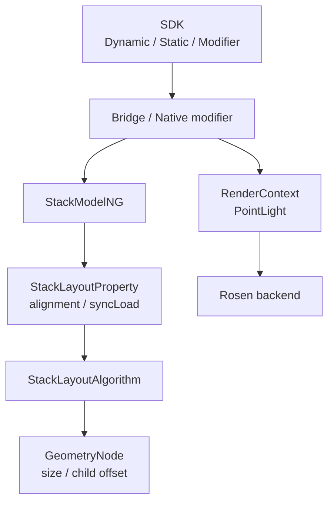
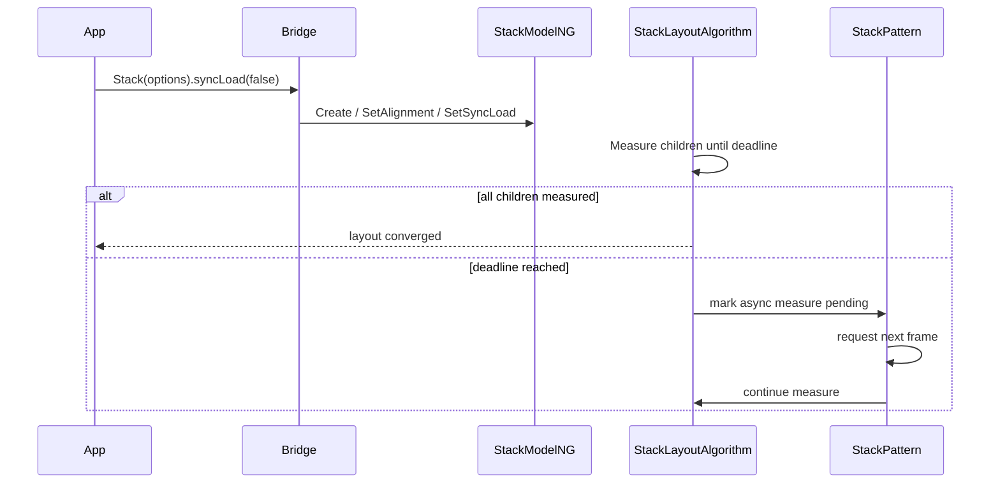
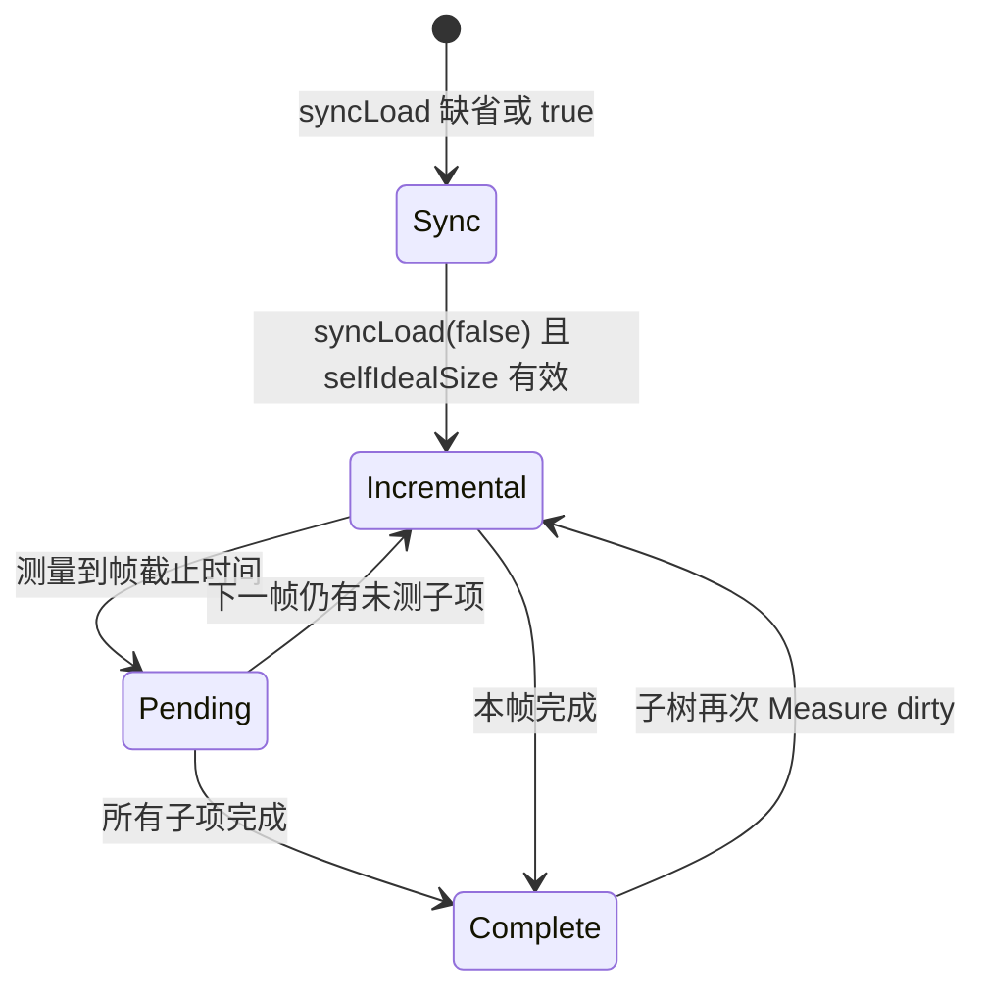
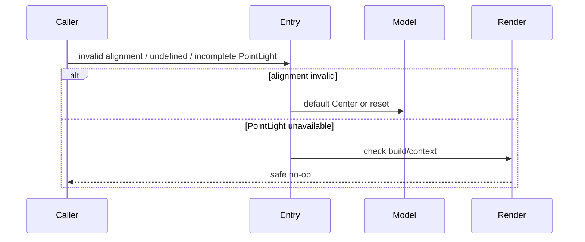

# 架构设计

> Stack 功能域的存量实现设计基线，覆盖叠放布局、对齐、子节点分帧加载、多范式入口与 PointLight 系统光效。

## 设计元数据

| 属性 | 值 |
|------|-----|
| Design ID | DESIGN-Func-05-01-11 |
| 关联需求 | 已有能力补录（无独立 requirement.md） |
| 关联 Epic | 无 |
| 目标 Feature | Feat-01 Stack 叠放布局、尺寸与对齐；Feat-02 Stack 子节点分帧加载与多范式接口；Feat-03 Stack PointLight 系统光效 |
| 复杂度 | 复杂 |
| 目标版本 | API 7–26 |
| Owner | ArkUI SIG |
| 状态 | Baselined（已有实现补录） |

## 需求基线

> 本功能域没有 proposal.md；以 canonical SDK 和当前 ace_engine 实现为存量规格基线。

| 项 | 补充说明（如需） |
|----|------------------|
| Stack 基本语义 | 子节点按声明顺序叠放，后布局节点覆盖先布局节点；容器和子节点均可参与九宫格对齐 |
| 分帧加载 | （Feat-02）API 26 的 `syncLoad(false)` 允许在帧期限到达后中止本帧测量并在后续帧继续 |
| PointLight | （Feat-03）API 11 System API，仅更新渲染上下文，不改变测量尺寸和布局位置 |
| 兼容边界 | 对外 API 版本以 `interface_sdk-js` 为准；遗留入口或编译门控差异只作为风险记录 |

## 上下文和现状

### 涉及仓和模块

| 仓库 | 补充架构说明 |
|------|--------------|
| `interface_sdk-js` | 定义 Dynamic、Static、Modifier 的 Stack 对外契约与版本边界 |
| `arkui_ace_engine/frameworks/bridge` | 解析 ArkTS/Dynamic/Static 参数并转发 Node modifier 或 Model |
| `arkui_ace_engine/frameworks/core/interfaces/native` | 提供 Stack 构造、属性 set/reset/get 和 PointLight native 实现 |
| `arkui_ace_engine/frameworks/core/components_ng/pattern/stack` | 持有 Stack Pattern、LayoutProperty、LayoutAlgorithm 与异步续帧调度 |
| `arkui_ace_engine/frameworks/core/components_ng/layout` | BoxLayoutAlgorithm 提供带截止时间的子节点测量能力 |
| `arkui_ace_engine/frameworks/core/components_ng/render` | RenderContext 承接 PointLight、发光和 Bloom 状态并适配 Rosen |

### 调用链层级分析

| 层 | 模块 | 职责 | 修改类型 |
|----|------|------|----------|
| SDK | `interface/sdk-js/api/@internal/component/ets/stack.d.ts`、`interface/sdk-js/api/arkui/component/stack.static.d.ets`、`interface/sdk-js/api/arkui/StackModifier.d.ts` | 暴露构造、对齐、syncLoad、PointLight 及多范式签名 | 存量补录 |
| Frontend | `frameworks/bridge/declarative_frontend/jsview/js_stack.cpp`、ArkTS bridge/static modifier | 参数解析、默认值、回调到 native modifier | 存量补录；（Feat-02/03）覆盖 Static 与系统光效 |
| Native interface | `frameworks/core/interfaces/native/node/node_stack_modifier.cpp`、`frameworks/core/interfaces/native/implementation/stack_modifier.cpp` | 属性 set/reset/get、Static 构造和 PointLight 分解 | 存量补录 |
| Model | `frameworks/core/components_ng/pattern/stack/stack_model_ng.cpp` | 创建 FrameNode，写入 alignment/syncLoad | 存量补录 |
| Property/Pattern | `frameworks/core/components_ng/pattern/stack/stack_layout_property.h`、`frameworks/core/components_ng/pattern/stack/stack_pattern.cpp` | 保存属性，创建算法，在分帧路径安排下一帧重测 | 存量补录；（Feat-02）新增续帧证据 |
| Layout | `frameworks/core/components_ng/pattern/stack/stack_layout_algorithm.cpp`、`frameworks/core/components_ng/layout/box_layout_algorithm.cpp` | 测量容器和子项、计算九宫格/RTL 偏移、按期限中断 | 存量补录 |
| Render | RenderContext/Rosen adapter | 应用灯源、照亮类型、边框宽度和 Bloom | （Feat-03）存量补录 |

- [x] 调用链每一层都已覆盖（从 SDK 到布局/渲染）
- [x] 每层职责边界清晰，无跨层违规调用
- [x] 每层修改类型明确

### 适用架构规则

| Rule ID | 适用原因 | 设计结论 | 验证方式 |
|---------|----------|----------|----------|
| OH-ARCH-LAYERING | 涉及 SDK、Bridge、Model、Property、Algorithm、Render | 参数按单向调用链下沉；布局算法不反向依赖前端 | 架构评审/依赖检查 |
| OH-ARCH-SUBSYSTEM | PointLight 连接 ArkUI 与 Rosen | 仅经 RenderContext 适配，不新增直接后端依赖 | 代码评审/依赖检查 |
| OH-ARCH-IPC-SAF | Stack 不使用 IPC/SA | N/A；所有状态留在当前 UI Pipeline | 代码审查 |
| OH-ARCH-API-LEVEL | API 7–26 存在多阶段扩展 | 以 canonical SDK `@since`、dynamic/static 标记为准 | API 评审/XTS |
| OH-ARCH-COMPONENT-BUILD | PointLight 受编译宏控制 | 不新增 BUILD/bundle 配置，保留既有 `POINT_LIGHT_ENABLE` 门控 | 构建矩阵 |
| OH-ARCH-ERROR-LOG | 非法 alignment/参数和失效节点需要回退 | 沿用默认 Center、reset 和空指针短路，不新增错误码 | UT/fuzz/hilog |

## 不涉及项承接

| 维度 | 设计结论 |
|------|----------|
| IPC/跨进程 | N/A；无 SA、Binder 或跨进程对象 |
| 数据持久化 | N/A；布局与光效状态随 FrameNode 生命周期存在 |
| 安全与权限 | 基础 Stack 无权限；PointLight 为 System API 可见性约束，不新增运行时权限 |
| 构建系统 | 无新增 target/component；PointLight 继续使用既有条件编译 |
| 国际化 | 无文案；RTL 只影响水平对齐镜像 |
| NDK | 本轮明确排除，不登记或设计 NDK 接口 |

## 关键设计决策

| 决策 ID | 问题 | 推荐方案 | 探索过的替代方案 | 取舍理由 | 影响 |
|---------|------|----------|-----------------|----------|------|
| ADR-1 | Stack 如何确定容器尺寸和子项位置 | 延续 `StackLayoutAlgorithm`：先按 Box 语义测量子项，再以容器内容框和 Alignment 计算每个子项偏移 | 方案A：使用 Flex；方案B：由渲染阶段做叠放 | 当前算法同时覆盖包裹尺寸、显式约束、安全区和子项 `layoutGravity`，是完整生产链 | Feat-01 的尺寸、覆盖顺序与对齐均以该算法为准 |
| ADR-2 | RTL 与子项覆盖对齐如何组合 | 容器 Alignment 在 RTL 下水平镜像；子项显式 `layoutGravity` 覆盖容器对齐；声明/绘制顺序不改变 | 方案A：RTL 反转子节点顺序；方案B：容器对齐永远覆盖 child gravity | 当前实现只镜像 Alignment，保持节点状态和绘制顺序稳定 | Start/End 在 RTL 变化，Center 与覆盖顺序不变 |
| ADR-F2-1 | syncLoad=false 如何避免长帧 | 仅在具有 self ideal size 时启用截止时间测量；超期后记录未完成并由 Pattern 安排下一帧 Measure | 方案A：后台线程测量；方案B：无条件分帧 | 布局对象与 UI 树有线程亲和性；下一帧续测既安全又保留当前容器尺寸 | 首帧可只有部分子项完成，后续帧收敛 |
| ADR-F2-2 | 多范式入口是否归一为单一表面语义 | 共享 Model/Property 最终状态，但保留 Dynamic、Static、Modifier 各自 `undefined`、reset 与版本可见性 | 方案A：文档只写 Dynamic；方案B：强制全部入口重写为同一默认值 | 存量补录必须反映已发布入口，不能用理想化语义覆盖实现差异 | 验证矩阵需覆盖 API 7、12、23、26 |
| ADR-F3-1 | PointLight 是否写入布局属性 | 直接更新 RenderContext；Position/Intensity/Color、Illuminated、BorderWidth、Bloom 分项提交 | 方案A：写 StackLayoutProperty；方案B：新增 StackPaintProperty | 光效不参与 Measure/Layout，RenderContext 是既有渲染状态边界 | PointLight 设置不应触发布局尺寸变化 |
| ADR-F3-2 | 编译开关或渲染上下文缺失时如何处理 | `POINT_LIGHT_ENABLE` 关闭或上下文不可用时安全无操作；reset 清理已设置项 | 方案A：抛运行时异常；方案B：保留部分必需状态 | System API 需要跨产品构建兼容，既有实现采用能力门控 | 不支持环境下无光效且不得崩溃 |

## 设计骨架

### 骨架范围

| 骨架项 | 目标 | 不包含 | 验证方式 |
|--------|------|--------|----------|
| 叠放布局 | 固化创建、内容尺寸、覆盖顺序、九宫格和 RTL 对齐 | 通用绝对定位属性内部实现 | NG/Layout UT |
| 分帧加载 | 固化 syncLoad 默认值、启用条件、截止时间和续帧 | Lazy 容器预取、后台测量 | 截止时间与下一帧 UT |
| 多范式接口 | 映射 Dynamic、Static、Modifier 和 native 最终状态 | NDK 接口 | SDK 编译与 modifier UT |
| 系统光效 | 固化 PointLight 分项渲染状态与门控 | 新主题资源或新 Rosen 特效 | 构建矩阵/Render UT |

### 骨架 Spec 拆分

| Task ID | 目标 | 受影响文件 | AC |
|---------|------|------------|-----|
| TASK-SKELETON-1 | 建立叠放、尺寸与对齐证据链 | `Feat-01-stack-overlay-layout-alignment-spec.md` | Feat-01 全部 AC |
| TASK-SKELETON-2 | 建立 syncLoad 与多范式接口证据链 | `Feat-02-stack-sync-load-multi-paradigm-spec.md` | Feat-02 全部 AC |
| TASK-SKELETON-3 | 建立 PointLight 渲染证据链 | `Feat-03-stack-point-light-spec.md` | Feat-03 全部 AC |

## 后续 Task 拆分

| Task ID | 目标 | 受影响文件 | 依赖 |
|---------|------|------------|------|
| TASK-FEAT-01 | 基线化叠放布局、尺寸和对齐 | `Feat-01-stack-overlay-layout-alignment-spec.md` | SDK、Stack Model/Algorithm |
| TASK-FEAT-02 | 基线化 syncLoad 与多范式入口 | `Feat-02-stack-sync-load-multi-paradigm-spec.md` | Feat-01、BoxLayoutAlgorithm、Static SDK |
| TASK-FEAT-03 | 基线化 PointLight 系统光效 | `Feat-03-stack-point-light-spec.md` | RenderContext、native implementation、构建开关 |

## API 签名、Kit 与权限

> 下表登记现有接口，不表示本轮新增产品 API。

### 新增 API

| API 签名 | 类型 | Kit | d.ts 位置 | 权限要求 | SysCap |
|----------|------|-----|------------|----------|--------|
| `Stack(options?: StackOptions): StackAttribute` | Public Dynamic | ArkUI | `interface/sdk-js/api/@internal/component/ets/stack.d.ts:58-80` | 无 | ArkUI.Full |
| `alignContent(value: Alignment): StackAttribute` | Public Dynamic | ArkUI | `interface/sdk-js/api/@internal/component/ets/stack.d.ts:95-113` | 无 | ArkUI.Full |
| `syncLoad(enable: boolean): StackAttribute` | Public Dynamic | ArkUI | `interface/sdk-js/api/@internal/component/ets/stack.d.ts:125-137` | 无 | ArkUI.Full |
| `pointLight(value: PointLightStyle): StackAttribute` | System Dynamic | ArkUI | `interface/sdk-js/api/@internal/component/ets/stack.d.ts:114-124` | System API 可见性 | ArkUI.Full |
| Static `Stack(options, content_)` / style builder | Public Static | ArkUI | `interface/sdk-js/api/arkui/component/stack.static.d.ets:121-164` | 无 | ArkUI.Full |
| `setStackOptions(options?)` / `syncLoad(enable?)` | Public Static | ArkUI | `interface/sdk-js/api/arkui/component/stack.static.d.ets:54-107` | 无 | ArkUI.Full |
| `StackModifier.applyNormalAttribute` | Public Modifier | ArkUI | `interface/sdk-js/api/arkui/StackModifier.d.ts:24-57` | 无 | ArkUI.Full |

### 变更/废弃 API

| 原有 API | 变更类型 | 新 API | 迁移说明 |
|----------|----------|--------|----------|
| 无 | 无 | 无 | 本轮仅补录已有能力；legacy `stackFit`/`overflow` 不作为 canonical 新接口登记 |

## 构建系统影响

### BUILD.gn 变更

```text
无变更。Stack 继续使用 ace_core_ng 既有源集；PointLight 继续受 POINT_LIGHT_ENABLE 条件编译控制。
```

### bundle.json 变更

无新增部件、依赖关系或 bundle 配置。

## 可选设计扩展

### 架构图



### 数据流/控制流

| 步骤 | 调用方 | 被调用方 | 数据/接口 | 说明 |
|------|--------|----------|-----------|------|
| 1 | ArkTS/Static 调用方 | Bridge/modifier | StackOptions、Alignment、syncLoad、PointLightStyle | 按 API 表面解析 |
| 2 | Bridge/modifier | StackModelNG/RenderContext | 枚举、bool、光效分项 | 布局与渲染支路分离 |
| 3 | Pipeline | StackLayoutAlgorithm | LayoutConstraint、alignment、子项 | 测量内容并计算偏移 |
| 4 | BoxLayoutAlgorithm | Deadline | 子项索引、剩余帧时间 | syncLoad=false 时可提前结束 |
| 5 | StackPattern | Pipeline | Measure dirty | 未完成时请求下一帧继续 |

### 时序设计



### 数据模型设计

```typescript
interface StackOptions {
  alignContent?: Alignment;
}

interface StackAttribute {
  alignContent(value: Alignment): StackAttribute;
  syncLoad(enable: boolean): StackAttribute;
  pointLight(value: PointLightStyle): StackAttribute;
}
```

```cpp
// 概念映射；真实字段由属性宏生成。
struct StackLayoutState {
    std::optional<Alignment> alignment; // default Center
    std::optional<bool> syncLoad;       // effective default true
};
```

| 状态 | 持有方 | 生命周期 |
|------|--------|----------|
| Alignment、syncLoad | StackLayoutProperty | 随 FrameNode；属性变化触发 Measure |
| 分帧未完成状态 | Stack Pattern/Algorithm 调度上下文 | 当前布局收敛后清除 |
| PointLight 分项 | RenderContext/Rosen node | 随渲染节点；reset 或节点销毁清理 |

### 算法与状态机



### 测试性设计

| 测试层级 | 测试目标 | Mock 策略 | 验证方式 |
|----------|----------|-----------|----------|
| NG UT | 创建、默认属性、包裹尺寸和九宫格偏移 | 固定约束和子项几何 | 比较 frame size/offset |
| Layout UT | RTL、layoutGravity、安全区 | 设置 Pipeline direction/safe-area | 检查镜像与特殊分支 |
| Deadline UT | syncLoad false 的中断与续帧 | 注入截止时间/大量子项 | 检查测量计数和下一帧 dirty |
| SDK/Modifier UT | Dynamic/Static/Modifier 版本与 reset | 不同入口设置同一节点 | 比对最终属性 |
| Render UT | PointLight 分项和门控 | 构建宏、RenderContext mock | 比对 light/bloom 状态 |

### 异常传播时序图



| 异常场景 | 处理结论 |
|----------|----------|
| 非法 Alignment | 按 SDK/入口回退 Center，不改变子节点顺序 |
| syncLoad 缺省或 reset | 恢复 true，同步完成当前帧测量 |
| self ideal size 不成立 | 即使 syncLoad=false，也不进入期限中断路径 |
| PointLight 编译关闭/上下文为空 | 安全退出，无布局副作用 |

### 资源所有权矩阵

| 资源 | 创建方 | 持有方 | 销毁触发 | 实际释放 | 异常回收 |
|------|--------|--------|----------|----------|----------|
| FrameNode/Pattern | StackModelNG | UI 树 | 节点移除 | 引用计数 | 标准节点回收 |
| LayoutProperty | Pattern | FrameNode | 节点销毁 | 引用计数 | clone/reset 受框架管理 |
| 下一帧任务 | StackPattern/Pipeline | Pipeline | 执行或节点销毁 | 任务队列释放 | 弱节点校验后退出 |
| PointLight 状态 | RenderContext | FrameNode/Rosen node | reset/销毁 | RenderContext/后端释放 | 空上下文短路 |

### 接口参数规约

| 接口 | 参数 | 类型 | 合法范围 | 非法处理 | 边界说明 |
|------|------|------|----------|----------|----------|
| Stack | alignContent | Alignment | 九宫格对齐枚举 | 回退 Center | RTL 镜像水平 Start/End |
| alignContent | value | Alignment | canonical Alignment | Dynamic/Static 各自 reset/default | child layoutGravity 可覆盖 |
| syncLoad | enable | boolean | true/false | 缺省/reset 为 true | false 只在可分帧条件成立时生效 |
| pointLight | value | PointLightStyle | SDK 定义字段 | 不支持环境安全无操作 | System API；不参与 Layout |

### 线程与并发模型

| 操作 | 发起线程 | 回调线程 | 跨进程边界 | 线程安全 | 重入约束 |
|------|----------|----------|------------|----------|----------|
| 设置布局属性 | UI 线程 | UI 线程 | 无 | 依赖 UI 树线程亲和 | 不在 Measure 中重入构建 |
| Measure/Layout | UI 线程 | UI 线程 | 无 | Pipeline 串行阶段 | 分帧只跨帧，不跨线程 |
| PointLight 提交 | UI/渲染管线约定线程 | RenderContext 适配线程 | 无 | 由现有 RenderContext 保证 | 不回调应用 |

## 详细设计

### 叠放测量与对齐

`StackModelNG::Create` 创建 Stack Pattern，并把构造对齐写入 LayoutProperty（`frameworks/core/components_ng/pattern/stack/stack_model_ng.cpp:23-39`）。布局阶段先确定容器内容框，再逐个子项计算偏移：

```text
effectiveAlignment = child.layoutGravity ?? container.alignment ?? Center
if layoutDirection == RTL:
    effectiveAlignment = mirrorHorizontally(effectiveAlignment)
offset = Alignment::GetAlignPosition(contentSize, childSize, effectiveAlignment)
child.offset = paddingBorderOffset + offset
```

源码证据位于 `frameworks/core/components_ng/pattern/stack/stack_layout_algorithm.cpp:26-103`。子节点仍按 UI 树顺序布局与绘制，后节点覆盖前节点；安全区扩展子项走专用位置分支，但不改变其 Alignment 来源。

### 分帧测量与续帧

`syncLoad` 的有效默认值为 true（`frameworks/core/components_ng/pattern/stack/stack_layout_property.h:33-68`）。只有属性为 false 且 Stack 已有 self ideal size 时，算法才向 Box 子项测量传递期限（`frameworks/core/components_ng/pattern/stack/stack_layout_algorithm.cpp:105-121`）。`BoxLayoutAlgorithm` 到期后停止遍历并保留未完成状态（`frameworks/core/components_ng/layout/box_layout_algorithm.cpp:27-61`），随后 `StackPattern` 安排下一帧 Measure（`frameworks/core/components_ng/pattern/stack/stack_pattern.cpp:35-66`）。

### 多范式入口

Dynamic 入口在 `frameworks/bridge/declarative_frontend/jsview/js_stack.cpp:165-171` 设置默认同步加载；ArkTS bridge 在 `frameworks/bridge/declarative_frontend/engine/jsi/nativeModule/arkts_native_stack_bridge.cpp:45-70` 解析对齐与 reset；native node modifier 在 `frameworks/core/interfaces/native/node/node_stack_modifier.cpp:32-155` 统一下沉至 Model。Static 构造和属性对象由 `frameworks/core/interfaces/native/implementation/stack_modifier.cpp:44-128` 连接到同一 FrameNode 状态。

### PointLight 渲染

PointLight native 实现受 `POINT_LIGHT_ENABLE` 控制，将输入拆为灯源位置、强度、颜色、照亮类型、边框宽度和 Bloom，分别更新 RenderContext（`frameworks/core/interfaces/native/implementation/stack_modifier.cpp:74-108`）。ArkTS modifier 同样按字段建立增量 modifier（`frameworks/bridge/declarative_frontend/ark_component/src/ArkStack.ts:39-85`）。任何分项更新均不写 `StackLayoutProperty`，因此不改变 Stack 的 Measure/Layout 结果。

## 风险和开放问题

| 项 | 类型 | 影响 | 处理方式 | Owner |
|----|------|------|----------|-------|
| legacy `stackFit`/`overflow` 仍在旧 JS 绑定出现，但 NG Model 为空实现且 canonical SDK 无对应接口 | API | 中 | 不纳入 Feat；仅做兼容回归，禁止据此新增公开契约 | ArkUI SIG |
| syncLoad 首帧部分子项尚未测量时的视觉收敛依赖 Pipeline 调度 | 测试 | 中 | 增加多帧计数、节点销毁和重复 dirty 场景 UT | ArkUI SIG |
| PointLight 在不同产品构建中可能被宏关闭 | 构建 | 中 | 建立开/关双构建矩阵，并验证关闭时安全无操作 | ArkUI SIG |
| Dynamic/Static 对 undefined/reset 的入口细节可能不同 | API | 低 | 按入口分别验证，外部版本以 canonical SDK 为准 | ArkUI SIG |

## 设计审批

- [x] 需求基线已确认，设计覆盖 P0/P1 AC
- [x] 不涉及项已承接，N/A 和展开项都有结论
- [x] 涉及仓和模块职责清楚
- [x] 调用链层级分析完整，每层覆盖到位
- [x] 适用架构规则已识别并形成设计结论
- [x] 分层和子系统边界合规
- [x] API 变更有签名、权限、错误码和兼容性说明
- [x] BUILD.gn/bundle.json 影响明确
- [x] 设计输出和后续 Task 拆分明确
- [x] 关键设计决策有理由和影响说明
- [x] 风险和开放问题有 Owner

**结论:** 通过（已有实现补录，文档状态保持 Draft）
