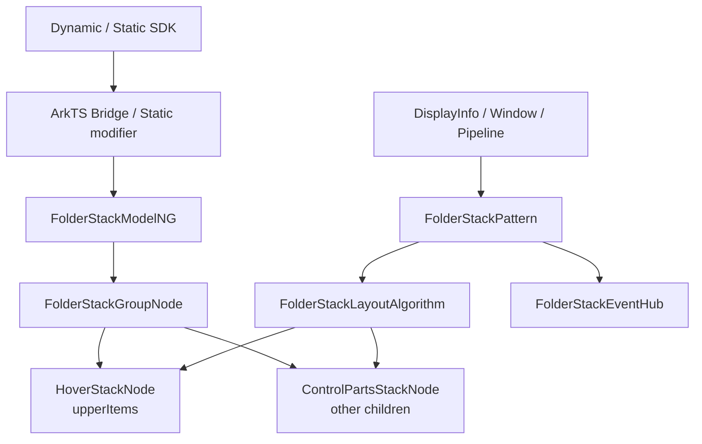
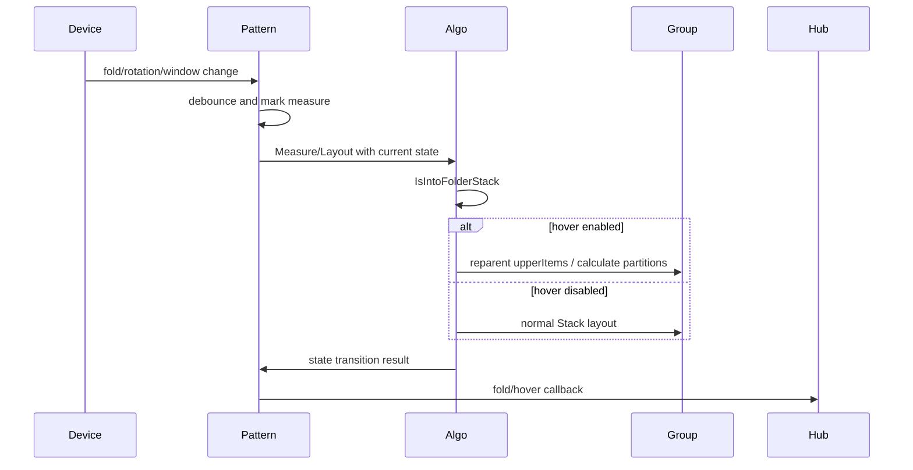
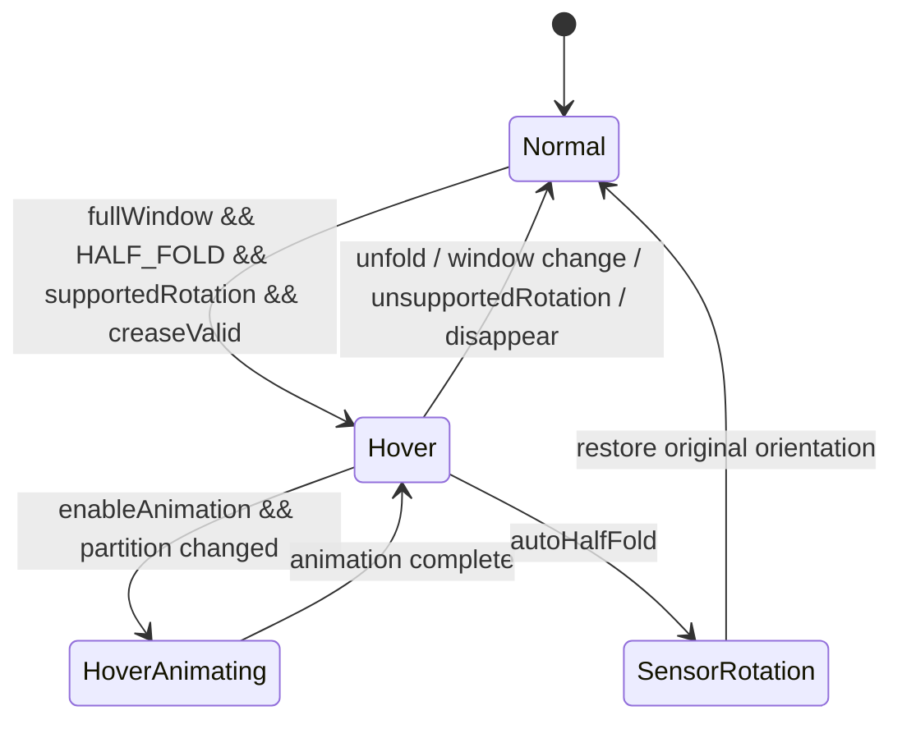
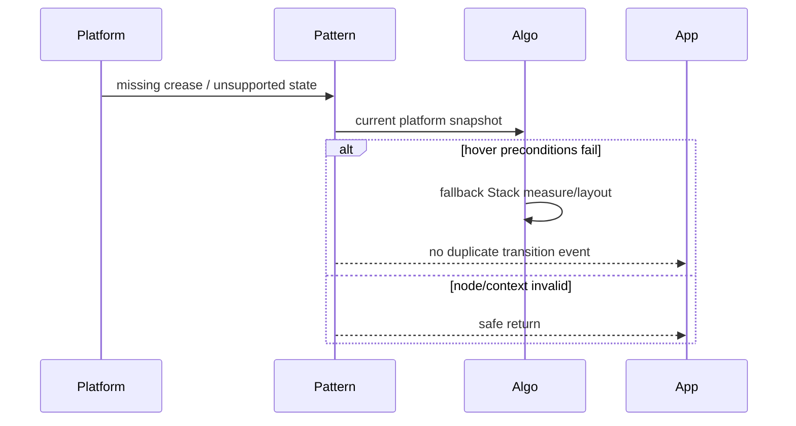

# 架构设计

> FolderStack 功能域的存量实现设计基线，覆盖折叠屏悬停分区、折痕避让、折叠/悬停事件、默认过渡动画、半折自动旋转和多范式接口。

## 设计元数据

| 属性 | 值 |
|------|-----|
| Design ID | DESIGN-Func-05-01-12 |
| 关联需求 | 已有能力补录（无独立 requirement.md） |
| 关联 Epic | 无 |
| 目标 Feature | Feat-01 FolderStack 创建、分区与折痕避让；Feat-02 FolderStack 折叠与悬停状态事件；Feat-03 FolderStack 过渡动画、自动旋转与接口兼容 |
| 复杂度 | 复杂 |
| 目标版本 | API 11–26 |
| Owner | ArkUI SIG |
| 状态 | Baselined（已有实现补录） |

## 需求基线

> 本功能域以 registry 中正式名称 FolderStack、canonical SDK 和当前实现为准。

| 项 | 补充说明（如需） |
|----|------------------|
| 悬停分区 | 半折、横向支持方向、全窗口和受支持产品条件同时成立时，将 `upperItems` 指定子项迁入上半区，其他子项位于下半区 |
| 折痕避让 | 以 DisplayInfo 提供的 crease rect 与安全区计算上下内容区，非悬停状态退化为普通 Stack |
| 状态事件 | （Feat-02）折叠事件输出 foldStatus；悬停事件输出 foldStatus、isHoverMode、appRotation、windowStatusType |
| 动画与旋转 | （Feat-03）默认启用过渡动画和 autoHalfFold；半折可临时请求 SENSOR 方向，退出后恢复 |
| 范围排除 | 本轮不新增 NDK、设备管理能力或 FoldableWindow API |

## 上下文和现状

### 涉及仓和模块

| 仓库 | 补充架构说明 |
|------|--------------|
| `interface_sdk-js` | 定义 FolderStack Dynamic/Static、options、事件 payload 和版本边界 |
| `arkui_ace_engine/frameworks/bridge` | 解析 upperItems、Alignment、bool 与事件回调并注册到 EventHub |
| `arkui_ace_engine/frameworks/core/components_ng/pattern/folder_stack` | 创建内部 Group/上下 Stack，判断悬停状态，测量分区并管理事件、动画与旋转 |
| `arkui_ace_engine/frameworks/core/components_ng/pattern/stack` | FolderStackLayoutProperty/Algorithm 继承和复用普通 Stack 行为 |
| WindowManager/DisplayInfo/Pipeline | 提供折叠状态、折痕区域、窗口模式、方向和生命周期回调 |

### 调用链层级分析

| 层 | 模块 | 职责 | 修改类型 |
|----|------|------|----------|
| SDK | `interface/sdk-js/api/@internal/component/ets/folder_stack.d.ts`、`interface/sdk-js/api/arkui/component/folderStack.static.d.ets` | 暴露 options、属性、回调和 Static builder | 存量补录 |
| Frontend bridge | ArkTS dynamic/static modifier | 参数解析、回调包装、默认值/reset | 存量补录 |
| Model | `frameworks/core/components_ng/pattern/folder_stack/folder_stack_model_ng.cpp`、static model | 创建 Group/内部 Stack，设置属性与 EventHub | 存量补录 |
| Property | `frameworks/core/components_ng/pattern/folder_stack/folder_stack_layout_property.h` | 继承 Stack 属性并保存 animation/autoHalfFold/hinge 偏移 | 存量补录 |
| Layout | `frameworks/core/components_ng/pattern/folder_stack/folder_stack_layout_algorithm.cpp` | 判断悬停、计算 crease/全窗口、迁移子项、测量上下分区 | 存量补录 |
| Pattern/Event | `frameworks/core/components_ng/pattern/folder_stack/folder_stack_pattern.cpp`、EventHub/EventInfo | 监听折叠/方向、去抖、动画、旋转和事件派发 | （Feat-02/03）存量补录 |
| Platform | DisplayInfo/Window/Pipeline | 提供折叠态、折痕、方向、窗口状态 | 只读依赖 |

- [x] 调用链每一层都已覆盖（SDK 到平台状态）
- [x] 每层职责边界清晰，无跨层违规调用
- [x] 每层修改类型明确

### 适用架构规则

| Rule ID | 适用原因 | 设计结论 | 验证方式 |
|---------|----------|----------|----------|
| OH-ARCH-LAYERING | SDK、Bridge、Model、Layout、Platform 多层协作 | 平台状态经 Pipeline/Manager 接口进入 Pattern，不由 SDK 直接访问 | 架构评审 |
| OH-ARCH-SUBSYSTEM | 依赖 Window/Display 折叠能力 | 只使用既有抽象接口，不新增反向依赖或设备管理职责 | 依赖检查 |
| OH-ARCH-IPC-SAF | Window 信息可能由系统服务提供 | FolderStack 内部不新增 IPC 协议或 SA 接口 | 集成测试 |
| OH-ARCH-API-LEVEL | Dynamic API 11/12/18、Static 23/26 | 以 canonical SDK 版本和正式注册信息为准 | API 评审/XTS |
| OH-ARCH-COMPONENT-BUILD | 无新增部件 | 复用既有 FolderStack 源集和窗口依赖 | 全量构建 |
| OH-ARCH-ERROR-LOG | 不支持设备/方向/父节点需降级 | 降级普通 Stack 或不派发转换事件，不抛异常 | UT/hilog |

## 不涉及项承接

| 维度 | 设计结论 |
|------|----------|
| NDK | 本轮明确排除，不新增 native public C API |
| 设备折叠策略 | N/A；FolderStack 只消费系统折叠状态，不决定设备姿态 |
| 窗口旋转总策略 | 不新增系统设置；autoHalfFold 只临时设置当前窗口方向并负责恢复 |
| 数据持久化 | N/A；事件、动画与方向状态随节点/窗口生命周期存在 |
| 安全权限 | 不新增权限；继续受 SDK Stage 模型和设备能力约束 |
| 国际化 | RTL 影响分区内 Stack 对齐，不改变 upperItems ID 匹配 |

## 关键设计决策

| 决策 ID | 问题 | 推荐方案 | 探索过的替代方案 | 取舍理由 | 影响 |
|---------|------|----------|-----------------|----------|------|
| ADR-1 | 如何在单个组件内承载上下分区 | 创建 FolderStackGroupNode，并维护 HoverStackNode 与 ControlPartsStackNode；按 inspector ID 将 upperItems 子项迁入上半区 | 方案A：每帧只改 offset；方案B：要求应用显式创建两个 Stack | 内部节点可复用 Stack 测量/对齐并保持对外单容器 API | 子项归属在悬停转换时变化，但应用声明节点状态需保留 |
| ADR-2 | 何时启用折痕避让 | 必须同时满足全窗口、HALF_FOLD、支持方向/产品和可解析折痕；否则回退普通 Stack | 方案A：任意折叠态均分区；方案B：只看 crease rect | 组合条件与设备实际悬停能力一致，避免普通窗口被错误切分 | 不支持设备、窗口或 if/else 父节点下不启用悬停 |
| ADR-F2-1 | 事件何时派发 | 仅在折叠/悬停状态发生可观察转换时派发，payload 在 Pattern/Layout 获得完整状态后构造 | 方案A：每帧派发；方案B：仅派发 foldStatus | 转换派发避免高频重复，同时 hover 回调必须满足 SDK 四字段契约 | 需要记录上一次状态并验证去重 |
| ADR-F2-2 | 多线程构建下监听器如何管理 | Pattern 进入主树后在正确线程注册，离树/销毁时注销 | 方案A：构造时永久监听；方案B：每次布局查询无监听 | 生命周期注册降低空转和悬空回调风险 | multithread pattern 需单独回归 |
| ADR-F3-1 | 悬停切换是否默认动画 | 默认 true，使用既有 400ms spring 和延迟控制；false 时直接提交最终布局 | 方案A：无动画；方案B：应用自定义动画取代默认 | 已发布 SDK 声明默认开启，内置动画与内部节点迁移时机配套 | 动画不能改变最终分区几何和事件结果 |
| ADR-F3-2 | autoHalfFold 如何覆盖系统旋转关闭 | 半折且属性 true 时临时请求 SENSOR；不可见、退出半折或 disappear 时恢复原方向 | 方案A：永久开启旋转；方案B：完全不干预 | 临时覆盖满足悬停交互且避免污染窗口后续生命周期 | 必须测试恢复和重复进入 |
| ADR-F3-3 | Static 与 Dynamic payload 差异如何处理 | 公开契约以 SDK 四字段为准；Static bridge 当前只填 foldStatus 的偏差列为风险，不降低规格 | 方案A：按实现偏差删字段；方案B：把四字段都视为可选 | SDK 是开发者契约，偏差应作为修复/验证风险 | Static onHoverStatusChange 需要重点集成验证 |

## 设计骨架

### 骨架范围

| 骨架项 | 目标 | 不包含 | 验证方式 |
|--------|------|--------|----------|
| 容器与分区 | 固化内部节点结构、全窗口/半折条件和 upperItems 迁移 | 应用层双栏布局 | NG/Layout UT |
| 折痕避让 | 固化 crease rect、安全区和上下内容框 | 系统折痕计算本身 | DisplayInfo mock |
| 状态事件 | 固化 fold/hover payload、转换派发和生命周期监听 | 新事件类型 | EventHub/Pattern UT |
| 动画旋转 | 固化默认值、过渡和 SENSOR 请求/恢复 | 系统旋转设置 UI | Window mock/动画 UT |
| 多范式 | 映射 Dynamic/Static API 11–26 | NDK | SDK 编译/bridge UT |

### 骨架 Spec 拆分

| Task ID | 目标 | 受影响文件 | AC |
|---------|------|------------|-----|
| TASK-SKELETON-1 | 创建、分区和折痕避让证据链 | `Feat-01-folder-stack-partition-crease-avoidance-spec.md` | Feat-01 全部 AC |
| TASK-SKELETON-2 | 折叠/悬停事件证据链 | `Feat-02-folder-stack-fold-hover-events-spec.md` | Feat-02 全部 AC |
| TASK-SKELETON-3 | 动画、自动旋转和接口兼容证据链 | `Feat-03-folder-stack-animation-auto-rotation-spec.md` | Feat-03 全部 AC |

## 后续 Task 拆分

| Task ID | 目标 | 受影响文件 | 依赖 |
|---------|------|------------|------|
| TASK-FEAT-01 | 基线化内部结构与悬停布局 | `Feat-01-folder-stack-partition-crease-avoidance-spec.md` | SDK、Model、LayoutAlgorithm |
| TASK-FEAT-02 | 基线化折叠/悬停事件 | `Feat-02-folder-stack-fold-hover-events-spec.md` | Feat-01 状态判定、EventHub |
| TASK-FEAT-03 | 基线化动画、旋转和多范式兼容 | `Feat-03-folder-stack-animation-auto-rotation-spec.md` | Feat-01/02、Pattern、Static bridge |

## API 签名、Kit 与权限

> 下表登记已有 API，不表示本轮新增产品接口。

### 新增 API

| API 签名 | 类型 | Kit | d.ts 位置 | 权限要求 | SysCap |
|----------|------|-----|------------|----------|--------|
| `FolderStack(options?: FolderStackOptions): FolderStackAttribute` | Public Dynamic | ArkUI | `interface/sdk-js/api/@internal/component/ets/folder_stack.d.ts:44-83` | 无 | ArkUI.Full |
| `alignContent(value: Alignment)` | Public Dynamic | ArkUI | `interface/sdk-js/api/@internal/component/ets/folder_stack.d.ts:148-163` | 无 | ArkUI.Full |
| `onFolderStateChange(callback)` | Public Dynamic | ArkUI | `interface/sdk-js/api/@internal/component/ets/folder_stack.d.ts:165-179` | 无 | ArkUI.Full |
| `onHoverStatusChange(handler)` | Public Dynamic | ArkUI | `interface/sdk-js/api/@internal/component/ets/folder_stack.d.ts:181-193` | 无 | ArkUI.Full |
| `enableAnimation(value)` / `autoHalfFold(value)` | Public Dynamic | ArkUI | `interface/sdk-js/api/@internal/component/ets/folder_stack.d.ts:195-227` | 无 | ArkUI.Full |
| Static `FolderStack(options, content_)` | Public Static | ArkUI | `interface/sdk-js/api/arkui/component/folderStack.static.d.ets:227-258` | 无 | ArkUI.Full |
| `setFolderStackOptions(options?)` | Public Static | ArkUI | `interface/sdk-js/api/arkui/component/folderStack.static.d.ets:158-178` | 无 | ArkUI.Full |

### 变更/废弃 API

| 原有 API | 变更类型 | 新 API | 迁移说明 |
|----------|----------|--------|----------|
| 无 | 无 | 无 | 本次仅补录已有 FolderStack 能力 |

## 构建系统影响

### BUILD.gn 变更

```text
无变更。FolderStack 继续复用既有 NG pattern、WindowManager 和 DisplayInfo 依赖。
```

### bundle.json 变更

无新增 component、依赖或权限声明。

## 可选设计扩展

### 架构图



### 数据流/控制流

| 步骤 | 调用方 | 被调用方 | 数据/接口 | 说明 |
|------|--------|----------|-----------|------|
| 1 | 应用 | FolderStack SDK | upperItems、Alignment、bool、callbacks | 声明配置 |
| 2 | Bridge | Model/EventHub | string IDs、枚举、回调 | 参数解析与注册 |
| 3 | Pattern | DisplayInfo/Window | foldStatus、crease、rotation、windowMode | 读取平台状态 |
| 4 | LayoutAlgorithm | GroupNode | hover 条件、上/下区域尺寸 | 选择普通 Stack 或悬停分区 |
| 5 | LayoutAlgorithm | 内部 Stack | inspector ID 匹配与子项迁移 | upperItems 进入上区 |
| 6 | Pattern | EventHub/Window | 事件 payload、动画、方向请求 | 状态转换副作用 |

### 时序设计



### 数据模型设计

```typescript
interface FolderStackOptions {
  upperItems?: Array<string>;
}
interface HoverEventParam {
  foldStatus: FoldStatus;
  isHoverMode: boolean;
  appRotation: AppRotation;
  windowStatusType: WindowStatusType;
}
```

```cpp
struct FolderStackRuntimeState {
    bool enableAnimation = true;
    bool autoHalfFold = true;
    bool isHoverMode = false;
    FoldStatus foldStatus;
    Rect creaseRect;
};
```

| 状态 | 持有位置 | 生命周期 |
|------|----------|----------|
| upperItems/Alignment/animation/autoHalfFold | FolderStack LayoutProperty | 随 FrameNode |
| 折叠监听与上次状态 | FolderStack Pattern | attach/appear 到 detach/disappear |
| callbacks | FolderStack EventHub | 随节点，可 reset |
| 临时窗口方向 | Window/Pipeline | 半折期间；退出或不可见时恢复 |

### 算法与状态机



### 测试性设计

| 测试层级 | 测试目标 | Mock 策略 | 验证方式 |
|----------|----------|-----------|----------|
| Model UT | Group/upper/lower 内部节点和属性默认值 | 创建 NG FrameNode | 检查节点类型/属性 |
| Layout UT | 全窗口、方向、产品、crease 与 upperItems | Mock DisplayInfo/Pipeline/parent | 检查区域与子项归属 |
| Pattern UT | fold/hover 事件、去抖和监听生命周期 | Mock FoldableWindow callback | 检查次数与 payload |
| Window UT | autoHalfFold 请求与恢复 | Mock orientation API | 检查 SENSOR/restore |
| SDK/Bridge UT | Dynamic/Static 参数和回调 | 调用不同 API 表面 | 比对 EventHub/Property |

### 异常传播时序图



| 异常场景 | 传播/恢复结论 |
|----------|---------------|
| 非双折/非半折/非全窗口 | 回退普通 Stack，不进入悬停分区 |
| crease rect 不可用 | 不计算错误上下区，回退普通 Stack |
| upperItems ID 不存在 | 未匹配子项留在默认下区，不崩溃 |
| if/else 父节点导致父对象不可按 FrameNode 使用 | hover 判定失败，符合 SDK 禁用说明 |
| 节点离树 | 注销监听并恢复方向，后续回调安全退出 |

### 资源所有权矩阵

| 资源 | 创建方 | 持有方 | 销毁触发 | 实际释放 | 异常回收 |
|------|--------|--------|----------|----------|----------|
| Group/内部 Stack nodes | FolderStackModelNG | FolderStack UI 子树 | 节点移除 | 引用计数 | UI 树回收 |
| Fold listener | Pattern | FoldableWindow manager | detach/disappear | 注销 token | 回调检查节点 |
| Event callbacks | Bridge | EventHub | reset/节点销毁 | Function 引用释放 | 无回调时跳过 |
| Animation | Pattern/Pipeline | Animation manager | 完成/取消/节点离树 | 框架回收 | disappear 恢复最终态 |
| Orientation override | Pattern/Window | 当前窗口 | 退出半折/不可见 | 恢复原方向 | disappear 强制恢复 |

### 接口参数规约

| 接口 | 参数 | 类型 | 合法范围 | 非法处理 | 边界说明 |
|------|------|------|----------|----------|----------|
| FolderStack | upperItems | string[] | 子组件 inspector ID | 非数组/无匹配按入口回退 | 重复/不存在 ID 不得崩溃 |
| alignContent | value | Alignment | 九宫格枚举 | 默认 Center | 分区内继承 Stack RTL 语义 |
| callbacks | callback/handler | function | SDK payload | undefined reset | 只在状态转换时调用 |
| enableAnimation | value | boolean | true/false | invalid/undefined 恢复默认 true | 不改变最终几何 |
| autoHalfFold | value | boolean | true/false | invalid/undefined 恢复默认 true | 只在系统自动旋转关闭时体现 |

### 线程与并发模型

| 操作 | 发起线程 | 回调线程 | 跨进程边界 | 线程安全 | 重入约束 |
|------|----------|----------|------------|----------|----------|
| fold/window 状态通知 | 平台约定线程 | 转投 UI 线程处理 | 可能由系统服务提供但本组件不新增 IPC | Pattern 生命周期保护 | 去抖期间合并状态 |
| Measure/Layout | UI 线程 | UI 线程 | 无 | Pipeline 串行 | 不在回调中重入布局 |
| 应用事件 callback | UI 线程 | UI 线程 | 无 | EventHub 串行派发 | 回调引发的新状态在后续管线处理 |
| 动画/方向恢复 | UI/Pipeline 线程 | UI 线程 | 无新增边界 | 检查节点可见性 | disappear 必须幂等 |

## 详细设计

### 内部节点与 upperItems 分区

`FolderStackModelNG::Create` 创建 `FolderStackGroupNode`，并维护 HoverStackNode 与 ControlPartsStackNode（`frameworks/core/components_ng/pattern/folder_stack/folder_stack_model_ng.cpp:23-52`）。布局算法按子项 inspector ID 与 `upperItems` 比对，将命中项归入上区，未命中项归入下区（`frameworks/core/components_ng/pattern/folder_stack/folder_stack_layout_algorithm.cpp:273-300`）。

### 悬停判定与折痕区域

非悬停时直接执行普通 Stack 测量/布局（`frameworks/core/components_ng/pattern/folder_stack/folder_stack_layout_algorithm.cpp:33-54`）。悬停需要全窗口、HALF_FOLD、受支持产品/方向（`frameworks/core/components_ng/pattern/folder_stack/folder_stack_layout_algorithm.cpp:211-270,311-340`）。折痕 rectangle 与 safe-area 决定上下区域边界（`frameworks/core/components_ng/pattern/folder_stack/folder_stack_layout_algorithm.cpp:184-209`），RTL 对齐继续复用 Stack 语义（`frameworks/core/components_ng/pattern/folder_stack/folder_stack_layout_algorithm.cpp:56-118`）。

### 状态事件与监听生命周期

Pattern attach/detach 管理折叠监听（`frameworks/core/components_ng/pattern/folder_stack/folder_stack_pattern.cpp:34-61`），方向和折叠变化经去抖后触发布局（`frameworks/core/components_ng/pattern/folder_stack/folder_stack_pattern.cpp:140-199`）。LayoutAlgorithm 只在状态转换时构造包含 fold/hover/rotation/window 的事件（`frameworks/core/components_ng/pattern/folder_stack/folder_stack_layout_algorithm.cpp:342-374`）；EventInfo 字段定义见 `frameworks/core/components_ng/pattern/folder_stack/folder_stack_event_info.h:27-58`。

### 过渡动画与自动旋转

默认动画时长、spring 和延迟常量位于 `frameworks/core/components_ng/pattern/folder_stack/folder_stack_pattern.cpp:28-31`，实际转换受 `enableAnimation` 门控（`frameworks/core/components_ng/pattern/folder_stack/folder_stack_pattern.cpp:210-249`）。`autoHalfFold` 在半折时请求 SENSOR，并在不可见或退出时恢复（`frameworks/core/components_ng/pattern/folder_stack/folder_stack_pattern.cpp:258-328`）。

## 风险和开放问题

| 项 | 类型 | 影响 | 处理方式 | Owner |
|----|------|------|----------|-------|
| Static hover callback 当前 bridge 路径可能只填 foldStatus，而 SDK 要求四字段 | API | 高 | 以 SDK 为验收契约，增加 Static 集成测试并跟踪实现修复 | ArkUI SIG |
| SDK 声明 if/else 父节点禁用悬停，源码通过直接父 FrameNode 判定隐式实现 | 架构 | 中 | 保留黑盒场景测试，避免依赖具体 cast 细节 | ArkUI SIG |
| 受支持产品/方向条件依赖平台枚举演进 | API | 中 | 用正式平台信息和设备矩阵验证，不在组件内硬扩展产品规则 | ArkUI SIG |
| 动画、事件和方向通知同时发生可能形成状态竞态 | 测试 | 中 | 覆盖快速折叠/展开、旋转、离树和重复通知序列 | ArkUI SIG |

## 设计审批

- [x] 需求基线已确认，设计覆盖 P0/P1 AC
- [x] 不涉及项已承接，N/A 和展开项都有结论
- [x] 涉及仓和模块职责清楚
- [x] 调用链层级分析完整，每层覆盖到位
- [x] 适用架构规则已识别并形成设计结论
- [x] 分层和子系统边界合规
- [x] API 变更有签名、权限、错误码和兼容性说明
- [x] BUILD.gn/bundle.json 影响明确
- [x] 设计输出和后续 Task 拆分明确
- [x] 关键设计决策有理由和影响说明
- [x] 风险和开放问题有 Owner

**结论:** 通过（已有实现补录，文档状态保持 Draft）
