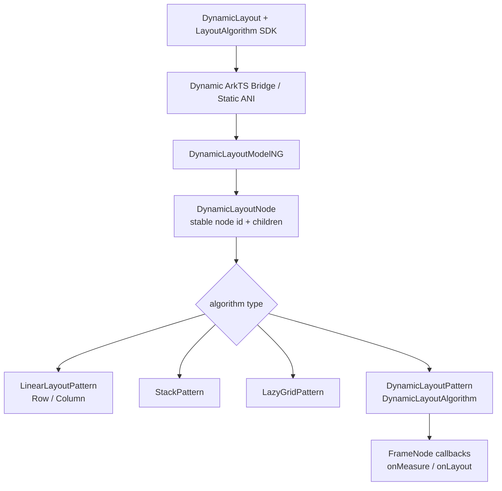
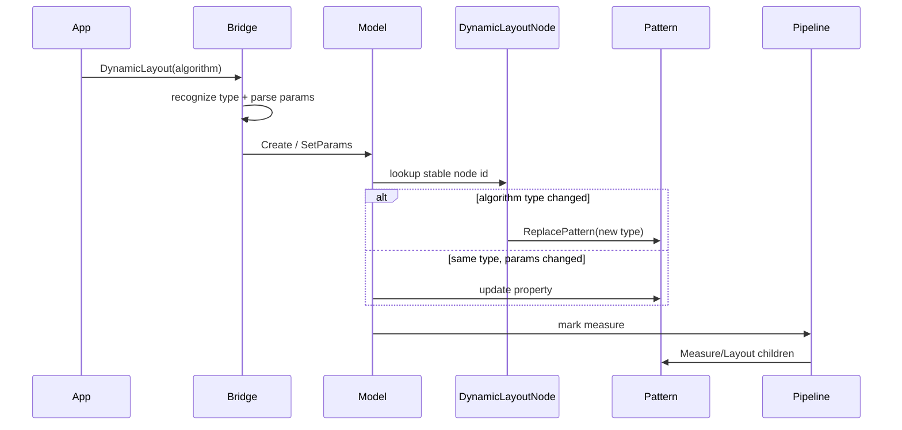
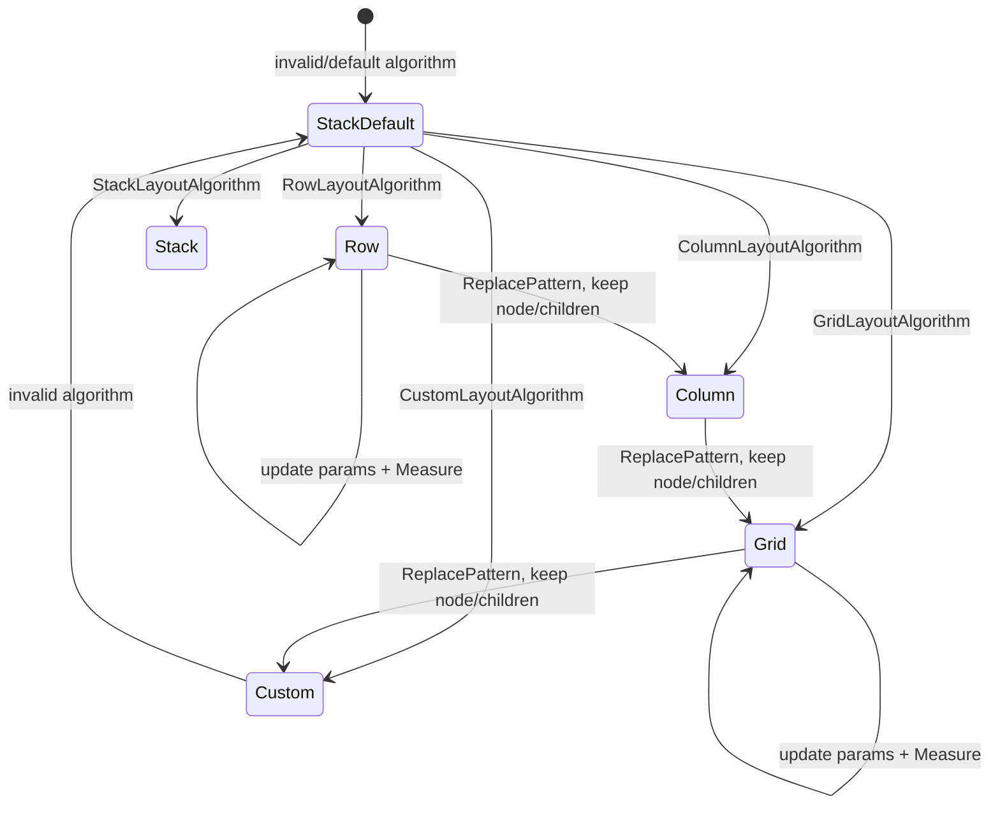
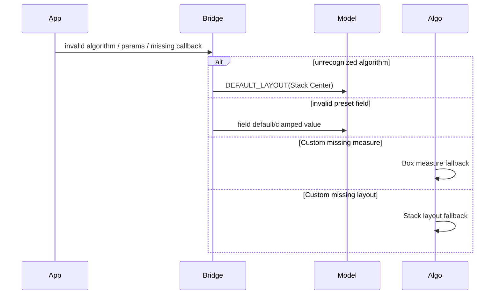

# 架构设计

> DynamicLayout 功能域的存量实现设计基线，覆盖运行时布局算法切换、Row/Column 线性算法、Stack/Grid 算法和 CustomLayoutAlgorithm 回调。

## 设计元数据

| 属性 | 值 |
|------|-----|
| Design ID | DESIGN-Func-05-01-13 |
| 关联需求 | 已有能力补录（无独立 requirement.md） |
| 关联 Epic | 无 |
| 目标 Feature | Feat-01 DynamicLayout 容器创建与运行时算法切换；Feat-02 DynamicLayout 行列线性布局算法；Feat-03 DynamicLayout 堆叠与网格布局算法；Feat-04 DynamicLayout 自定义测量与布局算法 |
| 复杂度 | 复杂 |
| 目标版本 | API 24 |
| Owner | ArkUI SIG |
| 状态 | Baselined（已有实现补录） |

## 需求基线

> DynamicLayout 与 LayoutAlgorithm 在 API 24 发布；以 canonical SDK 和当前 ace_engine Dynamic/Static 实现为基线。

| 项 | 补充说明（如需） |
|----|------------------|
| 运行时切换 | 同一个 DynamicLayout 节点可替换 Row、Column、Stack、Grid、Custom Pattern/Algorithm，保持子组件状态 |
| 默认回退 | 无效 LayoutAlgorithm 按 StackLayoutAlgorithm、Center 对齐处理 |
| 线性算法 | （Feat-02）Row/Column 暴露 space、alignItems、justifyContent、isReverse，并复用 Flex/LinearLayout 语义 |
| 堆叠与网格 | （Feat-03）Stack 使用 LocalizedAlignment；Grid 使用 columnsTemplate 或 ItemFillPolicy 与行列间距 |
| 自定义算法 | （Feat-04）onMeasure/onLayout 收到 DynamicLayout FrameNode 和约束/位置；缺失回调分别回退 Box/Stack |
| 范围排除 | 明确不补录 LazyDynamicLayout，也不补录 NDK 接口 |

## 上下文和现状

### 涉及仓和模块

| 仓库 | 补充架构说明 |
|------|--------------|
| `interface_sdk-js` | 定义 DynamicLayout、LayoutAlgorithm 五类算法及 API 24 约束 |
| `frameworks/core/components_ng/pattern/dynamiclayout/bridge/arkts_native_dynamic_layout_bridge.cpp` | 解析 Dynamic ArkTS 算法对象、参数、回调和非法输入回退 |
| `frameworks/bridge/arkts_frontend/koala_projects/arkoala-arkts/arkui-ohos/src/ani/native/dynamiclayout/dynamiclayout_module.cpp` | Static/ANI 解析 preset/custom 算法和弱引用回调 |
| `frameworks/core/components_ng/pattern/dynamiclayout` | DynamicLayoutNode/Model、Pattern 替换、参数映射和 custom adapter |
| 既有 Linear/Stack/LazyGrid Pattern | 执行具体 preset 算法测量与布局 |
| FrameNode API | 为 custom 回调提供 child、measure、layout、setMeasuredSize 等操作 |

### 调用链层级分析

| 层 | 模块 | 职责 | 修改类型 |
|----|------|------|----------|
| SDK | `interface/sdk-js/api/@ohos.arkui.components.ArkDynamicLayout.d.ts`、`interface/sdk-js/api/arkui/LayoutAlgorithm.d.ts`、对应 Static d.ets | 对外类型、构造、版本和优先级说明 | 存量补录 |
| Dynamic bridge | `frameworks/core/components_ng/pattern/dynamiclayout/bridge/arkts_native_dynamic_layout_bridge.cpp` | 识别算法类型、解析 options、包装 custom callbacks | 存量补录 |
| Static/ANI bridge | `frameworks/bridge/arkts_frontend/koala_projects/arkoala-arkts/arkui-ohos/src/ani/native/dynamiclayout/dynamiclayout_module.cpp`、static ANI modifier | 解析 static 对象、Dimension/Resource 和弱引用回调 | 存量补录 |
| Node/Model | `frameworks/core/components_ng/pattern/dynamiclayout/dynamic_layout_node.cpp`、`frameworks/core/components_ng/pattern/dynamiclayout/dynamic_layout_model_ng.cpp` | 创建/复用节点，按类型构造或替换 Pattern，写算法参数 | 存量补录 |
| Property/Pattern | Linear/Stack/Grid/Dynamic Layout Pattern | 保存参数并创建具体算法 | Feat-02/03/04 补录 |
| Algorithm | Flex/Stack/LazyGrid/DynamicLayoutAlgorithm | 测量与布局子项，custom 时转发 FrameNode callback | 存量补录 |
| FrameNode | ArkUI FrameNode API | custom 回调中的测量、定位和 measured size 操作 | Feat-04 补录 |

- [x] 调用链每一层都已覆盖
- [x] Dynamic 与 Static 的职责边界清晰
- [x] preset 与 custom 最终执行层明确

### 适用架构规则

| Rule ID | 适用原因 | 设计结论 | 验证方式 |
|---------|----------|----------|----------|
| OH-ARCH-LAYERING | SDK/Bridge/Model/Pattern/Algorithm 多层 | 算法对象只由 Bridge 解析，Layout 层只消费强类型参数 | 架构评审 |
| OH-ARCH-SUBSYSTEM | 复用多个布局 Pattern | 只通过 NG Pattern/Property 抽象组合，不新增跨子系统依赖 | 依赖检查 |
| OH-ARCH-IPC-SAF | 无跨进程调用 | N/A；全部在当前 UI Pipeline/VM 上下文 | 代码审查 |
| OH-ARCH-API-LEVEL | 全部为 API 24 | Dynamic/Static 可见性和 SDK 签名保持 API 24 | SDK 编译/XTS |
| OH-ARCH-COMPONENT-BUILD | 不新增部件 | 复用现有 dynamiclayout 与布局算法源集 | 全量构建 |
| OH-ARCH-ERROR-LOG | 无效算法/参数/回调缺失需回退 | 统一到 Stack Center 或各 preset 默认；custom 缺失回调分阶段回退 | UT/fuzz |

## 不涉及项承接

| 维度 | 设计结论 |
|------|----------|
| LazyDynamicLayout | 明确排除；即使位于相邻 SDK/源码模块也不登记到本功能域 Feat |
| NDK | 明确排除；不新增 public C API |
| 新布局算法 | 不新增；只补录 Row/Column/Stack/Grid/Custom 五类已发布算法 |
| 数据持久化 | N/A；算法对象、Pattern 和子节点状态只存在内存 |
| IPC/权限 | N/A；Public ArkUI API，无新权限和 IPC |
| 状态管理语义 | DynamicLayout 保持子组件实例；不定义应用状态变量自身生命周期 |

## 关键设计决策

| 决策 ID | 问题 | 推荐方案 | 探索过的替代方案 | 取舍理由 | 影响 |
|---------|------|----------|-----------------|----------|------|
| ADR-1 | 运行时切换算法时是否重建容器和子树 | 复用相同 DynamicLayoutNode；只有算法类型改变时 `ReplacePattern`，参数变化更新现有 Pattern/Property 并标记 Measure | 方案A：重建整个 FrameNode；方案B：一个万能 Pattern 内含所有算法 | 复用节点能保持子组件状态和节点 ID；按类型 Pattern 保留既有算法职责 | 切换前后子节点身份不变，几何在下一布局帧更新 |
| ADR-2 | 无效算法如何处理 | 回退 StackLayoutAlgorithm 且 Center 对齐 | 方案A：抛异常不创建；方案B：沿用上一个算法 | SDK 明确无效值按 Stack 排列；确定回退避免运行态空布局 | 首次与后续非法输入都必须产生可用布局 |
| ADR-F2-1 | Row/Column 是否自建动态算法 | 映射到既有 LinearLayoutProperty/Pattern，复用 FlexLayoutAlgorithm | 方案A：DynamicLayout 复制线性算法；方案B：custom 回调模拟 | 复用已验证的 space、对齐、reverse、RTL 和子项 Flex 属性 | 线性规格应与 Row/Column 基础语义一致 |
| ADR-F2-2 | preset 参数变化是否替换 Pattern | 同类型只更新 Property 并标记 Measure，不替换 Pattern | 方案A：任意字段变化都 ReplacePattern；方案B：忽略可观察字段变化 | 保持 Pattern 状态和减少无谓重建，同时保证布局刷新 | `@Trace` 字段运行时变化可立即生效 |
| ADR-F3-1 | Grid columnsTemplate 与 ItemFillPolicy 如何共存 | 二者共用 union 输入且在 Model 内互斥映射；有效 ItemFillPolicy 设置 LazyGrid policy，否则使用 columnsTemplate | 方案A：同时保存并定义优先级；方案B：拆成两个类 | SDK 使用 union，当前实现只应有一个有效列策略 | 类型切换必须清理/覆盖另一策略的影响 |
| ADR-F3-2 | Stack/Grid 与 Dynamic 容器如何共享状态 | 替换为对应 Stack/LazyGrid Pattern，但外层 DynamicLayoutNode 与子树保持 | 方案A：嵌套真正 Stack/Grid 子节点；方案B：custom 模拟 | Pattern 替换避免额外节点层级并保持算法成熟度 | Inspector tag/节点 ID 稳定，Pattern 类型可变 |
| ADR-F4-1 | Custom 回调如何接入 NG LayoutAlgorithm | DynamicLayoutAlgorithm 在 Measure/Layout 阶段调用已包装 callback，并传 self FrameNode 和约束/位置 | 方案A：Bridge 直接操作 GeometryNode；方案B：新 DSL 指令列表 | FrameNode API 是 SDK 公布的受控能力，Bridge 不应越层布局 | 回调必须在布局阶段、UI/VM 有效上下文执行 |
| ADR-F4-2 | custom 只实现一个回调时如何回退 | 缺失 onMeasure 时使用 Box measure；缺失 onLayout 时使用 Stack layout；存在的回调仍独立执行 | 方案A：任一缺失则整个 custom 失效；方案B：无操作 | 当前实现按阶段回退，可保证容器始终有合法几何 | 需分别测试四种回调组合 |
| ADR-F4-3 | custom callback 生命周期如何保护 | Static/ANI 使用弱引用/上下文检查；节点或 VM 失效时不执行回调 | 方案A：强持有 FrameNode/VM；方案B：允许迟到调用 | 避免算法对象延长 UI 节点或脚本上下文生命周期 | 销毁/切换算法后的回调必须安全停止 |

## 设计骨架

### 骨架范围

| 骨架项 | 目标 | 不包含 | 验证方式 |
|--------|------|--------|----------|
| 容器/切换 | 固化 Node 复用、Pattern 替换、参数更新和非法回退 | LazyDynamicLayout | Node/Pattern UT |
| 线性算法 | 固化 Row/Column options 与共享 Flex 语义 | FlexWrap | 参数化 Layout UT |
| Stack/Grid | 固化 LocalizedAlignment、columns policy 和 gaps | Grid 滚动业务特性 | Stack/LazyGrid UT |
| Custom | 固化回调签名、优先级、fallback 和生命周期 | 新 FrameNode API | Bridge/Algorithm UT |
| 多范式 | 覆盖 Dynamic/Static API 24 | NDK | SDK 编译/ANI UT |

### 骨架 Spec 拆分

| Task ID | 目标 | 受影响文件 | AC |
|---------|------|------------|-----|
| TASK-SKELETON-1 | 容器创建与运行时算法切换证据链 | `Feat-01-dynamic-layout-runtime-switching-spec.md` | Feat-01 全部 AC |
| TASK-SKELETON-2 | Row/Column 算法证据链 | `Feat-02-dynamic-layout-linear-algorithms-spec.md` | Feat-02 全部 AC |
| TASK-SKELETON-3 | Stack/Grid 算法证据链 | `Feat-03-dynamic-layout-stack-grid-algorithms-spec.md` | Feat-03 全部 AC |
| TASK-SKELETON-4 | Custom 算法证据链 | `Feat-04-dynamic-layout-custom-algorithm-spec.md` | Feat-04 全部 AC |

## 后续 Task 拆分

| Task ID | 目标 | 受影响文件 | 依赖 |
|---------|------|------------|------|
| TASK-FEAT-01 | 基线化创建、复用、切换和非法回退 | `Feat-01-dynamic-layout-runtime-switching-spec.md` | SDK、DynamicLayoutNode/Model |
| TASK-FEAT-02 | 基线化线性算法参数与布局 | `Feat-02-dynamic-layout-linear-algorithms-spec.md` | Feat-01、Linear/Flex Pattern |
| TASK-FEAT-03 | 基线化 Stack/Grid 参数与布局 | `Feat-03-dynamic-layout-stack-grid-algorithms-spec.md` | Feat-01、Stack/LazyGrid Pattern |
| TASK-FEAT-04 | 基线化 Custom callbacks 与 fallback | `Feat-04-dynamic-layout-custom-algorithm-spec.md` | Feat-01、FrameNode API、VM bridge |

## API 签名、Kit 与权限

> 下表登记 API 24 已有接口，不表示新增产品 API。

### 新增 API

| API 签名 | 类型 | Kit | d.ts 位置 | 权限要求 | SysCap |
|----------|------|-----|------------|----------|--------|
| `DynamicLayout(algorithm: LayoutAlgorithm): DynamicLayoutAttribute` | Public Dynamic | ArkUI | `interface/sdk-js/api/@ohos.arkui.components.ArkDynamicLayout.d.ts:30-47` | 无 | ArkUI.Full |
| Static `DynamicLayout(algorithm, content_)` | Public Static | ArkUI | `interface/sdk-js/api/@ohos.arkui.components.ArkDynamicLayout.static.d.ets:27-64` | 无 | ArkUI.Full |
| `new ColumnLayoutAlgorithm(options?)` | Public | ArkUI | `interface/sdk-js/api/arkui/LayoutAlgorithm.d.ts:115-290` | 无 | ArkUI.Full |
| `new RowLayoutAlgorithm(options?)` | Public | ArkUI | `interface/sdk-js/api/arkui/LayoutAlgorithm.d.ts:292-474` | 无 | ArkUI.Full |
| `new StackLayoutAlgorithm(options?)` | Public | ArkUI | `interface/sdk-js/api/arkui/LayoutAlgorithm.d.ts:476-553` | 无 | ArkUI.Full |
| `new GridLayoutAlgorithm(options?)` | Public | ArkUI | `interface/sdk-js/api/arkui/LayoutAlgorithm.d.ts:555-688` | 无 | ArkUI.Full |
| `new CustomLayoutAlgorithm()` + callbacks | Public | ArkUI | `interface/sdk-js/api/arkui/LayoutAlgorithm.d.ts:24-113` | 无 | ArkUI.Full |

### 变更/废弃 API

| 原有 API | 变更类型 | 新 API | 迁移说明 |
|----------|----------|--------|----------|
| 无 | 无 | 无 | 全部能力在 API 24 首次提供，本轮仅补录 |

## 构建系统影响

### BUILD.gn 变更

```text
无变更。复用既有 dynamiclayout、linear_layout、stack、lazy_grid 和 ArkTS/ANI bridge 源集。
```

### bundle.json 变更

无新增部件、依赖或权限。

## 可选设计扩展

### 架构图



### 数据流/控制流

| 步骤 | 调用方 | 被调用方 | 数据/接口 | 说明 |
|------|--------|----------|-----------|------|
| 1 | 应用 | DynamicLayout SDK | LayoutAlgorithm 实例 | `@Trace` 属性可在运行时变化 |
| 2 | Dynamic/Static bridge | ModelNG | 算法类型、强类型 params、callbacks | 无效对象变为 DEFAULT_LAYOUT |
| 3 | ModelNG | DynamicLayoutNode | GetOrCreate、ReplacePattern 或 SetParams | 同类型更新，异类型替换 |
| 4 | Pipeline | 当前 Pattern/Algorithm | LayoutConstraint、子节点 | 执行具体 preset/custom |
| 5 | Custom Algorithm | FrameNode API | self/constraint/position | 应用回调显式测量和定位 |
| 6 | Geometry | Pipeline | measured size/offset | 下一帧属性变化再次 Measure |

### 时序设计



### 数据模型设计

```typescript
interface LayoutAlgorithm {}
class ColumnLayoutAlgorithm implements LayoutAlgorithm {}
class RowLayoutAlgorithm implements LayoutAlgorithm {}
class StackLayoutAlgorithm implements LayoutAlgorithm {}
class GridLayoutAlgorithm implements LayoutAlgorithm {}
class CustomLayoutAlgorithm implements LayoutAlgorithm {
  onMeasure(self: FrameNode, constraint: LayoutConstraint): void;
  onLayout(self: FrameNode, position: Position): void;
}
```

```cpp
enum class DynamicLayoutType { DEFAULT_LAYOUT, ROW, COLUMN, STACK, GRID, CUSTOM };

struct DynamicLayoutParams {
    DynamicLayoutType type;
    // variant: Linear / Stack / Grid / Custom callback params
};
```

| 状态 | 持有位置 | 生命周期 |
|------|----------|----------|
| DynamicLayoutNode/children | UI 树 | 跨算法切换保持，节点移除时销毁 |
| 当前 Pattern/Property | DynamicLayoutNode | 类型切换时替换；同类型参数更新 |
| custom callbacks | DynamicLayoutPattern/bridge wrapper | 算法有效期间；弱上下文失效时停止 |
| LayoutAlgorithm ArkTS 对象 | 应用状态 | `@Trace` 修改触发 UI 更新机制 |

### 算法与状态机



### 测试性设计

| 测试层级 | 测试目标 | Mock 策略 | 验证方式 |
|----------|----------|-----------|----------|
| Model/Node UT | 五种类型创建、同类型更新、异类型 ReplacePattern | 固定 node id/children | 检查 node identity、Pattern type、dirty |
| Linear Layout UT | Row/Column defaults、space、alignment、reverse、RTL | 固定子项尺寸 | 比较 size/offset |
| Stack/Grid UT | LocalizedAlignment、template/policy/gaps | 固定约束和子项 | 参数化几何断言 |
| Custom Algorithm UT | 四种 callback 组合、优先级、销毁 | Mock FrameNode/VM callbacks | 调用次数与 Geometry |
| SDK/ANI UT | Dynamic/Static 类型识别和 Resource 转换 | 构造 ArkTS/ANI 算法对象 | 比对 Model params |

### 异常传播时序图



| 异常场景 | 传播/恢复结论 |
|----------|---------------|
| algorithm 非法/undefined | 回退 Stack Center，容器仍可布局 |
| LengthMetrics 负值/解析失败 | 按公开 API 契约使用默认值 0；通过契约测试验证入口一致性 |
| Grid union 无法识别 | 使用默认 `'1fr'`/既有默认策略 |
| custom self/VM/callback 失效 | 不执行脚本回调，按阶段 fallback |
| 切换算法时旧 callback 迟到 | 弱上下文检查后退出，不访问旧 Pattern |

### 资源所有权矩阵

| 资源 | 创建方 | 持有方 | 销毁触发 | 实际释放 | 异常回收 |
|------|--------|--------|----------|----------|----------|
| DynamicLayoutNode | Model/FrameNode 工厂 | UI 树 | 节点移除 | 引用计数 | 标准 UI 树回收 |
| Pattern/Property | Model/Node | DynamicLayoutNode | ReplacePattern/节点销毁 | 引用计数 | 旧 Pattern detach |
| custom callback wrapper | Bridge | Custom Pattern | 类型切换/节点销毁/VM 失效 | wrapper 释放 | 弱引用升级失败退出 |
| ArkTS algorithm object | 应用/VM | 应用状态/观察系统 | 应用释放 | GC | bridge 不永久强持有节点 |

### 接口参数规约

| 接口 | 参数 | 类型 | 合法范围 | 非法处理 | 边界说明 |
|------|------|------|----------|----------|----------|
| DynamicLayout | algorithm | LayoutAlgorithm | 五种公开实现 | Stack Center 回退 | 子组件状态保持 |
| Row/Column | space | LengthMetrics | 非负有效长度 | 默认 0/Static 负值转 0 | 不支持百分比时按底层规则 |
| Row/Column | align/justify/reverse | enums/bool | SDK 枚举/boolean | 各字段默认值 | Row 受 RTL 二次反转 |
| Stack | alignContent | LocalizedAlignment | 本地化九宫格 | 默认 Center | layoutGravity 可生效 |
| Grid | columnsTemplate | string/ItemFillPolicy | 合法模板或 policy | 默认 `'1fr'` | union 两种策略互斥 |
| Grid | gaps | LengthMetrics | 非负 | 非法值按公开 API 契约使用默认值 0 | 影响 Measure |
| Custom | callbacks | functions | onMeasure/onLayout 可独立存在 | 各阶段 fallback | 回调内不应修改状态变量 |

### 线程与并发模型

| 操作 | 发起线程 | 回调线程 | 跨进程边界 | 线程安全 | 重入约束 |
|------|----------|----------|------------|----------|----------|
| 算法对象解析/参数设置 | UI/ArkTS 线程 | UI 线程 | 无 | UI 树线程亲和 | 不在 Measure 中直接 ReplacePattern |
| preset Measure/Layout | UI 线程 | UI 线程 | 无 | Pipeline 串行 | 通用布局约束 |
| custom onMeasure/onLayout | UI 线程/有效 VM 上下文 | 同布局调用栈 | 无 | wrapper 检查上下文 | SDK 明确不修改状态变量 |
| `@Trace` 参数变化 | ArkTS 状态更新线程 | 后续 UI Pipeline | 无 | 观察系统调度 | 同帧合并 dirty |

## 详细设计

### 节点创建、复用与 Pattern 替换

`DynamicLayoutNode::GetOrCreateDynamicLayoutNode` 按 nodeId/tag 查找或创建稳定节点（`frameworks/core/components_ng/pattern/dynamiclayout/dynamic_layout_node.cpp:21-39`）。Model 将算法类型映射为 Row、Column、Stack、Grid、Custom Pattern（`frameworks/core/components_ng/pattern/dynamiclayout/dynamic_layout_model_ng.cpp:28-114`）；类型变化才替换 Pattern，同类型参数更新后标记 Measure（`frameworks/core/components_ng/pattern/dynamiclayout/dynamic_layout_model_ng.cpp:116-199`）。因此子节点和其业务状态跨切换保留。

### Row 与 Column 参数映射

Row/Column 类型建立 LinearLayoutProperty，并设置方向、space、主/交叉轴对齐和 reverse（`frameworks/core/components_ng/pattern/dynamiclayout/dynamic_layout_model_ng.cpp:28-37`）。Dynamic bridge 的解析与默认值位于 `frameworks/core/components_ng/pattern/dynamiclayout/bridge/arkts_native_dynamic_layout_bridge.cpp:30-183`，实际 Measure/Layout 复用 Linear/Flex 生产算法。

### Stack 与 Grid 参数映射

Stack 类型写 Alignment/LocalizedAlignment 并复用 Stack Pattern。Grid 将 `columnsTemplate` 与 `ItemFillPolicy` 互斥映射，同时设置 columnsGap、rowsGap 和 LazyGrid 标记（`frameworks/core/components_ng/pattern/dynamiclayout/dynamic_layout_model_ng.cpp:39-90`）。无效整体算法由 bridge 转为 DEFAULT_LAYOUT（`frameworks/core/components_ng/pattern/dynamiclayout/bridge/arkts_native_dynamic_layout_bridge.cpp:446-467,510-531`）。

### Custom 回调适配

DynamicLayoutAlgorithm 在对应 callback 存在时委托 onMeasure/onLayout；缺 measure 回调使用 Box measure，缺 layout 回调使用 Stack layout（`frameworks/core/components_ng/pattern/dynamiclayout/dynamic_layout_algorithm.cpp:25-38`）。Dynamic callback 包装位于 `frameworks/core/components_ng/pattern/dynamiclayout/bridge/arkts_native_dynamic_layout_bridge.cpp:326-415`，Static/ANI 回调和弱引用位于 `frameworks/bridge/arkts_frontend/koala_projects/arkoala-arkts/arkui-ohos/src/ani/native/dynamiclayout/dynamiclayout_module.cpp:333-399,427-479`。

## 风险和开放问题

| 项 | 类型 | 影响 | 处理方式 | Owner |
|----|------|------|----------|-------|
| Dynamic 与 Static 存在独立参数转换入口 | API | 低 | 以公开 SDK 契约建立跨入口一致性测试，不将入口内部差异作为兼容基线 | ArkUI SIG |
| Grid 使用 LazyGrid Pattern，但 LazyDynamicLayout 不在本轮范围 | 架构 | 中 | 只记录 GridLayoutAlgorithm 所需生产链，禁止扩大 Feat 到 LazyDynamicLayout API | ArkUI SIG |
| Custom 回调可直接操作 FrameNode，错误逻辑可能产生非法几何 | 测试 | 高 | 验证约束、空节点和 fallback；SDK 文档持续强调回调内不修改状态 | ArkUI SIG |
| 类型切换与 `@Trace` 参数更新同帧发生可能触发旧 callback | 测试 | 中 | 增加快速切换、节点销毁、VM 失效和 dirty 合并序列测试 | ArkUI SIG |

## 设计审批

- [x] 需求基线已确认，设计覆盖 P0/P1 AC
- [x] 不涉及项已承接，N/A 和展开项都有结论
- [x] 涉及仓和模块职责清楚
- [x] 调用链层级分析完整，每层覆盖到位
- [x] 适用架构规则已识别并形成设计结论
- [x] 分层和子系统边界合规
- [x] API 变更有签名、权限、错误码和兼容性说明
- [x] BUILD.gn/bundle.json 影响明确
- [x] 设计输出和后续 Task 拆分明确
- [x] 关键设计决策有理由和影响说明
- [x] 风险和开放问题有 Owner

**结论:** 通过（已有实现补录，文档状态保持 Draft）
