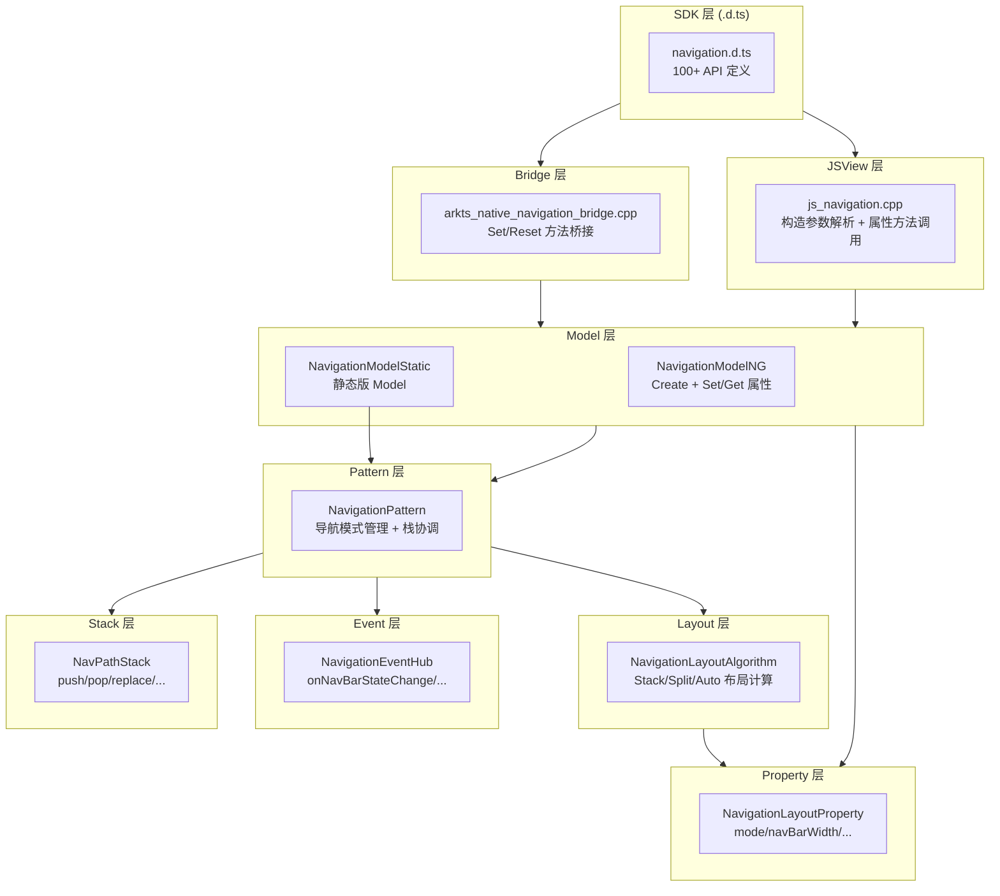
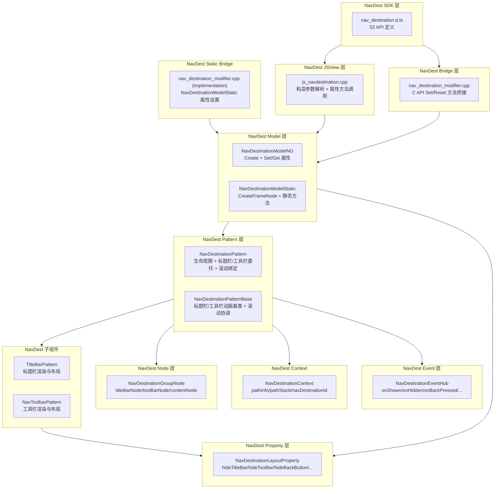

# 架构设计

> Navigation 组件功能域的架构设计文档，补录已有实现。Navigation 是 ArkUI 的导航容器组件，提供页面路由栈管理（NavPathStack）、NavDestination push/pop、转场动画、标题栏/工具栏配置、安全区避让、分栏模式等 100+ 公开 API。

## 设计元数据

| 字段 | 内容 |
|------|------|
| Design ID | DESIGN-Func-05-02-01 |
| 关联需求 | 已有能力补录（无独立 requirement.md） |
| 关联 Epic | 无 |
| 目标 Feature | Feat-01 创建与布局模式, Feat-02 标题栏配置, Feat-03 工具栏配置, Feat-04 路由栈管理, Feat-05 转场动画与自定义过渡, Feat-06 系统栏/安全区/分栏/恢复, Feat-07 事件回调与Modifier, Feat-08 NavDestination 创建与布局模式, Feat-09 NavDestination 标题栏与工具栏配置, Feat-10 NavDestination 生命周期与事件回调, Feat-11 NavDestination 模式/安全区/转场动画/状态恢复 |
| 复杂度 | 复杂 |
| 目标版本 | API 8 起支持，核心 API 集中于 API 9-12，部分增量 API 至 API 26 |
| Owner | ArkUI SIG |
| 状态 | Baselined（已有实现补录） |

## 需求基线

| 字段 | 内容 |
|------|------|
| 问题陈述 | ArkUI 需要一个统一的导航容器组件，支持单页（Stack）、分栏（Split）和自适应（Auto/AUTO_WITH_ASPECT_RATIO）三种导航模式，并通过 NavPathStack 管理页面路由栈 |
| 核心目标 | 提供 Navigation 容器组件，覆盖创建与布局模式、标题栏/工具栏配置、路由栈管理、转场动画、安全区避让、事件回调等 7 个功能域 |
| P0 AC | Feat-01 ~ Feat-07 全量 AC |
| 补充说明 | NavDestination 补录；（Feat-08~11）NavDestination 作为 Navigation 的子页面容器，与 Navigation 共享导航功能域 |

## 上下文和现状

### 涉及仓和模块

| 仓库 | 模块路径 | 当前职责 | 本 Feature 影响 |
|------|----------|----------|-----------------|
| ace_engine | `frameworks/core/components_ng/pattern/navigation/navigation_pattern.cpp/.h` | NavigationPattern 主逻辑，导航模式管理、NavPathStack 协调、布局编排 | 全量涉及 |
| ace_engine | `frameworks/core/components_ng/pattern/navigation/navigation_model_ng.cpp/.h` | Navigation NG Model 层，创建和属性设置 | 全量涉及 |
| ace_engine | `frameworks/core/components_ng/pattern/navigation/navigation_model_static.cpp/.h` | Navigation 静态 Model 层（ArkTS 静态版） | Feat-07 |
| ace_engine | `frameworks/core/components_ng/pattern/navigation/navigation_layout_property.h/.cpp` | 布局属性：mode、navBarWidth、navBarPosition、navBarWidthRange、minContentWidth 等 | Feat-01 |
| ace_engine | `frameworks/core/components_ng/pattern/navigation/navigation_layout_algorithm.cpp/.h` | 布局算法：Stack/Split/Auto 模式布局计算 | Feat-01 |
| ace_engine | `frameworks/core/components_ng/pattern/navigation/navigation_event_hub.h` | 事件回调：onNavigationBarStateChange、onNavModeChange 等 | Feat-07 |
| ace_engine | `frameworks/core/components_ng/pattern/navigation/navigation_stack.cpp/.h` | NavPathStack 路由栈核心实现：push/pop/replace/clear/getParent 等 | Feat-04 |
| ace_engine | `frameworks/bridge/declarative_frontend/jsview/js_navigation.cpp/.h` | JS 桥接层，处理 JS→C++ 调用 | 全量涉及 |
| ace_engine | `frameworks/bridge/declarative_frontend/engine/jsi/nativeModule/arkts_native_navigation_bridge.cpp/.h` | ArkTS 桥接层，属性 Set/Reset 方法 | Feat-07 |
| ace_engine | `frameworks/bridge/declarative_frontend/ark_modifier/src/navigation_modifier.ts` | ArkTS Modifier 定义 | Feat-07 |
| ace_engine | `test/unittest/core/pattern/navigation/` | Navigation 单元测试 | 全量涉及 |
| ace_engine | `frameworks/core/components_ng/pattern/navrouter/navdestination_pattern.cpp/.h` | NavDestinationPattern 主逻辑：生命周期管理、标题栏/工具栏委托、滚动绑定 | （Feat-08）新增 |
| ace_engine | `frameworks/core/components_ng/pattern/navrouter/navdestination_model_ng.cpp/.h` | NavDestination NG Model 层：创建和属性设置 | （Feat-08）新增 |
| ace_engine | `frameworks/core/components_ng/pattern/navrouter/navdestination_model_static.cpp/.h` | NavDestination 静态 Model 层 | （Feat-08）新增 |
| ace_engine | `frameworks/core/components_ng/pattern/navrouter/navdestination_layout_property.h` | NavDestination 布局属性：hideTitleBar/hideToolBar/hideBackButton/ignoreLayoutSafeArea/fullScreenOverlay | （Feat-08）新增 |
| ace_engine | `frameworks/core/components_ng/pattern/navrouter/navdestination_event_hub.h` | NavDestination 事件回调：onShown/onHidden/onBackPressed/onWillAppear/onWillDisAppear/onActive/onInactive/onSaveState/onRestoreState | （Feat-10）新增 |
| ace_engine | `frameworks/core/components_ng/pattern/navrouter/navdestination_context.h` | NavDestinationContext 和 NavPathInfo：页面路径信息和上下文暴露 | （Feat-08）新增 |
| ace_engine | `frameworks/core/components_ng/pattern/navigation/navdestination_pattern_base.cpp/.h` | NavDestinationPatternBase：标题栏/工具栏动画和滚动协调基类 | （Feat-08）新增 |
| ace_engine | `frameworks/core/components_ng/pattern/navrouter/navdestination_group_node.h` | NavDestinationGroupNode：NavDestination 节点结构，持有 titleBar/toolBar/content 子节点 | （Feat-08）新增 |
| ace_engine | `frameworks/bridge/declarative_frontend/jsview/js_navdestination.cpp/.h` | JS 桥接层，JSNavDestination 属性方法解析 | （Feat-08）新增 |
| ace_engine | `frameworks/core/interfaces/native/node/nav_destination_modifier.cpp/.h` | C API 桥接层，NavDestinationModifier 属性设置 | （Feat-11）新增 |
| ace_engine | `frameworks/core/interfaces/native/implementation/nav_destination_modifier.cpp` | C API 静态版桥接层，NavDestinationModelStatic 属性设置 | （Feat-11）新增 |
| ace_engine | `interface/sdk-js/api/@internal/component/ets/nav_destination.d.ts` | NavDestination 公开 API 类型定义 | （Feat-08）存量分析 |
| ace_engine | `interface/sdk-js/api/arkui/NavDestinationModifier.d.ts` | NavDestinationModifier 公开 API 类型定义 | （Feat-11）存量分析 |

### 调用链层级分析

| 层 | 模块 | 职责 | 修改类型 |
|----|------|------|----------|
| 1. SDK 层 | `interface/sdk-js/api/@internal/component/ets/navigation.d.ts` | Navigation 公开 API 类型定义，包含 100+ 属性和事件声明（Feat-08）Navigation + NavDestination 双组件 SDK 定义 | 存量分析 |
| 2. JSView 层 | `frameworks/bridge/declarative_frontend/jsview/js_navigation.cpp` | 解析 ArkTS Navigation() 构造参数及属性方法，参数类型校验与枚举映射，调用 NavigationModelNG 接口 | 存量分析 |
| 3. Bridge 层 | `frameworks/bridge/declarative_frontend/engine/jsi/nativeModule/arkts_native_navigation_bridge.cpp` | ArkTS → C++ 桥接层，属性 Set/Reset 方法，将 JSI 值转换为 C++ 类型后调用 node_modifier（Feat-11）也用于 NavDestination C API 桥接 | 存量分析 |
| 4. Model 层 | `frameworks/core/components_ng/pattern/navigation/navigation_model_ng.cpp` | 属性设置统一入口：所有 Set/Get 方法写入 LayoutProperty 或 Pattern 成员 | 存量分析 |
| 5. Pattern 层 | `frameworks/core/components_ng/pattern/navigation/navigation_pattern.cpp` | 核心编排：导航模式管理、NavPathStack 协调、NavBar/Content 区域布局、安全区避让 | 存量分析 |
| 6. Layout 层 | `frameworks/core/components_ng/pattern/navigation/navigation_layout_algorithm.cpp` | MeasureContent：根据 NavigationMode（Stack/Split/Auto）和 navBarWidth/navBarPosition/navBarWidthRange/minContentWidth 计算布局 | 存量分析 |
| 7. Property 层 | `frameworks/core/components_ng/pattern/navigation/navigation_layout_property.h` | 存储触发 MEASURE/LAYOUT 的属性：mode、navBarWidth、navBarPosition、navBarWidthRange、minContentWidth、hideNavBar 等 | 存量分析 |
| 8. Event 层 | `frameworks/core/components_ng/pattern/navigation/navigation_event_hub.h` | 事件回调存储与触发：onNavigationBarStateChange、onNavModeChange 等 | 存量分析 |
| 9. Stack 层 | `frameworks/core/components_ng/pattern/navigation/navigation_stack.cpp` | NavPathStack 路由栈核心：push/pop/replace/clear/moveToTop/getParent 等栈操作 | 存量分析 |
| 10. NavDest SDK 层 | `interface/sdk-js/api/@internal/component/ets/nav_destination.d.ts` | NavDestination 52 个公开 API 类型定义 | （Feat-08）存量分析 |
| 11. NavDest JSView 层 | `frameworks/bridge/declarative_frontend/jsview/js_navdestination.cpp` | JSNavDestination 构造参数解析、属性方法调用、生命周期回调注册 | （Feat-08）存量分析 |
| 12. NavDest Bridge 层 | `frameworks/core/interfaces/native/node/nav_destination_modifier.cpp` | C API → NavDestinationModelNG 属性设置桥接 | （Feat-11）存量分析 |
| 13. NavDest Static Bridge | `frameworks/core/interfaces/native/implementation/nav_destination_modifier.cpp` | C API → NavDestinationModelStatic 静态版属性设置桥接 | （Feat-11）存量分析 |
| 14. NavDest Model 层 | `frameworks/core/components_ng/pattern/navrouter/navdestination_model_ng.cpp/.h` | NavDestinationModelNG 创建和属性设置 | （Feat-08）存量分析 |
| 15. NavDest Static Model | `frameworks/core/components_ng/pattern/navrouter/navdestination_model_static.cpp/.h` | NavDestinationModelStatic 全静态方法实现 | （Feat-11）存量分析 |
| 16. NavDest Pattern 层 | `frameworks/core/components_ng/pattern/navrouter/navdestination_pattern.cpp/.h` | NavDestinationPattern 生命周期、标题栏/工具栏委托、滚动绑定 | （Feat-08）存量分析 |
| 17. NavDest Pattern Base | `frameworks/core/components_ng/pattern/navigation/navdestination_pattern_base.cpp/.h` | NavDestinationPatternBase 标题栏/工具栏动画和滚动协调基类 | （Feat-08）存量分析 |
| 18. NavDest Layout 层 | `frameworks/core/components_ng/pattern/navrouter/navdestination_layout_property.h` | NavDestinationLayoutProperty：hideTitleBar/hideToolBar/hideBackButton/ignoreLayoutSafeArea/fullScreenOverlay | （Feat-08）存量分析 |
| 19. NavDest Event 层 | `frameworks/core/components_ng/pattern/navrouter/navdestination_event_hub.h` | NavDestinationEventHub：onShown/onHidden/onBackPressed/onWillAppear/onWillDisAppear/onActive/onInactive/onSaveState/onRestoreState | （Feat-10）存量分析 |
| 20. NavDest Node 层 | `frameworks/core/components_ng/pattern/navrouter/navdestination_group_node.h` | NavDestinationGroupNode：titleBarNode/toolBarNode/contentNode 子节点管理 | （Feat-08）存量分析 |

### 适用架构规则

| Rule ID | 适用原因 | 设计结论 | 验证方式 |
|---------|----------|----------|----------|
| OH-ARCH-LAYERING | Navigation 涉及 SDK → JSView → Bridge → Model → Pattern → Layout → Property → Event → Stack 九层 | 单向调用，Property/Event 不反向依赖 Pattern | 代码评审 |
| OH-ARCH-API-LEVEL | 部分 API 在 API 9/10/11/12/14/16/18/20/22/26 有增强 | 各属性标注 @since 版本 | API 评审/XTS |
| OH-ARCH-COMPONENT-BUILD | Navigation 未组件化，源码在 ace_core_ng_source_set 中 | 无独立 bridge/ 子目录，JSView 和 Bridge 双路径共存 | 构建验证 |
| OH-ARCH-PATTERN-MODEL | NavigationModelNG 作为属性设置统一入口，Pattern 持有核心逻辑 | Model 层不持有状态，Pattern 层管理导航模式和栈协调 | 代码评审 |

## 不涉及项承接

| 维度 | 结论 |
|------|------|
| 性能 | 展开 — Navigation 布局算法复杂度取决于导航模式和栈深度，Split 模式需计算双栏布局 |
| 安全与权限 | N/A — Navigation 不涉及安全敏感操作 |
| 兼容性 | 展开 — NavigationMode.AUTO 在 API 9/10 有行为差异，navBarWidth 默认值 API 版本间差异需标注 |
| IPC/跨进程 | N/A — Navigation 为纯 UI 组件 |
| 构建与部件 | N/A — Navigation 未组件化，源码在 ace_core_ng_source_set |
| API/SDK | 展开 — 100+ API 需与 SDK 定义交叉验证 |

## 关键设计决策

| 决策 ID | 问题 | 推荐方案 | 探索过的替代方案 | 取舍理由 | 影响 |
|---------|------|----------|------------------|----------|------|
| ADR-1 | Navigation 组件化状态 | 当前未组件化，JSView 和 Bridge 双路径共存 | 方案A：完全组件化（独立 bridge/ 子目录）；方案B：保持现状 | 组件化改造优先级较低，当前双路径（js_navigation.cpp + arkts_native_navigation_bridge.cpp）覆盖动态版和静态版前端 | js_navigation.cpp 和 arkts_native_navigation_bridge.cpp 共存，需分别维护 |
| ADR-2 | NavigationMode 模式切换 | Stack/Split/Auto/AUTO_WITH_ASPECT_RATIO 四种模式，Split 模式下 NavBar 和 Content 并列显示 | 方案A：仅 Stack/Split 两种模式；方案B：增加 Auto 模式根据屏幕宽度自动切换 | Auto 模式兼顾小屏和大屏体验，AUTO_WITH_ASPECT_RATIO 根据 NavBar 与 Content 宽度比例自动选择更精确 | NavigationLayoutAlgorithm 需处理四种模式的布局计算 |
| ADR-3 | NavPathStack 路由栈 | 以 NavPathStack 作为路由管理核心，NavigationPattern 持有 NavPathStack 引用并监听栈变更 | 方案A：在 NavigationPattern 内部维护路由栈；方案B：独立 NavPathStack 对象由开发者传入 | 开发者传入 NavPathStack 可在 ArkTS 层直接操作栈（push/pop 等），且栈对象可跨组件共享 | Navigation(NavPathStack) 构造方式需确保栈与 Pattern 生命周期绑定 |
| ADR-4 | 安全区避让 | IAvoidInfoListener + CustomSafeAreaExpander 双层避让机制 | 方案A：仅 IAavoidInfoListener 系统级避让；方案B：仅 CustomSafeAreaExpander 开发者自定义 | 系统级避让处理默认安全区（状态栏/导航栏），CustomSafeAreaExpander 允许开发者扩展自定义安全区区域 | ignoreLayoutSafeArea 可选择性关闭部分边缘避让 |
| ADR-F2-1 | 标题栏属性类型分流 | title 支持 ResourceStr/CustomBuilder/NavigationCommonTitle/NavigationCustomTitle 四种类型，JSView 层根据类型分别处理 | 方案A：仅支持 ResourceStr 字符串标题；方案B：统一使用 CustomBuilder | 四种类型覆盖从简单字符串到完全自定义构建的渐进式需求，开发者可根据复杂度选择合适类型 | JSView 层需为每种 title 类型实现独立的解析和属性设置逻辑 |
| ADR-F3-1 | 工具栏位置固定 | 工具栏固定在 NavBar 底部，toolbarConfiguration 仅在 NavBar 区域渲染 | 方案A：工具栏可在 NavBar 或 Content 区域自由放置；方案B：固定在 NavBar 底部 | 固定位置简化布局计算，工具栏始终与 NavBar 关联，Split 模式下工具栏在 NavBar 区域显示 | toolbarConfiguration 不影响 Content 区域布局 |
| ADR-F4-1 | NavPathStack 独立对象 | NavPathStack 作为独立路由栈对象由开发者传入，NavigationPattern 持有引用监听栈变更 | 方案A：在 NavigationPattern 内部维护路由栈；方案B：独立 NavPathStack 对象 | 开发者传入 NavPathStack 可在 ArkTS 层直接操作栈（push/pop 等），栈对象可跨组件共享，灵活性更高 | Navigation(NavPathStack) 构造方式需确保栈与 Pattern 生命周期绑定，栈变更需及时通知 Pattern |
| ADR-F5-1 | 自定义过渡回调机制 | customNavContentTransition 使用回调机制返回 NavigationAnimatedTransition，NavigationTransitionProxy 控制过渡进度 | 方案A：声明式动画配置（预设动画类型）；方案B：回调机制（开发者完全自定义动画） | 回调机制提供最大灵活性，开发者可完全自定义 push/pop 过渡效果；NavigationTransitionProxy 支持交互式过渡（手势驱动） | NavigationPattern 需管理 TransitionProxy 生命周期，timeout 保护防止动画卡住 |
| ADR-F6-1 | BarStyle 与安全区联动 | BarStyle（STANDARD/STACK/SAFE_AREA_PADDING）与 IAvoidInfoListener 安全区避让联动 | 方案A：BarStyle 仅控制 NavBar 背景样式；方案B：BarStyle 同时控制 NavBar 与安全区的避让关系 | BarStyle 不仅是视觉样式，还影响 NavBar 与安全区的避让计算，STACK/SAFE_AREA_PADDING 改变 NavBar 布局行为 | NavigationLayoutAlgorithm 需根据 BarStyle 调整 NavBar 布局计算 |
| ADR-F7-1 | NavigationModifier 桥接 | NavigationModifier 通过 C API 桥接层（arkts_native_navigation_bridge.cpp）将属性写入 NavigationLayoutProperty | 方案A：仅 JSView 层桥接；方案B：JSView + C API 双路径桥接 | C API 桥接层支持 NDK 场景和静态版前端（ArkTS Modifier），与 JSView 层并行覆盖动态版和静态版 | arkts_native_navigation_bridge.cpp 和 js_navigation.cpp 双路径需分别维护 |
| ADR-F8-1 | NavDestination 作为 Navigation 子页面 | NavDestination 是 Navigation 的子页面容器，由 NavPathStack push/pop 管理生命周期，与 Navigation 共享导航功能域设计文档 | 方案A：NavDestination 拥有独立 design.md；方案B：合并到 Navigation design.md | NavDestination 与 Navigation 在功能域上紧密耦合（标题栏/工具栏/安全区/转场共用子组件），合并设计文档避免重复 | NavDestination Feat-08~11 注册在 FuncID 05-02-01 |
| ADR-F9-1 | NavDestination 标题栏/工具栏委托 | NavDestinationPattern 委托 TitleBarPattern/NavToolbarPattern 子组件处理标题栏和工具栏渲染与动画 | 方案A：NavDestinationPattern 内部实现标题栏/工具栏逻辑；方案B：委托独立子组件 Pattern | 委托子组件符合组件化原则，TitleBarPattern 和 NavToolbarPattern 同时服务 Navigation NavBar 和 NavDestination | NavDestinationPattern 通过 MountTitleBar/MountToolBar 创建子节点 |
| ADR-F10-1 | NavDestination 生命周期事件丰富度 | NavDestination 支持 10+ 生命周期事件（onShown/onHidden/onWillAppear/onWillDisAppear/onWillShow/onWillHide/onActive/onInactive/onBackPressed/onReady）+ 状态保存/恢复（onSaveState/onRestoreState，API 26） | 方案A：仅支持 onShown/onHidden/onBackPressed 三种核心事件；方案B：完整生命周期链 | 完整生命周期链支持精细的页面状态管理，onWill* 系列回调允许开发者提前准备资源 | NavDestinationEventHub 存储并触发所有生命周期回调 |
| ADR-F11-1 | NavDestination 双版 Model 分流 | NavDestinationModelNG（动态版，使用 ViewStackProcessor + 单例模式）和 NavDestinationModelStatic（静态版，全静态方法直接操作 FrameNode）双路径覆盖 | 方案A：仅 NavDestinationModelNG；方案B：双路径分流 | 静态版前端（ArkTS 静态版）不使用 ViewStackProcessor，需全静态方法直接操作 FrameNode + ShallowBuilder 懒渲染 | NavDestinationModelStatic::CreateFrameNode 直接创建 FrameNode |

## 设计骨架

### 骨架范围

| 骨架项 | 目标 | 不包含 | 验证方式 |
|--------|------|--------|----------|
| NavigationLayoutProperty | 存储 mode/navBarWidth/navBarPosition/navBarWidthRange/minContentWidth/hideNavBar 等 | 标题栏/工具栏专用属性 | 代码审查 |
| NavigationLayoutAlgorithm | Stack/Split/Auto/AUTO_WITH_ASPECT_RATIO 四种模式布局计算 | 自定义过渡动画 | 单元测试 |
| NavigationPattern | 导航模式管理、NavPathStack 协调、安全区避让 | 事件回调触发逻辑 | 单元测试 |
| NavigationModelNG | 创建和属性设置 API | 静态版 Model 实现 | 单元测试 |
| NavigationStack | push/pop/replace/clear/getParent 等栈操作 | NavDestination 内容渲染 | 单元测试 |

### 骨架 Spec 拆分

| Task ID | 目标 | 受影响文件 | AC |
|---------|------|------------|-----|
| TASK-SKELETON-1 | 创建与布局模式 | navigation_layout_property.h, navigation_layout_algorithm.cpp, navigation_model_ng.cpp | Feat-01 AC |
| TASK-SKELETON-2 | 标题栏配置 | navigation_pattern.cpp (title bar 相关逻辑) | Feat-02 AC |
| TASK-SKELETON-3 | 工具栏配置 | navigation_pattern.cpp (toolbar 相关逻辑) | Feat-03 AC |
| TASK-SKELETON-4 | 路由栈管理 | navigation_stack.cpp, navigation_pattern.cpp | Feat-04 AC |
| TASK-SKELETON-5 | 转场动画与自定义过渡 | navigation_pattern.cpp (transition 相关逻辑) | Feat-05 AC |
| TASK-SKELETON-6 | 系统栏/安全区/分栏/恢复 | navigation_pattern.cpp (safe area 相关逻辑) | Feat-06 AC |
| TASK-SKELETON-7 | 事件回调与Modifier | navigation_event_hub.h, navigation_modifier.ts | Feat-07 AC |

## 后续 Task 拆分

| Spec | 目的 | 依赖 | 输出 |
|------|------|------|------|
| Feat-01-navigation-creation-layout-mode-spec.md | 固化创建与布局模式行为规格 | 本 Design | 完整行为规格与 AC |
| Feat-02-navigation-title-bar-spec.md | 固化标题栏配置行为规格 | 本 Design | 完整行为规格与 AC |
| Feat-03-navigation-toolbar-spec.md | 固化工具栏配置行为规格 | 本 Design | 完整行为规格与 AC |
| Feat-04-navigation-route-stack-spec.md | 固化路由栈管理行为规格 | 本 Design | 完整行为规格与 AC |
| Feat-05-navigation-transition-spec.md | 固化转场动画与自定义过渡行为规格 | 本 Design | 完整行为规格与 AC |
| Feat-06-navigation-system-bar-split-recovery-spec.md | 固化系统栏/安全区/分栏/恢复行为规格 | 本 Design | 完整行为规格与 AC |
| Feat-07-navigation-events-modifier-spec.md | 固化事件回调与Modifier行为规格 | 本 Design | 完整行为规格与 AC |
| TASK-IMPL-2 | 标题栏属性类型分流实现 | Feat-02 Spec | title/titleMode/hideTitleBar/hideBackButton/backButtonIcon/menus 属性设置与解析 |
| TASK-IMPL-3 | 工具栏配置与自适应实现 | Feat-03 Spec | toolbarConfiguration/hideToolBar/enableToolBarAdaptation 属性设置与 NavBar 底部工具栏渲染 |
| TASK-IMPL-4 | NavPathStack 路由栈实现 | Feat-04 Spec | NavPathStack push/pop/replace/remove/clear/move/get 系列方法与拦截机制 |
| TASK-IMPL-5 | 转场动画与 TransitionProxy 实现 | Feat-05 Spec | customNavContentTransition 回调与 NavigationTransitionProxy 交互式过渡 |
| TASK-IMPL-6 | 系统栏/BarStyle/分栏特性实现 | Feat-06 Spec | systemBarStyle/BarStyle/divider/enableDragBar/splitPlaceholder/recoverable 属性设置 |
| TASK-IMPL-7 | 事件回调与 NavigationModifier 桥接 | Feat-07 Spec | onTitleModeChange/onNavBarStateChange/onNavigationModeChange 回调与 C API 桥接 |
| Feat-08-nav-destination-creation-layout-mode-spec.md | 固化 NavDestination 创建与布局模式行为规格 | 本 Design | 完整行为规格与 AC |
| Feat-09-nav-destination-title-toolbar-spec.md | 固化 NavDestination 标题栏与工具栏配置行为规格 | 本 Design | 完整行为规格与 AC |
| Feat-10-nav-destination-lifecycle-events-spec.md | 固化 NavDestination 生命周期与事件回调行为规格 | 本 Design | 完整行为规格与 AC |
| Feat-11-nav-destination-mode-safe-area-transition-recovery-spec.md | 固化 NavDestination 模式/安全区/转场动画/状态恢复行为规格 | 本 Design | 完整行为规格与 AC |

---

## API 签名、Kit 与权限

### 新增 API

> Navigation 拥有 100+ 公开 API，此处按 Feat 域分类列出 Feat-01 范围内的 API。其余 Feat 的 API 在各自 Spec 中详列。

| API 签名 | 类型 | 功能描述 | 关联 Feat |
|----------|------|----------|----------|
| `Navigation()` | Public | 无参创建 Navigation 容器，默认 Stack 模式 | Feat-01 |
| `Navigation(navPathStack: NavPathStack)` | Public | 以传入 NavPathStack 创建 Navigation 容器 | Feat-01 |
| `Navigation(navPathStack: NavPathStack, homePathInfo: HomePathInfo)` | Public | 以传入 NavPathStack 和 HomePathInfo 创建 Navigation 容器 | Feat-01 |
| `mode(mode: NavigationMode): NavigationAttribute` | Public | 设置导航模式（Stack/Split/Auto/AUTO_WITH_ASPECT_RATIO） | Feat-01 |
| `navBarWidth(value: Length): NavigationAttribute` | Public | 设置导航栏宽度，默认 240vp | Feat-01 |
| `navBarPosition(position: NavBarPosition): NavigationAttribute` | Public | 设置导航栏位置（START/END） | Feat-01 |
| `navBarWidthRange(range: NavBarWidthRange): NavigationAttribute` | Public | 设置导航栏宽度范围约束 | Feat-01 |
| `minContentWidth(value: Length): NavigationAttribute` | Public | 设置最小内容宽度，默认 360vp | Feat-01 |
| `hideNavBar(value: boolean): NavigationAttribute` | Public | 隐藏导航栏 | Feat-01 |
| `ignoreLayoutSafeArea(types: SafeAreaType, edges?: SafeAreaEdge): NavigationAttribute` | Public | 忽略指定安全区类型和边缘的避让 | Feat-01 |
| `enableModeChangeAnimation(enable: boolean): NavigationAttribute` | Public | Stack/Split 模式切换动画开关 | Feat-01 |
| `configuration(config: NavigationConfiguration): NavigationAttribute` | Public | 设置 Navigation 运行参数（栈大小限制等） | Feat-01 |
| `title(value: ResourceStr \| CustomBuilder \| NavigationCommonTitle \| NavigationCustomTitle): NavigationAttribute` | Public | 设置标题栏主标题 | Feat-02 |
| `title(value: NavigationCommonTitle \| NavigationCustomTitle, options: NavigationTitleOptions): NavigationAttribute` | Public | 设置结构化标题并配置标题栏选项 | Feat-02 |
| `subTitle(value: ResourceStr): NavigationAttribute` | Public | 设置标题栏副标题（deprecated since 9） | Feat-02 |
| `titleMode(mode: NavigationTitleMode): NavigationAttribute` | Public | 设置标题显示模式（Free/Full/Mini） | Feat-02 |
| `hideTitleBar(value: boolean, options?: NavigationTitleBarOptions): NavigationAttribute` | Public | 隐藏/显示标题栏（animated since 13） | Feat-02 |
| `hideBackButton(value: boolean): NavigationAttribute` | Public | 隐藏/显示返回按钮 | Feat-02 |
| `backButtonIcon(value: string \| PixelMap \| Resource \| SymbolGlyphModifier, options?: NavigationBackButtonOptions): NavigationAttribute` | Public | 设置返回按钮图标（accessibilityText since 19） | Feat-02 |
| `menus(value: Array<NavigationMenuItem> \| CustomBuilder, options?: NavigationMenuOptions): NavigationAttribute` | Public | 设置标题栏菜单项 | Feat-02 |
| `toolbarConfiguration(value: Array<ToolbarItem> \| CustomBuilder, options?: NavigationToolbarOptions): NavigationAttribute` | Public | 设置工具栏菜单项 | Feat-03 |
| `hideToolBar(value: boolean, options?: NavigationToolBarOptions): NavigationAttribute` | Public | 隐藏/显示工具栏（animated since 13） | Feat-03 |
| `enableToolBarAdaptation(enable: boolean): NavigationAttribute` | Public | 启用/禁用工具栏自适应适配（API 19） | Feat-03 |
| `NavPathStack.pushPath(NavPathInfo): void` | Public | 推入 NavDestination | Feat-04 |
| `NavPathStack.pushPathByName(name, param?): void` | Public | 按名称推入 NavDestination | Feat-04 |
| `NavPathStack.replacePath(NavPathInfo): void` | Public | 替换栈顶 NavDestination | Feat-04 |
| `NavPathStack.replacePathByName(name, param?): void` | Public | 按名称替换栈顶 | Feat-04 |
| `NavPathStack.removeByIndexes(Array<number>): void` | Public | 按索引数组移除 | Feat-04 |
| `NavPathStack.removeByName(name): void` | Public | 按名称移除所有同名 | Feat-04 |
| `NavPathStack.removeByNavDestinationId(id): void` | Public | 按 NavDestinationId 移除 | Feat-04 |
| `NavPathStack.pop() / pop(PopInfo): boolean` | Public | 弹出栈顶 | Feat-04 |
| `NavPathStack.popToName(name): boolean` | Public | 弹出到指定名称 | Feat-04 |
| `NavPathStack.popToIndex(index): boolean` | Public | 弹出到指定索引 | Feat-04 |
| `NavPathStack.moveToTop(index) / moveIndexToTop(index): void` | Public | 将指定索引移到栈顶 | Feat-04 |
| `NavPathStack.clear(): void` | Public | 清空栈 | Feat-04 |
| `NavPathStack.getAllPathName(): Array<string>` | Public | 获取所有路径名称 | Feat-04 |
| `NavPathStack.getParamByIndex / getParamByName / getIndexByName` | Public | 查询栈信息 | Feat-04 |
| `NavPathStack.getParent(): NavPathInfo \| undefined` | Public | 获取父级信息 | Feat-04 |
| `NavPathStack.size(): number` | Public | 获取栈大小 | Feat-04 |
| `NavPathStack.disableAnimation(value: boolean): void` | Public | 禁用/恢复转场动画 | Feat-04 |
| `NavPathStack.setInterception(NavigationInterception): void` | Public | 设置路由拦截（API 14） | Feat-04 |
| `customNavContentTransition(callback): NavigationAttribute` | Public | 设置自定义转场过渡回调 | Feat-05 |
| `systemBarStyle(SystemBarStyle): NavigationAttribute` | Public | 配置系统栏样式 | Feat-06 |
| `barStyle(BarStyle): NavigationAttribute` | Public | 配置 NavBar 避让模式 | Feat-06 |
| `divider(NavigationDividerStyle): NavigationAttribute` | Public | 配置分栏分隔线样式（API 23） | Feat-06 |
| `enableDragBar(enable: boolean): NavigationAttribute` | Public | 启用分栏拖拽条（API 14） | Feat-06 |
| `splitPlaceholder(CustomBuilder): NavigationAttribute` | Public | 配置分栏占位内容（API 20） | Feat-06 |
| `recoverable(enable: boolean): NavigationAttribute` | Public | 配置模式切换恢复（API 14） | Feat-06 |
| `enableVisibilityLifecycleWithContentCover(enable: boolean): NavigationAttribute` | Public | ContentCover 遮盖可见性生命周期（API 21） | Feat-06 |
| `onTitleModeChange(callback): NavigationAttribute` | Public | 注册标题模式变化回调 | Feat-07 |
| `onNavBarStateChange(callback): NavigationAttribute` | Public | 注册导航栏状态变化回调 | Feat-07 |
| `onNavigationModeChange(callback): NavigationAttribute` | Public | 注册导航模式变化回调 | Feat-07 |
| `NavigationModifier` | Public | Navigation 属性修改器（C API 桥接） | Feat-07 |
| `NavDestination(): NavDestinationAttribute` | Public | NavDestination 无参创建 | Feat-08 |
| `NavDestination(builder: CustomBuilder, navPathInfo?: NavPathInfo): NavDestinationAttribute` | Public | NavDestination 带内容构建器和路径信息创建 | Feat-08 |
| `mode(value: NavDestinationMode): NavDestinationAttribute` | Public | 设置 NavDestination 模式（STANDARD/DIALOG） | Feat-08 |
| `ignoreLayoutSafeArea(types?: Array<LayoutSafeAreaType>, edges?: Array<LayoutSafeAreaEdge>): NavDestinationAttribute` | Public | NavDestination 安全区扩展 | Feat-08 |
| `fullScreenOverlay(fullScreenOverlay: Optional<boolean>): NavDestinationAttribute` | Public | 分栏模式下全屏覆盖 | Feat-08 |
| `preferredOrientation(orientation: Optional<Orientation>): NavDestinationAttribute` | Public | NavDestination 页面方向 | Feat-08 |
| `enableStatusBar(enabled: Optional<boolean>, animated?: boolean): NavDestinationAttribute` | Public | NavDestination 状态栏显隐 | Feat-08 |
| `enableNavigationIndicator(enabled: Optional<boolean>): NavDestinationAttribute` | Public | NavDestination 导航指示器显隐 | Feat-08 |
| `bindToScrollable(scrollers: Array<Scroller>): NavDestinationAttribute` | Public | 绑定滚动容器 | Feat-08 |
| `bindToNestedScrollable(scrollInfos: Array<NestedScrollInfo>): NavDestinationAttribute` | Public | 绑定嵌套滚动容器 | Feat-08 |
| `title(value: string \| CustomBuilder \| NavDestinationCommonTitle \| NavDestinationCustomTitle \| Resource, options?: NavigationTitleOptions): NavDestinationAttribute` | Public | NavDestination 标题栏标题 | Feat-09 |
| `hideTitleBar(hide: boolean, animated?: boolean): NavDestinationAttribute` | Public | 隐藏/显示 NavDestination 标题栏 | Feat-09 |
| `hideBackButton(hide: Optional<boolean>): NavDestinationAttribute` | Public | 隐藏/显示 NavDestination 返回按钮 | Feat-09 |
| `backButtonIcon(value: ResourceStr \| PixelMap \| SymbolGlyphModifier, accessibilityText?: ResourceStr): NavDestinationAttribute` | Public | 设置返回按钮图标 | Feat-09 |
| `menus(value: Array<NavigationMenuItem> \| CustomBuilder, options?: NavigationMenuOptions): NavDestinationAttribute` | Public | NavDestination 标题栏菜单项 | Feat-09 |
| `toolbarConfiguration(toolbarParam: Array<ToolbarItem> \| CustomBuilder, options?: NavigationToolbarOptions): NavDestinationAttribute` | Public | NavDestination 工具栏菜单项 | Feat-09 |
| `hideToolBar(hide: boolean, animated?: boolean): NavDestinationAttribute` | Public | 隐藏/显示 NavDestination 工具栏 | Feat-09 |
| `onShown(callback: Callback<VisibilityChangeReason>): NavDestinationAttribute` | Public | NavDestination 页面显示回调 | Feat-10 |
| `onHidden(callback: Callback<VisibilityChangeReason>): NavDestinationAttribute` | Public | NavDestination 页面隐藏回调 | Feat-10 |
| `onBackPressed(callback: () => boolean): NavDestinationAttribute` | Public | NavDestination 返回按钮拦截回调 | Feat-10 |
| `onResult(callback: Optional<Callback<ESObject>>): NavDestinationAttribute` | Public | NavDestination pop 结果回调 | Feat-10 |
| `onReady(callback: Callback<NavDestinationContext>): NavDestinationAttribute` | Public | NavDestination 就绪回调 | Feat-10 |
| `onWillAppear(callback: Callback<void>): NavDestinationAttribute` | Public | NavDestination 即将出现回调 | Feat-10 |
| `onWillDisappear(callback: Callback<void>): NavDestinationAttribute` | Public | NavDestination 即将消失回调 | Feat-10 |
| `onWillShow(callback: Callback<void>): NavDestinationAttribute` | Public | NavDestination 即将显示回调 | Feat-10 |
| `onWillHide(callback: Callback<void>): NavDestinationAttribute` | Public | NavDestination 即将隐藏回调 | Feat-10 |
| `onActive(callback: Optional<Callback<NavDestinationActiveReason>>): NavDestinationAttribute` | Public | NavDestination 激活回调 | Feat-10 |
| `onInactive(callback: Optional<Callback<NavDestinationActiveReason>>): NavDestinationAttribute` | Public | NavDestination 非激活回调 | Feat-10 |
| `onSaveState(callback: Optional<SaveStateCallback>): NavDestinationAttribute` | Public | NavDestination 状态保存回调 | Feat-10 |
| `onRestoreState(callback: Optional<RestoreStateCallback>): NavDestinationAttribute` | Public | NavDestination 状态恢复回调 | Feat-10 |
| `onNewParam(callback: Optional<Callback<ESObject>>): NavDestinationAttribute` | Public | NavDestination 参数更新回调 | Feat-10 |
| `systemBarStyle(style: Optional<SystemBarStyle>): NavDestinationAttribute` | Public | NavDestination 系统栏样式 | Feat-11 |
| `recoverable(recoverable: Optional<boolean>): NavDestinationAttribute` | Public | NavDestination 应用终止恢复 | Feat-11 |
| `systemTransition(type: NavigationSystemTransitionType): NavDestinationAttribute` | Public | NavDestination 系统转场动画类型 | Feat-11 |
| `customTransition(delegate: NavDestinationTransitionDelegate): NavDestinationAttribute` | Public | NavDestination 自定义转场动画 | Feat-11 |
| `NavDestinationModifier` | Public | NavDestination 属性修改器（C API 桥接） | Feat-11 |
| `NavDestinationContext` | Public | NavDestination 上下文对象（pathInfo/pathStack/navDestinationId/mode/getConfigInRouteMap） | Feat-11 |

### 变更/废弃 API

| 原有 API | 变更类型 | 新 API | 迁移说明 |
|----------|----------|--------|----------|
| — | — | — | 无变更/废弃 API（补录） |

## 构建系统影响

### BUILD.gn 变更

```
无变更。Navigation 组件实现位于 ace_core_ng_source_set，已有构建配置覆盖。
```

### bundle.json 变更

无变更。

## 可选设计扩展

### 架构图



#### NavDestination 架构图（Feat-08~11）



### 数据模型设计

**ArkTS (API 层类型)**

```typescript
interface NavigationInterface {
  (): NavigationAttribute;
  (navPathStack: NavPathStack): NavigationAttribute;
  (navPathStack: NavPathStack, homePathInfo: HomePathInfo): NavigationAttribute;
}

interface NavigationConfiguration {
  maxNavStackCount?: number;
}

enum NavigationMode {
  Stack = 0,
  Split = 1,
  Auto = 2,
  AUTO_WITH_ASPECT_RATIO = 3
}

enum NavBarPosition {
  START = 0,
  END = 1
}

interface NavBarWidthRange {
  min?: Length;
  max?: Length;
}
```

**C++ (框架层结构)**

```cpp
// NavigationLayoutProperty
struct NavigationLayoutProperty : LayoutProperty {
  std::optional<NavigationMode> propNavigationMode_;
  std::optional<Dimension> propNavBarWidth_;      // 默认 240vp
  std::optional<NavBarPosition> propNavBarPosition_;
  std::optional<NavBarWidthRange> propNavBarWidthRange_;
  std::optional<Dimension> propMinContentWidth_;   // 默认 360vp
  std::optional<bool> propHideNavBar_;
};
```

#### NavDestination 数据模型（Feat-08）

**ArkTS (API 层类型)**

```typescript
interface NavDestinationInterface {
  (): NavDestinationAttribute;
  (builder: CustomBuilder, navPathInfo?: NavPathInfo): NavDestinationAttribute;
}

interface NavDestinationAttribute extends CommonMethod<NavDestinationAttribute> {
  title(value: string | CustomBuilder | NavDestinationCommonTitle | NavDestinationCustomTitle | Resource, options?: NavigationTitleOptions): NavDestinationAttribute;
  hideTitleBar(hide: boolean, animated?: boolean): NavDestinationAttribute;
  hideBackButton(hide: Optional<boolean>): NavDestinationAttribute;
  backButtonIcon(value: ResourceStr | PixelMap | SymbolGlyphModifier, accessibilityText?: ResourceStr): NavDestinationAttribute;
  menus(value: Array<NavigationMenuItem> | CustomBuilder, options?: NavigationMenuOptions): NavDestinationAttribute;
  toolbarConfiguration(toolbarParam: Array<ToolbarItem> | CustomBuilder, options?: NavigationToolbarOptions): NavDestinationAttribute;
  hideToolBar(hide: boolean, animated?: boolean): NavDestinationAttribute;
  mode(value: NavDestinationMode): NavDestinationAttribute;
  ignoreLayoutSafeArea(types?: Array<LayoutSafeAreaType>, edges?: Array<LayoutSafeAreaEdge>): NavDestinationAttribute;
  systemBarStyle(style: Optional<SystemBarStyle>): NavDestinationAttribute;
  recoverable(recoverable: Optional<boolean>): NavDestinationAttribute;
  systemTransition(type: NavigationSystemTransitionType): NavDestinationAttribute;
  customTransition(delegate: NavDestinationTransitionDelegate): NavDestinationAttribute;
  fullScreenOverlay(fullScreenOverlay: Optional<boolean>): NavDestinationAttribute;
  preferredOrientation(orientation: Optional<Orientation>): NavDestinationAttribute;
  enableStatusBar(enabled: Optional<boolean>, animated?: boolean): NavDestinationAttribute;
  enableNavigationIndicator(enabled: Optional<boolean>): NavDestinationAttribute;
  onShown(callback: Callback<VisibilityChangeReason>): NavDestinationAttribute;
  onHidden(callback: Callback<VisibilityChangeReason>): NavDestinationAttribute;
  onBackPressed(callback: () => boolean): NavDestinationAttribute;
  onResult(callback: Optional<Callback<ESObject>>): NavDestinationAttribute;
  onReady(callback: Callback<NavDestinationContext>): NavDestinationAttribute;
  onWillAppear(callback: Callback<void>): NavDestinationAttribute;
  onWillDisappear(callback: Callback<void>): NavDestinationAttribute;
  onWillShow(callback: Callback<void>): NavDestinationAttribute;
  onWillHide(callback: Callback<void>): NavDestinationAttribute;
  onActive(callback: Optional<Callback<NavDestinationActiveReason>>): NavDestinationAttribute;
  onInactive(callback: Optional<Callback<NavDestinationActiveReason>>): NavDestinationAttribute;
  onSaveState(callback: Optional<SaveStateCallback>): NavDestinationAttribute;
  onRestoreState(callback: Optional<RestoreStateCallback>): NavDestinationAttribute;
  onNewParam(callback: Optional<Callback<ESObject>>): NavDestinationAttribute;
  bindToScrollable(scrollers: Array<Scroller>): NavDestinationAttribute;
  bindToNestedScrollable(scrollInfos: Array<NestedScrollInfo>): NavDestinationAttribute;
}

enum NavDestinationMode {
  STANDARD = 0,
  DIALOG = 1
}

interface NavDestinationCommonTitle {
  main: string | Resource;
  sub: string | Resource;
}

interface NavDestinationCustomTitle {
  builder: CustomBuilder;
  height: TitleHeight | Length;
}

interface NavDestinationContext {
  pathInfo: NavPathInfo;
  pathStack: NavPathStack;
  navDestinationId?: string;
  mode?: NavDestinationMode;
  getConfigInRouteMap(): Record<string, Object>;
}
```

**C++ (框架层结构)**

```cpp
// NavDestinationLayoutProperty
struct NavDestinationLayoutProperty : NavDestinationLayoutPropertyBase {
  ACE_DEFINE_PROPERTY_GROUP_NO_DEFAULT(HideTitleBar, bool, PROPERTY_UPDATE_MEASURE)
  ACE_DEFINE_PROPERTY_GROUP_NO_DEFAULT(HideToolBar, bool, PROPERTY_UPDATE_MEASURE)
  ACE_DEFINE_PROPERTY_GROUP_NO_DEFAULT(HideBackButton, bool, PROPERTY_UPDATE_MEASURE)
  ACE_DEFINE_PROPERTY_GROUP_NO_DEFAULT(IgnoreLayoutSafeArea, IgnoreLayoutSafeAreaOpts, PROPERTY_UPDATE_MEASURE)
  ACE_DEFINE_PROPERTY_GROUP_NO_DEFAULT(FullScreenOverlay, bool, PROPERTY_UPDATE_MEASURE)
  ACE_DEFINE_PROPERTY_GROUP_NO_DEFAULT(NoPixMap, bool, PROPERTY_UPDATE_MEASURE)
  ACE_DEFINE_PROPERTY_GROUP_NO_DEFAULT(ImageSource, ImageSourceInfo, PROPERTY_UPDATE_MEASURE)
  ACE_DEFINE_PROPERTY_GROUP_NO_DEFAULT(PixelMap, RefPtr<PixelMap>, PROPERTY_UPDATE_MEASURE)
};

// NavDestinationContext
struct NavDestinationContext : AceType {
  int32_t index_ = -1;
  uint64_t navDestinationId_ = 0;
  NavDestinationMode mode_;
  RefPtr<NavPathInfo> pathInfo_;
  WeakPtr<NavigationStack> navigationStack_;
  WeakPtr<NavDestinationPattern> navDestinationPattern_;
};
```

### 线程与并发模型

| 操作 | 发起线程 | 回调线程 | 说明 |
|------|----------|----------|------|
| 属性设置 (Set*) | UI | UI | 直接写入 Property |
| NavPathStack 操作 | UI | UI | push/pop 等栈操作在 UI 线程执行 |
| 安全区避让计算 | UI | UI | IAvoidInfoListener 回调在 UI 线程 |
| 模式切换动画 | UI → Render | UI → Render | enableModeChangeAnimation 动画在渲染管线中执行 |
| NavDestination 属性设置 (Set*) | UI | UI | 直接写入 Property |
| NavDestination 生命周期回调触发 | UI | UI | Pattern 状态变化时触发 EventHub |
| NavDestination 安全区避让计算 | UI | UI | IAvoidInfoListener + CustomSafeAreaExpander |
| NavDestination 标题栏/工具栏动画 | UI → Render | UI → Render | BarTranslateState 协调 translate+opacity |

## 详细设计

### 创建与布局模式

Navigation 创建入口：`NavigationModelNG::Create()` 创建 FrameNode（tag=V2::NAVIGATION_ETS_TAG），根据传入 NavPathStack 是否为空确定栈来源。

**NavigationMode 行为差异**：
- **Stack 模式**：NavBar 和 NavDestination 以栈形式叠加显示，当前仅显示栈顶 NavDestination 或 NavBar（栈为空时）
- **Split 模式**：NavBar 和 Content 并列显示，NavBar 固定在左侧（或右侧，取决于 navBarPosition），Content 区域显示 NavDestination
- **Auto 模式**：根据容器宽度自动选择 Stack 或 Split 模式，阈值由 navBarWidthRange 和 minContentWidth 决定
- **AUTO_WITH_ASPECT_RATIO 模式**：根据 NavBar 与 Content 宽度比例自动选择模式

**NavigationLayoutAlgorithm** 核心计算逻辑：
1. 获取 NavigationMode 和 navBarWidth/navBarPosition/navBarWidthRange/minContentWidth
2. Stack 模式：NavBar 和 Content 均占满全宽，Content 覆盖在 NavBar 之上
3. Split 模式：NavBar 占 navBarWidth（受 navBarWidthRange 约束），Content 占剩余宽度（受 minContentWidth 约束）
4. Auto/AUTO_WITH_ASPECT_RATIO 模式：根据容器宽度与阈值比较选择 Stack 或 Split

### 标题栏配置

Navigation 支持 title（主标题）、subtitle（副标题）、titleMode（Free/Full/Mini）、NavBar 背景颜色/图片等标题栏配置。标题栏属性通过 NavigationPattern 管理，NavBar 节点内部持有 NavBarPattern。

**title 类型分流逻辑**：
- ResourceStr：直接设置字符串标题，JSView 层调用 NavigationModelNG.SetTitle(value)
- CustomBuilder：设置自定义构建标题，JSView 层创建 CustomNode 并设置到 NavBar 标题区域
- NavigationCommonTitle：设置结构化标题（main + subTitle），JSView 层解析后分别设置主标题和副标题
- NavigationCustomTitle：设置自定义构建标题（titleContent + height），JSView 层创建 CustomNode 并设置标题高度模式

**NavigationTitleOptions**：与 title 配合使用，包含 backgroundColor（ResourceColor）等属性，用于配置标题栏背景色。

**hideTitleBar 动画参数（API 13 新增）**：animated=true 时标题栏隐藏/显示播放过渡动画，animated=false 时直接切换，默认有动画。NavigationPattern 控制 NavBar 节点的显隐动画执行。

**backButtonIcon 类型分流**：支持 string（路径）、PixelMap（图片）、Resource（资源引用）、SymbolGlyphModifier（系统图标）四种类型，JSView 层根据类型分别解析并设置到返回按钮节点。API 19 新增 accessibilityText 参数为返回按钮提供无障碍文本描述。

**menus 类型分流**：支持 Array<NavigationMenuItem>/CustomBuilder 两种类型，NavigationMenuItem 包含 icon/title/id/action 等字段。API 19 新增 NavigationMenuOptions 配置更多按钮选项，包含 MoreButtonOptions 用于配置更多按钮的图标和颜色。

### 工具栏配置

Navigation 支持 toolbarConfiguration（工具栏菜单项列表）、toolbarOptionsMenu（工具栏更多操作菜单）等工具栏配置。工具栏位于 NavBar 底部。

**toolbarConfiguration 类型分流**：
- Array<ToolbarItem>：按列表显示工具栏图标/文字项，ToolbarItem 包含 icon/title/id/action/status 等字段
- CustomBuilder：显示自定义构建工具栏内容

ToolbarItemStatus 三种状态：NORMAL（正常）、DISABLE（禁用不可点击）、ACTIVE（激活），NavBarPattern 根据状态分别处理渲染和交互逻辑。

**hideToolBar 动画参数（API 13 新增）**：animated=true 时工具栏隐藏/显示播放过渡动画，animated=false 时直接切换，默认有动画。

**enableToolBarAdaptation（API 19 新增）**：启用工具栏自适应适配，窄屏设备菜单项自动折叠。适配逻辑在 NavigationLayoutAlgorithm 中根据容器宽度判断。

### 路由栈管理

NavPathStack 是 Navigation 的路由管理核心，提供 push/pathStack/pop/replace/clear/moveToTop/moveToIndex/getParent/getAllPath/getByIndex 等栈操作。NavigationPattern 持有 NavPathStack 引用，监听栈变更事件以驱动 NavBar/Content 区域更新。

**NavPathStack 核心操作**：
- `push(pathInfo)`：将 NavDestination 推入栈顶
- `pop()` / `pop(n)`：弹出栈顶或指定数量 NavDestination
- `replace(pathInfo)`：替换栈顶 NavDestination
- `clear()`：清空栈
- `moveToTop(index)`：将指定索引的 NavDestination 移到栈顶

**Push 系列方法**：
- `pushPath(NavPathInfo)`：接受 NavPathInfo（name/param/onPop/launchMode），推入栈顶
- `pushDestination(name)` / `pushPathByName(name)` / `pushDestinationByName(name)`：按名称推入，支持携带参数
- LaunchMode（API 16 新增）：STANDARD 每次推入新实例，SINGLE 若栈中已存在同名则移至栈顶

**Replace 系列方法**：
- `replacePath(NavPathInfo)`：替换栈顶，支持携带参数
- `replaceDestination(name)` / `replacePathByName(name)`：按名称替换栈顶

**Remove 系列方法**：
- `removeByIndexes(Array<number>)`：按索引数组移除，索引超出范围无操作
- `removeByName(name)`：按名称移除所有同名，名称不存在无操作
- `removeByNavDestinationId(id)`：按 NavDestinationId 移除指定项

**Pop 系列方法**：
- `pop()` / `pop(PopInfo)`：弹出栈顶，支持携带 PopInfo 结果回调
- `popToName(name)`：弹出到指定名称为栈顶
- `popToIndex(index)`：弹出到指定索引为栈顶

**拦截机制（API 14 新增）**：setInterception 设置路由拦截回调（willShow/didShow/willHide/didHide），InterceptionShowCallback 返回 NavigationOperation 状态控制操作是否继续。

### 转场动画与自定义过渡

Navigation 支持系统默认转场动画和开发者自定义过渡动画（animatedTransition）。Stack 模式下 NavDestination push/pop 时触发转场动画。开发者可通过 NavigationAnimatedTransition 自定义 push/pop 过渡效果。

**customNavContentTransition 回调机制**：回调函数返回 NavigationAnimatedTransition 对象，包含：
- transition：动画属性（TransitionEffect）
- onTransitionEnd：结束回调，返回 true 表示正常完成，返回 false 表示中断回退
- timeout：超时保护，防止动画卡住

**NavigationTransitionProxy（API 11 新增）**：控制转场动画进度：
- from/to：NavContentInfo，包含过渡起始和目标 NavDestination 信息（name + id）
- isInteractive：标识交互式过渡（手势驱动）
- finishTransition()：完成过渡动画
- cancelTransition()：取消过渡动画
- updateTransition(progress)：更新过渡进度（0~1）

**默认转场动画**：未设置 customNavContentTransition 时，Stack 模式 push 从右侧滑入，pop 从左侧滑出。

### 系统栏/安全区/分栏/恢复

Navigation 通过 IAvoidInfoListener 接收系统安全区信息（状态栏高度、导航栏高度等），并通过 CustomSafeAreaExpander 允许开发者扩展自定义安全区。ignoreLayoutSafeArea 可选择性关闭指定边缘的避让。

**安全区避让双层机制**：
- 层 1：IAvoidInfoListener — 系统级避让，处理默认安全区
- 层 2：CustomSafeAreaExpander — 开发者自定义扩展避让区域

Navigation 还支持状态栏颜色/样式配置（systemBarStyle）、分栏模式切换恢复（enableModeChangeAnimation）。

**BarStyle 避让模式**：
- STANDARD（默认）：NavBar 不避让安全区，与内容区域正常叠加
- STACK：NavBar 避让安全区，标题栏内容嵌入安全区区域
- SAFE_AREA_PADDING：NavBar 避让安全区，标题栏内容使用安全区 padding

BarStyle 与 IAavoidInfoListener 安全区避让联动，STACK/SAFE_AREA_PADDING 改变 NavBar 布局行为。

**分栏特性**：
- divider（NavigationDividerStyle，API 23 新增）：Split 模式下 NavBar 和 Content 之间显示分隔线样式
- enableDragBar（API 14 新增）：Split 模式下显示拖拽条，可拖拽调整 NavBar/Content 宽度
- splitPlaceholder（API 20 新增）：Split 模式下 Content 区域无 NavDestination 时显示占位内容（CustomBuilder）
- recoverable（API 14 新增）：Stack↔Split 模式切换时可恢复 NavDestination 状态
- NavigationSplitPolicy（API 26 新增）：分栏策略配置

**ContentCover 生命周期**：enableVisibilityLifecycleWithContentCover（API 21 新增）控制 NavDestination 被 ContentCover 遮盖时是否触发不可见生命周期回调。

### 事件回调与Modifier

NavigationEventHub 提供 onNavigationBarStateChange、onNavModeChange、onNavBarStateChange 等事件回调。NavigationModifier（ArkTS）提供属性修改器用于 C API 属性设置。

**事件回调列表**：
- onNavigationBarStateChange：导航栏状态变化（显示/隐藏）
- onNavModeChange：导航模式变化
- onNavBarStateChange：NavBar 状态变化

**事件回调详细**：
- onTitleModeChange：标题模式变化（Free/Full/Mini 切换时触发），回调参数为 NavigationTitleMode
- onNavBarStateChange：NavBar 状态变化（显示/隐藏切换时触发），回调参数为 NavigationNavBarState
- onNavigationModeChange：导航模式变化（Stack/Split/Auto 切换时触发），回调参数为 NavigationMode；Auto 模式自动切换时也触发

所有回调在 UI 线程执行，NavigationEventHub 存储回调，NavigationPattern 在状态变化时触发。

**NavigationModifier**：
- extends NavigationAttribute：继承 NavigationAttribute 的所有属性方法
- implements AttributeModifier<NavigationAttribute>：符合 AttributeModifier 接口规范
- applyNormalAttribute(instance: NavigationAttribute)：将 Modifier 属性应用到 NavigationAttribute 实例
- 属性通过 C API 桥接层（arkts_native_navigation_bridge.cpp）写入 NavigationLayoutProperty
- NavigationModelStatic 提供静态版 Model 实现，与 NavigationModelNG 并行

### NavDestination 创建与布局模式

NavDestination 创建入口：`NavDestinationModelNG::Create()` 创建 NavDestinationGroupNode（tag=V2::NAVDESTINATION_ETS_TAG），包含 titleBarNode、contentNode、toolBarNode 三个子节点。NavDestination 支持 STANDARD 和 DIALOG 两种模式。

**NavDestination 创建方式：**
- 无参创建：`NavDestination()` 创建空 NavDestination，后续通过 builder 设置内容
- 带 builder 创建：`NavDestination(builder: CustomBuilder)` 创建带内容的 NavDestination
- 带 builder + navPathInfo 创建：`NavDestination(builder: CustomBuilder, navPathInfo: NavPathInfo)` 创建带内容和路径信息的 NavDestination

**NavDestinationMode 行为差异：**
- **STANDARD 模式**（默认）：NavDestination 在 Navigation Content 区域正常显示，全屏宽度
- **DIALOG 模式**：NavDestination 以对话框形式显示，宽度受限，背景色默认透明（除非开发者显式设置 backgroundColor）

**NavDestination 安全区避让**：`ignoreLayoutSafeArea` 控制 NavDestination 是否避让系统安全区（状态栏/导航栏）。API >= VERSION_ELEVEN 自动避让 SAFE_AREA_TYPE_SYSTEM | SAFE_AREA_TYPE_CUTOUT, SAFE_AREA_EDGE_ALL。

**滚动绑定**：`bindToScrollable` 和 `bindToNestedScrollable` 将 NavDestination 与内部可滚动组件绑定，实现标题栏/工具栏的滑动手势联动隐藏。

**NavDestinationContext**：通过 `onReady` 回调暴露 NavDestinationContext 对象，包含 pathInfo（路径信息）、pathStack（路由栈引用）、navDestinationId（唯一 ID）、mode（当前模式）、getConfigInRouteMap（获取路由映射配置）。

**系统控制属性：**
- preferredOrientation（API 19）：设置页面显示方向
- enableStatusBar（API 19）：控制状态栏显隐，支持动画过渡
- enableNavigationIndicator（API 19）：控制导航指示器显隐
- fullScreenOverlay（API 26）：分栏模式下 NavDestination 是否全屏覆盖（overlay 模式下 content 和 overlay 容器重排序）

### NavDestination 标题栏与工具栏配置

NavDestination 的标题栏和工具栏配置与 Navigation 的 NavBar 配置共享子组件（TitleBarPattern、NavToolbarPattern），但通过 NavDestinationPattern 委托管理。

**title 类型分流（与 Navigation NavBar 类似）：**
- string/Resource：直接设置字符串标题
- CustomBuilder：设置自定义构建标题
- NavDestinationCommonTitle：设置结构化标题（main + sub）
- NavDestinationCustomTitle：设置自定义构建标题（builder + height）

**hideTitleBar 动画参数（API 13 新增）**：animated=true 时标题栏隐藏/显示播放过渡动画。NavDestinationPattern 通过 BarTranslateState（TRANSLATE_ZERO/TRANSLATE_HEIGHT）协调标题栏的 translate 和 opacity 动画。

**返回按钮可见性约束**：
- hideBackButton=true 时强制隐藏
- hideTitleBar=true 且 BarTranslateState=NONE 时，返回按钮随标题栏一起隐藏
- SPLIT 模式下栈顶 index==0 时返回按钮隐藏
- NavBar 被隐藏时 NavDestination 返回按钮也隐藏

**menus 类型分流**：
- Array<NavigationMenuItem>：按列表显示菜单项
- CustomBuilder：自定义构建菜单内容
- API 19 新增 NavigationMenuOptions 配置更多按钮选项

**toolbarConfiguration 类型分流**：
- Array<ToolbarItem>：按列表显示工具栏项
- CustomBuilder：自定义构建工具栏内容

**hideToolBar 动画参数（API 13 新增）**：与 hideTitleBar 动画机制一致。

### NavDestination 生命周期与事件回调

NavDestinationEventHub 存储并触发所有生命周期回调，NavDestinationState 枚举定义状态（NONE=-1, ON_SHOWN=0, ON_HIDDEN=1, ON_APPEAR=2, ON_DISAPPEAR=3, ON_WILL_SHOW=4, ON_WILL_HIDE=5, ON_WILL_APPEAR=6, ON_WILL_DISAPPEAR=7, ON_ACTIVE=8, ON_INACTIVE=9, ON_BACKPRESS=100）。

**核心生命周期事件链：**
1. onWillAppear → NavDestination 即将出现（转场动画开始前）
2. onWillShow → NavDestination 即将显示（转场动画播放时）
3. onShown → NavDestination 已显示（转场动画完成后），回调参数 VisibilityChangeReason（TRANSITION=0, CONTENT_COVER=1, APP_STATE=2）
4. onWillHide → NavDestination 即将隐藏
5. onWillDisappear → NavDestination 即将消失
6. onHidden → NavDestination 已隐藏，回调参数 VisibilityChangeReason

**激活/非激活事件（API 17 新增）**：
- onActive：NavDestination 成为活跃页面，回调参数 NavDestinationActiveReason（TRANSITION=0, CONTENT_COVER=1, SHEET=2, DIALOG=3, OVERLAY=4, APP_STATE=5）
- onInactive：NavDestination 成为非活跃页面

**其他事件：**
- onBackPressed：返回按钮拦截，返回 true 表示拦截（不执行默认 pop），返回 false 表示不拦截
- onResult：pop 结果回调（API 15 新增），携带 PopInfo 参数
- onReady：NavDestinationContext 就绪回调（API 11 新增）
- onNewParam：singleton 模式下参数更新回调（API 19 新增）

**状态保存/恢复（API 26 新增）：**
- onSaveState：开发者自定义状态保存回调，返回 Record<string, Object> | null
- onRestoreState：开发者自定义状态恢复回调，参数为 Record<string, Object> | null

### NavDestination 模式/安全区/转场动画/状态恢复

**systemBarStyle**：NavDestination 级别系统栏样式配置，影响状态栏颜色/样式。NavDestinationPattern 持有 backupStyle_ 和 currStyle_ 管理 SystemBarStyle 的设置和恢复。

**recoverable**（API 14 新增）：应用终止后 NavDestination 状态是否可恢复。与 Navigation 的 recoverable 联动。

**转场动画**：
- **systemTransition**（API 14 新增）：设置系统预定义转场动画类型（NavigationSystemTransitionType：DEFAULT/NONE/TITLE/CONTENT/FADE/EXPLODE/SLIDE_RIGHT/SLIDE_BOTTOM）
- **customTransition**（API 15 新增）：设置自定义转场动画，NavDestinationTransitionDelegate 回调返回 NavDestinationTransition 对象（包含 onTransitionEnd/duration/curve/delay/event）

**C API 桥接（NavDestinationModifier）**：
- NavDestinationModifier 通过 C API 桥接层将属性写入 NavDestinationLayoutProperty
- 支持动态版（nav_destination_modifier.cpp → NavDestinationModelNG）和静态版（implementation/nav_destination_modifier.cpp → NavDestinationModelStatic）
- 静态版使用 ShallowBuilder + CallbackHelper 实现懒渲染和异步 builder dispatch

## 风险和开放问题

| 项 | 类型 | 影响 | 处理方式 | Owner |
|----|------|------|----------|-------|
| Navigation 未组件化 | 架构 | 中 | JSView 和 Bridge 双路径共存，需分别维护，待组件化改造时统一 | ArkUI SIG |
| NavigationMode.AUTO 在 API 9/10 行为差异 | 兼容性 | 中 | API 9 Auto 模式根据屏幕宽度切换阈值逻辑与 API 10+ 不同，需在兼容性声明中标注 | ArkUI SIG |
| navBarWidth 默认值 240vp | 文档 | 低 | Split 模式下默认 NavBar 宽度为 240vp，需明确文档化 | ArkUI SIG |
| AUTO_WITH_ASPECT_RATIO 模式新增 | API | 低 | API 26 新增 AUTO_WITH_ASPECT_RATIO 枚举值，需标注 @since 版本 | ArkUI SIG |
| NavigationPattern 代码量庞大（>3000 行） | 可维护性 | 中 | Pattern 层集中了大量逻辑，未来可考虑拆分为子 Pattern | ArkUI SIG |
| NavPathStack 与 Navigation 生命周期绑定 | 架构 | 中 | 开发者传入的 NavPathStack 需确保在 Navigation 存活期间有效，栈变更需及时通知 Pattern | ArkUI SIG |
| enableModeChangeAnimation 默认行为 | 兼容性 | 低 | 默认开启模式切换动画，关闭时需显式设置 false | ArkUI SIG |
| configuration(NavigationConfiguration) 新增 | API | 低 | API 26 新增 configuration 属性，需标注 @since 版本 | ArkUI SIG |
| NavDestination 未组件化 | 架构 | 中 | JSView 和 C API 双路径共存，需分别维护，待组件化改造时统一 | ArkUI SIG |
| NavDestination DIALOG 模式背景色默认透明 | 兼容性 | 中 | DIALOG 模式 backgroundColor 默认为 TRANSPARENT，与 STANDARD 模式不同，需明确文档化 | ArkUI SIG |
| NavDestination 生命周期回调线程安全 | 架构 | 低 | OnAttachToMainTreeMultiThread/OnDetachFromMainTreeMultiThread 提供多线程安全路径 | ArkUI SIG |
| NavDestination 双版 Model 分流 | 可维护性 | 中 | NavDestinationModelNG 和 NavDestinationModelStatic 双路径需分别维护 | ArkUI SIG |
| fullScreenOverlay 重排序 | 兼容性 | 低 | fullScreenOverlay=true 时 NavDestination 在 content 和 overlay 容器间重排序，触发 Navigation 重计算 | ArkUI SIG |
| NavDestinationContext getConfigInRouteMap 版本差异 | API | 低 | getConfigInRouteMap 从 API 12 起支持，API 12 之前 NavDestinationContext 不包含此方法 | ArkUI SIG |

## 设计审批

- [x] 需求基线已确认，设计覆盖 P0/P1 AC
- [x] 不涉及项已承接，N/A 和展开项都有结论
- [x] 涉及仓和模块职责清楚
- [x] 适用架构规则已识别并形成设计结论
- [x] 分层和子系统边界合规
- [x] API 变更有签名、权限、错误码和兼容性说明
- [x] BUILD.gn/bundle.json 影响明确
- [x] 设计输出和后续 Task 拆分明确
- [x] 关键设计决策有理由和影响说明
- [x] 风险和开放问题有 Owner

**结论:** 通过（已有实现补录）
