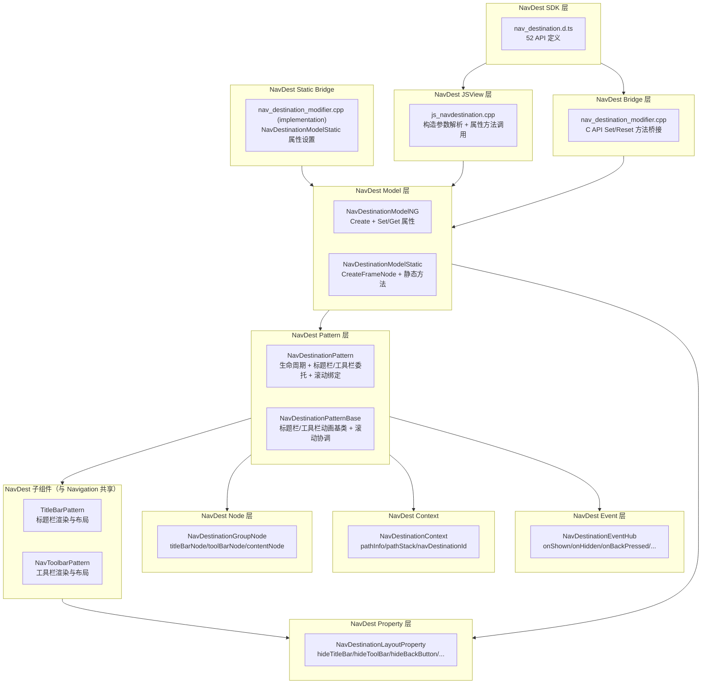

# 架构设计

> NavDestination 组件功能域的架构设计文档，补录已有实现。NavDestination 是 ArkUI 的导航目标页组件，作为 Navigation 的子页面容器，由 NavPathStack push/pop 管理生命周期，提供标题栏/工具栏配置、生命周期事件回调、模式（STANDARD/DIALOG）、安全区避让、转场动画、状态保存/恢复等 52+ 公开 API。

## 设计元数据

| 字段 | 内容 |
|------|------|
| Design ID | DESIGN-Func-05-02-03 |
| 关联需求 | 已有能力补录（无独立 requirement.md） |
| 关联 Epic | 无 |
| 目标 Feature | Feat-01 创建与布局模式, Feat-02 标题栏与工具栏配置, Feat-03 生命周期与事件回调, Feat-04 模式/安全区/转场动画/状态恢复 |
| 复杂度 | 复杂 |
| 目标版本 | API 8 起支持，核心 API 集中于 API 9-12，部分增量 API 至 API 26 |
| Owner | ArkUI SIG |
| 状态 | Baselined（已有实现补录） |

## 需求基线

| 字段 | 内容 |
|------|------|
| 问题陈述 | ArkUI 需要一个导航目标页容器组件，作为 Navigation 的子页面，支持 STANDARD/DIALOG 两种模式，提供标题栏/工具栏配置、丰富的生命周期事件回调、转场动画、安全区避让、状态保存/恢复等 |
| 核心目标 | 提供 NavDestination 组件，覆盖创建与布局模式、标题栏/工具栏配置、生命周期与事件回调、模式/安全区/转场动画/状态恢复等 4 个功能域 |
| P0 AC | Feat-01 ~ Feat-04 全量 AC |
| 补充说明 | NavDestination 与 Navigation 共享子组件（TitleBarPattern、NavToolbarPattern），但 NavDestinationPattern 委托管理；详见 [Navigation design.md](../01-navigation/design.md) |

## 上下文和现状

### 涉及仓和模块

| 仓库 | 模块路径 | 当前职责 | 本 Feature 影响 |
|------|----------|----------|-----------------|
| ace_engine | `frameworks/core/components_ng/pattern/navrouter/navdestination_pattern.cpp/.h` | NavDestinationPattern 主逻辑：生命周期管理、标题栏/工具栏委托、滚动绑定 | 全量涉及 |
| ace_engine | `frameworks/core/components_ng/pattern/navrouter/navdestination_model_ng.cpp/.h` | NavDestination NG Model 层：创建和属性设置 | Feat-01 |
| ace_engine | `frameworks/core/components_ng/pattern/navrouter/navdestination_model_static.cpp/.h` | NavDestination 静态 Model 层（ArkTS 静态版） | Feat-04 |
| ace_engine | `frameworks/core/components_ng/pattern/navrouter/navdestination_layout_property.h` | NavDestination 布局属性：hideTitleBar/hideToolBar/hideBackButton/ignoreLayoutSafeArea/fullScreenOverlay | Feat-01 |
| ace_engine | `frameworks/core/components_ng/pattern/navrouter/navdestination_layout_algorithm.cpp/.h` | NavDestination 布局算法 | Feat-01 |
| ace_engine | `frameworks/core/components_ng/pattern/navrouter/navdestination_event_hub.h` | NavDestination 事件回调：onShown/onHidden/onBackPressed/onWillAppear/onWillDisAppear/onActive/onInactive/onSaveState/onRestoreState | Feat-03 |
| ace_engine | `frameworks/core/components_ng/pattern/navrouter/navdestination_context.h` | NavDestinationContext 和 NavPathInfo：页面路径信息和上下文暴露 | Feat-01 |
| ace_engine | `frameworks/core/components_ng/pattern/navigation/navdestination_pattern_base.cpp/.h` | NavDestinationPatternBase：标题栏/工具栏动画和滚动协调基类 | Feat-01 |
| ace_engine | `frameworks/core/components_ng/pattern/navrouter/navdestination_group_node.h` | NavDestinationGroupNode：NavDestination 节点结构，持有 titleBar/toolBar/content 子节点 | Feat-01 |
| ace_engine | `frameworks/core/components_ng/pattern/navrouter/navdestination_scrollable_processor.h` | NavDestinationScrollableProcessor：滚动绑定处理器 | Feat-01 |
| ace_engine | `frameworks/bridge/declarative_frontend/jsview/js_navdestination.cpp/.h` | JS 桥接层，JSNavDestination 属性方法解析 | Feat-01 |
| ace_engine | `frameworks/core/interfaces/native/node/nav_destination_modifier.cpp/.h` | C API 桥接层，NavDestinationModifier 属性设置 | Feat-04 |
| ace_engine | `frameworks/core/interfaces/native/implementation/nav_destination_modifier.cpp` | C API 静态版桥接层，NavDestinationModelStatic 属性设置 | Feat-04 |
| ace_engine | `interface/sdk-js/api/@internal/component/ets/nav_destination.d.ts` | NavDestination 公开 API 类型定义（52 API） | Feat-01 |
| ace_engine | `interface/sdk-js/api/arkui/NavDestinationModifier.d.ts` | NavDestinationModifier 公开 API 类型定义 | Feat-04 |
| ace_engine | `interface/sdk-js/api/arkui/component/nav_destination.static.d.ets` | NavDestination 静态版 API 类型定义 | Feat-04 |
| ace_engine | `interface/sdk-js/api/arkui/NavDestinationModifier.static.d.ets` | NavDestinationModifier 静态版 API 类型定义 | Feat-04 |
| ace_engine | `test/unittest/core/pattern/navrouter/` | NavDestination 单元测试 | 全量涉及 |

### 调用链层级分析

| 层 | 模块 | 职责 | 修改类型 |
|----|------|------|----------|
| 1. SDK 层 | `interface/sdk-js/api/@internal/component/ets/nav_destination.d.ts` | NavDestination 52 个公开 API 类型定义 | 存量分析 |
| 2. JSView 层 | `frameworks/bridge/declarative_frontend/jsview/js_navdestination.cpp` | JSNavDestination 构造参数解析、属性方法调用、生命周期回调注册 | 存量分析 |
| 3. Bridge 层 | `frameworks/core/interfaces/native/node/nav_destination_modifier.cpp` | C API → NavDestinationModelNG 属性设置桥接 | 存量分析 |
| 4. Static Bridge 层 | `frameworks/core/interfaces/native/implementation/nav_destination_modifier.cpp` | C API → NavDestinationModelStatic 静态版属性设置桥接 | 存量分析 |
| 5. Model 层 | `frameworks/core/components_ng/pattern/navrouter/navdestination_model_ng.cpp/.h` | NavDestinationModelNG 创建和属性设置 | 存量分析 |
| 6. Static Model 层 | `frameworks/core/components_ng/pattern/navrouter/navdestination_model_static.cpp/.h` | NavDestinationModelStatic 全静态方法实现 | 存量分析 |
| 7. Pattern 层 | `frameworks/core/components_ng/pattern/navrouter/navdestination_pattern.cpp/.h` | NavDestinationPattern 生命周期、标题栏/工具栏委托、滚动绑定 | 存量分析 |
| 8. Pattern Base 层 | `frameworks/core/components_ng/pattern/navigation/navdestination_pattern_base.cpp/.h` | NavDestinationPatternBase 标题栏/工具栏动画和滚动协调基类 | 存量分析 |
| 9. Layout 层 | `frameworks/core/components_ng/pattern/navrouter/navdestination_layout_property.h` | NavDestinationLayoutProperty：hideTitleBar/hideToolBar/hideBackButton/ignoreLayoutSafeArea/fullScreenOverlay | 存量分析 |
| 10. Event 层 | `frameworks/core/components_ng/pattern/navrouter/navdestination_event_hub.h` | NavDestinationEventHub：onShown/onHidden/onBackPressed/onWillAppear/onWillDisAppear/onActive/onInactive/onSaveState/onRestoreState | 存量分析 |
| 11. Node 层 | `frameworks/core/components_ng/pattern/navrouter/navdestination_group_node.h` | NavDestinationGroupNode：titleBarNode/toolBarNode/contentNode 子节点管理 | 存量分析 |
| 12. Context 层 | `frameworks/core/components_ng/pattern/navrouter/navdestination_context.h` | NavDestinationContext：pathInfo/pathStack/navDestinationId/mode/getConfigInRouteMap | 存量分析 |
| 13. Scrollable 层 | `frameworks/core/components_ng/pattern/navrouter/navdestination_scrollable_processor.h` | NavDestinationScrollableProcessor：bindToScrollable/bindToNestedScrollable 处理 | 存量分析 |
| 14. 子组件 Pattern | `frameworks/core/components_ng/pattern/navigation/title_bar_pattern.cpp/.h` | TitleBarPattern：标题栏渲染与布局（与 Navigation NavBar 共享） | 存量分析 |
| 15. 子组件 Pattern | `frameworks/core/components_ng/pattern/navigation/tool_bar_pattern.cpp/.h` | NavToolbarPattern：工具栏渲染与布局（与 Navigation NavBar 共享） | 存量分析 |

### 适用架构规则

| Rule ID | 适用原因 | 设计结论 | 验证方式 |
|---------|----------|----------|----------|
| OH-ARCH-LAYERING | NavDestination 涉及 SDK → JSView → Bridge → Static Bridge → Model → Static Model → Pattern → Pattern Base → Layout → Event → Node → Context → Scrollable → 子组件 Pattern 共 15 层 | 单向调用，Property/Event 不反向依赖 Pattern | 代码评审 |
| OH-ARCH-API-LEVEL | 部分 API 在 API 9/10/11/12/14/15/16/17/19/22/26 有增强 | 各属性标注 @since 版本 | API 评审/XTS |
| OH-ARCH-COMPONENT-BUILD | NavDestination 未组件化，源码在 ace_core_ng_source_set 中 | 无独立 bridge/ 子目录，JSView 和 C API 双路径共存 | 构建验证 |
| OH-ARCH-PATTERN-MODEL | NavDestinationModelNG 作为属性设置统一入口，Pattern 持有核心逻辑 | Model 层不持有状态，Pattern 层管理生命周期和标题栏/工具栏委托 | 代码评审 |
| OH-ARCH-SHARED-SUB-COMPONENT | NavDestination 与 Navigation 共享 TitleBarPattern 和 NavToolbarPattern 子组件 | NavDestinationPattern 通过 MountTitleBar/MountToolBar 创建共享子节点，委托子组件处理标题栏和工具栏渲染 | 代码评审 |

## 不涉及项承接

| 维度 | 结论 |
|------|------|
| 性能 | 展开 — NavDestination 标题栏/工具栏动画由 BarTranslateState 协调，滚动绑定增加手势联动开销 |
| 安全与权限 | N/A — NavDestination 不涉及安全敏感操作 |
| 兼容性 | 展开 — DIALOG 模式 backgroundColor 默认透明，与 STANDARD 模式不同；生命周期回调在 API 版本间有增量差异 |
| IPC/跨进程 | N/A — NavDestination 为纯 UI 组件 |
| 构建与部件 | N/A — NavDestination 未组件化，源码在 ace_core_ng_source_set |
| API/SDK | 展开 — 52+ API 需与 SDK 定义交叉验证 |

## 关键设计决策

| 决策 ID | 问题 | 推荐方案 | 探索过的替代方案 | 取舍理由 | 影响 |
|---------|------|----------|------------------|----------|------|
| ADR-ND-F1-1 | NavDestination 创建方式 | 无参创建 + 带 builder 创建 + 带 builder + navPathInfo 创建三种方式 | 方案A：仅无参创建；方案B：仅带 builder 创建 | 三种创建方式覆盖从简单到带路径信息的渐进式需求，NavPathStack push 时传入 NavPathInfo 可关联参数 | NavDestinationModelNG::Create 需处理三种构造参数 |
| ADR-ND-F1-2 | NavDestinationMode 模式 | STANDARD 和 DIALOG 两种模式 | 方案A：仅 STANDARD 模式；方案B：增加 DIALOG 模式以对话框形式显示 | DIALOG 模式适合弹窗式导航场景，宽度受限，背景默认透明 | DIALOG 模式 backgroundColor 默认 TRANSPARENT，需文档化 |
| ADR-ND-F2-1 | NavDestination 标题栏/工具栏委托 | NavDestinationPattern 委托 TitleBarPattern/NavToolbarPattern 子组件处理标题栏和工具栏渲染与动画 | 方案A：NavDestinationPattern 内部实现标题栏/工具栏逻辑；方案B：委托独立子组件 Pattern | 委托子组件符合组件化原则，TitleBarPattern 和 NavToolbarPattern 同时服务 Navigation NavBar 和 NavDestination | NavDestinationPattern 通过 MountTitleBar/MountToolBar 创建子节点 |
| ADR-ND-F2-2 | 标题栏属性类型分流 | title 支持 string/CustomBuilder/NavDestinationCommonTitle/NavDestinationCustomTitle/Resource 五种类型 | 方案A：仅支持 string 字符串标题；方案B：统一使用 CustomBuilder | 五种类型覆盖从简单字符串到完全自定义构建的渐进式需求 | JSView 层需为每种 title 类型实现独立的解析和属性设置逻辑 |
| ADR-ND-F3-1 | NavDestination 生命周期事件丰富度 | NavDestination 支持 10+ 生命周期事件（onShown/onHidden/onWillAppear/onWillDisAppear/onWillShow/onWillHide/onActive/onInactive/onBackPressed/onReady）+ 状态保存/恢复（onSaveState/onRestoreState，API 26） | 方案A：仅支持 onShown/onHidden/onBackPressed 三种核心事件；方案B：完整生命周期链 | 完整生命周期链支持精细的页面状态管理，onWill* 系列回调允许开发者提前准备资源 | NavDestinationEventHub 存储并触发所有生命周期回调 |
| ADR-ND-F4-1 | NavDestination 双版 Model 分流 | NavDestinationModelNG（动态版，使用 ViewStackProcessor + 单例模式）和 NavDestinationModelStatic（静态版，全静态方法直接操作 FrameNode）双路径覆盖 | 方案A：仅 NavDestinationModelNG；方案B：双路径分流 | 静态版前端不使用 ViewStackProcessor，需全静态方法直接操作 FrameNode + ShallowBuilder 懒渲染 | NavDestinationModelStatic::CreateFrameNode 直接创建 FrameNode |
| ADR-ND-F4-2 | NavDestination 转场动画 | systemTransition（系统预定义类型）+ customTransition（自定义回调）双路径 | 方案A：仅系统预定义转场动画类型；方案B：仅自定义回调机制 | 双路径覆盖简单场景（系统预设）和复杂场景（开发者完全自定义），customTransition 提供最大灵活性 | NavDestinationPattern 需管理 TransitionDelegate 生命周期 |

## 设计骨架

### 骨架范围

| 骨架项 | 目标 | 不包含 | 验证方式 |
|--------|------|--------|----------|
| NavDestinationLayoutProperty | 存储 hideTitleBar/hideToolBar/hideBackButton/ignoreLayoutSafeArea/fullScreenOverlay/mode 等 | NavigationLayoutProperty 专属属性 | 代码审查 |
| NavDestinationGroupNode | titleBarNode/toolBarNode/contentNode 子节点管理 | Navigation FrameNode 结构 | 单元测试 |
| NavDestinationPattern | 生命周期管理、标题栏/工具栏委托、滚动绑定 | NavigationPattern 专属逻辑 | 单元测试 |
| NavDestinationModelNG | 创建和属性设置 API | 静态版 Model 实现 | 单元测试 |
| NavDestinationContext | pathInfo/pathStack/navDestinationId/mode 上下文暴露 | NavPathStack 栈操作 | 单元测试 |

### 骨架 Spec 拆分

| Task ID | 目标 | 受影响文件 | AC |
|---------|------|------------|-----|
| TASK-SKELETON-ND-1 | 创建与布局模式 | navdestination_layout_property.h, navdestination_model_ng.cpp, navdestination_pattern.cpp | Feat-01 AC |
| TASK-SKELETON-ND-2 | 标题栏与工具栏配置 | navdestination_pattern.cpp (title bar / toolbar 相关逻辑) | Feat-02 AC |
| TASK-SKELETON-ND-3 | 生命周期与事件回调 | navdestination_event_hub.h, navdestination_pattern.cpp | Feat-03 AC |
| TASK-SKELETON-ND-4 | 模式/安全区/转场动画/状态恢复 | navdestination_layout_property.h, nav_destination_modifier.cpp | Feat-04 AC |

## 后续 Task 拆分

| Spec | 目的 | 依赖 | 输出 |
|------|------|------|------|
| Feat-01-nav-destination-creation-layout-mode-spec.md | 固化创建与布局模式行为规格 | 本 Design | 完整行为规格与 AC |
| Feat-02-nav-destination-title-toolbar-spec.md | 固化标题栏与工具栏配置行为规格 | 本 Design | 完整行为规格与 AC |
| Feat-03-nav-destination-lifecycle-events-spec.md | 固化生命周期与事件回调行为规格 | 本 Design | 完整行为规格与 AC |
| Feat-04-nav-destination-mode-safe-area-transition-recovery-spec.md | 固化模式/安全区/转场动画/状态恢复行为规格 | 本 Design | 完整行为规格与 AC |

---

## API 签名、Kit 与权限

### 新增 API

> NavDestination 拥有 52+ 公开 API，此处按 Feat 域分类列出全部 API。

| API 签名 | 类型 | 功能描述 | 关联 Feat |
|----------|------|----------|----------|
| `NavDestination(): NavDestinationAttribute` | Public | 无参创建 NavDestination | Feat-01 |
| `NavDestination(builder: CustomBuilder, navPathInfo?: NavPathInfo): NavDestinationAttribute` | Public | 带内容构建器和路径信息创建 | Feat-01 |
| `mode(value: NavDestinationMode): NavDestinationAttribute` | Public | 设置 NavDestination 模式（STANDARD/DIALOG） | Feat-01 |
| `ignoreLayoutSafeArea(types?: Array<LayoutSafeAreaType>, edges?: Array<LayoutSafeAreaEdge>): NavDestinationAttribute` | Public | NavDestination 安全区扩展 | Feat-01 |
| `fullScreenOverlay(fullScreenOverlay: Optional<boolean>): NavDestinationAttribute` | Public | 分栏模式下全屏覆盖 | Feat-01 |
| `preferredOrientation(orientation: Optional<Orientation>): NavDestinationAttribute` | Public | NavDestination 页面方向 | Feat-01 |
| `enableStatusBar(enabled: Optional<boolean>, animated?: boolean): NavDestinationAttribute` | Public | NavDestination 状态栏显隐 | Feat-01 |
| `enableNavigationIndicator(enabled: Optional<boolean>): NavDestinationAttribute` | Public | NavDestination 导航指示器显隐 | Feat-01 |
| `bindToScrollable(scrollers: Array<Scroller>): NavDestinationAttribute` | Public | 绑定滚动容器 | Feat-01 |
| `bindToNestedScrollable(scrollInfos: Array<NestedScrollInfo>): NavDestinationAttribute` | Public | 绑定嵌套滚动容器 | Feat-01 |
| `title(value: string \| CustomBuilder \| NavDestinationCommonTitle \| NavDestinationCustomTitle \| Resource, options?: NavigationTitleOptions): NavDestinationAttribute` | Public | NavDestination 标题栏标题 | Feat-02 |
| `hideTitleBar(hide: boolean, animated?: boolean): NavDestinationAttribute` | Public | 隐藏/显示 NavDestination 标题栏 | Feat-02 |
| `hideBackButton(hide: Optional<boolean>): NavDestinationAttribute` | Public | 隐藏/显示 NavDestination 返回按钮 | Feat-02 |
| `backButtonIcon(value: ResourceStr \| PixelMap \| SymbolGlyphModifier, accessibilityText?: ResourceStr): NavDestinationAttribute` | Public | 设置返回按钮图标 | Feat-02 |
| `menus(value: Array<NavigationMenuItem> \| CustomBuilder, options?: NavigationMenuOptions): NavDestinationAttribute` | Public | NavDestination 标题栏菜单项 | Feat-02 |
| `toolbarConfiguration(toolbarParam: Array<ToolbarItem> \| CustomBuilder, options?: NavigationToolbarOptions): NavDestinationAttribute` | Public | NavDestination 工具栏菜单项 | Feat-02 |
| `hideToolBar(hide: boolean, animated?: boolean): NavDestinationAttribute` | Public | 隐藏/显示 NavDestination 工具栏 | Feat-02 |
| `onShown(callback: Callback<VisibilityChangeReason>): NavDestinationAttribute` | Public | NavDestination 页面显示回调 | Feat-03 |
| `onHidden(callback: Callback<VisibilityChangeReason>): NavDestinationAttribute` | Public | NavDestination 页面隐藏回调 | Feat-03 |
| `onBackPressed(callback: () => boolean): NavDestinationAttribute` | Public | NavDestination 返回按钮拦截回调 | Feat-03 |
| `onResult(callback: Optional<Callback<ESObject>>): NavDestinationAttribute` | Public | NavDestination pop 结果回调 | Feat-03 |
| `onReady(callback: Callback<NavDestinationContext>): NavDestinationAttribute` | Public | NavDestination 就绪回调 | Feat-03 |
| `onWillAppear(callback: Callback<void>): NavDestinationAttribute` | Public | NavDestination 即将出现回调 | Feat-03 |
| `onWillDisappear(callback: Callback<void>): NavDestinationAttribute` | Public | NavDestination 即将消失回调 | Feat-03 |
| `onWillShow(callback: Callback<void>): NavDestinationAttribute` | Public | NavDestination 即将显示回调 | Feat-03 |
| `onWillHide(callback: Callback<void>): NavDestinationAttribute` | Public | NavDestination 即将隐藏回调 | Feat-03 |
| `onActive(callback: Optional<Callback<NavDestinationActiveReason>>): NavDestinationAttribute` | Public | NavDestination 激活回调 | Feat-03 |
| `onInactive(callback: Optional<Callback<NavDestinationActiveReason>>): NavDestinationAttribute` | Public | NavDestination 非激活回调 | Feat-03 |
| `onSaveState(callback: Optional<SaveStateCallback>): NavDestinationAttribute` | Public | NavDestination 状态保存回调 | Feat-03 |
| `onRestoreState(callback: Optional<RestoreStateCallback>): NavDestinationAttribute` | Public | NavDestination 状态恢复回调 | Feat-03 |
| `onNewParam(callback: Optional<Callback<ESObject>>): NavDestinationAttribute` | Public | NavDestination 参数更新回调 | Feat-03 |
| `systemBarStyle(style: Optional<SystemBarStyle>): NavDestinationAttribute` | Public | NavDestination 系统栏样式 | Feat-04 |
| `recoverable(recoverable: Optional<boolean>): NavDestinationAttribute` | Public | NavDestination 应用终止恢复 | Feat-04 |
| `systemTransition(type: NavigationSystemTransitionType): NavDestinationAttribute` | Public | NavDestination 系统转场动画类型 | Feat-04 |
| `customTransition(delegate: NavDestinationTransitionDelegate): NavDestinationAttribute` | Public | NavDestination 自定义转场动画 | Feat-04 |
| `NavDestinationModifier` | Public | NavDestination 属性修改器（C API 桥接） | Feat-04 |
| `NavDestinationContext` | Public | NavDestination 上下文对象（pathInfo/pathStack/navDestinationId/mode/getConfigInRouteMap） | Feat-04 |

### 变更/废弃 API

| 原有 API | 变更类型 | 新 API | 迁移说明 |
|----------|----------|--------|----------|
| — | — | — | 无变更/废弃 API（补录） |

## 构建系统影响

### BUILD.gn 变更

```
无变更。NavDestination 组件实现位于 ace_core_ng_source_set，已有构建配置覆盖。
```

### bundle.json 变更

无变更。

## 可选设计扩展

### 架构图



### 数据模型设计

**ArkTS (API 层类型)**

```typescript
interface NavDestinationInterface {
  (): NavDestinationAttribute;
  (builder: CustomBuilder, navPathInfo?: NavPathInfo): NavDestinationAttribute;
}

interface NavDestinationAttribute extends CommonMethod<NavDestinationAttribute> {
  title(value: string | CustomBuilder | NavDestinationCommonTitle | NavDestinationCustomTitle | Resource, options?: NavigationTitleOptions): NavDestinationAttribute;
  hideTitleBar(hide: boolean, animated?: boolean): NavDestinationAttribute;
  hideBackButton(hide: Optional<boolean>): NavDestinationAttribute;
  backButtonIcon(value: ResourceStr | PixelMap | SymbolGlyphModifier, accessibilityText?: ResourceStr): NavDestinationAttribute;
  menus(value: Array<NavigationMenuItem> | CustomBuilder, options?: NavigationMenuOptions): NavDestinationAttribute;
  toolbarConfiguration(toolbarParam: Array<ToolbarItem> | CustomBuilder, options?: NavigationToolbarOptions): NavDestinationAttribute;
  hideToolBar(hide: boolean, animated?: boolean): NavDestinationAttribute;
  mode(value: NavDestinationMode): NavDestinationAttribute;
  ignoreLayoutSafeArea(types?: Array<LayoutSafeAreaType>, edges?: Array<LayoutSafeAreaEdge>): NavDestinationAttribute;
  systemBarStyle(style: Optional<SystemBarStyle>): NavDestinationAttribute;
  recoverable(recoverable: Optional<boolean>): NavDestinationAttribute;
  systemTransition(type: NavigationSystemTransitionType): NavDestinationAttribute;
  customTransition(delegate: NavDestinationTransitionDelegate): NavDestinationAttribute;
  fullScreenOverlay(fullScreenOverlay: Optional<boolean>): NavDestinationAttribute;
  preferredOrientation(orientation: Optional<Orientation>): NavDestinationAttribute;
  enableStatusBar(enabled: Optional<boolean>, animated?: boolean): NavDestinationAttribute;
  enableNavigationIndicator(enabled: Optional<boolean>): NavDestinationAttribute;
  onShown(callback: Callback<VisibilityChangeReason>): NavDestinationAttribute;
  onHidden(callback: Callback<VisibilityChangeReason>): NavDestinationAttribute;
  onBackPressed(callback: () => boolean): NavDestinationAttribute;
  onResult(callback: Optional<Callback<ESObject>>): NavDestinationAttribute;
  onReady(callback: Callback<NavDestinationContext>): NavDestinationAttribute;
  onWillAppear(callback: Callback<void>): NavDestinationAttribute;
  onWillDisappear(callback: Callback<void>): NavDestinationAttribute;
  onWillShow(callback: Callback<void>): NavDestinationAttribute;
  onWillHide(callback: Callback<void>): NavDestinationAttribute;
  onActive(callback: Optional<Callback<NavDestinationActiveReason>>): NavDestinationAttribute;
  onInactive(callback: Optional<Callback<NavDestinationActiveReason>>): NavDestinationAttribute;
  onSaveState(callback: Optional<SaveStateCallback>): NavDestinationAttribute;
  onRestoreState(callback: Optional<RestoreStateCallback>): NavDestinationAttribute;
  onNewParam(callback: Optional<Callback<ESObject>>): NavDestinationAttribute;
  bindToScrollable(scrollers: Array<Scroller>): NavDestinationAttribute;
  bindToNestedScrollable(scrollInfos: Array<NestedScrollInfo>): NavDestinationAttribute;
}

enum NavDestinationMode {
  STANDARD = 0,
  DIALOG = 1
}

interface NavDestinationCommonTitle {
  main: string | Resource;
  sub: string | Resource;
}

interface NavDestinationCustomTitle {
  builder: CustomBuilder;
  height: TitleHeight | Length;
}

interface NavDestinationContext {
  pathInfo: NavPathInfo;
  pathStack: NavPathStack;
  navDestinationId?: string;
  mode?: NavDestinationMode;
  getConfigInRouteMap(): Record<string, Object>;
}
```

**C++ (框架层结构)**

```cpp
// NavDestinationLayoutProperty
struct NavDestinationLayoutProperty : NavDestinationLayoutPropertyBase {
  ACE_DEFINE_PROPERTY_GROUP_NO_DEFAULT(HideTitleBar, bool, PROPERTY_UPDATE_MEASURE)
  ACE_DEFINE_PROPERTY_GROUP_NO_DEFAULT(HideToolBar, bool, PROPERTY_UPDATE_MEASURE)
  ACE_DEFINE_PROPERTY_GROUP_NO_DEFAULT(HideBackButton, bool, PROPERTY_UPDATE_MEASURE)
  ACE_DEFINE_PROPERTY_GROUP_NO_DEFAULT(IgnoreLayoutSafeArea, IgnoreLayoutSafeAreaOpts, PROPERTY_UPDATE_MEASURE)
  ACE_DEFINE_PROPERTY_GROUP_NO_DEFAULT(FullScreenOverlay, bool, PROPERTY_UPDATE_MEASURE)
  ACE_DEFINE_PROPERTY_GROUP_NO_DEFAULT(NoPixMap, bool, PROPERTY_UPDATE_MEASURE)
  ACE_DEFINE_PROPERTY_GROUP_NO_DEFAULT(ImageSource, ImageSourceInfo, PROPERTY_UPDATE_MEASURE)
  ACE_DEFINE_PROPERTY_GROUP_NO_DEFAULT(PixelMap, RefPtr<PixelMap>, PROPERTY_UPDATE_MEASURE)
};

// NavDestinationContext
struct NavDestinationContext : AceType {
  int32_t index_ = -1;
  uint64_t navDestinationId_ = 0;
  NavDestinationMode mode_;
  RefPtr<NavPathInfo> pathInfo_;
  WeakPtr<NavigationStack> navigationStack_;
  WeakPtr<NavDestinationPattern> navDestinationPattern_;
};
```

### 线程与并发模型

| 操作 | 发起线程 | 回调线程 | 说明 |
|------|----------|----------|------|
| 属性设置 (Set*) | UI | UI | 直接写入 Property |
| NavDestination 生命周期回调触发 | UI | UI | Pattern 状态变化时触发 EventHub |
| NavDestination 安全区避让计算 | UI | UI | IAvoidInfoListener + CustomSafeAreaExpander |
| NavDestination 标题栏/工具栏动画 | UI → Render | UI → Render | BarTranslateState 协调 translate+opacity |

## 详细设计

### 创建与布局模式

NavDestination 创建入口：`NavDestinationModelNG::Create()` 创建 NavDestinationGroupNode（tag=V2::NAVDESTINATION_ETS_TAG），包含 titleBarNode、contentNode、toolBarNode 三个子节点。NavDestination 支持 STANDARD 和 DIALOG 两种模式。

**NavDestination 创建方式：**
- 无参创建：`NavDestination()` 创建空 NavDestination，后续通过 builder 设置内容
- 带 builder 创建：`NavDestination(builder: CustomBuilder)` 创建带内容的 NavDestination
- 带 builder + navPathInfo 创建：`NavDestination(builder: CustomBuilder, navPathInfo: NavPathInfo)` 创建带内容和路径信息的 NavDestination

**NavDestinationMode 行为差异：**
- **STANDARD 模式**（默认）：NavDestination 在 Navigation Content 区域正常显示，全屏宽度
- **DIALOG 模式**：NavDestination 以对话框形式显示，宽度受限，背景色默认透明（除非开发者显式设置 backgroundColor）

**NavDestination 安全区避让**：`ignoreLayoutSafeArea` 控制 NavDestination 是否避让系统安全区（状态栏/导航栏）。API >= VERSION_ELEVEN 自动避让 SAFE_AREA_TYPE_SYSTEM | SAFE_AREA_TYPE_CUTOUT, SAFE_AREA_EDGE_ALL。

**滚动绑定**：`bindToScrollable` 和 `bindToNestedScrollable` 将 NavDestination 与内部可滚动组件绑定，实现标题栏/工具栏的滑动手势联动隐藏。

**NavDestinationContext**：通过 `onReady` 回调暴露 NavDestinationContext 对象，包含 pathInfo（路径信息）、pathStack（路由栈引用）、navDestinationId（唯一 ID）、mode（当前模式）、getConfigInRouteMap（获取路由映射配置）。

**系统控制属性：**
- preferredOrientation（API 19）：设置页面显示方向
- enableStatusBar（API 19）：控制状态栏显隐，支持动画过渡
- enableNavigationIndicator（API 19）：控制导航指示器显隐
- fullScreenOverlay（API 26）：分栏模式下 NavDestination 是否全屏覆盖（overlay 模式下 content 和 overlay 容器重排序）

### 标题栏与工具栏配置

NavDestination 的标题栏和工具栏配置与 Navigation 的 NavBar 配置共享子组件（TitleBarPattern、NavToolbarPattern），但通过 NavDestinationPattern 委托管理。

**title 类型分流（与 Navigation NavBar 类似）：**
- string/Resource：直接设置字符串标题
- CustomBuilder：设置自定义构建标题
- NavDestinationCommonTitle：设置结构化标题（main + sub）
- NavDestinationCustomTitle：设置自定义构建标题（builder + height）

**hideTitleBar 动画参数（API 13 新增）**：animated=true 时标题栏隐藏/显示播放过渡动画。NavDestinationPattern 通过 BarTranslateState（TRANSLATE_ZERO/TRANSLATE_HEIGHT）协调标题栏的 translate 和 opacity 动画。

**返回按钮可见性约束**：
- hideBackButton=true 时强制隐藏
- hideTitleBar=true 且 BarTranslateState=NONE 时，返回按钮随标题栏一起隐藏
- SPLIT 模式下栈顶 index==0 时返回按钮隐藏
- NavBar 被隐藏时 NavDestination 返回按钮也隐藏

**menus 类型分流**：
- Array<NavigationMenuItem>：按列表显示菜单项
- CustomBuilder：自定义构建菜单内容
- API 19 新增 NavigationMenuOptions 配置更多按钮选项

**toolbarConfiguration 类型分流**：
- Array<ToolbarItem>：按列表显示工具栏项
- CustomBuilder：自定义构建工具栏内容

**hideToolBar 动画参数（API 13 新增）**：与 hideTitleBar 动画机制一致。

### 生命周期与事件回调

NavDestinationEventHub 存储并触发所有生命周期回调，NavDestinationState 枚举定义状态（NONE=-1, ON_SHOWN=0, ON_HIDDEN=1, ON_APPEAR=2, ON_DISAPPEAR=3, ON_WILL_SHOW=4, ON_WILL_HIDE=5, ON_WILL_APPEAR=6, ON_WILL_DISAPPEAR=7, ON_ACTIVE=8, ON_INACTIVE=9, ON_BACKPRESS=100）。

**核心生命周期事件链：**
1. onWillAppear → NavDestination 即将出现（转场动画开始前）
2. onWillShow → NavDestination 即将显示（转场动画播放时）
3. onShown → NavDestination 已显示（转场动画完成后），回调参数 VisibilityChangeReason（TRANSITION=0, CONTENT_COVER=1, APP_STATE=2）
4. onWillHide → NavDestination 即将隐藏
5. onWillDisappear → NavDestination 即将消失
6. onHidden → NavDestination 已隐藏，回调参数 VisibilityChangeReason

**激活/非激活事件（API 17 新增）**：
- onActive：NavDestination 成为活跃页面，回调参数 NavDestinationActiveReason（TRANSITION=0, CONTENT_COVER=1, SHEET=2, DIALOG=3, OVERLAY=4, APP_STATE=5）
- onInactive：NavDestination 成为非活跃页面

**其他事件：**
- onBackPressed：返回按钮拦截，返回 true 表示拦截（不执行默认 pop），返回 false 表示不拦截
- onResult：pop 结果回调（API 15 新增），携带 PopInfo 参数
- onReady：NavDestinationContext 就绪回调（API 11 新增）
- onNewParam：singleton 模式下参数更新回调（API 19 新增）

**状态保存/恢复（API 26 新增）：**
- onSaveState：开发者自定义状态保存回调，返回 Record<string, Object> | null
- onRestoreState：开发者自定义状态恢复回调，参数为 Record<string, Object> | null

### 模式/安全区/转场动画/状态恢复

**systemBarStyle**：NavDestination 级别系统栏样式配置，影响状态栏颜色/样式。NavDestinationPattern 持有 backupStyle_ 和 currStyle_ 管理 SystemBarStyle 的设置和恢复。

**recoverable**（API 14 新增）：应用终止后 NavDestination 状态是否可恢复。与 Navigation 的 recoverable 联动。

**转场动画**：
- **systemTransition**（API 14 新增）：设置系统预定义转场动画类型（NavigationSystemTransitionType：DEFAULT/NONE/TITLE/CONTENT/FADE/EXPLODE/SLIDE_RIGHT/SLIDE_BOTTOM）
- **customTransition**（API 15 新增）：设置自定义转场动画，NavDestinationTransitionDelegate 回调返回 NavDestinationTransition 对象（包含 onTransitionEnd/duration/curve/delay/event）

**C API 桥接（NavDestinationModifier）**：
- NavDestinationModifier 通过 C API 桥接层将属性写入 NavDestinationLayoutProperty
- 支持动态版（nav_destination_modifier.cpp → NavDestinationModelNG）和静态版（implementation/nav_destination_modifier.cpp → NavDestinationModelStatic）
- 静态版使用 ShallowBuilder + CallbackHelper 实现懒渲染和异步 builder dispatch

## 风险和开放问题

| 项 | 类型 | 影响 | 处理方式 | Owner |
|----|------|------|----------|-------|
| NavDestination 未组件化 | 架构 | 中 | JSView 和 C API 双路径共存，需分别维护，待组件化改造时统一 | ArkUI SIG |
| NavDestination DIALOG 模式背景色默认透明 | 兼容性 | 中 | DIALOG 模式 backgroundColor 默认为 TRANSPARENT，与 STANDARD 模式不同，需明确文档化 | ArkUI SIG |
| NavDestination 生命周期回调线程安全 | 架构 | 低 | OnAttachToMainTreeMultiThread/OnDetachFromMainTreeMultiThread 提供多线程安全路径 | ArkUI SIG |
| NavDestination 双版 Model 分流 | 可维护性 | 中 | NavDestinationModelNG 和 NavDestinationModelStatic 双路径需分别维护 | ArkUI SIG |
| fullScreenOverlay 重排序 | 兼容性 | 低 | fullScreenOverlay=true 时 NavDestination 在 content 和 overlay 容器间重排序，触发 Navigation 重计算 | ArkUI SIG |
| NavDestinationContext getConfigInRouteMap 版本差异 | API | 低 | getConfigInRouteMap 从 API 12 起支持，API 12 之前 NavDestinationContext 不包含此方法 | ArkUI SIG |
| TitleBarPattern/NavToolbarPattern 与 Navigation 共享 | 架构 | 中 | 子组件同时服务 Navigation NavBar 和 NavDestination，修改需考虑双端影响 | ArkUI SIG |

## 设计审批

- [x] 需求基线已确认，设计覆盖 P0/P1 AC
- [x] 不涉及项已承接，N/A 和展开项都有结论
- [x] 涉及仓和模块职责清楚
- [x] 适用架构规则已识别并形成设计结论
- [x] 分层和子系统边界合规
- [x] API 变更有签名、权限、错误码和兼容性说明
- [x] BUILD.gn/bundle.json 影响明确
- [x] 设计输出和后续 Task 拆分明确
- [x] 关键设计决策有理由和影响说明
- [x] 风险和开放问题有 Owner
