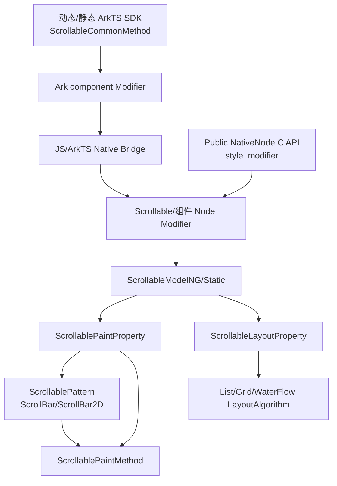
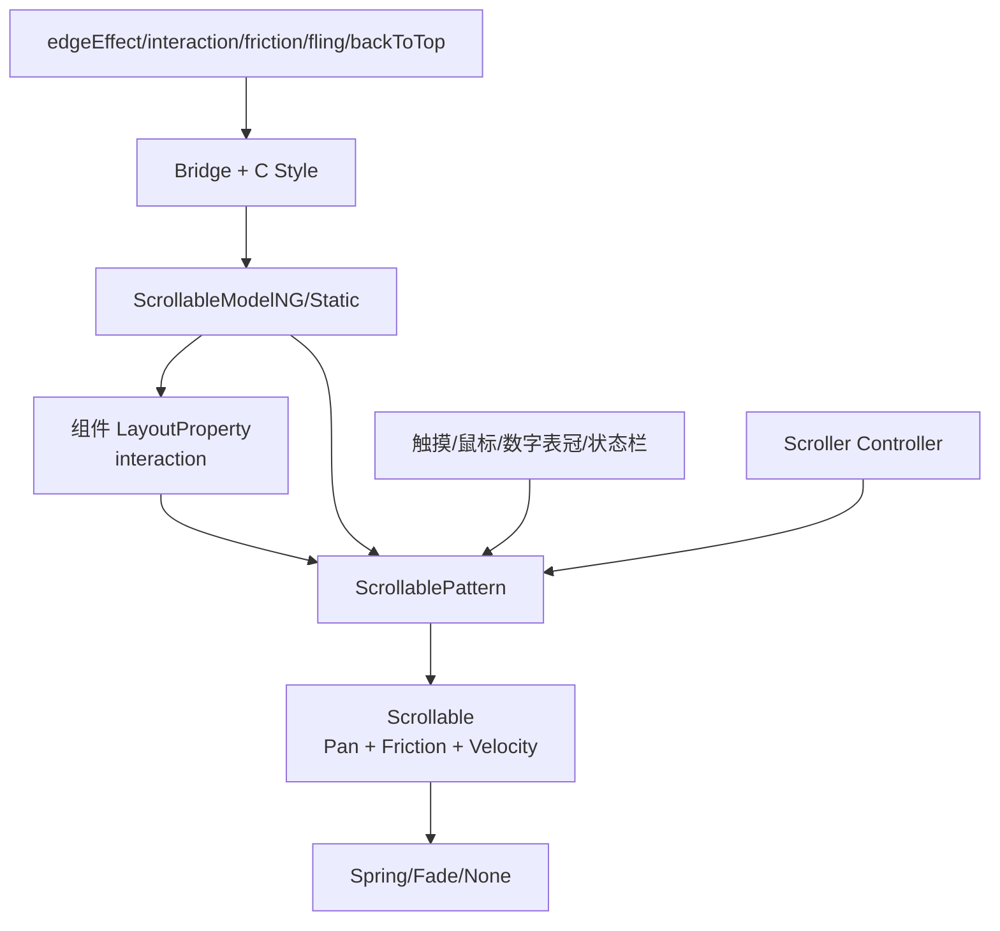
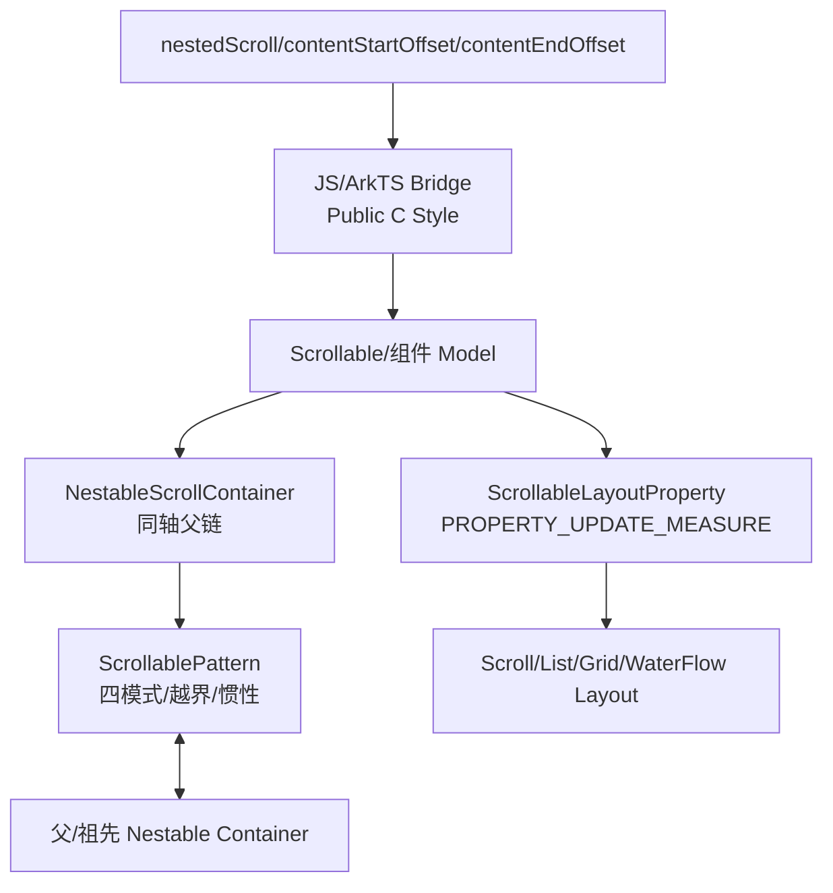
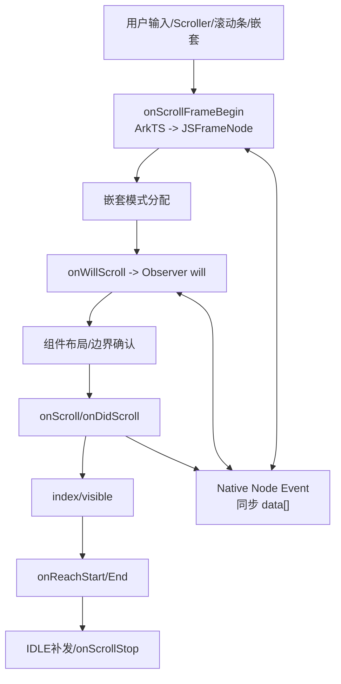
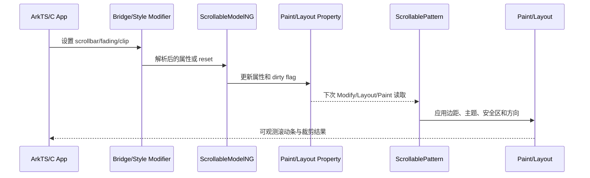
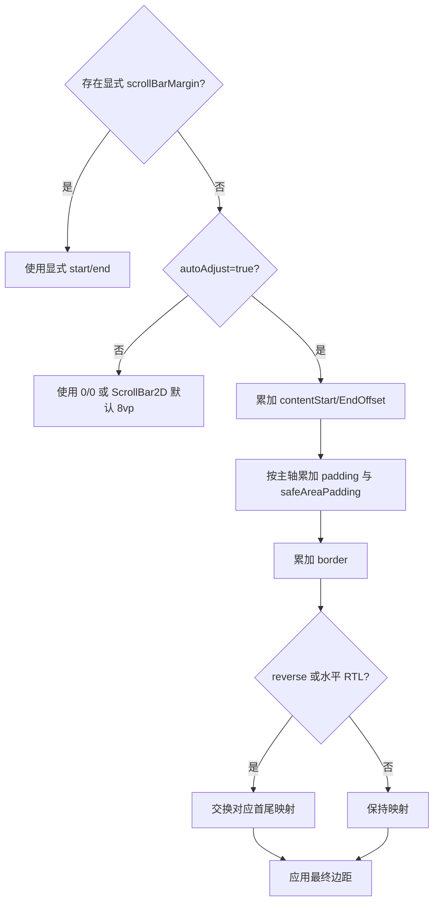
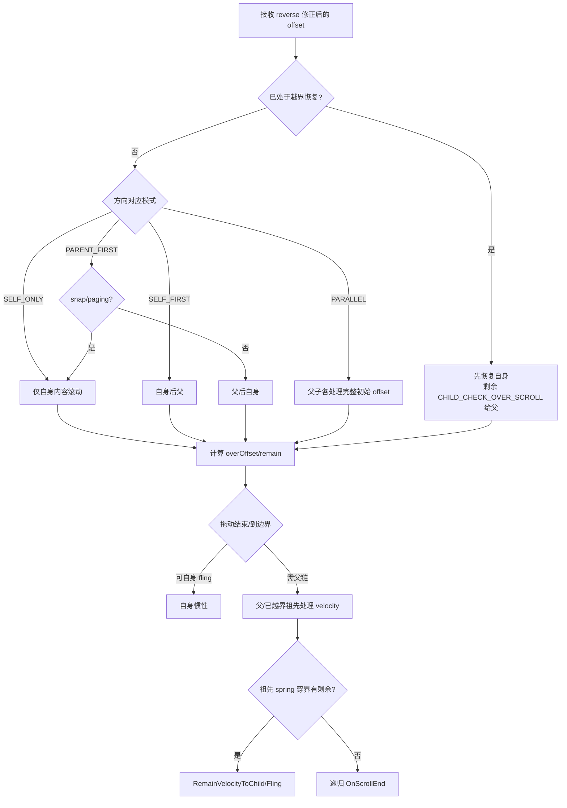
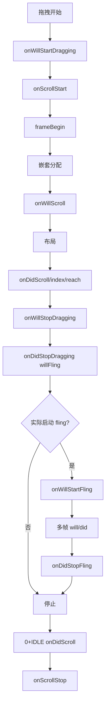
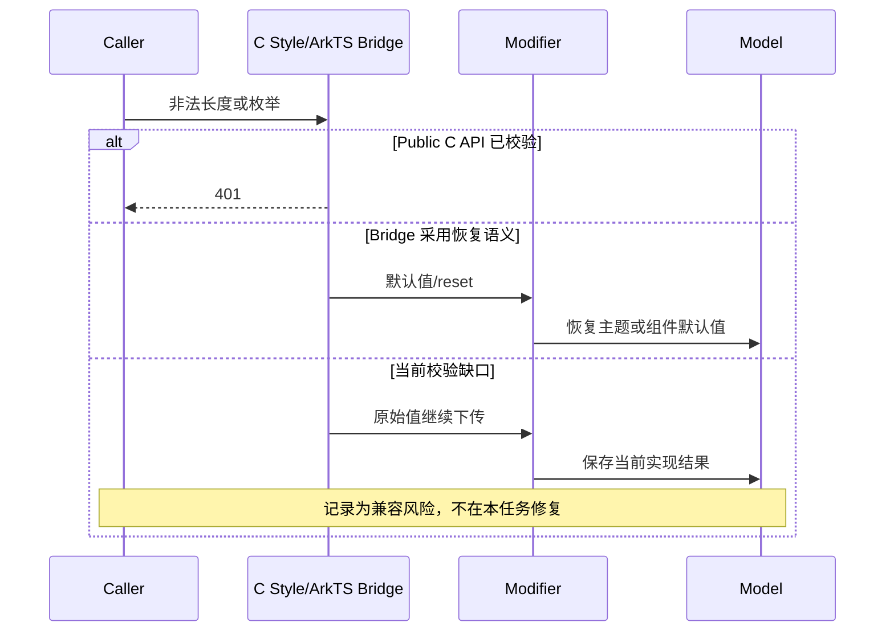

# 架构设计

> 确认滚动公共能力的架构约束、关键设计决策、Spec 拆分方向。

## 设计元数据

| 字段 | 内容 |
|---|---|
| Design ID | DESIGN-Func-05-03-01 |
| 关联需求 | 已有能力补录（无独立 requirement.md） |
| 关联 Epic | 滚动公共能力长期规格补录 |
| 目标 Feature | Feat-01 滚动条与内容视效, Feat-02 滚动交互与物理效果, Feat-03 嵌套滚动与内容边界, Feat-04 滚动事件生命周期 |
| 复杂度 | 复杂 |
| 目标版本 | API 7-26 |
| Owner | ArkUI SIG |
| 状态 | Baselined（已有实现补录） |

## 需求基线

> 本功能域为当前实现的长期规格补录，以下仅列出直接约束设计的基线。

| 项 | 补充说明（如需） |
|---|---|
| 实现即规格 | 以 SDK 公共契约和 ace_engine 当前实现为依据；发现偏差时记录风险，不在文档任务中修改实现 |
| 公共能力边界 | 公共实现主要服务 List、Grid、Scroll、WaterFlow；组件特有行为仍由各组件规格承接 |
| 多范式契约 | 动态 ArkTS、静态 ArkTS、generated Modifier 与 Public NativeNode C API 分别核验 |
| 版本兼容 | 使用方法级 `@since` 记录 API 11-26 演进，不以类级版本覆盖方法版本 |
| 后续扩展 | 本设计由四个 Feat 共享，后续 Feat 内容按既有章节增量合并 |
| 交互物理（Feat-02） | 补录边缘效果、手势开关、摩擦与惯性限速、多输入设备和状态栏回顶的现有行为 |
| 嵌套与边界（Feat-03） | 补录四种嵌套模式、父子位移/惯性/越界生命周期，以及内容起止边界的版本和组件差异 |
| 事件生命周期（Feat-04） | 补录帧前拦截、布局后通知、起止/拖拽/惯性/Reach 事件顺序和 Native 支持矩阵 |

## 上下文和现状

### 涉及仓和模块

| 仓库 | 补充架构说明 |
|---|---|
| `interface_sdk-js` | 定义动态与静态 `ScrollableCommonMethod` 公共契约、枚举和单位类型 |
| `arkui_ace_engine/frameworks/bridge` | 动态 JS/ArkTS 参数解析和 Native Module 桥接 |
| `arkui_ace_engine/frameworks/core/interfaces` | generated Modifier、Node Modifier 与公共属性访问接口 |
| `arkui_ace_engine/frameworks/core/components_ng/pattern/scrollable` | 公共 Model、Pattern、Paint/Layout Property、滚动条和内容视效实现 |
| `arkui_ace_engine/frameworks/core/components_ng/pattern/{list,grid,scroll,waterflow}` | 组件默认值、布局算法、虚拟化范围和特有覆盖逻辑 |
| `arkui_ace_engine/interfaces/native` | Public NativeNode C API 属性、枚举、错误码和 style 分派 |
| `arkui_ace_engine/test/unittest` | Host NG 与 C API 行为验证 |
| `arkui_ace_engine/frameworks/core/components_ng/pattern/scrollable/scrollable.*` | （Feat-02）手势事件、摩擦、速度缩放、惯性动画和数字表冠运行时 |
| `arkui_ace_engine/frameworks/core/components_ng/pattern/scrollable/nestable_scroll_container.*` | （Feat-03）搜索同轴父容器、保存父链、处理 Refresh 接入和模式切换中断 |
| `arkui_ace_engine/frameworks/core/components_ng/pattern/{scroll,list,grid,waterflow}` 布局算法 | （Feat-03）消费内容起止偏移并处理主轴、RTL、reverse、snap 和算法差异 |
| `arkui_ace_engine/frameworks/core/components_ng/pattern/scrollable/scrollable_event_hub.h` | （Feat-04）保存公共帧级、起止、Reach、拖拽和惯性事件回调 |
| `arkui_ace_engine/interfaces/native/node` 事件注册与转换 | （Feat-04）将公共 Native 事件按组件映射至 handler，并同步传递可改写返回值 |

### 调用链层级分析

| 层 | 模块 | 职责 | 修改类型 |
|---|---|---|---|
| 1. SDK 声明层 | `interface_sdk-js/api/@internal/component/ets/common.d.ts`、`arkui/component/common.static.d.ets` | 定义 Public ArkTS 签名、版本、默认值和类型 | 文档核验，无源码修改 |
| 2. 前端 Modifier 层 | `frameworks/bridge/declarative_frontend/ark_component` | 生成属性差异并调用 Native Module | 文档核验，无源码修改 |
| 3. Bridge 层 | `arkts_native_scrollable_bridge.cpp`、`js_scrollable_base.cpp` | 解析颜色、长度、枚举、Resource 和 undefined | 文档核验，记录桥接差异 |
| 4. Native Modifier 层 | `frameworks/core/interfaces/native/node/scrollable_modifier.cpp` | 将桥接参数映射至 `ScrollableModelNG` | 文档核验，记录非法值风险 |
| 5. Public C style 层 | `interfaces/native/node/style_modifier.cpp` | 校验 `ArkUI_AttributeItem` 并按组件或公共 Modifier 分派 | 文档核验，记录错误码和支持矩阵 |
| 6. Model 层 | `scrollable_model_ng.cpp`、`scrollable_model_static.cpp` | 更新、读取和重置公共属性 | 文档核验 |
| 7. Property 层 | `scrollable_paint_property.h`、`scrollable_layout_property.h` | 保存滚动条、渐隐和裁剪状态，产生 dirty flag | 文档核验 |
| 8. Pattern/滚动条层 | `scrollable_pattern.cpp`、`scroll/inner/scroll_bar*.cpp` | 创建滚动条、计算自动边距、处理主题与二维滚动 | 文档核验 |
| 8A. 交互与物理层 | `scrollable.cpp`、`scrollable_pattern.cpp` | （Feat-02）处理 Pan、edge effect、friction、速度增益/限速、鼠标和表冠输入 | 文档核验，记录设备/API/通道差异 |
| 8B. 嵌套协调层 | `nestable_scroll_container.cpp`、`scrollable_pattern.cpp` | （Feat-03）建立同轴父链，按四模式分配 offset/remain，传播 velocity 与 start/end | 文档核验，记录 reverse、Refresh、snap/paging 和越界预处理 |
| 9. Paint 层 | `scrollable_paint_method.cpp`、组件 PaintMethod | 应用渐隐和内容裁剪 | 文档核验 |
| 10. Layout 算法层 | List/Grid/WaterFlow 布局算法 | 根据 clip 和 safe-area 扩展测量、缓存与可见范围 | 文档核验 |
| 10A. 内容边界层 | Scroll/List/Grid/WaterFlow `CalcContentOffset` | （Feat-03）将 vp 转 px、截断负值、执行两端和阈值及方向映射 | 文档核验，记录 Getter/布局值差异 |
| 10B. 事件提交层 | 四组件 Pattern `OnDirtyLayoutWrapperSwap`/事件批次 | （Feat-04）布局后按 did、index/visible、reach、stop 顺序触发 | 文档核验，记录组件 Reach 差异 |
| 11A. Native 事件层 | `event_converter.cpp`、`node_model.cpp`、各组件 Modifier | （Feat-04）注册/注销、类型转换、同步 data[] 返回和错误码 | 文档核验，记录 handler 缺失与 PX 差异 |
| 11. 测试层 | Host NG、generated Modifier、NativeNode C API 测试 | 验证默认值、边界、重置和组件差异 | 补录验证映射，不新增测试代码 |

### 适用架构规则

| Rule ID | 适用原因 | 设计结论 | 验证方式 |
|---|---|---|---|
| OH-ARCH-LAYERING | 属性跨 SDK、Bridge、Model、Property、Pattern、Paint/Layout | 保持单向调用；组件差异通过 override 或具体 Modifier 承接 | 调用链审查 |
| OH-ARCH-SUBSYSTEM | SDK 声明位于 interface_sdk-js，运行时位于 ace_engine | 不新增跨子系统依赖，仅核验既有契约 | 仓库差异审查 |
| OH-ARCH-IPC-SAF | 不涉及 IPC/SA | 无 IPC 或 SAF 设计 | 源码审查 |
| OH-ARCH-API-LEVEL | 涉及 API 11-26 Public ArkTS/C API | 采用方法级版本矩阵并记录范式差异 | SDK/API 审查 |
| OH-ARCH-COMPONENT-BUILD | 无实现或依赖变更 | BUILD.gn、bundle.json 均不变 | 生成与仓库 diff 检查 |
| OH-ARCH-ERROR-LOG | C API 返回 0/401/106102，ArkTS 多采用恢复语义 | 按调用通道分别规定非法输入 | C API/Host 单测 |

## 不涉及项承接

| 维度 | 设计结论 |
|---|---|
| 产品源码修改 | 不涉及；本任务只补录长期规格和设计文档 |
| 公共 API/ABI 变更 | 不涉及；仅记录现有签名、版本和偏差 |
| 新增依赖 | 不涉及 BUILD.gn、bundle.json 或跨部件依赖 |
| 持久化与数据迁移 | 不涉及；属性随 FrameNode 生命周期存在 |
| IPC、权限与隐私 | 不涉及 IPC、系统权限或用户数据 |
| 设备侧测试 | 不作为主要证据；优先使用 Linux x86_64 Host 测试和源码证据 |

## 关键设计决策

| 决策 ID | 问题 | 推荐方案 | 探索过的替代方案 | 取舍理由 | 影响 |
|---|---|---|---|---|---|
| ADR-1 | 动态与静态 API 的版本和 undefined 能力不一致 | 分范式列出签名、版本和 reset 语义 | 合并为一个最大签名；只写动态 API | 合并会虚构低版本或动态接口不存在的能力 | API 表、兼容性、AC |
| ADR-2 | 不同组件的默认 mode 和 clip 不同 | 使用组件/API 版本矩阵 | 统一采用 SDK 概述默认值；统一采用基类默认值 | 具体 Pattern/PaintProperty override 是可观测行为 | 默认值 AC、恢复规则 |
| ADR-3 | `clipContent` 同时影响绘制和布局 | 将其定义为 Paint+Layout 双通路能力 | 仅作为渲染裁剪；仅描述枚举语义 | List/Grid/WaterFlow 会重测量并改变虚拟化范围 | 架构图、布局验证 |
| ADR-4 | SAFE_AREA 的输入来自何处 | 枚举祖先、系统安全区和后置布局阶段 | 仅使用当前节点 safeAreaPadding；只验证像素裁剪 | 当前实现使用累积系统安全区并触发后续布局 | 外部输入、时序、风险 |
| ADR-5 | 显式 margin 与自动避让的优先级 | 显式属性存在即覆盖自动值，包括 0/0 | 自动值与显式值相加；非零显式值才覆盖 | ScrollBar 通过 optional 属性判断是否显式设置 | 边界 AC、RTL/reverse |
| ADR-6 | Scroll Axis::FREE 是否沿用单轴语义 | 作为 ScrollBar2D 特例单列 | 宣称所有公共属性等效；排除 FREE 模式 | 2D 路径未应用 height/autoAdjust，默认 margin 也不同 | 兼容矩阵、测试范围 |
| ADR-7 | SDK/C API/桥接存在当前偏差 | 在风险和兼容性中如实记录，不提出修复 | 统一成“合理”语义；忽略文档冲突 | 已有实现就是本次规格基线，静默修正会误导后续 SDD | 风险、异常规则 |
| ADR-F2-1 | enableScrollInteraction=false 是否等于组件完全不可滚动 | 仅禁止普通手势并保留 Scroller；记录 nested ScrollBarProxy 强制启用例外 | 禁止所有滚动；忽略 nested 例外 | 控制器与手势是独立输入路径，nested proxy 会更新 ScrollableEvent | Feat-02 交互 AC |
| ADR-F2-2 | alwaysEnabled 和 effectEdge 如何建模 | 分别描述短内容交互开关和边缘方向，单列 Axis::FREE 特例 | 只描述视觉效果；合并为单一 edgeEffect 开关 | 两者分别影响可滚动判定和边缘分派 | Feat-02 边界 AC |
| ADR-F2-3 | edgeEffect 的组件/通道默认值不一致 | 建立组件与入口矩阵，保留 Public C/generated 差异 | 统一为 NONE+false；仅采用公共 SDK 默认 | reset、缺省 options 和旧组件入口已有可观测差异 | 兼容性与风险 |
| ADR-F2-4 | friction 默认值是否可写成常量 | 表达为 target API、设备、主题和系统属性共同决定 | 固化 0.6/0.75；只按设备分类 | API13+ 主题和系统属性可覆盖历史数值 | 物理规则与多设备适配 |
| ADR-F2-5 | flingSpeedLimit 在哪一层和单位生效 | API 使用 vp/s，核心转换 px/s，并在所有速度修正后限速 | API 和核心统一使用 px/s；缩放前限速 | 当前 Model getter/setter和 Scrollable 执行顺序明确 | 单位与测试设计 |
| ADR-F2-6 | 鼠标与数字表冠是否属于统一无条件能力 | 鼠标记录 Item drag 优先级；表冠记录编译条件、焦点和灵敏度倍率 | 所有组件无条件开启；只写 API 枚举 | 两类输入存在不同设备、编译和生命周期守卫 | 设备输入兼容性 |
| ADR-F2-7 | backToTop 默认与触发条件如何表达 | 记录 API18/轴向 reset 默认、完整可见激活守卫和 WaterFlow SW 收尾 | 固化 false；只写“点击状态栏回顶” | 当前实现的默认值和触发链显著复杂于 SDK 概述 | 生命周期与算法兼容 |
| ADR-F3-1 | forward/backward 如何映射物理方向 | 定义为 reverse 修正后的逻辑方向：负 offset/velocity 选 forward，正值选 backward | 固定解释为上/下或左/右 | reverse 在进入 Pattern 前同时翻转增量和速度 | 双方向 AC、RTL/reverse |
| ADR-F3-2 | 四种模式是否都表示拆分同一份位移 | 分模式描述父子输入和 remain；PARALLEL 父子各处理完整初始位移 | 用统一“先后拆分”模型 | PARALLEL 复制 parentOffset，不能用位移守恒断言 | 位移测试与状态机 |
| ADR-F3-3 | 正常滚动优先级能否覆盖越界阶段 | 将内容滚动、CHILD_OVER_SCROLL 和 CHILD_CHECK_OVER_SCROLL 分阶段规定 | 只按模式名称规定全生命周期优先级 | SELF_FIRST 越界时父优先，已越界恢复又先于四模式分派 | 越界 AC、边缘效果 |
| ADR-F3-4 | 惯性是否只交给直接父节点 | 允许搜索已越界祖先并在 spring 穿界后把剩余速度返还原子节点 | 仅相邻父子单向传递 | 当前链路存在祖先回弹和 RemainVelocityToChild | fling 与 end 生命周期 |
| ADR-F3-5 | 内容偏移何时归一化 | 区分 Property 原始值、布局非负生效值和总和阈值归零 | setter 阶段统一拒绝负值 | JS、Native C、Resource 和布局层校验时机不同 | Getter/C API/布局兼容 |
| ADR-F3-6 | 内容偏移是否是所有组件统一能力 | 建立 List API11/22、公共动态22、静态 List23、静态公共26 矩阵，并单列 FREE/CENTER 降级 | 使用公共方法的单一版本和行为 | 组件 SDK 历史与布局算法均不同 | API 表、兼容性 |
| ADR-F3-7 | Resource 与 Public C 是否共享参数语义 | ArkTS Resource、静态 undefined 和 Native f32 分通道记录 | 合并为“Length”统一输入 | C 不支持 Resource 且负值返回成功；Resource 更新失败写 0 | 风险、异常恢复 |
| ADR-F4-1 | Scroll 与其他容器的 will/did 是否共用签名 | Scroll 使用 x/y 二维契约，List/Grid/WaterFlow 使用单轴契约 | 合并为一个 offset 参数 | SDK、Static 和 Native 数据数组均分轨 | API 与测试矩阵 |
| ADR-F4-2 | frameBegin 是否只是通知 | 定义为嵌套分配前的串行位移改写器 | 与 didScroll 一样只观察 | 返回值直接替换本帧候选 offset | 回调顺序与 AC |
| ADR-F4-3 | onDidScroll 上报原始手势还是布局结果 | 仅上报布局确认后的实际位移，并在 stop 前补发 IDLE | 在手势层立即通知 | 四组件均在布局后事件批次触发 | 状态与业务一致性 |
| ADR-F4-4 | start/stop 如何处理交接和中止 | 使用 scrollStop 闩锁，先结算旧 stop；abort 抑制公开事件但清理状态 | 每次输入直接一对一触发 | 动画、回弹和新拖动会交叠 | 生命周期去重 |
| ADR-F4-5 | 粗粒度与细粒度生命周期如何组合 | 固定 drag/fling 事件顺序，并以实际动画结果产生 willFling | 仅保留 start/stop | API20/21 增加了业务可观测阶段 | 版本兼容 |
| ADR-F4-6 | Reach 是否可使用统一到边界锁 | 按组件前后帧、索引、初始化、短内容、repeatDifference 分别规定 | 统一只触发一次 | 组件实现和 SDK 明示语义不同 | Reach AC |
| ADR-F4-7 | Native 注册成功是否代表 handler 已安装 | 记录注册表成功与 handler 缺失日志之间的风险 | 将返回 0 视为绝对成功 | 内部 handler API 返回 void，查找失败不回传 | Native 风险 |

## 设计骨架

### 骨架范围

| 骨架项 | 目标 | 不包含 | 验证方式 |
|---|---|---|---|
| 公共属性契约 | 建立 ArkTS/C API 与 NG 实现映射 | 组件私有滚动属性 | SDK 与源码交叉审查 |
| 默认值矩阵 | 记录 List/Grid/Scroll/WaterFlow 差异 | ScrollBar 独立组件 | Pattern/PaintProperty 审查 |
| 视效数据流 | 描述滚动条、渐隐和裁剪的属性更新路径 | 具体渲染后端绘制指令 | Host 单测和调用链审查 |
| 异常与恢复 | 记录 0、负值、undefined、非法枚举和 reset | 提出产品代码修复 | C API/Bridge 源码审查 |

### 骨架 Spec 拆分

| Task ID | 目标 | 受影响文件 | AC |
|---|---|---|---|
| TASK-SKELETON-1 | 补录滚动条与内容视效规格 | `Feat-01-scrollbar-content-visual-spec.md`、本 design.md | AC-1.1-AC-4.6 |
| TASK-SKELETON-2 | 补录滚动交互与物理效果规格 | `Feat-02-scroll-interaction-physics-spec.md`、本 design.md | AC-1.1-AC-4.5 |
| TASK-SKELETON-3 | 补录嵌套滚动与内容边界规格 | 后续 Feat-03 规格、本 design.md | 由 Feat-03 定义 |
| TASK-SKELETON-4 | 补录滚动事件生命周期规格 | 后续 Feat-04 规格、本 design.md | 由 Feat-04 定义 |

## 后续 Task 拆分

| Task ID | 目标 | 受影响文件 | 依赖 |
|---|---|---|---|
| TASK-05-03-01-F1 | 基线化滚动条与内容视效长期规格 | `Feat-01-scrollbar-content-visual-spec.md`、`design.md` | SDK、NG、C API 源码证据 |
| TASK-05-03-01-F2 | 基线化滚动交互与物理效果长期规格 | `Feat-02-scroll-interaction-physics-spec.md`、`design.md` | Feat-01 共享架构；SDK、NG、C API 源码证据 |
| TASK-05-03-01-F3 | 基线化嵌套滚动与内容边界长期规格 | `Feat-03-nested-scroll-content-boundary-spec.md`、`design.md` | Feat-01/02 共享 Scrollable 架构；SDK、NG、布局、C API 证据 |
| TASK-05-03-01-F4 | 基线化滚动事件生命周期长期规格 | `Feat-04-scroll-event-lifecycle-spec.md`、`design.md` | Feat-01-03 共享 Scrollable 架构；SDK、EventHub、组件 Pattern、Native event 证据 |

## API 签名、Kit 与权限

### 新增 API

本次不新增 API；表中为已有能力的权威签名位置。

| API 签名 | 类型 | Kit | d.ts 位置 | 权限要求 | SysCap |
|---|---|---|---|---|---|
| `scrollBar(barState: BarState)` | Public | ArkUI | `@internal/component/ets/common.d.ts:28948` | 无 | `SystemCapability.ArkUI.ArkUI.Full` |
| `scrollBarColor(Color|number|string|Resource)` | Public | ArkUI | `common.d.ts:28964,28980` | 无 | `SystemCapability.ArkUI.ArkUI.Full` |
| `scrollBarWidth(number|string|Resource)` | Public | ArkUI | `common.d.ts:28996,29013` | 无 | `SystemCapability.ArkUI.ArkUI.Full` |
| `scrollBarHeight(LengthMetrics|undefined)` | Public | ArkUI | `common.d.ts:29404` | 无 | `SystemCapability.ArkUI.ArkUI.Full` |
| `scrollBarMargin(ScrollBarMargin)` | Public | ArkUI | `common.d.ts:29026` | 无 | `SystemCapability.ArkUI.ArkUI.Full` |
| `autoAdjustScrollBarMargin(boolean|undefined)` | Public | ArkUI | `common.d.ts:29041` | 无 | `SystemCapability.ArkUI.ArkUI.Full` |
| `fadingEdge(Optional<boolean>, FadingEdgeOptions?)` | Public | ArkUI | `common.d.ts:29078` | 无 | `SystemCapability.ArkUI.ArkUI.Full` |
| `clipContent(ContentClipMode|RectShape)` | Public | ArkUI | `common.d.ts:29360` | 无 | `SystemCapability.ArkUI.ArkUI.Full` |
| `ArkUI_NativeNodeAPI_1::setAttribute/getAttribute/resetAttribute` + `NODE_SCROLL_*` | Public C API | ArkUI | `interfaces/native/native_node.h:7364-7797` | 无 | ArkUI NativeNode |
| `edgeEffect(EdgeEffect, EdgeEffectOptions?)` | Public | ArkUI | `common.d.ts:29064` | 无 | `SystemCapability.ArkUI.ArkUI.Full` |
| `enableScrollInteraction(boolean)` | Public | ArkUI | `common.d.ts:29104` | 无 | `SystemCapability.ArkUI.ArkUI.Full` |
| `friction(number|Resource)` | Public | ArkUI | `common.d.ts:29117` | 无 | `SystemCapability.ArkUI.ArkUI.Full` |
| `flingSpeedLimit(number)` | Public | ArkUI | `common.d.ts:29347` | 无 | `SystemCapability.ArkUI.ArkUI.Full` |
| `enableScrollWithMouse(boolean|undefined)` | Public | ArkUI | `common.d.ts:29163` | 无 | `SystemCapability.ArkUI.ArkUI.Full` |
| `digitalCrownSensitivity(CrownSensitivity|undefined)` | Public ArkTS/generated | ArkUI | `common.d.ts:29373` | 无 | `SystemCapability.ArkUI.ArkUI.Full` |
| `backToTop(boolean)` | Public | ArkUI | `common.d.ts:29388` | 无 | `SystemCapability.ArkUI.ArkUI.Full` |
| `nestedScroll(NestedScrollOptions)` | Public | ArkUI | `common.d.ts:29091`；组件动态 API10 | 无 | `SystemCapability.ArkUI.ArkUI.Full` |
| `contentStartOffset(number\|Resource)` | Public | ArkUI | `common.d.ts:29133`；List `list.d.ts:1233,1253` | 无 | `SystemCapability.ArkUI.ArkUI.Full` |
| `contentEndOffset(number\|Resource)` | Public | ArkUI | `common.d.ts:29149`；List `list.d.ts:1271,1291` | 无 | `SystemCapability.ArkUI.ArkUI.Full` |
| `NODE_SCROLL_NESTED_SCROLL` | Public C API | ArkUI | `interfaces/native/native_node.h:7488-7505` | 无 | ArkUI NativeNode |
| `NODE_SCROLL_CONTENT_START_OFFSET/END_OFFSET` | Public C API | ArkUI | `interfaces/native/native_node.h:7616-7640` | 无 | ArkUI NativeNode |
| `onScrollFrameBegin/onWillScroll/onDidScroll` | Public | ArkUI | `common.d.ts:29181-29206`；组件 frameBegin 声明 | 无 | `SystemCapability.ArkUI.ArkUI.Full` |
| `onScrollStart/onScrollStop/onReachStart/onReachEnd` | Public | ArkUI | `common.d.ts:29278-29329` | 无 | `SystemCapability.ArkUI.ArkUI.Full` |
| `onWillStartDragging/onWillStopDragging/onDidStopDragging` | Public | ArkUI | `common.d.ts:29208-29248` | 无 | `SystemCapability.ArkUI.ArkUI.Full` |
| `onWillStartFling/onDidStopFling` | Public | ArkUI | `common.d.ts:29250-29276` | 无 | `SystemCapability.ArkUI.ArkUI.Full` |
| `NODE_*_EVENT_*` | Public C API | ArkUI | `interfaces/native/native_node.h:11654-12147` | 无 | ArkUI NativeNode |

### 变更/废弃 API

| 原有 API | 变更类型 | 新 API | 迁移说明 |
|---|---|---|---|
| `scrollBarColor(Color|number|string)` | 历史扩展 | 增加 Resource | API 22+ 动态或 API 23+ 静态使用 Resource |
| `scrollBarWidth(number|string)` | 历史扩展 | 增加 Resource | API 26+ 使用 Resource；0 与负值分别验证 |
| 无 | 历史新增 | `scrollBarHeight`、`autoAdjustScrollBarMargin` | API 26+ 可用 |
| 无 | 废弃 | 无 | 本 Feat 无废弃 API |
| `EdgeEffectOptions` | 历史扩展 | API 18 增加 `effectEdge` | 使用 START/END，内部 ALL 作为兼容值 |
| 无 | 历史新增 | `digitalCrownSensitivity`、`backToTop`、`enableScrollWithMouse` | 分别按 API 18、15、26 版本使用 |
| `contentStartOffset/contentEndOffset` | 历史扩展 | List API11 number；API22 Resource/公共动态；静态 List23；静态公共26 | 按组件和范式版本使用；静态 undefined 恢复 0 |
| `onScroll` | API12 废弃 | `onDidScroll`（Scroll 历史注释指向 onWillScroll） | 新代码使用 will/did 分离事件 |
| 拖拽/惯性细粒度事件 | 历史新增 | 动态 API20/21、静态 API26 | 按目标版本注册，静态 undefined 注销 |

## 构建系统影响

### BUILD.gn 变更

```text
文件路径: 无
变更说明: 仅新增 specs 文档和注册信息，不修改产品构建目标或依赖。
```

### bundle.json 变更

无 component、deps、public_deps 或 data_deps 变更。

Feat-02 同样仅补录文档，不修改产品构建配置。

Feat-03 同样仅补录文档，不修改产品构建配置或依赖。

Feat-04 同样仅补录文档，不修改产品构建配置或依赖。

## 可选设计扩展

### 架构图



#### 滚动交互与物理架构图（Feat-02）



#### 嵌套滚动与内容边界架构图（Feat-03）



#### 滚动事件生命周期架构图（Feat-04）



### 数据流/控制流

| 步骤 | 调用方 | 被调用方 | 数据/接口 | 说明 |
|---|---|---|---|---|
| 1 | ArkTS 应用 | ScrollableCommonMethod | 属性参数 | SDK 限定类型和版本 |
| 2 | Modifier | Native Bridge | 编码后的颜色、长度、枚举、Resource | 动态/静态 undefined 行为不同 |
| 3 | Bridge/C style | Node Modifier | NativePointer/ArkUI_AttributeItem | 执行参数解析和错误码校验 |
| 4 | Node Modifier | ScrollableModelNG | DisplayMode、Dimension、ContentClip 等 | 更新或重置属性 |
| 5 | Model | Paint/Layout Property | 属性值与 dirty flag | clip 同时写入两类 Property |
| 6 | Pattern/Paint/Layout | ScrollBar 与布局算法 | 主题、安全区、方向、视口 | 计算最终可见结果 |
| 7 | （Feat-02）输入设备 | ScrollablePattern/Scrollable | Pan、mouse、crown、status-bar event | 根据编译、焦点、轴向和可见激活状态进入滚动链 |
| 8 | （Feat-02）物理运行时 | Scrollable | friction、velocity scale、gain、speed limit | 计算最终惯性初速度和停止距离 |
| 9 | （Feat-03）拖动运行时 | ScrollablePattern | reverse 后 offset、NestedState、velocity | 越界预处理后按四模式分配 |
| 10 | （Feat-03）父/祖先链 | NestableScrollContainer | remain、overOffset、fling velocity、recursive start/end | 协调父子动画和生命周期 |
| 11 | （Feat-03）布局运行时 | 四组件 LayoutAlgorithm | start/end offset、主轴尺寸、RTL/reverse/snap | 得到非负逻辑边界和最终物理位置 |
| 12 | （Feat-04）事件运行时 | EventHub/组件 Pattern | frame result、actual offset、state/source、reach flags | 串行拦截并在布局后成批通知 |
| 13 | （Feat-04）Native 事件 | NodeModel/Converter/Modifier | eventType、targetId、userData、data[] | 注册/注销并同步交换返回值 |

### 时序设计



### 数据模型设计

```cpp
// frameworks/core/components_ng/pattern/scrollable/scrollable_paint_property.h:73-84
ScrollBarProperty {
    optional<DisplayMode> scrollBarMode;
    optional<Dimension> scrollBarHeight;
    optional<Dimension> scrollBarWidth;
    optional<Color> scrollBarColor;
    optional<ScrollBarMargin> scrollBarMargin;
    optional<bool> autoAdjustScrollBarMargin;
}
FadingEdgeProperty { optional<bool> enabled; optional<Dimension> length; }
optional<ContentClip> contentClip;
```

#### 交互与物理数据模型（Feat-02）

```cpp
// 概念映射，字段来自 ScrollablePattern/Scrollable 现有实现
Nested/interaction state: scrollEnabled, nestedScroll, scrollBarProxy
Physics state: friction, maxFlingVelocity, velocityScale, touchPadVelocityScale
Input state: isAllowMouse, crownSensitivity, backToTop
Edge state: edgeEffect, alwaysEnabled, effectEdge
```

#### 嵌套滚动与内容边界数据模型（Feat-03）

```cpp
NestedScrollOptions { forward: NestedScrollMode; backward: NestedScrollMode; }
ScrollResult { remain: double; reachEdge: bool; }
Nested runtime { weak parent; nestedState; nestedVelocity; nestedTimestamp; nestedInterrupt; originChild; }
ScrollableLayoutProperty { optional<float> contentStartOffset; optional<float> contentEndOffset; }
Layout effective boundary { non-negative start/end px; reset both when sum >= viewport main size; }
```

#### 滚动事件数据模型（Feat-04）

```cpp
Frame event { candidateOffset; ScrollState; ScrollSource; returnedOffset; }
Result event { actualOffset; ScrollState; index/visible; reachStart; reachEnd; }
Lifecycle { isDragging; isUserFling; willFling; scrollStopLatch; scrollAbort; nestedInterrupt; }
Native event { kind; targetId; userData; componentAsyncEvent.data[]; }
```

| 数据 | 存储位置 | 更新标记 | 消费方 |
|---|---|---|---|
| 滚动条属性 | ScrollablePaintProperty | PROPERTY_UPDATE_RENDER | ScrollablePattern、ScrollBar/2D |
| 渐隐属性 | ScrollablePaintProperty | PROPERTY_UPDATE_RENDER | ScrollablePaintMethod |
| ContentClip | PaintProperty + LayoutProperty | RENDER；组件 override 可 MEASURE_SELF | PaintMethod、List/Grid/WaterFlow LayoutAlgorithm |
| NestedScrollOptions | NestableScrollContainer | 运行时状态更新 | ScrollablePattern 四模式分派、父链搜索 |
| contentStart/endOffset | ScrollableLayoutProperty | PROPERTY_UPDATE_MEASURE | 四组件 LayoutAlgorithm、滚动条避让、定位接口 |
| Scroll event callbacks | ScrollableEventHub/组件 EventHub | 注册/注销，无 layout dirty | Scrollable、ScrollablePattern、组件布局后事件批次 |

### 算法与状态机



#### 嵌套位移与惯性状态机（Feat-03）



#### 事件生命周期状态机（Feat-04）



### 测试性设计

| 测试层级 | 测试目标 | Mock 策略 | 验证方式 |
|---|---|---|---|
| SDK 审查 | 签名、@since、默认值 | 无 | 动态/静态声明逐项比对 |
| Host NG 单测 | Property、Pattern、Paint/Layout 行为 | Mock PipelineContext、Theme、FrameNode | targeted gtest |
| generated Modifier | 四组件公共 Modifier | 参数化构造 Grid/List/Scroll/WaterFlow | generated C API tests |
| Public NativeNode C API | set/get/reset 和错误码 | NativeNode 测试框架 | capi modifier/accessor tests |
| 嵌套滚动 Host 测试 | 四模式、双方向、越界、惯性、递归生命周期 | 构造同轴/异轴父子及多层祖先 | `scroll_nested_test_ng`、`scrollable_nested_test_ng` |
| 内容边界布局测试 | 四组件、主轴阈值、FREE/CENTER、RTL/reverse | Mock PipelineContext 与布局约束 | targeted layout gtest |
| 事件顺序测试 | 帧前、布局后、drag/fling、abort、编程滚动 | 记录回调序列和参数 | 四组件 targeted gtest |
| Native 事件测试 | 注册、重复注册、注销、同步返回和 handler 支持 | ArkUI_NodeEvent 回调 | C API modifier/event tests |
| 兼容性审查 | 桥接偏差和组件差异 | 无 | 源码 file:line 证据 |

### 异常传播时序图



### 资源所有权矩阵

| 资源 | 创建方 | 持有方 | 销毁触发 | 实际释放 | 异常回收 |
|---|---|---|---|---|---|
| ScrollBar/ScrollBar2D | ScrollablePattern/ScrollPattern | Pattern | FrameNode 销毁或轴模式切换 | RefPtr/unique_ptr 生命周期 | 轴切换主动移除旧 overlay/gesture |
| ResourceObject | Bridge/Model | Pattern resource map | 属性重置、替换或节点销毁 | RefPtr 生命周期 | RemoveResObj 清理旧映射 |
| 自定义 RectShape | Bridge | ContentClip/Property | 属性重置或节点销毁 | RefPtr 生命周期 | reset 清除自定义 shape |

### 接口参数规约

| 接口 | 参数 | 类型 | 合法范围 | 非法处理 | 边界说明 |
|---|---|---|---|---|---|
| scrollBar | barState | BarState | Off/Auto/On | C API 返回 401 | 默认值按组件/API 版本 |
| scrollBarWidth | width | Length/Resource | 0 或正值 | 负值恢复或 C API 401 | 0 隐藏；旧 SDK 描述存在冲突 |
| scrollBarHeight | height | LengthMetrics/undefined | 0 或正值 | 负值恢复默认，C API 同时返回 401 | 0 隐藏；undefined 自适应 |
| scrollBarMargin | start/end | LengthMetrics | 非负 | C API 负值逐项归零 | 显式 0/0 仍覆盖 autoAdjust |
| fadingEdge | enabled/length | bool/LengthMetrics | bool；推荐非负长度 | 负值存在桥接差异 | 渲染上限为主轴 50% |
| clipContent | clip | enum/RectShape | enum 0..2 或合法 RectShape | C API 上界存在校验缺口 | reset 默认值按组件 |
| nestedScroll | forward/backward | NestedScrollMode | 两字段均为 0..3 | ArkTS 非法值恢复 SELF_ONLY；Public C 返回 401 | reverse 后按 offset/velocity 符号选方向 |
| contentStart/EndOffset | offset | number/Resource/f32 | 布局生效值 >=0 | 解析失败或布局截断为 0 | 两端和 >= 主轴时同时归零 |
| onScrollFrameBegin | offset/state | callback | 返回对象含 offsetRemain | Native 同步读取 data[] | 不适用于 controller/overscroll/scrollbar 来源 |
| onWill/DidScroll | offset(s)/state/source | callback | Scroll 二维，其他一维 | undefined 按声明注销 | did 使用布局实际位移 |
| drag/fling lifecycle | velocity/willFling | callback | velocity vp/s、willFling bool | 版本不支持时不注册 | 实际动画决定 willFling |

### 线程与并发模型

| 操作 | 发起线程 | 回调线程 | 跨进程边界 | 线程安全 | 重入约束 |
|---|---|---|---|---|---|
| 设置/重置属性 | UI 线程 | UI 线程 | 无 | 依赖 FrameNode/UI 线程模型 | 不在属性更新中重入布局 |
| Resource 配置更新 | UI 配置更新流程 | UI 线程 | 无 | Pattern resource map 管理 | 新 Resource 替换旧回调 |
| SAFE_AREA 后置同步 | UI 布局流程 | UI 任务队列 | 无 | 通过 PostBundle/dirty node 串行化 | 可能触发下一轮布局，不同步递归布局 |

## 详细设计

### 滚动条显示、颜色与尺寸

`ScrollableModelNG::SetScrollBarMode` 将显式值写入 `ScrollablePaintProperty`；静态 undefined 路径通过具体 `ScrollablePattern::GetDefaultScrollBarDisplayMode()` 恢复组件默认值（`scrollable_model_ng.cpp:54-64`）。颜色 reset 清除显式属性并从 `ScrollBarTheme` 恢复前景色（`scrollable_model_ng.cpp:107-130`）。高度 reset 同时清除属性并刷新内部滚动条的主题高度（`scrollable_model_ng.cpp:73-94`）。

Scroll 的 `Axis::FREE` 使用 `ScrollBar2D`。其配置仅读取 mode、width、color、margin，未读取 height 和 auto-adjust；无显式 margin 时使用 `ScrollBar2D::DEFAULT_MARGIN`（`scroll/inner/scroll_bar_2d.cpp:142-172`）。

### 显式边距与自动避让

自动避让只在没有显式 `ScrollBarMargin` 时使用。避让值按以下顺序计算：

1. 加入 `contentStartOffset/contentEndOffset`；
2. reverse 时交换首尾；
3. 加入普通 padding；
4. 加入 safeAreaPadding；
5. 加入 border；
6. 水平 RTL 且使用 start/end 时交换 localized 值。

实现依据为 `scrollable_pattern.cpp:1497-1557`。显式 `{0,0}` 仍表示属性存在，因此覆盖自动计算值。

### 边缘渐隐

Model 将开关和长度作为 `PROPERTY_UPDATE_RENDER` 属性写入 `ScrollablePaintProperty`（`scrollable_model_ng.cpp:354-368`）。默认长度为 32vp。渲染阶段将长度限制为主轴尺寸的 50%，但没有统一的负值下限处理；旧 JS Bridge 和 ArkTS Native Bridge 对负值采用不同路径，作为现有兼容风险保留。

### 内容裁剪与虚拟化范围

`SetContentClip` 同时写 PaintProperty 和 ScrollableLayoutProperty（`scrollable_model_ng.cpp:460-497`）。Scroll/Grid 默认 `BOUNDARY`，基类及 List/WaterFlow 默认 `CONTENT_ONLY`（`scrollable_paint_property.h:92-120`）。

List、Grid、WaterFlow 会根据裁剪扩展偏移调整测量和缓存范围：List 计算 start/end fix offset，Grid 扩展 fill/remeasure 边界，WaterFlow 计算 clip extension。因而验收需同时检查像素裁剪、额外 Item 测量、缓存范围和索引稳定性。

### SAFE_AREA 多阶段行为

绘制阶段读取累积系统安全区扩展 padding rect（`scrollable_paint_method.cpp:129-142`）。List、Grid、WaterFlow 的布局侧在安全区数据变化后缓存对应 padding，并通过后置任务或 dirty node 进入下一轮布局。规格将祖先状态、系统窗口安全区和生命周期阶段作为外部输入，而不是仅检查当前节点的 `safeAreaPadding`。

### 边缘效果与短内容交互

`alwaysEnabled` 同时参与边缘效果和组件可滚动判定。List、Grid、Scroll、WaterFlow 在内容未溢出时，仅当相关效果允许时继续接收位移（`scroll/scroll_pattern.cpp:297-310`、`list/list_pattern.cpp:905-919`、`grid/grid_pattern.cpp:796-816`、`waterflow/water_flow_pattern.cpp:518-525`）。`effectEdge` 控制首端或尾端，Scroll 的 `Axis::FREE` 在布局算法中对水平方向应用该值，垂直方向保持 ALL（`scroll/scroll_layout_algorithm.cpp:393-406`）。

### 手势开关与嵌套代理例外

`enableScrollInteraction` 存在于四组件 LayoutProperty，并由 Pattern 下发到 `ScrollableEvent`。关闭后普通手势不可滚动，但 Scroller 控制器不受影响。当 ScrollBarProxy 将当前组件标记为 nested scroller 时，Pattern 会强制启用 ScrollableEvent（`scrollable_pattern.h:271-289`），因此属性值与运行时手势状态可能暂时不同。

### 摩擦与惯性限速

非正 friction 进入默认解析：按 target API 选择历史基线，API13+ 可从 `ScrollableTheme` 读取，并可受系统属性覆盖（`scrollable_pattern.cpp:2011-2047`）。惯性终点使用当前速度和摩擦系数计算。

`flingSpeedLimit` 公开单位为 vp/s。Model 写入时乘 density 转为 px/s，读取时除 density；Scrollable 在 velocityScale、touchpadScale 和 gain 处理后执行最终 clamp（`scrollable_model_ng.cpp:443-457`、`scrollable.cpp:851-885`）。非正输入回退 `MAX_VELOCITY`。

### 鼠标与数字表冠输入

鼠标开关只决定 PanRecognizer 是否接受鼠标。List/Grid 存在 Item drag 回调时将其强制为 false（`list/list_pattern.cpp:272-278`、`grid/grid_pattern.cpp:296-302`）。数字表冠仅在 `SUPPORT_DIGITAL_CROWN` 构建中注册到 FocusHub；失焦取消拖动。LOW/MEDIUM/HIGH 对输入位移使用 0.8/1.0/1.2 倍率（`scrollable.cpp:319-473`）。

### 状态栏回顶

reset 默认由轴向和 target API 决定：纵轴且 API18+ 为 true，其余为 false（`scrollable_pattern.cpp:3268-3292`）。状态栏点击还检查是否已在顶部，以及应用、窗口、节点和全部祖先是否可见激活；触发时中断当前动画。WaterFlow `SLIDING_WINDOW` 模式在动画结束后可额外执行 `ScrollToIndex(0)` 校准（`waterflow/water_flow_pattern.cpp:798-818`）。

### 嵌套父链、方向与模式分派

`NestableScrollContainer::SearchParent` 只选择主轴相同的祖先，Refresh 是否参与还受 target API 12 和 `isSearchRefresh_` 控制（`nestable_scroll_container.cpp:22-47`）。拖动增量和结束速度在 `Scrollable` 层先按 reverse 取反，再以负值选择 forward、正值选择 backward（`scrollable.cpp:771-796,858-878`；`scrollable_pattern.cpp:2987-2998`），因此两个方向是逻辑滚动方向而非固定物理上下左右。

正常内容区中，SELF_ONLY 仅自身处理；SELF_FIRST 自身先处理并把越界/剩余量给父；PARENT_FIRST 父先处理并把剩余量给自身；PARALLEL 则复制初始 offset，使父子分别处理完整输入（`scrollable_pattern.cpp:2721-2893`）。Scroll 存在 snap 或有效 paging 时，PARENT_FIRST 不进入父优先分支而回落 SELF_ONLY 路径（`scrollable_pattern.cpp:2987-2999`）。

### 越界预处理与边缘效果协同

模式名称只规定正常内容滚动的优先级。SELF_FIRST 在 CHILD_OVER_SCROLL 阶段先请求父容器，PARALLEL 且自身无 EdgeEffect 时还会将父剩余量二次作为 CHILD_OVER_SCROLL 派发（`scrollable_pattern.cpp:2773-2808,2876-2888`）。若自身已经越界，`HandleOutBoundary` 会在四模式分派前先消费回边位移，并在存在父节点时直接发送 CHILD_CHECK_OVER_SCROLL；该路径不以 NeedParent 为前提，因此 SELF_ONLY 也可能在越界恢复阶段访问父节点（`scrollable_pattern.cpp:2896-2921,2983-3001`）。

### 嵌套惯性与递归生命周期

非手势嵌套位移按 vsync 时间差计算 `nestedScrollVelocity_`，异常时间差使用默认帧间隔，超过有效时间窗口未更新时读取归零（`scrollable_pattern.cpp:4793-4820`）。到边界后速度可交给直接父节点，也可上溯到已越界祖先；祖先 spring 穿越边界后通过 `RemainVelocityToChild` 将剩余速度返还原子节点继续 Fling（`scrollable_pattern.cpp:3017-3135`）。start 递归向上并停止父节点旧动画，模式运行中切换为 SELF_ONLY 会设置 interrupt，确保 end 仍向上传播后清理状态（`nestable_scroll_container.cpp:59-76`；`scrollable_pattern.cpp:3161-3216`）。

### 内容起止边界

内容偏移存入 `ScrollableLayoutProperty` 并触发 `PROPERTY_UPDATE_MEASURE`（`scrollable_layout_property.h:39-57`）。ArkTS/JS 解析失败恢复 0；合法负值和 Public C 负值可先进入 Property，但四组件布局算法均以 `max(px, 0)` 形成生效值。当 start+end 大于或等于当前主轴可视长度时，两端同时归零（Scroll `scroll_layout_algorithm.cpp:121-124,259-290`，其他组件对应 `CalcContentOffset`）。

Scroll `Axis::FREE`、List `ScrollSnapAlign.CENTER` 禁用两端偏移。水平 RTL 和 reverse 保持逻辑 start/end 语义，由布局算法镜像到物理边。Resource 配置更新回调解析失败会无条件写回 0（`scrollable_model_ng.cpp:800-835`）；Public C 仅接收 f32/vp 且不校验负数（`style_modifier.cpp:7969-8004`），两者作为通道兼容差异保留。

### 帧前拦截与布局后通知

`onScrollFrameBegin` 在四模式嵌套分配前执行，ArkTS 与 JSFrameNode 回调串行改写 offset；组件进入 `HandleScrollImpl` 后再执行 `onWillScroll` 和 Observer will（`scrollable_pattern.cpp:2721-3014,3138-3159,3771-3789`）。Scroll 使用 x/y 二维参数，List/Grid/WaterFlow 使用单轴参数。

四组件在布局完成后触发结果事件，基本顺序为 `onScroll/onDidScroll → index/visible → reachStart/reachEnd → onScrollStop`（Scroll `scroll_pattern.cpp:168-194`；List `list_pattern.cpp:745-783`；Grid `grid_pattern.cpp:823-860`；WaterFlow `water_flow_pattern.cpp:354-392`）。实际位移为 0 时通常不发 did；停止前必要时补发一次 `0vp + IDLE`（`scrollable_pattern.cpp:3466-3484`）。

### 起止、拖拽与惯性生命周期

start 使用 `scrollStop_` 闩锁：新 start 前会先结算未中止的旧 stop；abort 抑制公开 start/stop，但最终仍清除闩锁和 abort（`scrollable_pattern.cpp:3405-3458,3671-3713`）。`AnimateTo` 仅在实际启动动画后触发 start，目标未变化直接返回；立即 `ScrollTo` 不显式触发 start（`scrollable_pattern.cpp:2160-2167,2222-2250`）。

细粒度顺序为 `onWillStartDragging → onScrollStart → onWillStopDragging(velocity) → onDidStopDragging(willFling) → onWillStartFling → onDidStopFling → IDLE did → onScrollStop`；`willFling` 取实际动画是否启动的结果（`scrollable.cpp:699-718,925-965`）。嵌套 start/end 采用子先父后，并在模式切换 interrupt 时仍保证父 end（`scrollable_pattern.cpp:3161-3217`）。

### Reach 判定与 Native 事件

Reach 由组件分别基于前后帧边界、索引、初始化、短内容和 Spring 跨界判定。WaterFlow 的 reachEnd 还要求 `repeatDifference_ == 0`，初始化末端存在 Observer-only 路径（`water_flow_pattern.cpp:395-430`），不能把 List/Grid 的公开语义统一泛化。

Native Node 的公共事件通过 `event_converter.cpp:139-174,327-340` 按组件转换，各组件 handler 数量和开放矩阵不同。重复注册更新 targetId/userData，注销清元数据并 reset 回调（`node_model.cpp:550-563,619-647`）。will/frameBegin 依赖同步 `componentAsyncEvent.data[]` 返回；Grid/WaterFlow 的 PX 输入路径固定按 VP 重建返回值，作为兼容风险保留。

## 风险和开放问题

| 项 | 类型 | 影响 | 处理方式 | Owner |
|---|---|---|---|---|
| SDK 对旧 `scrollBarWidth(0)` 同时描述为默认值和隐藏 | API | 中 | 规格以 API 26 明确语义和当前实现为基线，保留历史文档风险 | ArkUI SIG |
| C API `NODE_SCROLL_AUTO_ADJUST_MARGIN` 头文件 0/1 说明与实现相反 | API | 高 | 在兼容性中明确当前实现 `1=true`，不在本任务修改 | ArkUI SIG |
| Public C clip 只校验负值，内部计算 DEFAULT 后仍下传原枚举 | API | 高 | 记录非法大枚举风险并要求回归测试覆盖 | ArkUI SIG |
| 负 fadingEdgeLength 在旧 JS 与 ArkTS Native Bridge 处理不同 | API | 中 | 分桥接记录，不合并为虚构统一行为 | ArkUI SIG |
| List width reset 为 0vp，与 C 头默认 4vp 和其他组件不同 | API | 中 | 纳入组件兼容矩阵 | ArkUI SIG |
| FREE 模式不应用 height/autoAdjust | 架构 | 中 | 作为 ScrollBar2D 特例长期保留和验证 | ArkUI SIG |
| Public C API 对 fadingEdge、autoAdjust、height 的直接测试不足 | 测试 | 中 | 后续测试任务补齐，当前以 generated Modifier 和源码为证据 | ArkUI SIG |
| C edgeEffect 第三参数 effectEdge 未完整写入头文件，reset 可返回公开枚举未定义的 ALL=3 | API | 高 | 在 Feat-02 兼容矩阵中记录，不扩展公开枚举 | ArkUI SIG |
| Public C 与 generated Modifier 对缺省 alwaysEnabled 的默认值不同 | API | 高 | 按输入通道分别规定 | ArkUI SIG |
| friction C 头默认值未覆盖 API11/12、主题和系统属性演进 | API | 中 | 以 SDK 组件声明和核心实现建立版本/设备矩阵 | ArkUI SIG |
| backToTop C 头写默认 false，而 API18+ 纵轴 reset 为 true | API | 高 | 将 reset 规则列入版本兼容声明 | ArkUI SIG |
| generated mouse/fling setter 对空 Optional 存在直接解引用路径且相关测试不足 | API | 高 | 记录现有风险，不在文档任务中修改 | ArkUI SIG |
| digital crown 无通用 Public NativeNode 属性且受编译开关约束 | 架构 | 中 | API 支持矩阵区分 ArkTS/generated 与 Public C | ArkUI SIG |
| 动态 nestedScroll 不接受 undefined，而静态接口接受；两个方向字段在契约中均必填 | API | 中 | 分范式记录 reset，禁止把字段描述为可选 | ArkUI SIG |
| Refresh 是否进入嵌套父链受 target API 12 和 isSearchRefresh 状态影响 | 兼容 | 中 | 在 API/模式矩阵中保留历史分支 | ArkUI SIG |
| PARALLEL 父子各处理完整初始位移，不满足简单拆分守恒模型 | 架构 | 高 | 测试分别断言父子输入与 remain，不按总位移拆分 | ArkUI SIG |
| SELF_ONLY 在已越界恢复预处理阶段仍可能访问父节点 | 兼容 | 高 | 将正常内容区与 CHILD_CHECK_OVER_SCROLL 分阶段规定 | ArkUI SIG |
| 内容偏移 Setter/Getter 可保留负值，但布局生效值截断为 0 | API | 高 | 分别验证 Property Getter 和布局结果 | ArkUI SIG |
| 内容偏移 Resource 更新失败无条件写 0，Public C 负值却返回成功 | API | 中 | 按通道记录异常恢复，不虚构统一校验 | ArkUI SIG |
| `ScrollableModelNG` 内容偏移 Getter 未检查 LayoutProperty 空指针 | 可靠性 | 高 | 仅对支持 ScrollableLayoutProperty 的节点调用并补充 Native 误用回归 | ArkUI SIG |
| Scroll 二维 will/did 与其他组件单轴签名不同 | API | 高 | SDK/API/Native 表分轨，不提供虚构统一签名 | ArkUI SIG |
| 旧 Scroll onScroll 的 useinstead 指向 onWillScroll，而公共/List/Grid 指向 onDidScroll | API | 中 | 记录历史文档差异，新代码采用 will/did 分离语义 | ArkUI SIG |
| Native 公共事件转换对 Grid Reach 缺少对应分支 | API | 高 | 按真实 event enum/handler 矩阵声明支持范围 | ArkUI SIG |
| Native RegisterNodeEvent 返回成功时内部 handler 仍可能查找失败 | 可靠性 | 高 | 注册后以实际回调测试验证，保留日志风险 | ArkUI SIG |
| Grid/WaterFlow Native onWillScroll 的 usePx 返回路径固定按 VP 重建 | API | 高 | 单列单位兼容风险并做组件化测试 | ArkUI SIG |
| List/Grid/WaterFlow 对拖拽/惯性 Native 细粒度事件覆盖少于 Scroll | API | 中 | 不把 Scroll handler 表泛化到其他组件 | ArkUI SIG |
| WaterFlow 初始化末端和 repeatDifference 会改变公开 reachEnd 触发 | 兼容 | 中 | 以算法状态而非统一到边界锁验收 | ArkUI SIG |

## 设计审批

- [x] 需求基线已确认，设计覆盖 P0/P1 AC
- [x] 不涉及项已承接，N/A 和展开项都有结论
- [x] 涉及仓和模块职责清楚
- [x] 调用链层级分析完整，每层覆盖到位
- [x] 适用架构规则已识别并形成设计结论
- [x] 分层和子系统边界合规
- [x] API 变更有签名、权限、错误码和兼容性说明
- [x] BUILD.gn/bundle.json 影响明确
- [x] 设计输出和后续 Task 拆分明确
- [x] 关键设计决策有理由和影响说明
- [x] 风险和开放问题有 Owner

**结论:** 通过（已有实现补录）
