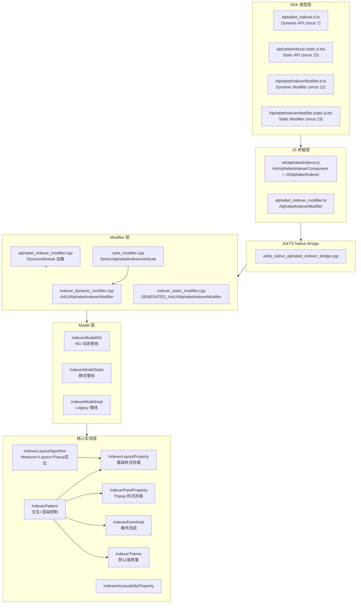

# 架构设计
> 确认目标仓和模块的架构约束、关键设计决策、Spec 拆分方向。

## 设计元数据

| Field | Content |
|-------|---------|
| Design ID | DESIGN-Func-05-03-02 |
| 关联需求 | 已有能力补录（无独立 requirement.md） |
| 关联 Epic | 无 |
| 目标 Feature | Feat-01（创建与基础样式）、Feat-02（Popup样式与交互） |
| 复杂度 | 标准 |
| 目标版本 | API 7 ~ API 12+ |
| Owner | ArkUI SIG |
| 状态 | Baselined（已有实现补录） |

## 需求基线

> 需求基线详见 proposal.md。以下仅列出设计阶段需要额外强调的要点。

| 项 | 补充说明 |
|----|----------|
| AlphabetIndexer 索引条创建 | 构造参数 arrayValue + selected 定义索引数据源和初始选中项 |
| 基础外观样式 | color/selectedColor/selectedBackgroundColor/font/selectedFont/itemSize/alignStyle/autoCollapse 覆盖索引条核心外观 |
| Popup 弹出面板 | usingPopup 控制弹出开关；popupColor/popupBackground/popupSelectedColor/popupUnselectedColor/popupItemBackgroundColor/popupFont/popupItemFont/popupPosition/popupItemBorderRadius/itemBorderRadius/popupBackgroundBlurStyle/popupTitleBackground 覆盖弹出面板完整外观 |
| Popup 交互事件 | onRequestPopupData/onPopupSelect/selected(属性) 覆盖弹出面板交互 |
| 废弃 API | onSelected @deprecated since 8，被 onSelect 替代；源码层两者共享同一 native 路径 |

## 上下文和现状

### 涉及仓和模块

| 仓库 | 模块 | 当前职责 | 影响类型 | 补充架构说明 |
|------|------|----------|----------|-------------|
| ace_engine | `frameworks/core/components_ng/pattern/indexer/` | IndexerPattern + IndexerLayoutProperty + IndexerPaintProperty + IndexerEventHub + IndexerAccessibilityProperty | 核心实现 | Pattern 既管理交互逻辑又控制渲染状态 |
| ace_engine | `frameworks/core/components_ng/pattern/indexer/arc_indexer_*` | ArcAlphabetIndexer（穿戴设备环形变体） | 变体实现 | 独立 layout/paint/pattern/content_modifier，与线性 Indexer 共享部分 theme |
| ace_engine | `frameworks/core/components_ng/pattern/indexer/bridge/` | ArkTS Native Bridge + Dynamic/Static Modifier | 前端桥接 | 3 个 Model（Impl/NG/Static）分别适配 legacy/NG动态/静态管线 |
| ace_engine | `frameworks/bridge/declarative_frontend/ark_component/components/arkalphabetindexer.js` | JS 侧组件桥接 | 前端桥接 | ArkAlphabetIndexerComponent（ModifierWithKey）+ JSAlphabetIndexer（JSViewAbstract） |
| ace_engine | `frameworks/bridge/declarative_frontend/ark_modifier/src/alphabet_indexer_modifier.ts` | Modifier TS 层 | 前端桥接 | AlphabetIndexerModifier extends LazyAlphabetIndexerComponent |
| ace_engine | `frameworks/core/components_ng/pattern/indexer/indexer_theme.h` | IndexerTheme 主题常量 | 主题 | 定义全部默认颜色/尺寸/圆角值 |
| ace_engine | `interfaces/native/native_node.h` | NDK C-API 声明 | 公共接口 | 仅暴露 ARKUI_NODE_ARC_ALPHABET_INDEXER（Arc 变体） |
| ace_engine | `interfaces/native/node/style_modifier.cpp` | NDK 属性处理器 | 公共接口 | SetArcAlphabetIndexerAttribute 处理全部 Arc 属性 |
| ace_engine | `interface/sdk-js/api/` | SDK 类型定义（.d.ts/.d.ets/.static.d.ets） | 公共接口 | Dynamic + Static + Modifier 3 组类型文件 |

### 调用链层级分析

| 层 | 模块 | 职责 | 修改类型 |
|----|------|------|----------|
| SDK 类型层 | `interface/sdk-js/api/@internal/component/ets/alphabet_indexer.d.ts` | Dynamic API 类型签名 | 无修改（已有实现补录） |
| SDK 类型层 | `interface/sdk-js/api/arkui/component/alphabetIndexer.static.d.ets` | Static API 类型签名 | 无修改 |
| SDK 类型层 | `interface/sdk-js/api/arkui/AlphabetIndexerModifier.d.ts` | Dynamic Modifier 类型签名 | 无修改 |
| SDK 类型层 | `interface/sdk-js/api/arkui/AlphabetIndexerModifier.static.d.ets` | Static Modifier 类型签名 | 无修改 |
| JS 组件层 | `arkalphabetindexer.js` | ArkAlphabetIndexerComponent + JSAlphabetIndexer 属性桥接 | 无修改 |
| JS Modifier 层 | `alphabet_indexer_modifier.ts` | AlphabetIndexerModifier（LazyAlphabetIndexerComponent） | 无修改 |
| ArkTS Native Bridge 层 | `arkts_native_alphabet_indexer_bridge.h/.cpp` | 解析 ArkTS 调用参数 → 调用 Dynamic/Static Modifier | 无修改 |
| Dynamic Modifier 层 | `indexer_dynamic_modifier.cpp` | 填充 ArkUIAlphabetIndexerModifier 函数指针表 | 无修改 |
| Static Modifier 层 | `indexer_static_modifier.cpp` | 填充 GENERATED_ArkUIAlphabetIndexerModifier 函数指针表 | 无修改 |
| NDK Modifier 层 | `alphabet_indexer_modifier.h/.cpp` | 加载 DynamicModule "Indexer"，返回 modifier 指针 | 无修改 |
| NDK 属性处理层 | `style_modifier.cpp` SetArcAlphabetIndexerAttribute | NDK NODE_ARC_ALPHABET_INDEXER_* 属性分发 | 无修改 |
| Model 层（NG动态） | `indexer_model_ng.h/.cpp` | IndexerModelNG 实例+静态方法，写入 LayoutProperty/PaintProperty/EventHub | 无修改 |
| Model 层（Static） | `indexer_model_static.h/.cpp` | IndexerModelStatic 静态方法，写入 LayoutProperty/PaintProperty/EventHub | 无修改 |
| Model 层（Legacy） | `indexer_model_impl.h/.cpp` | IndexerModelImpl → V2::IndexerComponent | 无修改 |
| Pattern 层 | `indexer_pattern.h/.cpp` | 交互逻辑（触摸/滑动/键盘/折叠）、渲染状态管理（RenderContext 属性） | 无修改 |
| LayoutProperty 层 | `indexer_layout_property.h/.cpp` | 基础样式属性存储（color/selectedColor/font/itemSize/alignStyle/autoCollapse 等） | 无修改 |
| PaintProperty 层 | `indexer_paint_property.h` | Popup 样式属性存储（popupSelectedColor/popupBackground/borderRadius/blurStyle 等） | 无修改 |
| LayoutAlgorithm 层 | `indexer_layout_algorithm.h/.cpp` | Measure + Layout + Popup 定位（IsPopupAtLeft + RTL） | 无修改 |
| Theme 层 | `indexer_theme.h` | 默认值常量 + API 12 分支 | 无修改 |
| Accessibility 层 | `indexer_accessibility_property.h/.cpp` | 无障碍索引计数/当前索引/滚动动作 | 无修改 |
| EventHub 层 | `indexer_event_hub.h` | onSelected/onRequestPopupData/onPopupSelected/changeEvent 事件回调 | 无修改 |

检查项：
- [x] 调用链每一层都已覆盖（从最上层到最底层）
- [x] 每层职责边界清晰，无跨层违规调用
- [x] 每层修改类型明确

### 适用架构规则

| Rule ID | 适用原因 | 设计结论 | 验证方式 |
|---------|----------|----------|----------|
| OH-ARCH-LAYERING | 属性从 JS→Bridge→Model→Property 逐层传递 | 调用方向严格单向向下；无反向调用 | 代码评审/依赖检查 |
| OH-ARCH-SUBSYSTEM | AlphabetIndexer 属于 arkui 子系统内部 | 不涉及跨子系统调用 | 代码评审 |
| OH-ARCH-API-LEVEL | Dynamic API (7+), Static API (23+), NDK C-API (Arc 变体 26+) | 三个 API 级别并行存在；NDK 仅暴露 Arc 变体 | API 评审/XTS |
| OH-ARCH-COMPONENT-BUILD | Indexer 作为 DynamicModule 按需加载 | BUILD.gn 已配置；无新增依赖 | 构建验证 |
| OH-ARCH-ERROR-LOG | 无错误码定义；异常通过日志和默认值兜底 | 日志为 hilog DEBUG 级别；不新增错误码 | hilog |

## 不涉及项承接

| 维度 | 设计结论 |
|------|----------|
| ArcAlphabetIndexer 变体 | 本 spec 仅覆盖线性 AlphabetIndexer；Arc 变体逻辑独立，不在此 spec 范围 |
| CJ Frontend | CJ AlphabetIndexer FFI 存在但不在本 spec 覆盖范围 |
| Legacy components/ 路径 | 旧版 DOM/Component/Element/Render 组件仅做兼容，不做新规格 |
| contentModifier | AlphabetIndexer 不支持自定义 contentModifier（仅 Arc 变体有） |

## 关键设计决策

| 决策 ID | 问题 | 推荐方案 | 探索过的替代方案 | 取舍理由 | 影响 |
|---------|------|----------|-----------------|----------|------|
| ADR-1 | 基础样式与 Popup 样式存储分层 | 基础样式存 LayoutProperty，Popup 样式存 PaintProperty | 全部存 LayoutProperty | PaintProperty 的 PROPERTY_UPDATE_RENDER 仅触发重绘，避免不必要的 Measure | Feat-01 修改 LayoutProperty 触发 MEASURE/NORMAL；Feat-02 修改 PaintProperty 触发 RENDER/MEASURE |
| ADR-2 | Popup 定位方向逻辑 | alignStyle + layoutDirection → IsPopupAtLeft() 函数统一判定 | 分别 LEFT/RIGHT 独立计算 | START/END 需根据 RTL 翻转，统一函数避免逻辑分散 | Popup 位置公式在 LayoutAlgorithm 中统一维护 |
| ADR-3 | AutoCollapse 折叠策略 | 根据数组长度+可用高度动态选择 NONE/5+1/7+1 三种模式 | 固定 5+1 模式 | 固定模式在小数组时浪费空间；动态选择保证可用性 | collapsedIndex_ 子索引追踪折叠组内位置 |
| ADR-4 | SetByUser 标记机制 | 10 个颜色属性增加 SetXxxByUser bool flag | 不区分用户设置/主题默认 | 不区分时暗色模式切换无法保留用户覆盖值 | 暗色模式场景下 ByUser=true 的属性不被主题覆盖 |
| ADR-5 | onSelected/onSelect 废弃处理 | SDK 标注 @deprecated since 8，C++ 层两条路径共享同一个 SetOnSelected | C++ 层增加废弃检测逻辑 | 保持两条路径一致降低维护成本，避免运行时分支 | spec 注明 SDK 声明与源码实现的偏差 |
| ADR-6 | NDK C-API 仅暴露 Arc 变体 | 线性 AlphabetIndexer 不提供 NDK 节点类型，仅 ArcAlphabetIndexer（node type 23） | 同时暴露两种节点类型 | 线性 Indexer 的 NDK 需求尚未确认，Arc 变体已有穿戴设备场景 | 非 Arc AlphabetIndexer C-API 声明为"未实现" |
| ADR-7 | API 12 行为变更策略 | 通过 Pattern 内 `GreatOrEqualAPIVersion12()` 条件分支 | 修改 Theme 默认值并统一 | Theme 默认值需兼容旧版本，条件分支更精确 | 兼容性声明中明确标注 API 12 前后差异 |

## 设计骨架

### 骨架范围

| 骨架项 | 目标 | 不包含 | 验证方式 |
|--------|------|--------|----------|
| AlphabetIndexer 构造 | 明确 arrayValue + selected 构造参数语义 | Arc 变体构造 | 单测 + SDK 类型检查 |
| 基础外观样式规则 | color/selectedColor/font/itemSize/alignStyle/autoCollapse/onSelect 默认值+边界+优先级 | Popup 样式 | 单测 + 可视化验证 |
| Popup 样式规则 | popup 全套外观属性默认值+边界+RTL 定位 | Arc 变体 Popup | 单测 + RTL 测试 |
| Popup 交互事件 | onRequestPopupData/onPopupSelect/selected 行为规则 | Arc 变体事件 | 事件回调单测 |

### 骨架 Spec 拆分

| Task ID | 目标 | 受影响文件 | AC |
|---------|------|-----------|-----|
| TASK-SKELETON-1 | Feat-01: 创建与基础样式 spec | Feat-01-alphabet-indexer-creation-basic-style-spec.md | AC-1.1 ~ AC-1.8 |
| TASK-SKELETON-2 | Feat-02: Popup样式与交互 spec | Feat-02-alphabet-indexer-popup-style-interaction-spec.md | AC-2.1 ~ AC-2.8 |

## 后续 Task 拆分

| Task ID | 目标 | 受影响文件 | 依赖 |
|---------|------|-----------|------|
| TASK-01 | Feat-01 spec（创建与基础样式） | Feat-01-alphabet-indexer-creation-basic-style-spec.md | 无 |
| TASK-02 | Feat-02 spec（Popup样式与交互） | Feat-02-alphabet-indexer-popup-style-interaction-spec.md | TASK-01（shared design baseline） |

## API 签名、Kit 与权限

### 新增 API

> 已有实现补录，无新增 API。以下列出当前全部 Public API 签名供 spec 参考。

| API 签名 | 类型 | Kit | d.ts 位置 | 权限要求 | SysCap |
|----------|------|-----|----------|----------|--------|
| `AlphabetIndexer(options: AlphabetIndexerOptions): AlphabetIndexerAttribute` | Public | ArkUI | `alphabet_indexer.d.ts` | 无 | SystemCapability.ArkUI.ArkUI.Full |
| `color(value: ResourceColor)` | Public | ArkUI | `alphabet_indexer.d.ts` | 无 | 同上 |
| `selectedColor(value: ResourceColor)` | Public | ArkUI | `alphabet_indexer.d.ts` | 无 | 同上 |
| `selectedBackgroundColor(value: ResourceColor)` | Public | ArkUI | `alphabet_indexer.d.ts` | 无 | 同上 |
| `font(value: Font)` | Public | ArkUI | `alphabet_indexer.d.ts` | 无 | 同上 |
| `selectedFont(value: Font)` | Public | ArkUI | `alphabet_indexer.d.ts` | 无 | 同上 |
| `itemSize(value: string \| number)` | Public | ArkUI | `alphabet_indexer.d.ts` | 无 | 同上 |
| `alignStyle(value: IndexerAlign, offset?: Length)` | Public | ArkUI | `alphabet_indexer.d.ts` | 无 | 同上 |
| `autoCollapse(value: boolean)` | Public | ArkUI | `alphabet_indexer.d.ts` | 无 | 同上 |
| `usingPopup(value: boolean)` | Public | ArkUI | `alphabet_indexer.d.ts` | 无 | 同上 |
| `onSelect(callback: OnAlphabetIndexerSelectCallback)` | Public | ArkUI | `alphabet_indexer.d.ts` | 无 | 同上 |
| `popupColor(value: ResourceColor)` | Public | ArkUI | `alphabet_indexer.d.ts` | 无 | 同上 |
| `popupBackground(value: ResourceColor)` | Public | ArkUI | `alphabet_indexer.d.ts` | 无 | 同上 |
| `popupSelectedColor(value: ResourceColor)` | Public | ArkUI | `alphabet_indexer.d.ts` | 无 | 同上 |
| `popupUnselectedColor(value: ResourceColor)` | Public | ArkUI | `alphabet_indexer.d.ts` | 无 | 同上 |
| `popupItemBackgroundColor(value: ResourceColor)` | Public | ArkUI | `alphabet_indexer.d.ts` | 无 | 同上 |
| `popupFont(value: Font)` | Public | ArkUI | `alphabet_indexer.d.ts` | 无 | 同上 |
| `popupItemFont(value: Font)` | Public | ArkUI | `alphabet_indexer.d.ts` | 无 | 同上 |
| `popupPosition(value: Position)` | Public | ArkUI | `alphabet_indexer.d.ts` | 无 | 同上 |
| `popupItemBorderRadius(value: number)` | Public | ArkUI | `alphabet_indexer.d.ts` | 无 | 同上 |
| `itemBorderRadius(value: number)` | Public | ArkUI | `alphabet_indexer.d.ts` | 无 | 同上 |
| `popupBackgroundBlurStyle(value: BlurStyle)` | Public | ArkUI | `alphabet_indexer.d.ts` | 无 | 同上 |
| `popupTitleBackground(value: ResourceColor)` | Public | ArkUI | `alphabet_indexer.d.ts` | 无 | 同上 |
| `enableHapticFeedback(value: boolean)` | Public | ArkUI | `alphabet_indexer.d.ts` | 无 | 同上 |
| `selected(index: number)` | Public | ArkUI | `alphabet_indexer.d.ts` | 无 | 同上 |
| `onRequestPopupData(callback)` | Public | ArkUI | `alphabet_indexer.d.ts` | 无 | 同上 |
| `onPopupSelect(callback)` | Public | ArkUI | `alphabet_indexer.d.ts` | 无 | 同上 |
| `attributeModifier(modifier)` | Public | ArkUI | `alphabetIndexer.static.d.ets` | 无 | 同上 |

### 变更/废弃 API

| 原有 API | 变更类型 | 新 API | 迁移说明 |
|----------|----------|--------|----------|
| `onSelected(callback: (index: number) => void)` | 废弃（since 8） | `onSelect(callback: OnAlphabetIndexerSelectCallback)` | onSelected 仍可调用但建议使用 onSelect；源码层两者行为一致 |

## 构建系统影响

### BUILD.gn 变更

```
文件路径: frameworks/core/components_ng/pattern/indexer/BUILD.gn
变更说明: 无变更（已有实现补录）
```

### bundle.json 变更

无变更。

## 可选设计扩展

### 架构图



### 数据流/控制流

| 步骤 | 调用方 | 被调用方 | 数据/接口 | 说明 |
|------|--------|----------|-----------|------|
| 1 | ArkTS 应用 | AlphabetIndexer(options) | arrayValue + selected | 构造调用 |
| 2 | JS 组件层 | getUINativeModule().alphabetIndexer.create() | 参数序列化 | 进入 Native |
| 3 | ArkTS Bridge | AlphabetIndexerBridge::CreateIndexer | ArkUIRuntimeCallInfo | 解析参数 |
| 4 | Dynamic Modifier | SetAlphabetIndexerArrayValue | nodeHandle, array, length | 创建节点 |
| 5 | IndexerModelNG | Create(vector, selected) | FrameNode stack | 写入 LayoutProperty |
| 6 | IndexerPattern | OnModifyDone() | 触发 BuildArrayValueItems | 初始化折叠 |
| 7 | 用户触摸 | OnTouchDown → MoveIndexByOffset | Offset + isTouch | 索引变更 |
| 8 | IndexerPattern | ApplyIndexChanged | selectChanged, fromTouchUp | 更新样式 + FireOnSelect |
| 9 | IndexerEventHub | FireOnSelect(index) | onSelectedEvent_ callback | 回调到 JS |

### 数据模型设计

**TypeScript (API 层)**:

```typescript
interface AlphabetIndexerOptions {
  arrayValue: Array<string>;  // since 7
  selected: number;            // since 7
}
enum IndexerAlign { Left, Right, START, END }  // since 7 (START/END since 12)
interface Font { size?: number; weight?: FontWeight; family?: string; style?: FontStyle; }
```

**C++ (Framework 层)**:

| 结构体 | 文件 | 属性数 | 说明 |
|--------|------|--------|------|
| IndexerLayoutProperty | indexer_layout_property.h | 31 | 基础样式 + SetByUser 标记 |
| IndexerPaintProperty | indexer_paint_property.h | 11 | Popup 样式 |
| IndexerEventHub | indexer_event_hub.h | 5 | 4 个事件回调 + 1 个 createChangeEvent |
| IndexerPattern | indexer_pattern.h | ~40 | 状态变量（selected_, autoCollapse_, arrayValue_, collapsedIndex_ 等） |

**存储方案**:

| 属性类别 | 存储位置 | Dirty Flag | 说明 |
|----------|----------|------------|------|
| 基础文本颜色 | LayoutProperty | PROPERTY_UPDATE_NORMAL | color/selectedColor/popupColor |
| 基础字体 | LayoutProperty | PROPERTY_UPDATE_NORMAL | font/selectedFont/popupFont |
| 基础布局 | LayoutProperty | PROPERTY_UPDATE_MEASURE | arrayValue/itemSize/autoCollapse |
| Popup 颜色 | PaintProperty | PROPERTY_UPDATE_RENDER | popupSelectedColor/popupBackground/popupItemBackground |
| Popup 圆角 | PaintProperty | PROPERTY_UPDATE_MEASURE | popupItemBorderRadius/itemBorderRadius |
| Popup 模糊 | PaintProperty | PROPERTY_UPDATE_RENDER | popupBackgroundBlurStyle/popupTitleBackground |
| Per-item 背景 | RenderContext | 直接写入 | Hover/Selected/Normal 状态颜色 |
| SetByUser 标记 | LayoutProperty | PROPERTY_UPDATE_NORMAL | 10 个 bool flag |

### 详细设计

#### AlphabetIndexer 构造与初始化

`IndexerModelNG::Create()` 接收 `vector<string>& indexerArray` 和 `int32_t selectedVal`，在 ViewStackProcessor 上创建 FrameNode，写入 LayoutProperty 的 ArrayValue 和 Selected。`IndexerPattern::OnModifyDone()` 触发 `InitArrayValue()` → `BuildArrayValueItems()` → 根据 autoCollapse 状态调用 `BuildFullArrayValue()` 或 `CollapseArrayValue()`。

源码: `indexer_model_ng.cpp:Create()` (`frameworks/core/components_ng/pattern/indexer/indexer_model_ng.cpp`)

#### AutoCollapse 折叠算法

`CollapseArrayValue()` (`indexer_pattern.cpp:252-291`) 根据 `maxItemsCount`（可用高度 / itemSize）和 `fullArraySize` 选择折叠模式:

1. `fullArraySize - sharpItemCount_ <= 9` → NONE（全显示）
2. `fullArraySize - sharpItemCount_ <= 13` 或空间不足 → FIVE (5+1 模式，4 组)
3. 空间充足 → SEVEN (7+1 模式，6 组)

`ApplySevenPlusOneMode()` (`indexer_pattern.cpp:294-335`) 和 `ApplyFivePlusOneMode()` (`indexer_pattern.cpp:337-378`) 将字母分组，每组首项显示为圆点（`second=true`），末项正常显示。`collapsedIndex_` 追踪折叠组内当前位置。

#### Popup 定位算法

`IsPopupAtLeft()` (`indexer_layout_algorithm.cpp:178-189`) 根据 alignment + layoutDirection 判断弹出面板方向:

| alignment | LTR | RTL |
|-----------|-----|-----|
| LEFT | popup 在左 | popup 在左 |
| RIGHT | popup 在右 | popup 在右 |
| START | popup 在左 | popup 在右 |
| END (默认) | popup 在右 | popup 在左 |

`GetPositionOfPopupNode()` (`indexer_layout_algorithm.cpp:153-176`) 计算 popup 坐标:
- 有 userDefineSpace: `positionX = space + indexerWidth - leftPadding` (左) / `-space - leftPadding - bubbleSize` (右)
- 无 userDefineSpace: 使用默认 `BUBBLE_POSITION_X (60vp)` / `BUBBLE_POSITION_Y (48vp)`

#### SetByUser 标记机制

10 个颜色属性各配有 `SetXxxByUser` bool flag (`indexer_layout_property.h`):

| 颜色属性 | ByUser Flag | 作用 |
|----------|-------------|------|
| color | SetColorByUser | ByUser=true 时暗色模式不覆盖 |
| selectedColor | SetSelectedColorByUser | 同上 |
| popupColor | SetPopupColorByUser | 同上 |
| selectedBackgroundColor | SetSelectedBGColorByUser | 同上 |
| popupBackground | SetPopupBackgroundColorByUser | 同上 |
| popupSelectedColor | SetPopupSelectedColorByUser | 同上 |
| popupUnselectedColor | SetPopupUnselectedColorByUser | 同上 |
| popupItemBackground | SetPopupItemBackgroundColorByUser | 同上 |
| popupTitleBackground | SetPopupTitleBackgroundByUser | 同上 |
| popupBackgroundBlurStyle | SetPopupBackgroundBlurStyleByUser | 同上 |

`OnColorConfigurationUpdate()` (`indexer_pattern.cpp`) 和 `OnColorModeChange()` 中: 当 ByUser=false 时使用 theme 新默认值；ByUser=true 时保留用户设置值。

#### API 12 行为差异

`GreatOrEqualAPIVersion12()` 条件分支覆盖:

| 差异项 | API < 12 | API >= 12 |
|--------|-----------|-----------|
| 垂直 padding | INDEXER_PADDING_TOP = 2vp | INDEXER_PADDING_TOP_API_TWELVE = 4vp |
| 选中项圆角 | theme hoverRadiusSize | itemBorderRadius (默认 8vp) |
| 正常态圆角 | 0 (Dimension()) | 8vp (INDEXER_ITEM_DEFAULT_RADIUS) |
| Popup 背景 | 0xffffffff (白色) | 0x66808080 (半透明灰) |
| Popup item 最大数 (折叠态) | 4 | 3 (INDEXER_BUBBLE_MAXSIZE_COLLAPSED_API_TWELVE) |
| Popup item 尺寸 | 无专门 BUBBLE_ITEM_SIZE | 48vp (BUBBLE_ITEM_SIZE) |
| Popup 标题背景 | 无 | popupTitleBackground 属性 |

#### NDK C-API 仅 Arc 变体

公共 NDK (`native_node.h`) 定义 `ARKUI_NODE_ARC_ALPHABET_INDEXER` (node type = 23)，14 个属性枚举 + 1 个事件枚举，全部 `@since 26.1.0`。线性 AlphabetIndexer 没有对应 NDK 节点类型。

| NDK 枚举 | 对应 Dynamic API |
|----------|-----------------|
| NODE_ARC_ALPHABET_INDEXER_ARRAY | arrayValue |
| NODE_ARC_ALPHABET_INDEXER_COLOR | color |
| NODE_ARC_ALPHABET_INDEXER_SELECTED_COLOR | selectedColor |
| NODE_ARC_ALPHABET_INDEXER_POPUP_COLOR | popupColor |
| NODE_ARC_ALPHABET_INDEXER_SELECTED_BACKGROUND_COLOR | selectedBackgroundColor |
| NODE_ARC_ALPHABET_INDEXER_POPUP_BACKGROUND_COLOR | popupBackground |
| NODE_ARC_ALPHABET_INDEXER_USE_POPUP | usingPopup |
| NODE_ARC_ALPHABET_SELECTED_FONT | selectedFont |
| NODE_ARC_ALPHABET_INDEXER_POPUP_FONT | popupFont |
| NODE_ARC_ALPHABET_FONT | font |
| NODE_ARC_ALPHABET_INDEXER_ITEM_SIZE | itemSize |
| NODE_ARC_ALPHABET_INDEXER_SELECTED | selected |
| NODE_ARC_ALPHABET_AUTO_COLLAPSE | autoCollapse |
| NODE_ARC_ALPHABET_POPUP_BACKGROUND_BLUR_STYLE | popupBackgroundBlurStyle |
| NODE_ARC_ALPHABET_INDEXER_EVENT_ON_SELECT | onSelect 事件 |

## 风险和开放问题

| 项 | 类型 | 影响 | 处理方式 | Owner |
|----|------|------|----------|-------|
| SDK onSelected @deprecated 与源码实际行为不一致 | API | 中 | spec 注明偏差；未来版本应真正移除 onSelected 调用路径 | ArkUI SIG |
| 非 Arc AlphabetIndexer 无 NDK C-API 入口 | API | 低 | spec 标注"NDK 未实现"；需求确认后再补充 | ArkUI SIG |
| API 12 行为差异导致跨版本视觉不一致 | API | 中 | 兼容性声明详列差异；测试覆盖 API 12 前后分支 | ArkUI SIG |
| SetByUser 标记仅在 LayoutProperty 存，PaintProperty 颜色属性无此机制 | 架构 | 低 | popupSelectedColor/popupUnselectedColor/popupItemBackground/popupTitleBackground 的暗色模式策略依赖 Pattern 内部判断 | ArkUI SIG |
| C-API unit test 多项 DISABLED_ | 测试 | 低 | 需排查 DISABLED 原因并恢复 | ArkUI SIG |

## 设计审批

- [x] 需求基线已确认，设计覆盖 P0/P1 AC
- [x] 不涉及项已承接，N/A 和展开项都有结论
- [x] 涉及仓和模块职责清楚
- [x] 调用链层级分析完整，每层覆盖到位
- [x] 适用架构规则已识别并形成设计结论
- [x] 分层和子系统边界合规
- [x] API 变更有签名、权限、错误码和兼容性说明
- [x] BUILD.gn/bundle.json 影响明确
- [x] 设计输出和后续 Task 拆分明确
- [x] 关键设计决策有理由和影响说明
- [x] 风险和开放问题有 Owner

**结论:** 通过（已有实现补录）
