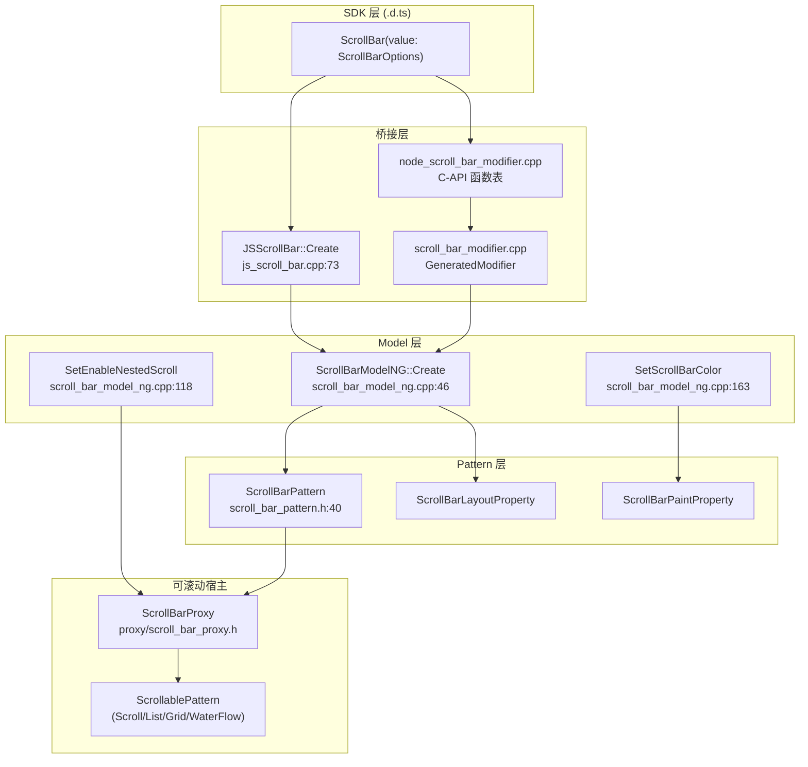
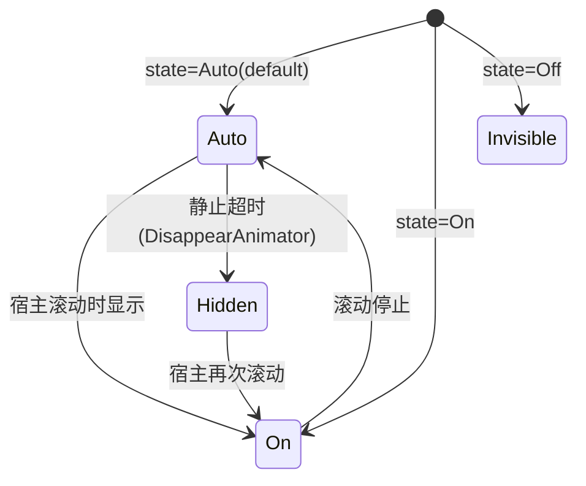

# 架构设计

> ScrollBar 独立滚动条组件功能域的架构设计文档，补录已有实现。ScrollBar 是一个独立节点，通过 `Scroller`/`ScrollBarProxy` 与可滚动宿主（Scroll/List/Grid/WaterFlow）配对，不渲染滚动内容本身。

## 设计元数据

| 字段 | 内容 |
|------|------|
| Design ID | DESIGN-Func-05-03-03 |
| 关联需求 | 已有能力补录（无独立 requirement.md） |
| 关联 Epic | 无 |
| 目标 Feature | Feat-01 ScrollBar 核心构造与绑定, Feat-02 ScrollBar 行为与视觉扩展 |
| 复杂度 | 标准 |
| 目标版本 | API 8 起支持（crossplatform 10、FaAndStageModel+atomicservice 11） |
| Owner | ArkUI SIG |
| 状态 | Baselined（已有实现补录） |

## 需求基线

| 项 | 补充说明 |
|----|----------|
| 核心目标 | 提供独立 ScrollBar 组件，通过 `ScrollBarOptions.{scroller, direction, state}` 创建，与可滚动宿主经 `Scroller`↔`ScrollBarProxy` 绑定，支持嵌套滚动（`enableNestedScroll` @14）与颜色定制（`scrollBarColor` @20） |
| 与内建滚动条的区别 | 可滚动容器（Scroll/List/Grid/WaterFlow）的 `scrollBar`/`scrollBarColor`/`scrollBarWidth` 是 `ScrollableCommonMethod` 上的内建属性，属于各可滚动组件规格；本域仅覆盖独立 `ScrollBar` 组件 |

## 上下文和现状

### 涉及仓和模块

| 仓库 | 模块/路径 | 当前职责 | 本 Feature 影响 |
|------|-----------|----------|-----------------|
| ace_engine | `frameworks/core/components_ng/pattern/scroll_bar/scroll_bar_pattern.h/.cpp` | ScrollBarPattern 主逻辑，继承 Pattern，管理偏移/距离/手势/消失动画/代理 | 核心调度层 |
| ace_engine | `frameworks/core/components_ng/pattern/scroll_bar/scroll_bar_layout_property.h` | 布局属性：Axis、DisplayMode、Visibility | Feat-01 |
| ace_engine | `frameworks/core/components_ng/pattern/scroll_bar/scroll_bar_paint_property.h` | 渲染属性：ScrollBarColor | Feat-02 |
| ace_engine | `frameworks/core/components_ng/pattern/scroll_bar/scroll_bar_layout_algorithm.h/.cpp` | 布局算法，根据 currentOffset/scrollableDistance 计算滑块区域 | Feat-01 |
| ace_engine | `frameworks/core/components_ng/pattern/scroll_bar/scroll_bar_paint_method.h/.cpp` | 绘制方法（仅 API≥12 启用，见 `scroll_bar_pattern.h:234`） | Feat-01/02 |
| ace_engine | `frameworks/core/components_ng/pattern/scroll_bar/scroll_bar_accessibility_property.h/.cpp` | 无障碍属性 | Feat-01 |
| ace_engine | `frameworks/core/components_ng/pattern/scroll_bar/proxy/scroll_bar_proxy.h` | NG ScrollBarProxy，登记 ScrollBarPattern 与可滚动宿主的配对 | Feat-01/02 |
| ace_engine | `frameworks/core/components_ng/pattern/scroll_bar/scroll_bar_model.h` | ScrollBarModel 抽象接口 + `ScrollBarJsResType` 枚举 | API 层抽象 |
| ace_engine | `frameworks/core/components_ng/pattern/scroll_bar/scroll_bar_model_ng.h/.cpp` | ScrollBarModelNG 实现，Create/SetEnableNestedScroll/SetScrollBarColor/资源对象 | API 层实现 |
| ace_engine | `frameworks/core/components_ng/pattern/scroll_bar/scroll_bar_model_static.h/.cpp` | 静态 FrameNode 访问器，供 C-API/ArkTS 静态前端调用 | API 层实现 |
| ace_engine | `frameworks/bridge/declarative_frontend/jsview/scroll_bar/js_scroll_bar.h/.cpp` | JSScrollBar 桥接，解析 `ScrollBarOptions` 并调用 Model | 桥接层 |
| ace_engine | `frameworks/core/interfaces/native/node/node_scroll_bar_modifier.h/.cpp` | C-API node modifier，ArkUIScrollBarModifier 函数表 | Feat-01/02 |
| ace_engine | `frameworks/core/interfaces/native/implementation/scroll_bar_modifier.cpp` | 生成的 Modifier 实现（GeneratedModifier::ScrollBarModifier） | Feat-01/02 |
| ace_engine | `frameworks/core/interfaces/native/node/node_arc_scroll_bar_modifier.h/.cpp` | Arc ScrollBar C-API（穿戴专用） | Feat-01 |
| ace_engine | `interfaces/native/native_node.h` | C-API 公开接口，`ARKUI_NODE_SCROLL`、NODE_SCROLL_BAR_* 属性枚举 | Feat-01/02 |
| ace_engine | `frameworks/core/components_ng/pattern/scroll/inner/scroll_bar.h` | 内建 ScrollBar 渲染对象（被 ScrollBarPattern 复用） | Feat-01 |
| ace_engine | `frameworks/core/components_ng/pattern/scroll/scroll_event_hub.h` | ScrollEventHub（ScrollBarPattern 复用为 EventHub，见 `scroll_bar_pattern.h:75`） | Feat-01 |

### 调用链层级分析

| 层 | 模块 | 职责 | 修改类型 |
|----|------|------|----------|
| 1. SDK 层 (.d.ts) | `ets/dynamic/component/scroll_bar.d.ts` | ScrollBar 组件 TS 类型声明，`ScrollBarOptions`/`ScrollBarDirection`/`ScrollBarAttribute` | 存量分析 |
| 2. JSView 层 | `bridge/declarative_frontend/jsview/scroll_bar/js_scroll_bar.cpp` | 解析 `ScrollBar({scroller,direction,state})` 构造参数与 `enableNestedScroll`/`scrollBarColor` 属性方法，`scroller` 解包为 `JSScroller` 取 `ScrollBarProxy` | 存量分析 |
| 3. node_modifier 层 | `core/interfaces/native/node/node_scroll_bar_modifier.cpp` | C-API 属性设置实现（`setScrollBarState`/`setScrollBarScroller`/`setScrollBarEnableNestedScroll`/`setScrollBarScrollBarColor`+资源对象），`setScrollBarDirection` 为 nullptr（仅经 options 设置） | 存量分析 |
| 4. 生成 Modifier 层 | `core/interfaces/native/implementation/scroll_bar_modifier.cpp` | `GeneratedModifier::ScrollBarModifier`：`ConstructImpl`/`SetScrollBarOptionsImpl`/`SetEnableNestedScrollImpl`/`SetScrollBarColorImpl` | 存量分析 |
| 5. Model 层 | `core/components_ng/pattern/scroll_bar/scroll_bar_model_ng.cpp` | Create 创建 FrameNode+ScrollBarPattern 并登记 Proxy；方向/状态校验与默认值；`SetEnableNestedScroll` 委派宿主 `SearchAndSetParentNestedScroll`；`SetScrollBarColor` 写 PaintProperty | 存量分析 |
| 6. Pattern 层 | `core/components_ng/pattern/scroll_bar/scroll_bar_pattern.cpp` | 偏移/距离/手势（pan/click/long-press/mouse）/摩擦 fling/消失动画/反向/嵌套滚动开关 `enableNestedSorll_` | 存量分析 |
| 7. Layout 层 | `core/components_ng/pattern/scroll_bar/scroll_bar_layout_algorithm.cpp` | 根据 `currentOffset_`/`scrollableDistance_`/`controlDistance_` 计算滑块位置与尺寸 | 存量分析 |
| 8. Paint 层 | `core/components_ng/pattern/scroll_bar/scroll_bar_paint_method.cpp` | 绘制滑块（仅 `GreatOrEqualAPITargetVersion(VERSION_TWELVE)`，`scroll_bar_pattern.h:234`）+ OverlayModifier | 存量分析 |
| 9. Proxy 层 | `core/components_ng/pattern/scroll_bar/proxy/scroll_bar_proxy.h/.cpp` | 登记多个 ScrollBarPattern 与一个可滚动宿主（ScrollablePattern）的配对，转发偏移/区域更新 | 存量分析 |
| 10. C API 层 | `interfaces/native/native_node.h` | `ARKUI_NODE_SCROLL`；`NODE_SCROLL_BAR_*`（display mode/width/color/direction/state/scroller 等） | 存量分析 |

### 适用架构规则

| Rule ID | 适用原因 | 设计结论 | 验证方式 |
|---------|----------|----------|----------|
| OH-ARCH-LAYERING | ScrollBar 涉及 SDK → JSView/Modifier → Model → Pattern → Layout/Paint → Proxy | 单向调用，Proxy 反向转发宿主更新 | 代码评审 |
| OH-ARCH-API-LEVEL | `enableNestedScroll` @since 14、`scrollBarColor` @since 20，构造族 @since 8/10/11 | 各属性标注 @since 版本与 stagemodelonly 约束 | API 评审/XTS |
| OH-ARCH-COMPONENT-BUILD | ScrollBar 未组件化，属于 ace_core_ng | 无需新增 target | 构建验证 |
| OH-ARCH-NO-COMPONENT | ScrollBar 未组件化，JSView + Bridge 双路径共存 | ADR-1 已记录 | 代码评审 |

## 不涉及项承接

| 维度 | 设计结论 |
|------|----------|
| 性能 | 是 — 展开：ScrollBar 不渲染滚动内容，仅绘制滑块；API≥12 走 ScrollBarPaintMethod，之前走基类默认 | 
| 安全与权限 | N/A |
| 兼容性 | 是 — 展开：`scrollBarColor` 接收 `ColorMetrics`（支持渐变/alpha）；reset 时回退主题 `ScrollBarTheme.ForegroundColor`；方向/状态越界回退默认值 VERTICAL/AUTO |
| IPC/跨进程 | N/A |

## 关键设计决策

| 决策 ID | 问题 | 推荐方案 | 探索过的替代方案 | 取舍理由 | 影响 |
|---------|------|----------|-----------------|----------|------|
| ADR-1 | ScrollBar 未组件化 — JSView + Bridge 双路径共存 | 保持 JSView 层 (`js_scroll_bar.cpp`) + C-API Modifier/Bridge 多路径共存，最终汇聚到 ScrollBarModelNG | 方案A：组件化改造拆独立库；方案B：仅保留 Bridge 路径 | ScrollBar 与滚动容器 Proxy 机制深度耦合，组件化时机未成熟 | JSView + node_modifier + 生成 Modifier 三路径需保持一致 |
| ADR-2 | 独立 ScrollBar 与可滚动宿主的解耦 — 经 Scroller/ScrollBarProxy 间接绑定 | ScrollBar 创建时从 `JSScroller` 取 `ScrollBarProxy`，由 Proxy 登记本 ScrollBarPattern 与宿主 ScrollablePattern 的配对（`scroll_bar_model_ng.cpp:74-78`） | 方案A：ScrollBar 直接持有宿主引用；方案B：宿主主动查找 ScrollBar 子节点 | 间接 Proxy 解耦，一个宿主可挂多个 ScrollBar，ScrollBar 与宿主可独立声明 | 需要 `ScrollBarProxy` 非 null 前置；`enableNestedScroll` 在 Proxy 为 null 时提前返回（`scroll_bar_model_ng.cpp:125-126`） |
| ADR-3 | 方向/状态默认值与越界处理 | `direction` 越界（<0 或 ≥3）→ `Axis::VERTICAL`；`state` 越界（<0 或 ≥3）→ `DisplayMode::AUTO`；`state==OFF` → `Visibility::INVISIBLE`（`scroll_bar_model_ng.cpp:80-91`） | 方案A：越界报错不创建；方案B：钳位到最近合法值 | 钳位到默认值保证组件始终可用，符合 ArkUI 容错惯例 | LayoutProperty 写入 VERTICAL/AUTO + Visibility |
| ADR-4 | 嵌套滚动开关委派宿主 — `enableNestedScroll` 不在 ScrollBar 内实现嵌套 | 开关写 `ScrollBarPattern::enableNestedSorll_`，实际 `SearchAndSetParentNestedScroll`/`SearchAndUnsetParentNestedScroll` 作用于所绑定宿主 ScrollablePattern（`scroll_bar_model_ng.cpp:118-139`） | 方案A：ScrollBar 自行实现嵌套；方案B：仅做开关标记 | ScrollBar 无滚动内容，嵌套语义只能作用于宿主；委派宿主避免重复实现 | 开关变更需经 Proxy 取宿主；无宿主时为 no-op |
| ADR-5 | 颜色 reset 回退主题 — `scrollBarColor` 清除时使用主题前景色 | `ResetScrollBarColor` 取 `ScrollBarTheme::GetForegroundColor()` 写回 `ScrollBar::SetForegroundColor`（`scroll_bar_model_ng.cpp:179-193`） | 方案A：reset 为透明；方案B：reset 为固定常量 | 回退主题保证深浅色一致与可定制 | 深色模式切换走 `OnColorConfigurationUpdate`/`OnColorModeChange` |
| ADR-6 | Arc 形态 — 穿戴专用 ArcScrollBar | `CreateArcScrollBar` 在 WATCH/WEARABLE 设备创建 `ARC_SCROLL_BAR_ETS_TAG` FrameNode + `CreateArcScrollBarPattern`（`scroll_bar_model_ng.cpp:55-60,95-100`） | 方案A：独立组件；方案B：ScrollBar 内属性切换 | 独立 Pattern 复用 Proxy 机制，仅扩展弧形绘制 | C-API `node_arc_scroll_bar_modifier.cpp` 镜像 |

## 设计骨架

### 骨架范围

| 骨架项 | 目标 | 不包含 | 验证方式 |
|--------|------|--------|----------|
| 创建与 Proxy 绑定 | `ScrollBar(value)` 解析 scroller/direction/state，登记 Proxy | 宿主侧滚动逻辑 | 单元测试 |
| 方向/状态默认与校验 | 越界回退 VERTICAL/AUTO，OFF→INVISIBLE | 颜色 | 单元测试 |
| 嵌套滚动委派 | `enableNestedScroll` 作用于宿主 | 宿主嵌套实现 | 代码审查 |
| 颜色与资源 | `scrollBarColor`(ColorMetrics)+资源对象+主题回退 | 内建滚动条颜色 | 单元测试 |

### 骨架 Spec 拆分

| Task ID | 目标 | 受影响文件 | AC |
|---------|------|-----------|-----|
| TASK-SKELETON-1 | 创建与 Proxy 绑定验证 | `scroll_bar_model_ng.cpp`, `js_scroll_bar.cpp` | Feat-01 AC |
| TASK-SKELETON-2 | 方向/状态校验验证 | `scroll_bar_model_ng.cpp` | Feat-01 AC |
| TASK-SKELETON-3 | 嵌套滚动委派验证 | `scroll_bar_model_ng.cpp`, `scroll_bar_pattern.h` | Feat-02 AC |
| TASK-SKELETON-4 | 颜色与资源验证 | `scroll_bar_model_ng.cpp`, `scroll_bar_paint_property.h` | Feat-02 AC |

## 后续 Task 拆分

| Spec | 目的 | 依赖 | 输出 |
|------|------|------|------|
| Feat-01-scroll-bar-core-construction-binding-spec.md | 固化创建与 Proxy 绑定/方向/状态行为规格 | 本 Design | 完整行为规格与 AC |
| Feat-02-scroll-bar-behavior-visual-extensions-spec.md | 固化 `enableNestedScroll`/`scrollBarColor` 行为规格 | 本 Design + Feat-01 | 完整行为规格与 AC |

## API 签名、Kit 与权限

### 新增 API

| API 签名 | 类型 | Kit | d.ts 位置 | 权限要求 | SysCap |
|----------|------|-----|-----------|----------|--------|
| `ScrollBar(value: ScrollBarOptions): ScrollBarAttribute` | Public | ArkUI | `ets/dynamic/component/scroll_bar.d.ts:251` | 无 | ArkUI.ArkUI.Full |
| `ScrollBarOptions.scroller: Scroller` | Public | ArkUI | `scroll_bar.d.ts:143` | 无 | ArkUI.ArkUI.Full |
| `ScrollBarOptions.direction?: ScrollBarDirection` | Public | ArkUI | `scroll_bar.d.ts:169` | 无 | ArkUI.ArkUI.Full |
| `ScrollBarOptions.state?: BarState` | Public | ArkUI | `scroll_bar.d.ts:195` | 无 | ArkUI.ArkUI.Full |
| `enum ScrollBarDirection { Vertical, Horizontal }` | Public | ArkUI | `scroll_bar.d.ts:44` | 无 | ArkUI.ArkUI.Full |
| `enableNestedScroll(enabled: Optional<boolean>): ScrollBarAttribute` | Public | ArkUI | `scroll_bar.d.ts:289`（@since 14, stagemodelonly） | 无 | ArkUI.ArkUI.Full |
| `scrollBarColor(color: Optional<ColorMetrics>): ScrollBarAttribute` | Public | ArkUI | `scroll_bar.d.ts:301`（@since 20, stagemodelonly） | 无 | ArkUI.ArkUI.Full |

### 变更/废弃 API

| 原有 API | 变更类型 | 新 API | 迁移说明 |
|----------|----------|--------|----------|
| — | — | — | ScrollBar 组件无废弃 API |

## 构建系统影响

### BUILD.gn 变更

```
文件路径: frameworks/core/components_ng/pattern/scroll_bar/BUILD.gn
变更说明: 无（存量补录，ScrollBar 属 ace_core_ng，未组件化）
```

### bundle.json 变更

无新增 component；ScrollBar 随 ace_core_ng 一起发布。

## 可选设计扩展

### 架构图



### 数据模型设计

TypeScript（API 层）：
```typescript
interface ScrollBarOptions {
  scroller: Scroller;                 // 必填，绑定可滚动宿主控制器
  direction?: ScrollBarDirection;     // Vertical(0) | Horizontal(1)，缺省 Vertical
  state?: BarState;                   // Off(0) | Auto(1) | On(2)，缺省 Auto
}
```

C++（框架层）：
```cpp
// scroll_bar_pattern.h:399-404
Axis axis_ = Axis::VERTICAL;
DisplayMode displayMode_ { DisplayMode::AUTO };
float currentOffset_ = 0.0f;
float scrollableDistance_ = 0.0f;
float controlDistance_ = 0.0f;
bool enableNestedSorll_ = false;       // scroll_bar_pattern.h:438
```

存储方案表：

| 属性 | 存储位置 | 更新标志 |
|------|----------|----------|
| direction(Axis) | `ScrollBarLayoutProperty::Axis` | PROPERTY_UPDATE_MEASURE |
| state(DisplayMode) | `ScrollBarLayoutProperty::DisplayMode` + `Visibility` | PROPERTY_UPDATE_MEASURE |
| enableNestedScroll | `ScrollBarPattern::enableNestedSorll_`（成员） | 触发宿主 SearchAndSetParentNestedScroll |
| scrollBarColor | `ScrollBarPaintProperty::ScrollBarColor` | PROPERTY_UPDATE_RENDER |

### 算法与状态机



## 详细设计

### 创建与 Proxy 绑定（Feat-01）

`JSScrollBar::Create`（`js_scroll_bar.cpp:73-112`）解析 options 对象：
1. `scroller` 字段解包为 `JSScroller`，取 `GetScrollBarProxy()`；若 proxy 为空则 `ScrollBarModelNG::GetScrollBarProxy` 新建 `NG::ScrollBarProxy`（`scroll_bar_model_ng.cpp:36-44`），并 `jsScroller->SetScrollBarProxy(proxy)` 回填。
2. `direction` 取 number；`state` 取 number。
3. `ScrollBarModelNG::Create`（`scroll_bar_model_ng.cpp:46-93`）：`ClaimNodeId` → `FrameNode::GetOrCreateFrameNode(SCROLL_BAR_ETS_TAG, ...)` → `ScrollBarProxy::RegisterScrollBar(pattern)` + `pattern->SetScrollBarProxy(scrollBarProxy)`。
4. 方向/状态越界钳位（见 ADR-3）；`state==OFF` 写 `Visibility::INVISIBLE`。

### 嵌套滚动委派（Feat-02）

`SetEnableNestedScroll`（`scroll_bar_model_ng.cpp:118-139`）：取 `ScrollBarPattern::GetEnableNestedSorll()` 旧值与 `GetScrollBarProxy()`（null 则提前返回）；写新值到 `enableNestedSorll_`；经 Proxy 取宿主 `ScrollablePattern` 与其 host node；`true && 变更` → `SetNestedScroll`→`SearchAndSetParentNestedScroll`；`false && 变更` → `UnSetNestedScroll`→`SearchAndUnsetParentNestedScroll`。

### 颜色与资源（Feat-02）

`SetScrollBarColor`（`scroll_bar_model_ng.cpp:163-166`）写 `ScrollBarPaintProperty::ScrollBarColor`。`JsSetScrollBarColor`（`js_scroll_bar.cpp:124-136`）经 `ParseColorMetricsToColor` 解析 `ColorMetrics`（支持渐变/alpha）+ 资源对象；解析失败 → `ResetScrollBarColor`。`ResetScrollBarColor`（`scroll_bar_model_ng.cpp:179-193`）取 `ScrollBarTheme::GetForegroundColor()` 回写 `ScrollBar::SetForegroundColor`。`HandleSetScrollBarColor`（`scroll_bar_model_ng.cpp:209-227`）注册 `AddResObj` 在配置变更时重解析。

## 风险和开放问题

| 项 | 类型 | 影响 | 处理方式 | Owner |
|----|------|------|----------|-------|
| `enableNestedScroll` 在无 Proxy（未绑定 scroller）时静默 no-op | API | 中 | 规格标注前置条件；`scroll_bar_model_ng.cpp:125-126` CHECK_NULL_VOID 提前返回 | ArkUI SIG |
| C-API `setScrollBarDirection`/`resetScrollBarDirection` 为 nullptr | API | 低 | 方向只能经 options struct 设置（`SetScrollBarOptionsImpl`），规格标注 | ArkUI SIG |
| API≥12 才启用 `ScrollBarPaintMethod`，旧版走基类默认 | 兼容性 | 中 | `scroll_bar_pattern.h:234` 版本分支，规格标注行为差异 | ArkUI SIG |
| `scrollBarColor` 的 `ColorMetrics` 与可滚动容器 `scrollBarColor(Color|string|number|Resource)` 签名不一致 | 兼容性 | 低 | 规格风险表标注 SDK-vs-源码签名差异 | ArkUI SIG |

## 设计审批

- [x] 需求基线已确认，设计覆盖 P0/P1 AC
- [x] 不涉及项已承接，N/A 和展开项都有结论
- [x] 涉及仓和模块职责清楚
- [x] 调用链层级分析完整，每层覆盖到位
- [x] 适用架构规则已识别并形成设计结论
- [x] 分层和子系统边界合规
- [x] API 变更有签名、权限、错误码和兼容性说明
- [x] BUILD.gn/bundle.json 影响明确
- [x] 设计输出和后续 Task 拆分明确
- [x] 关键设计决策有理由和影响说明
- [x] 风险和开放问题有 Owner

**结论:** 通过（已有实现补录）
