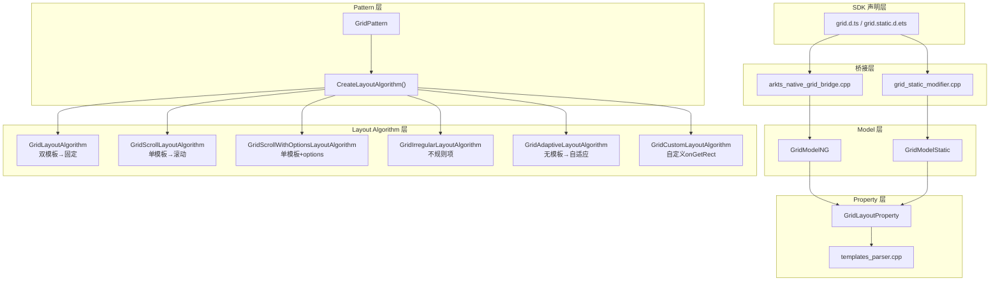
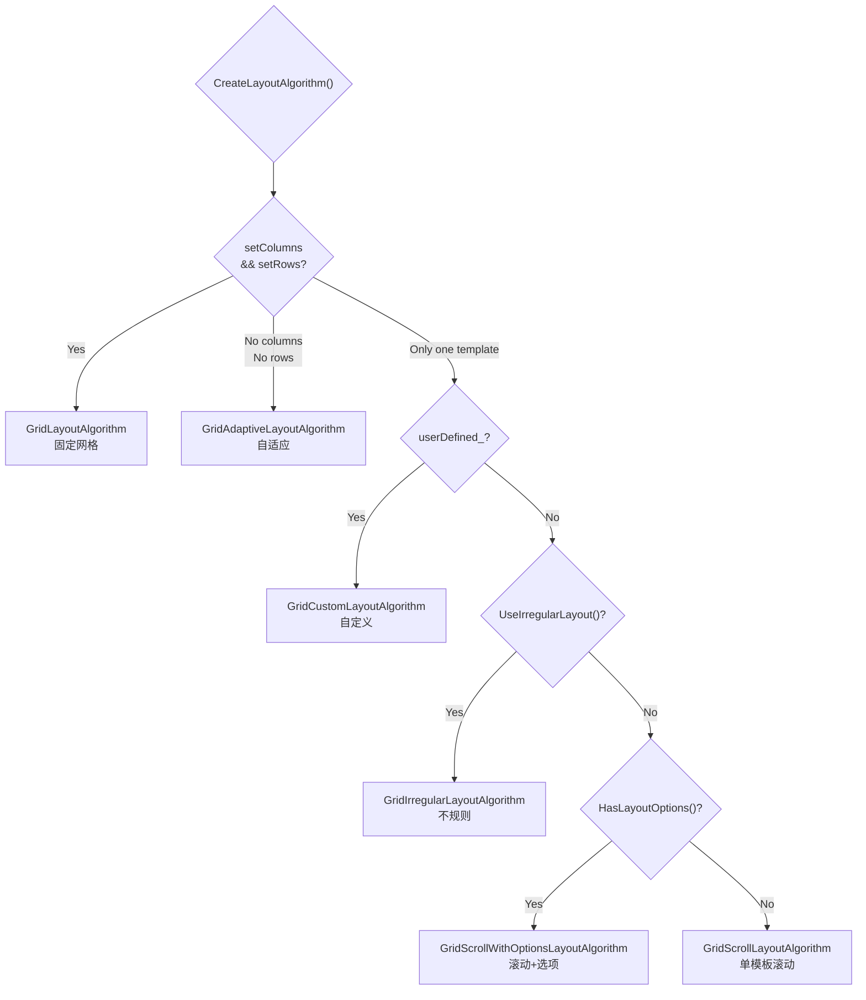

# 架构设计
> 确认目标仓和模块的架构约束、关键设计决策、Spec 拆分方向。

## 设计元数据

| Field | Content |
|-------|---------|
| Design ID | DESIGN-Func-05-03-04 |
| 关联需求 | 已有能力补录（无独立 requirement.md） |
| 关联 Epic | Grid/GridItem 组件规格补录 |
| 目标 Feature | Feat-01~06: Grid/GridItem 全量规格补录 |
| 复杂度 | 复杂 |
| 目标版本 | API 7–26 |
| Owner | ArkUI SIG |
| 状态 | Baselined（已有实现补录） |

## 需求基线

| 项 | 补充说明 |
|----|----------|
| Grid 布局算法分发 | 后端根据模板/选项参数组合实例化6种不同布局算法，每种有不同行为 |
| columnsTemplate/ItemFillPolicy 互斥 | 两者不可同时生效，设置一个自动 reset 另一个 |
| 双模板→固定网格 | columnsTemplate+rowsTemplate → 非滚动静态网格 |
| DEFAULT 对齐=居中 | GridItemAlignment.DEFAULT 实际行为是居中对齐，非"默认不处理" |
| layoutDirection 仅自适应生效 | 滚动模式下轴向由模板决定，layoutDirection 无效 |
| irregular_ 仅 rowSpan>1 触发 | columnSpan>1 不触发 irregular_=true，使用 GridScrollWithOptionsLayoutAlgorithm；与开发者直觉不符 |
| userDefined_ 优先于 irregular_ | CreateLayoutAlgorithm() 分发中 userDefined_ 先于 irregular_ 判断 |
| 自适应网格不可滚动 | GridAdaptiveLayoutAlgorithm 的 IsConfiguredScrollable()=false；溢出项被裁剪 |
| GridCustomLayoutAlgorithm 需双回调 | onGetStartIndexByIndex + onGetStartIndexByOffset 必须同时存在才触发 userDefined_=true |
| Grid 继承 ScrollablePattern | 所有滚动基础设施来自 ScrollablePattern；Grid 在 OnModifyDone 中初始化滚动 |
| scrollBar 默认值版本变更 | API 7-9 默认 Off；API 10+ 默认 Auto |
| onScroll 已废弃 | @since 12 标记 DEPRECATED；迁移到 onDidScroll |
| 双拖拽系统共存 | 旧系统(GridEventHub::GetEditable()) + 新系统(GridItemDragManager)；editMode 控制旧系统 |
| 拖拽状态机 | IDLE→LONG_PRESS→DRAGGING；长按 1.05x 缩放+z-index=100 |
| 拖拽禁用鼠标滚动 | onItemDragStart 注册后 GetIsAllowMouse()=false |
| GridItemPattern 继承 SelectableItemPattern | 选择能力来自基类；MarkIsSelected/FireSelectChangeEvent |
| Span 属性变更触发父级重布局 | rowStart/rowEnd/columnStart/columnEnd setter 调用 ResetGridLayoutInfoAndMeasure |
| C-API regularSize 硬编码 [1,1] | C-API 调用者的 regularSize 设置被忽略 |
| C-API 缺少 @systemapi 回调 | onGetStartIndexByOffset/onGetStartIndexByIndex 未暴露在 C-API |
| C-API editMode/multiSelectable/layoutDirection 仅内部 | 无公开 C-API 属性 ID；开发者无法通过公开 C-API 设置 |

## 上下文和现状

### 涉及仓和模块

| 仓库 | 补充架构说明 |
|------|--------------|
| ace_engine | Grid/GridItem 全量实现，含 Pattern/Model/Property/LayoutAlgorithm/C-API |
| interface/sdk-js | Grid/GridItem 动态/静态 SDK 类型定义 |

### 调用链层级分析

| 层 | 模块 | 职责 | 修改类型 |
|----|------|------|----------|
| SDK 声明层 | `interface/sdk-js/api/arkui/component/grid.static.d.ets`, `grid.d.ts` | 公开 API 签名与 @since 版本标注 | 无修改（补录） |
| ArkTS 前端层 | `frameworks/bridge/declarative_frontend/jsview/` + `arkts_native_grid_bridge.cpp` | ArkTS → C++ Model 桥接 | 无修改 |
| Model 层 | `frameworks/core/components_ng/pattern/grid/grid_model.h`, `grid_model_ng.h` | 属性写入、GridLayoutOptions 传递 | 无修改 |
| Pattern 层 | `frameworks/core/components_ng/pattern/grid/grid_pattern.h/.cpp` | 算法分发、滚动控制、事件注册 | 无修改 |
| Property 层 | `frameworks/core/components_ng/pattern/grid/grid_layout_property.h/.cpp` | 模板/间距/方向/缓存等属性存储与 dirty flag | 无修改 |
| Layout Algorithm 层 | 6种布局算法 (GridLayoutAlgorithm, GridScrollLayoutAlgorithm, GridScrollWithOptionsLayoutAlgorithm, GridIrregularLayoutAlgorithm, GridAdaptiveLayoutAlgorithm, GridCustomLayoutAlgorithm) | 各模式下的 Measure/Layout 计算 | 无修改 |
| 模板解析层 | `frameworks/core/components_ng/property/templates_parser.cpp` | fr/px/%/repeat 语法解析 | 无修改 |
| C-API 层 | `frameworks/core/interfaces/native/node/grid_modifier.h/.cpp`, `interfaces/native/node/grid_layout_option.h` | Native Node 属性设置 | 无修改 |

### 适用架构规则

| Rule ID | 适用原因 | 设计结论 | 验证方式 |
|---------|----------|----------|----------|
| OH-ARCH-LAYERING | SDK→Bridge→Model→Pattern→Property→Algorithm 6层调用链 | 调用方向严格从上到下，无跨层违规 | 代码评审 |
| OH-ARCH-API-LEVEL | columnsTemplate 新增 ItemFillPolicy overload (@since 22) | Public API，无权限变更，新增 SysCap 无 | API 评审 |
| OH-ARCH-ERROR-LOG | Grid 无新增错误码 | 无新增错误码/日志 | 单测 |

## 不涉及项承接

| 维度 | 设计结论 |
|------|----------|
| 安全与权限 | Grid 组件无权限要求，不涉及 |
| IPC/SAF | Grid 组件不涉及跨进程调用 |
| 数据持久化 | Grid 不持久化数据 |
| 多进程 | Grid 不涉及多进程 |

## 关键设计决策

| 决策 ID | 问题 | 推荐方案 | 探索过的替代方案 | 取舍理由 | 影响 |
|---------|------|----------|-----------------|----------|------|
| ADR-1 | 6种布局算法如何分发？ | 在 CreateLayoutAlgorithm() 中按条件级联判断：先判断有无模板→再判断双模板/单模板→再在单模板内判断 userDefined/irregular/options | 1) 每种算法注册到工厂 map 2) 用 enum 显式选择算法 | 级联判断简单直接，与历史实现一致；工厂方式需新增 enum 类型；显式选择增加 API 面 | Feat-01 覆盖双模板和单模板基础滚动 |
| ADR-2 | columnsTemplate 与 ItemFillPolicy 互斥如何实现？ | 设置一个时 ACE_RESET_LAYOUT_PROPERTY 另一个 | 1) 允许共存优先级覆盖 2) 抛异常 | 互斥符合语义：两者都定义列结构不可同时生效；抛异常增加开发者负担 | AC-3.1, AC-3.2 |
| ADR-3 | 双模板模式如何禁用滚动？ | IsConfiguredScrollable() 返回 false + OnModifyDone 中设 scrollBar(OFF) | 1) 允许双模板滚动 2) 双模板自动降级为单模板 | 双模板时行列数固定所有项可见无溢出不需要滚动；降级失去开发者意图 | AC-1.2 |
| ADR-4 | DEFAULT 对齐为什么是居中？ | OffsetByAlign() 实现 Center 对齐；注释"only support Alignment.Center now" | 1) DEFAULT=不处理（保持子项原始位置） 2) DEFAULT=居中 | 当前实现固定为居中；改为不处理需改源码行为（违反"实现即规格"原则） | AC-4.3 |
| ADR-5 | layoutDirection 在滚动模式下的行为？ | 滚动模式由模板决定轴向，layoutDirection 不影响轴向，仅在自适应模式生效 | 1) layoutDirection 在所有模式生效 2) 增加新属性控制滚动轴向 | 滚动模式由模板决定更直观（columnsTemplate→垂直）；增加新属性增加 API 面 | AC-2.3 |
| ADR-6 | irregular_ 标志语义？ | 只有 rowSpan>1 才触发 irregular_=true；columnSpan>1 不触发，走 GridScrollWithOptionsLayoutAlgorithm | 1) 任何跨列都触发 irregular_ 2) 按面积阈值触发 | rowSpan>1 导致多行占用需要 gridMatrix_；columnSpan>1 仅单行内偏移不需要矩阵；按面积阈值过于复杂 | Feat-02 AC-1.1 |
| ADR-7 | userDefined_ 与 irregular_ 优先级？ | CreateLayoutAlgorithm() 中 userDefined_ 先判断；若 userDefined_=true 则跳过 irregular_ 检查 | 1) irregular_ 优先 2) 合并为同一判断 | 自定义布局需要双回调控制全局起始位置，优先级高于局部不规则；合并失去灵活性 | Feat-02 AC-2.6 |
| ADR-8 | 自适应网格为何不可滚动？ | GridAdaptiveLayoutAlgorithm 的 IsConfiguredScrollable()=false；行列数由 cellLength/maxCount/minCount 动态计算，溢出被裁剪 | 1) 允许自适应滚动 2) 溢出项自动隐藏 | 自适应模式下行列数随容器尺寸变化，滚动目标不明确；允许滚动需定义"一页"概念增加复杂度 | Feat-02 AC-3.7 |
| ADR-9 | GridCustomLayoutAlgorithm 双回调要求？ | onGetStartIndexByIndex + onGetStartIndexByOffset 必须同时存在；缺任一则 userDefined_=false | 1) 仅需 onGetRectByIndex 2) 允许仅设一个回调 | 滚动恢复需要两种起始位置计算（按索引和按偏移）；仅设一个无法正确恢复滚动位置 | Feat-02 AC-4.1 |
| ADR-10 | Grid 滚动基础设施来源？ | Grid 继承 ScrollablePattern；所有滚动控制/事件/Scroller 方法由基类提供；Grid 在 OnModifyDone 中初始化 | 1) Grid 自行实现所有滚动逻辑 2) 混合继承+自行实现 | 继承 ScrollablePattern 保持与 List/WaterFlow 一致的滚动行为；自行实现增加维护成本和一致性风险 | Feat-03 AC-1.1 |
| ADR-11 | scrollBar 默认值版本变更？ | API 7-9 默认 Off；API 10+ 默认 Auto；OnModifyDone 中检测 IsConfiguredScrollable()=false 时强制设 OFF | 1) 所有版本默认 Auto 2) 所有版本默认 Off | API 10 变更符合用户期望（默认可见滚动条）；强制 OFF 在静态网格下合理（无溢出不需要滚动条） | Feat-03 AC-1.2 |
| ADR-12 | 双拖拽系统如何共存？ | 旧系统(GridEventHub) 通过 GetEditable() 守卫；新系统(GridItemDragManager) 在 editMode=true 时工作；两者注册不同事件 | 1) 仅保留新系统 2) 仅保留旧系统 | 保留旧系统维持向后兼容；新系统提供状态机驱动和动画支持；完全移除旧系统可能破坏现有开发者代码 | Feat-04 AC-1.1 |
| ADR-13 | 拖拽动画参数为何不可配置？ | InterpolatingSpring(0,1,400,38)、1.05x 缩放、59vp/26vp 热区均为硬编码 | 1) 提供 API 让开发者自定义 2) 提取为主题常量 | 硬编码保持一致性体验；提供 API 增加复杂度且开发者调参易导致体验不一致 | Feat-04 AC-3.1 |
| ADR-14 | GridItem 选择能力如何实现？ | GridItemPattern 继承 SelectableItemPattern；选择/取消通过 MarkIsSelected + FireSelectChangeEvent；双事件触发(selectChangeEvent_ + onSelect_) | 1) GridItemPattern 自行实现选择逻辑 2) 仅触发 onSelect_ | 继承 SelectableItemPattern 保持与 ListItem 一致的选择行为；自行实现增加维护成本 | Feat-05 AC-3.1 |
| ADR-15 | Span 属性变更如何触发父级重布局？ | rowStart/rowEnd/columnStart/columnEnd setter 中调用 ResetGridLayoutInfoAndMeasure；Grid 重新计算布局信息 | 1) 延迟重布局到下一帧 2) 由 Grid 主动监听子项属性变更 | setter 中立即触发保证布局一致性；延迟可能导致中间帧布局错误 | Feat-05 AC-2.4 |

## 设计骨架

### 骨架范围

| 骨架项 | 目标 | 不包含 | 验证方式 |
|--------|------|--------|----------|
| 算法分发机制 | 6种算法实例化条件全覆盖 | 滚动事件/编辑/拖拽 | UT: CreateLayoutAlgorithm |
| 双模板静态网格 | 固定行列布局+间距+对齐 | 滚动控制 | UT: GridLayoutAlgorithm |
| 单模板滚动网格 | 单轴滚动+间距+缓存+对齐 | 滚动条/edgeEffect | UT: GridScrollLayoutAlgorithm |
| ItemFillPolicy | 响应式列填充+互斥 | Scroller | UT: ItemFillPolicy 断点映射 |

### 骨架 Spec 拆分

| Task ID | 目标 | 受影响文件 | AC |
|---------|------|------------|----|
| TASK-SKELETON-1 | Feat-01 Spec: 固定行列与单轴滚动布局 | Feat-01-grid-fixed-scroll-layout-spec.md | AC-1.1–AC-6.3 |
| TASK-SKELETON-2 | Feat-02 Spec: 不规则、自适应与自定义布局 | Feat-02-grid-irregular-adaptive-custom-layout-spec.md | AC-1.1–AC-6.2 |
| TASK-SKELETON-3 | Feat-03 Spec: 滚动控制、滚动条与事件 | Feat-03-grid-scroll-scrollbar-events-spec.md | AC-1.1–AC-8.2 |
| TASK-SKELETON-4 | Feat-04 Spec: 编辑模式与拖拽 | Feat-04-grid-edit-mode-drag-spec.md | AC-1.1–AC-8.4 |
| TASK-SKELETON-5 | Feat-05 Spec: GridItem 布局与选择 | Feat-05-grid-item-layout-selection-spec.md | AC-1.1–AC-5.6 |
| TASK-SKELETON-6 | Feat-06 Spec: C API 与多范式接口 | Feat-06-grid-capi-multi-paradigm-spec.md | AC-1.1–AC-6.2 |

## 后续 Task 拆分

| Task ID | 目标 | 受影响文件 | 依赖 |
|---------|------|------------|------|
| TASK-GRID-01 | Feat-01 规格补录 | Feat-01-grid-fixed-scroll-layout-spec.md | — |
| TASK-GRID-02 | Feat-02 规格补录 | Feat-02-grid-irregular-adaptive-custom-layout-spec.md | TASK-GRID-01 |
| TASK-GRID-03 | Feat-03 规格补录 | Feat-03-grid-scroll-scrollbar-events-spec.md | TASK-GRID-01 |
| TASK-GRID-04 | Feat-04 规格补录 | Feat-04-grid-edit-mode-drag-spec.md | TASK-GRID-01 |
| TASK-GRID-05 | Feat-05 规格补录 | Feat-05-grid-item-layout-selection-spec.md | TASK-GRID-01 |
| TASK-GRID-06 | Feat-06 规格补录 | Feat-06-grid-capi-multi-paradigm-spec.md | TASK-GRID-01 |

## API 签名、Kit 与权限

### 新增 API

> 本规格为存量补录，以下 API 已存在于 SDK。

| API 签名 | 类型 | Kit | d.ts 位置 | 权限要求 | SysCap |
|----------|------|-----|-----------|----------|--------|
| `Grid(scroller?, layoutOptions?)` | Public | ArkUI | `grid.d.ts:261-293`, `grid.static.d.ets:767-772` | 无 | SystemCapability.ArkUI.ArkUI.Full |
| `columnsTemplate(string)` | Public | ArkUI | `grid.d.ts:636`, `grid.static.d.ets:359` | 无 | SystemCapability.ArkUI.ArkUI.Full |
| `columnsTemplate(string|ItemFillPolicy)` | Public | ArkUI | `grid.d.ts:649`, `grid.static.d.ets:359` | 无 | SystemCapability.ArkUI.ArkUI.Full |
| `rowsTemplate(string)` | Public | ArkUI | `grid.d.ts:679`, `grid.static.d.ets:369` | 无 | SystemCapability.ArkUI.ArkUI.Full |
| `columnsGap(Length)` | Public | ArkUI | `grid.d.ts:709`, `grid.static.d.ets:379` | 无 | SystemCapability.ArkUI.ArkUI.Full |
| `rowsGap(Length)` | Public | ArkUI | `grid.d.ts:739`, `grid.static.d.ets:389` | 无 | SystemCapability.ArkUI.ArkUI.Full |
| `cachedCount(number)` | Public | ArkUI | `grid.d.ts:954`, `grid.static.d.ets:470` | 无 | SystemCapability.ArkUI.ArkUI.Full |
| `cachedCount(number, boolean)` | Public | ArkUI | `grid.d.ts:972`, `grid.static.d.ets:480` | 无 | SystemCapability.ArkUI.ArkUI.Full |
| `layoutDirection(GridDirection)` | Public | ArkUI | `grid.d.ts:1170`, `grid.static.d.ets:540` | 无 | SystemCapability.ArkUI.ArkUI.Full |
| `alignItems(GridItemAlignment)` | Public | ArkUI | `grid.d.ts:1512`, `grid.static.d.ets:667` | 无 | SystemCapability.ArkUI.ArkUI.Full |
| `syncLoad(boolean)` | Public | ArkUI | `grid.d.ts:1540`, `grid.static.d.ets:712` | 无 | SystemCapability.ArkUI.ArkUI.Full |
| `GridLayoutOptions` | Public | ArkUI | `grid.d.ts:121-233`, `grid.static.d.ets:116-189` | 无 | SystemCapability.ArkUI.ArkUI.Full |
| `GridLayoutOptions.onGetIrregularSizeByIndex` | Public | ArkUI | `grid.d.ts:155`, `grid.static.d.ets:137` | 无 | SystemCapability.ArkUI.ArkUI.Full |
| `GridLayoutOptions.onGetRectByIndex` | Public | ArkUI | `grid.d.ts:195`, `grid.static.d.ets:165` | 无 | SystemCapability.ArkUI.ArkUI.Full |
| `GridLayoutOptions.onGetStartIndexByOffset` | System | ArkUI | `grid.d.ts:223`, `grid.static.d.ets:183` | 无 | SystemCapability.ArkUI.ArkUI.Full |
| `GridLayoutOptions.onGetStartIndexByIndex` | System | ArkUI | `grid.d.ts:233`, `grid.static.d.ets:189` | 无 | SystemCapability.ArkUI.ArkUI.Full |
| `cellLength(number)` | Public | ArkUI | `grid.d.ts:760`, `grid.static.d.ets:398` | 无 | SystemCapability.ArkUI.ArkUI.Full |
| `maxCount(number)` | Public | ArkUI | `grid.d.ts:816`, `grid.static.d.ets:416` | 无 | SystemCapability.ArkUI.ArkUI.Full |
| `minCount(number)` | Public | ArkUI | `grid.d.ts:848`, `grid.static.d.ets:428` | 无 | SystemCapability.ArkUI.ArkUI.Full |
| `scrollBar(BarState)` | Public | ArkUI | `grid.d.ts:1033`, `grid.static.d.ets:506` | 无 | SystemCapability.ArkUI.ArkUI.Full |
| `scrollBarColor(Color\|number\|string\|Resource)` | Public | ArkUI | `grid.d.ts:1056`, `grid.static.d.ets:514` | 无 | SystemCapability.ArkUI.ArkUI.Full |
| `scrollBarWidth(number\|string\|Resource)` | Public | ArkUI | `grid.d.ts:1080`, `grid.static.d.ets:522` | 无 | SystemCapability.ArkUI.ArkUI.Full |
| `edgeEffect(EdgeEffect, EdgeEffectOptions?)` | Public | ArkUI | `grid.d.ts:1130`, `grid.static.d.ets:532` | 无 | SystemCapability.ArkUI.ArkUI.Full |
| `nestedScroll(NestedScrollOptions)` | Public | ArkUI | `grid.d.ts:1192`, `grid.static.d.ets:552` | 无 | SystemCapability.ArkUI.ArkUI.Full |
| `enableScrollInteraction(boolean)` | Public | ArkUI | `grid.d.ts:1240`, `grid.static.d.ets:564` | 无 | SystemCapability.ArkUI.ArkUI.Full |
| `friction(number\|Resource)` | Public | ArkUI | `grid.d.ts:1264`, `grid.static.d.ets:572` | 无 | SystemCapability.ArkUI.ArkUI.Full |
| `editMode(boolean)` | Public | ArkUI | `grid.d.ts:1296`, `grid.static.d.ets:580` | 无 | SystemCapability.ArkUI.ArkUI.Full |
| `enableEditMode(boolean)` | Public | ArkUI | `grid.d.ts:1318`, `grid.static.d.ets:586` | 无 | SystemCapability.ArkUI.ArkUI.Full |
| `multiSelectable(boolean)` | Public | ArkUI | `grid.d.ts:1342`, `grid.static.d.ets:594` | 无 | SystemCapability.ArkUI.ArkUI.Full |
| `supportAnimation(boolean)` | Public | ArkUI | `grid.d.ts:1366`, `grid.static.d.ets:602` | 无 | SystemCapability.ArkUI.ArkUI.Full |
| `editModeOptions(EditModeOptions)` | Public | ArkUI | `grid.d.ts:1404`, `grid.static.d.ets:622` | 无 | SystemCapability.ArkUI.ArkUI.Full |
| `onItemDragStart(OnItemDragStartCallback)` | Public | ArkUI | `grid.d.ts:1440`, `grid.static.d.ets:636` | 无 | SystemCapability.ArkUI.ArkUI.Full |
| `onItemDragEnter/Move/Leave/Drop` | Public | ArkUI | `grid.d.ts:1464-1570`, `grid.static.d.ets:644-660` | 无 | SystemCapability.ArkUI.ArkUI.Full |
| `onScrollIndex(first, last?)` | Public | ArkUI | `grid.d.ts:1584`, `grid.static.d.ets:664` | 无 | SystemCapability.ArkUI.ArkUI.Full |
| `onDidScroll/onWillScroll/onScrollFrameBegin` | Public | ArkUI | inherited from ScrollableCommonMethod | 无 | SystemCapability.ArkUI.ArkUI.Full |
| `GridItem(value?: GridItemOptions)` | Public | ArkUI | `grid_item.d.ts` | 无 | SystemCapability.ArkUI.ArkUI.Full |
| `GridItemOptions {style?: GridItemStyle}` | Public | ArkUI | `grid_item.d.ts` | 无 | SystemCapability.ArkUI.ArkUI.Full |
| `GridItemStyle.NONE/PLAIN` | Public | ArkUI | `grid_item.d.ts` | 无 | SystemCapability.ArkUI.ArkUI.Full |
| `rowStart/rowEnd/columnStart/columnEnd` | Public | ArkUI | `grid_item.d.ts` | 无 | SystemCapability.ArkUI.ArkUI.Full |
| `selectable(boolean)` | Public | ArkUI | `grid_item.d.ts` | 无 | SystemCapability.ArkUI.ArkUI.Full |
| `selected(boolean)` | Public | ArkUI | `grid_item.d.ts` | 无 | SystemCapability.ArkUI.ArkUI.Full |
| `NODE_GRID_*` C-API 属性枚举 | Public | ArkUI | `grid_modifier.h/.cpp` | 无 | SystemCapability.ArkUI.ArkUI.Full |
| `NODE_GRID_ITEM_*` C-API 属性枚举 | Public | ArkUI | `grid_item_modifier.h/.cpp` | 无 | SystemCapability.ArkUI.ArkUI.Full |
| `OH_ArkUI_GridLayoutOptions_*` C-API 函数族 | Public | ArkUI | `grid_layout_option.h` | 无 | SystemCapability.ArkUI.ArkUI.Full |

### 变更/废弃 API

无变更或废弃。

## 构建系统影响

### BUILD.gn 变更

无变更。所有源文件已存在于 ace_engine 构建目标中。

### bundle.json 变更

无变更。

## 可选设计扩展

### 架构图



### 算法与状态机



### 数据模型设计

| 类型 | C++ 结构 | 字段 | 说明 |
|------|----------|------|------|
| GridLayoutOptions | `grid_layout_options.h:GridLayoutOptions` | regularSize, irregularIndexes, getSizeByIndex, getRectByIndex, getStartIndexByOffset, getStartIndexByIndex | 不规则网格配置 |
| GridItemSize | `grid_layout_options.h:GridItemSize` | rows=1, columns=1 | 不规则项尺寸 |
| GridItemRect | `grid_layout_options.h:GridItemRect` | rowStart=-1, rowSpan=1, columnStart=-1, columnSpan=1 | 不规则项位置 |
| GridStartLineInfo | `grid_layout_options.h:GridStartLineInfo` | startIndex=0, startLine=0, startOffset=0.0, totalOffset=0.0 | 起始行信息（@systemapi） |
| PresetFillType | `constants.h:PresetFillType` | BREAKPOINT_DEFAULT=0, BREAKPOINT_SM1MD2LG3=1, BREAKPOINT_SM2MD3LG5=2 | ItemFillPolicy 内部映射 |

### 接口参数规约

| 接口 | 参数 | 类型 | 合法范围 | 非法处理 | 边界说明 |
|------|------|------|----------|----------|----------|
| columnsTemplate | value | string | 有效的 fr/px/%/auto/repeat 语法或空字符串 | 空字符串 → 存储为 "1fr" | 空字符串视为未设置 |
| ItemFillPolicy | fillType | PresetFillType | 0/1/2 | -1(NONE) → 无响应式填充 | 与 columnsTemplate 互斥 |
| columnsGap | value | Dimension (Length) | ≥0 | 超出可用空间 → clamp 到 0 | (N-1)×gap > totalSize → gap=0 |
| cachedCount | value | int32_t | ≥0 | 默认由 UpdateDefaultCachedCount 自动调整 | 内部乘以 crossCount |
| layoutDirection | value | FlexDirection | ROW/COLUMN/ROW_REVERSE/COLUMN_REVERSE | 滚动模式下无效 | 仅自适应模式影响轴向 |
| alignItems | value | GridItemAlignment | DEFAULT(0)/STRETCH(1) | DEFAULT=居中(非"不处理") | STRETCH 跳过有 selfIdealSize 的子项 |
| regularSize | value | [number, number] | rows≥1, columns≥1 | C-API 硬编码 [1,1] | [0,0] 视为 regularSize |
| irregularIndexes | value | number[] | index≥0 | 超出范围索引被忽略 | 默认 [] |
| onGetIrregularSizeByIndex | return | GridItemSize | rows≥1, columns≥1 | rows>1 触发 irregular_=true | columns>1 不触发 irregular_ |
| onGetRectByIndex | return | GridItemRect | rowStart≥0, columnStart≥0, rowSpan≥1, columnSpan≥1 | rowStart/columnStart<0 → 不渲染 | rowSpan/columnSpan=0 → 不渲染 |
| onGetStartIndexByIndex/Offset | return | GridStartLineInfo | startIndex≥0, startLine≥0 | @systemapi；缺任一则 userDefined_=false | 两者必须同时存在 |
| cellLength | value | number | ≥0 | =0 退化为 1 列 | 仅自适应模式 |
| maxCount/minCount | value | number | ≥1 | 约束 crossCount 上下限 | 仅自适应模式 |
| scrollBar | value | BarState | Off/Auto/On | API<10 默认 Off；API≥10 默认 Auto | 静态网格强制 OFF |
| scrollBarColor | value | Color\|number\|string\|Resource | 任意颜色值 | 默认 '#182431'(40%透明度) | Resource 重载 @since 22 |
| scrollBarWidth | value | number\|string\|Resource | ≥0 | 默认 4vp | Resource 重载 @since 26 |
| edgeEffect | value | EdgeEffect | Spring/Fade/None | EdgeEffectOptions.canOverScroll 控制弹性过滚 | 默认 None |
| nestedScroll | value | NestedScrollMode | PARENT_FIRST/SELF_ONLY/SELF_FIRST | forward/backward 各自独立 | 默认 SELF_ONLY |
| enableScrollInteraction | value | boolean | true/false | false 仅禁用用户交互，不影响程序化滚动 | 默认 true |
| friction | value | number\|Resource | >0 | 默认值随平台版本变化 | — |
| flingSpeedLimit | value | number | ≥0 | 0=禁用 fling；默认 9000vp/s | 负值=无效 |
| editMode | value | boolean | true/false | 控制 GridEventHub::GetEditable() 守卫 | 默认 false |
| enableEditMode | value | boolean\|undefined | true/false/undefined | @since 26；支持 $$ 双向绑定 | undefined=不改变当前状态 |
| multiSelectable | value | boolean | true/false | 仅鼠标拖拽多选 | 默认 false |
| supportAnimation | value | boolean | true/false | InterpolatingSpring(0,1,400,38) 动画 | 默认 false |
| editModeOptions | value | EditModeOptions | enableGatherSelectedItemsAnimation, onGetPreviewBadge, useDefaultMultiSelectStyle | @since 23；useDefaultMultiSelectStyle @since 26 | — |
| onItemDragStart | return | CustomBuilder\|ClassValue\|null | null/undefined → 默认快照预览 | — | — |
| GridItemStyle | value | NONE/PLAIN | 0/1 | NONE: 无圆角/动画；PLAIN: 主题圆角+hover/press 动画 | 默认 NONE |
| rowStart/rowEnd/columnStart/columnEnd | value | number | ≥0 | span = End-Start+1(min 1)；变更触发 ResetGridLayoutInfoAndMeasure | 0-based index |
| selectable | value | boolean | true/false | false 取消现有选中(MarkIsSelected(false)) | 默认 false |
| selected | value | boolean | true/false | @since 10 支持 $$ 双向绑定 | @since 8-9 单向 |

## 详细设计

### 算法分发机制

核心分发逻辑位于 `grid_pattern.cpp:111-149` (`CreateLayoutAlgorithm()`)：

```
1. !setColumns && !setRows → GridAdaptiveLayoutAlgorithm
2. setColumns && setRows → GridLayoutAlgorithm (静态)
3. 仅一个模板 → 检查子条件:
   a. userDefined_ → GridCustomLayoutAlgorithm
   b. UseIrregularLayout() → GridIrregularLayoutAlgorithm
   c. HasLayoutOptions() → GridScrollWithOptionsLayoutAlgorithm
   d. 否则 → GridScrollLayoutAlgorithm
```

`setColumns` 定义（`grid_pattern.cpp:117`）：`itemFillPolicy.has_value() || columnsTemplate.has_value()`
`setRows` 定义（`grid_pattern.cpp:119`）：`rowsTemplate.has_value()`

关键观察：
- `itemFillPolicy.has_value()` 使 `setColumns=true`，等效于设置了列模板
- 双模板判断中 `setColumns && setRows` 包含 `itemFillPolicy + rowsTemplate` 的情况

### 模板字符串解析

`templates_parser.cpp:340-392` (`ParseArgsWithoutAutoFill()`):

计算流程：
1. `sizeLeft = totalSize - (tokenCount-1) * gap`
2. 如果 `sizeLeft < 0` → gap 被设为 0
3. `frSizeSum = sizeLeft * (100 - peSum) / 100 - pxSum`
4. px 项：实际值 = num，优先分配
5. % 项：实际值 = sizeLeft * num / 100
6. fr 项：实际值 = frSizeSum / frSum * coefficient

优先级：px(绝对) > %(百分比) > fr(剩余空间分数)

### GridItemAlignment 行为

- **DEFAULT**：`OffsetByAlign()` (`grid_layout_algorithm.cpp:23-30`) 计算居中偏移
  - 固定网格：center 对齐
  - 滚动网格：TOP_CENTER（垂直）/ CENTER_LEFT（水平）
- **STRETCH**：`AdjustChildrenHeight()` (`grid_layout_base_algorithm.cpp:140-189`) 第二遍测量
  - 设置 `selfIdealSize.MainSize = lineHeight` 强制子项填满
  - 跳过条件：子项已有 selfIdealSize 或已有 ≥ lineHeight

### 不规则布局算法分发 (Feat-02)

`UpdateIrregularFlag()` (`grid_layout_property.cpp:138-161`) 决定 irregular_/userDefined_ 标志：

- **irregular_**：仅当 onGetIrregularSizeByIndex 返回 rows>1 时设为 true；columns>1 不触发
- **userDefined_**：仅当 onGetStartIndexByIndex + onGetStartIndexByOffset 同时存在时设为 true
- 分发优先级：userDefined_ > irregular_ > HasLayoutOptions > 默认滚动

GridScrollWithOptionsLayoutAlgorithm 处理单行不规则（仅 columnSpan>1）：
- `GetCrossStartAndSpan()` 计算跨列偏移
- 使用 regularSize 定义常规项尺寸

GridIrregularLayoutAlgorithm 处理多行不规则（rowSpan>1）：
- `GridIrregularFiller` 使用 `gridMatrix_` 二维矩阵跟踪占用
- `lineHeightMap_` 自动扩展行数

GridAdaptiveLayoutAlgorithm 自适应布局：
- 无模板时使用 cellLength/maxCount/minCount 计算行列数
- `IsConfiguredScrollable()=false`，不可滚动
- `layoutDirection` 仅在此模式下影响轴向

GridCustomLayoutAlgorithm 自定义布局：
- 依赖 `onGetRectByIndex` 定义每个项的位置
- 依赖 `onGetStartIndexByIndex`/`onGetStartIndexByOffset` 恢复滚动位置

### 滚动控制与事件 (Feat-03)

Grid 继承 `ScrollablePattern`，在 `OnModifyDone()` 中初始化：
- 滚动手势（scrollable gesture）
- 滚动条（scrollBar 默认 Auto，API≥10）
- 边缘效果（edgeEffect）
- 滚动事件（onDidScroll/onWillScroll/onScrollFrameBegin 等）

关键行为：
- `IsConfiguredScrollable()=false` 时：scrollBar 强制 OFF，Scroller 方法 no-op
- `enableScrollInteraction=false` 仅禁用用户交互，不影响程序化 Scroller 调用
- `onItemDragStart` 注册后 `GetIsAllowMouse()=false`，禁用鼠标滚轮
- `scrollToIndex` 默认 align=AUTO（Grid 特有，不同于 List 的 CENTER）
- `onScrollFrameBegin` 返回 `ScrollResult{offsetRemain}`，支持多帧消费

### 编辑模式与拖拽 (Feat-04)

双拖拽系统：
- 旧系统：`GridEventHub::GetEditable()` 守卫，`editMode=true` 时启用
- 新系统：`GridItemDragManager` 状态机驱动

状态机：IDLE → LONG_PRESS → DRAGGING
- IDLE→LONG_PRESS：长按触发，1.05x 缩放+z-index=100
- LONG_PRESS→DRAGGING：拖动超过阈值，InterpolatingSpring(0,1,400,38) 交换动画
- 拖拽期间：附近项缩放 `(1 - sharped * 0.05)`，自动滚动热区 59vp(垂直)/26vp(水平)

### GridItem 布局与选择 (Feat-05)

`GridItemPattern` 继承 `SelectableItemPattern`：
- `MarkIsSelected()` + `FireSelectChangeEvent()` 触发双事件（selectChangeEvent_ + onSelect_）
- `selectable=false` 时取消现有选中

Span 属性行为：
- `span = max(1, End - Start + 1)`，最小值钳位为 1
- setter 中调用 `ResetGridLayoutInfoAndMeasure()` 触发父级 Grid 重布局

GridItemStyle：
- NONE(0)：无圆角，无 hover/press 动画
- PLAIN(1)：主题 borderRadius，hover blend + press blend 动画
- `UpdateGridItemStyle()` 支持运行时切换

### C-API 与多范式接口 (Feat-06)

C-API 通过 `DynamicModuleHelper` 加载 `libarkui_grid.z.so`：
- 两级 Modifier：static(implementation/) + dynamic(node/)
- `GridCustomModifier`：拖拽函数指针（onDragStart/Enter/Leave/Drop/End）
- `GridItemCustomModifier`：拖拽管理器 + 选择查询函数指针
- `UIGridEvent` 继承 `UIScrollableCommonEvent`，共享滚动事件注册

C-API 偏差：
- `regularSize` 硬编码 [1,1]（`grid_model_ng.cpp:958-959`）
- 缺少 `onGetStartIndexByOffset`/`onGetStartIndexByIndex`（@systemapi）
- `NODE_GRID_EDIT_MODE`/`MULTI_SELECTABLE`/`LAYOUT_DIRECTION` 仅内部 modifier，无公开属性 ID
- `attributeModifier` 支持 `AttributeModifier<GridAttribute>` 和 `AttributeModifier<CommonMethod>` 双分支

## 风险和开放问题

| 项 | 类型 | 影响 | 处理方式 | Owner |
|----|------|------|----------|-------|
| C-API regularSize 硬编码为 [1,1] | API | 中 | 规格标注 SDK vs C-API 偏差；C-API 调用者的 regularSize 设置无效 | ArkUI SIG |
| C-API 缺少 onGetStartIndexByOffset/onGetStartIndexByIndex | API | 低 | 规格标注 C-API 未覆盖 @systemapi 回调；后续 C-API 版本可能补充 | ArkUI SIG |
| DEFAULT=居中 与开发者直觉不符 | API | 低 | 规格明确标注 DEFAULT 行为=居中；开发者可设 STRETCH 获得填满效果 | ArkUI SIG |
| layoutDirection 在滚动模式无效 | API | 中 | 规格明确标注仅自适应模式生效；开发者误用时无运行时告警 | ArkUI SIG |
| irregular_ 仅 rowSpan>1 触发与直觉不符 | API | 中 | 规格明确标注 columnSpan>1 不触发 irregular_；走 GridScrollWithOptionsLayoutAlgorithm；开发者可能误认为跨列=不规则 | ArkUI SIG |
| 双拖拽系统共存可能行为差异 | 架构 | 低 | 旧系统(GridEventHub)+新系统(GridItemDragManager)共存；editMode 控制旧系统；细微行为差异可能存在 | ArkUI SIG |
| 拖拽动画参数不可配置 | API | 低 | InterpolatingSpring(0,1,400,38)/1.05x/59vp/26vp 均硬编码；开发者无法自定义 | ArkUI SIG |
| scrollBar 默认值版本变更 | 兼容性 | 中 | API 7-9 默认 Off；API 10+ 默认 Auto；跨版本行为不一致 | ArkUI SIG |
| onScroll DEPRECATED | API | 低 | @since 12 标记废弃；迁移到 onDidScroll；旧代码仍可运行 | ArkUI SIG |
| C-API editMode/multiSelectable/layoutDirection 仅内部 | API | 中 | 无公开 C-API 属性 ID；开发者无法通过公开 C-API 设置这些属性 | ArkUI SIG |

## 设计审批

- [x] 需求基线已确认，设计覆盖 P0/P1 AC
- [x] 不涉及项已承接，N/A 和展开项都有结论
- [x] 涉及仓和模块职责清楚
- [x] 调用链层级分析完整，每层覆盖到位
- [x] 适用架构规则已识别并形成设计结论
- [x] 分层和子系统边界合规
- [x] API 变更有签名、权限、错误码和兼容性说明
- [x] BUILD.gn/bundle.json 影响明确
- [x] 设计输出和后续 Task 拆分明确
- [x] 关键设计决策有理由和影响说明
- [x] 风险和开放问题有 Owner

**结论:** 通过（已有实现补录，Feat-01~06 全量规格已基线化）
