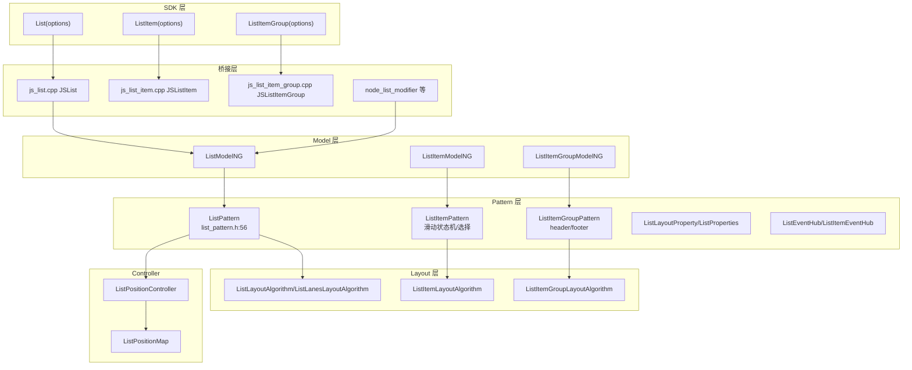

# 架构设计

> List/ListItem/ListItemGroup 列表组件功能域的架构设计文档，补录已有实现。List 是纵向/横向可滚动列表容器（继承 `SelectableContainerPattern`），ListItem 为列表项（支持滑动操作/选择/编辑），ListItemGroup 为可分组带 header/footer 的列表组。三者经 ListLayoutAlgorithm 协同渲染。

## 设计元数据

| 字段 | 内容 |
|------|------|
| Design ID | DESIGN-Func-05-03-05 |
| 关联需求 | 已有能力补录（无独立 requirement.md） |
| 关联 Epic | 无 |
| 目标 Feature | Feat-01 创建与核心布局（含懒加载/缓存）, Feat-02 滚动运动学与边缘效果, Feat-03 滚动可观测性与控制器, Feat-04 分组/粘性头尾/Header/Footer, Feat-05 选择与编辑模式, Feat-06 拖拽, Feat-07 ListItem 滑动操作 |
| 复杂度 | 复杂 |
| 目标版本 | API 7 起支持（多轮 @since 7/8/9/10/11/12/14/18/19/20/21/22/23/26） |
| Owner | ArkUI SIG |
| 状态 | Baselined（已有实现补录） |

## 需求基线

| 项 | 补充说明 |
|----|----------|
| 核心目标 | 列表容器，含 listDirection/lanes/alignListItem/divider/childrenMainSize/cachedCount/syncLoad/supportEmptyBranchInLazyLoading；滚动运动学（scrollBar/edgeEffect/contentStartOffset/contentEndOffset/friction/nestedScroll/scrollSnapAlign/chainAnimation/maintainVisibleContentPosition/stackFromEnd/focusWrapMode/backPressBehavior）；ListScroller 控制器与事件；分组 sticky header/footer；选择编辑模式；拖拽；ListItem 滑动操作 |
| 关键不变量 | List 默认 edgeEffect=SPRING（`list_pattern.h:62`）；ListPattern 继承 SelectableContainerPattern 提供选择基类；ListItem 滑动状态机 SWIPER_START/END/ACTION；sticky 在 ListAttribute（ListItemAttribute.sticky 已弃用） |

## 上下文和现状

### 涉及仓和模块

| 仓库 | 模块/路径 | 当前职责 | 本 Feature 影响 |
|------|-----------|----------|-----------------|
| ace_engine | `frameworks/core/components_ng/pattern/list/list_pattern.h/.cpp` | ListPattern 主逻辑，继承 SelectableContainerPattern，管理索引/手势/链动画/事件 | 核心调度层 |
| ace_engine | `frameworks/core/components_ng/pattern/list/list_item_pattern.h/.cpp` | ListItemPattern，滑动状态机/选择/删除区域 | Feat-05/07 |
| ace_engine | `frameworks/core/components_ng/pattern/list/list_item_group_pattern.h/.cpp` | ListItemGroupPattern，分组 header/footer/ShallowBuilder | Feat-04 |
| ace_engine | `frameworks/core/components_ng/pattern/list/list_layout_algorithm.h/.cpp` | ListLayoutAlgorithm + ListLanesLayoutAlgorithm | Feat-01 |
| ace_engine | `frameworks/core/components_ng/pattern/list/list_item_layout_algorithm.h` | ListItemLayoutAlgorithm(BoxLayoutAlgorithm) | Feat-01 |
| ace_engine | `frameworks/core/components_ng/pattern/list/list_item_group_layout_algorithm.h` | ListItemGroupLayoutAlgorithm | Feat-04 |
| ace_engine | `frameworks/core/components_ng/pattern/list/list_layout_property.h` | List 布局属性 | Feat-01/02 |
| ace_engine | `frameworks/core/components_ng/pattern/list/list_item_layout_property.h` | ListItem 布局属性 | Feat-05/07 |
| ace_engine | `frameworks/core/components_ng/pattern/list/list_item_group_layout_property.h` | ListItemGroup 布局属性 | Feat-04 |
| ace_engine | `frameworks/core/components_ng/pattern/list/list_properties.h` | ListProperties（sticky/divider 等） | Feat-02/04 |
| ace_engine | `frameworks/core/components_ng/pattern/list/list_divider_arithmetic.h` | 分隔线计算 | Feat-01 |
| ace_engine | `frameworks/core/components_ng/pattern/list/list_children_main_size.h` | childrenMainSize 共享解析 | Feat-01 |
| ace_engine | `frameworks/core/components_ng/pattern/list/list_position_controller.h/.cpp` | ListPositionController: ScrollableController | Feat-03 |
| ace_engine | `frameworks/core/components_ng/pattern/list/list_position_map.h` | 索引位置映射 | Feat-03 |
| ace_engine | `frameworks/core/components_ng/pattern/list/list_item_drag_manager.h/.cpp` | ListItemDragManager | Feat-06 |
| ace_engine | `frameworks/core/components_ng/pattern/list/list_event_hub.h` | ListEventHub | Feat-03/06 |
| ace_engine | `frameworks/core/components_ng/pattern/list/list_item_event_hub.h` | ListItemEventHub（删除区域回调） | Feat-07 |
| ace_engine | `frameworks/core/components_ng/pattern/list/list_paint_method.h` + `list_content_modifier.h` | 绘制/内容 modifier | Feat-02 |
| ace_engine | `frameworks/core/components_ng/pattern/list/list_model.h/.cpp` + `list_model_ng.h/.cpp` + `list_model_static.h/.cpp` | List Model | Feat-01~07 |
| ace_engine | `frameworks/core/components_ng/pattern/list/list_item_model*.h/.cpp` + `list_item_group_model*.h/.cpp` | ListItem/ListItemGroup Model | Feat-04/05/07 |
| ace_engine | `frameworks/bridge/declarative_frontend/jsview/js_list.cpp` + `js_list_item.cpp` + `js_list_item_group.cpp` | JSView 桥接 | 桥接层 |
| ace_engine | `frameworks/core/interfaces/native/node/node_list_modifier.{h,cpp}` + `node_list_item_modifier` + `node_list_item_group_modifier` | C-API modifier | Feat-01~07 |
| ace_engine | `frameworks/core/interfaces/native/implementation/list_modifier.cpp` 等 + `ui_list_event_accessor.cpp`/`list_scroller_accessor.cpp`/`list_item_swipe_action_manager_accessor.cpp`/`list_item_ops_accessor.cpp` | 生成 modifier/事件/控制器访问器 | Feat-03/06/07 |
| ace_engine | `interfaces/native/native_node.h` | C-API `ARKUI_NODE_LIST/ARKUI_NODE_LIST_ITEM/ARKUI_NODE_LIST_ITEM_GROUP` | Feat-01~07 |

### 调用链层级分析

| 层 | 模块 | 职责 | 修改类型 |
|----|------|------|----------|
| 1. SDK 层 | `ets/dynamic/component/list.d.ts` + `list_item.d.ts` + `list_item_group.d.ts` | 三组件 TS 类型声明 | 存量分析 |
| 2. JSView 层 | `jsview/js_list.cpp`/`js_list_item.cpp`/`js_list_item_group.cpp` | 解析三组件构造与属性方法，ListScroller 控制器 | 存量分析 |
| 3. node_modifier 层 | `core/interfaces/native/node/node_list_modifier.cpp` 等 | C-API 属性设置 + 事件绑定 | 存量分析 |
| 4. 生成 Modifier 层 | `core/interfaces/native/implementation/list_modifier.cpp` 等 + accessor | GeneratedModifier + 事件/控制器访问器 | 存量分析 |
| 5. Model 层 | `pattern/list/list_model_ng.cpp` 等 | Create/Set*/静态 FrameNode 访问器 | 存量分析 |
| 6. Pattern 层 | `pattern/list/list_pattern.cpp` 等 | 索引/手势/链动画/滑动状态机/分组/选择/拖拽 | 存量分析 |
| 7. Layout 层 | `pattern/list/list_layout_algorithm.cpp` 等 | 多 lanes/分组/divider/childrenMainSize 布局计算 | 存量分析 |
| 8. Event 层 | `list_event_hub.h`/`list_item_event_hub.h` | 滚动/拖拽/删除区域回调 | 存量分析 |
| 9. Controller 层 | `list_position_controller.cpp`/`list_position_map.h` | ListScroller 控制器方法实现 | 存量分析 |
| 10. C API 层 | `interfaces/native/native_node.h` | `ARKUI_NODE_LIST/ITEM/ITEM_GROUP` + 事件/属性枚举 | 存量分析 |

### 适用架构规则

| Rule ID | 适用原因 | 设计结论 | 验证方式 |
|---------|----------|----------|----------|
| OH-ARCH-LAYERING | List 涉及 SDK→JSView/Modifier→Model→Pattern→Layout/Event/Controller | 单向调用 | 代码评审 |
| OH-ARCH-API-LEVEL | 大量 @since 7~26 演进；editMode/onScroll/onItemDelete 等弃用 | 各属性标注 @since；弃用迁移 | API 评审/XTS |
| OH-ARCH-COMPONENT-BUILD | List 未组件化，属 ace_core_ng | 无需新增 target | 构建验证 |
| OH-ARCH-NO-COMPONENT | List 未组件化，JSView + Bridge + C-API 三路径共存 | ADR-1 已记录 | 代码评审 |

## 不涉及项承接

| 维度 | 设计结论 |
|------|----------|
| 性能 | 是 — 展开：cachedCount 懒加载、LazyForEach、childrenMainSize 精确预测量、syncLoad 分帧、supportEmptyBranchInLazyLoading |
| 安全与权限 | N/A |
| 兼容性 | 是 — 展开：editMode 弃用 9、onScroll 弃用 12、onItemDelete 弃用 9、ListItemAttribute.sticky 弃用 9（ListAttribute.sticky 保留）、chainAnimationOptions 为 systemapi |
| IPC/跨进程 | N/A |

## 关键设计决策

| 决策 ID | 问题 | 推荐方案 | 探索过的替代方案 | 取舍理由 | 影响 |
|---------|------|----------|-----------------|----------|------|
| ADR-1 | List 未组件化 — JSView + Bridge + C-API 三路径共存 | 保持三路径，最终汇聚 ListModelNG | 方案A：组件化；方案B：仅 Bridge | 与滚动容器框架深度耦合，组件化时机未成熟 | 三路径需一致 |
| ADR-2 | 默认 edgeEffect=SPRING | 构造 `SetEdgeEffect(EdgeEffect::SPRING,false)`（`list_pattern.h:62`） | 方案A：默认 None | 列表常见回弹体验 | Feat-02 |
| ADR-3 | sticky 在 List 而非 ListItem | ListAttribute.sticky(StickyStyle) 控制分组头尾吸附；ListItemAttribute.sticky 弃用 @9 | 方案A：保留 ListItem sticky | 头尾吸附是分组级语义，非单 item | Feat-04/05 |
| ADR-4 | 多 lanes 布局 — ListLanesLayoutAlgorithm | lanes>1 时用 ListLanesLayoutAlgorithm 多列均分；ItemFillPolicy @22 控制填充 | 方案A：固定单列 | 多列覆盖多场景 | Feat-01 |
| ADR-5 | 懒加载与缓存 — cachedCount + childrenMainSize | cachedCount 预加载；childrenMainSize 精确预测量减少跳变；syncLoad 分帧；supportEmptyBranchInLazyLoading 容空分支 | 方案A：全量加载 | 性能优化必备 | Feat-01 |
| ADR-6 | 滑动操作状态机 — ListItem 独立 | ListItemPattern 持 SWIPER_START/END/ACTION 状态机；ListItemSwipeActionManager(expand/collapse) @21；ListScroller.closeAllSwipeActions @11 | 方案A：List 管理 | 滑动是单 item 行为 | Feat-07 |
| ADR-7 | 弃用迁移 — editMode/onScroll/onItemDelete | editMode 弃用 @9（→multiSelectable/enableEditMode）；onScroll 弃用 @12（→onDidScroll）；onItemDelete 弃用 @9（→onItemMove） | 方案A：保留不弃用 | 并行过渡 | Feat-02/03/05/06 |
| ADR-8 | 分组 header/footer 双通道 — builder/ComponentContent | CustomBuilder(@9) 与 ComponentContent(@13) 双通道；ShallowBuilder 延迟构建 | 方案A：仅 builder | ComponentContent 支持运行时内容 | Feat-04 |
| ADR-9 | 控制器经 ListPositionController: ScrollableController | getItemRectInGroup/scrollToItemInGroup/closeAllSwipeActions/getVisibleListContentInfo 经 ListPositionController+ListPositionMap | 方案A：直接 Pattern | 控制器抽象复用 | Feat-03/07 |
| ADR-10 | chainAnimationOptions 为 systemapi | 链动画仅系统应用；ChainEdgeEffect/ChainAnimationOptions 标 systemapi | 方案A：公开 | 链动画为系统级特性 | Feat-02 |

## 设计骨架

### 骨架范围

| 骨架项 | 目标 | 不包含 | 验证方式 |
|--------|------|--------|----------|
| 创建与布局 | 三组件创建/lanes/divider/childrenMainSize/cachedCount/syncLoad + 布局类偏移 | 滚动运动学 | 单元测试 |
| 滚动运动学 | scrollBar/edgeEffect/friction/nestedScroll/scrollSnapAlign/chainAnimation/maintainVisibleContentPosition/stackFromEnd/focusWrapMode/backPressBehavior | 事件 | 单元测试 |
| 可观测与控制器 | ListScroller + 事件 + UIListEvent | 滑动操作 | 单元测试 |
| 分组/粘性 | header/footer + sticky + FLOATING | 选择 | 单元测试 |
| 选择编辑 | selectable/selected/multiSelectable/editModeOptions/enableEditMode | 拖拽 | 单元测试 |
| 拖拽 | onItemDrag* + onItemMove | 选择 | 单元测试 |
| 滑动操作 | swipeAction + SwipeActionItem + SwipeActionManager + closeAllSwipeActions | 控制器其他 | 单元测试 |

### 骨架 Spec 拆分

| Task ID | 目标 | 受影响文件 | AC |
|---------|------|-----------|-----|
| TASK-SKELETON-1 | 创建与布局 | `list_layout_algorithm.cpp`,`list_model_ng.cpp` | Feat-01 AC |
| TASK-SKELETON-2 | 滚动运动学 | `list_pattern.cpp`,`list_properties.h` | Feat-02 AC |
| TASK-SKELETON-3 | 可观测与控制器 | `list_position_controller.cpp`,`list_event_hub.h` | Feat-03 AC |
| TASK-SKELETON-4 | 分组/粘性 | `list_item_group_pattern.cpp` | Feat-04 AC |
| TASK-SKELETON-5 | 选择编辑 | `selectable_container_pattern.h`,`list_item_pattern.cpp` | Feat-05 AC |
| TASK-SKELETON-6 | 拖拽 | `list_item_drag_manager.cpp` | Feat-06 AC |
| TASK-SKELETON-7 | 滑动操作 | `list_item_pattern.cpp` 滑动状态机 | Feat-07 AC |

## 后续 Task 拆分

| Spec | 目的 | 依赖 | 输出 |
|------|------|------|------|
| Feat-01-list-creation-core-layout-spec.md | 固化创建/布局/懒加载行为规格 | 本 Design | 完整行为规格与 AC |
| Feat-02-list-scroll-kinematics-edge-effects-spec.md | 固化滚动运动学行为规格 | 本 Design | 完整行为规格与 AC |
| Feat-03-list-scroll-observability-controller-spec.md | 固化可观测/控制器行为规格 | 本 Design | 完整行为规格与 AC |
| Feat-04-list-grouping-sticky-header-footer-spec.md | 固化分组/粘性行为规格 | 本 Design | 完整行为规格与 AC |
| Feat-05-list-selection-edit-mode-spec.md | 固化选择/编辑行为规格 | 本 Design | 完整行为规格与 AC |
| Feat-06-list-item-drag-drop-spec.md | 固化拖拽行为规格 | 本 Design | 完整行为规格与 AC |
| Feat-07-list-item-swipe-action-spec.md | 固化滑动操作行为规格 | 本 Design | 完整行为规格与 AC |

## API 签名、Kit 与权限

### 新增 API

| API 签名 | 类型 | Kit | d.ts 位置 | 权限要求 | SysCap |
|----------|------|-----|-----------|----------|--------|
| `List(options?: ListOptions)` | Public | ArkUI | `list.d.ts:1336`（@since 7） | 无 | ArkUI.ArkUI.Full |
| `ListAttribute.listDirection/lanes/alignListItem/divider/childrenMainSize/syncLoad/cachedCount/supportEmptyBranchInLazyLoading/contentStartOffset/contentEndOffset/stackFromEnd/maintainVisibleContentPosition` | Public | ArkUI | `list.d.ts` 各处 | 无 | ArkUI.ArkUI.Full |
| `ListAttribute.scrollBar/edgeEffect/enableScrollInteraction/friction/nestedScroll/scrollSnapAlign/scrollSnapAnimationSpeed/chainAnimation/chainAnimationOptions(systemapi)/focusWrapMode/backPressBehavior` | Public/System | ArkUI | `list.d.ts` | 无 | ArkUI.ArkUI.Full |
| `ListScroller.getItemRectInGroup/scrollToItemInGroup/closeAllSwipeActions/getVisibleListContentInfo` | Public | ArkUI | `list.d.ts:915~1016` | 无 | ArkUI.ArkUI.Full |
| 事件 `onScroll(弃用)/onScrollIndex/onScrollVisibleContentChange/onReachStart/onReachEnd/onScrollStart/onScrollStop/onScrollFrameBegin` + `UIListEvent` | Public | ArkUI | `list.d.ts` | 无 | ArkUI.ArkUI.Full |
| `ListItem(options?)` + `ListItemAttribute.selectable/selected/swipeAction/onSelect` | Public | ArkUI | `list_item.d.ts:749` | 无 | ArkUI.ArkUI.Full |
| `ListItemGroup(options?)` + `header/footer/headerComponent/footerComponent/headerStyle/footerStyle` | Public | ArkUI | `list_item_group.d.ts:345` | 无 | ArkUI.ArkUI.Full |
| `ListAttribute.sticky(StickyStyle)` + `multiSelectable/editModeOptions/enableEditMode/onEditModeChange` | Public | ArkUI | `list.d.ts` | 无 | ArkUI.ArkUI.Full |
| 拖拽事件 `onItemDragStart/Enter/Move/Leave/Drop/onItemMove` | Public | ArkUI | `list.d.ts` | 无 | ArkUI.ArkUI.Full |
| 滑动 `swipeAction` + `SwipeActionOptions/SwipeActionItem` + `ListItemSwipeActionManager(expand/collapse)` | Public | ArkUI | `list_item.d.ts` | 无 | ArkUI.ArkUI.Full |

### 变更/废弃 API

| 原有 API | 变更类型 | 新 API | 迁移说明 |
|----------|----------|--------|----------|
| `ListAttribute.editMode` | 废弃 since 9 | `multiSelectable`/`enableEditMode`(@26) | 编辑模式重设计 |
| `ListAttribute.onScroll` | 废弃 since 12 | `ScrollableCommonMethod#onDidScroll` | 滚动通知迁移 |
| `ListAttribute.onItemDelete` | 废弃 since 9 | `onItemMove` | 删除事件迁移 |
| `ListItemAttribute.sticky` | 废弃 since 9 | `ListAttribute#sticky` | 头尾吸附上移至 List |
| `ListItemAttribute.editable` | 废弃 since 9 | `ListAttribute#enableEditMode` | 编辑上移 |
| `enum Sticky`/`EditMode` | 废弃 since 9 | `StickyStyle`/`EditModeOptions` | 枚举重命名 |
| `ListItemInterface(string)` | 废弃 since 10 | `ListItemInterface(ListItemOptions)` | options 形式 |

## 构建系统影响

### BUILD.gn 变更

```
文件路径: frameworks/core/components_ng/pattern/list/BUILD.gn
变更说明: 无（存量补录，List 属 ace_core_ng）
```

### bundle.json 变更

无新增 component。

## 可选设计扩展

### 架构图



### 数据模型设计

C++（`list_pattern.h`）：
```cpp
ListScrollTarget { int32_t index; float extraOffset; ScrollAlign align; float targetOffset; };
// 默认 SetEdgeEffect(EdgeEffect::SPRING, false)  list_pattern.h:62
```

存储方案表：

| 属性 | 存储位置 | 更新标志 |
|------|----------|----------|
| listDirection | ListLayoutProperty | PROPERTY_UPDATE_MEASURE |
| lanes/gutter | ListLayoutProperty + ListLanesLayoutAlgorithm | MEASURE |
| divider | ListProperties/ListDividerOptions | MEASURE |
| childrenMainSize | ListLayoutProperty | MEASURE |
| cachedCount | ListPattern | 懒加载 |
| sticky | ListProperties | 渲染 |
| swipeAction | ListItemLayoutProperty + ListItemPattern 状态机 | MEASURE/RENDER |
| header/footer | ListItemGroupLayoutProperty + ShallowBuilder | MEASURE |

## 详细设计

### 创建与核心布局（Feat-01）

ListModelNG::Create 创建 List FrameNode + ListPattern（默认 SPRING）。ListItemModelNG::Create/ListItemGroupModelNG::Create 创建子节点。listDirection 写 Axis；lanes>1 切换 ListLanesLayoutAlgorithm；divider 经 list_divider_arithmetic；childrenMainSize 精确预测量；cachedCount 控制预加载窗口；syncLoad 分帧；supportEmptyBranchInLazyLoading 容空分支；contentStartOffset/contentEndOffset/stackFromEnd/maintainVisibleContentPosition 为布局类偏移。

### 滚动运动学与边缘效果（Feat-02）

scrollBar(BarState)/edgeEffect(默认 SPRING)/enableScrollInteraction/friction/nestedScroll/scrollSnapAlign/scrollSnapAnimationSpeed/chainAnimation+chainAnimationOptions(systemapi)/focusWrapMode/backPressBehavior。继承 ScrollableCommonMethod 的滚动基础设施。

### 可观测与控制器（Feat-03）

ListPositionController: ScrollableController 实现 getItemRectInGroup/scrollToItemInGroup/closeAllSwipeActions/getVisibleListContentInfo + 继承 Scroller。事件 onScroll(弃用)/onScrollIndex/onScrollVisibleContentChange/onReachStart/onReachEnd/onScrollStart/onScrollStop/onScrollFrameBegin。UIListEvent(@19) 程序化 setOnWillScroll/setOnDidScroll/setOnScrollIndex/setOnScrollVisibleContentChange。

### 分组/粘性头尾（Feat-04）

ListItemGroup header/footer(CustomBuilder@9)/headerComponent/footerComponent(ComponentContent@13)/headerStyle/footerStyle(FLOATING@26)。ListAttribute.sticky(StickyStyle: None/Header/Footer/BOTH@20)。

### 选择与编辑模式（Feat-05）

ListItem selectable/selected/onSelect；List multiSelectable/editModeOptions(@23)/enableEditMode(@26)/onEditModeChange(@26)；弃用 editMode/ListItem.sticky/ListItem.editable + Sticky/EditMode 枚举。

### 拖拽（Feat-06）

onItemDragStart(@8)/onItemDragEnter/onItemDragMove/onItemDragLeave/onItemDrop/onItemMove；弃用 onItemDelete。ListItemDragManager 实现。

### 滑动操作（Feat-07）

ListItem swipeAction(SwipeActionOptions: start/end/edgeEffect/onOffsetChange)；SwipeActionItem(builder/builderComponent@18/actionAreaDistance/onAction/onEnterActionArea/onExitActionArea/onStateChange)；SwipeEdgeEffect/SwipeActionState/ListItemSwipeActionDirection@21；ListItemSwipeActionManager(expand/collapse@21)；ListScroller.closeAllSwipeActions；CloseSwipeActionOptions 类型；ListItemPattern 滑动状态机 SWIPER_START/END/ACTION。

## 风险和开放问题

| 项 | 类型 | 影响 | 处理方式 | Owner |
|----|------|------|----------|-------|
| chainAnimationOptions 为 systemapi，公开链动画受限 | API | 中 | 规格标注 systemapi 限制 | ArkUI SIG |
| editMode/onScroll/onItemDelete 多重弃用，迁移路径分散 | 兼容性 | 中 | 规格风险表标注各弃用迁移 | ArkUI SIG |
| ListItemAttribute.sticky 弃用但 ListAttribute.sticky 保留，易混 | API | 中 | 规格标注上移语义 | ArkUI SIG |
| CloseSwipeActionOptions 类型在 Feat-07 但 closeAllSwipeActions 方法在 Feat-03 | 跨 Feat | 低 | 规格交叉引用 | ArkUI SIG |

## 设计审批

- [x] 需求基线已确认，设计覆盖 P0/P1 AC
- [x] 不涉及项已承接，N/A 和展开项都有结论
- [x] 涉及仓和模块职责清楚
- [x] 调用链层级分析完整，每层覆盖到位
- [x] 适用架构规则已识别并形成设计结论
- [x] 分层和子系统边界合规
- [x] API 变更有签名、权限、错误码和兼容性说明
- [x] BUILD.gn/bundle.json 影响明确
- [x] 设计输出和后续 Task 拆分明确
- [x] 关键设计决策有理由和影响说明
- [x] 风险和开放问题有 Owner

**结论:** 通过（已有实现补录）
