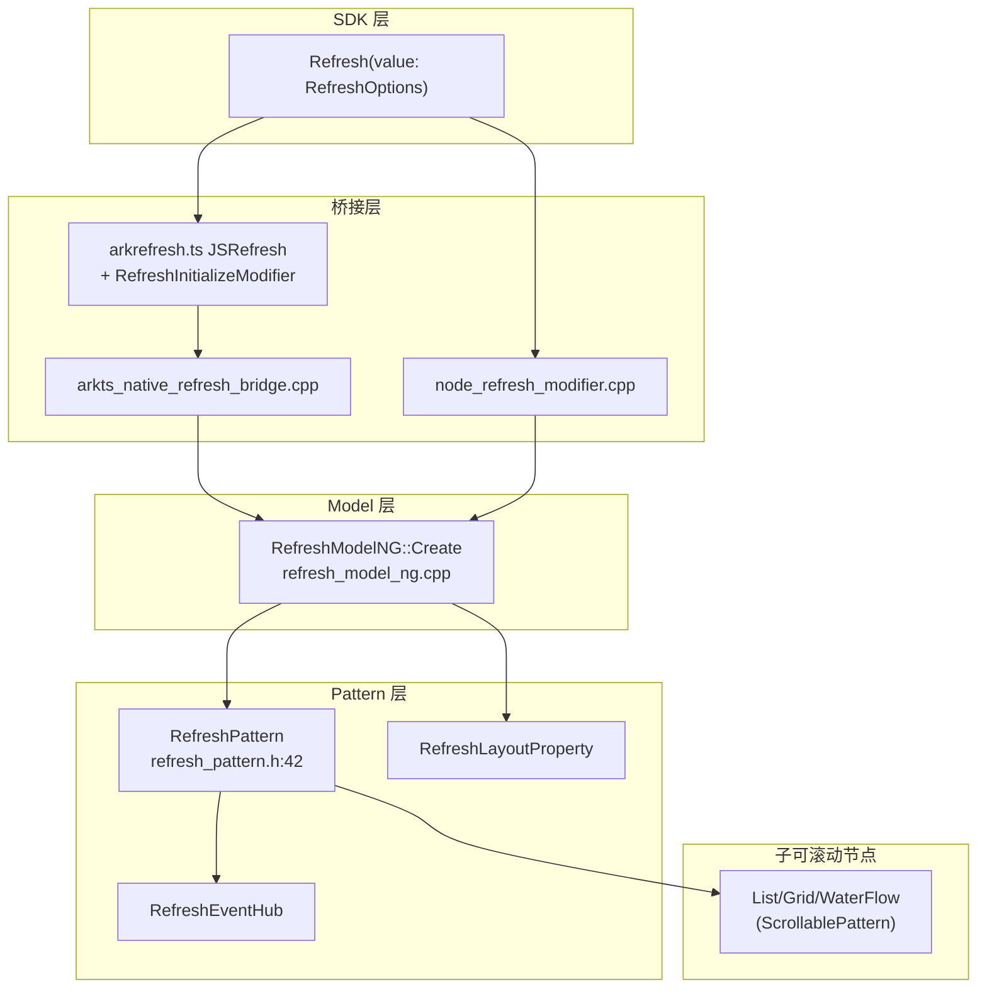
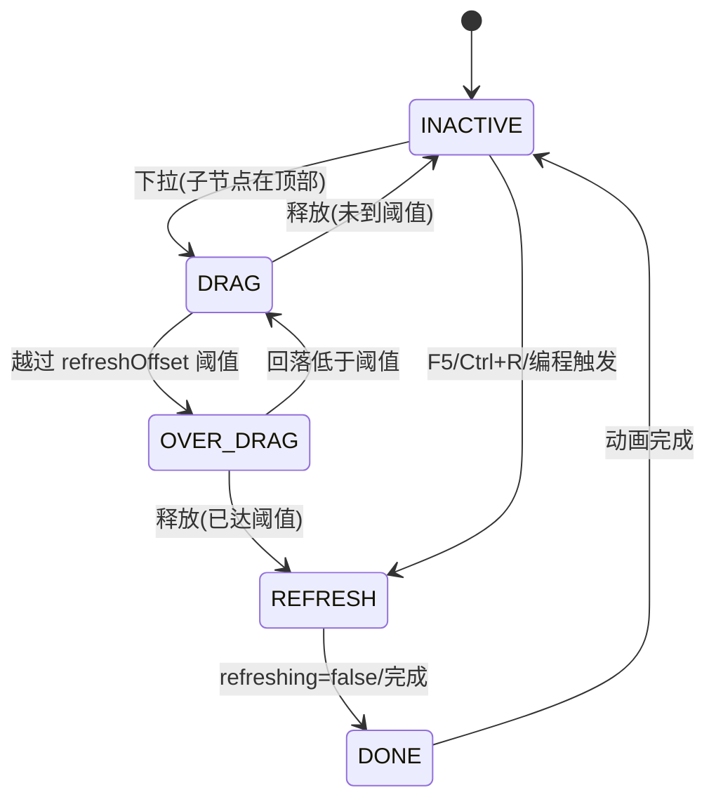

# 架构设计

> Refresh 下拉刷新容器组件功能域的架构设计文档，补录已有实现。Refresh 是纵向（`Axis::VERTICAL`，`refresh_pattern.h:90`）嵌套滚动容器，包裹一个可滚动子节点（List/Grid/WaterFlow），通过阻尼下拉手势触发刷新状态机并驱动默认 LoadingProgress 或自定义指示器。

## 设计元数据

| 字段 | 内容 |
|------|------|
| Design ID | DESIGN-Func-05-03-06 |
| 关联需求 | 已有能力补录（无独立 requirement.md） |
| 关联 Epic | 无 |
| 目标 Feature | Feat-01 创建、刷新状态生命周期与指示器内容, Feat-02 下拉物理、触发/取消手势与偏移观测 |
| 复杂度 | 复杂 |
| 目标版本 | API 8 起支持（crossplatform 10、FaAndStageModel+atomicservice 11；refreshOffset/pullToRefresh/onOffsetChange/pullDownRatio @12；maxPullDownDistance @20；pullUpToCancelRefresh @23；Resource 重载 @26） |
| Owner | ArkUI SIG |
| 状态 | Baselined（已有实现补录） |

## 需求基线

| 项 | 补充说明 |
|----|----------|
| 核心目标 | 提供下拉刷新容器，含 RefreshStatus 状态机（INACTIVE→DRAG→OVER_DRAG→REFRESH→DONE）、阻尼下拉（`exp(-ratio_*gamma)`）、默认 LoadingProgress 指示器、自定义 builder/refreshingContent、promptText、嵌套滚动协调、键盘快捷（F5/Ctrl+R） |
| 关键不变量 | 状态机顺序、阻尼公式、事件触发顺序、弹簧参数 `InterpolatingSpring(velocity,1.0,228.0,30.0)`、自定义 builder 先删默认再加（CLAUDE.md） |

## 上下文和现状

### 涉及仓和模块

| 仓库 | 模块/路径 | 当前职责 | 本 Feature 影响 |
|------|-----------|----------|-----------------|
| ace_engine | `frameworks/core/components_ng/pattern/refresh/refresh_pattern.h/.cpp` | RefreshPattern 继承 NestableScrollContainer，手势/状态机/动画/嵌套滚动 | 核心调度层 |
| ace_engine | `frameworks/core/components_ng/pattern/refresh/refresh_layout_property.h/.cpp` | 布局属性：IsRefreshing/IndicatorOffset/Friction/LoadingText(promptText)/PullToRefresh/RefreshOffset/PullDownRatio/MaxPullDownDistance/IsCustomBuilderExist/PullUpToCancelRefresh | Feat-01/02 |
| ace_engine | `frameworks/core/components_ng/pattern/refresh/refresh_event_hub.h` | 事件：StateChange/RefreshChange/Refreshing/OffsetChange/OffsetStepChange | Feat-01/02 |
| ace_engine | `frameworks/core/components_ng/pattern/refresh/refresh_layout_algorithm.h/.cpp` | 布局算法（继承 BoxLayoutAlgorithm），Measure/Layout/CalculateBuilderSize/UpdateChildPosition | Feat-01 |
| ace_engine | `frameworks/core/components_ng/pattern/refresh/refresh_accessibility_property.h/.cpp` | 无障碍 | Feat-01 |
| ace_engine | `frameworks/core/components_ng/pattern/refresh/refresh_constant.h` | RefreshStatus 枚举（INACTIVE/DRAG/OVER_DRAG/REFRESH/DONE） | Feat-01 |
| ace_engine | `frameworks/core/components_ng/pattern/refresh/refresh_animation_state.h` | RefreshAnimationState 枚举（FOLLOW_HAND/FOLLOW_TO_RECYCLE/RECYCLE） | Feat-01 |
| ace_engine | `frameworks/core/components_ng/pattern/refresh/refresh_theme_ng.h` / `refresh_theme_wrapper.h` | 主题（颜色/尺寸） | Feat-01 |
| ace_engine | `frameworks/core/components_ng/pattern/refresh/refresh_model.h` | RefreshModel 抽象接口 | API 层抽象 |
| ace_engine | `frameworks/core/components_ng/pattern/refresh/refresh_model_ng.h/.cpp` | RefreshModelNG 实现，所有 Set/Get + 静态 FrameNode 访问器 | API 层实现 |
| ace_engine | `frameworks/core/components_ng/pattern/refresh/refresh_model_static.h/.cpp` | 静态 FrameNode 访问器，供 C-API/静态前端 | API 层实现 |
| ace_engine | `frameworks/core/components_ng/pattern/refresh/bridge/arkts_native_refresh_bridge.h/.cpp` | ArkTS↔Native 桥接，Create/Set*/Reset*/RegisterRefreshAttributes | 桥接层 |
| ace_engine | `frameworks/bridge/declarative_frontend/ark_direct_component/src/arkrefresh.ts` | ArkTS 动态组件 JSRefresh + 各属性 Modifier | 桥接层 |
| ace_engine | `frameworks/bridge/declarative_frontend/ark_modifier/src/refresh_modifier.ts` | RefreshModifier（LazyArkRefreshComponent） | 桥接层 |
| ace_engine | `frameworks/core/interfaces/native/node/node_refresh_modifier.h/.cpp` | C-API node modifier | Feat-01/02 |
| ace_engine | `interfaces/native/native_node.h` | `ARKUI_NODE_REFRESH`；`NODE_REFRESH_*` 属性/事件枚举 | Feat-01/02 |
| ace_engine | `frameworks/core/components_ng/pattern/scrollable/nestable_scroll_container.h` | 嵌套滚动基类（RefreshPattern 继承） | Feat-02 |

### 调用链层级分析

| 层 | 模块 | 职责 | 修改类型 |
|----|------|------|----------|
| 1. SDK 层 (.d.ts) | `ets/dynamic/component/refresh.d.ts` | Refresh 组件 TS 类型声明，RefreshOptions/RefreshStatus/RefreshAttribute | 存量分析 |
| 2. ArkTS 动态组件层 | `ark_direct_component/src/arkrefresh.ts` | JSRefresh + RefreshInitializeModifier（bundled options）+ 各属性 Modifier | 存量分析 |
| 3. ArkTS Bridge 层 | `pattern/refresh/bridge/arkts_native_refresh_bridge.cpp` | Create/Set*/Reset* 经 getUINativeModule().refresh.* 转 ModelNG | 存量分析 |
| 4. node_modifier 层 | `core/interfaces/native/node/node_refresh_modifier.cpp` | C-API 属性设置实现 | 存量分析 |
| 5. Model 层 | `core/components_ng/pattern/refresh/refresh_model_ng.cpp` | Create Refresh FrameNode + 子可滚动节点；SetRefreshing/SetRefreshOffset/SetPullDownRatio/SetMaxPullDownDistance/SetCustomBuilder/SetOn* | 存量分析 |
| 6. Pattern 层 | `core/components_ng/pattern/refresh/refresh_pattern.cpp` | 手势（pan）、状态机、阻尼、弹簧动画、自定义 builder 替换、嵌套滚动协调、FRC、键盘 | 存量分析 |
| 7. Layout 层 | `core/components_ng/pattern/refresh/refresh_layout_algorithm.cpp` | Measure/Layout/CalculateBuilderSize/UpdateChildPosition | 存量分析 |
| 8. Event 层 | `core/components_ng/pattern/refresh/refresh_event_hub.h` | FireOnStateChange/FireOnRefreshing/FireChangeEvent/FireOnOffsetChange/FireOnStepOffsetChange | 存量分析 |
| 9. C API 层 | `interfaces/native/native_node.h` | `ARKUI_NODE_REFRESH`；`NODE_REFRESH_REFRESHING/CONTENT/PULL_DOWN_RATIO/OFFSET/PULL_TO_REFRESH/MAX_PULL_DOWN_DISTANCE/PULL_UP_TO_CANCEL_REFRESH` + 事件 `NODE_REFRESH_STATE_CHANGE/ON_REFRESH/ON_OFFSET_CHANGE` | 存量分析 |

### 适用架构规则

| Rule ID | 适用原因 | 设计结论 | 验证方式 |
|---------|----------|----------|----------|
| OH-ARCH-LAYERING | Refresh 涉及 SDK → ArkTS Modifier/Bridge → Model → Pattern → Layout/Event | 单向调用，Model→Pattern 单向依赖 | 代码评审 |
| OH-ARCH-API-LEVEL | offset/friction 弃用 since 11；refreshOffset/pullToRefresh/onOffsetChange/pullDownRatio @12；maxPullDownDistance @20；pullUpToCancelRefresh @23；Resource 重载 @26 | 各属性标注 @since；API10-/11+ 双路径 | API 评审/XTS |
| OH-ARCH-COMPONENT-BUILD | Refresh 未组件化，属 ace_core_ng | 无需新增 target | 构建验证 |

## 不涉及项承接

| 维度 | 设计结论 |
|------|----------|
| 性能 | 是 — 展开：拖拽回调需轻量保 60FPS；FRC 场景上报 `REFRESH_DRAG_SCENE`；弹簧动画复用控制器 |
| 安全与权限 | N/A |
| 兼容性 | 是 — 展开：offset/friction 弃用 since 11（→ pullDownRatio）；API10- 用 `lowVersionOffset_`+RenderContext.SetOffset，API11+ 用 `offsetProperty_`(NodeAnimatableProperty) |
| IPC/跨进程 | N/A |

## 关键设计决策

| 决策 ID | 问题 | 推荐方案 | 探索过的替代方案 | 取舍理由 | 影响 |
|---------|------|----------|-----------------|----------|------|
| ADR-1 | Refresh 为纵向嵌套滚动容器 — 继承 NestableScrollContainer | RefreshPattern 继承 NestableScrollContainer，`Axis` 固定 VERTICAL（`refresh_pattern.h:90`），经 HandleScroll/OnScrollStartRecursive/OnScrollEndRecursive/HandleScrollVelocity 协调子节点 | 方案A：独立实现滚动；方案B：组合 ScrollPattern | 继承复用嵌套滚动框架，避免重复实现 | 子节点必须正确上报边界 |
| ADR-2 | 状态机不可跳转 — INACTIVE→DRAG→OVER_DRAG→REFRESH→DONE | UpdateRefreshStatus 强制顺序，同态早退，跨阈值在 DRAG/OVER_DRAG 间切换，释放到 REFRESH，完成到 DONE，动画回 INACTIVE | 方案A：允许 DRAG 直接到 REFRESH | 顺序保证语义一致（CLAUDE.md 禁止跳转） | 事件触发顺序固定 |
| ADR-3 | 阻尼公式 — 物理感下拉 | `ratio = exp(-ratio_*gamma)`，`gamma = scrollOffset/contentHeight`（CLAUDE.md） | 方案A：线性阻尼；方案B：分段线性 | 指数阻尼提供物理感，禁线性 | `CalculatePullDownRatio` |
| ADR-4 | 事件触发顺序固定 | UpdateRefreshStatus(REFRESH)→FireChangeEvent("true")→FireOnRefreshing()→...→UpdateRefreshStatus(DONE)→FireChangeEvent("false")→FireOnStateChange(DONE)（CLAUDE.md） | 方案A：onRefreshing 先于状态更新 | 状态先更新再回调，保证一致性 | RefreshEventHub |
| ADR-5 | 弹簧动画参数固定 | `InterpolatingSpring(velocity,1.0,228.0,30.0)`（velocity=用户拖拽速度） | 方案A：ease 曲线 | 物理弹簧匹配手感，禁 ease | `refresh_pattern.cpp` |
| ADR-6 | 自定义 builder 替换默认指示器 — 先删后加 | AddCustomBuilderNode：先 RemoveChild(progressChild_/columnNode_)，再 AddChild(builder,0)；传 null 恢复默认（CLAUDE.md） | 方案A：直接叠加 | 先删避免重复显示 | `refresh_pattern.cpp` |
| ADR-7 | API10-/11+ 偏移属性双路径 | 11+ 用 `offsetProperty_`(NodeAnimatablePropertyFloat)；10- 用 `lowVersionOffset_`+RenderContext.SetOffset（`refresh_pattern.h:208,231`，CLAUDE.md） | 方案A：统一 11+ 路径 | 兼容旧版本设备，避免崩溃 | `OnAttachToFrameNode` 版本分支 |
| ADR-8 | offset/friction 弃用迁移 — since 11 → pullDownRatio | offset/friction 标记废弃 @since 11，@useinstead pullDownRatio；内部 `IndicatorOffset`/`Friction` 仍可被旧代码设置 | 方案A：保留不废弃 | 并行过渡降低迁移成本 | `refresh_layout_property.h` |
| ADR-9 | 默认值 — refreshOffset=64vp / friction=62 / pullToRefresh=true / pullUpToCancelRefresh=true | `refresh_pattern.h:205-207`；triggerLoadingDistanceTheme_=16vp；loadingProgressSizeTheme_=32vp | 方案A：动态计算 | 固定默认值保证一致基线 | LayoutProperty 默认 |
| ADR-10 | 键盘快捷触发刷新 — F5/Ctrl+R | OnKeyEvent 拦截 F5 与 Ctrl+R 组合键，仅在非刷新时 QuickStartFresh（CLAUDE.md） | 方案A：不提供快捷键 | 提升桌面/调试体验 | `refresh_pattern.cpp` |

## 设计骨架

### 骨架范围

| 骨架项 | 目标 | 不包含 | 验证方式 |
|--------|------|--------|----------|
| 创建与状态机 | Refresh(value)+状态机+事件顺序 | 物理参数细节 | 单元测试 |
| 自定义指示器 | builder/refreshingContent/promptText 替换默认 | 动画细节 | 单元测试 |
| 阻尼与触发 | offset/friction 弃用 + refreshOffset/pullDownRatio/maxPullDownDistance | 手势取消 | 单元测试 |
| 触发/取消手势与偏移 | pullToRefresh/pullUpToCancelRefresh/onOffsetChange + 嵌套协调 | 默认指示器 | 单元测试 |

### 骨架 Spec 拆分

| Task ID | 目标 | 受影响文件 | AC |
|---------|------|-----------|-----|
| TASK-SKELETON-1 | 创建与状态机验证 | `refresh_pattern.cpp`, `refresh_event_hub.h` | Feat-01 AC |
| TASK-SKELETON-2 | 自定义指示器替换验证 | `refresh_pattern.cpp`, `refresh_layout_algorithm.cpp` | Feat-01 AC |
| TASK-SKELETON-3 | 阻尼与触发验证 | `refresh_pattern.cpp`, `refresh_layout_property.h` | Feat-02 AC |
| TASK-SKELETON-4 | 触发/取消手势与偏移验证 | `refresh_pattern.cpp`, `refresh_event_hub.h` | Feat-02 AC |

## 后续 Task 拆分

| Spec | 目的 | 依赖 | 输出 |
|------|------|------|------|
| Feat-01-refresh-creation-state-lifecycle-indicator-spec.md | 固化创建/状态机/事件/自定义指示器行为规格 | 本 Design | 完整行为规格与 AC |
| Feat-02-refresh-pull-physics-gesture-offset-spec.md | 固化阻尼/触发/取消手势/偏移观测行为规格 | 本 Design + Feat-01 | 完整行为规格与 AC |

## API 签名、Kit 与权限

### 新增 API

| API 签名 | 类型 | Kit | d.ts 位置 | 权限要求 | SysCap |
|----------|------|-----|-----------|----------|--------|
| `Refresh(value: RefreshOptions): RefreshAttribute` | Public | ArkUI | `refresh.d.ts:360`（@since 8/10/11） | 无 | ArkUI.ArkUI.Full |
| `RefreshOptions.refreshing: boolean`（支持 `$$`） | Public | ArkUI | `refresh.d.ts:215` | 无 | ArkUI.ArkUI.Full |
| `RefreshOptions.offset?: number\|string`（弃用 since 11） | Public | ArkUI | `refresh.d.ts:235` | 无 | ArkUI.ArkUI.Full |
| `RefreshOptions.friction?: number\|string`（弃用 since 11） | Public | ArkUI | `refresh.d.ts:262` | 无 | ArkUI.ArkUI.Full |
| `RefreshOptions.promptText?: ResourceStr`（@since 12） | Public | ArkUI | `refresh.d.ts:273` | 无 | ArkUI.ArkUI.Full |
| `RefreshOptions.builder?: CustomBuilder`（@since 10/11） | Public | ArkUI | `refresh.d.ts:293` | 无 | ArkUI.ArkUI.Full |
| `RefreshOptions.refreshingContent?: ComponentContent`（@since 12） | Public | ArkUI | `refresh.d.ts:304` | 无 | ArkUI.ArkUI.Full |
| `enum RefreshStatus`（Inactive/Drag/OverDrag/Refresh/Done） | Public | ArkUI | `refresh.d.ts:44` | 无 | ArkUI.ArkUI.Full |
| `onStateChange(callback)` | Public | ArkUI | `refresh.d.ts:416` | 无 | ArkUI.ArkUI.Full |
| `onRefreshing(callback)` | Public | ArkUI | `refresh.d.ts:445` | 无 | ArkUI.ArkUI.Full |
| `refreshOffset(value: number)` / `(number\|Resource)`（@since 12 / 26） | Public | ArkUI | `refresh.d.ts:457/469` | 无 | ArkUI.ArkUI.Full |
| `pullToRefresh(value: boolean)`（@since 12） | Public | ArkUI | `refresh.d.ts:481` | 无 | ArkUI.ArkUI.Full |
| `pullUpToCancelRefresh(enabled)`（@since 23） | Public | ArkUI | `refresh.d.ts:493` | 无 | ArkUI.ArkUI.Full |
| `onOffsetChange(callback: Callback<number>)`（@since 12） | Public | ArkUI | `refresh.d.ts:506` | 无 | ArkUI.ArkUI.Full |
| `pullDownRatio(ratio: Optional<number>)`（@since 12） | Public | ArkUI | `refresh.d.ts:518` | 无 | ArkUI.ArkUI.Full |
| `maxPullDownDistance(distance)`（@since 20 / 26 Resource） | Public | ArkUI | `refresh.d.ts:531/544` | 无 | ArkUI.ArkUI.Full |

### 变更/废弃 API

| 原有 API | 变更类型 | 新 API | 迁移说明 |
|----------|----------|--------|----------|
| `RefreshOptions.offset` | 废弃 since 11 | `RefreshAttribute.refreshOffset`（@since 12） | 旧 offset 为静止距离(16vp)，新 refreshOffset 为触发阈值(64vp)，语义不同需重设 |
| `RefreshOptions.friction` | 废弃 since 11 | `RefreshAttribute.pullDownRatio`（@since 12） | 摩擦系数(0-100,默认62)→下拉比率 |

## 构建系统影响

### BUILD.gn 变更

```
文件路径: frameworks/core/components_ng/pattern/refresh/BUILD.gn
变更说明: 无（存量补录，Refresh 属 ace_core_ng）
```

### bundle.json 变更

无新增 component。

## 可选设计扩展

### 架构图



### 算法与状态机



### 数据模型设计

C++（框架层，`refresh_pattern.h:189-235`）：
```cpp
RefreshStatus refreshStatus_ = RefreshStatus::INACTIVE;
float scrollOffset_ = 0.0f;
bool isRefreshing_ = false;
RefPtr<NodeAnimatablePropertyFloat> offsetProperty_;   // API11+
RefPtr<NodeAnimatablePropertyFloat> lowVersionOffset_; // API10-
Dimension refreshOffset_ = 64.0_vp;
bool pullToRefresh_ = true;
bool pullUpToCancelRefresh_ = true;
bool isHigherVersion_ = true;
```

存储方案表：

| 属性 | 存储位置 | 更新标志 |
|------|----------|----------|
| refreshing | RefreshLayoutProperty::IsRefreshing + Pattern::isRefreshing_ | 状态机驱动 |
| offset/friction | RefreshLayoutProperty::IndicatorOffset/Friction | PROPERTY_UPDATE_MEASURE |
| refreshOffset | Pattern::refreshOffset_（默认 64vp） | 触发阈值 |
| pullDownRatio | RefreshLayoutProperty::PullDownRatio + Pattern::ratio_ | 阻尼计算 |
| maxPullDownDistance | RefreshLayoutProperty::MaxPullDownDistance | 钳位 |
| pullToRefresh/pullUpToCancelRefresh | Pattern 成员（默认 true） | 手势开关 |
| promptText | RefreshLayoutProperty::LoadingText（Inspector 名 "promptText"） | 文本节点 |
| builder/refreshingContent | Pattern::customBuilder_（经 AddCustomBuilderNode） | 替换默认 |

## 详细设计

### 创建与状态机（Feat-01）

`RefreshModelNG::Create` 创建 Refresh FrameNode + 子可滚动节点。`UpdateRefreshStatus`（`refresh_pattern.cpp`）强制状态顺序，同态早退；阈值越线在 DRAG↔OVER_DRAG 切换；释放达阈值→REFRESH；事件顺序：UpdateRefreshStatus(REFRESH)→FireChangeEvent("true")→FireOnRefreshing()→...→UpdateRefreshStatus(DONE)→FireChangeEvent("false")→FireOnStateChange(DONE)。

### 自定义指示器（Feat-01）

`AddCustomBuilderNode`（`refresh_pattern.h:82`）：传 null→移除 customBuilder_ 恢复默认；传 builder→先 RemoveChild(progressChild_/columnNode_)，再 AddChild(builder,0)，UpdateFirstChildPlacement。promptText 写 loadingTextNode_。

### 阻尼与触发（Feat-02）

`CalculatePullDownRatio`：`ratio=exp(-ratio_*gamma)`，`gamma=scrollOffset/contentHeight`。`GetMaxPullDownDistance` 钳位最大下拉。refreshOffset_ 默认 64vp 为触发阈值；废弃 offset(16vp 静止)/friction(62)→pullDownRatio。弹簧 `InterpolatingSpring(velocity,1.0,228.0,30.0)`。

### 触发/取消手势与偏移（Feat-02）

`InitPanEvent`/`HandleDragStart/Update/End/Cancel`；`pullToRefresh`=false 禁用手势触发；`pullUpToCancelRefresh`=true 时上拉取消正在刷新。`HandleScroll` 经 NestableScrollContainer 协调子节点（子在顶部时下拉由 Refresh 处理）。`onOffsetChange`→`FireOnOffsetChange`/`FireOnStepOffsetChange`，API10-/11+ 偏移属性双路径。

## 风险和开放问题

| 项 | 类型 | 影响 | 处理方式 | Owner |
|----|------|------|----------|-------|
| offset(16vp 静止) 与 refreshOffset(64vp 触发) 语义不同但易混 | API | 中 | 规格风险表标注；迁移需重设 | ArkUI SIG |
| API10- 使用 lowVersionOffset_ 与 11+ offsetProperty_ 行为可能细微差异 | 兼容性 | 中 | 规格标注版本分支；CLAUDE.md 双路径 | ArkUI SIG |
| KB 文档 API 清单有误（loadingText/state/onChange 非公开） | 文档 | 低 | 规格以 SDK d.ts 为准，不采信 KB API 表 | ArkUI SIG |
| C-API `NODE_REFRESH_*` 无显式 @since 标注 | API | 低 | 推断为 API12 基线，规格标注"推理" | ArkUI SIG |

## 设计审批

- [x] 需求基线已确认，设计覆盖 P0/P1 AC
- [x] 不涉及项已承接，N/A 和展开项都有结论
- [x] 涉及仓和模块职责清楚
- [x] 调用链层级分析完整，每层覆盖到位
- [x] 适用架构规则已识别并形成设计结论
- [x] 分层和子系统边界合规
- [x] API 变更有签名、权限、错误码和兼容性说明
- [x] BUILD.gn/bundle.json 影响明确
- [x] 设计输出和后续 Task 拆分明确
- [x] 关键设计决策有理由和影响说明
- [x] 风险和开放问题有 Owner

**结论:** 通过（已有实现补录）
