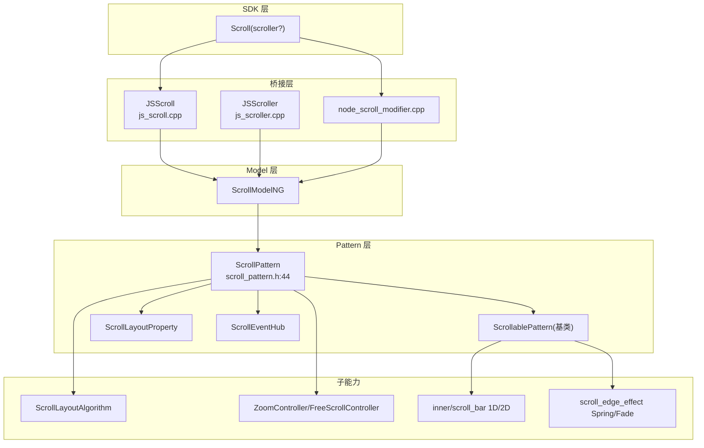

# 架构设计

> Scroll 滚动容器组件功能域的架构设计文档，补录已有实现。Scroll 是通用可滚动容器，继承 `ScrollablePattern`（进而继承 `NestableScrollContainer`），支持纵向/横向/二维自由滚动、滚动条与边缘效果、程序化控制器、嵌套滚动、事件可观测性、分页吸附、捏合缩放。

## 设计元数据

| 字段 | 内容 |
|------|------|
| Design ID | DESIGN-Func-05-03-07 |
| 关联需求 | 已有能力补录（无独立 requirement.md） |
| 关联 Epic | 无 |
| 目标 Feature | Feat-01 核心几何/方向与布局, Feat-02 滚动条与视觉边缘效果, Feat-03 滚动运动控制器 API, Feat-04 交互/手势与嵌套滚动, Feat-05 滚动事件与可观测性, Feat-06 分页与吸附对齐, Feat-07 缩放与二维自由滚动 |
| 复杂度 | 复杂 |
| 目标版本 | API 7 起支持（@since 9/10/11/12 多轮；contentSize @22；UIScrollEvent @19；zoom/free @20；drag/fling 事件 @21；Resource 重载 @22/26） |
| Owner | ArkUI SIG |
| 状态 | Baselined（已有实现补录） |

## 需求基线

| 项 | 补充说明 |
|----|----------|
| 核心目标 | 通用滚动容器，含 ScrollDirection（Vertical/Horizontal/None/FREE@20）、initialOffset、scrollBar（BarState 默认 Auto）、scrollBarColor/Width/Margin、edgeEffect（默认 None）、nestedScroll（默认 SELF_ONLY）、enableScrollInteraction/friction、scrollSnap/enablePaging、Scroller 控制器（scrollTo/scrollEdge/fling/scrollPage/scrollBy/scrollToIndex/currentOffset/offset/isAtEnd/getItemRect/getItemIndex/contentSize/getFrameNode）、缩放（maxZoomScale/minZoomScale/zoomScale/enableBouncesZoom） |
| 关键不变量 | ScrollablePattern 基类提供滚动条/边缘效果/摩擦/嵌套滚动基础设施；ScrollPattern 扩展 FREE/zoom/snap/paging |

## 上下文和现状

### 涉及仓和模块

| 仓库 | 模块/路径 | 当前职责 | 本 Feature 影响 |
|------|-----------|----------|-----------------|
| ace_engine | `frameworks/core/components_ng/pattern/scroll/scroll_pattern.h/.cpp` | ScrollPattern 继承 ScrollablePattern，核心调度 | Feat-01~07 |
| ace_engine | `frameworks/core/components_ng/pattern/scrollable/scrollable_pattern.h/.cpp` | 基类：滚动条/边缘效果/摩擦/嵌套滚动/pan 手势 | Feat-02/04 |
| ace_engine | `frameworks/core/components_ng/pattern/scrollable/nestable_scroll_container.h` | 嵌套滚动基类 | Feat-04 |
| ace_engine | `frameworks/core/components_ng/pattern/scroll/scroll_layout_property.h` | 属性：Axis/ScrollEnabled/ScrollSnapAlign/ScrollWidth | Feat-01/06 |
| ace_engine | `frameworks/core/components_ng/pattern/scroll/scroll_layout_algorithm.h/.cpp` | 布局算法：currentOffset/crossOffset/scrollableDistance/contentStart-EndOffset | Feat-01 |
| ace_engine | `frameworks/core/components_ng/pattern/scroll/scroll_event_hub.h` | 事件：onScroll/onWillScroll/onDidScroll/onScrollEdge/onScrollStart/Stop/onScrollFrameBegin + zoom 事件 | Feat-05/07 |
| ace_engine | `frameworks/core/components_ng/pattern/scroll/scroll_paint_method.h/.cpp` | 绘制 | Feat-02 |
| ace_engine | `frameworks/core/components_ng/pattern/scroll/scroll_content_modifier.h/.cpp` | 内容 modifier/脏矩形 | Feat-02 |
| ace_engine | `frameworks/core/components_ng/pattern/scroll/scroll_edge_effect.h` + `effect/*` | 边缘效果（Spring/Fade） | Feat-02 |
| ace_engine | `frameworks/core/components_ng/pattern/scroll/inner/scroll_bar*.{h,cpp}` | 内建滚动条 1D/2D | Feat-02 |
| ace_engine | `frameworks/core/components_ng/pattern/scroll/free_scroll_controller.h/.cpp` | FreeScrollController 2D 自由滚动 | Feat-07 |
| ace_engine | `frameworks/core/components_ng/pattern/scroll/zoom_controller.h/.cpp` | ZoomController 缩放 | Feat-07 |
| ace_engine | `frameworks/core/components/scroll/scroll_controller_base.h/.cpp` + `scroll_position_controller.h` | 控制器基类与位置控制器 | Feat-03 |
| ace_engine | `frameworks/core/components_ng/pattern/scrollable/scrollable_controller.h` | ScrollableController | Feat-03 |
| ace_engine | `frameworks/core/components_ng/pattern/scroll/scroll_model.h/.cpp` + `scroll_model_ng.h/.cpp` + `scroll_model_static.h/.cpp` | Model 抽象/NG/静态 | Feat-01~07 |
| ace_engine | `frameworks/bridge/declarative_frontend/jsview/js_scroll.h/.cpp` | JSScroll 桥接 | 桥接层 |
| ace_engine | `frameworks/bridge/declarative_frontend/jsview/js_scroller.h/.cpp` | JSScroller 控制器桥接 | Feat-03 |
| ace_engine | `frameworks/core/interfaces/native/node/node_scroll_modifier.cpp` | C-API node modifier | Feat-01~07 |
| ace_engine | `interfaces/native/native_node.h` | C-API：`ARKUI_NODE_SCROLL`、`NODE_SCROLL_*` 属性/事件枚举 | Feat-01~07 |

### 调用链层级分析

| 层 | 模块 | 职责 | 修改类型 |
|----|------|------|----------|
| 1. SDK 层 | `ets/dynamic/component/scroll.d.ts` + `common.d.ts`(ScrollableCommonMethod) | TS 类型声明 | 存量分析 |
| 2. JSView 层 | `jsview/js_scroll.cpp` | 解析 Scroll() 构造与属性方法 | 存量分析 |
| 3. Scroller 桥接 | `jsview/js_scroller.cpp` | Scroller 控制器方法绑定 | 存量分析 |
| 4. node_modifier 层 | `core/interfaces/native/node/node_scroll_modifier.cpp` | C-API 属性设置 | 存量分析 |
| 5. Model 层 | `pattern/scroll/scroll_model_ng.cpp` | 属性 Set/Get + 静态 FrameNode 访问器 | 存量分析 |
| 6. Pattern 层 | `pattern/scroll/scroll_pattern.cpp` | 偏移/距离/snap/paging/zoom/free-scroll | 存量分析 |
| 7. 基类层 | `pattern/scrollable/scrollable_pattern.cpp` | 滚动条/边缘效果/摩擦/嵌套/pan | 存量分析 |
| 8. Layout 层 | `pattern/scroll/scroll_layout_algorithm.cpp` | Measure/Layout/CalcContentOffset/UseInitialOffset | 存量分析 |
| 9. Event 层 | `pattern/scroll/scroll_event_hub.h` | 事件回调与触发 | 存量分析 |
| 10. C API 层 | `interfaces/native/native_node.h` | `NODE_SCROLL_*` 属性/事件枚举（30+ 属性、17 事件） | 存量分析 |

### 适用架构规则

| Rule ID | 适用原因 | 设计结论 | 验证方式 |
|---------|----------|----------|----------|
| OH-ARCH-LAYERING | Scroll 涉及 SDK→JSView/Modifier→Model→Pattern→基类→Layout/Event | 单向调用，基类复用 | 代码评审 |
| OH-ARCH-API-LEVEL | 大量 @since 7/9/10/11/12/14/18/19/20/21/22/23/26 演进 | 各属性标注 @since；onScroll 弃用 12→onWillScroll；onScrollEnd 弃用 9→onScrollStop | API 评审/XTS |
| OH-ARCH-COMPONENT-BUILD | Scroll 未组件化，属 ace_core_ng | 无需新增 target | 构建验证 |

## 不涉及项承接

| 维度 | 设计结论 |
|------|----------|
| 性能 | 是 — 滚动热路径保帧；FRC；fadingEdge/clipContent 触发渲染分支 |
| 安全与权限 | N/A |
| 兼容性 | 是 — onScroll 弃用 12→onWillScroll；onScrollEnd 弃用 9→onScrollStop；ScrollDirection.Free 弃用 9→FREE@20；scrollBarColor/Width Resource 重载 @22/26 |
| IPC/跨进程 | N/A |

## 关键设计决策

| 决策 ID | 问题 | 推荐方案 | 探索过的替代方案 | 取舍理由 | 影响 |
|---------|------|----------|-----------------|----------|------|
| ADR-1 | 滚动基础设施复用 — 继承 ScrollablePattern | ScrollPattern 继承 ScrollablePattern(EdgeEffect::NONE,true)，滚动条/边缘效果/摩擦/嵌套/pan 由基类提供 | 方案A：独立实现；方案B：组合 | 复用避免重复 | 基类约束适用于 Scroll |
| ADR-2 | 默认 edgeEffect=None / scrollBar=Auto | 构造 `ScrollablePattern(EdgeEffect::NONE,true)`（`scroll_pattern.h:48`） | 方案A：默认 Spring | 无回弹更符合通用容器预期 | Feat-02 |
| ADR-3 | onScroll 弃用迁移 — since 12 → onWillScroll | onScroll 标记废弃 @12，新 onWillScroll 可拦截返回 OffsetResult 控制偏移；onDidScroll 不可拦截 | 方案A：保留不废弃 | 新回调可拦截控制，旧回调仅通知 | Feat-05 |
| ADR-4 | ScrollDirection.Free 弃用 → FREE@20 | `Free`(小写) 弃用 @9；`FREE=4`(stage)@20 启用 2D 自由滚动（FreeScrollController + ScrollBar2D） | 方案A：复用 Free | 语义清晰区分 | Feat-07 |
| ADR-5 | 嵌套滚动默认 SELF_ONLY | nestedScroll 默认 `{scrollForward:SELF_ONLY,scrollBackward:SELF_ONLY}` | 方案A：默认 PARALLEL | SELF_ONLY 最安全，避免意外链动 | Feat-04 |
| ADR-6 | 控制器经 ScrollableController + 位置控制器 | scrollTo/scrollEdge/fling/scrollPage/scrollBy/scrollToIndex 经 ScrollableController→ScrollPositionController | 方案A：直接在 Pattern 实现 | 控制器抽象便于多容器复用 | Feat-03 |
| ADR-7 | 缩放与自由滚动独立控制器 | ZoomController 管捏合缩放；FreeScrollController 管 2D 偏移；二者均 ScrollPattern 持有（`scroll_pattern.h:23,33`） | 方案A：合一 | 关注点分离 | Feat-07 |
| ADR-8 | C-API 全量镜像 ArkTS | `NODE_SCROLL_*` 30+ 属性 + 17 事件枚举镜像 ArkTS | 方案A：C-API 子集 | NDK 对齐 ArkTS | Feat-01~07 |

## 设计骨架

### 骨架范围

| 骨架项 | 目标 | 不包含 | 验证方式 |
|--------|------|--------|----------|
| 创建与几何 | Scroll/Scroller/scrollable/initialOffset/offsets | 滚动条细节 | 单元测试 |
| 滚动条与边缘效果 | scrollBar/Color/Width/Margin/edgeEffect/fadingEdge/clipContent | 缩放 | 单元测试 |
| 控制器 | scrollTo/scrollEdge/fling/scrollPage/scrollBy/scrollToIndex/currentOffset 等 | 事件 | 单元测试 |
| 交互与嵌套 | enableScrollInteraction/friction/mouse/crown/backToTop/nestedScroll | 事件 | 单元测试 |
| 事件 | onWillScroll/onDidScroll/onScrollEdge/onScrollStart/Stop/FrameBegin/onReachStart/End/drag/fling | 控制器 | 单元测试 |
| 分页吸附 | scrollSnap/enablePaging | 自由滚动 | 单元测试 |
| 缩放与自由滚动 | maxZoomScale/minZoomScale/zoomScale/enableBouncesZoom/FREE | 分页 | 单元测试 |

### 骨架 Spec 拆分

| Task ID | 目标 | 受影响文件 | AC |
|---------|------|-----------|-----|
| TASK-SKELETON-1 | 创建与几何 | `scroll_pattern.cpp`,`scroll_layout_algorithm.cpp` | Feat-01 AC |
| TASK-SKELETON-2 | 滚动条与边缘效果 | `scrollable_pattern.cpp`,`scroll_edge_effect.h` | Feat-02 AC |
| TASK-SKELETON-3 | 控制器 | `scroll_position_controller.cpp`,`scrollable_controller.h` | Feat-03 AC |
| TASK-SKELETON-4 | 交互与嵌套 | `scrollable_pattern.cpp`,`nestable_scroll_container.h` | Feat-04 AC |
| TASK-SKELETON-5 | 事件 | `scroll_event_hub.h` | Feat-05 AC |
| TASK-SKELETON-6 | 分页吸附 | `scroll_pattern.cpp` snap block | Feat-06 AC |
| TASK-SKELETON-7 | 缩放与自由滚动 | `zoom_controller.cpp`,`free_scroll_controller.cpp` | Feat-07 AC |

## 后续 Task 拆分

| Spec | 目的 | 依赖 | 输出 |
|------|------|------|------|
| Feat-01-scroll-core-geometry-layout-spec.md | 固化创建/方向/几何行为规格 | 本 Design | 完整行为规格与 AC |
| Feat-02-scroll-scrollbar-visual-edge-effects-spec.md | 固化滚动条/边缘效果行为规格 | 本 Design | 完整行为规格与 AC |
| Feat-03-scroll-motion-controller-api-spec.md | 固化控制器行为规格 | 本 Design | 完整行为规格与 AC |
| Feat-04-scroll-interaction-gesture-nested-scroll-spec.md | 固化交互/嵌套行为规格 | 本 Design | 完整行为规格与 AC |
| Feat-05-scroll-events-observability-spec.md | 固化事件行为规格 | 本 Design | 完整行为规格与 AC |
| Feat-06-scroll-paging-snap-alignment-spec.md | 固化分页吸附行为规格 | 本 Design | 完整行为规格与 AC |
| Feat-07-scroll-zoom-2d-free-scroll-spec.md | 固化缩放/自由滚动行为规格 | 本 Design | 完整行为规格与 AC |

## API 签名、Kit 与权限

### 新增 API

| API 签名 | 类型 | Kit | d.ts 位置 | 权限要求 | SysCap |
|----------|------|-----|-----------|----------|--------|
| `Scroll(scroller?: Scroller)` | Public | ArkUI | `scroll.d.ts:1217`（@since 7） | 无 | ArkUI.ArkUI.Full |
| `scrollable(value: ScrollDirection)` | Public | ArkUI | `scroll.d.ts:1376` | 无 | ArkUI.ArkUI.Full |
| `initialOffset(value: OffsetOptions)` | Public | ArkUI | `scroll.d.ts:2020`（@since 12） | 无 | ArkUI.ArkUI.Full |
| `scrollBar/scrollBarColor/scrollBarWidth/scrollBarMargin/autoAdjustScrollBarMargin` | Public | ArkUI | `scroll.d.ts:1728~1816` + `common.d.ts:34984` | 无 | ArkUI.ArkUI.Full |
| `edgeEffect(value, options?)` | Public | ArkUI | `scroll.d.ts:1849` | 无 | ArkUI.ArkUI.Full |
| `nestedScroll(value)` | Public | ArkUI | `scroll.d.ts:1912`（@since 10） | 无 | ArkUI.ArkUI.Full |
| `enableScrollInteraction/friction/enablePaging/scrollSnap` | Public | ArkUI | `scroll.d.ts:1935~1983` | 无 | ArkUI.ArkUI.Full |
| `maxZoomScale/minZoomScale/zoomScale/enableBouncesZoom/onDidZoom/onZoomStart/onZoomStop` | Public | ArkUI | `scroll.d.ts:1390~1699`（@since 20） | 无 | ArkUI.ArkUI.Full |
| `Scroller.scrollTo/scrollEdge/fling/scrollPage/scrollBy/scrollToIndex/currentOffset/offset/isAtEnd/getItemRect/getItemIndex/contentSize/getFrameNode` | Public | ArkUI | `scroll.d.ts:531~875` | 无 | ArkUI.ArkUI.Full |
| 事件 `onWillScroll/onDidScroll/onScrollEdge/onScrollStart/onScrollStop/onScrollFrameBegin/onReachStart/onReachEnd/onWillStartDragging/onDidStopDragging/onWillStartFling/onDidStopFling` | Public | ArkUI | `scroll.d.ts:1490~1699` + `common.d.ts` | 无 | ArkUI.ArkUI.Full |

### 变更/废弃 API

| 原有 API | 变更类型 | 新 API | 迁移说明 |
|----------|----------|--------|----------|
| `onScroll` | 废弃 since 12 | `onWillScroll` | 旧仅通知，新可拦截控制 |
| `onScrollEnd` | 废弃 since 9 | `onScrollStop` | 命名统一 |
| `ScrollDirection.Free` | 废弃 since 9 | `ScrollDirection.FREE`（@since 20） | stage 模型 FREE 启用 2D |

## 构建系统影响

### BUILD.gn 变更

```
文件路径: frameworks/core/components_ng/pattern/scroll/BUILD.gn
变更说明: 无（存量补录，Scroll 属 ace_core_ng）
```

### bundle.json 变更

无新增 component。

## 可选设计扩展

### 架构图



### 数据模型设计

C++（`scroll_layout_algorithm.h`）：
```cpp
float currentOffset_, crossOffset_, scrollableDistance_;
SizeF viewPort_, viewPortExtent_, viewSize_;
float contentStartOffset_, contentEndOffset_;
const int SCROLL_FROM_JUMP = 3;
```

存储方案表：

| 属性 | 存储位置 | 更新标志 |
|------|----------|----------|
| scrollable(Axis) | ScrollLayoutProperty::Axis | PROPERTY_UPDATE_MEASURE |
| initialOffset | Pattern::initialOffset_ | 首帧 UseInitialOffset |
| scrollBar/Color/Width/Margin | ScrollablePattern 滚动条字段 | RENDER |
| edgeEffect | Pattern edgeEffect 字段 | 渲染 |
| nestedScroll | ScrollablePattern nested 属性 | 手势分发 |
| scrollSnap/enablePaging | Pattern snapOffsets_/enablePagingStatus_ | 吸附计算 |
| zoom | ZoomController | PROPERTY_UPDATE_RENDER |
| freeScroll | FreeScrollController offset | 2D 偏移 |

## 详细设计

### 创建与几何（Feat-01）

`ScrollModelNG::Create` 创建 FrameNode + ScrollPattern。`scrollable(Axis)` 写 ScrollLayoutProperty。`initialOffset` 首帧经 `ScrollLayoutAlgorithm::UseInitialOffset` 应用。contentStartOffset/contentEndOffset 经 ScrollableCommonMethod 继承。`ScrollLayoutAlgorithm::Measure/Layout` 计算 scrollableDistance 与 currentOffset。

### 滚动条与边缘效果（Feat-02）

基类 ScrollablePattern 提供滚动条 plumbing（SetScrollBar/UpdateScrollBarOffset/ScrollBarProxy）。`edgeEffect` 默认 None，Spring/Fade 经 scroll_edge_effect。`fadingEdge`/`clipContent` 触发渲染分支。C-API `NODE_SCROLL_BAR_*`/`NODE_SCROLL_EDGE_EFFECT`/`NODE_SCROLL_FADING_EDGE`/`NODE_SCROLL_CLIP_CONTENT`。

### 控制器（Feat-03）

`Scroller` 经 `ScrollableController`→`ScrollPositionController` 调用 ScrollPattern::ScrollTo/ScrollBy/ScrollToEdge/ScrollPage。C-API `NODE_SCROLL_OFFSET`(scrollTo)/`EDGE`(scrollEdge)/`FLING`/`PAGE`/`BY`/`SIZE`。

### 交互与嵌套（Feat-04）

`enableScrollInteraction`/`friction`/`enableScrollWithMouse`/`digitalCrownSensitivity`/`backToTop` 在基类；`nestedScroll` 默认 SELF_ONLY，经 NestableScrollContainer 分发。C-API `NODE_SCROLL_NESTED_SCROLL`/`FRICTION`/`ENABLE_SCROLL_INTERACTION`/`ENABLE_SCROLL_WITH_MOUSE`/`BACK_TO_TOP`/`CONTENT_START/END_OFFSET`。

### 事件（Feat-05）

ScrollEventHub 持 onScroll/onWillScroll/onDidScroll/onScrollEdge/onScrollStart/Stop/onScrollFrameBegin + 继承 drag/fling/reach 事件。onWillScroll 可返回 OffsetResult 拦截。C-API 17 个 `NODE_SCROLL_EVENT_ON_*`。

### 分页与吸附（Feat-06）

`scrollSnap(ScrollSnapOptions)` 经 `CaleSnapOffsets`/`CaleSnapOffsetsByInterval`/`CaleSnapOffsetsByPaginations` 计算 snapOffsets_；`enablePaging` 经 `enablePagingStatus_` + `GetPagingOffset`/`GetPagingDelta`/`ScrollPageCheck`；`StartSnapAnimation`/`StartScrollSnapAnimation` 触发吸附动画。

### 缩放与自由滚动（Feat-07）

`ZoomController` 管捏合缩放（`ProcessZoomScale`/`UpdatePinchGesture`），`maxZoomScale/minZoomScale/zoomScale/enableBouncesZoom` 写 ZoomController。`ScrollDirection.FREE` 启用 `FreeScrollController` + `ScrollBar2D`，`FreeScrollBy/Page/ToEdge/To` 处理 2D。`Get2DScrollBar`/`GetFreeScrollOffset`。C-API `NODE_SCROLL_MAX/MIN/ZOOM_SCALE`/`ENABLE_BOUNCES_ZOOM`。

## 风险和开放问题

| 项 | 类型 | 影响 | 处理方式 | Owner |
|----|------|------|----------|-------|
| onScroll 弃用 12 → onWillScroll 语义变化（可拦截） | API | 中 | 规格标注迁移与语义差异 | ArkUI SIG |
| ScrollDirection.Free(弃用9) 与 FREE(@20) 区分 | 兼容性 | 中 | 规格标注版本门槛 | ArkUI SIG |
| scrollBarColor 签名 ArkTS(ColorMetrics@20) vs 可滚动容器(Color\|string\|number\|Resource) 不一致 | 兼容性 | 低 | 风险表标注 | ArkUI SIG |
| C-API `NODE_SCROLL_BY` 在 Grid 扩展 @26 | 兼容性 | 低 | 规格标注适用范围 | ArkUI SIG |

## 设计审批

- [x] 需求基线已确认，设计覆盖 P0/P1 AC
- [x] 不涉及项已承接，N/A 和展开项都有结论
- [x] 涉及仓和模块职责清楚
- [x] 调用链层级分析完整，每层覆盖到位
- [x] 适用架构规则已识别并形成设计结论
- [x] 分层和子系统边界合规
- [x] API 变更有签名、权限、错误码和兼容性说明
- [x] BUILD.gn/bundle.json 影响明确
- [x] 设计输出和后续 Task 拆分明确
- [x] 关键设计决策有理由和影响说明
- [x] 风险和开放问题有 Owner

**结论:** 通过（已有实现补录）
