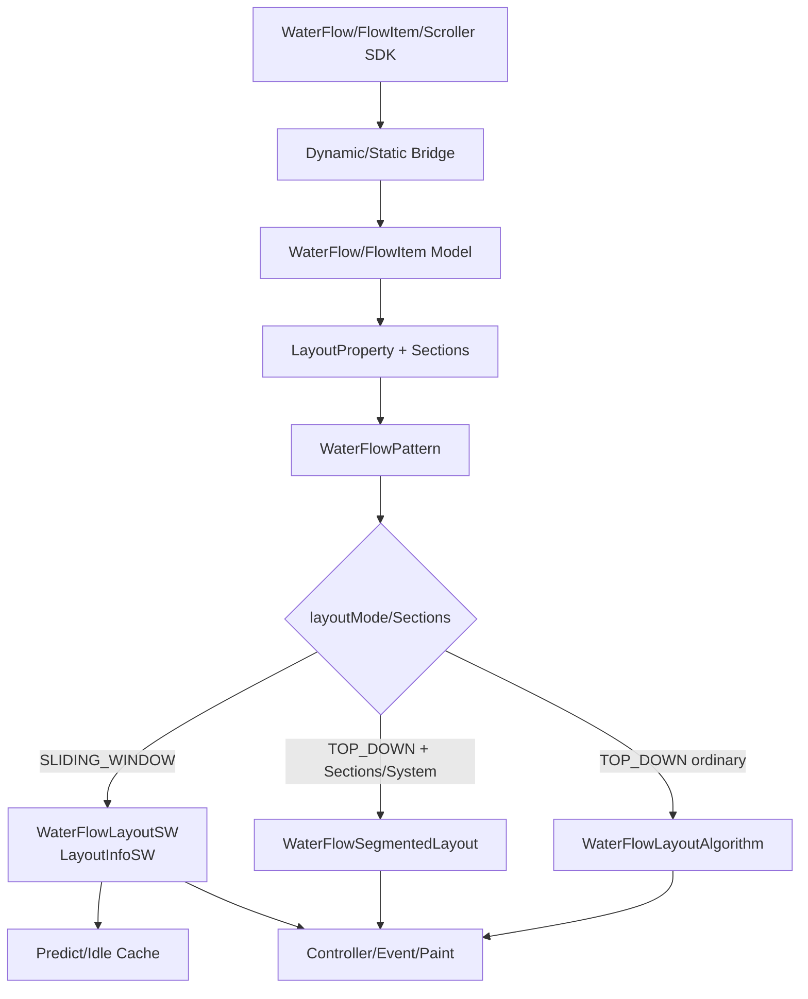
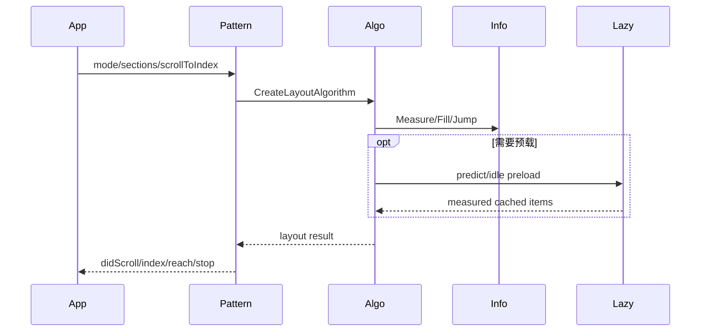
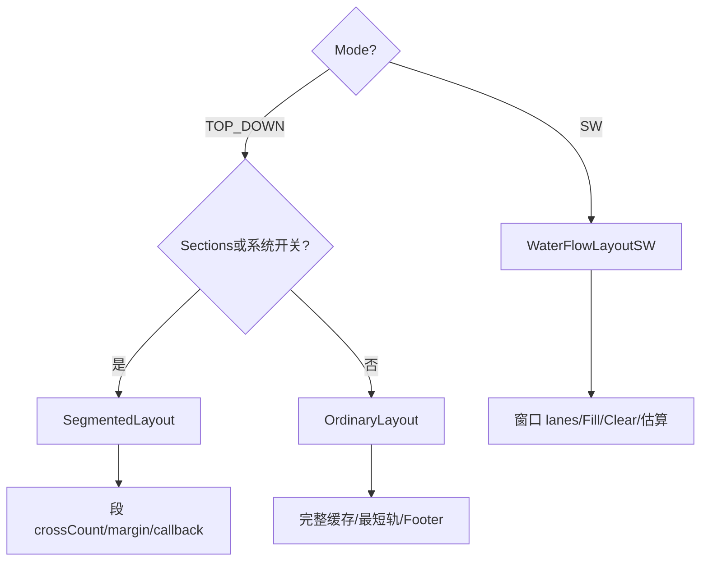
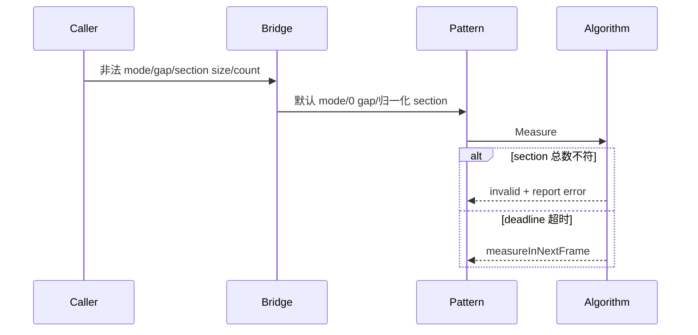

# 架构设计
> 确认 WaterFlow/FlowItem 的架构约束、两套布局算法、关键设计决策和 Spec 拆分。

## 设计元数据
| 字段 | 内容 |
|---|---|
| Design ID | DESIGN-Func-05-03-10 |
| 关联需求 | 已有能力补录（无独立 requirement.md） |
| 关联 Epic | WaterFlow/FlowItem 长期规格补录 |
| 目标 Feature | Feat-01 组件创建、Footer 与 FlowItem, Feat-02 公共布局配置与 Item 约束, Feat-03 ALWAYS_TOP_DOWN 布局算法, Feat-04 SLIDING_WINDOW 布局算法, Feat-05 滚动控制与事件, Feat-06 缓存与懒加载 |
| 复杂度 | 关键 |
| 目标版本 | API 9-26 |
| Owner | ArkUI SIG |
| 状态 | Baselined（已有实现补录） |

## 需求基线
| 项 | 补充说明（如需） |
|---|---|
| 实现即规格 | 以 SDK 契约和 ace_engine 当前实现为依据，偏差仅记录风险 |
| 算法边界 | ALWAYS_TOP_DOWN 与 SLIDING_WINDOW 使用不同 LayoutInfo/算法；TOP_DOWN 内再区分普通与 segmented |
| Sections | TOP_DOWN 选择 segmented；SW 仍使用 WaterFlowLayoutSW 内部分段能力 |
| 长列表 | 缓存、懒加载、跳转和总偏移精度按算法分别声明 |

## 上下文和现状
### 涉及仓和模块
| 仓库 | 补充架构说明 |
|---|---|
| `interface_sdk-js` | WaterFlow、FlowItem、Sections、Scroller 和事件契约 |
| `arkui_ace_engine/frameworks/core/components_ng/pattern/waterflow` | Pattern、Model、Property、FlowItem、事件与模式派发 |
| `waterflow/layout/top_down` | 普通与 segmented TOP_DOWN |
| `waterflow/layout/sliding_window` | SW 窗口、估算跳转、分段 lanes 和缓存 |
| `frameworks/core/interfaces/native/node` | generated/Public Native 属性和事件 |
| `test/unittest/core/pattern/waterflow` | Host 布局、滚动、Sections 与缓存验证 |

### 调用链层级分析
| 层 | 模块 | 职责 | 修改类型 |
|---|---|---|---|
| 1. SDK | water_flow/flow_item/scroll d.ts | Public 签名、版本、默认值 | 文档核验 |
| 2. Frontend/Bridge | arkts_native_water_flow_bridge、static/dynamic modifier | 解析 options、Resource、callback、undefined | 文档核验，记录偏差 |
| 3. Model | WaterFlowModelNG/Static、FlowItemModelNG | 创建节点、更新 Property/Pattern | 文档核验 |
| 4. Property | WaterFlowLayoutProperty/ScrollableLayoutProperty | 保存模板、gap、方向、约束、缓存 | 文档核验 |
| 5. Pattern | WaterFlowPattern | 管理 Footer/Sections/LayoutInfo、控制器和事件 | 文档核验 |
| 6. 算法派发 | CreateLayoutAlgorithm | SW、segmented、普通三路选择 | 重点规格化 |
| 7A. TOP_DOWN | WaterFlowLayoutAlgorithm/SegmentedLayout | 完整位置缓存、最短轨、分段 | 重点规格化 |
| 7B. SW | WaterFlowLayoutSW/LayoutInfoSW | 窗口 lanes、jump/target、估算 | 重点规格化 |
| 8. 缓存 | WaterFlowLayoutBase predict/idle | preload、deadline、active range | 重点规格化 |
| 9. 事件/绘制 | Pattern/PaintMethod/EventHub | did/index/reach/stop、滚动条和边缘效果 | 文档核验 |
| 10. 测试 | Host/Native tests | 模式、边界、事件、缓存 | 验证映射 |

### 适用架构规则
| Rule ID | 适用原因 | 设计结论 | 验证方式 |
|---|---|---|---|
| OH-ARCH-LAYERING | 跨 SDK/Bridge/Model/Pattern/Layout | 保持单向调用，算法状态封装在 LayoutInfo | 调用链审查 |
| OH-ARCH-SUBSYSTEM | SDK 与运行时跨仓 | 不新增依赖，仅核验契约 | 仓库 diff |
| OH-ARCH-IPC-SAF | 不涉及 IPC/SA | N/A | 审查 |
| OH-ARCH-API-LEVEL | API9-26 | 方法级版本矩阵 | SDK 审查 |
| OH-ARCH-COMPONENT-BUILD | 文档补录 | BUILD/bundle 不变 | diff |
| OH-ARCH-ERROR-LOG | Sections 计数/非法配置 | 保留现有恢复和错误上报 | Host 测试 |

## 不涉及项承接
| 维度 | 设计结论 |
|---|---|
| 产品源码/API/ABI | 不修改，仅补录现状 |
| 构建和依赖 | 不修改 BUILD.gn、bundle.json |
| 持久化/IPC/权限 | 不涉及 |
| 测试平台 | 文档验证与 Linux Host 既有测试证据 |

## 关键设计决策
| 决策 ID | 问题 | 推荐方案 | 探索过的替代方案 | 取舍理由 | 影响 |
|---|---|---|---|---|---|
| ADR-1 | Footer/Sections 优先级 | Sections > footerContent > footer | 合并 Footer 为普通 Item；允许同时存在 | SDK 和 Bridge 已有明确优先级 | 创建与索引 |
| ADR-2 | layoutMode 状态是否复用 | 切换时重建 LayoutInfo | 共享缓存；转换状态 | 两算法结构完全不同 | 模式切换 |
| ADR-3 | FlowItem 角色 | 作为单子节点布局/虚拟化单元 | 任意子节点直接布局 | SDK 和 Node 类型明确 | 创建/缓存 |
| ADR-F2-1 | 公共模板与 Sections | Sections 使用 crossCount/段配置并忽略公共 template | 合并模板与段轨道 | 实现消费路径分离 | 布局配置 |
| ADR-F2-2 | Item 约束优先级 | 容器与 FlowItem 取交集；Section 用户主轴尺寸可优先 | 固定容器优先 | 当前 LayoutUtils 有门控 | Item 测量 |
| ADR-F3-1 | TOP_DOWN 是否单一实现 | 普通和 segmented 分别规格化 | 合并为一个最短轨算法 | 调用链和数据结构不同 | 算法测试 |
| ADR-F3-2 | TOP_DOWN 放置 | 当前最短轨，tie 取低 lane | round-robin；全局排序 | 当前缓存可稳定复现 | Item 顺序 |
| ADR-F4-1 | SW 与 Sections | 保持 WaterFlowLayoutSW，内部逐段 lanes | Sections 改用 segmented | 实际派发无条件 SW | 核心算法边界 |
| ADR-F4-2 | SW totalOffset | 允许远跳后估算，顶部校准 | 强制全量精确测量 | SW 性能目标要求不保留历史全量 | Scroller/滚动条 |
| ADR-F5-1 | 控制器统一性 | 入口共享、目标计算委托当前 LayoutInfo | 两模式强行同算法 | jump/target 能力不同 | scrollToIndex |
| ADR-F5-2 | 事件状态 | 使用布局后 LayoutInfo 上报 index/reach | 输入层直接上报 | 避免报告未确认状态 | 事件 AC |
| ADR-F6-1 | 默认缓存值 | 按 pageCount×可见数动态增长，最大16 | 固定1；无限预载 | 当前实现平衡性能/内存 | 缓存测试 |
| ADR-F6-2 | 异步预载 | deadline 超时续作且恢复 lanes | 一次同步完成；缓存直接写稳定窗口 | 避免阻塞帧且不污染正式布局 | 懒加载 |

## 设计骨架
### 骨架范围
| 骨架项 | 目标 | 不包含 | 验证方式 |
|---|---|---|---|
| 创建/API | 建立 SDK 到 Pattern/Property 映射 | 新 API | SDK/Bridge 审查 |
| 三路派发 | 固化 SW/segmented/ordinary 选择 | 算法统一重构 | Host 测试 |
| 控制/事件 | 按 LayoutInfo 输出可观测状态 | 通用滚动物理重复内容 | 控制器/事件测试 |
| 缓存/懒加载 | 描述 active/cache/predict 状态 | 新缓存策略 | deadline 测试 |

### 骨架 Spec 拆分
| Task ID | 目标 | 受影响文件 | AC |
|---|---|---|---|
| TASK-SKELETON-1 | 创建/Footer/FlowItem | Feat-01、design | Feat-01 AC |
| TASK-SKELETON-2 | 公共配置与约束 | Feat-02、design | Feat-02 AC |
| TASK-SKELETON-3 | TOP_DOWN | Feat-03、design | Feat-03 AC |
| TASK-SKELETON-4 | SW | Feat-04、design | Feat-04 AC |
| TASK-SKELETON-5 | 控制与事件 | Feat-05、design | Feat-05 AC |
| TASK-SKELETON-6 | 缓存与懒加载 | Feat-06、design | Feat-06 AC |

## 后续 Task 拆分
| Task ID | 目标 | 受影响文件 | 依赖 |
|---|---|---|---|
| TASK-05-03-10-F1 | 基线化创建/Footer/FlowItem | Feat-01、design | SDK/Bridge/Pattern |
| TASK-05-03-10-F2 | 基线化公共配置/约束 | Feat-02、design | Property/LayoutUtils |
| TASK-05-03-10-F3 | 基线化 TOP_DOWN | Feat-03、design | ordinary/segmented |
| TASK-05-03-10-F4 | 基线化 SW | Feat-04、design | SW/LayoutInfoSW |
| TASK-05-03-10-F5 | 基线化控制/事件 | Feat-05、design | Scroller/Pattern |
| TASK-05-03-10-F6 | 基线化缓存/懒加载 | Feat-06、design | preload/lazy |

## API 签名、Kit 与权限
### 新增 API
| API 签名 | 类型 | Kit | d.ts 位置 | 权限要求 | SysCap |
|---|---|---|---|---|---|
| `WaterFlow(options?: WaterFlowOptions)` / `FlowItem()` | Public | ArkUI | water_flow.d.ts:492-505；flow_item.d.ts:43-58 | 无 | ArkUI.Full |
| `columnsTemplate/rowsTemplate/gaps/layoutDirection/itemConstraintSize` | Public | ArkUI | water_flow.d.ts:527-653 | 无 | ArkUI.Full |
| `WaterFlowSections` / `SectionOptions` | Public | ArkUI | water_flow.d.ts:44-239 | 无 | ArkUI.Full |
| `cachedCount` | Public | ArkUI | water_flow.d.ts:706-752 | 无 | ArkUI.Full |
| Scroller 与 WaterFlow 事件 | Public | ArkUI | scroll.d.ts:395-604；water_flow.d.ts:800-870 | 无 | ArkUI.Full |

### 变更/废弃 API
| 原有 API | 变更类型 | 新 API | 迁移说明 |
|---|---|---|---|
| footer | 历史扩展 | footerContent API18 | footerContent 优先 |
| columnsTemplate(string) | 历史扩展 | ItemFillPolicy API22 | 仅列模板支持 |
| onScroll | API12 废弃 | onDidScroll | 新代码使用 will/did |

## 构建系统影响
### BUILD.gn 变更
```text
文件路径: 无
变更说明: 仅 specs 文档和注册信息。
```
### bundle.json 变更
无依赖或部件变更。

## 可选设计扩展
### 架构图


### 数据流/控制流
| 步骤 | 调用方 | 被调用方 | 数据/接口 | 说明 |
|---|---|---|---|---|
| 1 | App | SDK/Bridge | options/attributes/events | 解析版本和 undefined |
| 2 | Bridge | Model/Pattern | mode/footer/sections/property | 更新节点状态 |
| 3 | Pattern | Dispatcher | mode/sections/system flag | 选择三路算法 |
| 4 | Algorithm | LayoutInfo | lanes/items/segments/offset | Measure/Layout |
| 5 | Cache | Lazy source | preload indexes/deadline | 创建、测量、回收 |
| 6 | Pattern | Event/Scroller | actual offset/index/reach | 布局后通知 |

### 时序设计


### 数据模型设计
```cpp
WaterFlowLayoutInfoBase { mode; offset; start/endIndex; cachedCount; contentOffsets; segments; }
WaterFlowLayoutInfo { complete item position/cache; segment tails; footerIndex; }
WaterFlowLayoutInfoSW { window lanes; segment cache; estimated total offset; cache backup; }
SectionOptions { itemsCount; crossCount; gaps; margin; mainSizeCallback; }
```
| 数据 | 存储位置 | 更新标记 | 消费方 |
|---|---|---|---|
| templates/gaps/direction/constraints | WaterFlowLayoutProperty | MEASURE | 三算法 |
| mode/footer/sections | WaterFlowPattern | MEASURE | dispatcher/LayoutInfo |
| lanes/items/segments | LayoutInfo 子类 | layout cycle | Pattern/algorithm/events |
| cachedCount/active range | LayoutInfo/host | preload/layout | LazyForEach/Repeat |

### 算法与状态机


### 测试性设计
| 测试层级 | 测试目标 | Mock 策略 | 验证方式 |
|---|---|---|---|
| SDK/Bridge | 签名、版本、reset、优先级 | 构造 options/Resource | 审查/Bridge tests |
| Host Layout | 三路派发、lane、jump、Sections | Mock Pipeline/LayoutWrapper | targeted gtest |
| Controller/Event | scrollToIndex/edge/index/reach | 记录状态和回调序列 | Pattern tests |
| Cache/Lazy | deadline、active range、释放 | Mock LazyForEach/Repeat/clock | preload tests |

### 异常传播时序图


### 资源所有权矩阵
| 资源 | 创建方 | 持有方 | 销毁触发 | 实际释放 | 异常回收 |
|---|---|---|---|---|---|
| LayoutInfo | Pattern | Pattern | mode 切换/节点销毁 | RefPtr | 切换重建 |
| Footer/Sections | Bridge/App | Pattern | 替换/节点销毁 | WeakPtr/RefPtr | 优先级切换清旧引用 |
| Cache Item | Lazy source | UI tree/algorithm | 超出 active range | LazyForEach/Repeat | timeout 续作 |

### 接口参数规约
| 接口 | 参数 | 类型 | 合法范围 | 非法处理 | 边界说明 |
|---|---|---|---|---|---|
| layoutMode | mode | enum | 0..1 | TOP_DOWN | 切换重建状态 |
| gap | value | Length | >=0 | 0/reset | section 可覆盖 |
| SectionOptions | items/cross/size | number/callback | items>=0,cross>=1,size>=0 | 拒绝/钳制0/1 | 总数须匹配 |
| cachedCount | count/show | int/bool | count>=0 | 默认策略 | 自动上限16 |

### 线程与并发模型
| 操作 | 发起线程 | 回调线程 | 跨进程边界 | 线程安全 | 重入约束 |
|---|---|---|---|---|---|
| 属性/滚动控制 | UI | UI | 无 | UI 线程模型 | 不在 measure 中重入更新 |
| predict/idle preload | UI idle task | UI | 无 | deadline 串行 | lanes 需保存/恢复 |
| 事件回调 | UI layout/animation | UI | 无 | EventHub | 回调修改在后续帧生效 |

## 详细设计
### 创建、Footer 与 FlowItem
WaterFlow/FlowItem 动态 API9、静态 API23。创建时先确定 layoutMode，再按 Sections > footerContent > footer 选择内容入口（`arkts_native_water_flow_bridge.cpp:467-492,690-700`）。FlowItem 是单子节点布局单元。

### 公共布局配置与约束
垂直使用 columnsTemplate/gap，水平使用 rowsTemplate/gap；非法模板退化单轨。Sections 使用 crossCount 和段 gap/margin，不消费公共模板（`water_flow_layout_utils.cpp:36-55`；`water_flow_segmented_layout.cpp:283-313`）。容器/FlowItem 约束取交集，但 Section 用户主轴尺寸存在时受门控（`water_flow_layout_utils.cpp:79-148`）。

### ALWAYS_TOP_DOWN 普通与 Segmented
普通算法选当前最短轨，tie 保持较小 lane，保存从起点测得的完整位置；Footer 位于最高轨末端（`water_flow_layout_info.cpp:259-290`；`water_flow_layout_algorithm.cpp:345-505`）。存在 Sections/系统开关时使用 segmented，跨段以最大末端和相邻 margin 初始化，callback 可支持远跳且 Item 总数必须匹配（`water_flow_segmented_layout.cpp:37-82,523-579`）。

### SLIDING_WINDOW
SW 仅保留窗口 lanes，滚动时平移、Fill、Clear；Sections 仍在 SW 内逐段处理（`water_flow_layout_sw.cpp:34-69,397-566,618-663`）。远 jump 重建窗口并估算 totalOffset，回到顶部校准（`water_flow_layout_sw.cpp:685-780`；`water_flow_layout_info_sw.cpp:895-965`）。

### 滚动控制与事件
非动画 scrollToIndex 使用 jumpIndex；smooth 目标不在窗口时先测量再 AnimateTo（`water_flow_pattern.cpp:465-515,708-734`）。scrollEdge 映射首末 Item；SW backToTop 必要时强制 index0 精确校准（`water_flow_pattern.cpp:798-818`）。布局后触发 did/index/reach/stop。

### 缓存与懒加载
默认 cachedCount 初始1，布局后按 `ceil(pageCount×visibleCount)` 增长且最大16（`water_flow_layout_info_base.cpp:67-84`）。show=true 同步加载；false 以 predict/idle deadline 分批预载。SW 保存/恢复 lanes，缓存 Item inactive，正式 Layout 恢复 active range（`water_flow_layout_algorithm_base.cpp:129-220`；`water_flow_layout_sw.cpp:824-860,1093-1125`）。

## 风险和开放问题
| 项 | 类型 | 影响 | 处理方式 | Owner |
|---|---|---|---|---|
| 静态 Sections generated 绑定受 `WRONG_GEN_140` 条件编译保护 | API | 高 | 记录 SDK/Bridge 风险，不断言所有静态路径可用 | ArkUI SIG |
| Sections 与独立 Footer 组合可能触发 segmented children-count 不匹配 | 架构 | 高 | 规格禁止独立 Footer，测试覆盖计数 | ArkUI SIG |
| TOP_DOWN 名称下实际有普通和 segmented 两实现 | 架构 | 高 | 三路派发作为首要回归项 | ArkUI SIG |
| SW 跳转/更新后 currentOffset 为估算值 | 兼容 | 高 | API/事件/滚动条按估算声明，顶部校准 | ArkUI SIG |
| 头文件仍称 SW 不支持 scrollTo/animateTo，与实现不符 | API | 中 | 以实现为规格并保留陈旧注释风险 | ArkUI SIG |
| Section size callback 与真实测量不一致会回填重排 | 性能 | 中 | 测试覆盖远跳后真实节点进入窗口 | ArkUI SIG |
| async preload deadline 与 lanes 恢复缺少跨模式统一测试 | 测试 | 中 | TOP_DOWN/SW 分别参数化 | ArkUI SIG |
| cachedCount 只对 LazyForEach/Repeat virtualScroll 保证范围外释放 | 兼容 | 中 | 不泛化到普通静态子节点 | ArkUI SIG |

## 设计审批
- [x] 需求基线已确认，设计覆盖 P0/P1 AC
- [x] 不涉及项已承接，N/A 和展开项都有结论
- [x] 涉及仓和模块职责清楚
- [x] 调用链层级分析完整，每层覆盖到位
- [x] 适用架构规则已识别并形成设计结论
- [x] 分层和子系统边界合规
- [x] API 变更有签名、权限、错误码和兼容性说明
- [x] BUILD.gn/bundle.json 影响明确
- [x] 设计输出和后续 Task 拆分明确
- [x] 关键设计决策有理由和影响说明
- [x] 风险和开放问题有 Owner

**结论:** 通过（已有实现补录）
