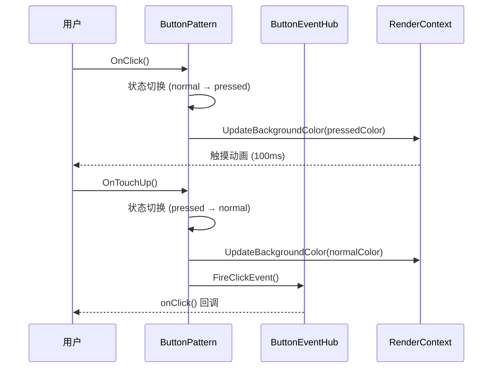
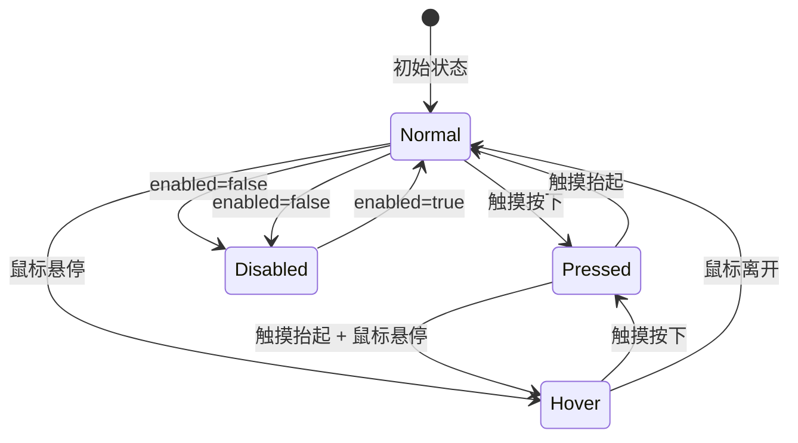

# 架构设计
> Button 组件的架构设计文档，覆盖按钮类型分发、交互状态管理、样式定制、字体缩放和扩展能力。

## 设计元数据

| 字段 | 内容 |
|------|------|
| Design ID | DESIGN-Func-05-04-01 |
| 关联需求 | 已有能力补录（无独立 requirement.md） |
| 关联 Epic | 无 |
| 目标 Feature | Feat-01: Button 组件全量规格 |
| 复杂度 | 标准 |
| 目标版本 | API 7 ~ API 26+ |
| Owner | ArkUI SIG |
| 状态 | Baselined（已有实现补录） |

## 需求基线

> 需求基线详见 proposal.md。以下仅列出设计阶段需要额外强调的要点。

| 项 | 补充说明（如需） |
|----|------------------|
| ButtonType 枚举演进 | API 7 提供 Capsule/Circle/Normal，API 15 新增 ROUNDED_RECTANGLE，API 18 默认值从 Capsule 变更为 ROUNDED_RECTANGLE |
| 样式与角色 | API 11 新增 ButtonStyleMode（EMPHASIZED/TEXTUAL/FILLED），API 12 新增 ButtonRole（NORMAL/ERROR），结合 ControlSize 实现统一尺寸体系 |
| 字体缩放 | API 18 新增 minFontScale/maxFontScale，支持与系统字体缩放联动 |
| 静态 API | API 23 起提供 Static API（button.static.d.ets），API 26 新增 ExtendableButton |
| 组件化 | Button 已完成组件化改造，输出独立 SO libarkui_button.z.so，无遗留 JSView 文件 |

## 上下文和现状

### 涉及仓和模块

| 仓库 | 模块路径 | 当前职责 | 本 Feature 影响 |
|------|----------|----------|-----------------|
| ace_engine | `frameworks/core/components_ng/pattern/button/button_pattern.cpp` | ButtonPattern：按钮交互、状态管理、点击事件、触摸/悬停动画 | 核心实现，规格补录 |
| ace_engine | `frameworks/core/components_ng/pattern/button/button_layout_algorithm.cpp` | ButtonLayoutAlgorithm：按钮布局计算 | 规格补录 |
| ace_engine | `frameworks/core/components_ng/pattern/button/button_layout_property.h` | ButtonLayoutProperty：按钮布局属性 | 规格补录 |
| ace_engine | `frameworks/core/components_ng/pattern/button/button_event_hub.h` | ButtonEventHub：onClick 等事件 | 规格补录 |
| ace_engine | `frameworks/core/components_ng/pattern/button/button_model_ng.cpp` | ButtonModelNG：动态属性写入、节点创建 | 规格补录 |
| ace_engine | `frameworks/core/components_ng/pattern/button/button_model_static.cpp` | ButtonModelStatic：静态前端属性写入 | 规格补录 |
| ace_engine | `frameworks/core/components_ng/pattern/button/button_model_impl.cpp` | ButtonModelImpl：Model 实现 | 规格补录 |
| ace_engine | `frameworks/core/components_ng/pattern/button/button_theme_wrapper.h` | Button Token 适配 | 规格补录 |
| ace_engine | `frameworks/core/components_ng/pattern/button/toggle_button_pattern.cpp` | ToggleButtonPattern：继承 ButtonPattern | 规格补录 |
| ace_engine | `frameworks/core/components_ng/pattern/button/bridge/` | 组件化 Bridge / DynamicModule（libarkui_button.z.so 入口） | 规格补录 |
| ace_engine | `frameworks/core/interfaces/native/node/node_button_modifier.cpp` | C API 属性 Set/Reset/Get 委托层 | 规格补录 |
| ace_engine | `interfaces/native/native_node.h` | C API 枚举定义 ARKUI_NODE_BUTTON=9、NODE_BUTTON_* | 规格补录 |
| interface/sdk-js | `api/@internal/component/ets/button.d.ts` | Dynamic API 声明 | 规格对照 |
| interface/sdk-js | `api/arkui/component/button.static.d.ets` | Static API 声明 | 规格对照 |
| interface/sdk-js | `api/arkui/ButtonModifier.d.ts` | Modifier API 声明 | 规格对照 |

### 调用链层级分析

| 层 | 模块 | 职责 | 修改类型 |
|----|------|------|----------|
| JS Bridge | `frameworks/bridge/declarative_frontend/ark_direct_component/src/arkbutton.ts`, `frameworks/bridge/declarative_frontend/ark_modifier/src/button_modifier.ts` | ArkTS 组件类与 Modifier 类，属性解析入口 | 无修改（规格补录） |
| Bridge | `frameworks/core/components_ng/pattern/button/bridge/arkts_native_button_bridge.cpp` | 属性解析、IsJsView 分支 + 参数解析 | 无修改（规格补录） |
| Bridge (DynamicModule) | `frameworks/core/components_ng/pattern/button/bridge/button_dynamic_module.cpp` | 组件化 SO 入口（libarkui_button.z.so），DynamicModule 注册 | 无修改（规格补录） |
| Bridge (DynamicModifier) | `frameworks/core/components_ng/pattern/button/bridge/button_dynamic_modifier.cpp` | Set/Reset/Get 属性委托层 | 无修改（规格补录） |
| Bridge (StaticModifier) | `frameworks/core/components_ng/pattern/button/bridge/button_static_modifier.cpp` | 静态编译路径属性委托 | 无修改（规格补录） |
| Model | `frameworks/core/components_ng/pattern/button/button_model_ng.cpp` | 节点创建、动态属性写入、ButtonType 分发 | 无修改（规格补录） |
| Model (Static) | `frameworks/core/components_ng/pattern/button/button_model_static.cpp` | 静态前端属性写入 | 无修改（规格补录） |
| Model (Impl) | `frameworks/core/components_ng/pattern/button/button_model_impl.cpp` | Model 实现桥接 | 无修改（规格补录） |
| Pattern | `frameworks/core/components_ng/pattern/button/button_pattern.cpp/.h` | 按钮交互、状态管理（pressed/hover/disabled）、点击事件、触摸/悬停动画、ContentModifier 支持 | 无修改（规格补录） |
| Layout | `frameworks/core/components_ng/pattern/button/button_layout_algorithm.cpp/.h` | 按钮布局计算、ControlSize 尺寸约束、labelStyle 文本测量 | 无修改（规格补录） |
| Property | `frameworks/core/components_ng/pattern/button/button_layout_property.h` | ButtonLayoutProperty：Type/Label/FontSize/FontWeight/FontFamily/FontColor/FontStyle/LabelStyle/ControlSize/StyleMode/Role/MinFontScale/MaxFontScale | 无修改（规格补录） |
| Event | `frameworks/core/components_ng/pattern/button/button_event_hub.h` | ButtonEventHub：onClick 事件分发 | 无修改（规格补录） |
| Theme | `frameworks/core/components_ng/pattern/button/button_theme_wrapper.h` | ButtonThemeWrapper：Token 主题适配、默认颜色/尺寸/圆角 | 无修改（规格补录） |
| C-API | `frameworks/core/interfaces/native/node/node_button_modifier.cpp/.h` | C API 属性 Set/Reset/Get 委托层（NODE_BUTTON_*） | 无修改（规格补录） |

### 适用架构规则

| Rule ID | 适用原因 | 设计结论 | 验证方式 |
|---------|----------|----------|----------|
| OH-ARCH-LAYERING | Button 涉及 API → Bridge → Model → Pattern → Layout/Property 多层调用 | 调用方向自上而下，Pattern 不直接访问 Bridge 层 | 代码评审 |
| OH-ARCH-API-LEVEL | Button 有 @since 7/10/11/12/15/18/23/26 等多版本 API | 各版本 API 通过 PlatformVersion 条件分支实现兼容 | API 评审 / XTS |
| OH-ARCH-COMPONENT-BUILD | Button 已组件化为独立 SO（libarkui_button.z.so） | DynamicModule 注册机制，通过 ButtonDynamicModule 入口 | 构建验证 |
| OH-ARCH-SUBSYSTEM | ToggleButtonPattern 继承 ButtonPattern，同仓跨模块依赖 | 通过继承复用 ButtonPattern 的点击/状态逻辑，Toggle 仅扩展 isOn 切换 | 依赖检查 |
| OH-ARCH-ERROR-LOG | Button 涉及状态切换和事件分发 | 关键路径有 hilog 打点覆盖 | 单测/hilog |

## 不涉及项承接

> proposal.md 已完成 N/A 判定。本节仅对 proposal 中标记为"涉及"且需展开设计的维度给出结论。

| 维度 | 设计结论 |
|------|----------|
| 无障碍 | Button 实现 AccessibilityProperty，报告 IsButton=true，支持 ActionClick；disabled 状态下不响应无障碍点击 |
| 深色模式 | 颜色属性使用 ResourceColor 类型，支持 Token 主题切换，通过 ButtonThemeWrapper 映射 |
| 版本升级兼容 | API 18 默认 ButtonType 从 Capsule 变更为 ROUNDED_RECTANGLE；API 15 新增 ROUNDED_RECTANGLE 类型；需在 spec 兼容性声明中明确 |
| 大字体 | API 18 新增 minFontScale/maxFontScale，labelStyle 跟随系统字体缩放；API 18 以下仅通过 fontSize 属性控制 |

## 关键设计决策

| 决策 ID | 问题 | 推荐方案 | 探索过的替代方案 | 取舍理由 | 影响 |
|---------|------|----------|-----------------|----------|------|
| ADR-1 | ButtonType 默认值是否在 API 18 变更 | 变更为 ROUNDED_RECTANGLE | 保持 Capsule | ROUNDED_RECTANGLE 与新版设计规范一致，通过 PlatformVersion 保持旧版本行为不变 | AC-1.5 |
| ADR-2 | 是否引入 ControlSize 统一尺寸体系 | API 11 引入 ControlSize（SMALL/NORMAL/LARGE），替代手动设置 width/height | 保留手动尺寸设置 | ControlSize 提供一致的跨组件尺寸语义，减少开发者适配成本；手动设置仍兼容 | AC-3.1 ~ AC-3.3 |
| ADR-3 | ButtonStyleMode 和 ButtonRole 的定位 | API 11 引入 ButtonStyleMode（EMPHASIZED/TEXTUAL/FILLED），API 12 引入 ButtonRole（NORMAL/ERROR），分别控制视觉样式和语义角色 | 合并为单一枚举 | 分离关注点：StyleMode 控制视觉层级，Role 控制功能语义，便于独立扩展 | AC-4.1 ~ AC-4.3 |
| ADR-4 | labelStyle 是否作为独立属性 | API 10 引入 labelStyle 复合属性，封装 fontSize/fontWeight/fontFamily/fontColor/fontStyle | 分别暴露独立属性 | labelStyle 提供更简洁的 API 调用；独立属性仍保留以保持兼容 | AC-5.1 ~ AC-5.2 |
| ADR-5 | 字体缩放范围是否可配置 | API 18 引入 minFontScale/maxFontScale，允许开发者限制字体缩放范围 | 固定跟随系统字体缩放 | 部分场景（如固定高度按钮）需要限制缩放范围，避免文本溢出 | AC-6.1 ~ AC-6.3 |
| ADR-6 | ContentModifier 自定义渲染的集成方式 | API 12 引入 ContentModifier，通过 ButtonConfiguration 回调自定义 Builder | 扩展 ButtonType 枚举 | ContentModifier 提供完全自定义能力，不增加 ButtonType 复杂度 | AC-7.1 ~ AC-7.3 |
| ADR-7 | 触摸/悬停动画时长 | 触摸 TOUCH_DURATION=100ms，悬停 MOUSE_HOVER_DURATION=250ms | 统一使用 200ms | 触摸和悬停的交互感知不同，分别设置更符合用户预期 | AC-8.1 ~ AC-8.2 |
| ADR-8 | C API 暴露哪些属性 | 暴露 NODE_BUTTON_LABEL、NODE_BUTTON_TYPE、NODE_BUTTON_MIN_FONT_SCALE、NODE_BUTTON_MAX_FONT_SCALE | 全量暴露 | C API 聚焦核心属性（标签、类型、字体缩放），样式类属性由开发者通过通用属性设置 | AC-9.1 ~ AC-9.4 |

## 设计骨架

### 骨架范围

| 骨架项 | 目标 | 不包含 | 验证方式 |
|--------|------|--------|----------|
| ButtonType 分发 | Model 层按 ButtonType 创建 Pattern，支持 Capsule/Circle/Normal/ROUNDED_RECTANGLE 四种类型 | ToggleButton 的 isOn 切换逻辑 | UT |
| 交互状态 | pressed/hover/disabled/normal 状态切换 + 触摸/悬停动画 | 组合手势场景 | UT + 手工 |
| 尺寸体系 | ControlSize (SMALL/NORMAL/LARGE) + 手动 width/height 兼容 | ContainerSize 的跨组件联动 | UT |
| 样式与角色 | ButtonStyleMode + ButtonRole + 颜色/背景属性 | 通用属性（由 ViewAbstract 继承） | UT |
| 字体与标签 | fontSize/fontWeight/fontFamily/fontColor/fontStyle + labelStyle 复合属性 + minFontScale/maxFontScale | 全局字体管理 | UT |
| ContentModifier | 自定义渲染 + ButtonConfiguration 回调 | 自定义动画曲线 | UT |
| C API 映射 | NODE_BUTTON_LABEL/TYPE/MIN_FONT_SCALE/MAX_FONT_SCALE 的 Set/Reset/Get | 样式类属性的 C API | C API UT |
| 无障碍 | IsButton/ActionClick/disabled 状态 | 无障碍自动化测试框架 | UT |

### 骨架 Spec 拆分

| Task ID | 目标 | 受影响文件 | AC |
|---------|------|-----------|-----|
| TASK-SKELETON-1 | Button 全量规格补录（类型、交互、样式、字体、C API、无障碍） | Feat-01-button-full-spec.md | AC-1.1 ~ AC-9.4 |

## 后续 Task 拆分

| Task ID | 目标 | 受影响文件 | 依赖 |
|---------|------|-----------|------|
| TASK-BUTTON-01 | Button 全量规格补录 | Feat-01-button-full-spec.md, design.md | 无 |

## API 签名、Kit 与权限

> 本节承接 spec.md"API 变更分析"中识别的 API，给出签名、权限和 d.ts 位置等实现细节。

### 新增 API

| API 签名 | 类型 | d.ts 位置 | 权限要求 | SysCap |
|----------|------|-----------|----------|--------|
| `Button(label?: ResourceStr, options?: { type?: ButtonType }): ButtonAttribute` | Public | `@internal/component/ets/button.d.ts` | 无 | SystemCapability.ArkUI.ArkUI.Full |
| `Button(options: { type: ButtonType, label?: ResourceStr }): ButtonAttribute` | Public | `button.d.ts` | 无 | 同上 |
| `.labelStyle(value: TextStyle): ButtonAttribute` | Public | `button.d.ts` | 无 | 同上 |
| `.labelStyle(value: (Controller: SelectController) => TextModifier): ButtonAttribute` | Public | `button.d.ts` | 无 | 同上 |
| `.controlSize(value: ControlSize): ButtonAttribute` | Public | `button.d.ts` | 无 | 同上 |
| `.buttonStyleMode(value: ButtonStyleMode): ButtonAttribute` | Public | `button.d.ts` | 无 | 同上 |
| `.buttonRole(value: ButtonRole): ButtonAttribute` | Public | `button.d.ts` | 无 | 同上 |
| `.contentModifier(modifier: ContentModifier<ButtonConfiguration>): ButtonAttribute` | Public | `button.d.ts` | 无 | 同上 |
| `.minFontScale(value: number \| Resource): ButtonAttribute` | Public | `button.d.ts` | 无 | 同上 |
| `.maxFontScale(value: number \| Resource): ButtonAttribute` | Public | `button.d.ts` | 无 | 同上 |
| `NODE_BUTTON_LABEL` | NDK/Public | `native_node.h` | 无 | 同上 |
| `NODE_BUTTON_TYPE` | NDK/Public | `native_node.h` | 无 | 同上 |
| `NODE_BUTTON_MIN_FONT_SCALE` | NDK/Public | `native_node.h` | 无 | 同上 |
| `NODE_BUTTON_MAX_FONT_SCALE` | NDK/Public | `native_node.h` | 无 | 同上 |

### 变更/废弃 API

| 原有 API | 变更类型 | 新 API | 迁移说明 |
|----------|----------|--------|----------|
| ButtonType 默认值 (Capsule) | 变更 | ButtonType 默认值变更为 ROUNDED_RECTANGLE (API 18+) | 旧版本通过 PlatformVersion 保持 Capsule 默认值；新版本默认 ROUNDED_RECTANGLE |

## 构建系统影响

### BUILD.gn 变更

Button 已完成组件化改造，输出独立 SO：

```
# frameworks/core/components_ng/pattern/button/BUILD.gn
# 构建目标：libarkui_button.z.so
# DynamicModule 入口：button_dynamic_module.cpp
# 包含 Button 的 Pattern/Model/Layout/Event/Bridge 代码
# 包含 ToggleButton 的 Pattern/Model/Paint/Event/Accessibility 代码
```

### bundle.json 变更

Button 组件作为 ace_engine 的内部 component，无独立 bundle.json 变更。

## 可选设计扩展

### 架构图

```mermaid
graph TB
    subgraph "API Layer"
        SDK_DTS["button.d.ts<br/>ButtonInterface / ButtonAttribute"]
        SDK_STATIC["button.static.d.ets<br/>Static API + ExtendableButton"]
        CAPI["native_node.h<br/>ARKUI_NODE_BUTTON=9 / NODE_BUTTON_*"]
    end

    subgraph "Bridge Layer"
        BRIDGE["arkts_native_button_bridge.cpp<br/>IsJsView 分支 + 属性解析"]
        DYN_MOD["button_dynamic_module.cpp<br/>DynamicModule SO 入口"]
        DYN_MODIFIER["button_dynamic_modifier.cpp<br/>Set/Reset/Get 委托"]
        STATIC_MODIFIER["button_static_modifier.cpp<br/>静态编译路径"]
        NODE_MOD["node_button_modifier.cpp<br/>C API 属性委托"]
    end

    subgraph "Model Layer"
        MODEL_NG["ButtonModelNG<br/>节点创建 + 动态属性"]
        MODEL_STATIC["ButtonModelStatic<br/>静态前端属性"]
        MODEL_IMPL["ButtonModelImpl<br/>Model 实现桥接"]
    end

    subgraph "Pattern Layer"
        BTN_P["ButtonPattern<br/>点击/状态/触摸/悬停"]
        TG_BTN_P["ToggleButtonPattern<br/>继承 ButtonPattern"]
    end

    subgraph "Property Layer"
        BTN_LAYOUT["ButtonLayoutProperty<br/>Type/Label/FontSize/LabelStyle<br/>ControlSize/StyleMode/Role<br/>MinFontScale/MaxFontScale"]
        BTN_EVENT["ButtonEventHub<br/>onClick"]
    end

    subgraph "Render Layer"
        BTN_LAYOUT_ALGO["ButtonLayoutAlgorithm<br/>尺寸计算/文本测量"]
        BTN_THEME["ButtonThemeWrapper<br/>Token 主题适配"]
    end

    SDK_DTS --> BRIDGE
    SDK_STATIC --> STATIC_MODIFIER
    CAPI --> NODE_MOD
    NODE_MOD --> DYN_MODIFIER
    BRIDGE --> DYN_MOD
    DYN_MOD --> MODEL_NG
    STATIC_MODIFIER --> MODEL_STATIC
    DYN_MODIFIER --> MODEL_NG
    MODEL_NG --> MODEL_IMPL
    MODEL_STATIC --> MODEL_IMPL
    MODEL_IMPL --> BTN_P
    BTN_P --> BTN_LAYOUT
    BTN_P --> BTN_EVENT
    BTN_P --> BTN_LAYOUT_ALGO
    BTN_P --> BTN_THEME
    BTN_P <|-- TG_BTN_P
```

### 数据流/控制流

| 步骤 | 调用方 | 被调用方 | 数据/接口 | 说明 |
|------|--------|----------|-----------|------|
| 1 | ArkTS/C API | Bridge / node_modifier | ButtonOptions / 属性值 | 属性设置入口 |
| 2 | Bridge | ButtonModelNG | Create(label, type) | 创建按钮节点 |
| 3 | ButtonModelNG | ButtonPattern | AceType::MakeRefPtr | 创建 Pattern |
| 4 | 用户交互 | ButtonPattern::OnClick | 状态切换 | 点击事件处理 |
| 5 | ButtonPattern | ButtonEventHub | FireEvent(onClick) | 事件回调 |
| 6 | ButtonPattern | RenderContext | UpdateBackgroundColor | 状态视觉更新 |
| 7 | LayoutAlgorithm | ButtonLayoutProperty | Measure/Layout | 布局计算 |

### 时序设计



### 数据模型设计

**API 层类型 (TypeScript)**:

```typescript
// ButtonType 枚举
enum ButtonType {
  Capsule,           // @since 7
  Circle,            // @since 7
  Normal,            // @since 7
  ROUNDED_RECTANGLE  // @since 15
}

// 构造参数
interface ButtonOptions {
  type?: ButtonType;
  label?: ResourceStr;
}

// ControlSize 枚举 (@since 11)
enum ControlSize { SMALL, NORMAL, LARGE }

// ButtonStyleMode 枚举 (@since 11)
enum ButtonStyleMode { EMPHASIZED, TEXTUAL, FILLED }

// ButtonRole 枚举 (@since 12)
enum ButtonRole { NORMAL, ERROR }

// ContentModifier 配置 (@since 12)
interface ButtonConfiguration extends CommonConfiguration<ButtonConfiguration> {
  label: ResourceStr;
  enabled: boolean;
  triggerChange: Callback<ResourceStr>;
}
```

**框架层结构 (C++)**:

```cpp
// ButtonLayoutProperty 关键字段
ACE_DEFINE_PROPERTY_ITEM_WITHOUT_GROUP(ButtonType, int32_t);  // PROPERTY_UPDATE_MEASURE
ACE_DEFINE_PROPERTY_ITEM_WITHOUT_GROUP(Label, std::string);   // PROPERTY_UPDATE_MEASURE
ACE_DEFINE_PROPERTY_ITEM_WITHOUT_GROUP(ButtonFontSize, Dimension);
ACE_DEFINE_PROPERTY_ITEM_WITHOUT_GROUP(ButtonFontWeight, std::string);
ACE_DEFINE_PROPERTY_ITEM_WITHOUT_GROUP(ButtonFontFamily, std::vector<std::string>);
ACE_DEFINE_PROPERTY_ITEM_WITHOUT_GROUP(ButtonFontColor, Color);
ACE_DEFINE_PROPERTY_ITEM_WITHOUT_GROUP(ButtonFontStyle, int32_t);
ACE_DEFINE_PROPERTY_ITEM_WITHOUT_GROUP(LabelStyle, TextStyle);
ACE_DEFINE_PROPERTY_ITEM_WITHOUT_GROUP(ControlSize, int32_t);       // @since 11
ACE_DEFINE_PROPERTY_ITEM_WITHOUT_GROUP(ButtonStyleMode, int32_t);   // @since 11
ACE_DEFINE_PROPERTY_ITEM_WITHOUT_GROUP(ButtonRole, int32_t);         // @since 12
ACE_DEFINE_PROPERTY_ITEM_WITHOUT_GROUP(MinFontScale, float);        // @since 18
ACE_DEFINE_PROPERTY_ITEM_WITHOUT_GROUP(MaxFontScale, float);        // @since 18
```

### 算法与状态机



### 测试性设计

| 测试层级 | 测试目标 | Mock 策略 | 验证方式 |
|----------|----------|-----------|----------|
| UT - Pattern | Button 状态切换 + 事件触发 + 触摸/悬停动画 | MockRenderContext | gtest_filter |
| UT - Layout | Button 尺寸计算 + ControlSize 约束 + 文本测量 | MockPipelineContext | gtest_filter |
| UT - Property | LayoutProperty 设置/重置/默认值 + labelStyle | 直接构造 Property 对象 | gtest_filter |
| UT - Accessibility | IsButton/ActionClick/disabled 状态 | MockAccessibilityNode | gtest_filter |
| UT - C API | node_button_modifier Set/Reset/Get | C API UT 框架 | capi_all_modifiers_test |
| 手工 | 触摸/悬停动画视觉效果 | 真机 | 视觉比对 |

### 接口参数规约

| 接口 | 参数 | 类型 | 合法范围 | 非法处理 | 边界说明 |
|------|------|------|----------|----------|----------|
| Button() | label | ResourceStr | 有效文本资源 | 空 | — |
| Button() | type | ButtonType | Capsule/Circle/Normal/ROUNDED_RECTANGLE | 默认 Capsule (API<18) 或 ROUNDED_RECTANGLE (API>=18) | — |
| labelStyle | value | TextStyle | 有效 TextStyle 对象 | N/A | @since 10 |
| controlSize | value | ControlSize | SMALL/NORMAL/LARGE | 默认 NORMAL | @since 11 |
| buttonStyleMode | value | ButtonStyleMode | EMPHASIZED/TEXTUAL/FILLED | 默认 FILLED | @since 11 |
| buttonRole | value | ButtonRole | NORMAL/ERROR | 默认 NORMAL | @since 12 |
| minFontScale | value | number \| Resource | ≥ 0 | 默认 0 | @since 18 |
| maxFontScale | value | number \| Resource | ≥ minFontScale | 默认 Infinity | @since 18 |
| NODE_BUTTON_TYPE | .value[0].i32 | int32_t | 0~3 (Capsule/Circle/Normal/ROUNDED_RECTANGLE) | 按 enum 截断 | C API |
| NODE_BUTTON_LABEL | .string | char* | 有效字符串 | 空字符串 | C API |

## 详细设计

### ButtonType 分发与默认值

Button 通过 `ButtonModelNG::Create()`（`button_model_ng.cpp`）创建节点，ButtonType 存入 `ButtonLayoutProperty`。默认值通过 `PlatformVersion` 分支：

- **API < 18**: 默认 `ButtonType::CAPSULE`
- **API >= 18**: 默认 `ButtonType::ROUNDED_RECTANGLE`

API 15 新增 `ROUNDED_RECTANGLE` 类型，在 `button_layout_algorithm.cpp` 中按类型计算圆角和尺寸。

### 交互状态管理

`ButtonPattern` 管理四种交互状态：normal、pressed、hover、disabled。

**触摸动画**（`button_pattern.cpp`）：
- TOUCH_DURATION = 100ms，触摸时应用 pressed 状态视觉（背景色变化/缩放）
- MOUSE_HOVER_DURATION = 250ms，悬停时应用 hover 状态视觉

**disabled 状态**：
- 不响应点击事件
- 应用 disabledAlpha 透明度
- 不触发触摸/悬停动画

### ControlSize 尺寸体系

API 11 引入 `ControlSize` 枚举（SMALL/NORMAL/LARGE），在 `ButtonLayoutAlgorithm` 中映射为预设尺寸：

- SMALL: 紧凑高度
- NORMAL: 标准高度
- LARGE: 大号高度

开发者设置 `controlSize` 后，按钮高度自动匹配对应尺寸；手动设置 `width`/`height` 优先级更高，覆盖 ControlSize。

### ButtonStyleMode 和 ButtonRole

API 11 引入 `ButtonStyleMode`（EMPHASIZED/TEXTUAL/FILLED），控制按钮的视觉样式层级：
- EMPHASIZED: 强调样式，使用主题 emphasize 颜色
- TEXTUAL: 文本样式，透明背景
- FILLED: 填充样式（默认），使用主题 fill 颜色

API 12 引入 `ButtonRole`（NORMAL/ERROR），控制按钮的功能语义角色：
- NORMAL: 正常角色（默认）
- ERROR: 错误角色，使用主题 error 颜色

两者正交组合，例如 `buttonStyleMode(EMPHASIZED).buttonRole(ERROR)` 表示强调的错误按钮。

### labelStyle 复合属性

API 10 引入 `labelStyle`，封装以下字体属性：
- fontSize: 字体大小
- fontWeight: 字体粗细
- fontFamily: 字体族
- fontColor: 字体颜色
- fontStyle: 字体样式

`labelStyle` 与独立字体属性（`.fontSize()` / `.fontWeight()` 等）功能等价，后设置的生效。

### minFontScale / maxFontScale

API 18 引入 `minFontScale` 和 `maxFontScale`，限制按钮标签的系统字体缩放范围：

- 实际字体缩放 = clamp(systemFontScale, minFontScale, maxFontScale)
- minFontScale 默认 0（不限制下限）
- maxFontScale 默认 Infinity（不限制上限）

在 `ButtonLayoutAlgorithm` 中应用缩放，影响文本测量和布局高度。

### ContentModifier 自定义渲染

API 12 引入 `contentModifier`，通过 `ButtonConfiguration` 回调自定义 Builder：

- `label`: 当前按钮标签
- `enabled`: 当前是否可用
- `triggerChange(label)`: 程序化修改按钮标签

ContentModifier 激活时，按钮跳过默认文本渲染，使用自定义 Builder 内容替代。

### C API 属性映射

C API 通过 `node_button_modifier.cpp` 委托到 `DynamicModuleHelper`：

| C API 枚举 | 值格式 | 说明 |
|-----------|--------|------|
| NODE_BUTTON_LABEL | `.string` | 设置按钮标签文本 |
| NODE_BUTTON_TYPE | `.value[0].i32` (0=Capsule, 1=Circle, 2=Normal, 3=ROUNDED_RECTANGLE) | 设置按钮类型 |
| NODE_BUTTON_MIN_FONT_SCALE | `.value[0].f` | 设置最小字体缩放比例 |
| NODE_BUTTON_MAX_FONT_SCALE | `.value[0].f` | 设置最大字体缩放比例 |

### ToggleButton 继承

`ToggleButtonPattern`（`toggle_button_pattern.cpp`）继承 `ButtonPattern`，扩展 `isOn` 状态切换逻辑。ToggleButton 复用 ButtonPattern 的点击/触摸/悬停/无障碍逻辑，仅新增：
- isOn 状态管理
- 选中/未选中背景色切换
- ToggleButtonPaintProperty

## 风险和开放问题

| 项 | 类型 | 影响 | 处理方式 | Owner |
|----|------|------|----------|-------|
| API 18 默认 ButtonType 变更可能影响存量应用 | 兼容性 | 中 | 通过 PlatformVersion 分支保持旧版本 Capsule 默认值 | ArkUI SIG |
| C API 未暴露 ButtonStyleMode/ButtonRole/ControlSize | API | 低 | NDK 开发者需通过通用属性设置样式；需在文档中明确 | ArkUI SIG |
| minFontScale/maxFontScale 与系统字体缩放的交互 | 行为 | 低 | 需明确 clamp 语义和边界值（0/Infinity）的处理 | ArkUI SIG |
| ExtendableButton (API 26) 扩展机制 | 架构 | 低 | 需明确 ExtendableButton 与 Button 的关系和扩展点 | ArkUI SIG |

## 设计审批

- [x] 需求基线已确认，设计覆盖 P0/P1 AC
- [x] 不涉及项已承接，N/A 和展开项都有结论
- [x] 涉及仓和模块职责清楚
- [x] 调用链层级分析完整，每层覆盖到位
- [x] 适用架构规则已识别并形成设计结论
- [x] 分层和子系统边界合规
- [x] API 变更有签名、权限、错误码和兼容性说明
- [x] BUILD.gn/bundle.json 影响明确
- [x] 设计输出和后续 Task 拆分明确
- [x] 关键设计决策有理由和影响说明
- [x] 风险和开放问题有 Owner

**结论:** 通过（已有实现补录）
