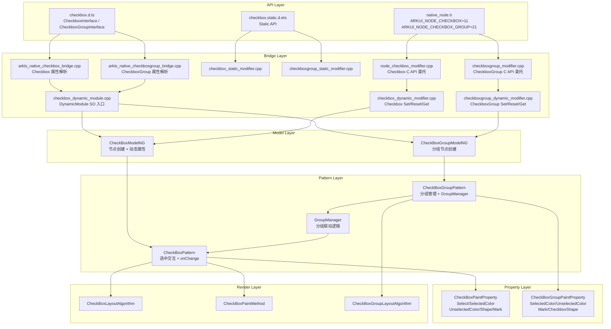
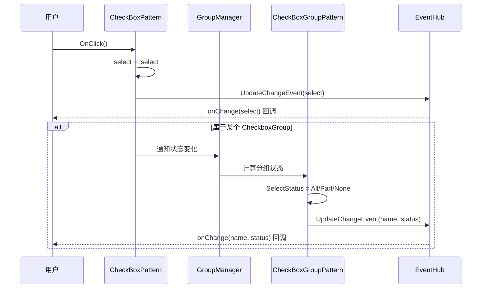
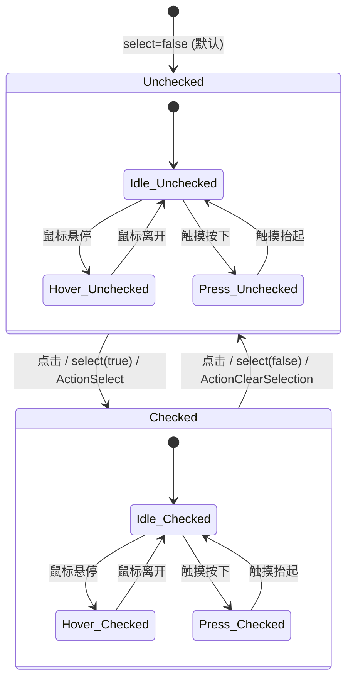

# 架构设计
> Checkbox/CheckboxGroup 组件的架构设计文档，覆盖多选交互、选中状态管理、分组联动、样式定制和扩展能力。

## 设计元数据

| 字段 | 内容 |
|------|------|
| Design ID | DESIGN-Func-05-04-02 |
| 关联需求 | 已有能力补录（无独立 requirement.md） |
| 关联 Epic | 无 |
| 目标 Feature | Feat-01: Checkbox/CheckboxGroup 全量规格 |
| 复杂度 | 标准 |
| 目标版本 | API 8 ~ API 26+ |
| Owner | ArkUI SIG |
| 状态 | Baselined（已有实现补录） |

## 需求基线

> 需求基线详见 proposal.md。以下仅列出设计阶段需要额外强调的要点。

| 项 | 补充说明（如需） |
|----|------------------|
| Checkbox 和 CheckboxGroup 分离 | Checkbox 管理单个选项的选中/未选中状态，CheckboxGroup 管理分组内多选联动和全选状态；两者有各自独立的 Pattern 目录和 Bridge |
| GroupManager 分组管理 | CheckboxGroup 通过 GroupManager 管理分组内 Checkbox 的联动逻辑，包括全选/部分选中/全不选状态 |
| SelectStatus 枚举 | CheckboxGroup 通过 SelectStatus (All/Part/None) 表示分组选中状态 |
| 组件化 | Checkbox 已完成组件化改造，输出独立 SO libarkui_checkbox.z.so，无遗留 JSView 文件 |
| C API | Checkbox 暴露为 ARKUI_NODE_CHECKBOX=11，CheckboxGroup 暴露为 ARKUI_NODE_CHECKBOX_GROUP=21 (since 15) |

## 上下文和现状

### 涉及仓和模块

| 仓库 | 模块路径 | 当前职责 | 本 Feature 影响 |
|------|----------|----------|-----------------|
| ace_engine | `frameworks/core/components_ng/pattern/checkbox/checkbox_pattern.cpp` | CheckBoxPattern：多选交互、选中状态管理 | 核心实现，规格补录 |
| ace_engine | `frameworks/core/components_ng/pattern/checkbox/checkbox_layout_algorithm.cpp` | CheckBoxLayoutAlgorithm：布局计算 | 规格补录 |
| ace_engine | `frameworks/core/components_ng/pattern/checkbox/checkbox_paint_method.cpp` | CheckBoxPaintMethod：绘制方法 | 规格补录 |
| ace_engine | `frameworks/core/components_ng/pattern/checkbox/checkbox_paint_property.cpp` | CheckBoxPaintProperty：绘制属性 | 规格补录 |
| ace_engine | `frameworks/core/components_ng/pattern/checkbox/checkbox_event_hub.h` | CheckBoxEventHub：onChange 事件 | 规格补录 |
| ace_engine | `frameworks/core/components_ng/pattern/checkbox/checkbox_model_ng.cpp` | CheckBoxModelNG：动态属性写入、节点创建 | 规格补录 |
| ace_engine | `frameworks/core/components_ng/pattern/checkbox/checkbox_model_static.cpp` | CheckBoxModelStatic：静态前端属性写入 | 规格补录 |
| ace_engine | `frameworks/core/components_ng/pattern/checkbox/checkbox_model_impl.cpp` | CheckBoxModelImpl：Model 实现 | 规格补录 |
| ace_engine | `frameworks/core/components_ng/pattern/checkbox/checkbox_accessibility_property.cpp` | CheckBoxAccessibilityProperty：无障碍 | 规格补录 |
| ace_engine | `frameworks/core/components_ng/pattern/checkbox/checkbox_theme_wrapper.h` | CheckBoxThemeWrapper：Token 适配 | 规格补录 |
| ace_engine | `frameworks/core/components_ng/pattern/checkbox/checkbox_modifier.h` | CheckBoxModifier：Modifier 定义 | 规格补录 |
| ace_engine | `frameworks/core/components_ng/pattern/checkbox/bridge/` | 组件化 Bridge / DynamicModule | 规格补录 |
| ace_engine | `frameworks/core/components_ng/pattern/checkboxgroup/checkboxgroup_pattern.cpp` | CheckBoxGroupPattern：分组多选管理 | 核心实现，规格补录 |
| ace_engine | `frameworks/core/components_ng/pattern/checkboxgroup/checkboxgroup_layout_algorithm.cpp` | CheckBoxGroupLayoutAlgorithm：分组布局 | 规格补录 |
| ace_engine | `frameworks/core/components_ng/pattern/checkboxgroup/checkboxgroup_paint_property.cpp` | CheckBoxGroupPaintProperty：分组绘制属性 | 规格补录 |
| ace_engine | `frameworks/core/components_ng/pattern/checkboxgroup/checkboxgroup_model_ng.cpp` | CheckBoxGroupModelNG | 规格补录 |
| ace_engine | `frameworks/core/components_ng/pattern/checkboxgroup/checkboxgroup_model_static.cpp` | CheckBoxGroupModelStatic | 规格补录 |
| ace_engine | `frameworks/core/components_ng/pattern/checkboxgroup/bridge/` | CheckboxGroup 组件化 Bridge | 规格补录 |
| ace_engine | `frameworks/core/interfaces/native/node/node_checkbox_modifier.cpp` | Checkbox C API 属性委托层 | 规格补录 |
| ace_engine | `frameworks/core/interfaces/native/node/checkboxgroup_modifier.cpp` | CheckboxGroup C API 属性委托层 | 规格补录 |
| ace_engine | `interfaces/native/native_node.h` | C API 枚举定义 ARKUI_NODE_CHECKBOX=11、ARKUI_NODE_CHECKBOX_GROUP=21 | 规格补录 |
| interface/sdk-js | `api/@internal/component/ets/checkbox.d.ts` | Dynamic API 声明 | 规格对照 |
| interface/sdk-js | `api/arkui/component/checkbox.static.d.ets` | Static API 声明 | 规格对照 |

### 调用链层级分析

| 层 | 模块 | 职责 | 修改类型 |
|----|------|------|----------|
| JS Bridge | `frameworks/bridge/declarative_frontend/ark_component/components/arkcheckbox.js`, `arkcheckboxgroup.js`, `frameworks/bridge/declarative_frontend/ark_modifier/src/checkbox_modifier.ts`, `checkboxgroup_modifier.ts` | ArkTS 组件类与 Modifier 类，属性解析入口 | 无修改（规格补录） |
| Bridge (Checkbox) | `frameworks/core/components_ng/pattern/checkbox/bridge/arkts_native_checkbox_bridge.cpp` | 属性解析、IsJsView 分支 + 参数解析 | 无修改（规格补录） |
| Bridge (CheckboxGroup) | `frameworks/core/components_ng/pattern/checkboxgroup/bridge/arkts_native_checkboxgroup_bridge.cpp` | 属性解析、IsJsView 分支 + 参数解析 | 无修改（规格补录） |
| Bridge (DynamicModule) | `frameworks/core/components_ng/pattern/checkbox/bridge/checkbox_dynamic_module.cpp` | 组件化 SO 入口（libarkui_checkbox.z.so） | 无修改（规格补录） |
| Bridge (DynamicModifier) | `frameworks/core/components_ng/pattern/checkbox/bridge/checkbox_dynamic_modifier.cpp`, `checkboxgroup/bridge/checkboxgroup_dynamic_modifier.cpp` | Set/Reset/Get 属性委托层 | 无修改（规格补录） |
| Bridge (StaticModifier) | `frameworks/core/components_ng/pattern/checkbox/bridge/checkbox_static_modifier.cpp`, `checkboxgroup/bridge/checkboxgroup_static_modifier.cpp` | 静态编译路径属性委托 | 无修改（规格补录） |
| Model (Checkbox) | `frameworks/core/components_ng/pattern/checkbox/checkbox_model_ng.cpp` | 节点创建、动态属性写入 | 无修改（规格补录） |
| Model (CheckboxGroup) | `frameworks/core/components_ng/pattern/checkboxgroup/checkboxgroup_model_ng.cpp` | 分组节点创建、动态属性写入 | 无修改（规格补录） |
| Pattern (Checkbox) | `frameworks/core/components_ng/pattern/checkbox/checkbox_pattern.cpp/.h` | 多选交互、选中状态管理、onChange 事件、ContentModifier 支持 | 无修改（规格补录） |
| Pattern (CheckboxGroup) | `frameworks/core/components_ng/pattern/checkboxgroup/checkboxgroup_pattern.cpp/.h` | 分组多选管理、全选/部分选中/全不选状态、GroupManager 联动 | 无修改（规格补录） |
| Layout | `frameworks/core/components_ng/pattern/checkbox/checkbox_layout_algorithm.cpp/.h`, `checkboxgroup/checkboxgroup_layout_algorithm.cpp/.h` | 布局计算 | 无修改（规格补录） |
| Paint | `frameworks/core/components_ng/pattern/checkbox/checkbox_paint_method.cpp/.h`, `checkboxgroup/checkboxgroup_paint_method.h` | 绘制方法 | 无修改（规格补录） |
| Property | `frameworks/core/components_ng/pattern/checkbox/checkbox_paint_property.cpp/.h`, `checkboxgroup/checkboxgroup_paint_property.cpp/.h` | 绘制属性 | 无修改（规格补录） |
| Event | `frameworks/core/components_ng/pattern/checkbox/checkbox_event_hub.h`, `checkboxgroup/checkboxgroup_event_hub.h` | 事件分发 | 无修改（规格补录） |
| Theme | `frameworks/core/components_ng/pattern/checkbox/checkbox_theme_wrapper.h` | CheckBoxThemeWrapper：Token 主题适配 | 无修改（规格补录） |
| C-API | `frameworks/core/interfaces/native/node/node_checkbox_modifier.cpp/.h`, `checkboxgroup_modifier.cpp/.h` | C API 属性 Set/Reset/Get 委托层 | 无修改（规格补录） |

### 适用架构规则

| Rule ID | 适用原因 | 设计结论 | 验证方式 |
|---------|----------|----------|----------|
| OH-ARCH-LAYERING | Checkbox/CheckboxGroup 涉及 API → Bridge → Model → Pattern → Layout/Paint 多层调用 | 调用方向自上而下，Pattern 不直接访问 Bridge 层 | 代码评审 |
| OH-ARCH-API-LEVEL | Checkbox/CheckboxGroup 有 @since 8/10/11/12/15/21/23 等多版本 API | 各版本 API 通过 PlatformVersion 条件分支实现兼容 | API 评审 / XTS |
| OH-ARCH-COMPONENT-BUILD | Checkbox 已组件化为独立 SO（libarkui_checkbox.z.so） | DynamicModule 注册机制，通过 CheckboxDynamicModule 入口；CheckboxGroup 共享同一 SO | 构建验证 |
| OH-ARCH-SUBSYSTEM | ToggleCheckBoxPattern 继承 CheckBoxPattern，同仓跨模块依赖 | 通过继承复用 CheckBoxPattern 的选中/事件逻辑 | 依赖检查 |
| OH-ARCH-ERROR-LOG | Checkbox 涉及状态切换和分组联动 | 关键路径有 hilog 打点覆盖 | 单测/hilog |

## 不涉及项承接

> proposal.md 已完成 N/A 判定。本节仅对 proposal 中标记为"涉及"且需展开设计的维度给出结论。

| 维度 | 设计结论 |
|------|----------|
| 无障碍 | Checkbox 实现 AccessibilityProperty，报告 IsCheckable=true、IsChecked=当前选中状态，支持 ActionSelect/ActionClearSelection；CheckboxGroup 报告分组状态 |
| 深色模式 | 颜色属性使用 ResourceColor 类型，支持 Token 主题切换，通过 CheckBoxThemeWrapper 映射 |
| 版本升级兼容 | API 15 新增 CheckboxGroup C API (ARKUI_NODE_CHECKBOX_GROUP=21)；API 21 新增 CheckboxGroup ContentModifier；需在 spec 兼容性声明中明确 |
| 大字体 | Checkbox 尺寸跟随系统字体缩放，shape 属性支持自定义形状 |

## 关键设计决策

| 决策 ID | 问题 | 推荐方案 | 探索过的替代方案 | 取舍理由 | 影响 |
|---------|------|----------|-----------------|----------|------|
| ADR-1 | Checkbox 和 CheckboxGroup 是否分离 | 两个独立组件，各有独立 Pattern 目录和 Bridge | 合并为单一组件 | 分离关注点：Checkbox 管理单个选项，CheckboxGroup 管理分组联动，职责清晰 | AC-1.1, AC-4.1 |
| ADR-2 | 分组联动如何实现 | 通过 GroupManager 管理分组内 Checkbox 的联动逻辑，CheckboxGroup 监听子 Checkbox 状态变化 | 直接在 Pattern 中遍历子节点 | GroupManager 提供统一的分组管理抽象，便于扩展和复用 | AC-4.2 ~ AC-4.5 |
| ADR-3 | 分组选中状态如何表示 | API 8 引入 SelectStatus 枚举 (All/Part/None)，onChange 回调返回当前状态 | 使用布尔值数组 | SelectStatus 枚举简化 API，开发者无需遍历子 Checkbox | AC-4.2, AC-4.4 |
| ADR-4 | shape 属性的引入时机 | API 11 引入 shape 属性，允许自定义 Checkbox 形状（Circle/Square） | 固定使用 Circle 形状 | 不同场景需要不同形状，shape 提供灵活性 | AC-2.4 |
| ADR-5 | mark 属性的定位 | API 10 引入 mark 复合属性，封装选中标记的样式（strokeColor/size） | 分别暴露独立属性 | mark 提供更简洁的 API 调用，封装选中标记的视觉 | AC-2.3 |
| ADR-6 | indicatorBuilder 的定位 | API 12 引入 indicatorBuilder，允许通过 Builder 函数自定义选中指示器 | 扩展 shape 枚举 | indicatorBuilder 提供完全自定义能力，不增加 shape 枚举复杂度 | AC-3.1, AC-3.2 |
| ADR-7 | CheckboxGroup ContentModifier 的引入时机 | API 21 引入 CheckboxGroup ContentModifier | 在 API 12 同时引入 | CheckboxGroup 的自定义渲染需求较晚出现，推迟到 API 21 | AC-5.1 ~ AC-5.3 |
| ADR-8 | C API 暴露哪些属性 | Checkbox 暴露 NODE_CHECKBOX_* 属性集，CheckboxGroup 暴露 NODE_CHECKBOX_GROUP_* 属性集 | 全量暴露 | C API 聚焦核心属性 | AC-7.1 ~ AC-8.4 |

## 设计骨架

### 骨架范围

| 骨架项 | 目标 | 不包含 | 验证方式 |
|--------|------|--------|----------|
| Checkbox 选中交互 | 点击翻转选中状态 + onChange 回调 + select 程序化设置 | 组合手势场景 | UT |
| Checkbox 样式 | select/selectedColor/unselectedColor/shape/mark/checkboxShape 全量属性 | 通用属性 | UT |
| CheckboxGroup 分组管理 | GroupManager 联动 + selectAll + SelectStatus + onChange | 独立 Checkbox 的选中逻辑 | UT |
| CheckboxGroup 样式 | selectedColor/unselectedColor/mark/checkboxShape 全量属性 | 通用属性 | UT |
| ContentModifier/indicatorBuilder | 自定义渲染 + CheckboxConfiguration/CheckboxGroupConfiguration 回调 | 自定义动画曲线 | UT |
| C API 映射 | NODE_CHECKBOX_*/NODE_CHECKBOX_GROUP_* 的 Set/Reset/Get | 样式子属性的 C API | C API UT |
| 无障碍 | IsCheckable/IsChecked/ActionSelect/ActionClearSelection | 无障碍自动化测试框架 | UT |

### 骨架 Spec 拆分

| Task ID | 目标 | 受影响文件 | AC |
|---------|------|-----------|-----|
| TASK-SKELETON-1 | Checkbox/CheckboxGroup 全量规格补录（交互、样式、分组、C API、无障碍） | Feat-01-checkbox-full-spec.md | AC-1.1 ~ AC-8.4 |

## 后续 Task 拆分

| Task ID | 目标 | 受影响文件 | 依赖 |
|---------|------|-----------|------|
| TASK-CHECKBOX-01 | Checkbox/CheckboxGroup 全量规格补录 | Feat-01-checkbox-full-spec.md, design.md | 无 |

## API 签名、Kit 与权限

> 本节承接 spec.md"API 变更分析"中识别的 API，给出签名、权限和 d.ts 位置等实现细节。

### 新增 API

| API 签名 | 类型 | d.ts 位置 | 权限要求 | SysCap |
|----------|------|-----------|----------|--------|
| `Checkbox(options: CheckboxOptions): CheckboxAttribute` | Public | `@internal/component/ets/checkbox.d.ts` | 无 | SystemCapability.ArkUI.ArkUI.Full |
| `.select(value: boolean): CheckboxAttribute` | Public | `checkbox.d.ts` | 无 | 同上 |
| `.selectedColor(value: ResourceColor): CheckboxAttribute` | Public | `checkbox.d.ts` | 无 | 同上 |
| `.unselectedColor(value: ResourceColor): CheckboxAttribute` | Public | `checkbox.d.ts` | 无 | 同上 |
| `.shape(value: CheckboxShape): CheckboxAttribute` | Public | `checkbox.d.ts` | 无 | 同上 |
| `.mark(value: MarkStyle): CheckboxAttribute` | Public | `checkbox.d.ts` | 无 | 同上 |
| `.onChange(callback: (value: boolean) => void): CheckboxAttribute` | Public | `checkbox.d.ts` | 无 | 同上 |
| `.contentModifier(modifier: ContentModifier<CheckboxConfiguration>): CheckboxAttribute` | Public | `checkbox.d.ts` | 无 | 同上 |
| `.indicatorBuilder(builder: CustomBuilder): CheckboxAttribute` | Public | `checkbox.d.ts` | 无 | 同上 |
| `CheckboxGroup(options: CheckboxGroupOptions): CheckboxGroupAttribute` | Public | `checkbox.d.ts` | 无 | 同上 |
| `.selectAll(value: boolean): CheckboxGroupAttribute` | Public | `checkbox.d.ts` | 无 | 同上 |
| `.selectedColor(value: ResourceColor): CheckboxGroupAttribute` | Public | `checkbox.d.ts` | 无 | 同上 |
| `.unselectedColor(value: ResourceColor): CheckboxGroupAttribute` | Public | `checkbox.d.ts` | 无 | 同上 |
| `.mark(value: MarkStyle): CheckboxGroupAttribute` | Public | `checkbox.d.ts` | 无 | 同上 |
| `.checkboxShape(value: CheckboxShape): CheckboxGroupAttribute` | Public | `checkbox.d.ts` | 无 | 同上 |
| `.onChange(callback: (value: string, status: SelectStatus) => void): CheckboxGroupAttribute` | Public | `checkbox.d.ts` | 无 | 同上 |
| `.contentModifier(modifier: ContentModifier<CheckboxGroupConfiguration>): CheckboxGroupAttribute` | Public | `checkbox.d.ts` | 无 | 同上 |
| `NODE_CHECKBOX_SELECT` | NDK/Public | `native_node.h` | 无 | 同上 |
| `NODE_CHECKBOX_SELECTED_COLOR` | NDK/Public | `native_node.h` | 无 | 同上 |
| `NODE_CHECKBOX_UNSELECTED_COLOR` | NDK/Public | `native_node.h` | 无 | 同上 |
| `NODE_CHECKBOX_SHAPE` | NDK/Public | `native_node.h` | 无 | 同上 |
| `NODE_CHECKBOX_ON_CHANGE` | NDK/Public | `native_node.h` | 无 | 同上 |
| `NODE_CHECKBOX_GROUP_SELECT_ALL` | NDK/Public | `native_node.h` | 无 | 同上 |
| `NODE_CHECKBOX_GROUP_SELECTED_COLOR` | NDK/Public | `native_node.h` | 无 | 同上 |
| `NODE_CHECKBOX_GROUP_UNSELECTED_COLOR` | NDK/Public | `native_node.h` | 无 | 同上 |
| `NODE_CHECKBOX_GROUP_ON_CHANGE` | NDK/Public | `native_node.h` | 无 | 同上 |

### 变更/废弃 API

| 原有 API | 变更类型 | 新 API | 迁移说明 |
|----------|----------|--------|----------|
| 无 | — | — | — |

## 构建系统影响

### BUILD.gn 变更

Checkbox 已完成组件化改造，输出独立 SO：

```
# frameworks/core/components_ng/pattern/checkbox/BUILD.gn
# 构建目标：libarkui_checkbox.z.so
# DynamicModule 入口：checkbox_dynamic_module.cpp
# 包含 Checkbox 的 Pattern/Model/Layout/Paint/Event/Bridge 代码
# 包含 ToggleCheckBox 的 Pattern/Accessibility 代码

# frameworks/core/components_ng/pattern/checkboxgroup/BUILD.gn
# 构建目标：同 libarkui_checkbox.z.so（共享 SO）
# DynamicModule 入口：checkboxgroup_dynamic_module.cpp
# 包含 CheckboxGroup 的 Pattern/Model/Layout/Paint/Event/Bridge 代码
```

### bundle.json 变更

Checkbox 组件作为 ace_engine 的内部 component，无独立 bundle.json 变更。

## 可选设计扩展

### 架构图



### 数据流/控制流

| 步骤 | 调用方 | 被调用方 | 数据/接口 | 说明 |
|------|--------|----------|-----------|------|
| 1 | ArkTS/C API | Bridge / node_modifier | CheckboxOptions / 属性值 | 属性设置入口 |
| 2 | Bridge | CheckBoxModelNG | Create(options) | 创建 Checkbox 节点 |
| 3 | CheckBoxModelNG | CheckBoxPattern | AceType::MakeRefPtr | 创建 Pattern |
| 4 | 用户交互 | CheckBoxPattern::OnClick | 选中状态翻转 | 点击交互 |
| 5 | CheckBoxPattern | CheckBoxEventHub | UpdateChangeEvent(value) | 事件回调 |
| 6 | GroupManager | CheckBoxGroupPattern | 状态联动 | 分组联动 |
| 7 | CheckBoxGroupPattern | CheckBoxGroupEventHub | UpdateChangeEvent(name, status) | 分组事件回调 |

### 时序设计



### 数据模型设计

**API 层类型 (TypeScript)**:

```typescript
// CheckboxShape 枚举 (@since 11)
enum CheckboxShape { Circle = 0, ROUNDED_SQUARE = 1, LINE = 2 }

// SelectStatus 枚举 (@since 8)
enum SelectStatus { All = 0, Part = 1, None = 2 }

// MarkStyle 接口 (@since 10)
interface MarkStyle {
  strokeColor?: ResourceColor;
  size?: Length | Resource;
  strokeWidth?: Length | Resource;
}

// CheckboxOptions
interface CheckboxOptions {
  name?: string;
  group?: string;
  indicator?: IndicatorType;
}

// ContentModifier 配置 (@since 12)
interface CheckboxConfiguration extends CommonConfiguration<CheckboxConfiguration> {
  isCheck: boolean;
  enabled: boolean;
  triggerChange: Callback<boolean>;
}

// CheckboxGroupConfiguration (@since 21)
interface CheckboxGroupConfiguration extends CommonConfiguration<CheckboxGroupConfiguration> {
  selectedItems: string[];
  status: SelectStatus;
  enabled: boolean;
  triggerChange: Callback<string[]>;
}
```

**框架层结构 (C++)**:

```cpp
// CheckBoxPaintProperty 关键字段
ACE_DEFINE_PROPERTY_ITEM_WITHOUT_GROUP(Select, bool);              // PROPERTY_UPDATE_MEASURE
ACE_DEFINE_PROPERTY_ITEM_WITHOUT_GROUP(SelectedColor, Color);      // PROPERTY_UPDATE_RENDER
ACE_DEFINE_PROPERTY_ITEM_WITHOUT_GROUP(UnselectedColor, Color);   // PROPERTY_UPDATE_RENDER
ACE_DEFINE_PROPERTY_ITEM_WITHOUT_GROUP(CheckboxShape, int32_t);   // @since 11
ACE_DEFINE_PROPERTY_ITEM_WITHOUT_GROUP(MarkStrokeColor, Color);   // @since 10
ACE_DEFINE_PROPERTY_ITEM_WITHOUT_GROUP(MarkSize, Dimension);      // @since 10
ACE_DEFINE_PROPERTY_ITEM_WITHOUT_GROUP(MarkStrokeWidth, Dimension);// @since 10

// CheckBoxGroupPaintProperty 关键字段
ACE_DEFINE_PROPERTY_ITEM_WITHOUT_GROUP(SelectAll, bool);
ACE_DEFINE_PROPERTY_ITEM_WITHOUT_GROUP(SelectedColor, Color);
ACE_DEFINE_PROPERTY_ITEM_WITHOUT_GROUP(UnselectedColor, Color);
ACE_DEFINE_PROPERTY_ITEM_WITHOUT_GROUP(CheckboxShape, int32_t);    // @since 12
```

### 算法与状态机



### 测试性设计

| 测试层级 | 测试目标 | Mock 策略 | 验证方式 |
|----------|----------|-----------|----------|
| UT - Pattern | Checkbox 选中状态切换 + 事件触发 | MockRenderContext | gtest_filter |
| UT - GroupPattern | CheckboxGroup 分组联动 + SelectStatus | MockGroupManager | gtest_filter |
| UT - Layout | Checkbox 布局计算 + shape/size | MockPipelineContext | gtest_filter |
| UT - Property | PaintProperty 设置/重置/默认值 | 直接构造 Property 对象 | gtest_filter |
| UT - Accessibility | IsCheckable/IsChecked/ActionSelect | MockAccessibilityNode | gtest_filter |
| UT - C API | node_checkbox_modifier / checkboxgroup_modifier Set/Reset/Get | C API UT 框架 | capi_all_modifiers_test |
| 手工 | 选中标记样式和形状视觉验证 | 真机 | 视觉比对 |

### 接口参数规约

| 接口 | 参数 | 类型 | 合法范围 | 非法处理 | 边界说明 |
|------|------|------|----------|----------|----------|
| Checkbox() | name | string | 有效字符串 | 空字符串 | 用于分组关联 |
| Checkbox() | group | string | 有效字符串 | 空字符串 | 关联到 CheckboxGroup |
| select | value | boolean | true/false | 默认 false | — |
| selectedColor | value | ResourceColor | 有效颜色值 | 使用 theme 默认 | — |
| unselectedColor | value | ResourceColor | 有效颜色值 | 使用 theme 默认 | @since 10 |
| shape | value | CheckboxShape | Circle/ROUNDED_SQUARE/LINE | 默认 Circle | @since 11 |
| mark.strokeColor | — | ResourceColor | 有效颜色值 | 使用 theme 默认 | @since 10 |
| mark.size | — | Length \| Resource | ≥ 0 | 使用 theme 默认 | @since 10 |
| mark.strokeWidth | — | Length \| Resource | ≥ 0 | 使用 theme 默认 | @since 10 |
| selectAll | value | boolean | true/false | — | CheckboxGroup |
| NODE_CHECKBOX_SELECT | .value[0].i32 | int32_t | 0 或 1 | 按 bool 截断 | C API |
| NODE_CHECKBOX_*_COLOR | .value[0].u32 | uint32_t | 0xAARRGGBB | 全透明 | C API |
| NODE_CHECKBOX_SHAPE | .value[0].i32 | int32_t | 0~2 | 按 enum 截断 | C API |

## 详细设计

### Checkbox 选中交互

`CheckBoxPattern` 管理单个 Checkbox 的选中/未选中状态。

**点击处理**：`CheckBoxPattern::OnClick()`（`checkbox_pattern.cpp`）翻转 select 状态，触发 onChange 回调。

**程序化设置**：通过 `.select(value)` 属性程序化设置选中状态，不触发 onChange 回调（仅初始值设置时不触发）。

**select 双向绑定**：select 支持 `$$` 双向绑定（Dynamic API），组件状态与绑定变量保持同步。

### Checkbox 样式属性

| 属性 | @since | 说明 | 属性分组 |
|------|--------|------|----------|
| select | 8 | 选中状态 | PROPERTY_UPDATE_MEASURE |
| selectedColor | 8 | 选中时颜色 | PROPERTY_UPDATE_RENDER |
| unselectedColor | 10 | 未选中时颜色 | PROPERTY_UPDATE_RENDER |
| shape | 11 | 形状 (Circle/ROUNDED_SQUARE/LINE) | PROPERTY_UPDATE_RENDER |
| mark | 10 | 选中标记复合样式 (strokeColor/size/strokeWidth) | PROPERTY_UPDATE_RENDER |
| contentModifier | 12 | 自定义渲染 | — |
| indicatorBuilder | 12 | 自定义选中指示器 Builder | — |

### CheckboxGroup 分组管理

`CheckBoxGroupPattern`（`checkboxgroup_pattern.cpp`）通过 GroupManager 管理分组内 Checkbox 的联动逻辑。

**GroupManager 联动**：
- Checkbox 通过 `name` 属性关联到 CheckboxGroup
- GroupManager 监听子 Checkbox 状态变化
- 当子 Checkbox 状态变化时，GroupManager 计算分组状态

**SelectStatus 计算**：
- All: 所有子 Checkbox 均选中
- Part: 部分子 Checkbox 选中
- None: 所有子 Checkbox 均未选中

**selectAll**：程序化设置全选/全不选，触发 onChange 回调。

**onChange 回调**：返回 `(name: string, status: SelectStatus)`，name 为最后变化的 Checkbox 名称，status 为分组状态。

### CheckboxGroup 样式属性

| 属性 | @since | 说明 |
|------|--------|------|
| selectAll | 8 | 全选/全不选 |
| selectedColor | 8 | 选中时颜色（应用到分组内所有 Checkbox） |
| unselectedColor | 10 | 未选中时颜色 |
| mark | 10 | 选中标记复合样式 |
| checkboxShape | 12 | 分组内 Checkbox 形状 |
| onChange | 8 | 状态变化回调 |
| contentModifier | 21 | 自定义渲染 |

### ContentModifier 和 indicatorBuilder

**Checkbox ContentModifier (API 12)**：
- 通过 `CheckboxConfiguration { isCheck, enabled, triggerChange }` 回调自定义 Builder
- `triggerChange(value)` 程序化切换选中状态
- 激活时跳过默认渲染

**Checkbox indicatorBuilder (API 12)**：
- 通过 Builder 函数自定义选中指示器
- 与 ContentModifier 不同，indicatorBuilder 仅替换选中标记部分，保留默认容器

**CheckboxGroup ContentModifier (API 21)**：
- 通过 `CheckboxGroupConfiguration { selectedItems, status, enabled, triggerChange }` 回调自定义 Builder
- `triggerChange(items)` 程序化设置选中项

### C API 属性映射

C API 通过 `node_checkbox_modifier.cpp` 和 `checkboxgroup_modifier.cpp` 委托到 `DynamicModuleHelper`：

| C API 枚举 | 值格式 | 说明 |
|-----------|--------|------|
| NODE_CHECKBOX_SELECT | `.value[0].i32` (0/1) | 选中状态 |
| NODE_CHECKBOX_SELECTED_COLOR | `.value[0].u32` (0xARGB) | 选中颜色 |
| NODE_CHECKBOX_UNSELECTED_COLOR | `.value[0].u32` (0xARGB) | 未选中颜色 |
| NODE_CHECKBOX_SHAPE | `.value[0].i32` (0~2) | 形状 |
| NODE_CHECKBOX_ON_CHANGE | `.data[0].i32` (1=选中/0=未选中) | 状态变化事件 |
| NODE_CHECKBOX_GROUP_SELECT_ALL | `.value[0].i32` (0/1) | 全选 |
| NODE_CHECKBOX_GROUP_SELECTED_COLOR | `.value[0].u32` (0xARGB) | 分组选中颜色 |
| NODE_CHECKBOX_GROUP_UNSELECTED_COLOR | `.value[0].u32` (0xARGB) | 分组未选中颜色 |
| NODE_CHECKBOX_GROUP_ON_CHANGE | 回调数据 | 分组状态变化事件 |

### 无障碍属性

| 组件 | IsCheckable | IsChecked | ActionSelect | ActionClearSelection |
|------|-------------|-----------|-------------|---------------------|
| Checkbox | true | select | UpdateSelectStatus(true) | UpdateSelectStatus(false) |
| CheckboxGroup | false (容器) | — | — | — |

### ToggleCheckBox 继承

`ToggleCheckBoxPattern`（`toggle_checkbox_pattern.h`）继承 `CheckBoxPattern`，仅重写：
- `CreateAccessibilityProperty()` → 返回 `ToggleCheckBoxAccessibilityProperty`
- `OnInjectionEvent()` → 解析 JSON 命令
- `IsAtomicNode()` 返回 false

所有渲染、动画、事件处理、状态管理完全继承 CheckBoxPattern。

## 风险和开放问题

| 项 | 类型 | 影响 | 处理方式 | Owner |
|----|------|------|----------|-------|
| C API 缺少 mark/indicatorBuilder 子属性 | API | 中 | NDK 开发者无法通过 C API 设置 mark 样式和自定义指示器；需在文档中明确 | ArkUI SIG |
| CheckboxGroup ContentMarker 延迟到 API 21 | 兼容性 | 低 | 需在文档中明确 API 21 才支持 CheckboxGroup ContentModifier | ArkUI SIG |
| GroupManager 在动态增删 Checkbox 时的状态同步 | 行为 | 中 | 需确保动态增删子 Checkbox 时 SelectStatus 正确更新 | ArkUI SIG |
| ToggleCheckBoxPattern 与独立 Checkbox 行为差异未充分文档化 | 文档 | 低 | 两者使用不同 ETS_TAG，无障碍属性不同；需在开发者文档中说明 | ArkUI SIG |

## 设计审批

- [x] 需求基线已确认，设计覆盖 P0/P1 AC
- [x] 不涉及项已承接，N/A 和展开项都有结论
- [x] 涉及仓和模块职责清楚
- [x] 调用链层级分析完整，每层覆盖到位
- [x] 适用架构规则已识别并形成设计结论
- [x] 分层和子系统边界合规
- [x] API 变更有签名、权限、错误码和兼容性说明
- [x] BUILD.gn/bundle.json 影响明确
- [x] 设计输出和后续 Task 拆分明确
- [x] 关键设计决策有理由和影响说明
- [x] 风险和开放问题有 Owner

**结论:** 通过（已有实现补录）
