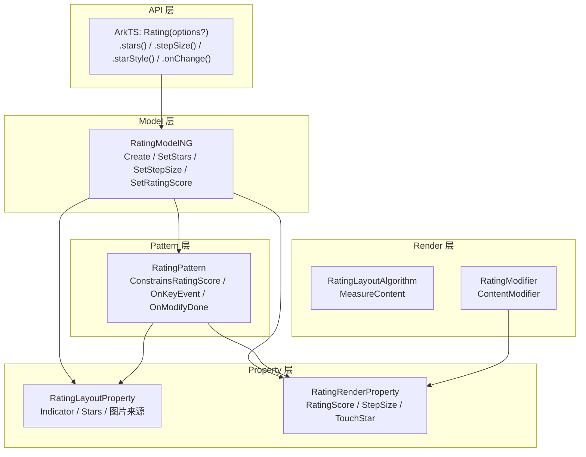

# 架构设计

> Rating 组件是 ArkUI 输入表单类组件中的星级评分组件，支持触摸/拖拽/键盘设置评分值，并提供指示器模式用于只读展示。

## 设计元数据

| 字段 | 内容 |
|------|------|
| Design ID | DESIGN-Func-05-04-03 |
| 关联需求 | 已有能力补录（无独立 requirement.md） |
| 关联 Epic | 无 |
| 目标 Feature | Feat-01 Rating 评分组件 |
| 复杂度 | 中等 |
| 目标版本 | API 7 起支持，API 12 内容修饰器，API 18 属性 Optional 重载，API 20 ResourceStr 图片源，API 23 静态版本 |
| Owner | ArkUI SIG |
| 状态 | Baselined（已有实现补录） |

## 需求基线

| 字段 | 内容 |
|------|------|
| 问题陈述 | 应用需要一种星级评分组件，支持用户通过触摸/拖拽/键盘设置分数，同时支持只读指示器展示 |
| 核心目标 | （Feat-01）提供 Rating 评分组件，支持 rating/indicator 构造参数、stars/stepSize/starStyle 属性、onChange 回调、指示器模式、RTL、键盘导航和无障碍 |
| P0 AC | AC-1.1~1.4（创建）、AC-2.1~2.3（stars）、AC-3.1~3.4（stepSize）、AC-4.1~4.3（starStyle）、AC-5.1~5.2（onChange）、AC-6.1~6.3（指示器）、AC-7.1~7.2（RTL）、AC-8.1~8.4（键盘）、AC-9.1~9.2（无障碍/contentModifier） |

## 上下文和现状

### 涉及仓和模块

| 仓库 | 模块路径 | 当前职责 | 本 Feature 影响 |
|------|----------|----------|-----------------|
| ace_engine | `frameworks/core/components_ng/pattern/rating/` | Rating 组件 Pattern/LayoutProperty/RenderProperty/EventHub 定义 | 全量涉及 |
| ace_engine | `frameworks/core/components_ng/pattern/rating/rating_model_ng.cpp` | NG Model 层，创建和属性设置 | 全量涉及 |
| ace_engine | `frameworks/bridge/declarative_frontend/jsview/rating/js_rating.cpp` | JS 桥接层 | 全量涉及 |
| ace_engine | `frameworks/bridge/declarative_frontend/ark_component/src/ArkRating.ts` | ArkTS 组件定义 | 全量涉及 |
| ace_engine | `frameworks/core/components_ng/pattern/rating/rating_modifier.h` | ContentModifier 渲染 | 全量涉及 |

### 调用链层级分析

| 层 | 模块 | 职责 | 修改类型 |
|----|------|------|----------|
| JS Bridge | `frameworks/bridge/declarative_frontend/jsview/rating/js_rating.cpp/.h` | JS→C++ 调用桥接，解析 Rating 构造参数和属性 | 无修改（规格补录） |
| ArkTS Modifier | `frameworks/bridge/declarative_frontend/ark_component/src/ArkRating.ts` | ArkTS 组件定义，属性修改器 | 无修改（规格补录） |
| Model | `frameworks/core/components_ng/pattern/rating/rating_model_ng.cpp/.h` | NG Model 层：Create + SetRatingScore/SetIndicator/SetStars/SetStepSize/SetForegroundSrc 等 | 无修改（规格补录） |
| Pattern | `frameworks/core/components_ng/pattern/rating/rating_pattern.cpp/.h` | 评分约束、事件计算、键盘处理、图片加载 | 无修改（规格补录） |
| LayoutProperty | `frameworks/core/components_ng/pattern/rating/rating_layout_property.h` | 存储 Indicator/Stars/图片来源，脏标记 PROPERTY_UPDATE_MEASURE | 无修改（规格补录） |
| RenderProperty | `frameworks/core/components_ng/pattern/rating/rating_render_property.h` | 存储 RatingScore/StepSize/TouchStar，脏标记 PROPERTY_UPDATE_RENDER | 无修改（规格补录） |
| LayoutAlgorithm | `frameworks/core/components_ng/pattern/rating/rating_layout_algorithm.cpp` | MeasureContent 尺寸计算 | 无修改（规格补录） |
| Accessibility | `frameworks/core/components_ng/pattern/rating/rating_accessibility_property.cpp/.h` | HasRange=true，GetAccessibilityValue | 无修改（规格补录） |
| Modifier | `frameworks/core/components_ng/pattern/rating/rating_modifier.h` | RatingModifier : ContentModifier 渲染 | 无修改（规格补录） |
| C-API | `frameworks/core/components_ng/pattern/rating/rating_ops_accessor.cpp` | C-API 回调注册 | 无修改（规格补录） |

### 适用架构规则

| 规则 ID | 设计结论 |
|---------|----------|
| OH-ARCH-01 | 组件遵循 Pattern-LayoutProperty-RenderProperty-LayoutAlgorithm-PaintMethod 架构 |
| OH-ARCH-02 | 布局属性（Indicator/Stars/图片来源）与渲染属性（RatingScore/StepSize/TouchStar）分离存储 |
| OH-ARCH-03 | ContentModifier 模式用于自定义渲染（API 12+） |

## 不涉及项承接

| 维度 | 结论 |
|------|------|
| 性能 | N/A — Rating 为轻量组件，图片加载在 OnModifyDone 中处理 |
| 安全与权限 | N/A — Rating 不涉及安全敏感操作 |
| 兼容性 | 展开设计 — API 7→18→20→23 间 starStyle 类型与参数 Optional 重载需兼容性声明 |
| API/SDK | 展开设计 — ArkTS API 签名需与 SDK 定义交叉验证 |
| IPC/跨进程 | N/A — Rating 为纯 UI 组件 |
| 构建与部件 | N/A — Rating 源码已包含在 ace_core_ng_source_set 中 |

## 关键设计决策

| 决策 ID | 问题 | 推荐方案 | 探索过的替代方案 | 取舍理由 | 影响 |
|---------|------|----------|------------------|----------|------|
| ADR-1 | 评分值约束策略 | ConstrainsRatingScore 在 stars<=0/ratingScore<=0/stepSize>stars 时重置为默认值 | 抛出异常 | 静默重置保持向后兼容，不中断应用运行 | 开发者不会收到非法值警告 |
| ADR-2 | 绘制评分计算 | drawScore = Round(ratingScore/stepSize)*stepSize，再钳位到 [0, stars] | 直接使用 ratingScore | 步长对齐确保视觉与步长一致 | 评分值可能与输入的 ratingScore 不完全相等 |
| ADR-3 | 尺寸计算策略 | MeasureContent 中 width-only→height=width/stars，height-only→width=height*stars，指示器 12vp 非指示器 28vp | 固定尺寸 | 按星星比例计算确保正方形星星 | 需同时处理四种 selfIdealSize 情况 |
| ADR-4 | 指示器模式禁用交互 | indicator=true 时 FocusType::DISABLE，禁用触摸/点击/拖拽/键盘 | 仅禁用触摸 | 全面禁用确保只读语义 | 指示器模式无法获得焦点 |
| ADR-5 | RTL 触摸 X 反转 | RTL 下 touchStarIndex = starNum - wholeStarNum - 1 | 不反转 | RTL 下视觉从右到左，触摸坐标需反转映射 | 触摸行为与 LTR 镜像 |
| ADR-6 | 图片加载成功码 | RATING_IMAGE_SUCCESS_CODE=0b111，三张图片全部加载成功 | 逐张判断 | 统一位掩码简化判断 | 部分加载失败时回退到主题默认图片 |
| ADR-7 | contentModifier 自定义渲染 | RatingModifier 继承 ContentModifier，通过 RatingConfiguration 传递 rating/indicator/stars/stepSize/triggerChange | 仅支持内置渲染 | 允许开发者完全自定义星星渲染 | 自定义渲染需自行处理触摸映射 |

## 设计骨架

### 骨架范围

| 骨架项 | 目标 | 不包含 | 验证方式 |
|--------|------|--------|----------|
| RatingLayoutProperty | 存储 Indicator/Stars/图片来源 | 渲染属性 | 代码审查 |
| RatingRenderProperty | 存储 RatingScore/StepSize/TouchStar | 布局属性 | 代码审查 |
| RatingPattern | 评分约束、事件计算、键盘处理 | 布局算法 | 单元测试 |
| RatingLayoutAlgorithm | MeasureContent 尺寸计算 | 绘制逻辑 | 单元测试 |
| RatingModelNG | 创建和属性设置 API | 旧版 Model 实现 | 单元测试 |
| RatingModifier | ContentModifier 自定义渲染 | 内置渲染 | 代码审查 |

### 骨架 Spec 拆分

| Task ID | 目标 | 受影响文件 | AC |
|---------|------|------------|-----|
| TASK-SKELETON-1 | RatingLayoutProperty 定义 | `rating_layout_property.h` | AC-4.1, AC-4.3 |
| TASK-SKELETON-2 | RatingRenderProperty 定义 | `rating_render_property.h` | AC-3.3, AC-5.2 |
| TASK-SKELETON-3 | RatingPattern 评分约束与键盘 | `rating_pattern.cpp` | AC-1.1~1.4, AC-8.1~8.4 |
| TASK-SKELETON-4 | RatingLayoutAlgorithm 尺寸计算 | `rating_layout_algorithm.cpp` | AC-6.1~6.3 |
| TASK-SKELETON-5 | RatingModelNG 创建流程 | `rating_model_ng.cpp` | AC-1.1, AC-2.1, AC-3.1 |

## 后续 Task 拆分

| Task ID | 目标 | 受影响文件 | 依赖 |
|---------|------|------------|------|
| TASK-1 | Rating 组件全部行为规格 | Feat-01-rating-full-spec.md | 无 |

## API 签名、Kit 与权限

### 新增 API

| API 签名 | 类型 | d.ts 位置 | 权限要求 | SysCap |
|----------|------|-----------|----------|--------|
| `Rating(options?: RatingOptions)` | Public | `rating.d.ts` | - | ArkUI.Component |
| `.stars(value: number)` | Public | `rating.d.ts` | - | ArkUI.Component |
| `.stepSize(value: number)` | Public | `rating.d.ts` | - | ArkUI.Component |
| `.starStyle(value: StarStyleOptions)` | Public | `rating.d.ts` | - | ArkUI.Component |
| `.onChange(handler: OnRatingChangeCallback)` | Public | `rating.d.ts` | - | ArkUI.Component |
| `.contentModifier(modifier: ContentModifier<RatingConfiguration>)` | Public | `rating.d.ts` | - | ArkUI.Component |

### 变更/废弃 API

| 原有 API | 变更类型 | 新 API | 迁移说明 |
|----------|----------|--------|----------|
| `Rating(rating: number, indicator?: boolean)` | 变更(API 18) | `Rating(options?: RatingOptions)` | 参数改为 Optional 重载，旧调用方式仍兼容 |
| `starStyle(value: string)` | 变更(API 20) | `starStyle(value: StarStyleOptions)` | 图片源类型从 string 改为 ResourceStr |

## 构建系统影响

### BUILD.gn 变更

```
无变更。Rating 组件实现位于 ace_core_ng_source_set，已有构建配置覆盖。
```

### bundle.json 变更

无变更。

## 可选设计扩展

### 架构图



### 数据流/控制流

| 步骤 | 调用方 | 被调用方 | 数据/接口 | 说明 |
|------|--------|----------|-----------|------|
| 1 | ArkTS | RatingModelNG::Create | rating, indicator | 创建 FrameNode（tag=RATING_ETS_TAG） |
| 2 | Create | RatingLayoutProperty | Indicator, Stars, 图片来源 | 设置初始布局属性 |
| 3 | Create | RatingRenderProperty | RatingScore, StepSize | 设置渲染属性 |
| 4 | RatingPattern | ConstrainsRatingScore | stars, ratingScore, stepSize | 约束评分值范围 |
| 5 | RatingPattern | RecalculatedRatingScoreBasedOnEventPoint | touchPoint, RTL | 计算触摸对应的评分值 |
| 6 | RatingPattern | OnKeyEvent | KeyEvent | 处理 DPAD/HOME/END/ENTER/SPACE |
| 7 | RatingPattern | OnModifyDone | — | 加载前景/次级/背景图片 |
| 8 | RatingLayoutAlgorithm | MeasureContent | selfIdealSize, stars | 计算组件尺寸 |

### 数据模型设计

**ArkTS (API 层类型)**

```typescript
interface RatingOptions {
  rating: number;
  indicator?: boolean;
}
interface StarStyleOptions {
  backgroundUri: string | Resource;
  foregroundUri: string | Resource;
  secondaryUri?: string | Resource;
}
interface RatingConfiguration {
  rating: number;
  indicator: boolean;
  stars: number;
  stepSize: number;
  triggerChange: (value: number) => void;
}
```

**C++ (框架层结构)**

```cpp
struct RatingPropertyGroup {
  bool indicator;
  int32_t stars;
  SourceInfo foregroundImageSourceInfo;
  SourceInfo secondaryImageSourceInfo;
  SourceInfo backgroundImageSourceInfo;
};
struct RatingRenderProperty {
  double ratingScore;
  double stepSize;
  int32_t touchStar;
};
```

## 详细设计

### 评分约束流程

**入口**: `RatingPattern::ConstrainsRatingScore()` (`rating_pattern.cpp:303-341`)

```
1. IF stars <= 0 -> 重置 stars 为 DEFAULT_RATING_STAR_NUMBER(5)
2. IF ratingScore <= 0 -> 重置 ratingScore 为 DEFAULT_RATING_SCORE_VALUE(0.0)
3. IF stepSize > stars -> 重置 stepSize 为 DEFAULT_RATING_STEP_SIZE_VALUE(0.5)
4. 计算 drawScore = Round(ratingScore / stepSize) * stepSize
5. 钳位 drawScore 到 [0, stars]
```

### 触摸事件评分计算

**入口**: `RatingPattern::RecalculatedRatingScoreBasedOnEventPoint()` (`rating_pattern.cpp:343-393`)

```
1. 获取组件宽度和星星数量
2. 计算每星宽度 perStarWidth = width / stars
3. IF RTL -> X 坐标反转: x = width - x
4. wholeStarNum = floor(x / perStarWidth)
5. decimalPart = (x - wholeStarNum * perStarWidth) / perStarWidth
6. IF decimalPart >= 0.5 -> wholeStarNum += 1
7. touchStarIndex (RTL) = starNum - wholeStarNum - 1
8. newScore = wholeStarNum * stepSize (按步长对齐)
9. 钳位到 [0, stars]
```

### 尺寸计算

**入口**: `RatingLayoutAlgorithm::MeasureContent()` (`rating_layout_algorithm.cpp:22-78`)

```
1. 获取 selfIdealSize
2. IF 宽高都有值 -> 直接返回
3. IF 仅宽度有值 -> height = width / stars
4. IF 仅高度有值 -> width = height * stars
5. IF 都无值:
   - indicator=true -> height=12vp, width=height*stars
   - indicator=false -> height=28vp, width=height*stars
6. 返回 Size(width, height)
```

### 键盘导航

**入口**: `RatingPattern::OnKeyEvent()` (`rating_pattern.cpp:642-679`)

```
支持按键:
- DPAD_LEFT / Left -> 评分减少 stepSize
- DPAD_RIGHT / Right -> 评分增加 stepSize
- HOME -> 评分设为 0
- END -> 评分设为 stars
- ENTER / SPACE -> 触发 onChange 回调
```

## 风险和开放问题

| 项 | 类型 | 影响 | 处理方式 | Owner |
|----|------|------|----------|-------|
| API 18 参数 Optional 重载 | 兼容性 | 中 | 兼容性声明标注，旧调用方式仍可用 | ArkUI SIG |
| API 20 starStyle 类型从 string 改为 ResourceStr | 兼容性 | 中 | 兼容性声明标注 | ArkUI SIG |
| secondaryUri 缺失时回退到 backgroundUri | 行为 | 低 | 文档化回退行为 | ArkUI SIG |
| indicator 模式 FocusType::DISABLE 导致无障碍焦点不可达 | 无障碍 | 中 | 通过 AccessibilityProperty HasRange 仍暴露范围信息 | ArkUI SIG |
| OnInjectionEvent 注入事件处理 | 架构 | 中 | 文档化注入事件对评分值的影响 | ArkUI SIG |

## 设计审批

- [x] 需求基线已确认，设计覆盖 P0 AC
- [x] 不涉及项已承接，N/A 和展开项都有结论
- [x] 涉及仓和模块职责清楚
- [x] 适用架构规则已识别并形成设计结论
- [x] 分层和子系统边界合规
- [x] API 变更有签名、权限、错误码和兼容性说明
- [x] BUILD.gn/bundle.json 影响明确
- [x] 设计输出和后续 Task 拆分明确
- [x] 关键设计决策有理由和影响说明
- [x] 风险和开放问题有 Owner

**结论:** 通过（已有实现补录）
