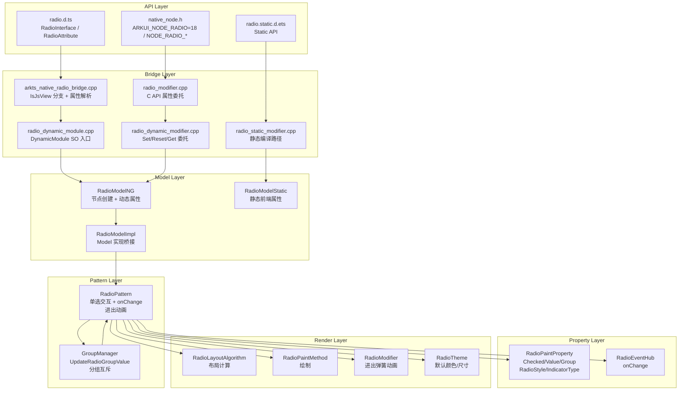
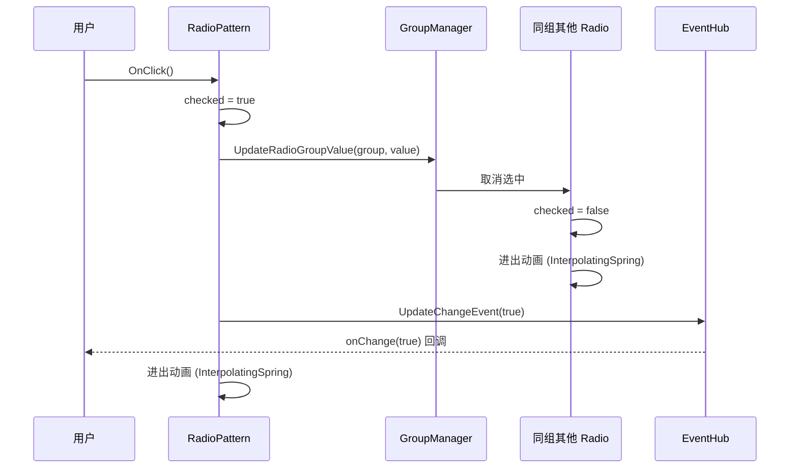
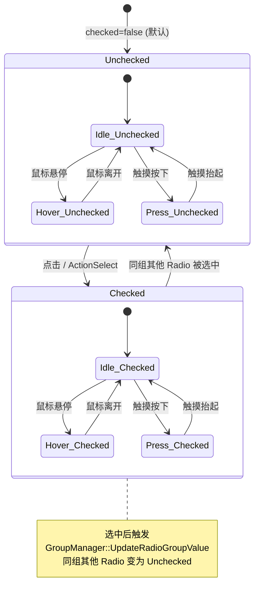

# 架构设计
> Radio 组件的架构设计文档，覆盖单选交互、选中状态管理、RadioGroup 分组互斥、样式定制和扩展能力。

## 设计元数据

| 字段 | 内容 |
|------|------|
| Design ID | DESIGN-Func-05-04-04 |
| 关联需求 | 已有能力补录（无独立 requirement.md） |
| 关联 Epic | 无 |
| 目标 Feature | Feat-01: Radio 组件全量规格 |
| 复杂度 | 标准 |
| 目标版本 | API 8 ~ API 26+ |
| Owner | ArkUI SIG |
| 状态 | Baselined（已有实现补录） |

## 需求基线

> 需求基线详见 proposal.md。以下仅列出设计阶段需要额外强调的要点。

| 项 | 补充说明（如需） |
|----|------------------|
| RadioGroup 分组互斥 | Radio 通过 GroupManager 实现分组内单选互斥，选中一个 Radio 时自动取消同组其他 Radio 的选中状态 |
| UpdateRadioGroupValue | Radio 选中时通过 GroupManager::UpdateRadioGroupValue 通知同组其他 Radio 取消选中 |
| indicatorType | API 12 引入 indicatorType (TICK/DOT/CUSTOM)，控制选中指示器样式 |
| 进出动画 | Radio 选中/取消使用 InterpolatingSpring 弹簧动画 |
| 组件化 | Radio 已完成组件化改造，输出独立 SO libarkui_radio.z.so，无遗留 JSView 文件 |
| C API | Radio 暴露为 ARKUI_NODE_RADIO=18 |

## 上下文和现状

### 涉及仓和模块

| 仓库 | 模块路径 | 当前职责 | 本 Feature 影响 |
|------|----------|----------|-----------------|
| ace_engine | `frameworks/core/components_ng/pattern/radio/radio_pattern.cpp` | RadioPattern：单选交互、选中状态管理、RadioGroup 互斥 | 核心实现，规格补录 |
| ace_engine | `frameworks/core/components_ng/pattern/radio/radio_layout_algorithm.cpp` | RadioLayoutAlgorithm：布局计算 | 规格补录 |
| ace_engine | `frameworks/core/components_ng/pattern/radio/radio_paint_method.cpp` | RadioPaintMethod：绘制方法 | 规格补录 |
| ace_engine | `frameworks/core/components_ng/pattern/radio/radio_paint_property.cpp` | RadioPaintProperty：绘制属性 | 规格补录 |
| ace_engine | `frameworks/core/components_ng/pattern/radio/radio_event_hub.h` | RadioEventHub：onChange 事件 | 规格补录 |
| ace_engine | `frameworks/core/components_ng/pattern/radio/radio_model_ng.cpp` | RadioModelNG：动态属性写入、节点创建 | 规格补录 |
| ace_engine | `frameworks/core/components_ng/pattern/radio/radio_model_static.cpp` | RadioModelStatic：静态前端属性写入 | 规格补录 |
| ace_engine | `frameworks/core/components_ng/pattern/radio/radio_model_impl.cpp` | RadioModelImpl：Model 实现 | 规格补录 |
| ace_engine | `frameworks/core/components_ng/pattern/radio/radio_accessibility_property.cpp` | RadioAccessibilityProperty：无障碍 | 规格补录 |
| ace_engine | `frameworks/core/components_ng/pattern/radio/radio_theme.h` | RadioTheme：主题定义 | 规格补录 |
| ace_engine | `frameworks/core/components_ng/pattern/radio/radio_modifier.h` | RadioModifier：Modifier 定义 | 规格补录 |
| ace_engine | `frameworks/core/components_ng/pattern/radio/bridge/` | 组件化 Bridge / DynamicModule | 规格补录 |
| ace_engine | `frameworks/core/interfaces/native/node/radio_modifier.cpp` | C API 属性委托层 | 规格补录 |
| ace_engine | `interfaces/native/native_node.h` | C API 枚举定义 ARKUI_NODE_RADIO=18、NODE_RADIO_* | 规格补录 |
| interface/sdk-js | `api/@internal/component/ets/radio.d.ts` | Dynamic API 声明 | 规格对照 |
| interface/sdk-js | `api/arkui/component/radio.static.d.ets` | Static API 声明 | 规格对照 |

### 调用链层级分析

| 层 | 模块 | 职责 | 修改类型 |
|----|------|------|----------|
| JS Bridge | `frameworks/bridge/declarative_frontend/ark_component/components/arkradio.js`, `frameworks/bridge/declarative_frontend/ark_modifier/src/radio_modifier.ts` | ArkTS 组件类与 Modifier 类，属性解析入口 | 无修改（规格补录） |
| Bridge | `frameworks/core/components_ng/pattern/radio/bridge/arkts_native_radio_bridge.cpp` | 属性解析、IsJsView 分支 + 参数解析 | 无修改（规格补录） |
| Bridge (DynamicModule) | `frameworks/core/components_ng/pattern/radio/bridge/radio_dynamic_module.cpp` | 组件化 SO 入口（libarkui_radio.z.so），DynamicModule 注册 | 无修改（规格补录） |
| Bridge (DynamicModifier) | `frameworks/core/components_ng/pattern/radio/bridge/radio_dynamic_modifier.cpp` | Set/Reset/Get 属性委托层 | 无修改（规格补录） |
| Bridge (StaticModifier) | `frameworks/core/components_ng/pattern/radio/bridge/radio_static_modifier.cpp` | 静态编译路径属性委托 | 无修改（规格补录） |
| Model | `frameworks/core/components_ng/pattern/radio/radio_model_ng.cpp` | 节点创建、动态属性写入、group 设置 | 无修改（规格补录） |
| Model (Static) | `frameworks/core/components_ng/pattern/radio/radio_model_static.cpp` | 静态前端属性写入 | 无修改（规格补录） |
| Model (Impl) | `frameworks/core/components_ng/pattern/radio/bridge/radio_model_impl.cpp` | Model 实现桥接 | 无修改（规格补录） |
| Pattern | `frameworks/core/components_ng/pattern/radio/radio_pattern.cpp/.h` | 单选交互、选中状态管理、onChange 事件、GroupManager 互斥、进出动画、ContentModifier 支持 | 无修改（规格补录） |
| Layout | `frameworks/core/components_ng/pattern/radio/radio_layout_algorithm.cpp/.h` | 布局计算 | 无修改（规格补录） |
| Paint | `frameworks/core/components_ng/pattern/radio/radio_paint_method.cpp/.h` | 绘制方法 | 无修改（规格补录） |
| Property | `frameworks/core/components_ng/pattern/radio/radio_paint_property.cpp/.h` | 绘制属性：Checked/Value/Group/RadioStyle/IndicatorType | 无修改（规格补录） |
| Event | `frameworks/core/components_ng/pattern/radio/radio_event_hub.h` | 事件分发 | 无修改（规格补录） |
| Theme | `frameworks/core/components_ng/pattern/radio/radio_theme.h` | RadioTheme：默认颜色/尺寸 | 无修改（规格补录） |
| Modifier | `frameworks/core/components_ng/pattern/radio/radio_modifier.h` | RadioModifier：进出动画渲染 | 无修改（规格补录） |
| C-API | `frameworks/core/interfaces/native/node/radio_modifier.cpp/.h` | C API 属性 Set/Reset/Get 委托层（NODE_RADIO_*） | 无修改（规格补录） |

### 适用架构规则

| Rule ID | 适用原因 | 设计结论 | 验证方式 |
|---------|----------|----------|----------|
| OH-ARCH-LAYERING | Radio 涉及 API → Bridge → Model → Pattern → Layout/Paint 多层调用 | 调用方向自上而下，Pattern 不直接访问 Bridge 层 | 代码评审 |
| OH-ARCH-API-LEVEL | Radio 有 @since 8/10/12/23 等多版本 API | 各版本 API 通过 PlatformVersion 条件分支实现兼容 | API 评审 / XTS |
| OH-ARCH-COMPONENT-BUILD | Radio 已组件化为独立 SO（libarkui_radio.z.so） | DynamicModule 注册机制，通过 RadioDynamicModule 入口 | 构建验证 |
| OH-ARCH-SUBSYSTEM | Radio 通过 GroupManager 与同组其他 Radio 联动，同仓跨模块依赖 | GroupManager 提供分组管理抽象，Radio 间通过 group 属性关联 | 依赖检查 |
| OH-ARCH-ERROR-LOG | Radio 涉及状态切换和分组互斥 | 关键路径有 hilog 打点覆盖 | 单测/hilog |

## 不涉及项承接

> proposal.md 已完成 N/A 判定。本节仅对 proposal 中标记为"涉及"且需展开设计的维度给出结论。

| 维度 | 设计结论 |
|------|----------|
| 无障碍 | Radio 实现 AccessibilityProperty，报告 IsCheckable=true、IsChecked=当前选中状态，支持 ActionSelect |
| 深色模式 | 颜色属性使用 ResourceColor 类型，支持 Token 主题切换，通过 RadioTheme 映射 |
| 版本升级兼容 | API 12 新增 indicatorType/indicatorBuilder/contentModifier；API 23 新增 Static API；需在 spec 兼容性声明中明确 |
| 大字体 | Radio 尺寸跟随系统字体缩放 |

## 关键设计决策

| 决策 ID | 问题 | 推荐方案 | 探索过的替代方案 | 取舍理由 | 影响 |
|---------|------|----------|-----------------|----------|------|
| ADR-1 | Radio 分组互斥如何实现 | 通过 GroupManager 管理分组，选中时调用 UpdateRadioGroupValue 通知同组其他 Radio 取消选中 | 直接在 Pattern 中遍历同组节点 | GroupManager 提供统一的分组管理抽象，避免 Pattern 直接访问节点树 | AC-1.3, AC-4.1 ~ AC-4.3 |
| ADR-2 | checked 属性的语义 | checked 为只读属性（通过 API 设置不生效），仅通过点击或 RadioGroup 联动改变 | 允许程序化设置 checked | 防止与分组互斥逻辑冲突；选中状态由交互或 group 联动驱动 | AC-1.1, AC-1.2 |
| ADR-3 | radioStyle 属性的引入 | API 10 引入 radioStyle 复合属性，封装选中指示器的样式（indicatorColor/indicatorRadius） | 分别暴露独立属性 | radioStyle 提供更简洁的 API 调用 | AC-2.1, AC-2.2 |
| ADR-4 | indicatorType 的引入 | API 12 引入 indicatorType (TICK/DOT/CUSTOM)，控制选中指示器样式 | 固定使用 DOT 样式 | 不同场景需要不同指示器样式 | AC-3.1 ~ AC-3.3 |
| ADR-5 | indicatorBuilder 的定位 | API 12 引入 indicatorBuilder，允许通过 Builder 函数自定义选中指示器 | 扩展 indicatorType 枚举 | indicatorBuilder 提供完全自定义能力，不增加枚举复杂度 | AC-3.3 |
| ADR-6 | 进出动画的选择 | 使用 InterpolatingSpring 弹簧动画 | 使用线性/缓动曲线 | 弹簧动画提供更自然的视觉反馈，符合 Material 设计理念 | AC-5.1, AC-5.2 |
| ADR-7 | C API 暴露哪些属性 | 暴露 NODE_RADIO_CHECKED、NODE_RADIO_STYLE、NODE_RADIO_VALUE、NODE_RADIO_GROUP | 全量暴露 | C API 聚焦核心属性 | AC-7.1 ~ AC-7.5 |

## 设计骨架

### 骨架范围

| 骨架项 | 目标 | 不包含 | 验证方式 |
|--------|------|--------|----------|
| Radio 选中交互 | 点击选中 + onChange 回调 + 分组互斥 | 组合手势场景 | UT |
| Radio 样式 | radioStyle/indicatorType/indicatorBuilder 全量属性 | 通用属性 | UT |
| RadioGroup 互斥 | GroupManager::UpdateRadioGroupValue + 同组取消选中 | 独立 Radio 的选中逻辑 | UT |
| 进出动画 | InterpolatingSpring 弹簧动画 | 自定义动画曲线 | 手工 |
| ContentModifier | 自定义渲染 + RadioConfiguration 回调 | 自定义动画曲线 | UT |
| C API 映射 | NODE_RADIO_* 的 Set/Reset/Get | 样式子属性的 C API | C API UT |
| 无障碍 | IsCheckable/IsChecked/ActionSelect | 无障碍自动化测试框架 | UT |

### 骨架 Spec 拆分

| Task ID | 目标 | 受影响文件 | AC |
|---------|------|-----------|-----|
| TASK-SKELETON-1 | Radio 全量规格补录（交互、样式、分组互斥、动画、C API、无障碍） | Feat-01-radio-full-spec.md | AC-1.1 ~ AC-7.5 |

## 后续 Task 拆分

| Task ID | 目标 | 受影响文件 | 依赖 |
|---------|------|-----------|------|
| TASK-RADIO-01 | Radio 全量规格补录 | Feat-01-radio-full-spec.md, design.md | 无 |

## API 签名、Kit 与权限

> 本节承接 spec.md"API 变更分析"中识别的 API，给出签名、权限和 d.ts 位置等实现细节。

### 新增 API

| API 签名 | 类型 | d.ts 位置 | 权限要求 | SysCap |
|----------|------|-----------|----------|--------|
| `Radio(options: { group: string, value: string }): RadioAttribute` | Public | `@internal/component/ets/radio.d.ts` | 无 | SystemCapability.ArkUI.ArkUI.Full |
| `.checked(checked: boolean): RadioAttribute` | Public | `radio.d.ts` | 无 | 同上 |
| `.radioStyle(value: RadioStyle): RadioAttribute` | Public | `radio.d.ts` | 无 | 同上 |
| `.onChange(callback: (isChecked: boolean) => void): RadioAttribute` | Public | `radio.d.ts` | 无 | 同上 |
| `.contentModifier(modifier: ContentModifier<RadioConfiguration>): RadioAttribute` | Public | `radio.d.ts` | 无 | 同上 |
| `.indicatorType(value: RadioIndicatorType): RadioAttribute` | Public | `radio.d.ts` | 无 | 同上 |
| `.indicatorBuilder(builder: CustomBuilder): RadioAttribute` | Public | `radio.d.ts` | 无 | 同上 |
| `NODE_RADIO_CHECKED` | NDK/Public | `native_node.h` | 无 | 同上 |
| `NODE_RADIO_STYLE` | NDK/Public | `native_node.h` | 无 | 同上 |
| `NODE_RADIO_VALUE` | NDK/Public | `native_node.h` | 无 | 同上 |
| `NODE_RADIO_GROUP` | NDK/Public | `native_node.h` | 无 | 同上 |

### 变更/废弃 API

| 原有 API | 变更类型 | 新 API | 迁移说明 |
|----------|----------|--------|----------|
| 无 | — | — | — |

## 构建系统影响

### BUILD.gn 变更

Radio 已完成组件化改造，输出独立 SO：

```
# frameworks/core/components_ng/pattern/radio/BUILD.gn
# 构建目标：libarkui_radio.z.so
# DynamicModule 入口：radio_dynamic_module.cpp
# 包含 Radio 的 Pattern/Model/Layout/Paint/Event/Bridge 代码
```

### bundle.json 变更

Radio 组件作为 ace_engine 的内部 component，无独立 bundle.json 变更。

## 可选设计扩展

### 架构图



### 数据流/控制流

| 步骤 | 调用方 | 被调用方 | 数据/接口 | 说明 |
|------|--------|----------|-----------|------|
| 1 | ArkTS/C API | Bridge / node_modifier | RadioOptions / 属性值 | 属性设置入口 |
| 2 | Bridge | RadioModelNG | Create(value, group) | 创建 Radio 节点 |
| 3 | RadioModelNG | RadioPattern | AceType::MakeRefPtr | 创建 Pattern |
| 4 | 用户交互 | RadioPattern::OnClick | checked = true | 选中交互 |
| 5 | RadioPattern | GroupManager | UpdateRadioGroupValue(group, value) | 分组互斥通知 |
| 6 | GroupManager | 同组其他 RadioPattern | 取消选中 | 互斥联动 |
| 7 | RadioPattern | RadioEventHub | UpdateChangeEvent(isChecked) | 事件回调 |
| 8 | RadioPattern | RadioModifier | 进出弹簧动画 | 动画过渡 |

### 时序设计



### 数据模型设计

**API 层类型 (TypeScript)**:

```typescript
// RadioIndicatorType 枚举 (@since 12)
enum RadioIndicatorType { TICK = 0, DOT = 1, CUSTOM = 2 }

// RadioStyle 接口 (@since 10)
interface RadioStyle {
  indicatorColor?: ResourceColor;
  indicatorRadius?: Length | Resource;
}

// RadioOptions
interface RadioOptions {
  group: string;
  value: string;
}

// ContentModifier 配置 (@since 12)
interface RadioConfiguration extends CommonConfiguration<RadioConfiguration> {
  checked: boolean;
  enabled: boolean;
  triggerChange: Callback<boolean>;
}
```

**框架层结构 (C++)**:

```cpp
// RadioPaintProperty 关键字段
ACE_DEFINE_PROPERTY_ITEM_WITHOUT_GROUP(Checked, bool);             // PROPERTY_UPDATE_MEASURE
ACE_DEFINE_PROPERTY_ITEM_WITHOUT_GROUP(Value, std::string);        // PROPERTY_UPDATE_MEASURE
ACE_DEFINE_PROPERTY_ITEM_WITHOUT_GROUP(Group, std::string);        // PROPERTY_UPDATE_MEASURE
ACE_DEFINE_PROPERTY_ITEM_WITHOUT_GROUP(RadioIndicatorColor, Color);// @since 10
ACE_DEFINE_PROPERTY_ITEM_WITHOUT_GROUP(RadioIndicatorRadius, Dimension);// @since 10
ACE_DEFINE_PROPERTY_ITEM_WITHOUT_GROUP(RadioIndicatorType, int32_t);// @since 12
```

### 算法与状态机



### 测试性设计

| 测试层级 | 测试目标 | Mock 策略 | 验证方式 |
|----------|----------|-----------|----------|
| UT - Pattern | Radio 选中状态切换 + 事件触发 | MockRenderContext | gtest_filter |
| UT - GroupManager | 分组互斥 + UpdateRadioGroupValue | MockGroupManager | gtest_filter |
| UT - Layout | Radio 布局计算 + indicatorType | MockPipelineContext | gtest_filter |
| UT - Property | PaintProperty 设置/重置/默认值 | 直接构造 Property 对象 | gtest_filter |
| UT - Accessibility | IsCheckable/IsChecked/ActionSelect | MockAccessibilityNode | gtest_filter |
| UT - C API | radio_modifier Set/Reset/Get | C API UT 框架 | capi_all_modifiers_test |
| 手工 | 进出弹簧动画视觉效果 | 真机 | 视觉比对 |

### 接口参数规约

| 接口 | 参数 | 类型 | 合法范围 | 非法处理 | 边界说明 |
|------|------|------|----------|----------|----------|
| Radio() | group | string | 有效字符串 | 空字符串 | 关联到 RadioGroup |
| Radio() | value | string | 有效字符串 | 空字符串 | 唯一标识 |
| checked | checked | boolean | true/false | 只读属性，设置不生效 | 通过交互或联动改变 |
| radioStyle.indicatorColor | — | ResourceColor | 有效颜色值 | 使用 theme 默认 | @since 10 |
| radioStyle.indicatorRadius | — | Length \| Resource | ≥ 0 | 使用 theme 默认 | @since 10 |
| indicatorType | value | RadioIndicatorType | TICK/DOT/CUSTOM | 默认 DOT | @since 12 |
| NODE_RADIO_CHECKED | .value[0].i32 | int32_t | 0 或 1 | 按 bool 截断 | C API |
| NODE_RADIO_VALUE | .string | char* | 有效字符串 | 空字符串 | C API |
| NODE_RADIO_GROUP | .string | char* | 有效字符串 | 空字符串 | C API |
| NODE_RADIO_STYLE | 复合属性 | — | indicatorColor + indicatorRadius | 使用 theme 默认 | C API |

## 详细设计

### Radio 选中交互与分组互斥

`RadioPattern`（`radio_pattern.cpp`）管理单个 Radio 的选中/未选中状态。

**点击处理**：`RadioPattern::OnClick()` 翻转 checked 状态为 true（Radio 选中后不可通过点击取消选中，需选中同组其他 Radio 来互斥取消）。

**分组互斥**：
1. 用户点击 Radio A → Radio A checked = true
2. Radio A 调用 `GroupManager::UpdateRadioGroupValue(group, value)`（`radio_pattern.cpp`）
3. GroupManager 遍历同组其他 Radio，将其 checked 设为 false
4. 被取消选中的 Radio 触发进出动画
5. Radio A 的 onChange 回调触发，参数为 true

**checked 只读语义**：checked 为只读属性，通过 API 设置 checked 不生效。选中状态仅由：
- 用户点击交互
- RadioGroup 联动（其他 Radio 被选中时自动取消）

### Radio 样式属性

| 属性 | @since | 说明 | 属性分组 |
|------|--------|------|----------|
| checked | 8 | 选中状态（只读） | PROPERTY_UPDATE_MEASURE |
| radioStyle | 10 | 选中指示器复合样式 (indicatorColor/indicatorRadius) | PROPERTY_UPDATE_RENDER |
| onChange | 8 | 选中状态变化回调 | — |
| contentModifier | 12 | 自定义渲染 | — |
| indicatorType | 12 | 指示器类型 (TICK/DOT/CUSTOM) | PROPERTY_UPDATE_RENDER |
| indicatorBuilder | 12 | 自定义指示器 Builder | — |

### indicatorType 和 indicatorBuilder

**indicatorType (API 12)**：
- TICK: 勾选标记样式
- DOT: 圆点样式（默认）
- CUSTOM: 自定义样式（需配合 indicatorBuilder）

**indicatorBuilder (API 12)**：
- 通过 Builder 函数自定义选中指示器
- 仅在 indicatorType 为 CUSTOM 时生效
- 与 ContentModifier 不同，indicatorBuilder 仅替换选中指示器部分，保留默认容器

### 进出动画

Radio 选中/取消时使用 `InterpolatingSpring` 弹簧动画（`radio_modifier.h`）：

- 进入选中状态：指示器从 0 缩放到完整尺寸
- 退出选中状态：指示器从完整尺寸缩放到 0
- 使用弹簧参数提供自然过渡效果

### ContentModifier 自定义渲染

API 12 引入 `contentModifier`，通过 `RadioConfiguration` 回调自定义 Builder：

- `checked`: 当前选中状态
- `enabled`: 当前是否可用
- `triggerChange(checked)`: 程序化切换选中状态

ContentModifier 激活时，Radio 跳过默认渲染，使用自定义 Builder 内容替代。

### C API 属性映射

C API 通过 `radio_modifier.cpp` 委托到 `DynamicModuleHelper`：

| C API 枚举 | 值格式 | 说明 |
|-----------|--------|------|
| NODE_RADIO_CHECKED | `.value[0].i32` (0/1) | 选中状态 |
| NODE_RADIO_STYLE | 复合属性 | 指示器样式 (indicatorColor + indicatorRadius) |
| NODE_RADIO_VALUE | `.string` | Radio 值标识 |
| NODE_RADIO_GROUP | `.string` | 分组名称 |

### 无障碍属性

| 组件 | IsCheckable | IsChecked | ActionSelect |
|------|-------------|-----------|-------------|
| Radio | true | checked | UpdateSelectStatus(true) |

## 风险和开放问题

| 项 | 类型 | 影响 | 处理方式 | Owner |
|----|------|------|----------|-------|
| checked 只读语义可能困惑开发者 | API | 低 | 需在 API 文档中明确 checked 为只读属性，通过交互或联动改变 | ArkUI SIG |
| C API 缺少 indicatorType/indicatorBuilder | API | 中 | NDK 开发者无法通过 C API 设置指示器类型和自定义指示器；需在文档中明确 | ArkUI SIG |
| InterpolatingSpring 动画参数未对外暴露 | 行为 | 低 | 动画参数为内部固定值，开发者无法自定义；如需自定义应使用 ContentModifier | ArkUI SIG |
| GroupManager 在动态增删 Radio 时的状态同步 | 行为 | 中 | 需确保动态增删 Radio 时分组互斥逻辑正确 | ArkUI SIG |

## 设计审批

- [x] 需求基线已确认，设计覆盖 P0/P1 AC
- [x] 不涉及项已承接，N/A 和展开项都有结论
- [x] 涉及仓和模块职责清楚
- [x] 调用链层级分析完整，每层覆盖到位
- [x] 适用架构规则已识别并形成设计结论
- [x] 分层和子系统边界合规
- [x] API 变更有签名、权限、错误码和兼容性说明
- [x] BUILD.gn/bundle.json 影响明确
- [x] 设计输出和后续 Task 拆分明确
- [x] 关键设计决策有理由和影响说明
- [x] 风险和开放问题有 Owner

**结论:** 通过（已有实现补录）
