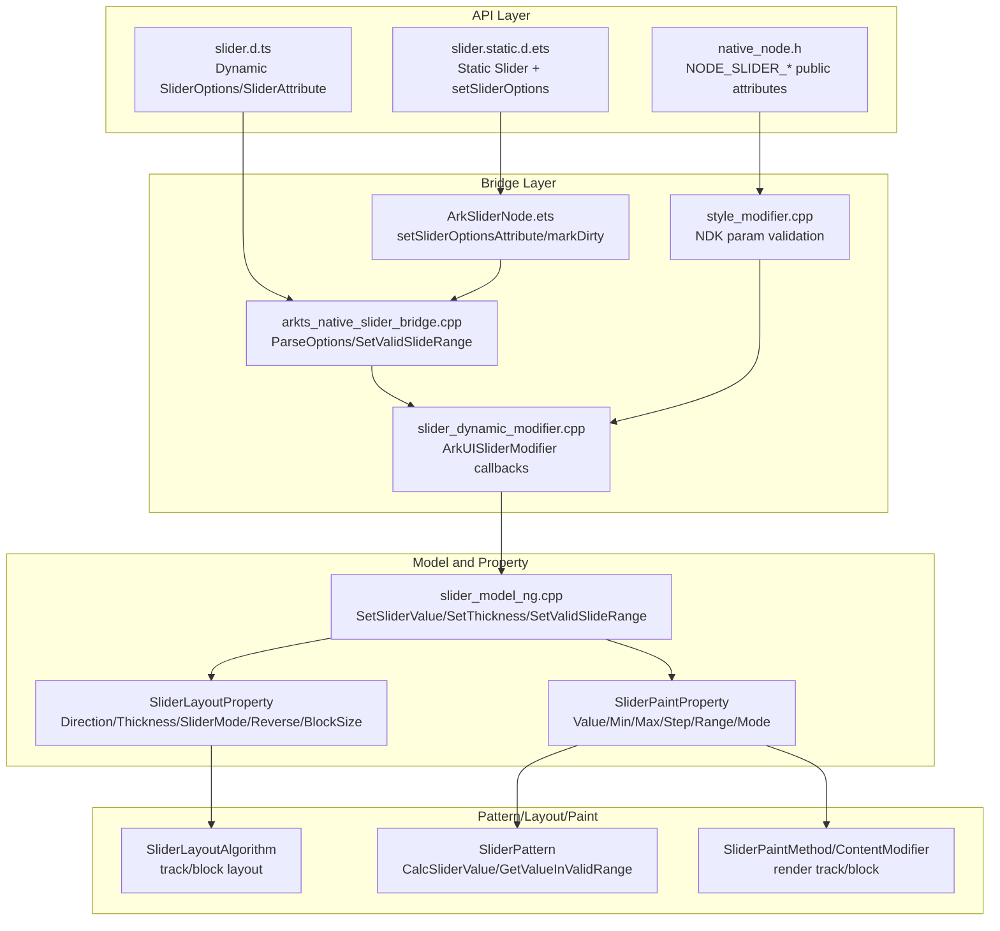
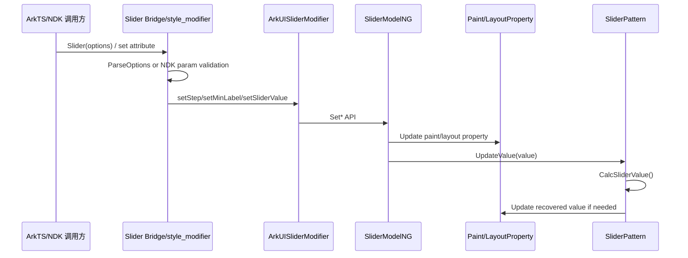
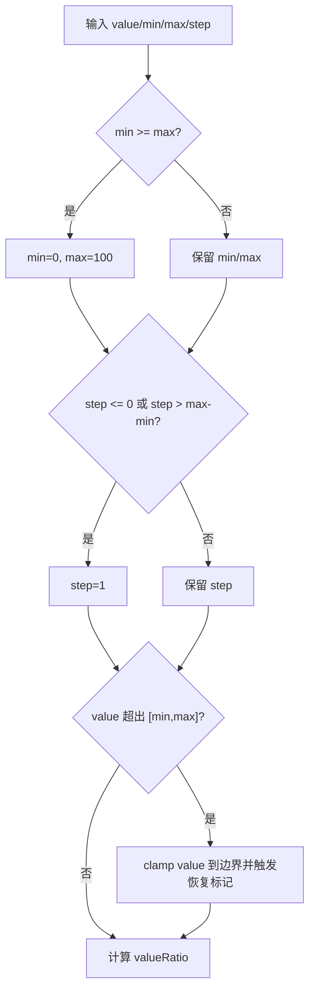
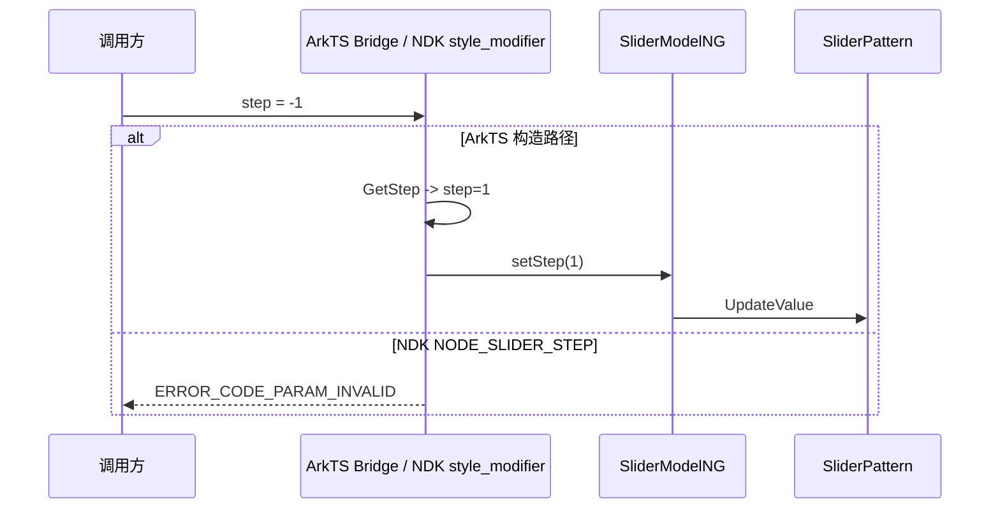

# 架构设计
> Slider 组件功能域的架构设计基线，覆盖创建参数、数值范围、布局样式、属性分层、ArkTS/Static ArkTS/NDK 接口边界。

## 设计元数据

| 字段 | 内容 |
|------|------|
| Design ID | DESIGN-Func-05-04-05 |
| 关联需求 | 已有能力补录（无独立 requirement.md） |
| 关联 Epic | 无 |
| 目标 Feature | Feat-01: 创建、数值范围与布局样式；Feat-02: 轨道、滑块与步点视觉；Feat-03: 交互模式、事件与反馈；Feat-04: 提示、自定义内容与无障碍内容 |
| 复杂度 | 标准 |
| 目标版本 | Dynamic API 7+ / Static API 23+ / NDK API 12+ |
| Owner | ArkUI SIG |
| 状态 | Baselined（已有实现补录） |

## 需求基线

> 需求基线详见 proposal.md。以下仅列出设计阶段需要额外强调的要点。

| 项 | 补充说明（如需） |
|----|------------------|
| 创建参数与数值恢复 | `SliderOptions` 的 value/min/max/step 在 Bridge 和 Pattern 层均存在默认值与越界恢复逻辑。 |
| 布局与渲染属性分层 | `style/direction/reverse` 同时影响 LayoutProperty 和 PaintProperty；`trackThickness/blockSize` 只影响 LayoutProperty；`value/min/max/step/slideRange/minResponsiveDistance` 主要影响 PaintProperty。 |
| 多 API 通道 | Dynamic ArkTS、Static ArkTS、NDK `native_node.h` 和内部 `ArkUISliderModifier` 覆盖范围不同，规格必须区分公开 NDK 属性与内部生成式 modifier。 |
| 视觉属性互斥与回退 | （Feat-02）滑块纯色与渐变互斥；轨道/选中轨道空渐变回退 SliderTheme 默认色；IMAGE/SHAPE 滑块走不同绘制路径。 |
| 交互事件时序 | （Feat-03）`sliderInteractionMode` 决定 touch down/up 更新时机；`onChange` 对 Moving/Click 做 value 去重，Begin/End 仍可发射。 |
| 自定义内容与无障碍 | （Feat-04）`contentModifier` 存在时 prefix/suffix 不作为首尾内容生效；prefix/suffix 可覆盖首尾步点虚拟节点的无障碍属性。 |

## 上下文和现状

### 涉及仓和模块

| 仓库 | 补充架构说明 |
|------|--------------|
| ace_engine | `frameworks/core/components_ng/pattern/slider/` 承载 Slider NG Pattern、Model、Layout、Paint、Accessibility 与组件化 Bridge。 |
| ace_engine | `frameworks/core/components_ng/pattern/slider/bridge/` 承载 ArkTS Native Bridge、DynamicModule、DynamicModifier 和 static bridge 接入。 |
| ace_engine | `frameworks/core/interfaces/arkoala/arkoala_api.h` 定义内部 `ArkUISliderModifier` 函数指针结构，供 ArkTS/静态桥接调用。 |
| ace_engine | `interfaces/native/native_node.h` 与 `interfaces/native/node/style_modifier.cpp` 定义公开 NDK 节点属性枚举及 set/get/reset 校验。 |
| interface/sdk-js | `api/@internal/component/ets/slider.d.ts`、`api/arkui/component/slider.static.d.ets`、`api/arkui/SliderModifier.d.ts` 是外部 API 契约。 |
| ace_engine | （Feat-02）`slider_content_modifier.cpp` 绘制轨道、选中轨道、步点、默认/图片/自定义形状滑块以及渐变回退。 |
| ace_engine | （Feat-03）`slider_event_hub.h` 与 `slider_pattern.cpp` 承载 Begin/Moving/End/Click 事件时序、去重、震感和数字表冠处理。 |
| ace_engine | （Feat-04）`slider_accessibility_property.cpp` 与 `slider_pattern.cpp` 承载 Slider value 无障碍信息、步点虚拟节点、prefix/suffix 无障碍覆盖。 |

### 调用链层级分析

| 层 | 模块 | 职责 | 修改类型 |
|----|------|------|----------|
| SDK 声明 | `interface/sdk-js/api/@internal/component/ets/slider.d.ts`, `slider.static.d.ets` | 声明 Slider 构造参数、属性、版本、SysCap 和 static-only API | 无修改（规格补录） |
| ArkTS typed node | `frameworks/bridge/arkts_frontend/koala_projects/arkoala-arkts/arkui-ohos/src/typedNode/ArkSliderNode.ets` | Static ArkTS 节点初始化、属性转发、`markDirty()` | 无修改（规格补录） |
| Native Bridge | `frameworks/core/components_ng/pattern/slider/bridge/arkts_native_slider_bridge.cpp` | 解析 value/min/max/step/style/direction/reverse、slideRange、blockSize、trackThickness、minResponsiveDistance | 无修改（规格补录） |
| Dynamic Modifier | `frameworks/core/components_ng/pattern/slider/bridge/slider_dynamic_modifier.cpp` | 将 ArkUI node modifier 函数指针映射到 `SliderModelNG` | 无修改（规格补录） |
| Model | `frameworks/core/components_ng/pattern/slider/slider_model_ng.cpp` | 创建 FrameNode，写入 Paint/Layout 属性，执行局部参数恢复 | 无修改（规格补录） |
| Property | `slider_paint_property.h`, `slider_layout_property.h` | 保存数值、范围、方向、样式、厚度、滑块尺寸等属性并标记 dirty flag | 无修改（规格补录） |
| Pattern | `frameworks/core/components_ng/pattern/slider/slider_pattern.cpp` | 计算有效 value、ratio、异常恢复、有效滑动范围 clamp | 无修改（规格补录） |
| Layout | `frameworks/core/components_ng/pattern/slider/slider_layout_algorithm.cpp` | 根据方向、style、thickness、blockSize 计算 Slider 轨道/滑块布局 | 无修改（规格补录） |
| Paint | `slider_paint_method.cpp`, `slider_content_modifier.cpp` | 根据 PaintProperty 绘制轨道、选中轨道、步点、滑块与 tip | 无修改（规格补录） |
| NDK | `interfaces/native/native_node.h`, `interfaces/native/node/style_modifier.cpp` | 公开 NDK 属性枚举和参数校验，委托到 node modifier | 无修改（规格补录） |
| Event | `slider_event_hub.h`, `node_slider_modifier.cpp`, `event_converter.cpp` | （Feat-03）保存 ArkTS/C API 回调并桥接 `NODE_SLIDER_EVENT_ON_CHANGE` 到 `ON_SLIDER_CHANGE` | 无修改（规格补录） |
| Accessibility | `slider_accessibility_property.cpp`, `slider_pattern.cpp` | （Feat-04）暴露 Slider value/min/max，创建与刷新步点虚拟节点 | 无修改（规格补录） |

### 适用架构规则

| Rule ID | 适用原因 | 设计结论 | 验证方式 |
|---------|----------|----------|----------|
| OH-ARCH-LAYERING | Slider 涉及 SDK、Bridge、Model、Property、Pattern、NDK 多层 | 调用方向保持自上而下，Bridge 不绕过 Model 直接改 Pattern 状态；NDK 通过 modifier 委托进入 Model。 | 代码评审/单测 |
| OH-ARCH-SUBSYSTEM | 主要位于 ace_engine 内部，SDK 声明来自 interface/sdk-js | 无新增跨子系统依赖。 | 依赖检查 |
| OH-ARCH-IPC-SAF | 本 Feat 不涉及 IPC/SA | 无 IPC/SAF 设计。 | N/A |
| OH-ARCH-API-LEVEL | Dynamic/Static/NDK 版本差异明显 | 以 SDK d.ts/d.ets 和 NDK 头文件为契约，规格逐版本声明差异。 | API 审查/XTS |
| OH-ARCH-COMPONENT-BUILD | Slider 已有组件化 DynamicModule | 无 BUILD.gn/bundle.json 修改。 | 构建验证 |
| OH-ARCH-ERROR-LOG | NDK 属性校验返回错误码，ArkTS 侧多为 reset/default 恢复 | 规格中显式记录 ArkTS 与 NDK 非法 step 处理差异。 | C API UT/ArkTS UT |

## 不涉及项承接

| 维度 | 设计结论 |
|------|----------|
| 新增依赖 | 不新增 BUILD.gn、bundle.json 依赖。 |
| IPC/SA | 不涉及跨进程调用。 |
| 持久化 | 不涉及数据存储格式。 |
| 公开 ABI 变更 | 本次为已有能力补录，不修改 `interfaces/native/` 结构体、枚举或错误码。 |
| 多设备 | Feat-01 行为主要由方向、style、theme 和输入值决定；设备差异仅体现在主题默认尺寸/穿戴数字表冠能力，数字表冠归 Feat-03。 |

## 关键设计决策

| 决策 ID | 问题 | 推荐方案 | 探索过的替代方案 | 取舍理由 | 影响 |
|---------|------|----------|-----------------|----------|------|
| ADR-1 | 如何记录 Slider 的 API 版本边界 | Dynamic API 7/8/12/20/23，Static API 23，`setSliderOptions` static-only 26.0.0，NDK API 12 分别记录 | 只写最高版本；只写 Dynamic API | Slider 多通道 API 可见性不同，省略版本会导致兼容性误判。 | Feat-01 兼容性声明 |
| ADR-2 | 构造参数恢复应以哪层为准 | 以 Bridge 解析和 Pattern `CalcSliderValue()` 双层实现为当前规格 | 只按 SDK 文档；只按 Pattern | Bridge 处理构造输入，Pattern 处理后续属性变化，两者共同定义实际行为。 | AC-1.2 ~ AC-1.5 |
| ADR-3 | 属性分层如何表达 | 在设计中按 PaintProperty/LayoutProperty 双表述，标注 dirty flag | 只按 API 名称分组 | 相同 API 对 measure/render 影响不同，测试与回归范围依赖属性分层。 | AC-2.1 ~ AC-2.5 |
| ADR-4 | `slideRange` 的边界修正如何描述 | 按 step 对 from 向下取整、to 向上取整，并 clamp value 到修正后的范围 | 只写 SDK 注释；只写 setValidSlideRange 存储 | 实现中存在 NaN/inf reset、step 修正、value clamp 多个边界。 | AC-1.6 ~ AC-1.8 |
| ADR-5 | NDK 与内部 modifier 的边界如何划分 | `native_node.h` 公开属性作为 NDK 契约；`ArkUISliderModifier` 作为内部/生成式通道单独说明 | 把所有 modifier 函数都写成 NDK 公共 API | `blockSize/slideRange/minResponsiveDistance` 在内部 modifier 可见，但不在 `native_node.h` 中作为公开属性枚举。 | API 章节与风险 |
| ADR-6 | ArkTS 与 NDK 非法 step 差异如何处理 | ArkTS 非法 step 恢复默认 1；NDK `<0.01` 返回 `ERROR_CODE_PARAM_INVALID`，规格显式记录差异 | 静默统一成 SDK 行为；提出修复 | 当前实现即规格，不修改行为，只记录兼容性风险。 | AC-1.4, AC-3.2 |
| ADR-F2-1 | 视觉颜色优先级如何表达 | 将普通色与渐变色作为互斥写入：block 普通色 reset block 渐变，block 渐变 reset block 普通色；track/selected 空渐变回退 theme 默认色 | 只写 SDK 默认色；忽略空渐变 | 源码存在明确 reset 与回退逻辑，影响深色模式和主题变化验证。 | Feat-02 AC-1.1 ~ AC-1.5 |
| ADR-F2-2 | blockStyle 三种类型如何测试 | DEFAULT 验证圆形绘制与边框，IMAGE 验证 Image 子节点与 COVER，SHAPE 验证 BasicShape 绘制 | 只验证 PaintProperty 的 BlockType | IMAGE 类型存在独立 FrameNode，单看 PaintProperty 会漏测真实渲染路径。 | Feat-02 AC-2.5 ~ AC-2.7 |
| ADR-F3-1 | 交互事件时序以哪层为准 | 以 `SliderPattern` 的 touch/pan/axis/crown 处理和 `SliderEventHub` 去重逻辑作为事件规格 | 仅按 SDK 注释写 Begin/Moving/End/Click | SDK 注释没有覆盖 `SLIDE_AND_CLICK_UP` 抬手更新、Moving/Click value 去重和恢复 End 事件。 | Feat-03 AC-1.1 ~ AC-2.5 |
| ADR-F3-2 | 震感触发门槛如何描述 | 同时记录 SDK 权限要求与实现门槛：enable=true、showSteps=true、value 实际变化 | 只写 enableHapticFeedback 默认 true | 实现中 showSteps/valueChange 是额外可观测门槛，省略会导致测试误判。 | Feat-03 AC-3.1 ~ AC-3.4 |
| ADR-F4-1 | contentModifier 与 prefix/suffix 冲突如何处理 | 记录 contentModifier 优先：存在自定义内容节点时 `HasPrefix/HasSuffix` 返回 false | 把三类自定义内容视为可叠加 | 当前 Pattern 明确互斥，影响布局和无障碍首尾覆盖。 | Feat-04 AC-2.4 |
| ADR-F4-2 | 无障碍步点文本以哪层为准 | SDK key 范围由 Bridge/Static 转换过滤，Pattern 虚拟节点最终覆盖文本、描述、level、group | 只写 SDK options 定义 | 真正生效点在虚拟节点更新，prefix/suffix 还会覆盖首尾步点。 | Feat-04 AC-3.3 ~ AC-3.6 |

## 设计骨架

### 骨架范围

| 骨架项 | 目标 | 不包含 | 验证方式 |
|--------|------|--------|----------|
| 创建参数 | 覆盖 `Slider(options)` 和 static `setSliderOptions(options)` 的 value/min/max/step/style/direction/reverse | 颜色、步点、提示、事件 | SDK 对照 + UT |
| 数值恢复 | 覆盖 min/max/step/value 默认值、越界 clamp、异常恢复事件基础行为 | 拖拽交互事件时序 | UT |
| 有效滑动范围 | 覆盖 `slideRange` from/to 校正和 reset 条件 | Feat-03 交互模式 | UT |
| 布局样式 | 覆盖 `style/direction/reverse/trackThickness/blockSize/minResponsiveDistance` 的属性落点和默认恢复 | 轨道颜色、滑块外观 | UT + Inspector |
| NDK 子集 | 覆盖 `NODE_SLIDER_VALUE/MIN_VALUE/MAX_VALUE/STEP/DIRECTION/REVERSE/STYLE/TRACK_THICKNESS` | 内部 modifier 非公开属性 | C API UT |

### 骨架 Spec 拆分

| Task ID | 目标 | 受影响文件 | AC |
|---------|------|-----------|-----|
| TASK-SKELETON-1 | Feat-01 创建、数值范围与布局样式规格补录 | `Feat-01-slider-creation-range-layout-spec.md` | AC-1.1 ~ AC-3.4 |
| TASK-SKELETON-2 | Feat-02 轨道、滑块与步点视觉规格补录 | `Feat-02-slider-track-block-step-visual-spec.md` | Feat-02 AC-1.1 ~ AC-3.6 |
| TASK-SKELETON-3 | Feat-03 交互模式、事件与反馈规格补录 | `Feat-03-slider-interaction-events-feedback-spec.md` | Feat-03 AC-1.1 ~ AC-3.7 |
| TASK-SKELETON-4 | Feat-04 提示、自定义内容与无障碍内容规格补录 | `Feat-04-slider-tips-custom-accessibility-spec.md` | Feat-04 AC-1.1 ~ AC-3.7 |

## 后续 Task 拆分

| Task ID | 目标 | 受影响文件 | 依赖 |
|---------|------|-----------|------|
| TASK-SLIDER-01 | 创建、数值范围与布局样式规格补录 | `Feat-01-slider-creation-range-layout-spec.md`, `design.md` | 无 |
| TASK-SLIDER-02 | 轨道、滑块与步点视觉规格补录 | `Feat-02-slider-track-block-step-visual-spec.md`, `design.md` | TASK-SLIDER-01 |
| TASK-SLIDER-03 | 交互模式、事件与反馈规格补录 | `Feat-03-slider-interaction-events-feedback-spec.md`, `design.md` | TASK-SLIDER-01 |
| TASK-SLIDER-04 | 提示、自定义内容与无障碍内容规格补录 | `Feat-04-slider-tips-custom-accessibility-spec.md`, `design.md` | TASK-SLIDER-01 |

## API 签名、Kit 与权限

### 新增 API

| API 签名 | 类型 | Kit | d.ts 位置 | 权限要求 | SysCap |
|----------|------|-----|-----------|----------|--------|
| `Slider(options?: SliderOptions): SliderAttribute` | Public | ArkUI | `interface/sdk-js/api/@internal/component/ets/slider.d.ts:571` | 无 | SystemCapability.ArkUI.ArkUI.Full |
| `Slider(options?: SliderOptions, content_?: CustomBuilder): SliderAttribute` | Public | ArkUI | `interface/sdk-js/api/arkui/component/slider.static.d.ets:898` | 无 | SystemCapability.ArkUI.ArkUI.Full |
| `SliderAttribute.setSliderOptions(options?: SliderOptions): this` | Public/staticonly | ArkUI | `interface/sdk-js/api/arkui/component/slider.static.d.ets:876` | 无 | SystemCapability.ArkUI.ArkUI.Full |
| `SliderAttribute.trackThickness(value: Length): SliderAttribute` | Public | ArkUI | `interface/sdk-js/api/@internal/component/ets/slider.d.ts:1012` | 无 | SystemCapability.ArkUI.ArkUI.Full |
| `SliderAttribute.blockSize(value: SizeOptions): SliderAttribute` | Public | ArkUI | `interface/sdk-js/api/@internal/component/ets/slider.d.ts:1146` | 无 | SystemCapability.ArkUI.ArkUI.Full |
| `SliderAttribute.minResponsiveDistance(value: number): SliderAttribute` | Public | ArkUI | `interface/sdk-js/api/@internal/component/ets/slider.d.ts:1211` | 无 | SystemCapability.ArkUI.ArkUI.Full |
| `SliderAttribute.slideRange(value: SlideRange): SliderAttribute` | Public | ArkUI | `interface/sdk-js/api/@internal/component/ets/slider.d.ts:1239` | 无 | SystemCapability.ArkUI.ArkUI.Full |
| `NODE_SLIDER_VALUE/MIN_VALUE/MAX_VALUE/STEP/DIRECTION/REVERSE/STYLE/TRACK_THICKNESS` | NDK/Public | ArkUI | `interfaces/native/native_node.h:6116` | 无 | SystemCapability.ArkUI.ArkUI.Full |
| `SliderAttribute.blockColor(value: ResourceColor \| LinearGradient): SliderAttribute` | Public | ArkUI | `interface/sdk-js/api/@internal/component/ets/slider.d.ts:816` | 无 | SystemCapability.ArkUI.ArkUI.Full |
| `SliderAttribute.trackColor(value: ResourceColor \| LinearGradient): SliderAttribute` | Public | ArkUI | `interface/sdk-js/api/@internal/component/ets/slider.d.ts:858` | 无 | SystemCapability.ArkUI.ArkUI.Full |
| `SliderAttribute.selectedColor(value: ResourceColor \| LinearGradient): SliderAttribute` | Public | ArkUI | `interface/sdk-js/api/@internal/component/ets/slider.d.ts:881` | 无 | SystemCapability.ArkUI.ArkUI.Full |
| `SliderAttribute.showSteps(value: boolean, options?: SliderShowStepOptions): SliderAttribute` | Public | ArkUI | `interface/sdk-js/api/@internal/component/ets/slider.d.ts:951` | 无 | SystemCapability.ArkUI.ArkUI.Full |
| `SliderAttribute.blockBorderColor/blockBorderWidth/stepColor/trackBorderRadius/selectedBorderRadius/blockStyle/stepSize` | Public | ArkUI | `interface/sdk-js/api/@internal/component/ets/slider.d.ts:1061` | 无 | SystemCapability.ArkUI.ArkUI.Full |
| `SliderAttribute.sliderInteractionMode(value: SliderInteraction): SliderAttribute` | Public | ArkUI | `interface/sdk-js/api/@internal/component/ets/slider.d.ts:1198` | 无 | SystemCapability.ArkUI.ArkUI.Full |
| `SliderAttribute.onChange(callback: (value: number, mode: SliderChangeMode) => void): SliderAttribute` | Public | ArkUI | `interface/sdk-js/api/@internal/component/ets/slider.d.ts:1042` | 无 | SystemCapability.ArkUI.ArkUI.Full |
| `SliderAttribute.contentModifier(modifier: ContentModifier<SliderConfiguration>): SliderAttribute` | Public | ArkUI | `interface/sdk-js/api/@internal/component/ets/slider.d.ts:1226` | 无 | SystemCapability.ArkUI.ArkUI.Full |
| `SliderAttribute.digitalCrownSensitivity(sensitivity: Optional<CrownSensitivity>): SliderAttribute` | Public | ArkUI | `interface/sdk-js/api/@internal/component/ets/slider.d.ts:1251` | 无 | SystemCapability.ArkUI.ArkUI.Full |
| `SliderAttribute.enableHapticFeedback(enabled: boolean): SliderAttribute` | Public | ArkUI | `interface/sdk-js/api/@internal/component/ets/slider.d.ts:1268` | `ohos.permission.VIBRATE`（启用震感时 SDK 声明要求） | SystemCapability.ArkUI.ArkUI.Full |
| `SliderAttribute.prefix(content: ComponentContent, options?: SliderPrefixOptions): SliderAttribute` | Public | ArkUI | `interface/sdk-js/api/@internal/component/ets/slider.d.ts:1285` | 无 | SystemCapability.ArkUI.ArkUI.Full |
| `SliderAttribute.suffix(content: ComponentContent, options?: SliderSuffixOptions): SliderAttribute` | Public | ArkUI | `interface/sdk-js/api/@internal/component/ets/slider.d.ts:1299` | 无 | SystemCapability.ArkUI.ArkUI.Full |
| `SliderAttribute.trackColorMetrics(color: ColorMetricsLinearGradient): SliderAttribute` | Public | ArkUI | `interface/sdk-js/api/@internal/component/ets/slider.d.ts:1314` | 无 | SystemCapability.ArkUI.ArkUI.Full |
| `NODE_SLIDER_BLOCK_COLOR/TRACK_COLOR/SELECTED_COLOR/SHOW_STEPS/BLOCK_STYLE/*_LINEAR_GRADIENT_COLOR` | NDK/Public | ArkUI | `interfaces/native/native_node.h:5998` | 无 | SystemCapability.ArkUI.ArkUI.Full |
| `NODE_SLIDER_ENABLE_HAPTIC_FEEDBACK` | NDK/Public | ArkUI | `interfaces/native/native_node.h:6224` | 由调用方声明震感权限 | SystemCapability.ArkUI.ArkUI.Full |
| `NODE_SLIDER_PREFIX/SUFFIX` | NDK/Public | ArkUI | `interfaces/native/native_node.h:6239` | 无 | SystemCapability.ArkUI.ArkUI.Full |
| `NODE_SLIDER_EVENT_ON_CHANGE` | NDK/Public | ArkUI | `interfaces/native/native_node.h:11104` | 无 | SystemCapability.ArkUI.ArkUI.Full |

### 变更/废弃 API

| 原有 API | 变更类型 | 新 API | 迁移说明 |
|----------|----------|--------|----------|
| 无 | 无 | 无 | 本次为已有能力规格补录，不改变 API。 |

## 构建系统影响

### BUILD.gn 变更

```text
无。Slider 已有源码与组件化 bridge，本次仅补录规格文档。
```

### bundle.json 变更

无 bundle.json 变更。

## 可选设计扩展

### 架构图



### 数据流/控制流

| 步骤 | 调用方 | 被调用方 | 数据/接口 | 说明 |
|------|--------|----------|-----------|------|
| 1 | ArkTS/Static ArkTS | SDK 声明 | `SliderOptions` | 开发者传入 value/min/max/step/style/direction/reverse。 |
| 2 | typed node / native bridge | `ParseOptions` | 数值与枚举参数 | Dynamic bridge 执行 min/max/step/value 初步恢复。 |
| 3 | Bridge/Modifier | `SliderModelNG` | `SetStep/SetMinLabel/SetMaxLabel/SetSliderValue` | 参数落入 PaintProperty 或 Pattern。 |
| 4 | Model | `SliderLayoutProperty` | style/direction/reverse/thickness/blockSize | 影响测量。 |
| 5 | Model | `SliderPaintProperty` | value/min/max/step/range/minResponsiveDistance | 影响绘制与交互边界。 |
| 6 | Pattern | `CalcSliderValue()` | min/max/step/value | 后续属性变更时再次恢复非法值。 |
| 7 | NDK | `style_modifier.cpp` | `ArkUI_AttributeItem` | NDK 公开属性先做错误码校验再委托 modifier。 |

### 时序设计



### 数据模型设计

| 数据模型 | 来源 | 存储位置 | 说明 |
|----------|------|----------|------|
| `SliderOptions` | SDK Dynamic/Static | Bridge 临时结构体，随后写入 property | 包含 value/min/max/step/style/direction/reverse。 |
| `SlideRange` | SDK Dynamic/Static | `SliderPaintProperty::ValidSlideRange` | from/to 经 step 修正后保存为 `SliderValidRange`。 |
| `SliderLayoutStyle` | C++ property | `SliderLayoutProperty` | 保存 Direction、Thickness、SliderMode、Reverse、BlockSize，dirty flag 为 `PROPERTY_UPDATE_MEASURE`。 |
| `SliderPaintStyle` | C++ property | `SliderPaintProperty` | 保存 Value、Min、Max、Step、MinResponsiveDistance、Reverse、Direction、SliderMode、ValidSlideRange 等，dirty flag 为 `PROPERTY_UPDATE_RENDER`。 |
| `ArkUI_AttributeItem` | NDK | `style_modifier.cpp` 参数 | 公开 NDK 属性通过 `.value[0]` 传递 f32/i32，并返回错误码。 |

### 算法与状态机



### 测试性设计

| 测试层级 | 测试目标 | Mock 策略 | 验证方式 |
|----------|----------|-----------|----------|
| Core UT | `CalcSliderValue`、`SetValidSlideRange`、属性 dirty flag | 使用现有 Slider UT fixture | `test/unittest/core/pattern/slider/` |
| C API UT | `NODE_SLIDER_*` 参数校验、set/get/reset | 使用 C API modifier/accessor test fixture | `test/unittest/capi/modifiers/slider_modifier_test.cpp` |
| SDK 对照 | since、签名、static-only 差异 | 读取 interface/sdk-js 声明 | 文档自审 |
| Inspector/手工 | layout/paint 属性可视化 | ArkUI component_test Slider sample | 手工或组件测试 |

### 异常传播时序图



### 资源所有权矩阵

| 资源 | 创建方 | 持有方 | 销毁触发 | 实际释放 | 异常回收 |
|------|--------|--------|----------|----------|----------|
| Slider FrameNode | `SliderModelNG::CreateFrameNode` | UI tree | 节点移除 | AceType 引用计数 | `GetOrCreateFrameNode` 复用 nodeId |
| `SliderValidRange` | `SliderModelNG::SetValidSlideRange` | `SliderPaintProperty` | reset 或无效 range | RefPtr 引用计数 | NaN/无效范围触发 reset |
| Prefix/Suffix/ContentModifier 节点 | Feat-04 覆盖 | SliderPattern | reset 或节点移除 | UINode 引用计数 | Feat-04 覆盖 |

### 接口参数规约

| 接口 | 参数 | 类型 | 合法范围 | 非法处理 | 边界说明 |
|------|------|------|----------|----------|----------|
| `Slider(options)` | `min/max` | number/double | `min < max` | ArkTS 恢复为 0/100 | Dynamic/Static SDK 均声明默认值。 |
| `Slider(options)` | `step` | number/double | `(0, max-min]`，SDK 标注最小 0.01 | ArkTS 恢复为 1 | NDK `<0.01` 返回参数错误。 |
| `Slider(options)` | `value` | number/double/Bindable | `[min,max]` | clamp 到最近边界 | value 缺省时按 min。 |
| `slideRange` | `from/to` | number/double | `min <= from <= to <= max` | NaN/无效范围 reset | from 向下取 step 倍数，to 向上取 step 倍数。 |
| `trackThickness` | `value` | Length | > 0 | ArkTS 使用 theme 默认值；NDK `<=0` 返回参数错误 | 默认值依赖 SliderStyle。 |
| `blockSize` | `width/height` | SizeOptions | width/height 均 > 0 | reset 到 theme 默认值 | `SliderStyle.NONE` 下不生效。 |
| `minResponsiveDistance` | `value` | number/double | `0 <= value <= max-min` | 恢复为 0 或 reset | 单位与 min/max 一致。 |

### 线程与并发模型

| 操作 | 发起线程 | 回调线程 | 跨进程边界 | 线程安全 | 重入约束 |
|------|----------|----------|------------|----------|----------|
| ArkTS 属性设置 | UI 线程 | UI 线程 | 无 | 通过 UI tree 串行更新 | 不支持跨线程直接操作 FrameNode |
| NDK 属性设置 | Native 调用线程进入 ArkUI node API | UI 线程上下文 | 无 | 由 ArkUI node API 保证节点句柄有效性 | 无并发写入保证，调用方需遵循 UI 操作约束 |
| Pattern value 恢复 | UI 线程 | UI 线程 | 无 | Pattern 内部状态与 property 同步 | 恢复事件归 Feat-03 详细覆盖 |

## 详细设计

### 创建参数与默认恢复

Dynamic Bridge 内部 `SliderOptions` 默认值为 value=0、min=0、max=100、step=1、reverse=false、style=0、direction=1（`frameworks/core/components_ng/pattern/slider/bridge/arkts_native_slider_bridge.cpp:51`）。`ParseOptions` 读取第 1~7 个参数，执行 `min >= max` 恢复为 0/100、非法 step 恢复为 1、value clamp 后再进入 `setStep/setMinLabel/setMaxLabel/setSliderValue/setSliderStyle/setDirection/setReverse`（`arkts_native_slider_bridge.cpp:191`, `arkts_native_slider_bridge.cpp:1325`）。

Pattern 层在 `CalcSliderValue()` 再次读取 PaintProperty 中的 min/max/value/step：`min >= max` 时更新为 0/100，`step <= 0 || step > max-min` 时更新为 1，value 超出边界时 clamp 并标记异常恢复（`frameworks/core/components_ng/pattern/slider/slider_pattern.cpp:1015`）。

### 属性分层与 dirty flag

`SliderModelNG::SetSliderMode/SetDirection/SetReverse` 同时更新 LayoutProperty 与 PaintProperty（`frameworks/core/components_ng/pattern/slider/slider_model_ng.cpp:77`）。LayoutProperty 中 Direction、Thickness、SliderMode、Reverse、BlockSize 使用 `PROPERTY_UPDATE_MEASURE`（`frameworks/core/components_ng/pattern/slider/slider_layout_property.h:102`）；PaintProperty 中 Value、Min、Max、Step、MinResponsiveDistance、Reverse、Direction、SliderMode、ValidSlideRange 使用 `PROPERTY_UPDATE_RENDER`（`frameworks/core/components_ng/pattern/slider/slider_paint_property.h:256`）。

因此，布局类属性变更会触发测量路径，数值范围类属性主要触发渲染路径。规格测试应分别通过 LayoutProperty/Inspector/渲染结果验证。

### slideRange 有效范围算法

`SetValidSlideRange` 对 NaN 直接 reset；未设置 from/to 时 bridge 也 reset。有效输入中，from/to 的无穷值分别替换为 min/max，只有 `min <= from <= to <= max` 且 `step > 0` 时生效。from 修正为不大于原 from 的 step 倍数或 min；to 修正为不小于原 to 的 step 倍数或 max；最终 value clamp 到 `[fromValue,toValue]`（`frameworks/core/components_ng/pattern/slider/slider_model_ng.cpp:696`）。

Pattern 交互路径也通过 `GetValueInValidRange()` 对已有 valid range 做相同方向的 step 修正并 clamp（`frameworks/core/components_ng/pattern/slider/slider_pattern.cpp:1651`）。

### NDK 公开属性边界

公开 NDK `native_node.h` 在 Slider 范围暴露 value/min/max/step/direction/reverse/style/trackThickness 等节点属性（`interfaces/native/native_node.h:6116`）。`style_modifier.cpp` 对这些属性执行 set/get/reset：value/min/max 仅检查 size，step 要求 `>=0.01`，direction/style 枚举必须落在 NDK enum 范围，reverse 必须为 bool，trackThickness 必须大于 0（`interfaces/native/node/style_modifier.cpp:18170`, `interfaces/native/node/style_modifier.cpp:18233`, `interfaces/native/node/style_modifier.cpp:18317`）。

内部 `ArkUISliderModifier` 还包含 blockSize、slideRange、minResponsiveDistance 等函数指针（`frameworks/core/interfaces/arkoala/arkoala_api.h:5921`），但这些不是 `native_node.h` 中的公开节点属性枚举，规格中作为内部/生成式通道说明。

### 视觉属性与绘制路径

Feat-02 的颜色属性统一落在 `SliderPaintProperty`：`SetBlockColor` 写入 `BlockColor` 并 reset `BlockGradientColor`，`SetLinearGradientBlockColor` 写入 `BlockGradientColor` 并 reset `BlockColor`，两者都设置 `BlockColorSetByUser`（`frameworks/core/components_ng/pattern/slider/slider_model_ng.cpp:92`, `slider_model_ng.cpp:98`）。背景轨道和选中轨道以 `Gradient` 形式保存，`SliderContentModifier::GetTrackBackgroundColor()` 与 `DrawSelectColor()` 在渐变颜色列表为空时分别回退到 theme 的轨道背景色和选中轨道色（`frameworks/core/components_ng/pattern/slider/slider_content_modifier.cpp:1334`, `slider_content_modifier.cpp:1368`）。

步点由 `SliderContentModifier::DrawStep()` 统一绘制，`showSteps=false` 或 stepRatio 为 0 时直接返回；绘制单个步点时若 `stepSize > trackThickness`，实际 stepSize clamp 到 trackThickness（`frameworks/core/components_ng/pattern/slider/slider_content_modifier.cpp:476`, `slider_content_modifier.cpp:440`）。`showSteps(value, options)` 只在 value 为 true 且 options 存在时保存 `SliderShowStepOptions`（`frameworks/core/components_ng/pattern/slider/slider_model_ng.cpp:151`, `slider_model_ng.cpp:526`）。

滑块绘制按 `BlockStyleType` 分流：DEFAULT 调用 `DrawDefaultBlock()` 绘制圆形滑块和边框；SHAPE 调用 `DrawBlockShape()` 并按 Circle/Ellipse/Rect/Path 分派；IMAGE 不在 ContentModifier 内直接绘制，而是回调 Pattern 更新 Image 子节点位置（`frameworks/core/components_ng/pattern/slider/slider_content_modifier.cpp:919`）。Pattern 在 `UpdateBlock()` 中为 IMAGE 类型创建 `IMAGE_ETS_TAG` FrameNode，设置 `ImageSourceInfo`、`ImageFit::COVER` 和 autoResize；当 blockType 不再为 IMAGE 或 style 为 NONE 时移除该子节点（`frameworks/core/components_ng/pattern/slider/slider_pattern.cpp:2406`）。

NDK 视觉属性由 `style_modifier.cpp` 的 Slider setter/getter/resetter 数组统一注册。颜色属性 size 为 0 返回 `ERROR_CODE_PARAM_INVALID`；`NODE_SLIDER_BLOCK_STYLE` 对 IMAGE 缺少 string、SHAPE 负尺寸或负参数返回 `ERROR_CODE_PARAM_INVALID`；线性渐变属性要求 `1 <= size <= SLIDER_LINEAR_GRADIENT_LIMIT`，并将 stop offset 小于 0 的值写为 0、大于 1 的值写为 1（`interfaces/native/node/style_modifier.cpp:17977`, `style_modifier.cpp:18074`, `style_modifier.cpp:20014`）。

### 交互模式、事件与反馈

Feat-03 的交互状态由 `SliderPattern` 持有，默认 `sliderInteractionMode_` 为 `SLIDE_AND_CLICK`（`frameworks/core/components_ng/pattern/slider/slider_pattern.h:502`）。`HandleTouchDown()` 中，`SLIDE_AND_CLICK` 允许拖动并在触点不在滑块热区时立即按触点位置更新 value；`SLIDE_AND_CLICK_UP` 只记录 down 位置；`SLIDE_ONLY` 只有命中滑块热区才允许本次拖动（`frameworks/core/components_ng/pattern/slider/slider_pattern.cpp:1346`）。`HandleTouchUp()` 中，`SLIDE_AND_CLICK_UP` 只有 down/up 距离小于阈值时才更新 value 并发 Click，其他模式在 touch up 时发 Click，最后发 End（`slider_pattern.cpp:1373`, `slider_pattern.cpp:1379`）。

`SliderEventHub` 保存 `SliderOnChangeEvent` 与兼容的 `SliderOnValueChangeEvent`，`FireChangeEvent()` 在 Begin 时设置 inAction，在 End 时清除 inAction，并在 mode 大于 Begin 后记录最新 value（`frameworks/core/components_ng/pattern/slider/slider_event_hub.h:32`）。Pattern 层 `FireChangeEvent()` 对 Click 和 Moving 执行 value 去重：如果当前 value 等于 EventHub 记录值则直接返回；Begin/End 不走该去重分支（`frameworks/core/components_ng/pattern/slider/slider_pattern.cpp:2133`）。NDK 事件通过 `node_slider_modifier.cpp::SetSliderChange()` 注册到内部 modifier，`SetOnSliderChange()` 发送 `ON_SLIDER_CHANGE`，data[0] 为 value、data[1] 为 mode，`event_converter.cpp` 在 `NODE_SLIDER_EVENT_ON_CHANGE` 和 `ON_SLIDER_CHANGE` 间映射（`frameworks/core/interfaces/native/node/node_slider_modifier.cpp:66`, `frameworks/core/components_ng/pattern/slider/bridge/slider_dynamic_modifier.cpp:1050`, `interfaces/native/node/event_converter.cpp:249`）。

震感配置同时写入 Pattern 与 PaintProperty：`SetEnableHapticFeedback()` 调用 `sliderPattern->SetEnableHapticFeedback()` 并更新 `EnableHapticFeedback`（`frameworks/core/components_ng/pattern/slider/slider_model_ng.cpp:1091`）。实际触发由 `UpdateValueByLocalLocation()` 控制，只有 value 发生变化时才调用 `PlayHapticFeedback(isShowSteps)`；`PlayHapticFeedback()` 内部还要求 `isEnableHaptic_` 为 true 且 `isShowSteps` 为 true（`frameworks/core/components_ng/pattern/slider/slider_pattern.cpp:506`, `slider_pattern.cpp:1589`）。数字表冠能力在 `SUPPORT_DIGITAL_CROWN` 下编译，Pattern 按 sensitivity 将 crown degree 转换为像素，并在 crown UPDATE/END 中发 Begin/Moving/End（`frameworks/core/components_ng/pattern/slider/slider_pattern.h:192`, `slider_pattern.cpp:2194`）。

### 提示、自定义内容与无障碍节点

Feat-04 的 `showTips` 写入 `ShowTips`，content 存在时写入 `CustomContent`，否则 reset `CustomContent`（`frameworks/core/components_ng/pattern/slider/slider_model_ng.cpp:162`, `slider_model_ng.cpp:406`）。Pattern 在交互、hover、axis 或 focus 状态下设置 `bubbleFlag_` 并调用 `InitializeBubble()`；默认提示内容按 `round(valueRatio * 100)` 生成百分比，同时从 SliderTheme 写入 padding、tipColor、textColor 和 fontSize（`frameworks/core/components_ng/pattern/slider/slider_pattern.cpp:1416`, `slider_pattern.cpp:1674`）。气泡位置通过 `GetBubbleVertexPosition()` 和 `CalculateGlobalSafeOffset()` 结合 block center、trackThickness、blockSize 与安全区偏移计算（`slider_pattern.cpp:1534`）。

`contentModifier` 在 Dynamic Bridge 中构造包含 `value/min/max/step/enabled/triggerChange` 的 `SliderConfiguration` 并调用 `makeContentModifierNode`；`triggerChange` 通过 `JsSliderChangeCallback` 转发到 `SliderModelNG::SetChangeValue()`（`frameworks/core/components_ng/pattern/slider/bridge/arkts_native_slider_bridge.cpp:374`, `arkts_native_slider_bridge.cpp:1219`）。Static Bridge 也构造 `Ark_SliderConfiguration`，其 `triggerChange` 调用 `SliderModelNG::SetChangeValue()`（`frameworks/core/components_ng/pattern/slider/bridge/slider_static_modifier.cpp:479`）。Pattern 中 `HasPrefix()` 和 `HasSuffix()` 在 `contentModifierNode_` 存在时直接返回 false，形成 contentModifier 优先级（`frameworks/core/components_ng/pattern/slider/slider_pattern.h:153`）。

prefix/suffix 通过 Model 转发到 Pattern 保存 UINode 与 `SliderPrefixOptions/SliderSuffixOptions`（`frameworks/core/components_ng/pattern/slider/slider_model_ng.cpp:270`）。步点无障碍虚拟节点在可访问服务开启并满足创建条件时由 after-render task 创建；每个步点默认文本由 step/min/max 计算，`SliderShowStepOptions` 可覆盖对应索引文本（`frameworks/core/components_ng/pattern/slider/slider_pattern.cpp:604`, `slider_pattern.cpp:796`, `slider_pattern.cpp:860`）。prefix/suffix 存在时，首尾步点虚拟节点会使用 prefix/suffix 的 accessibilityText、accessibilityDescription、accessibilityLevel 和 accessibilityGroup 覆盖原有属性（`slider_pattern.cpp:883`）。Slider 本身的 `SliderAccessibilityProperty` 对外暴露文本和 value/min/max，并在有效 slideRange 存在时 clamp 当前文本值（`frameworks/core/components_ng/pattern/slider/slider_accessibility_property.cpp:34`）。

## 风险和开放问题

| 项 | 类型 | 影响 | 处理方式 | Owner |
|----|------|------|----------|-------|
| ArkTS 与 NDK 非法 step 行为不同 | API | 中 | 规格显式声明：ArkTS 恢复为 1，NDK `<0.01` 返回 `ERROR_CODE_PARAM_INVALID`。 | ArkUI SIG |
| `blockSize/slideRange/minResponsiveDistance` 在内部 modifier 可见但非 `native_node.h` 公开属性 | API | 中 | API 章节区分 Public NDK 与内部生成式 modifier，避免误写为 C API。 | ArkUI SIG |
| 主题默认尺寸依赖 SliderStyle 和 theme | 测试 | 低 | 验证时读取当前 theme 默认值，不硬编码跨主题像素。 | ArkUI SIG |
| `SliderStyle.CAPSULE` 存在内部枚举与 layout json 显示，但 SDK Feat-01 只声明 OutSet/InSet/NONE | API | 低 | 规格按 SDK 契约记录，内部枚举作为实现细节不开放。 | ArkUI SIG |
| 空渐变与普通色/渐变互斥容易漏测 | 视觉 | 中 | Feat-02 明确普通色/渐变 reset 关系，并要求空渐变回退 theme 默认色。 | ArkUI SIG |
| IMAGE blockStyle 不是纯 PaintProperty 行为 | 视觉 | 中 | Feat-02 要求验证 Image 子节点创建、COVER、移除路径。 | ArkUI SIG |
| Moving/Click 事件存在 value 去重 | 事件 | 中 | Feat-03 明确 Begin/End 与 Moving/Click 的去重差异，测试不应期待重复 Moving/Click。 | ArkUI SIG |
| 震感默认 true 但触发门槛包含 showSteps 和 value 变化 | 反馈 | 中 | Feat-03 同时记录 SDK 权限要求和实现门槛，避免只按 enable=true 断言震动。 | ArkUI SIG |
| contentModifier 与 prefix/suffix 互斥 | 自定义内容 | 中 | Feat-04 明确 contentModifier 优先，prefix/suffix 不在自定义内容存在时参与首尾布局。 | ArkUI SIG |
| prefix/suffix 会覆盖首尾步点无障碍属性 | 无障碍 | 中 | Feat-04 将覆盖规则写入 AC，并要求无障碍测试覆盖首尾节点。 | ArkUI SIG |

## 设计审批

- [x] 需求基线已确认，设计覆盖 P0/P1 AC
- [x] 不涉及项已承接，N/A 和展开项都有结论
- [x] 涉及仓和模块职责清楚
- [x] 调用链层级分析完整，每层覆盖到位
- [x] 适用架构规则已识别并形成设计结论
- [x] 分层和子系统边界合规
- [x] API 变更有签名、权限、错误码和兼容性说明
- [x] BUILD.gn/bundle.json 影响明确
- [x] 设计输出和后续 Task 拆分明确
- [x] 关键设计决策有理由和影响说明
- [x] 风险和开放问题有 Owner

**结论:** 通过（已有实现补录）.
