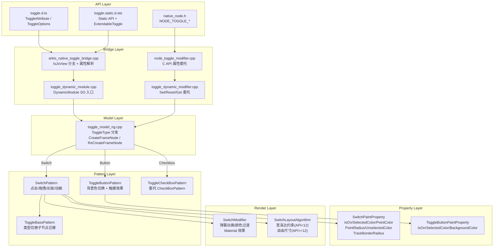
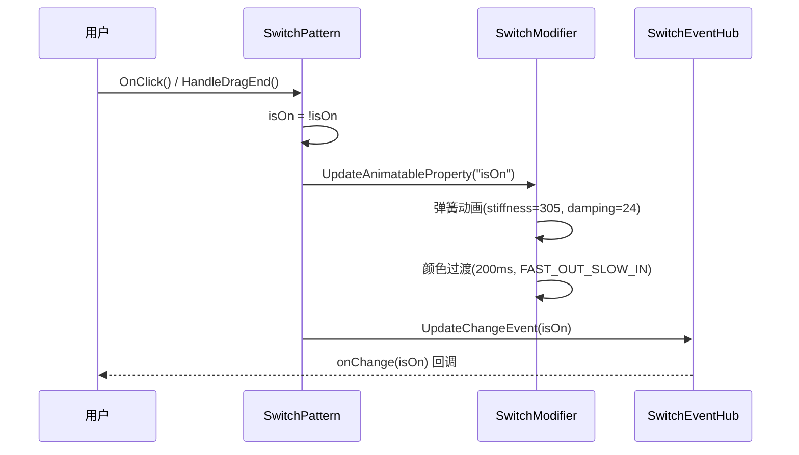
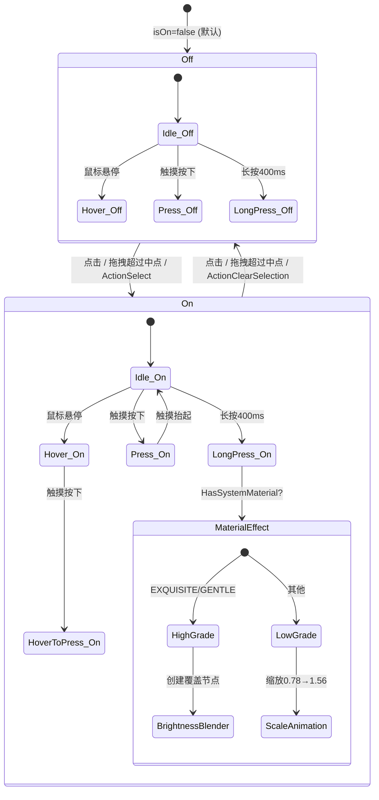

# 架构设计
> Toggle 组件的架构设计文档，覆盖 Switch/Checkbox/Button 三种形态的统一入口、属性分发、交互、动画和扩展能力。

## 设计元数据

| 字段 | 内容 |
|------|------|
| Design ID | DESIGN-Func-05-04-06 |
| 关联需求 | 已有能力补录（无独立 requirement.md） |
| 关联 Epic | 无 |
| 目标 Feature | Feat-01: Toggle 组件全量规格 (Switch/Checkbox/Button 三形态) |
| 复杂度 | 标准 |
| 目标版本 | API 8 ~ API 26+ |
| Owner | ArkUI SIG |
| 状态 | Baselined（已有实现补录） |

## 需求基线

> 需求基线详见 proposal.md。以下仅列出设计阶段需要额外强调的要点。

| 项 | 补充说明（如需） |
|----|------------------|
| 三形态统一入口 | Toggle 通过 ToggleType 枚举共用一个组件标签 TOGGLE_ETS_TAG，在 Model 层分发到不同 Pattern 实现 |
| API 版本兼容 | Switch 在 API 12 前后布局行为不同（1.8:1 强制宽高比 vs 自由尺寸），Button 在 API 18 前后形状不同 |
| C API 子集 | C API 仅暴露 4 个属性 + 1 个事件，不含 SwitchStyle 子属性和 ContentModifier |

## 上下文和现状

### 涉及仓和模块

| 仓库 | 模块路径 | 当前职责 | 本 Feature 影响 |
|------|----------|----------|-----------------|
| ace_engine | `frameworks/core/components_ng/pattern/toggle/` | Toggle 统一入口、Switch Pattern/Model/Layout/Paint/Modifier/Accessibility | 核心实现，规格补录 |
| ace_engine | `frameworks/core/components_ng/pattern/button/toggle_button_*` | Button 类型 Pattern/Model/Paint/EventHub/Accessibility | 规格补录 |
| ace_engine | `frameworks/core/components_ng/pattern/checkbox/toggle_checkbox_*` | Checkbox 类型薄封装（继承 CheckBoxPattern） | 规格补录 |
| ace_engine | `frameworks/core/components_ng/pattern/toggle/bridge/` | 组件化 Bridge / DynamicModule（libarkui_toggle.z.so 入口） | 规格补录 |
| ace_engine | `frameworks/core/interfaces/native/node/node_toggle_modifier.cpp` | C API 属性 Set/Reset/Get 委托层 | 规格补录 |
| ace_engine | `interfaces/native/native_node.h` | C API 枚举定义 NODE_TOGGLE_* | 规格补录 |
| interface/sdk-js | `api/@internal/component/ets/toggle.d.ts` | Dynamic API 声明 | 规格对照 |
| interface/sdk-js | `api/arkui/component/toggle.static.d.ets` | Static API 声明 | 规格对照 |
| graphic_2d | `rosen/modules/render_service_client/core/ui_effect/` | BrightnessBlender（Material 长按效果） | 外部依赖 |

### 适用架构规则

| Rule ID | 适用原因 | 设计结论 | 验证方式 |
|---------|----------|----------|----------|
| OH-ARCH-LAYERING | Toggle 涉及 API → Bridge → Model → Pattern → Layout/Paint 多层调用 | 调用方向自上而下，Pattern 不直接访问 Bridge 层 | 代码评审 |
| OH-ARCH-API-LEVEL | Toggle 有 @since 8/12/18/26 等多版本 API | 各版本 API 通过 PlatformVersion 条件分支实现兼容 | API 评审 / XTS |
| OH-ARCH-COMPONENT-BUILD | Toggle 已组件化为独立 SO（libarkui_toggle.z.so） | DynamicModule 注册机制，通过 OHOS_ACE_DynamicModule_Create_Toggle() 入口 | 构建验证 |
| OH-ARCH-SUBSYSTEM | Toggle(Checkbox) 委托 CheckBoxPattern，Toggle(Button) 继承 ButtonPattern | 同仓跨模块依赖，通过 NodeModifier::GetCheckboxCustomModifier() 桥接 | 依赖检查 |

## 不涉及项承接

> proposal.md 已完成 N/A 判定。本节仅对 proposal 中标记为"涉及"且需展开设计的维度给出结论。

| 维度 | 设计结论 |
|------|----------|
| 无障碍 | 三种类型各自实现 AccessibilityProperty，通过 ExtraElementInfo 区分 ToggleType（Checkbox="0", Switch="1", Button="2"），支持 ActionSelect/ActionClearSelection |
| 深色模式 | 颜色属性使用 ResourceColor 类型，支持 Token 主题切换，通过 SwitchThemeWrapper / ToggleThemeWrapper 映射 |
| 版本升级兼容 | API 12 取消 Switch 强制宽高比；API 18 Button 形状变更；需在 spec 兼容性声明中明确 |

## 关键设计决策

| 决策 ID | 问题 | 推荐方案 | 探索过的替代方案 | 取舍理由 | 影响 |
|---------|------|----------|-----------------|----------|------|
| ADR-1 | 三种 ToggleType 如何复用同一入口 | 单标签 TOGGLE_ETS_TAG + Model 层 CreateFrameNode 按类型分发 | 三个独立组件标签 | 统一 API 入口降低开发者理解成本；运行时类型切换可通过 ReCreateFrameNode 实现 | AC-1.1 ~ AC-1.3 |
| ADR-2 | API 12 是否移除 Switch 1.8:1 强制宽高比 | 移除，允许自由尺寸 | 保留比例约束 | 提供更灵活的定制能力；旧版本通过 PlatformVersion 分支保持兼容 | AC-6.1, AC-6.2 |
| ADR-3 | Switch Material 长按效果如何分级 | 根据 SystemMaterial 级别分高/低两级：高级创建覆盖节点 + BrightnessBlender，低级使用缩放动画 | 统一单一效果 | 高端设备提供精致效果，低端设备使用轻量替代，避免性能问题 | AC-5.1 ~ AC-5.4 |
| ADR-4 | Toggle(Checkbox) 如何实现 | 继承 CheckBoxPattern 的薄封装 ToggleCheckBoxPattern，仅重写无障碍属性 | 独立实现 checkbox 逻辑 | 最大化复用 CheckBoxPattern 已有逻辑，避免维护两套 checkbox 实现 | AC-9.2, BR-4 |
| ADR-5 | C API 暴露哪些属性 | 仅暴露核心 4 属性 + 1 事件 | 全量暴露（含 SwitchStyle） | C API 保持最小化，SwitchStyle 作为 API 12 新增的高级能力暂不在 NDK 层暴露 | AC-8.6, BR-3 |
| ADR-6 | Button 状态切换是否使用动画 | 不使用（立即切换背景色） | 使用颜色渐变动画 | Button 类型关注按钮语义而非 Switch 的滑块隐喻，瞬时切换更符合按钮交互预期 | AC-3.3 |
| ADR-7 | API 18 Button 形状变更 | 从 CAPSULE 变更为 ROUNDED_RECTANGLE | 保持 CAPSULE | ROUNDED_RECTANGLE 与新版设计规范一致，通过 PlatformVersion 保持向前兼容 | AC-3.2, BR-2 |

## 设计骨架

### 骨架范围

| 骨架项 | 目标 | 不包含 | 验证方式 |
|--------|------|--------|----------|
| Toggle 三形态分发 | Model 层按 ToggleType 创建不同 Pattern + 运行时类型切换 | 独立 Checkbox/Button 组件行为 | UT |
| Switch 交互 | 点击/拖拽/长按/触摸/悬停/焦点全流程 | 组合手势场景 | UT + 手工 |
| Switch 动画 | 弹簧动画 + Material 高低级效果 | 自定义动画曲线（由 ContentModifier 接管） | 手工 |
| Button 交互 | 点击切换 + 触摸/悬停 overlay 效果 | 按钮手势冲突（继承自 ButtonPattern） | UT |
| 属性与样式 | selectedColor/switchPointColor/switchStyle/backgroundColor 全量属性 | 通用属性（由 ViewAbstract 继承） | UT |
| C API 映射 | 4 属性 + 1 事件的 Set/Reset/Get | SwitchStyle 子属性的 C API | C API UT |
| 无障碍 | 三类型 IsCheckable/IsChecked/ActionSelect/ActionClearSelection | 无障碍自动化测试框架 | UT |

### 骨架 Spec 拆分

| Task ID | 目标 | 受影响文件 | AC |
|---------|------|-----------|-----|
| TASK-SKELETON-1 | Toggle 全量规格补录（三形态、交互、动画、C API、无障碍） | Feat-01-toggle-spec.md | AC-1.1 ~ AC-9.4 |

## 后续 Task 拆分

| Task ID | 目标 | 受影响文件 | 依赖 |
|---------|------|-----------|------|
| TASK-TOGGLE-01 | Toggle 全量规格补录 | Feat-01-toggle-spec.md, design.md | 无 |

## API 签名与权限

> 本节承接 spec.md"API 变更分析"中识别的 API，给出签名、权限和 d.ts 位置等实现细节。

### 新增 API

| API 签名 | 类型 | d.ts 位置 | 权限要求 | SysCap |
|----------|------|-----------|----------|--------|
| `Toggle(options?: ToggleOptions): ToggleAttribute` | Public | `@internal/component/ets/toggle.d.ts` | 无 | SystemCapability.ArkUI.ArkUI.Full |
| `.selectedColor(value: ResourceColor): ToggleAttribute` | Public | `toggle.d.ts` | 无 | 同上 |
| `.switchPointColor(color: ResourceColor): ToggleAttribute` | Public | `toggle.d.ts` | 无 | 同上 |
| `.onChange(callback: (isOn: boolean) => void): ToggleAttribute` | Public | `toggle.d.ts` | 无 | 同上 |
| `.switchStyle(value: SwitchStyle): ToggleAttribute` | Public | `toggle.d.ts` | 无 | 同上 |
| `.contentModifier(modifier: ContentModifier<ToggleConfiguration>): ToggleAttribute` | Public | `toggle.d.ts` | 无 | 同上 |
| `NODE_TOGGLE_SELECTED_COLOR` | NDK/Public | `native_node.h:3630` | 无 | 同上 |
| `NODE_TOGGLE_SWITCH_POINT_COLOR` | NDK/Public | `native_node.h:3642` | 无 | 同上 |
| `NODE_TOGGLE_VALUE` | NDK/Public | `native_node.h:3653` | 无 | 同上 |
| `NODE_TOGGLE_UNSELECTED_COLOR` | NDK/Public | `native_node.h:3665` | 无 | 同上 |
| `NODE_TOGGLE_ON_CHANGE` | NDK/Public | `native_node.h:10196` | 无 | 同上 |

### 变更/废弃 API

| 原有 API | 变更类型 | 新 API | 迁移说明 |
|----------|----------|--------|----------|
| 无 | — | — | — |

## 构建系统影响

### BUILD.gn 变更

Toggle 已完成组件化改造，输出独立 SO：

```
# frameworks/core/components_ng/pattern/toggle/BUILD.gn
# 构建目标：libarkui_toggle.z.so
# DynamicModule 入口：toggle_dynamic_module.cpp
# 包含 Switch/Toggle 共用的 Pattern/Model/Layout/Paint/Bridge 代码
```

### bundle.json 变更

Toggle 组件作为 ace_engine 的内部 component，无独立 bundle.json 变更。

## 可选设计扩展

### 架构图

<!-- 展开 -->



### 数据流/控制流

<!-- 展开 -->

| 步骤 | 调用方 | 被调用方 | 数据/接口 | 说明 |
|------|--------|----------|-----------|------|
| 1 | ArkTS/C API | Bridge / node_modifier | ToggleOptions / 属性值 | 属性设置入口 |
| 2 | Bridge | ToggleModelNG | CreateFrameNode(type) | 按 ToggleType 分发 |
| 3 | ToggleModelNG | SwitchPattern / ToggleButtonPattern / CheckBoxPattern | AceType::MakeRefPtr | 创建对应 Pattern |
| 4 | 用户交互 | SwitchPattern::OnClick/HandleDragEnd | isOn 翻转 | 状态切换 |
| 5 | SwitchPattern | SwitchModifier | AnimateTouchHoverColor / 弹簧动画 | 动画过渡 |
| 6 | SwitchPattern | SwitchEventHub::UpdateChangeEvent | onChange(isOn) | 事件回调 |

### 时序设计

<!-- 展开 -->



### 数据模型设计

<!-- 展开 -->

**API 层类型 (TypeScript)**:

```typescript
// ToggleType 枚举
enum ToggleType { Checkbox, Switch, Button }

// 构造参数
interface ToggleOptions { type: ToggleType; isOn?: boolean }

// Switch 复合样式 (@since 12)
interface SwitchStyle {
  pointRadius?: number | Resource;
  unselectedColor?: ResourceColor;
  pointColor?: ResourceColor;
  trackBorderRadius?: number | Resource;
}

// ContentModifier 配置 (@since 12)
interface ToggleConfiguration extends CommonConfiguration<ToggleConfiguration> {
  isOn: boolean;
  enabled: boolean;        // Dynamic API only
  triggerChange: Callback<boolean>;
}
```

**框架层结构 (C++)**:

```cpp
// SwitchPaintProperty 关键字段
ACE_DEFINE_PROPERTY_ITEM_WITHOUT_GROUP(IsOn, bool);           // PROPERTY_UPDATE_MEASURE
// SwitchPaintParagraph group (all PROPERTY_UPDATE_RENDER):
ACE_DEFINE_PROPERTY_ITEM(SelectedColor, Color);
ACE_DEFINE_PROPERTY_ITEM(SwitchPointColor, Color);
ACE_DEFINE_PROPERTY_ITEM(PointRadius, Dimension);
ACE_DEFINE_PROPERTY_ITEM(UnselectedColor, Color);
ACE_DEFINE_PROPERTY_ITEM(TrackBorderRadius, Dimension);

// ToggleButtonPaintProperty 关键字段 (all PROPERTY_UPDATE_RENDER):
ACE_DEFINE_PROPERTY_ITEM_WITHOUT_GROUP(IsOn, bool);
ACE_DEFINE_PROPERTY_ITEM_WITHOUT_GROUP(SelectedColor, Color);
ACE_DEFINE_PROPERTY_ITEM_WITHOUT_GROUP(BackgroundColor, Color);
```

### 算法与状态机

<!-- 展开 -->



### 测试性设计

<!-- 展开 -->

| 测试层级 | 测试目标 | Mock 策略 | 验证方式 |
|----------|----------|-----------|----------|
| UT - Pattern | Switch/Button/Checkbox 状态切换 + 事件触发 | MockRenderContext | gtest_filter |
| UT - Layout | Switch 宽高比约束（API 版本差异） | MockPipelineContext 设置 API 版本 | gtest_filter |
| UT - Property | Paint Property 设置/重置/默认值 | 直接构造 Property 对象 | gtest_filter |
| UT - Accessibility | IsCheckable/IsChecked/ActionSelect | MockAccessibilityNode | gtest_filter |
| UT - C API | node_toggle_modifier Set/Reset/Get | C API UT 框架 | capi_all_modifiers_test |
| 手工 | Material 长按效果视觉验证 | 真机 | 视觉比对 |

### 接口参数规约

<!-- 展开 -->

| 接口 | 参数 | 类型 | 合法范围 | 非法处理 | 边界说明 |
|------|------|------|----------|----------|----------|
| Toggle() | type | ToggleType | Checkbox/Switch/Button | 默认 Switch | — |
| Toggle() | isOn | boolean | true/false | 默认 false | — |
| selectedColor | value | ResourceColor | 有效颜色值 | 使用 theme 默认 | 适用所有类型 |
| switchPointColor | color | ResourceColor | 有效颜色值 | 使用 theme 默认 | 仅 Switch |
| switchStyle.pointRadius | number/Resource | Dimension (vp) | ≥ 0 | 使用 theme 默认 | 仅 Switch |
| switchStyle.trackBorderRadius | number/Resource | Dimension (vp) | ≥ 0 | 默认 height/2 | 仅 Switch |
| NODE_TOGGLE_VALUE | .value[0].i32 | int32_t | 0 或 1 | 按 bool 截断 | C API |
| NODE_TOGGLE_*_COLOR | .value[0].u32 | uint32_t | 0xAARRGGBB | 全透明 | C API |

## 详细设计

### Toggle 三形态分发

Toggle 使用 `ToggleModelNG::CreateFrameNode`（`toggle_model_ng.cpp:86-101`）按 `ToggleType` 分发：

- **SWITCH**: 直接创建 `SwitchPattern`，标签 `TOGGLE_ETS_TAG`
- **CHECKBOX**: 通过 `NodeModifier::GetCheckboxCustomModifier()` 委托创建 `ToggleCheckBoxPattern`（继承 `CheckBoxPattern`）
- **BUTTON**: 创建 `ToggleButtonPattern`（继承 `ButtonPattern`）
- **default**: fallback 到 SWITCH

运行时类型切换通过 `ReCreateFrameNode`（`:71`）实现：销毁旧节点，创建新节点，通过 `ReplaceAllChild` 迁移子节点。ContentModifier 子节点（匹配 `GetBuilderId()`）在迁移时被排除。

`ToggleBasePattern::MountToHolder()`（`toggle_base_pattern.cpp:25-39`）提供临时暂存机制：将旧子节点移入一个不可见的 holder FrameNode（标签 `"ToggleBase"`，设置为 INVISIBLE），确保类型切换过程中子节点不丢失。

### Switch 交互与动画

**点击**: `SwitchPattern::OnClick()`（`switch_pattern.cpp`）翻转 isOn，触发弹簧动画过渡。

**拖拽**: 仅水平方向（`switch_pattern.cpp:569`）。判定逻辑：
- 计算中点 `midPoint = (mainSize + height_) / 2`（`:843`）
- 拖拽位置超过中点则翻转状态
- RTL 布局下方向反转（`:844-849`）
- 拖拽缩放：press start=1.1, press end=1.0, drag=(1.06, 0.95), base=2.0（`:48-52`）

**弹簧动画参数**:
- 主弹簧：velocity=0, mass=1, stiffness=305, damping=24（`:55-58`）
- 低级 Material 弹簧：velocity=0, mass=1, stiffness=224, damping=12（`:63-66`）
- 颜色/位置过渡：200ms FAST_OUT_SLOW_IN（`switch_modifier.h:65, 339`）
- 拖拽帧动画：150ms（`:53`）

**触摸/悬停动画**（`switch_modifier.h:79-101`）:
- HOVER: hoverColor, hoverDuration, Curves::FRICTION
- PRESS: clickEffectColor, hoverDuration, Curves::FRICTION
- HOVER_TO_PRESS: clickEffectColor, hoverToTouchDuration, Curves::SHARP
- PRESS_TO_HOVER: hoverColor, hoverToTouchDuration, Curves::SHARP
- FOCUS: focusColor, hoverDuration, Curves::FRICTION

### Switch Material 长按效果

触发条件：长按 400ms（`switch_pattern.cpp:68`）且 `HasSystemMaterial()` 返回 true。

**高级（EXQUISITE/GENTLE）**:
- 创建 `dragFrameNode_`、`dragPointNode_`、`blurCoverNode_` 三层覆盖节点
- `BrightnessBlender` 参数：linearRate=1.048, degree=0.37647, saturation=1.5（`:1409-1411`）
- 光源位置 Z 缩放：1.5（`:70`）
- 折射插值范围：MIN=32, MAX=56（`:1376-1377`）

**低级**:
- 滑块缩放动画：收缩 0.78 → 展开 1.56（`:61-62, 675-676`）
- 使用低级弹簧曲线（stiffness=224, damping=12）

### Button 交互

`ToggleButtonPattern::OnClick()`（`toggle_button_pattern.cpp:605-637`）：
- 翻转 isOn 状态
- 立即更新背景色（无动画）：开启时用 selectedColor，关闭时用 backgroundColor
- 通过 `RenderContext::UpdateBackgroundColor()` 实现（`:630`）

触摸/悬停使用 overlay 透明度混合（`:31-32`）：
- 触摸持续 100ms
- 悬停持续 250ms

### Checkbox 委托

`ToggleCheckBoxPattern`（`toggle_checkbox_pattern.h:29`）继承 `CheckBoxPattern`，仅重写：
- `CreateAccessibilityProperty()` → 返回 `ToggleCheckBoxAccessibilityProperty`（报告 ToggleType="0"）
- `OnInjectionEvent()` → 解析 JSON 命令委托到 `SetCheckBoxSelect()`
- `IsAtomicNode()` 返回 false

所有渲染、动画、事件处理、状态管理完全继承 CheckBoxPattern。

### C API 属性映射

C API 通过 `node_toggle_modifier.cpp` 委托到 `DynamicModuleHelper`：

| C API 枚举 | 值格式 | Reset 默认值 |
|-----------|--------|-------------|
| NODE_TOGGLE_SELECTED_COLOR | `.value[0].u32` (0xARGB) | theme 的 checkedColor |
| NODE_TOGGLE_SWITCH_POINT_COLOR | `.value[0].u32` (0xARGB) | switchTheme->GetPointColor() |
| NODE_TOGGLE_VALUE | `.value[0].i32` (0/1) | false |
| NODE_TOGGLE_UNSELECTED_COLOR | `.value[0].u32` (0xARGB) | switchTheme->GetInactiveColor() |
| NODE_TOGGLE_ON_CHANGE | `.data[0].i32` (1=on/0=off) | — |

**已知差距**: SwitchStyle 的 pointRadius 和 trackBorderRadius 在 C API 层无对应枚举。

### 无障碍属性

| 类型 | IsCheckable | IsChecked | ToggleType | ActionSelect | ActionClearSelection |
|------|-------------|-----------|------------|-------------|---------------------|
| Switch | true | isOn | "1" | UpdateSelectStatus(true) | UpdateSelectStatus(false) |
| Button | true | isOn | "2" | Toggle isOn | Toggle isOn |
| Checkbox | true (继承) | isOn (继承) | "0" | 继承 CheckBoxPattern | 继承 CheckBoxPattern |

## 风险和开放问题

| 项 | 类型 | 影响 | 处理方式 | Owner |
|----|------|------|----------|-------|
| C API 缺少 SwitchStyle 子属性 | API | 中 | NDK 开发者无法通过 C API 设置 pointRadius/trackBorderRadius；需在文档中明确标注 | ArkUI SIG |
| API 12 布局行为变更可能影响存量应用 | 兼容性 | 中 | 通过 PlatformVersion 分支保持旧版本行为不变 | ArkUI SIG |
| API 18 Button 形状变更 | 兼容性 | 低 | 通过 PlatformVersion 分支保持旧版本行为不变 | ArkUI SIG |
| Material 长按效果依赖 graphic_2d | 架构 | 低 | BrightnessBlender 为可选依赖，HasSystemMaterial() 为 false 时降级 | ArkUI SIG |
| ToggleCheckBoxPattern 与独立 Checkbox 行为差异未充分文档化 | 文档 | 低 | 两者使用不同 ETS_TAG，无障碍 ToggleType 不同；需在开发者文档中说明 | ArkUI SIG |

## 设计审批

- [x] 需求基线已确认，设计覆盖 P0/P1 AC
- [x] 不涉及项已承接，N/A 和展开项都有结论
- [x] 涉及仓和模块职责清楚
- [x] 适用架构规则已识别并形成设计结论
- [x] 分层和子系统边界合规
- [x] API 变更有签名、权限、错误码和兼容性说明
- [x] BUILD.gn/bundle.json 影响明确
- [x] 设计输出和后续 Task 拆分明确
- [x] 关键设计决策有理由和影响说明
- [x] 风险和开放问题有 Owner

**结论:** 通过（已有实现补录）
