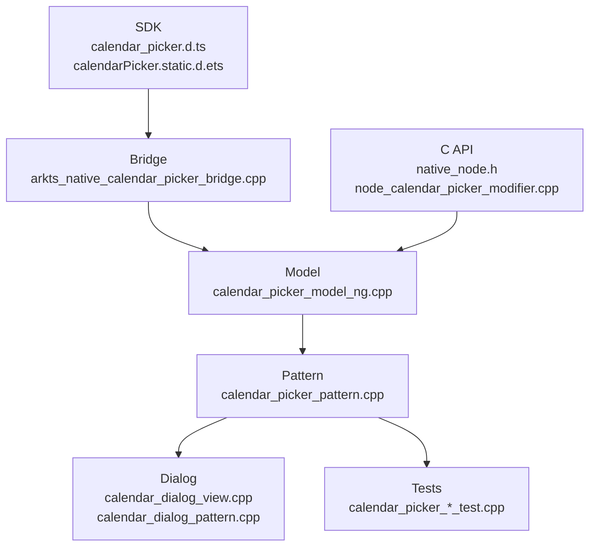

# 架构设计
> CalendarPicker 组件的已有实现规格补录，覆盖入口显示、弹窗日历、日期范围、禁用日期、样式、事件、C API 和静态/动态 ArkUI API。

## 设计元数据

| 字段 | 内容 |
|------|------|
| Design ID | DESIGN-Func-05-05-01 |
| 关联需求 | 已有能力补录（无独立 requirement.md） |
| 关联 Epic | 无 |
| 目标 Feature | Feat-01: CalendarPicker 组件全量规格 |
| 复杂度 | 标准 |
| 目标版本 | API 10 ~ API 26+ |
| Owner | ArkUI SIG |
| 状态 | Baselined（已有实现补录） |

## 需求基线

| 项 | 补充说明（如需） |
|----|------------------|
| 日期入口与弹窗 | `CalendarPicker(options?)` 创建入口区域，点击后通过 `ShowDialog` 打开 CalendarDialog |
| 日期范围 | `selected/start/end/disabledDateRange` 共同约束可选日期，非法或逆序范围按实现降级 |
| 样式与布局 | `hintRadius/edgeAlign/textStyle/markToday` 影响入口和弹窗的视觉反馈 |
| 双 API 通道 | ArkTS 动态/静态 API 与 C API 均已有声明，本次仅补录规格 |

## 上下文和现状

### 涉及仓和模块

| 仓库 | 模块路径 | 当前职责 | 本 Feature 影响 |
|------|----------|----------|-----------------|
| ace_engine | `frameworks/core/components_ng/pattern/calendar_picker/` | CalendarPicker Model/Pattern/Layout/Dialog 运行时实现 | 规格补录 |
| ace_engine | `frameworks/core/components_ng/pattern/calendar_picker/bridge/` | ArkTS native bridge 与参数解析 | 规格补录 |
| ace_engine | `frameworks/core/interfaces/native/node/` | C API 属性与事件委托 | 规格补录 |
| ace_engine | `interfaces/native/native_node.h` | `ARKUI_NODE_CALENDAR_PICKER`、`NODE_CALENDAR_PICKER_*` 声明 | 规格补录 |
| interface/sdk-js | `api/@internal/component/ets/calendar_picker.d.ts` | Dynamic API 合同 | 规格对照 |
| interface/sdk-js | `api/arkui/component/calendarPicker.static.d.ets` | Static API 合同 | 规格对照 |

### 调用链层级分析

| 层 | 模块 | 职责 | 修改类型 |
|----|------|------|----------|
| SDK | `calendar_picker.d.ts`, `calendarPicker.static.d.ets` | 声明 `CalendarOptions`、`CalendarPickerAttribute`、dialog 相关类型 | 无修改（规格补录） |
| ArkTS/JS Bridge | `ArkCalendarPicker.ts`, `calendar_picker_modifier.ts`, `arkts_native_calendar_picker_bridge.cpp` | 解析 JS Date、edgeAlign、textStyle、markToday、onChange | 无修改（规格补录） |
| Model | `calendar_picker_model_ng.cpp` | 创建入口节点、日期文本子节点，写入属性和事件 | 无修改（规格补录） |
| Pattern | `calendar_picker_pattern.cpp` | 点击/键盘/hover、RTL 对齐、弹窗打开、事件上报 | 无修改（规格补录） |
| Dialog | `calendar_dialog_view.cpp`, `calendar_dialog_pattern.cpp` | 日历弹窗创建、日期选择、键盘操作、禁用日期处理 | 无修改（规格补录） |
| Layout | `calendar_picker_layout_algorithm.cpp` | 入口区域测量布局 | 无修改（规格补录） |
| C API | `native_node.h`, `node_calendar_picker_modifier.cpp` | C API 属性/事件映射 | 无修改（规格补录） |
| Test | `test/unittest/core/pattern/calendar_picker/`, `test/unittest/capi/modifiers/calendar_picker_modifier_test.cpp` | Pattern/Dialog/布局/C API 回归验证 | 无修改（规格补录） |

### 适用架构规则

| Rule ID | 适用原因 | 设计结论 | 验证方式 |
|---------|----------|----------|----------|
| OH-ARCH-LAYERING | 组件经过 SDK、Bridge、Model、Pattern、Dialog、C API 多层 | 调用方向保持自上而下，Pattern 不反向依赖 Bridge | 代码评审 |
| OH-ARCH-API-LEVEL | API 从 dynamic 10 到 dynamic 19/20、static 23/26 演进 | 规格按 SDK `@since` 与实现行为分别标注 | API 评审 |
| OH-ARCH-COMPONENT-BUILD | 本次无 BUILD.gn/bundle.json 改动 | 仅新增规格文档与 registry | 生成校验 |
| OH-ARCH-ERROR-LOG | 日期非法输入使用降级/忽略策略，无新增错误码 | 规格记录恢复行为，不改变运行时错误模型 | UT/XTS |

## 不涉及项承接

| 维度 | 设计结论 |
|------|----------|
| 产品源码 | 不修改 `frameworks/`、`interfaces/`、`test/` 源码 |
| 构建依赖 | 不新增 BUILD.gn 或 bundle.json 依赖 |
| IPC/SA | CalendarPicker 为本地 UI 组件，不引入跨进程调用 |
| 存储迁移 | 无持久化数据结构变更 |

## 关键设计决策

| 决策 ID | 问题 | 推荐方案 | 探索过的替代方案 | 取舍理由 | 影响 |
|---------|------|----------|-----------------|----------|------|
| ADR-1 | CalendarPicker 是否拆成多个 Feat | 首次补录采用单个 Feat 覆盖入口、范围、弹窗、事件、C API | 按样式/事件/范围拆分 | API 规模中等且行为强耦合，单个全量规格更利于基线建立 | AC-1.1 ~ AC-4.4 |
| ADR-2 | `UIComponentPicker` 类似命名是否影响本域 | CalendarPicker 按实际 SDK 名称独立补录 | 与 Picker 合并 | SDK 和实现均有独立 CalendarPicker 域，不能混入 ContainerPicker | AC-1.1 |
| ADR-3 | disabledDateRange 如何描述 | 按现有实现记录非法区间跳过、排序合并、键盘跳过禁用日期 | 只写 SDK 表层约束 | disabledDateRange 的可观测行为由 utils 和 picker_data 共同决定，需要可测试规则 | AC-2.4, AC-3.4 |

## 设计骨架

### 骨架范围

| 骨架项 | 目标 | 不包含 | 验证方式 |
|--------|------|--------|----------|
| 创建与入口显示 | 记录 options、日期文本、hintRadius、textStyle | CalendarPickerDialog 独立规格 | UT |
| 日期范围与禁用日期 | 记录 selected/start/end/disabledDateRange 约束 | 新增日期算法 | UT |
| 弹窗交互 | 记录点击、键盘、markToday、onChange | 弹窗组件新增能力 | UT + 手工 |
| C API | 记录 node type、属性、事件格式 | 修改 ABI | C API UT |

### 骨架 Spec 拆分

| Task ID | 目标 | 受影响文件 | AC |
|---------|------|-----------|-----|
| TASK-SKELETON-1 | CalendarPicker 全量规格补录 | Feat-01-calendar-picker-full-spec.md | AC-1.1 ~ AC-4.4 |

## 后续 Task 拆分

| Task ID | 目标 | 受影响文件 | 依赖 |
|---------|------|-----------|------|
| TASK-CALENDAR-PICKER-01 | CalendarPicker 全量规格补录 | Feat-01-calendar-picker-full-spec.md, design.md | 无 |

## API 签名、Kit 与权限

### 新增 API

| API 签名 | 类型 | Kit | d.ts 位置 | 权限要求 | SysCap |
|----------|------|-----|-----------|----------|--------|
| `CalendarPicker(options?: CalendarOptions): CalendarPickerAttribute` | Public | ArkUI | `api/@internal/component/ets/calendar_picker.d.ts:182` | 无 | SystemCapability.ArkUI.ArkUI.Full |
| `CalendarPickerAttribute.edgeAlign(alignType, offset?)` | Public | ArkUI | `api/@internal/component/ets/calendar_picker.d.ts:225` | 无 | 同上 |
| `CalendarPickerAttribute.textStyle(style)` | Public | ArkUI | `api/@internal/component/ets/calendar_picker.d.ts:257` | 无 | 同上 |
| `CalendarPickerAttribute.onChange(callback)` | Public | ArkUI | `api/@internal/component/ets/calendar_picker.d.ts:288` | 无 | 同上 |
| `CalendarPickerAttribute.markToday(enabled)` | Public | ArkUI | `api/@internal/component/ets/calendar_picker.d.ts:322` | 无 | 同上 |
| `ARKUI_NODE_CALENDAR_PICKER` / `NODE_CALENDAR_PICKER_*` | NDK/Public | ArkUI C API | `interfaces/native/native_node.h:86`, `interfaces/native/native_node.h:5919` | 无 | 同上 |

### 变更/废弃 API

| 原有 API | 变更类型 | 新 API | 迁移说明 |
|----------|----------|--------|----------|
| 无 | — | — | 本次为已有 API 规格补录，无声明变更 |

## 构建系统影响

### BUILD.gn 变更

无 BUILD.gn 变更。

### bundle.json 变更

无 bundle.json 变更。

## 可选设计扩展

### 架构图

### 数据流/控制流

| 步骤 | 调用方 | 被调用方 | 数据/接口 | 说明 |
|------|--------|----------|-----------|------|
| 1 | ArkTS/C API | Bridge / native modifier | CalendarOptions / NODE_CALENDAR_PICKER_* | 参数解析 |
| 2 | Bridge | CalendarPickerModelNG | selected/start/end/textStyle/onChange | 写入属性和事件 |
| 3 | Model | CalendarPickerPattern | entry/date/text 子节点 | 创建入口结构 |
| 4 | 用户点击/键盘 | CalendarPickerPattern | ShowDialog / date adjust | 打开弹窗或调整日期 |
| 5 | Dialog/Pattern | EventHub | Callback<Date> / C event data | 触发 onChange |

### 时序设计

无异步跨线程时序设计；弹窗创建和事件回调均在 UI 组件流水线内完成。

### 数据模型设计

| 数据 | API 层 | 实现层 | 存储位置 |
|------|--------|--------|----------|
| 日期范围 | `CalendarOptions.selected/start/end` | `PickerDate`, `CalendarSettingData` | CalendarPickerPattern / LayoutProperty |
| 禁用日期 | `DateRange[]` | `std::vector<DateRange>` | Calendar dialog data |
| 样式 | `hintRadius`, `PickerTextStyle`, `CalendarAlign` | `CalendarEdgeAlign`, text layout property | Model/Pattern |

### 算法与状态机

| 算法 | 说明 | 源码 |
|------|------|------|
| RTL 对齐翻转 | START/END 在 RTL 下翻转，x offset 取反 | `frameworks/core/components_ng/pattern/calendar_picker/calendar_picker_pattern.cpp:223` |
| 禁用日期归并 | 非法区间跳过，合法区间排序并合并 | `frameworks/core/components_ng/pattern/calendar_picker/bridge/calendar_picker_utils.cpp:56`, `frameworks/core/components_ng/pattern/date_picker/picker_data.cpp:174` |
| 日期范围裁剪 | selected 根据 start/end 调整到合法范围 | `frameworks/core/components_ng/pattern/calendar_picker/calendar_picker_model_ng.cpp:776` |

### 测试性设计

| 测试层级 | 测试目标 | Mock 策略 | 验证方式 |
|----------|----------|-----------|----------|
| Core UT | Pattern/Dialog/布局/键盘/范围 | Mock Pipeline/Theme | `test/unittest/core/pattern/calendar_picker/` |
| C API UT | 属性和事件格式 | ArkUI native node mock | `test/unittest/capi/modifiers/calendar_picker_modifier_test.cpp:144` |
| 手工 | 弹窗视觉和 markToday | 真机/预览器 | 手工回归 |

### 异常传播时序图

无跨进程异常传播；非法日期输入按 SDK/Bridge/Model 降级处理，不新增错误码。

### 资源所有权矩阵

| 资源 | 创建方 | 持有方 | 销毁触发 | 实际释放 | 异常回收 |
|------|--------|--------|----------|----------|----------|
| CalendarPicker FrameNode | Model | UI 树 | 组件卸载 | RefPtr 引用计数 | CHECK_NULL_VOID 返回 |
| CalendarDialog | Pattern/DialogView | Overlay/Pattern | 弹窗关闭 | UI 树卸载 | 已存在弹窗时不重复创建 |

### 接口参数规约

| 接口 | 参数 | 类型 | 合法范围 | 非法处理 | 边界说明 |
|------|------|------|----------|----------|----------|
| `CalendarPicker(options)` | `hintRadius` | number/Resource | 0.0 ~ 16.0 | 负数或大于 16 使用默认 16 | SDK `calendar_picker.d.ts:75` |
| `CalendarPicker(options)` | `selected/start/end` | Date | 0001-01-01 ~ 5000-12-31 | 非法日期使用默认或按范围裁剪 | SDK `calendar_picker.d.ts:101` |
| `disabledDateRange` | DateRange[] | DateRange[] | start/end 均有效且 start <= end | 区间不生效 | SDK `calendar_picker.d.ts:150` |

### 线程与并发模型

CalendarPicker 为 UI 线程组件能力，文档补录不引入并发模型变化。

## 详细设计

### 创建与入口显示

`CalendarPickerModelNG::Create` 负责创建入口 FrameNode 和日期文本子节点，并写入初始日期与样式；对应源码为 `frameworks/core/components_ng/pattern/calendar_picker/calendar_picker_model_ng.cpp:49`、`calendar_picker_model_ng.cpp:202`、`calendar_picker_model_ng.cpp:274`。

### 日期范围与禁用日期

Bridge 解析 JS Date，Model 在设置 selected/start/end 时执行范围校验；`disabledDateRange` 在解析后进入 dialog 数据模型，非法区间不生效并且键盘移动会跳过禁用日期，源码见 `frameworks/core/components_ng/pattern/calendar_picker/bridge/calendar_picker_utils.cpp:56`、`frameworks/core/components_ng/pattern/calendar_picker/calendar_picker_model_ng.cpp:682`、`frameworks/core/components_ng/pattern/date_picker/picker_data.cpp:193`。

### 弹窗、对齐与事件

Pattern 在 `OnModifyDone` 初始化点击、键盘、hover 与 selector，点击 entry 后调用 `ShowDialog`，并在 `FireChangeEvents` 中触发 ArkTS 和 C API 可观测事件；源码见 `frameworks/core/components_ng/pattern/calendar_picker/calendar_picker_pattern.cpp:60`、`calendar_picker_pattern.cpp:381`、`calendar_picker_pattern.cpp:489`。

## 风险和开放问题

| 项 | 类型 | 影响 | 处理方式 | Owner |
|----|------|------|----------|-------|
| CalendarPickerDialog 与 CalendarPicker 共享部分数据模型 | 测试 | 中 | 规格注明本文件覆盖入口组件，Dialog 独立域后续可补录 | ArkUI SIG |
| SDK 与 C API 对日期格式描述不同 | API | 低 | 在接口规格中分别记录 ArkTS Date 与 C API data/string 格式 | ArkUI SIG |

## 设计审批

- [x] 需求基线已确认，设计覆盖 P0/P1 AC
- [x] 不涉及项已承接，N/A 和展开项都有结论
- [x] 涉及仓和模块职责清楚
- [x] 调用链层级分析完整，每层覆盖到位
- [x] 适用架构规则已识别并形成设计结论
- [x] 分层和子系统边界合规
- [x] API 变更有签名、权限、错误码和兼容性说明
- [x] BUILD.gn/bundle.json 影响明确
- [x] 设计输出和后续 Task 拆分明确
- [x] 关键设计决策有理由和影响说明
- [x] 风险和开放问题有 Owner

**结论:** 通过（已有实现补录）。

