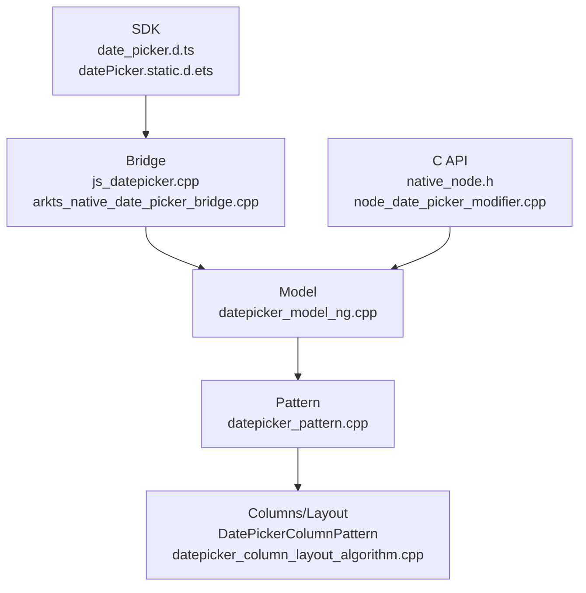

# 架构设计
> DatePicker 组件的已有实现规格补录，覆盖日期列创建、阳历/农历、显示模式、范围、循环、样式、事件、C API 和静态/动态 ArkUI API。

## 设计元数据

| 字段 | 内容 |
|------|------|
| Design ID | DESIGN-Func-05-05-02 |
| 关联需求 | 已有能力补录（无独立 requirement.md） |
| 关联 Epic | 无 |
| 目标 Feature | Feat-01: DatePicker 组件全量规格 |
| 复杂度 | 标准 |
| 目标版本 | API 8 ~ API 26+ |
| Owner | ArkUI SIG |
| 状态 | Baselined（已有实现补录） |

## 需求基线

| 项 | 补充说明（如需） |
|----|------------------|
| 日期选择 | `DatePicker(options?)` 创建年/月/日滚轮，支持 `start/end/selected` |
| 显示模式 | API 18 起支持 `DatePickerMode.DATE/YEAR_AND_MONTH/MONTH_AND_DAY` |
| 农历与本地化 | `lunar`、语言顺序和阿拉伯语 LTR 特殊处理由 Model/Pattern 完成 |
| 事件 | `onChange` 已废弃，`onDateChange` 为推荐事件，C API 有 `NODE_DATE_PICKER_EVENT_ON_DATE_CHANGE` |

## 上下文和现状

### 涉及仓和模块

| 仓库 | 模块路径 | 当前职责 | 本 Feature 影响 |
|------|----------|----------|-----------------|
| ace_engine | `frameworks/core/components_ng/pattern/date_picker/` | DatePicker Model/Pattern/Column/Layout/EventHub | 规格补录 |
| ace_engine | `frameworks/core/components_ng/pattern/date_picker/bridge/` | ArkTS 参数解析、事件转换和动态模块桥接 | 规格补录 |
| ace_engine | `frameworks/core/interfaces/native/node/node_date_picker_modifier.cpp` | C API 属性委托 | 规格补录 |
| ace_engine | `interfaces/native/native_node.h` | DatePicker C API 枚举和事件声明 | 规格补录 |
| interface/sdk-js | `api/@internal/component/ets/date_picker.d.ts` | Dynamic API 合同 | 规格对照 |
| interface/sdk-js | `api/arkui/component/datePicker.static.d.ets` | Static API 合同 | 规格对照 |

### 调用链层级分析

| 层 | 模块 | 职责 | 修改类型 |
|----|------|------|----------|
| SDK | `date_picker.d.ts`, `datePicker.static.d.ets` | 声明 DatePickerResult/Options/Attribute/Mode | 无修改（规格补录） |
| Bridge | `js_datepicker.cpp`, `arkts_native_date_picker_bridge.cpp` | 加载动态模块，解析 Date、mode、style、callback | 无修改（规格补录） |
| Model | `datepicker_model_ng.cpp` | 创建年/月/日列，设置 start/end/selected/mode/canLoop/haptic/event | 无修改（规格补录） |
| Pattern | `datepicker_pattern.cpp` | 本地化、范围裁剪、阳历/农历列构建、事件触发、焦点与选择器 | 无修改（规格补录） |
| Layout | `datepicker_column_layout_algorithm.cpp` | 列测量和滚轮布局 | 无修改（规格补录） |
| C API | `native_node.h`, `node_date_picker_modifier.cpp` | 属性与事件枚举映射 | 无修改（规格补录） |
| Test | `test/unittest/core/pattern/picker/`, `test/unittest/capi/modifiers/date_picker_modifier_test.cpp` | DatePicker 行为和 C API 回归验证 | 无修改（规格补录） |

### 适用架构规则

| Rule ID | 适用原因 | 设计结论 | 验证方式 |
|---------|----------|----------|----------|
| OH-ARCH-LAYERING | DatePicker 涉及 SDK、Bridge、Model、Pattern、Layout、C API | 自上而下调用，Pattern 层承载运行时状态 | 代码评审 |
| OH-ARCH-API-LEVEL | dynamic 8/10/18/20/26 与 static 23/26 存在差异 | spec 记录版本边界和废弃事件 | API 评审 |
| OH-ARCH-COMPONENT-BUILD | DatePicker 已有动态模块加载入口 | 本次无构建系统变更 | 生成校验 |
| OH-ARCH-ERROR-LOG | 非法日期使用默认范围或 clamp，无新增错误码 | 规格记录恢复行为 | UT |

## 不涉及项承接

| 维度 | 设计结论 |
|------|----------|
| 产品源码 | 不修改 DatePicker 实现 |
| 构建系统 | 不修改 BUILD.gn/bundle.json |
| IPC/SA | 不涉及跨进程 |
| 数据迁移 | 不涉及持久化格式 |

## 关键设计决策

| 决策 ID | 问题 | 推荐方案 | 探索过的替代方案 | 取舍理由 | 影响 |
|---------|------|----------|-----------------|----------|------|
| ADR-1 | 范围和循环如何写规格 | 明确 `start/end` 一旦设置，Pattern 强制 `canLoop=false` | 只记录 SDK 默认 true | 实现行为会直接影响边界滚动，必须可测试 | AC-2.3 |
| ADR-2 | 农历能力是否独立拆分 | 作为 DatePicker 全量规格子能力记录 | 单独 Feat | 农历列构建依赖 DatePicker 同一 Pattern 状态，首次补录合并更完整 | AC-3.1 |
| ADR-3 | `onChange` 与 `onDateChange` 如何处理 | 记录废弃关系和不同返回合同 | 忽略废弃 API | 存量应用仍可能使用 `onChange`，兼容性章节需明确 | AC-4.1 |

## 设计骨架

### 骨架范围

| 骨架项 | 目标 | 不包含 | 验证方式 |
|--------|------|--------|----------|
| 创建与列顺序 | 记录年/月/日列创建、语言顺序 | DatePickerDialog 规格 | UT |
| 日期范围 | 记录 start/end/selected/mode/canLoop | 新日期算法 | UT |
| 样式和事件 | 记录三档文本样式、haptic/crown、onChange/onDateChange | 通用属性 | UT |
| C API | 记录 node type、属性枚举、事件数据 | ABI 修改 | C API UT |

### 骨架 Spec 拆分

| Task ID | 目标 | 受影响文件 | AC |
|---------|------|-----------|-----|
| TASK-SKELETON-1 | DatePicker 全量规格补录 | Feat-01-date-picker-full-spec.md | AC-1.1 ~ AC-4.3 |

## 后续 Task 拆分

| Task ID | 目标 | 受影响文件 | 依赖 |
|---------|------|-----------|------|
| TASK-DATE-PICKER-01 | DatePicker 全量规格补录 | Feat-01-date-picker-full-spec.md, design.md | 无 |

## API 签名、Kit 与权限

### 新增 API

| API 签名 | 类型 | Kit | d.ts 位置 | 权限要求 | SysCap |
|----------|------|-----|-----------|----------|--------|
| `DatePicker(options?: DatePickerOptions): DatePickerAttribute` | Public | ArkUI | `api/@internal/component/ets/date_picker.d.ts:232` | 无 | SystemCapability.ArkUI.ArkUI.Full |
| `DatePickerAttribute.lunar(value)` | Public | ArkUI | `api/@internal/component/ets/date_picker.d.ts:276` | 无 | 同上 |
| `DatePickerAttribute.disappearTextStyle/textStyle/selectedTextStyle(style)` | Public | ArkUI | `api/@internal/component/ets/date_picker.d.ts:307` | 无 | 同上 |
| `DatePickerAttribute.onChange(callback)` | Public/Deprecated | ArkUI | `api/@internal/component/ets/date_picker.d.ts:403` | 无 | 同上 |
| `DatePickerAttribute.onDateChange(callback)` | Public | ArkUI | `api/@internal/component/ets/date_picker.d.ts:422` | 无 | 同上 |
| `DatePickerAttribute.enableHapticFeedback/canLoop(...)` | Public | ArkUI | `api/@internal/component/ets/date_picker.d.ts:474` | 无 | 同上 |
| `ARKUI_NODE_DATE_PICKER` / `NODE_DATE_PICKER_*` | NDK/Public | ArkUI C API | `interfaces/native/native_node.h:80`, `interfaces/native/native_node.h:5441` | 无 | 同上 |

### 变更/废弃 API

| 原有 API | 变更类型 | 新 API | 迁移说明 |
|----------|----------|--------|----------|
| `DatePickerAttribute.onChange(callback: (DatePickerResult) => void)` | 废弃（since 10） | `onDateChange(callback: Callback<Date>)` | 新代码使用 `onDateChange` |

## 构建系统影响

### BUILD.gn 变更

无 BUILD.gn 变更。

### bundle.json 变更

无 bundle.json 变更。

## 可选设计扩展

### 架构图

### 数据流/控制流

| 步骤 | 调用方 | 被调用方 | 数据/接口 | 说明 |
|------|--------|----------|-----------|------|
| 1 | ArkTS/C API | Bridge/native modifier | DatePickerOptions / NODE_DATE_PICKER_* | 解析日期和样式 |
| 2 | Bridge | DatePickerModelNG | PickerDate、DatePickerMode、callback | 写入 Pattern/LayoutProperty/EventHub |
| 3 | Model | DatePickerPattern | 年/月/日列节点 | 创建列结构 |
| 4 | Pattern | ColumnPattern | options/currentIndex | 根据阳历/农历与范围刷新列 |
| 5 | Column/Pattern | EventHub | DatePickerResult / Date | 滚动结束触发事件 |

### 时序设计

无跨线程异步时序；滚动动画结束后的事件触发由 DatePickerColumnPattern 回调进入 DatePickerPattern。

### 数据模型设计

| 数据 | API 层 | 实现层 | 存储位置 |
|------|--------|--------|----------|
| 日期 | `Date` / `DatePickerResult` | `PickerDate`, `PickerDateF` | DatePickerPattern |
| 范围 | `start/end/selected` | `startDateSolar_`, `endDateSolar_`, lunar 对应字段 | Pattern/LayoutProperty |
| 样式 | `PickerTextStyle` | `DataPickerRowLayoutProperty` | LayoutProperty |
| 模式 | `DatePickerMode` | `DatePickerMode` enum | LayoutProperty/Pattern |

### 算法与状态机

| 算法 | 说明 | 源码 |
|------|------|------|
| 列顺序本地化 | 根据 `DateTimeSequence` 和语言调整列顺序，`ar` 设 LTR | `frameworks/core/components_ng/pattern/date_picker/datepicker_model_ng.cpp:78` |
| 循环禁用 | 有 start/end 时 `canLoop` 强制 false | `frameworks/core/components_ng/pattern/date_picker/datepicker_pattern.cpp:479` |
| 阳历/农历列构建 | 按 start/end/current 构造 year/month/day options | `frameworks/core/components_ng/pattern/date_picker/datepicker_pattern.cpp:2440`, `datepicker_pattern.cpp:2510` |
| 逆序范围恢复 | start 大于 end 时恢复默认 start/end | `frameworks/core/components_ng/pattern/date_picker/datepicker_pattern.cpp:2844` |

### 测试性设计

| 测试层级 | 测试目标 | Mock 策略 | 验证方式 |
|----------|----------|-----------|----------|
| Core UT | 模式、顺序、范围、事件 | Mock Theme/Pipeline | `test/unittest/core/pattern/picker/date_picker_test_ng.cpp:1` |
| C API UT | 属性和事件枚举 | ArkUI native node mock | `test/unittest/capi/modifiers/date_picker_modifier_test.cpp:1` |

### 异常传播时序图

无跨进程异常传播；非法日期参数按默认值或范围裁剪恢复。

### 资源所有权矩阵

| 资源 | 创建方 | 持有方 | 销毁触发 | 实际释放 | 异常回收 |
|------|--------|--------|----------|----------|----------|
| DatePicker FrameNode | Model | UI 树 | 组件卸载 | RefPtr 引用计数 | CHECK_NULL_VOID 返回 |
| Column TextNode | Model | Column FrameNode | 列重建或组件卸载 | UI 树卸载 | 空节点跳过 |

### 接口参数规约

| 接口 | 参数 | 类型 | 合法范围 | 非法处理 | 边界说明 |
|------|------|------|----------|----------|----------|
| `DatePicker(options)` | `start/end` | Date | 1900-01-31 ~ 2100-12-31 | 逆序恢复默认范围 | SDK `date_picker.d.ts:140` |
| `DatePicker(options)` | `selected` | Date | 受 start/end 约束 | clamp 到范围内 | Pattern `datepicker_pattern.h:407` |
| `DatePickerAttribute.canLoop` | `isLoop` | Optional<boolean> | true/false/undefined | 有范围时实现强制 false | Pattern `datepicker_pattern.cpp:479` |

### 线程与并发模型

DatePicker 为 UI 线程组件能力，文档补录不改变线程模型。

## 详细设计

### 创建与列构建

`DatePickerModelNG::CreateDatePicker` 创建 DatePicker FrameNode 与年/月/日列，按语言顺序挂载列，源码见 `frameworks/core/components_ng/pattern/date_picker/datepicker_model_ng.cpp:67`、`datepicker_model_ng.cpp:144`。

### 范围、模式和循环

Model 设置 `start/end/selected/mode/canLoop`，Pattern 在 `OnModifyDone` 中判断范围、更新列和事件回调；有范围时 `isLoop_` 由实现强制为 false，源码见 `frameworks/core/components_ng/pattern/date_picker/datepicker_model_ng.cpp:333`、`datepicker_pattern.cpp:460`、`datepicker_pattern.cpp:479`。

### 事件和 C API

`FireChangeEvent` 在刷新时上报 `onDateChange` 并通过 EventHub 触发旧 `onChange`/dialog change 路径，C API 事件返回 year、0-based month、day，源码见 `frameworks/core/components_ng/pattern/date_picker/datepicker_pattern.cpp:1351`、`interfaces/native/native_node.h:11045`。

## 风险和开放问题

| 项 | 类型 | 影响 | 处理方式 | Owner |
|----|------|------|----------|-------|
| SDK 描述和实现的默认 12/24 无关但 Date 事件返回 Date 对象带系统时间 | API | 低 | 在 spec 中明确 `onDateChange` 返回 Date 的 hour/minute 取当前系统时间、second 为 00 | ArkUI SIG |
| 农历仅中文语言下完整生效 | 兼容 | 中 | 在规格和兼容性声明中标注语言条件 | ArkUI SIG |

## 设计审批

- [x] 需求基线已确认，设计覆盖 P0/P1 AC
- [x] 不涉及项已承接，N/A 和展开项都有结论
- [x] 涉及仓和模块职责清楚
- [x] 调用链层级分析完整，每层覆盖到位
- [x] 适用架构规则已识别并形成设计结论
- [x] 分层和子系统边界合规
- [x] API 变更有签名、权限、错误码和兼容性说明
- [x] BUILD.gn/bundle.json 影响明确
- [x] 设计输出和后续 Task 拆分明确
- [x] 关键设计决策有理由和影响说明
- [x] 风险和开放问题有 Owner

**结论:** 通过（已有实现补录）。

