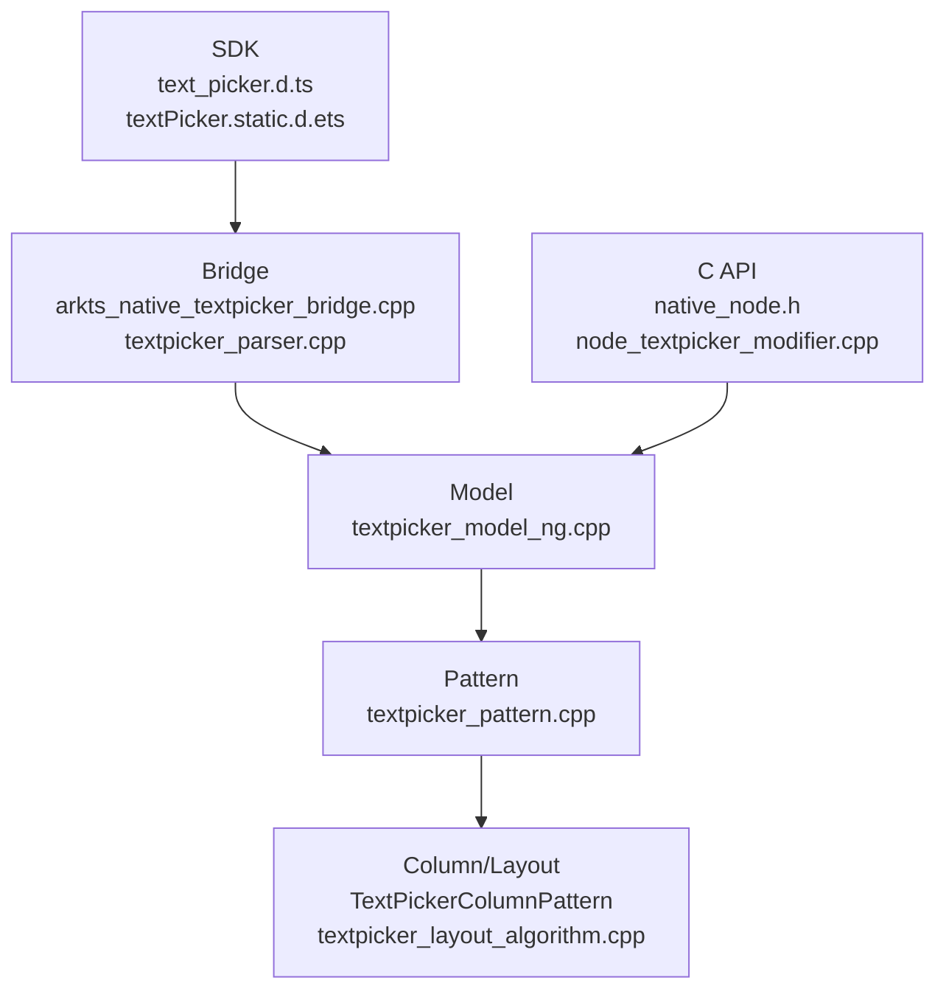

# 架构设计
> TextPicker 组件的已有实现规格补录，覆盖单列、多列、级联、文本/图片/混合项、样式、分割线、事件、触觉反馈、C API 和静态/动态 ArkUI API。

## 设计元数据

| 字段 | 内容 |
|------|------|
| Design ID | DESIGN-Func-05-05-03 |
| 关联需求 | 已有能力补录（无独立 requirement.md） |
| 关联 Epic | 无 |
| 目标 Feature | Feat-01: TextPicker 组件全量规格 |
| 复杂度 | 标准 |
| 目标版本 | API 8 ~ API 26+ |
| Owner | ArkUI SIG |
| 状态 | Baselined（已有实现补录） |

## 需求基线

| 项 | 补充说明（如需） |
|----|------------------|
| 数据形态 | `range` 支持 string、Resource、文本/图片混合、多列独立和级联数据 |
| 选择优先级 | `selected/selectedIndex` 优先于 `value`，越界按默认值恢复 |
| 样式 | 支持三档文本样式、itemHeight、divider、gradientHeight、selectedBackgroundStyle |
| 事件 | `onChange`、`onScrollStop`、`onEnterSelectedArea` 触发时机不同 |

## 上下文和现状

### 涉及仓和模块

| 仓库 | 模块路径 | 当前职责 | 本 Feature 影响 |
|------|----------|----------|-----------------|
| ace_engine | `frameworks/core/components_ng/pattern/text_picker/` | TextPicker Model/Pattern/Column/Layout/EventHub | 规格补录 |
| ace_engine | `frameworks/core/components_ng/pattern/text_picker/bridge/` | ArkTS 参数解析与 native bridge | 规格补录 |
| ace_engine | `frameworks/core/interfaces/native/node/node_textpicker_modifier.cpp` | C API 属性委托 | 规格补录 |
| ace_engine | `interfaces/native/node/textpicker_option.cpp` | NDK TextPicker option helper | 规格补录 |
| interface/sdk-js | `api/@internal/component/ets/text_picker.d.ts` | Dynamic API 合同 | 规格对照 |
| interface/sdk-js | `api/arkui/component/textPicker.static.d.ets` | Static API 合同 | 规格对照 |

### 调用链层级分析

| 层 | 模块 | 职责 | 修改类型 |
|----|------|------|----------|
| SDK | `text_picker.d.ts`, `textPicker.static.d.ets` | 声明 RangeContent、Options、Attribute、事件类型 | 无修改（规格补录） |
| Bridge | `arktextpicker.ts`, `arkts_native_textpicker_bridge.cpp`, `textpicker_parser.cpp` | 解析 range/value/selected/style/event | 无修改（规格补录） |
| Model | `textpicker_model_ng.cpp` | 创建列，设置 range/selected/value/style/divider/haptic/event | 无修改（规格补录） |
| Pattern | `textpicker_pattern.cpp` | 单列/多列/级联构建、滚动事件、RTL/焦点/禁用 | 无修改（规格补录） |
| Layout | `textpicker_layout_algorithm.cpp` | 列宽、选中区域、渐变和 item 高度布局 | 无修改（规格补录） |
| C API | `native_node.h`, `node_textpicker_modifier.cpp`, `textpicker_option.cpp` | 属性/事件和 option helper 映射 | 无修改（规格补录） |
| Test | `test/unittest/core/pattern/text_picker/`, `test/unittest/capi/modifiers/text_picker_modifier_test.cpp` | Pattern/Model/静态/C API 回归验证 | 无修改（规格补录） |

### 适用架构规则

| Rule ID | 适用原因 | 设计结论 | 验证方式 |
|---------|----------|----------|----------|
| OH-ARCH-LAYERING | TextPicker 跨 SDK、Bridge、Model、Pattern、Layout、C API | 各层职责边界清晰，数据解析不下沉到 Pattern 之外 | 代码评审 |
| OH-ARCH-API-LEVEL | API 自 8 起持续扩展，事件和样式有 10/12/14/15/18/20/26 边界 | spec 按版本分组记录 | API 评审 |
| OH-ARCH-COMPONENT-BUILD | 已有组件实现，无新增产物 | 本次不改构建 | 生成校验 |
| OH-ARCH-ERROR-LOG | 空 range、越界 selected、非法 divider/gradient 有降级策略 | 规格记录恢复合同 | UT |

## 不涉及项承接

| 维度 | 设计结论 |
|------|----------|
| 产品源码 | 不修改 TextPicker 实现 |
| 构建系统 | 不修改 BUILD.gn/bundle.json |
| IPC/SA | 不涉及跨进程 |
| 存储迁移 | 不涉及持久化数据 |

## 关键设计决策

| 决策 ID | 问题 | 推荐方案 | 探索过的替代方案 | 取舍理由 | 影响 |
|---------|------|----------|-----------------|----------|------|
| ADR-1 | range 类型多是否拆分多 Feat | 首次基线用全量规格，内部按数据/样式/事件/C API 分节 | 按数据形态拆 3 个 Feat | TextPicker 公共 API 互相影响，先建立全量基线便于后续增量 | AC-1.1 ~ AC-4.3 |
| ADR-2 | 级联行为如何表达 | 按 `isCascade_` 的两条列构建路径分别记录 | 只写 SDK 概念 | 级联选择会改写后续列 selected/value，是核心可观测行为 | AC-1.4, AC-2.2 |
| ADR-3 | 事件时机如何区分 | `onEnterSelectedArea`、`onChange`、`onScrollStop` 单独列规则 | 合并为“选择变化事件” | 事件触发时机不同，测试和兼容性风险不同 | AC-3.1 ~ AC-3.3 |

## 设计骨架

### 骨架范围

| 骨架项 | 目标 | 不包含 | 验证方式 |
|--------|------|--------|----------|
| 数据与选择 | 覆盖 range/value/selected/selectedIndex/columnWidths | 外部数据源加载 | UT |
| 样式 | 覆盖文本样式、divider、gradientHeight、背景样式 | 通用属性 | UT |
| 事件与交互 | 覆盖 onChange/onScrollStop/onEnterSelectedArea/canLoop/haptic | 复杂手势冲突 | UT |
| C API | 覆盖属性、事件、option helper | ABI 修改 | C API UT |

### 骨架 Spec 拆分

| Task ID | 目标 | 受影响文件 | AC |
|---------|------|-----------|-----|
| TASK-SKELETON-1 | TextPicker 全量规格补录 | Feat-01-text-picker-full-spec.md | AC-1.1 ~ AC-4.3 |

## 后续 Task 拆分

| Task ID | 目标 | 受影响文件 | 依赖 |
|---------|------|-----------|------|
| TASK-TEXT-PICKER-01 | TextPicker 全量规格补录 | Feat-01-text-picker-full-spec.md, design.md | 无 |

## API 签名、Kit 与权限

### 新增 API

| API 签名 | 类型 | Kit | d.ts 位置 | 权限要求 | SysCap |
|----------|------|-----|-----------|----------|--------|
| `TextPicker(options?: TextPickerOptions): TextPickerAttribute` | Public | ArkUI | `api/@internal/component/ets/text_picker.d.ts:227` | 无 | SystemCapability.ArkUI.ArkUI.Full |
| `TextPickerAttribute.defaultPickerItemHeight(height)` | Public | ArkUI | `api/@internal/component/ets/text_picker.d.ts:497` | 无 | 同上 |
| `TextPickerAttribute.canLoop(isLoop)` | Public | ArkUI | `api/@internal/component/ets/text_picker.d.ts:517` | 无 | 同上 |
| `TextPickerAttribute.onChange/onScrollStop/onEnterSelectedArea(...)` | Public | ArkUI | `api/@internal/component/ets/text_picker.d.ts:787` | 无 | 同上 |
| `TextPickerAttribute.selectedIndex(index)` | Public | ArkUI | `api/@internal/component/ets/text_picker.d.ts:897` | 无 | 同上 |
| `TextPickerAttribute.divider/gradientHeight/selectedBackgroundStyle(...)` | Public | ArkUI | `api/@internal/component/ets/text_picker.d.ts:933` | 无 | 同上 |
| `ARKUI_NODE_TEXT_PICKER` / `NODE_TEXT_PICKER_*` | NDK/Public | ArkUI C API | `interfaces/native/native_node.h:84`, `interfaces/native/native_node.h:5755` | 无 | 同上 |

### 变更/废弃 API

| 原有 API | 变更类型 | 新 API | 迁移说明 |
|----------|----------|--------|----------|
| `onAccept/onCancel` | 废弃（since 10） | 无替代 | 仅 TextPickerDialog 场景历史 API，组件规格记录兼容状态 |

## 构建系统影响

### BUILD.gn 变更

无 BUILD.gn 变更。

### bundle.json 变更

无 bundle.json 变更。

## 可选设计扩展

### 架构图

### 数据流/控制流

| 步骤 | 调用方 | 被调用方 | 数据/接口 | 说明 |
|------|--------|----------|-----------|------|
| 1 | ArkTS/C API | Bridge/parser/native modifier | TextPickerOptions / NODE_TEXT_PICKER_* | 解析数据和样式 |
| 2 | Bridge | TextPickerModelNG | range/value/selected/events | 写入 Pattern/LayoutProperty/EventHub |
| 3 | Model | TextPickerPattern | columnsKind/showCount | 创建列结构 |
| 4 | Pattern | ColumnPattern | range/options/currentIndex | 单列、多列或级联刷新 |
| 5 | Column/Pattern | EventHub | value/index | 按事件时机回调 |

### 时序设计

无跨线程异步时序；滚动进入选中区、动画结束、滚动停止分别触发对应事件。

### 数据模型设计

| 数据 | API 层 | 实现层 | 存储位置 |
|------|--------|--------|----------|
| range | string/resource/content/cascade | `RangeContent`, `TextCascadePickerOptions` | TextPickerPattern |
| selected/value | number/string 或数组 | `selecteds_`, `values_`, `selectedIndex_` | Pattern/LayoutProperty |
| 样式 | `PickerTextStyle`, `DividerOptions`, `PickerBackgroundStyle` | `TextPickerLayoutProperty` | LayoutProperty |

### 算法与状态机

| 算法 | 说明 | 源码 |
|------|------|------|
| 单列/多列/级联分支 | `isCascade_` 决定级联或非级联列构建 | `frameworks/core/components_ng/pattern/text_picker/textpicker_pattern.cpp:1046` |
| 级联深度与选中传播 | 递归计算深度，并按 selected/value 刷新后续列 | `frameworks/core/components_ng/pattern/text_picker/textpicker_pattern.cpp:1323` |
| canLoop 下发 | `SetCanLoop` 遍历所有列并设置 column loop | `frameworks/core/components_ng/pattern/text_picker/textpicker_pattern.cpp:1928` |

### 测试性设计

| 测试层级 | 测试目标 | Mock 策略 | 验证方式 |
|----------|----------|-----------|----------|
| Core UT | Model/Pattern/Column/布局/事件 | Mock Theme/Pipeline | `test/unittest/core/pattern/text_picker/BUILD.gn:16` |
| C API UT | 属性、事件、option helper | ArkUI native node mock | `test/unittest/capi/modifiers/text_picker_modifier_test.cpp:979` |

### 异常传播时序图

无跨进程异常传播；空 range、越界 selected、非法 divider/gradient 按默认值或保留当前值处理。

### 资源所有权矩阵

| 资源 | 创建方 | 持有方 | 销毁触发 | 实际释放 | 异常回收 |
|------|--------|--------|----------|----------|----------|
| TextPicker FrameNode | Model | UI 树 | 组件卸载 | RefPtr 引用计数 | CHECK_NULL_VOID 返回 |
| Column/Text/Image/Row | Model/Pattern | TextPicker 子树 | range 类型变化或卸载 | UI 树卸载 | 空节点跳过 |

### 接口参数规约

| 接口 | 参数 | 类型 | 合法范围 | 非法处理 | 边界说明 |
|------|------|------|----------|----------|----------|
| `TextPicker(options)` | `range` | 多类型 | 不能为空数组 | 空数组不显示，动态变空保留当前有效值 | SDK `text_picker.d.ts:107` |
| `selectedIndex` | `index` | number/number[] | 0-based 且在 range 内 | 负数或越界默认 0 | SDK `text_picker.d.ts:897` |
| `divider` | `DividerOptions/null` | object/null | margin 非负且总和不超过列宽 | 不合法恢复默认或隐藏 | SDK `text_picker.d.ts:920` |
| `gradientHeight` | `Dimension` | Dimension | >=0，百分比支持 | 超过半高、undefined 或负数用默认 | SDK `text_picker.d.ts:957` |

### 线程与并发模型

TextPicker 为 UI 线程组件能力，文档补录不改变线程模型。

## 详细设计

### 数据与列创建

`TextPickerModelNG::Create` 创建容器和列节点；`CreateColumnNode` 根据 TEXT/ICON/MIXTURE 创建 Text、Image 或 Row 组合，源码见 `frameworks/core/components_ng/pattern/text_picker/textpicker_model_ng.cpp:111`、`textpicker_model_ng.cpp:190`。

### 选择、级联和循环

Model 将 `selected/value/selectedIndex` 写入 LayoutProperty 和 Pattern；Pattern 在 `OnModifyDone` 中构建列，级联路径会递归选择子树并刷新后续列，源码见 `frameworks/core/components_ng/pattern/text_picker/textpicker_model_ng.cpp:287`、`textpicker_pattern.cpp:973`、`textpicker_pattern.cpp:1381`。

### 样式、事件和 C API

`SetDivider`、`SetGradientHeight`、`SetSelectedBackgroundStyle` 进入 LayoutProperty/Pattern；事件由 EventHub 注册，C API 通过 `NODE_TEXT_PICKER_*` 暴露属性和 `NODE_TEXT_PICKER_EVENT_*` 暴露事件，源码见 `frameworks/core/components_ng/pattern/text_picker/textpicker_model_ng.cpp:1516`、`textpicker_model_ng.cpp:1659`、`interfaces/native/native_node.h:11070`。

## 风险和开放问题

| 项 | 类型 | 影响 | 处理方式 | Owner |
|----|------|------|----------|-------|
| range 类型动态变化 SDK 标注不支持 | 兼容 | 中 | spec 明确“类型和列数不能动态修改”，测试只覆盖合同内行为 | ArkUI SIG |
| onAccept/onCancel 属于 dialog 历史 API | API | 低 | 在 TextPicker 规格中只记录废弃状态，不扩展 dialog 行为 | ArkUI SIG |

## 设计审批

- [x] 需求基线已确认，设计覆盖 P0/P1 AC
- [x] 不涉及项已承接，N/A 和展开项都有结论
- [x] 涉及仓和模块职责清楚
- [x] 调用链层级分析完整，每层覆盖到位
- [x] 适用架构规则已识别并形成设计结论
- [x] 分层和子系统边界合规
- [x] API 变更有签名、权限、错误码和兼容性说明
- [x] BUILD.gn/bundle.json 影响明确
- [x] 设计输出和后续 Task 拆分明确
- [x] 关键设计决策有理由和影响说明
- [x] 风险和开放问题有 Owner

**结论:** 通过（已有实现补录）。

