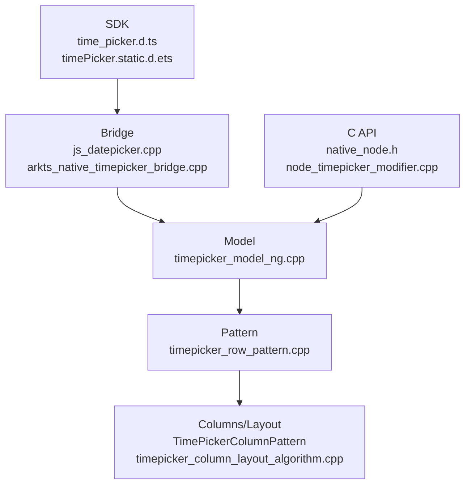

# 架构设计
> TimePicker 组件的已有实现规格补录，覆盖小时/分钟/秒列、12/24 小时、范围、循环、级联、文本样式、事件、触觉反馈、C API 和静态/动态 ArkUI API。

## 设计元数据

| 字段 | 内容 |
|------|------|
| Design ID | DESIGN-Func-05-05-04 |
| 关联需求 | 已有能力补录（无独立 requirement.md） |
| 关联 Epic | 无 |
| 目标 Feature | Feat-01: TimePicker 组件全量规格 |
| 复杂度 | 标准 |
| 目标版本 | API 8 ~ API 26+ |
| Owner | ArkUI SIG |
| 状态 | Baselined（已有实现补录） |

## 需求基线

| 项 | 补充说明（如需） |
|----|------------------|
| 时间选择 | `TimePicker(options?)` 创建 hour/minute 列，`format=HOUR_MINUTE_SECOND` 时创建 second 列 |
| 12/24 小时 | `useMilitaryTime` 未设置时按系统时间格式，12 小时模式有 AM/PM 列 |
| 范围和循环 | `start/end` 只按 hour/minute 生效，非默认范围会影响 loop/cascade |
| 事件 | `onChange` 在滚动结束后触发，`onEnterSelectedArea` 更早触发 |

## 上下文和现状

### 涉及仓和模块

| 仓库 | 模块路径 | 当前职责 | 本 Feature 影响 |
|------|----------|----------|-----------------|
| ace_engine | `frameworks/core/components_ng/pattern/time_picker/` | TimePicker Model/Pattern/Column/Layout/EventHub | 规格补录 |
| ace_engine | `frameworks/core/components_ng/pattern/time_picker/bridge/` | ArkTS 参数解析和 native bridge | 规格补录 |
| ace_engine | `frameworks/core/interfaces/native/node/node_timepicker_modifier.cpp` | C API 属性委托 | 规格补录 |
| ace_engine | `interfaces/native/native_node.h` | TimePicker C API 枚举和事件声明 | 规格补录 |
| interface/sdk-js | `api/@internal/component/ets/time_picker.d.ts` | Dynamic API 合同 | 规格对照 |
| interface/sdk-js | `api/arkui/component/timePicker.static.d.ets` | Static API 合同 | 规格对照 |

### 调用链层级分析

| 层 | 模块 | 职责 | 修改类型 |
|----|------|------|----------|
| SDK | `time_picker.d.ts`, `timePicker.static.d.ets` | 声明 TimePickerResult/Format/Options/Attribute | 无修改（规格补录） |
| Bridge | `js_datepicker.cpp`, `arkts_native_timepicker_bridge.cpp` | 加载 TimePicker 模块，解析 selected/format/start/end/style/event | 无修改（规格补录） |
| Model | `timepicker_model_ng.cpp` | 创建列，设置 start/end/selected/useMilitaryTime/loop/cascade/event | 无修改（规格补录） |
| Pattern | `timepicker_row_pattern.cpp` | 12/24 小时、AM/PM、秒列、范围裁剪、事件、haptic/crown | 无修改（规格补录） |
| Layout | `timepicker_column_layout_algorithm.cpp` | 列测量和滚轮布局 | 无修改（规格补录） |
| C API | `native_node.h`, `node_timepicker_modifier.cpp` | 属性和事件枚举映射 | 无修改（规格补录） |
| Test | `test/unittest/core/pattern/time_picker/`, `test/unittest/capi/modifiers/time_picker_modifier_test.cpp` | TimePicker 行为和 C API 回归验证 | 无修改（规格补录） |

### 适用架构规则

| Rule ID | 适用原因 | 设计结论 | 验证方式 |
|---------|----------|----------|----------|
| OH-ARCH-LAYERING | TimePicker 跨 SDK、Bridge、Model、Pattern、Layout、C API | 自上而下调用，时间范围在 Pattern 中最终裁剪 | 代码评审 |
| OH-ARCH-API-LEVEL | dynamic 8/11/12/18/26 与 static 23/26 存在差异 | spec 标注版本边界和 SDK/源码差异 | API 评审 |
| OH-ARCH-COMPONENT-BUILD | TimePicker 已有动态模块加载入口 | 本次无构建变更 | 生成校验 |
| OH-ARCH-ERROR-LOG | 非法时间和范围使用默认/裁剪，不新增错误码 | 规格记录恢复行为 | UT |

## 不涉及项承接

| 维度 | 设计结论 |
|------|----------|
| 产品源码 | 不修改 TimePicker 实现 |
| 构建系统 | 不修改 BUILD.gn/bundle.json |
| IPC/SA | 不涉及跨进程 |
| 数据迁移 | 不涉及持久化数据 |

## 关键设计决策

| 决策 ID | 问题 | 推荐方案 | 探索过的替代方案 | 取舍理由 | 影响 |
|---------|------|----------|-----------------|----------|------|
| ADR-1 | SDK“默认 24 小时”和属性说明/源码不一致如何处理 | 记录为兼容风险，规格按属性和实现描述“未设置时使用系统格式” | 静默采用一方 | 下游需要知道真实行为和合同差异 | AC-1.2 |
| ADR-2 | 秒列是否独立 Feat | 合并在 TimePicker 全量规格 | 单独 Feat | 秒列由 `format` 驱动，和事件返回值强关联 | AC-1.3 |
| ADR-3 | cascade 条件如何描述 | 明确 `loop && enableCascade && !start/end` 才推荐/生效 | 只写 enableCascade 开关 | 避免把 SDK 注意事项遗漏成行为回归 | AC-2.4 |

## 设计骨架

### 骨架范围

| 骨架项 | 目标 | 不包含 | 验证方式 |
|--------|------|--------|----------|
| 创建与格式 | 覆盖 hour/minute/second、12/24 小时、AM/PM | TimePickerDialog 独立规格 | UT |
| 范围和循环 | 覆盖 start/end/selected/loop/cascade | 新增时间算法 | UT |
| 样式和事件 | 覆盖文本样式、dateTimeOptions、haptic、crown、事件 | 通用属性 | UT |
| C API | 覆盖属性和事件数据格式 | ABI 修改 | C API UT |

### 骨架 Spec 拆分

| Task ID | 目标 | 受影响文件 | AC |
|---------|------|-----------|-----|
| TASK-SKELETON-1 | TimePicker 全量规格补录 | Feat-01-time-picker-full-spec.md | AC-1.1 ~ AC-4.3 |

## 后续 Task 拆分

| Task ID | 目标 | 受影响文件 | 依赖 |
|---------|------|-----------|------|
| TASK-TIME-PICKER-01 | TimePicker 全量规格补录 | Feat-01-time-picker-full-spec.md, design.md | 无 |

## API 签名、Kit 与权限

### 新增 API

| API 签名 | 类型 | Kit | d.ts 位置 | 权限要求 | SysCap |
|----------|------|-----|-----------|----------|--------|
| `TimePicker(options?: TimePickerOptions): TimePickerAttribute` | Public | ArkUI | `api/@internal/component/ets/time_picker.d.ts:221` | 无 | SystemCapability.ArkUI.ArkUI.Full |
| `TimePickerAttribute.useMilitaryTime(value)` | Public | ArkUI | `api/@internal/component/ets/time_picker.d.ts:286` | 无 | 同上 |
| `TimePickerAttribute.loop(value)` | Public | ArkUI | `api/@internal/component/ets/time_picker.d.ts:317` | 无 | 同上 |
| `TimePickerAttribute.dateTimeOptions(value)` | Public | ArkUI | `api/@internal/component/ets/time_picker.d.ts:453` | 无 | 同上 |
| `TimePickerAttribute.onChange/onEnterSelectedArea(...)` | Public | ArkUI | `api/@internal/component/ets/time_picker.d.ts:494` | 无 | 同上 |
| `TimePickerAttribute.enableHapticFeedback/enableCascade(...)` | Public | ArkUI | `api/@internal/component/ets/time_picker.d.ts:561` | 无 | 同上 |
| `ARKUI_NODE_TIME_PICKER` / `NODE_TIME_PICKER_*` | NDK/Public | ArkUI C API | `interfaces/native/native_node.h:82`, `interfaces/native/native_node.h:5603` | 无 | 同上 |

### 变更/废弃 API

| 原有 API | 变更类型 | 新 API | 迁移说明 |
|----------|----------|--------|----------|
| 无 | — | — | 本次为已有 API 规格补录，无声明变更 |

## 构建系统影响

### BUILD.gn 变更

无 BUILD.gn 变更。

### bundle.json 变更

无 bundle.json 变更。

## 可选设计扩展

### 架构图

### 数据流/控制流

| 步骤 | 调用方 | 被调用方 | 数据/接口 | 说明 |
|------|--------|----------|-----------|------|
| 1 | ArkTS/C API | Bridge/native modifier | TimePickerOptions / NODE_TIME_PICKER_* | 解析时间和样式 |
| 2 | Bridge | TimePickerModelNG | PickerTime、format、callback | 写入 Pattern/LayoutProperty/EventHub |
| 3 | Model | TimePickerRowPattern | hour/minute/second 节点 | 创建列结构 |
| 4 | Pattern | ColumnPattern | options/currentIndex | 根据 12/24、范围和秒列刷新 |
| 5 | Column/Pattern | EventHub | TimePickerResult | 触发事件 |

### 时序设计

无跨线程异步时序；滚动进入选中区和动画结束分别触发不同事件。

### 数据模型设计

| 数据 | API 层 | 实现层 | 存储位置 |
|------|--------|--------|----------|
| 时间 | `Date` / `TimePickerResult` | `PickerTime` | TimePickerRowPattern |
| 格式 | `TimePickerFormat` | `hasSecond_` | Pattern/LayoutProperty |
| 12/24 小时 | `useMilitaryTime` | `hour24_`, AM/PM options | Pattern/LayoutProperty |
| 范围 | `start/end` | `startTime_`, `endTime_` | Pattern |

### 算法与状态机

| 算法 | 说明 | 源码 |
|------|------|------|
| 12/24 小时列构建 | 24 小时用 0-23，12 小时构建 AM/PM 与 1-12 | `frameworks/core/components_ng/pattern/time_picker/timepicker_row_pattern.cpp:1174` |
| 时间范围裁剪 | selected 小于 start 返回 start，大于 end 返回 end | `frameworks/core/components_ng/pattern/time_picker/timepicker_row_pattern.cpp:1807` |
| 范围 options 记录 | 根据 start/end 构建可用 hour options | `frameworks/core/components_ng/pattern/time_picker/timepicker_row_pattern.cpp:1675` |

### 测试性设计

| 测试层级 | 测试目标 | Mock 策略 | 验证方式 |
|----------|----------|-----------|----------|
| Core UT | 12/24、顺序、范围、事件、无障碍 | Mock Theme/Pipeline | `test/unittest/core/pattern/time_picker/time_picker_test_ng.cpp:1` |
| C API UT | 属性和事件枚举 | ArkUI native node mock | `test/unittest/capi/modifiers/time_picker_modifier_test.cpp:1` |

### 异常传播时序图

无跨进程异常传播；非法时间按默认值或 `AdjustTime` 裁剪。

### 资源所有权矩阵

| 资源 | 创建方 | 持有方 | 销毁触发 | 实际释放 | 异常回收 |
|------|--------|--------|----------|----------|----------|
| TimePicker FrameNode | Model | UI 树 | 组件卸载 | RefPtr 引用计数 | CHECK_NULL_VOID 返回 |
| hour/minute/second 列 | Model/Pattern | TimePicker 子树 | 格式变化或卸载 | UI 树卸载 | 空节点跳过 |

### 接口参数规约

| 接口 | 参数 | 类型 | 合法范围 | 非法处理 | 边界说明 |
|------|------|------|----------|----------|----------|
| `TimePicker(options)` | `selected` | Date | 0:00:00 ~ 23:59:59 | 按 start/end 裁剪 | Pattern `timepicker_row_pattern.cpp:1807` |
| `TimePicker(options)` | `format` | TimePickerFormat | HOUR_MINUTE/HOUR_MINUTE_SECOND | 非法使用默认 | SDK `time_picker.d.ts:151` |
| `TimePickerAttribute.enableCascade` | `enabled` | boolean | true/false | 仅 12 小时且 loop 为 true 时有意义 | SDK `time_picker.d.ts:598` |

### 线程与并发模型

TimePicker 为 UI 线程组件能力，文档补录不改变线程模型。

## 详细设计

### 创建、格式和本地化

`TimePickerModelNG::CreateTimePicker` 创建 hour/minute 列，`format` 驱动 Pattern 动态创建或删除 second 列；语言为 `ug` 等场景会影响列挂载顺序，源码见 `frameworks/core/components_ng/pattern/time_picker/timepicker_model_ng.cpp:62`、`timepicker_row_pattern.cpp:570`。

### 范围、循环和级联

Model 写入 `start/end/selected/loop/enableCascade`，Pattern 在 `OnModifyDone` 中 `LimitSelectedTimeInRange` 并重建 options；`AdjustTime` 按分钟范围裁剪，源码见 `frameworks/core/components_ng/pattern/time_picker/timepicker_model_ng.cpp:244`、`timepicker_row_pattern.cpp:538`、`timepicker_row_pattern.cpp:1799`。

### 事件和 C API

`onChange` 在选择确认后返回 `TimePickerResult`，`onEnterSelectedArea` 更早触发；C API 事件返回 hour/minute，源码见 `frameworks/core/components_ng/pattern/time_picker/timepicker_model_ng.cpp:329`、`interfaces/native/native_node.h:11058`。

## 风险和开放问题

| 项 | 类型 | 影响 | 处理方式 | Owner |
|----|------|------|----------|-------|
| SDK 创建说明与属性说明/源码关于默认 24 小时存在表述差异 | API | 中 | 在 spec 兼容性中显式记录，避免下游静默假设 | ArkUI SIG |
| C API 事件只声明 hour/minute，ArkTS result 可含 second | API | 低 | 分别记录 C API 与 ArkTS 合同 | ArkUI SIG |

## 设计审批

- [x] 需求基线已确认，设计覆盖 P0/P1 AC
- [x] 不涉及项已承接，N/A 和展开项都有结论
- [x] 涉及仓和模块职责清楚
- [x] 调用链层级分析完整，每层覆盖到位
- [x] 适用架构规则已识别并形成设计结论
- [x] 分层和子系统边界合规
- [x] API 变更有签名、权限、错误码和兼容性说明
- [x] BUILD.gn/bundle.json 影响明确
- [x] 设计输出和后续 Task 拆分明确
- [x] 关键设计决策有理由和影响说明
- [x] 风险和开放问题有 Owner

**结论:** 通过（已有实现补录）。

