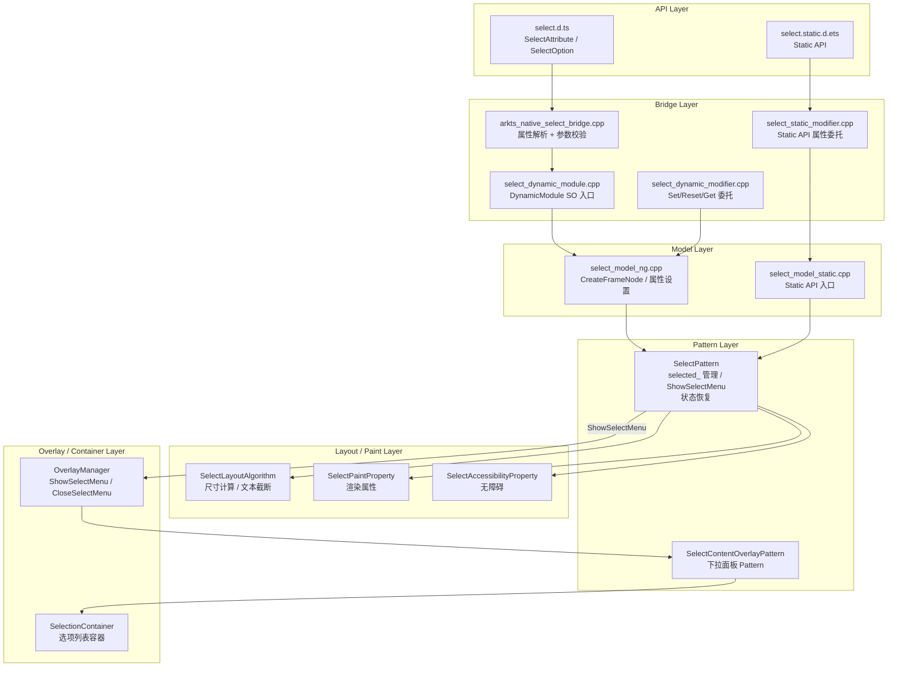
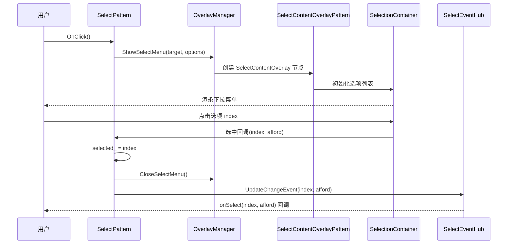
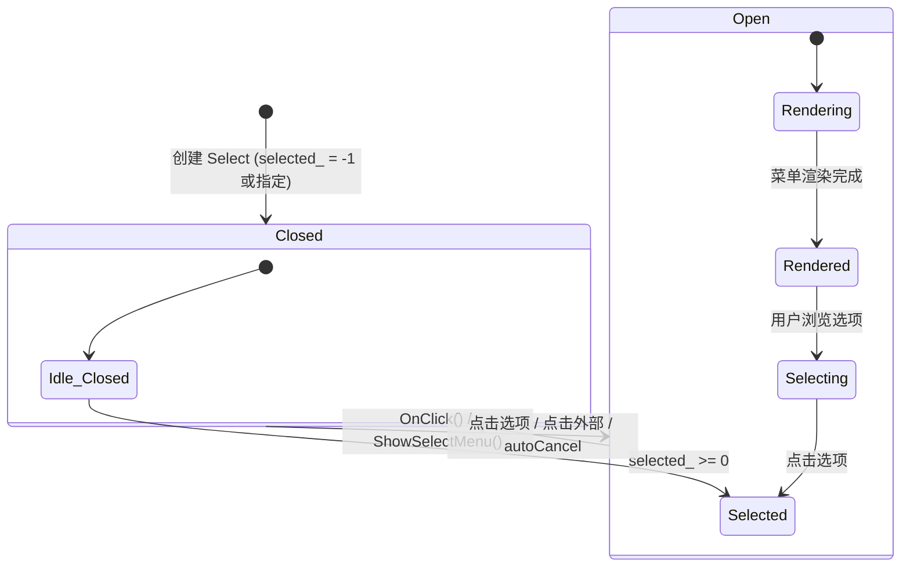

# 架构设计
> Select 组件的架构设计文档，覆盖下拉选择器的创建、选中管理、下拉面板渲染、样式定制和扩展能力。

## 设计元数据

| 字段 | 内容 |
|------|------|
| Design ID | DESIGN-Func-05-05-05 |
| 关联需求 | 已有能力补录（无独立 requirement.md） |
| 关联 Epic | 无 |
| 目标 Feature | Feat-01: Select 组件全量规格（下拉选择、选中管理、样式定制、菜单布局） |
| 复杂度 | 标准 |
| 目标版本 | API 8 ~ API 26+ |
| Owner | ArkUI SIG |
| 状态 | Baselined（已有实现补录） |

## 需求基线

> 需求基线详见 proposal.md。以下仅列出设计阶段需要额外强调的要点。

| 项 | 补充说明（如需） |
|----|------------------|
| 下拉菜单渲染 | Select 通过 OverlayManager 将菜单内容挂载到独立 overlay 节点，使用 SelectionContainer 管理选项列表 |
| 选中状态管理 | selected_ 默认 -1（未选中），点击选项后更新索引并触发 onSelect 回调 |
| 无 C API | Select 未作为 ArkUI_NodeType 枚举暴露，仅通过 ArkTS Dynamic/Static API 使用 |
| 组件化 | 已组件化为独立 SO（libarkui_select.z.so），通过 DynamicModule 注册 |

## 上下文和现状

### 涉及仓和模块

| 仓库 | 模块路径 | 当前职责 | 本 Feature 影响 |
|------|----------|----------|-----------------|
| ace_engine | `frameworks/core/components_ng/pattern/select/select_pattern.cpp` | Select Pattern：选中管理、ShowSelectMenu、状态恢复 | 核心实现，规格补录 |
| ace_engine | `frameworks/core/components_ng/pattern/select/select_model_ng.cpp` | Select Model：创建节点、属性设置 | 规格补录 |
| ace_engine | `frameworks/core/components_ng/pattern/select/select_model_static.cpp` | Static API 入口 | 规格补录 |
| ace_engine | `frameworks/core/components_ng/pattern/select/select_layout_algorithm.cpp` | Select 布局：尺寸计算、文本截断 | 规格补录 |
| ace_engine | `frameworks/core/components_ng/pattern/select/select_paint_property.cpp` | Select 渲染属性 | 规格补录 |
| ace_engine | `frameworks/core/components_ng/pattern/select/select_accessibility_property.cpp` | 无障碍属性 | 规格补录 |
| ace_engine | `frameworks/core/components_ng/pattern/select/bridge/` | 组件化 Bridge / DynamicModule | 规格补录 |
| ace_engine | `frameworks/core/components_ng/pattern/select_content_overlay/select_content_overlay_pattern.cpp` | 下拉面板 overlay Pattern | 规格补录 |
| ace_engine | `frameworks/core/components_ng/manager/select_content_overlay/select_content_overlay_manager.cpp` | 下拉面板 overlay Manager | 规格补录 |
| ace_engine | `frameworks/core/components_ng/pattern/selection_container/selection_container_pattern.cpp` | 选项列表容器 | 规格补录 |
| ace_engine | `frameworks/core/components_ng/pattern/overlay/overlay_manager.cpp` | Overlay 管理：ShowSelectMenu/CloseSelectMenu | 规格补录 |
| interface/sdk-js | `api/@internal/component/ets/select.d.ts` | Dynamic API 声明 | 规格对照 |

### 调用链层级分析

| 层 | 模块 | 职责 | 修改类型 |
|----|------|------|----------|
| JS Bridge | `frameworks/bridge/declarative_frontend/ark_modifier/src/select_modifier.ts`, `ark_direct_component/src/arkselect.ts` | ArkTS 属性解析入口 | 无修改（规格补录） |
| Bridge | `frameworks/core/components_ng/pattern/select/bridge/arkts_native_select_bridge.cpp` | 属性解析、参数校验 | 无修改（规格补录） |
| Bridge (DynamicModule) | `frameworks/core/components_ng/pattern/select/bridge/select_dynamic_module.cpp` | 组件化 SO 入口（libarkui_select.z.so） | 无修改（规格补录） |
| Bridge (DynamicModifier) | `frameworks/core/components_ng/pattern/select/bridge/select_dynamic_modifier.cpp` | Set/Reset/Get 属性委托层 | 无修改（规格补录） |
| Bridge (StaticModifier) | `frameworks/core/components_ng/pattern/select/bridge/select_static_modifier.cpp` | Static API 属性委托 | 无修改（规格补录） |
| Model | `frameworks/core/components_ng/pattern/select/select_model_ng.cpp` | 创建 FrameNode、属性设置委托 | 无修改（规格补录） |
| Model (Static) | `frameworks/core/components_ng/pattern/select/select_model_static.cpp` | Static API 入口 | 无修改（规格补录） |
| Pattern | `frameworks/core/components_ng/pattern/select/select_pattern.cpp` | 选中管理、ShowSelectMenu、下拉生命周期、状态恢复 | 无修改（规格补录） |
| Layout | `frameworks/core/components_ng/pattern/select/select_layout_algorithm.cpp` | 尺寸计算、文本截断、箭头布局 | 无修改（规格补录） |
| Paint | `frameworks/core/components_ng/pattern/select/select_paint_property.cpp/.h` | 渲染属性存储 | 无修改（规格补录） |
| Accessibility | `frameworks/core/components_ng/pattern/select/select_accessibility_property.cpp` | 无障碍属性 | 无修改（规格补录） |
| Overlay Manager | `frameworks/core/components_ng/pattern/overlay/overlay_manager.cpp` | ShowSelectMenu/CloseSelectMenu 挂载/卸载 | 无修改（规格补录） |
| SelectContentOverlay | `frameworks/core/components_ng/pattern/select_content_overlay/select_content_overlay_pattern.cpp` | 下拉面板 Pattern | 无修改（规格补录） |
| SelectionContainer | `frameworks/core/components_ng/pattern/selection_container/selection_container_pattern.cpp` | 选项列表容器 | 无修改（规格补录） |

### 适用架构规则

| Rule ID | 适用原因 | 设计结论 | 验证方式 |
|---------|----------|----------|----------|
| OH-ARCH-LAYERING | Select 涉及 API → Bridge → Model → Pattern → Overlay 多层调用 | 调用方向自上而下，Pattern 通过 OverlayManager 间接管理下拉面板 | 代码评审 |
| OH-ARCH-API-LEVEL | Select 有 @since 8/10/11/12/19/20/23 等多版本 API | 各版本 API 通过 PlatformVersion 条件分支实现兼容 | API 评审 / XTS |
| OH-ARCH-COMPONENT-BUILD | Select 已组件化为独立 SO（libarkui_select.z.so） | DynamicModule 注册机制，通过 OHOS_ACE_DynamicModule_Create_Select() 入口 | 构建验证 |
| OH-ARCH-SUBSYSTEM | Select 依赖 OverlayManager 挂载下拉面板 | 同仓跨模块依赖，Pattern 通过 PipelineContext 获取 OverlayManager | 依赖检查 |

## 不涉及项承接

> proposal.md 已完成 N/A 判定。本节仅对 proposal 中标记为"涉及"且需展开设计的维度给出结论。

| 维度 | 设计结论 |
|------|----------|
| 无障碍 | Select 实现 AccessibilityProperty，报告角色为 DropDownMenu，支持 ActionSelect 选中选项 |
| 深色模式 | 颜色属性使用 ResourceColor 类型，支持 Token 主题切换，通过 SelectThemeWrapper 映射 |
| 版本升级兼容 | API 10 引入 space/arrowPosition/menuAlign；API 11 引入 optionWidth/optionHeight/menuBackgroundColor；API 12 引入 controlSize/menuItemContentModifier/divider；API 19 引入 dividerStyle/avoidance；API 20 引入 menuOutline/showInSubWindow/showDefaultSelectedIcon/textModifier/arrowModifier；API 23 引入 keyboardAvoidMode/menuSystemMaterial/Static API |
| 多窗口 | showInSubWindow（@since 20）允许下拉菜单在独立子窗口显示 |

## 关键设计决策

| 决策 ID | 问题 | 推荐方案 | 探索过的替代方案 | 取舍理由 | 影响 |
|---------|------|----------|-----------------|----------|------|
| ADR-1 | 下拉菜单如何渲染 | 通过 OverlayManager 挂载到独立 overlay 节点，使用 SelectContentOverlayPattern + SelectionContainer | 直接在 Select 组件树内渲染 | overlay 独立于组件树，不受 Select 父容器裁剪/overflow 限制；支持子窗口模式 | AC-2.1, AC-2.2 |
| ADR-2 | 选中状态如何管理 | SelectPattern 内部维护 `int32_t selected_ = -1`，点击选项时更新索引并触发 onSelect | 使用双向绑定属性 | 简单直观，selected 属性支持外部设置初始化选中项；-1 表示未选中 | AC-1.3, AC-1.4 |
| ADR-3 | 是否暴露 C API | 不暴露 C API（不作为 ArkUI_NodeType 枚举） | 暴露 NDK 节点类型 | Select 的下拉菜单交互依赖 Overlay 和 SelectionContainer，C API 层难以完整表达；ArkTS Dynamic/Static API 已覆盖全部能力 | AC-8.1 |
| ADR-4 | 菜单避让策略 | API 19 引入 avoidance 枚举（COVER_TARGET / AVOID_AROUND_TARGET），由 OverlayManager 执行 | 统一 COVER_TARGET | 不同场景需要不同避让策略，COVER_TARGET 覆盖目标，AVOID_AROUND_TARGET 环绕目标避免遮挡 | AC-5.5 |
| ADR-5 | 菜单宽度/高度定制 | API 11 引入 optionWidth/optionHeight，单独控制菜单尺寸 | 复用 Select 自身尺寸 | 菜单尺寸需独立于 Select 组件尺寸，支持更灵活的布局 | AC-3.3 |
| ADR-6 | 文本/箭头自定义 | API 20 引入 textModifier/arrowModifier，允许通过 Modifier 自定义文本和箭头渲染 | 暴露更多原子属性 | Modifier 模式更灵活，支持动态属性绑定，减少 API 膨胀 | AC-4.4 |
| ADR-7 | 键盘避让模式 | API 23 引入 keyboardAvoidMode，控制下拉菜单与软键盘的避让行为 | 固定行为 | 不同场景需要不同的键盘避让策略，由开发者控制 | AC-5.8 |
| ADR-8 | Static API 入口 | API 23 引入 SelectModelStatic，提供 Static API 入口（select.static.d.ets） | 仅 Dynamic API | Static API 支持编译期类型检查和 IDE 智能提示，逐步迁移到 Static API 是 ArkUI 演进方向 | AC-1.2 |

## 设计骨架

### 骨架范围

| 骨架项 | 目标 | 不包含 | 验证方式 |
|--------|------|--------|----------|
| Select 创建与选中 | 创建 Select 组件、options 设置、selected 初始化、onSelect 回调 | 独立 Picker 组件 | UT |
| 下拉菜单生命周期 | ShowSelectMenu/CloseSelectMenu、overlay 挂载/卸载 | 子窗口管理细节 | UT + 手工 |
| 菜单布局 | space/arrowPosition/menuAlign/optionWidth/optionHeight/menuBackgroundColor | 自定义菜单动画 | UT |
| 菜单样式 | selectedOptionBgColor/selectedOptionFont/optionBgColor/optionFont/font/fontColor | 通用样式属性 | UT |
| 菜单避让 | avoidance/divider/dividerStyle/menuOutline | 复杂嵌套场景 | UT + 手工 |
| Modifier 扩展 | menuItemContentModifier/textModifier/arrowModifier/controlSize | Modifier 框架本身 | UT |
| 高级特性 | showInSubWindow/showDefaultSelectedIcon/keyboardAvoidMode/menuSystemMaterial/menuBackgroundBlurStyle | 子窗口内部实现 | 手工 |
| Static API | SelectModelStatic 入口、属性设置 | Dynamic API 差异 | UT |
| 状态恢复 | ProvideRestoreInfo/OnRestoreInfo 选中状态恢复 | 全局状态管理 | UT |
| 无障碍 | AccessibilityProperty 角色/操作 | 无障碍自动化测试框架 | UT |

### 骨架 Spec 拆分

| Task ID | 目标 | 受影响文件 | AC |
|---------|------|-----------|-----|
| TASK-SKELETON-1 | Select 全量规格补录（创建、选中、菜单、样式、扩展、无障碍） | Feat-01-select-full-spec.md | AC-1.1 ~ AC-10.3 |

## 后续 Task 拆分

| Task ID | 目标 | 受影响文件 | 依赖 |
|---------|------|-----------|------|
| TASK-SELECT-01 | Select 全量规格补录 | Feat-01-select-full-spec.md, design.md | 无 |

## API 签名、Kit 与权限

> 本节承接 spec.md"API 变更分析"中识别的 API，给出签名、权限和 d.ts 位置等实现细节。

### 新增 API

| API 签名 | 类型 | d.ts 位置 | 权限要求 | SysCap |
|----------|------|-----------|----------|--------|
| `Select(options: SelectOption[]): SelectAttribute` | Public | `@internal/component/ets/select.d.ts` | 无 | SystemCapability.ArkUI.ArkUI.Full |
| `.selected(value: number): SelectAttribute` | Public | `select.d.ts` | 无 | 同上 |
| `.value(value: string): SelectAttribute` | Public | `select.d.ts` | 无 | 同上 |
| `.font(value: Font): SelectAttribute` | Public | `select.d.ts` | 无 | 同上 |
| `.fontColor(value: ResourceColor): SelectAttribute` | Public | `select.d.ts` | 无 | 同上 |
| `.selectedOptionBgColor(value: ResourceColor): SelectAttribute` | Public | `select.d.ts` | 无 | 同上 |
| `.selectedOptionFont(value: Font): SelectAttribute` | Public | `select.d.ts` | 无 | 同上 |
| `.selectedOptionFontColor(value: ResourceColor): SelectAttribute` | Public | `select.d.ts` | 无 | 同上 |
| `.optionBgColor(value: ResourceColor): SelectAttribute` | Public | `select.d.ts` | 无 | 同上 |
| `.optionFont(value: Font): SelectAttribute` | Public | `select.d.ts` | 无 | 同上 |
| `.optionFontColor(value: ResourceColor): SelectAttribute` | Public | `select.d.ts` | 无 | 同上 |
| `.onSelect(callback: (index: number, afford: string) => void): SelectAttribute` | Public | `select.d.ts` | 无 | 同上 |
| `.space(value: number): SelectAttribute` | Public | `select.d.ts` | 无 | 同上 |
| `.arrowPosition(value: ArrowPosition): SelectAttribute` | Public | `select.d.ts` | 无 | 同上 |
| `.menuAlign(alignType: MenuAlignType, alignOffset: number): SelectAttribute` | Public | `select.d.ts` | 无 | 同上 |
| `.optionWidth(value: OptionWidthMode \| Dimension): SelectAttribute` | Public | `select.d.ts` | 无 | 同上 |
| `.optionHeight(value: number \| string): SelectAttribute` | Public | `select.d.ts` | 无 | 同上 |
| `.menuBackgroundColor(value: ResourceColor): SelectAttribute` | Public | `select.d.ts` | 无 | 同上 |
| `.menuBackgroundBlurStyle(value: BlurStyle): SelectAttribute` | Public | `select.d.ts` | 无 | 同上 |
| `.controlSize(value: ControlSize): SelectAttribute` | Public | `select.d.ts` | 无 | 同上 |
| `.menuItemContentModifier(modifier: ContentModifier): SelectAttribute` | Public | `select.d.ts` | 无 | 同上 |
| `.divider(value: DividerStyle \| null): SelectAttribute` | Public | `select.d.ts` | 无 | 同上 |
| `.dividerStyle(value: DividerStyle): SelectAttribute` | Public | `select.d.ts` | 无 | 同上 |
| `.avoidance(value: MenuAvoidance): SelectAttribute` | Public | `select.d.ts` | 无 | 同上 |
| `.menuOutline(value: SelectMenuOutline): SelectAttribute` | Public | `select.d.ts` | 无 | 同上 |
| `.showInSubWindow(value: boolean): SelectAttribute` | Public | `select.d.ts` | 无 | 同上 |
| `.showDefaultSelectedIcon(value: boolean): SelectAttribute` | Public | `select.d.ts` | 无 | 同上 |
| `.keyboardAvoidMode(value: MenuKeyboardAvoidMode): SelectAttribute` | Public | `select.d.ts` | 无 | 同上 |
| `.menuSystemMaterial(value: MenuSystemMaterial): SelectAttribute` | Public | `select.d.ts` | 无 | 同上 |
| `.textModifier(modifier: Modifier): SelectAttribute` | Public | `select.d.ts` | 无 | 同上 |
| `.arrowModifier(modifier: Modifier): SelectAttribute` | Public | `select.d.ts` | 无 | 同上 |

### 变更/废弃 API

| 原有 API | 变更类型 | 新 API | 迁移说明 |
|----------|----------|--------|----------|
| 无 | — | — | — |

## 构建系统影响

### BUILD.gn 变更

Select 已完成组件化改造，输出独立 SO：

```
# frameworks/core/components_ng/pattern/select/BUILD.gn
# 构建目标：libarkui_select.z.so
# DynamicModule 入口：select_dynamic_module.cpp
# 包含 Select Pattern/Model/Layout/Paint/Bridge/Static 代码
```

### bundle.json 变更

Select 组件作为 ace_engine 的内部 component，无独立 bundle.json 变更。

## 可选设计扩展

### 架构图



### 数据流/控制流

| 步骤 | 调用方 | 被调用方 | 数据/接口 | 说明 |
|------|--------|----------|-----------|------|
| 1 | ArkTS / Static API | Bridge / static_modifier | SelectOption[] / 属性值 | 属性设置入口 |
| 2 | Bridge | SelectModelNG | CreateFrameNode(options) | 创建 Select 节点 |
| 3 | 用户点击 Select | SelectPattern::OnClick | ShowSelectMenu() | 打开下拉菜单 |
| 4 | SelectPattern | OverlayManager::ShowSelectMenu | 挂载 SelectContentOverlay 节点 | 下拉面板挂载 |
| 5 | OverlayManager | SelectContentOverlayPattern | 初始化菜单内容 | 菜单渲染 |
| 6 | SelectContentOverlayPattern | SelectionContainer | 创建选项列表 | 选项渲染 |
| 7 | 用户点击选项 | SelectionContainer | 选中回调 | 选中处理 |
| 8 | SelectionContainer | SelectPattern | selected_ = index, onSelect(index, afford) | 状态更新 |
| 9 | SelectPattern | SelectEventHub | UpdateChangeEvent | 事件回调 |

### 时序设计



### 数据模型设计

**API 层类型 (TypeScript)**:

```typescript
// 构造参数
interface SelectOption {
  value: ResourceStr;
  icon?: ResourceStr;
  symbolIcon?: SymbolGlyphModifier;  // @since 12
}

// 菜单对齐类型
enum MenuAlignType { START, CENTER, END }

// 箭头位置
enum ArrowPosition { END, START }

// 避让策略 (@since 19)
enum MenuAvoidance { COVER_TARGET, AVOID_AROUND_TARGET }

// 键盘避让模式 (@since 23)
enum MenuKeyboardAvoidMode { DEFAULT, TRANSLATE, RESIZE }

// 菜单轮廓 (@since 20)
interface SelectMenuOutline {
  width?: Dimension;
  height?: Dimension;
  constraintWidth?: Dimension;
  constraintHeight?: Dimension;
}
```

**框架层结构 (C++)**:

```cpp
// SelectPaintProperty 关键字段
ACE_DEFINE_PROPERTY_ITEM_WITHOUT_GROUP(Selected, int32_t);           // 选中索引，默认 -1
ACE_DEFINE_PROPERTY_ITEM_WITHOUT_GROUP(Value, std::string);          // 显示文本
ACE_DEFINE_PROPERTY_ITEM(Font, Font);                                // 字体
ACE_DEFINE_PROPERTY_ITEM(FontColor, Color);                          // 字体颜色
ACE_DEFINE_PROPERTY_ITEM(SelectedOptionBgColor, Color);              // 选中项背景色
ACE_DEFINE_PROPERTY_ITEM(SelectedOptionFont, Font);                  // 选中项字体
ACE_DEFINE_PROPERTY_ITEM(SelectedOptionFontColor, Color);            // 选中项字体颜色
ACE_DEFINE_PROPERTY_ITEM(OptionBgColor, Color);                      // 选项背景色
ACE_DEFINE_PROPERTY_ITEM(OptionFont, Font);                        // 选项字体
ACE_DEFINE_PROPERTY_ITEM(OptionFontColor, Color);                   // 选项字体颜色
ACE_DEFINE_PROPERTY_ITEM(MenuBackgroundColor, Color);               // 菜单背景色
ACE_DEFINE_PROPERTY_ITEM(MenuBackgroundBlurStyle, BlurStyle);       // 菜单背景模糊
ACE_DEFINE_PROPERTY_ITEM(Space, Dimension);                         // 菜单间距
ACE_DEFINE_PROPERTY_ITEM(ArrowPosition, ArrowPosition);             // 箭头位置
ACE_DEFINE_PROPERTY_ITEM(OptionWidth, Dimension);                   // 菜单宽度
ACE_DEFINE_PROPERTY_ITEM(OptionHeight, Dimension);                   // 菜单高度
```

### 算法与状态机



### 测试性设计

| 测试层级 | 测试目标 | Mock 策略 | 验证方式 |
|----------|----------|-----------|----------|
| UT - Pattern | SelectPattern 选中管理、ShowSelectMenu/CloseSelectMenu | MockPipelineContext, MockOverlayManager | gtest_filter |
| UT - Layout | SelectLayoutAlgorithm 尺寸计算、文本截断 | MockRenderContext | gtest_filter |
| UT - Property | SelectPaintProperty 设置/重置/默认值 | 直接构造 Property 对象 | gtest_filter |
| UT - Model | SelectModelNG/SelectModelStatic 创建和属性设置 | MockPipelineContext | gtest_filter |
| UT - Accessibility | AccessibilityProperty 角色/操作 | MockAccessibilityNode | gtest_filter |
| UT - Event | onSelect 回调、选中索引更新 | MockEventHub | gtest_filter |
| 手工 | 下拉菜单视觉效果、子窗口模式 | 真机 | 视觉比对 |

### 接口参数规约

| 接口 | 参数 | 类型 | 合法范围 | 非法处理 | 边界说明 |
|------|------|------|----------|----------|----------|
| Select() | options | SelectOption[] | 非空数组 | 空数组时不显示选项 | — |
| selected | value | number | 0 ~ options.length - 1 | 越界时回退到 -1 | 默认 -1（未选中） |
| value | value | string | 任意字符串 | 空字符串 | 显示文本 |
| space | value | number | ≥ 0 | < 0 取绝对值 | 菜单间距 (vp) |
| optionWidth | value | OptionWidthMode \| Dimension | ≥ 0 或 FIT_CONTENT | 非法使用默认 | 菜单宽度 |
| optionHeight | value | number \| string | ≥ 0 | < 0 使用默认 | 菜单高度 |
| arrowPosition | value | ArrowPosition | END / START | 默认 END | 箭头位置 |
| showInSubWindow | value | boolean | true / false | 默认 false | 子窗口显示 |
| showDefaultSelectedIcon | value | boolean | true / false | 默认 true | 显示选中图标 |

## 详细设计

### Select 创建与选中管理

`SelectModelNG::CreateFrameNode`（`select_model_ng.cpp`）创建 Select 节点（标签 `SELECT_ETS_TAG`），初始化 `SelectPattern`。选中状态由 `SelectPattern::selected_`（`int32_t`，默认 -1）管理：

- **初始化**: 通过 `selected(value)` 属性设置初始选中项，`SelectPattern::OnModifyContext` 读取并更新 `selected_`
- **选中更新**: 用户点击选项时，`SelectionContainer` 回调到 `SelectPattern`，更新 `selected_` 并触发 `onSelect(index, afford)` 回调
- **状态恢复**: `SelectPattern::ProvideRestoreInfo()` 序列化 `selected_`，`OnRestoreInfo()` 反序列化恢复选中状态

### 下拉菜单生命周期

**打开**: `SelectPattern::OnClick()` 调用 `ShowSelectMenu()`，通过 `OverlayManager::ShowSelectMenu()` 将 `SelectContentOverlay` 节点挂载到 overlay 树。`SelectContentOverlayPattern` 初始化菜单内容，通过 `SelectionContainer` 渲染选项列表。

**关闭**: 用户选中选项、点击菜单外部区域或触发 `autoCancel` 时，`OverlayManager::CloseSelectMenu()` 卸载 overlay 节点。

**子窗口模式**: `showInSubWindow(true)`（@since 20）使菜单在独立子窗口中显示，脱离主窗口约束。

### 菜单布局

`SelectLayoutAlgorithm`（`select_layout_algorithm.cpp`）负责：
- Select 组件尺寸计算（含文本和箭头）
- 文本截断处理
- 箭头位置布局（arrowPosition: END/START）

菜单自身布局由 `SelectContentOverlayPattern` 管理：
- `optionWidth` / `optionHeight`（@since 11）：控制菜单尺寸
- `space`（@since 10）：菜单项间距
- `menuAlign`（@since 10）：菜单对齐方式（START/CENTER/END）
- `menuOutline`（@since 20）：菜单轮廓约束

### 菜单避让策略

`avoidance`（@since 19）枚举控制菜单与目标的避让关系：
- `COVER_TARGET`：菜单覆盖目标组件
- `AVOID_AROUND_TARGET`：菜单环绕目标，避免遮挡

`keyboardAvoidMode`（@since 23）控制菜单与软键盘的避让：
- `DEFAULT`：默认行为
- `TRANSLATE`：菜单上移避让
- `RESIZE`：菜单缩小避让

### Modifier 扩展

- `menuItemContentModifier`（@since 12）：通过 `ContentModifier` 自定义菜单项渲染
- `textModifier`（@since 20）：通过 `Modifier` 自定义 Select 文本区域渲染
- `arrowModifier`（@since 20）：通过 `Modifier` 自定义箭头渲染
- `controlSize`（@since 12）：控制 Select 尺寸（SMALL/NORMAL）

### Static API

`SelectModelStatic`（`select_model_static.cpp`）提供 Static API 入口，通过 `select_static_modifier.cpp` 委托属性设置。Static API 与 Dynamic API 功能等价，但支持编译期类型检查。

## 风险和开放问题

| 项 | 类型 | 影响 | 处理方式 | Owner |
|----|------|------|----------|-------|
| 无 C API 支持 | API | 中 | Select 未作为 ArkUI_NodeType 暴露，NDK 开发者无法使用；需在文档中明确 | ArkUI SIG |
| 下拉菜单 overlay 依赖 | 架构 | 低 | Select 依赖 OverlayManager 和 SelectContentOverlayPattern，需确保 overlay 基础设施可用 | ArkUI SIG |
| API 20 多个新属性兼容性 | 兼容性 | 低 | textModifier/arrowModifier/menuOutline/showInSubWindow 等为 @since 20 新增，旧版本不支持 | ArkUI SIG |
| Static API 与 Dynamic API 差异 | API | 低 | Static API 为 @since 23 新增入口，需确保与 Dynamic API 行为一致 | ArkUI SIG |

## 设计审批

- [x] 需求基线已确认，设计覆盖 P0/P1 AC
- [x] 不涉及项已承接，N/A 和展开项都有结论
- [x] 涉及仓和模块职责清楚
- [x] 调用链层级分析完整，每层覆盖到位
- [x] 适用架构规则已识别并形成设计结论
- [x] 分层和子系统边界合规
- [x] API 变更有签名、权限、错误码和兼容性说明
- [x] BUILD.gn/bundle.json 影响明确
- [x] 设计输出和后续 Task 拆分明确
- [x] 关键设计决策有理由和影响说明
- [x] 风险和开放问题有 Owner

**结论:** 通过（已有实现补录）
