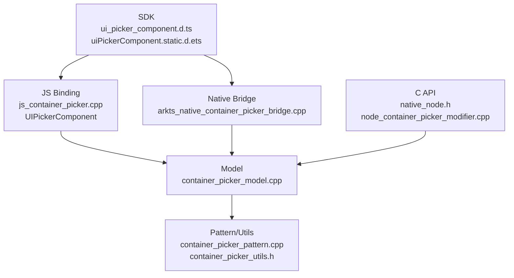

# 架构设计
> UIPickerComponent/Picker 组件的已有实现规格补录。用户提到的 UIComponentPicker 在 ace_engine 和 SDK 中未找到独立符号，实际公开 API 为 `UIPickerComponent`，实现侧为 ContainerPicker。

## 设计元数据

| 字段 | 内容 |
|------|------|
| Design ID | DESIGN-Func-05-05-06 |
| 关联需求 | 已有能力补录（无独立 requirement.md） |
| 关联 Epic | 无 |
| 目标 Feature | Feat-01: UIPickerComponent/Picker 组件全量规格 |
| 复杂度 | 标准 |
| 目标版本 | API 22 ~ API 26+ |
| Owner | ArkUI SIG |
| 状态 | Baselined（已有实现补录） |

## 需求基线

| 项 | 补充说明（如需） |
|----|------------------|
| API 名称 | SDK 和 JS binding 名称为 `UIPickerComponent`，C API node 为 `ARKUI_NODE_PICKER` |
| 实现名称 | 运行时组件实现位于 `frameworks/core/components_ng/pattern/container_picker/` |
| 子组件 | 支持 Text、Image、Row、SymbolGlyph 等有限子组件和 if/else、ForEach |
| 选择行为 | 三维滚轮样式，支持 selectedIndex、onChange、onScrollStop、canLoop、selectionIndicator、itemHeight、displayedItemCount |

## 上下文和现状

### 涉及仓和模块

| 仓库 | 模块路径 | 当前职责 | 本 Feature 影响 |
|------|----------|----------|-----------------|
| ace_engine | `frameworks/bridge/declarative_frontend/jsview/js_container_picker.cpp` | `UIPickerComponent` JS binding | 规格补录 |
| ace_engine | `frameworks/bridge/declarative_frontend/engine/jsi/nativeModule/arkts_native_container_picker_bridge.cpp` | ArkTS native bridge 属性分发 | 规格补录 |
| ace_engine | `frameworks/core/components_ng/pattern/container_picker/` | ContainerPicker Model/Pattern/Layout/EventHub/Utils | 规格补录 |
| ace_engine | `frameworks/core/interfaces/native/node/node_container_picker_modifier.cpp` | C API 属性委托 | 规格补录 |
| ace_engine | `interfaces/native/native_node.h` | `ARKUI_NODE_PICKER` 和 `NODE_PICKER_*` 声明 | 规格补录 |
| interface/sdk-js | `api/@internal/component/ets/ui_picker_component.d.ts` | Dynamic API 合同 | 规格对照 |
| interface/sdk-js | `api/arkui/component/uiPickerComponent.static.d.ets` | Static API 合同 | 规格对照 |

### 调用链层级分析

| 层 | 模块 | 职责 | 修改类型 |
|----|------|------|----------|
| SDK | `ui_picker_component.d.ts`, `uiPickerComponent.static.d.ets` | 声明 UIPickerComponentOptions、PickerIndicatorStyle、属性和事件 | 无修改（规格补录） |
| JS Bridge | `js_container_picker.cpp` | 绑定 `"UIPickerComponent"`，解析 selectedIndex、事件和属性 | 无修改（规格补录） |
| Native Bridge | `arkts_native_container_picker_bridge.cpp` | 静态/动态 nativeModule 属性分发 | 无修改（规格补录） |
| Model | `container_picker_model.cpp`, `container_picker_model_static.cpp` | 创建节点，写入 loop/haptic/indicator/itemHeight/displayedItemCount | 无修改（规格补录） |
| Pattern/Utils | `container_picker_pattern.cpp`, `container_picker_utils.h` | 滚轮布局参数、循环边界、事件触发、归一化算法 | 无修改（规格补录） |
| C API | `native_node.h`, `node_container_picker_modifier.cpp` | Picker node 属性和事件映射 | 无修改（规格补录） |
| Test | `test/unittest/core/pattern/container_picker/` | ContainerPicker Model/Pattern/EventHub 回归验证 | 无修改（规格补录） |

### 适用架构规则

| Rule ID | 适用原因 | 设计结论 | 验证方式 |
|---------|----------|----------|----------|
| OH-ARCH-LAYERING | UIPickerComponent 公开名与 ContainerPicker 实现名不同 | spec 明确 API 名称和实现路径映射 | 代码评审 |
| OH-ARCH-API-LEVEL | dynamic 22、static 23、itemHeight/displayedItemCount 26 存在边界 | 按 SDK `@since` 标注 | API 评审 |
| OH-ARCH-COMPONENT-BUILD | 现有实现已注册，无新增构建产物 | 本次无构建变更 | 生成校验 |
| OH-ARCH-ERROR-LOG | selectedIndex、displayedItemCount、itemHeight 有默认恢复策略 | 规格记录归一化和边界 | UT |

## 不涉及项承接

| 维度 | 设计结论 |
|------|----------|
| 产品源码 | 不修改 ContainerPicker/UIPickerComponent 实现 |
| 构建系统 | 不修改 BUILD.gn/bundle.json |
| IPC/SA | 不涉及跨进程 |
| Wearable | SDK 明示当前不支持 wearables，规格仅记录限制 |

## 关键设计决策

| 决策 ID | 问题 | 推荐方案 | 探索过的替代方案 | 取舍理由 | 影响 |
|---------|------|----------|-----------------|----------|------|
| ADR-1 | 用户称 UIComponentPicker，源码中如何落域 | 按 `UIPickerComponent` API 和 `ContainerPicker` 实现补录到 05-05-06 Picker | 新建 UIComponentPicker 域 | 未找到独立 UIComponentPicker 符号，新建域会制造伪概念 | AC-1.1 |
| ADR-2 | displayedItemCount/itemHeight 边界如何写 | 以 `ContainerPickerUtils` 归一化算法为规格 | 只写 SDK 默认 7/40vp | 运行时会把偶数、越界值改写为可观测结果 | AC-2.3, AC-2.4 |
| ADR-3 | 循环行为如何描述 | 同时记录 `canLoop` 和子组件数量少于 8 不循环 | 只写 canLoop 默认 true | SDK 明示少于 8 不循环，Pattern 的 loop 边界会影响键盘和滚动 | AC-3.2 |

## 设计骨架

### 骨架范围

| 骨架项 | 目标 | 不包含 | 验证方式 |
|--------|------|--------|----------|
| API/实现映射 | 说明 UIPickerComponent -> ContainerPicker -> ARKUI_NODE_PICKER | 新符号创建 | 静态检查 |
| 创建和子组件 | 覆盖 selectedIndex、子组件限制和默认尺寸 | 任意容器子组件支持 | UT |
| 滚轮属性 | 覆盖 loop/haptic/indicator/itemHeight/displayedItemCount | 新动画算法 | UT |
| C API | 覆盖 Picker node 属性和事件 | ABI 修改 | C API/UT |

### 骨架 Spec 拆分

| Task ID | 目标 | 受影响文件 | AC |
|---------|------|-----------|-----|
| TASK-SKELETON-1 | UIPickerComponent/Picker 全量规格补录 | Feat-01-uipicker-component-full-spec.md | AC-1.1 ~ AC-4.2 |

## 后续 Task 拆分

| Task ID | 目标 | 受影响文件 | 依赖 |
|---------|------|-----------|------|
| TASK-UIPICKER-01 | UIPickerComponent/Picker 全量规格补录 | Feat-01-uipicker-component-full-spec.md, design.md | 无 |

## API 签名、Kit 与权限

### 新增 API

| API 签名 | 类型 | Kit | d.ts 位置 | 权限要求 | SysCap |
|----------|------|-----|-----------|----------|--------|
| `UIPickerComponent(options?: UIPickerComponentOptions): UIPickerComponentAttribute` | Public | ArkUI | `api/@internal/component/ets/ui_picker_component.d.ts:91` | 无 | SystemCapability.ArkUI.ArkUI.Full |
| `UIPickerComponentAttribute.onChange/onScrollStop(callback)` | Public | ArkUI | `api/@internal/component/ets/ui_picker_component.d.ts:359` | 无 | 同上 |
| `UIPickerComponentAttribute.canLoop(enable)` | Public | ArkUI | `api/@internal/component/ets/ui_picker_component.d.ts:397` | 无 | 同上 |
| `UIPickerComponentAttribute.enableHapticFeedback(enable)` | Public | ArkUI | `api/@internal/component/ets/ui_picker_component.d.ts:420` | 触觉反馈依赖应用权限和硬件 | 同上 |
| `UIPickerComponentAttribute.selectionIndicator(style)` | Public | ArkUI | `api/@internal/component/ets/ui_picker_component.d.ts:437` | 无 | 同上 |
| `UIPickerComponentAttribute.itemHeight/displayedItemCount(...)` | Public | ArkUI | `api/@internal/component/ets/ui_picker_component.d.ts:450` | 无 | 同上 |
| `ARKUI_NODE_PICKER` / `NODE_PICKER_*` | NDK/Public | ArkUI C API | `interfaces/native/native_node.h:155`, `interfaces/native/native_node.h:9434` | 无 | 同上 |

### 变更/废弃 API

| 原有 API | 变更类型 | 新 API | 迁移说明 |
|----------|----------|--------|----------|
| 无 | — | — | 本次为已有 API 规格补录，无声明变更 |

## 构建系统影响

### BUILD.gn 变更

无 BUILD.gn 变更。

### bundle.json 变更

无 bundle.json 变更。

## 可选设计扩展

### 架构图

### 数据流/控制流

| 步骤 | 调用方 | 被调用方 | 数据/接口 | 说明 |
|------|--------|----------|-----------|------|
| 1 | ArkTS/C API | JS/native bridge | UIPickerComponentOptions / NODE_PICKER_* | 解析 selectedIndex 和属性 |
| 2 | Bridge | ContainerPickerModel | loop/haptic/indicator/itemHeight/displayedItemCount | 写入 LayoutProperty |
| 3 | Model | ContainerPickerPattern | selectedIndex / indicator style | 设置初始状态 |
| 4 | Pattern | ContainerPickerUtils | 归一化 displayedItemCount/itemHeight/loop index | 计算滚轮参数 |
| 5 | Pattern | EventHub | selectedIndex | 触发 onChange/onScrollStop |

### 时序设计

无跨线程异步时序；滚动动画结束或中间项变化时触发事件。

### 数据模型设计

| 数据 | API 层 | 实现层 | 存储位置 |
|------|--------|--------|----------|
| selectedIndex | number | `selectedIndex_`, `targetIndex` | ContainerPickerPattern/LayoutProperty |
| indicator | `PickerIndicatorStyle` | `PickerIndicatorStyle`, layout property | Model/Pattern |
| itemHeight/displayedItemCount | LengthMetrics/int | normalized Dimension/int | LayoutProperty/Pattern |

### 算法与状态机

| 算法 | 说明 | 源码 |
|------|------|------|
| displayedItemCount 归一化 | 合法 2-9，偶数加 1，越界回 7 | `frameworks/core/components_ng/pattern/container_picker/container_picker_utils.h:81` |
| itemHeight 归一化 | 合法 40vp-64vp，越界回 40vp | `frameworks/core/components_ng/pattern/container_picker/container_picker_utils.h:94` |
| 非循环边界 | 非 loop 到首/尾后 ShowPrevious/ShowNext 直接返回 | `frameworks/core/components_ng/pattern/container_picker/container_picker_pattern.cpp:752` |

### 测试性设计

| 测试层级 | 测试目标 | Mock 策略 | 验证方式 |
|----------|----------|-----------|----------|
| Core UT | model、pattern、event hub、归一化、loop/haptic/indicator | Mock Theme/Pipeline | `test/unittest/core/pattern/container_picker/BUILD.gn:16` |
| C API UT | 未找到专门 UIPickerComponent/ContainerPicker C API 测试 | N/A | 规格记录测试缺口 |

### 异常传播时序图

无跨进程异常传播；非法数值按默认值恢复，事件 callback 为 undefined 时不使用。

### 资源所有权矩阵

| 资源 | 创建方 | 持有方 | 销毁触发 | 实际释放 | 异常回收 |
|------|--------|--------|----------|----------|----------|
| ContainerPicker FrameNode | Model | UI 树 | 组件卸载 | RefPtr 引用计数 | CHECK_NULL_VOID 返回 |
| 子组件 | ArkTS 构建器 | ContainerPicker 子树 | 组件卸载或 ForEach 更新 | UI 树卸载 | 不支持类型按现有渲染限制处理 |

### 接口参数规约

| 接口 | 参数 | 类型 | 合法范围 | 非法处理 | 边界说明 |
|------|------|------|----------|----------|----------|
| `UIPickerComponent(options)` | `selectedIndex` | number | 0 ~ childCount - 1 | 越界默认 0，小数向下取整 | SDK `ui_picker_component.d.ts:30` |
| `displayedItemCount` | `count` | int | 2 ~ 9 | 越界回 7，偶数加 1 | Utils `container_picker_utils.h:81` |
| `itemHeight` | `height` | LengthMetrics | 40vp ~ 64vp | 越界回 40vp | Utils `container_picker_utils.h:94` |
| `selectionIndicator` | `style.type` | enum | BACKGROUND/DIVIDER | 非法 type 不写入有效样式 | Model `container_picker_model.cpp:158` |

### 线程与并发模型

UIPickerComponent/ContainerPicker 为 UI 线程组件能力，文档补录不改变线程模型。

## 详细设计

### API 名称和实现映射

`js_container_picker.cpp` 在 JS 层声明 `"UIPickerComponent"`，但核心实现类为 `ContainerPickerModel`、`ContainerPickerPattern`；C API 则使用 `ARKUI_NODE_PICKER`，源码见 `frameworks/bridge/declarative_frontend/jsview/js_container_picker.cpp:276`、`frameworks/core/components_ng/pattern/container_picker/container_picker_model.cpp:28`、`interfaces/native/native_node.h:155`。

### 滚轮参数归一化

`displayedItemCount` 和 `itemHeight` 先进入 Model，再由 `ContainerPickerUtils` 归一化；Pattern 在 `SyncPickerParamsFromLayout` 读取归一化结果并计算默认高度和缩放，源码见 `frameworks/core/components_ng/pattern/container_picker/container_picker_model.cpp:168`、`container_picker_utils.h:81`、`container_picker_pattern.cpp:60`。

### 事件和循环边界

Pattern 通过当前中间项变化触发 `onChange`，动画未被打断时触发 `onScrollStop`；非循环模式到达首尾时不再滚动，源码见 `frameworks/core/components_ng/pattern/container_picker/container_picker_pattern.cpp:413`、`container_picker_pattern.cpp:426`、`container_picker_pattern.cpp:752`。

## 风险和开放问题

| 项 | 类型 | 影响 | 处理方式 | Owner |
|----|------|------|----------|-------|
| 用户侧常见误称 UIComponentPicker | API | 低 | 规格显式写明实际 API 为 `UIPickerComponent`，实现为 `ContainerPicker` | ArkUI SIG |
| 未找到专门 C API UT | 测试 | 中 | 规格标注测试缺口，后续如补 C API 可增加用例 | ArkUI SIG |

## 设计审批

- [x] 需求基线已确认，设计覆盖 P0/P1 AC
- [x] 不涉及项已承接，N/A 和展开项都有结论
- [x] 涉及仓和模块职责清楚
- [x] 调用链层级分析完整，每层覆盖到位
- [x] 适用架构规则已识别并形成设计结论
- [x] 分层和子系统边界合规
- [x] API 变更有签名、权限、错误码和兼容性说明
- [x] BUILD.gn/bundle.json 影响明确
- [x] 设计输出和后续 Task 拆分明确
- [x] 关键设计决策有理由和影响说明
- [x] 风险和开放问题有 Owner

**结论:** 通过（已有实现补录）。
