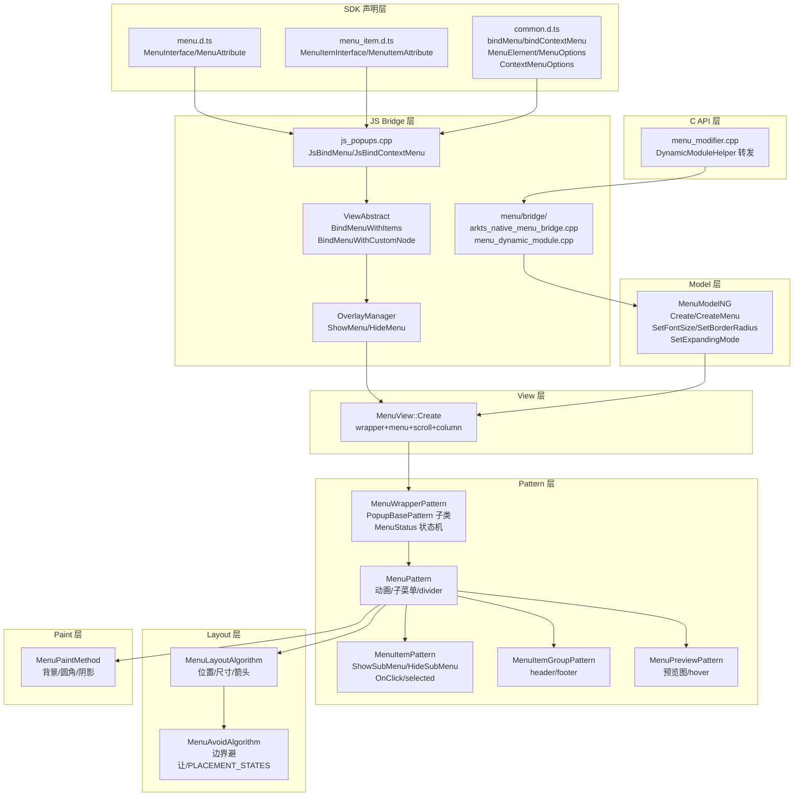
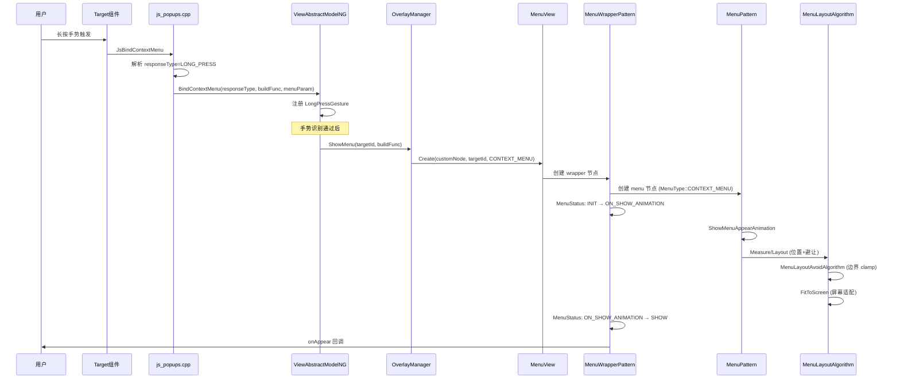
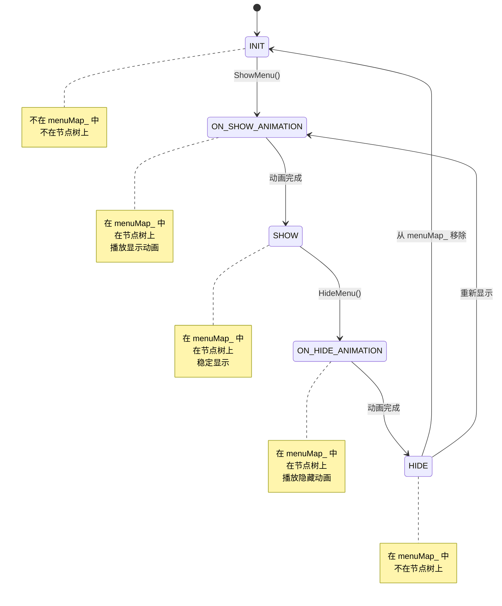
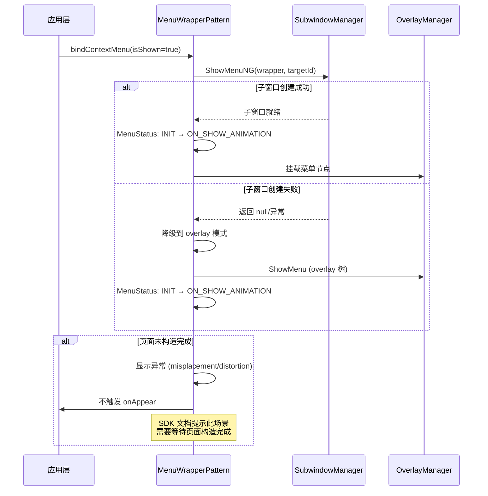

# 架构设计
> Menu 组件族的架构设计文档，覆盖 Menu、MenuItem、MenuItemGroup、MenuDivider、MenuWrapper、MenuPreview 多组件的统一入口、绑定接口、布局避让、子菜单展开、动画预览和无障碍能力。

## 设计元数据

| 字段 | 内容 |
|------|------|
| Design ID | DESIGN-Func-05-06-01 |
| 关联需求 | 已有能力补录（无独立 requirement.md） |
| 关联 Epic | 无 |
| 目标 Feature | Feat-01: Menu 组件族全量规格 (Menu/MenuItem/MenuItemGroup/bindMenu/bindContextMenu) |
| 复杂度 | 复杂 |
| 目标版本 | API 7 ~ API 26+ |
| Owner | ArkUI SIG |
| 状态 | Baselined（已有实现补录） |

## 需求基线

> 需求基线详见 proposal.md。以下仅列出设计阶段需要额外强调的要点。

| 项 | 补充说明（如需） |
|----|------------------|
| 绑定接口与内容组件分离 | bindMenu/bindContextMenu 注册在 CommonMethod 上，通过 ViewAbstractModel 分发，菜单内容走组件化 Bridge 路径 |
| 多形态子菜单展开 | SubMenuExpandingMode 三种模式（SIDE/EMBEDDED/STACK），不同模式动画和布局策略不同 |
| 全屏容器模式 | MenuWrapperPattern 继承 PopupBasePattern，作为全屏容器承载菜单节点并管理点击区域外消失 |
| 子窗口显示 | showInSubWindow 选项支持 2-in-1 设备在独立子窗口中显示菜单 |
| API 版本跨度大 | bindMenu since 7、bindContextMenu since 8、条件显示 since 11/12、bindContextMenuWithResponse since 23、数组形式扩展 since 26 |

## 上下文和现状

### 涉及仓和模块

| 仓库 | 模块路径 | 当前职责 | 本 Feature 影响 |
|------|----------|----------|-----------------|
| ace_engine | `frameworks/core/components_ng/pattern/menu/menu_pattern.cpp/.h` | MenuPattern/InnerMenuPattern，菜单显示/隐藏、动画、子菜单管理 | 核心实现，规格补录 |
| ace_engine | `frameworks/core/components_ng/pattern/menu/menu_layout_algorithm.cpp/.h` | MenuLayoutAlgorithm，菜单位置、尺寸、避让、箭头布局 | 规格补录 |
| ace_engine | `frameworks/core/components_ng/pattern/menu/menu_layout_property.h` | MenuLayoutProperty，布局属性定义、SubMenuExpandingMode 枚举 | 规格补录 |
| ace_engine | `frameworks/core/components_ng/pattern/menu/menu_model_ng.cpp/.h` | MenuModelNG，动态属性写入、节点创建 | 规格补录 |
| ace_engine | `frameworks/core/components_ng/pattern/menu/menu_view.cpp/.h` | MenuView，菜单节点创建工厂 | 规格补录 |
| ace_engine | `frameworks/core/components_ng/pattern/menu/menu_manager.cpp` | MenuManager，菜单生命周期管理 | 规格补录 |
| ace_engine | `frameworks/core/components_ng/pattern/menu/menu_item/menu_item_pattern.cpp/.h` | MenuItemPattern/CustomMenuItemPattern，菜单项交互、子菜单展开 | 规格补录 |
| ace_engine | `frameworks/core/components_ng/pattern/menu/menu_item_group/menu_item_group_pattern.cpp` | MenuItemGroupPattern，分组 header/footer 管理 | 规格补录 |
| ace_engine | `frameworks/core/components_ng/pattern/menu/wrapper/menu_wrapper_pattern.cpp/.h` | MenuWrapperPattern，继承 PopupBasePattern，全屏容器、MenuStatus 状态机 | 规格补录 |
| ace_engine | `frameworks/core/components_ng/pattern/menu/menu_avoid_algorithm.cpp` | MenuAvoidAlgorithm，菜单边界避让计算 | 规格补录 |
| ace_engine | `frameworks/core/components_ng/pattern/menu/preview/menu_preview_pattern.cpp` | MenuPreviewPattern，预览图、Hover 动画 | 规格补录 |
| ace_engine | `frameworks/core/components_ng/pattern/menu/menu_divider/menu_divider_pattern.cpp` | MenuDividerPattern，分隔线 | 规格补录 |
| ace_engine | `frameworks/core/components_ng/pattern/menu/bridge/` | 组件化 Bridge / DynamicModule（libarkui_menu.z.so 入口） | 规格补录 |
| ace_engine | `frameworks/core/interfaces/native/node/menu_modifier.cpp/.h` | C API 属性 Set/Reset/Get 委托层 | 规格补录 |
| ace_engine | `frameworks/core/interfaces/native/node/menu_item_modifier.cpp` | MenuItem C++ 属性委托层 | 规格补录 |
| ace_engine | `frameworks/core/interfaces/native/node/menu_item_group_modifier.cpp` | MenuItemGroup C++ 属性委托层 | 规格补录 |
| ace_engine | `frameworks/bridge/declarative_frontend/jsview/js_popups.cpp` | bindMenu/bindContextMenu JSView 入口 | 规格补录 |
| interface/sdk-js | `api/@internal/component/ets/menu.d.ts` | Dynamic API 声明 (MenuInterface/MenuAttribute/SubMenuExpandingMode) | 规格对照 |
| interface/sdk-js | `api/@internal/component/ets/menu_item.d.ts` | Dynamic API 声明 (MenuItemInterface/MenuItemAttribute/MenuItemOptions) | 规格对照 |
| interface/sdk-js | `api/@internal/component/ets/common.d.ts` | bindMenu/bindContextMenu/MenuElement/MenuOptions/ContextMenuOptions/MenuPreviewMode/ResponseType | 规格对照 |
| interface/sdk-js | `api/arkui/MenuModifier.d.ts` | 动态 Menu Modifier 声明 | 规格对照 |
| interface/sdk-js | `api/arkui/MenuItemModifier.d.ts` | 动态 MenuItem Modifier 声明 | 规格对照 |
| window_manager | `interfaces/innerkits/wm/window_manager.h` | 菜单子窗口创建与管理 | 外部依赖 |
| graphic_2d | `rosen/modules/render_service_client/core/ui_effect/` | RSNode/RSCanvas 绘制菜单背景、圆角、阴影 | 外部依赖 |
| accessibility | `accessibility:accessibility_common` | 菜单无障碍属性上报和操作响应 | 外部依赖 |

### 调用链层级分析

| 层 | 模块 | 职责 | 修改类型 |
|----|------|------|----------|
| SDK 声明 | `interface/sdk-js/api/@internal/component/ets/menu.d.ts`, `menu_item.d.ts`, `common.d.ts` | Dynamic API 类型声明 | 无修改（规格补录） |
| JS Bridge | `frameworks/bridge/declarative_frontend/jsview/js_popups.cpp` | bindMenu/bindContextMenu JSView 入口、参数解析 | 无修改（规格补录） |
| ViewAbstract | `frameworks/core/components_ng/base/view_abstract.cpp/.h` | BindMenuWithItems/BindMenuWithCustomNode/BindContextMenu NG 分发 | 无修改（规格补录） |
| OverlayManager | `frameworks/core/components_ng/manager/overlay/overlay_manager.cpp/.h` | ShowMenu/HideMenu，菜单节点挂载到 overlay 树 | 无修改（规格补录） |
| Bridge (统一) | `frameworks/core/components_ng/pattern/menu/bridge/menu/arkts_native_menu_bridge.cpp` | IsJsView() 区分模式，统一参数解析 | 无修改（规格补录） |
| Bridge (DynamicModule) | `frameworks/core/components_ng/pattern/menu/bridge/menu/menu_dynamic_module.cpp` | 组件化 SO 入口（libarkui_menu.z.so），DynamicModule 注册 | 无修改（规格补录） |
| Bridge (DynamicModifier) | `frameworks/core/components_ng/pattern/menu/bridge/menu/menu_dynamic_modifier.cpp` | Set/Reset/Get 属性委托层 | 无修改（规格补录） |
| Model | `frameworks/core/components_ng/pattern/menu/menu_model_ng.cpp/.h` | Create/CreateMenu、属性写入 MenuLayoutProperty | 无修改（规格补录） |
| View | `frameworks/core/components_ng/pattern/menu/menu_view.cpp/.h` | 菜单节点创建工厂，wrapper+menu+scroll+column 结构 | 无修改（规格补录） |
| Pattern (Wrapper) | `frameworks/core/components_ng/pattern/menu/wrapper/menu_wrapper_pattern.cpp/.h` | MenuWrapperPattern 全屏容器，MenuStatus 状态机，Show/Hide 调度 | 无修改（规格补录） |
| Pattern (Menu) | `frameworks/core/components_ng/pattern/menu/menu_pattern.cpp/.h` | MenuPattern 菜单主体，动画、子菜单管理、divider 构建 | 无修改（规格补录） |
| Pattern (MenuItem) | `frameworks/core/components_ng/pattern/menu/menu_item/menu_item_pattern.cpp/.h` | MenuItemPattern 交互、selected 状态、ShowSubMenu/HideSubMenu | 无修改（规格补录） |
| Pattern (Group) | `frameworks/core/components_ng/pattern/menu/menu_item_group/menu_item_group_pattern.cpp` | MenuItemGroupPattern 分组管理 | 无修改（规格补录） |
| Pattern (Preview) | `frameworks/core/components_ng/pattern/menu/preview/menu_preview_pattern.cpp` | MenuPreviewPattern 预览图、Hover 缩放动画 | 无修改（规格补录） |
| Layout | `frameworks/core/components_ng/pattern/menu/menu_layout_algorithm.cpp/.h` | 位置计算、避让、箭头、FitToScreen、MenuLayoutAvoidAlgorithm | 无修改（规格补录） |
| Layout (Avoid) | `frameworks/core/components_ng/pattern/menu/menu_avoid_algorithm.cpp` | 边界避让算法、PLACEMENT_STATES 重定位策略 | 无修改（规格补录） |
| Paint | `frameworks/core/components_ng/pattern/menu/menu_paint_method.cpp`, `menu_paint_property.h` | 菜单背景、圆角、阴影绘制 | 无修改（规格补录） |
| Manager | `frameworks/core/components_ng/pattern/menu/menu_manager.cpp` | MenuManager 全局生命周期管理 | 无修改（规格补录） |
| C-API | `frameworks/core/interfaces/native/node/menu_modifier.cpp/.h` | C API 通过 DynamicModuleHelper 转发到动态模块 | 无修改（规格补录） |
| C-API (MenuItem) | `frameworks/core/interfaces/native/node/menu_item_modifier.cpp` | MenuItem C API 属性委托层 | 无修改（规格补录） |

> 检查项：
> - [x] 调用链每一层都已覆盖（从最上层到最底层）
> - [x] 每层职责边界清晰，无跨层违规调用
> - [x] 每层修改类型明确

### 适用架构规则

| Rule ID | 适用原因 | 设计结论 | 验证方式 |
|---------|----------|----------|----------|
| OH-ARCH-LAYERING | Menu 涉及 SDK → JS Bridge → ViewAbstract → OverlayManager → Bridge → Model → View → Pattern → Layout → Paint 多层调用 | 调用方向自上而下，Pattern 不直接访问 Bridge 层；MenuWrapperPattern 作为全屏容器层，管理菜单生命周期 | 代码评审 |
| OH-ARCH-API-LEVEL | Menu 有 @since 7/8/9/10/11/12/18/19/20/23/26 等多版本 API | 各版本 API 通过 Container::LessThanAPIVersion/ GreatOrEqualAPIVersion 条件分支实现兼容 | API 评审 / XTS |
| OH-ARCH-COMPONENT-BUILD | Menu 已组件化为独立 SO（libarkui_menu.z.so） | DynamicModule 注册机制，通过 GetDynamicModule("Menu") 加载，node_modifier 委托层转发 | 构建验证 |
| OH-ARCH-SUBSYSTEM | Menu 依赖 window_manager（子窗口）、graphic_2d（渲染）、accessibility（无障碍） | 通过 SubwindowManager 隔离子窗口依赖，通过 RSNode 隔离渲染依赖，无跨子系统直接调用 | 依赖检查 |
| OH-ARCH-IPC-SAF | showInSubWindow 涉及子窗口创建（跨窗口 IPC） | SubwindowManager 管理子窗口生命周期，菜单内容通过 Subwindow::ShowMenuNG 显示 | 集成测试 |
| OH-ARCH-ERROR-LOG | Menu 使用 DumpLog 进行状态导出 | 关键路径有 LOGD/LOGI 日志，MenuWrapperPattern 支持 Dump 信息输出 | 单测/hilog |

## 不涉及项承接

> proposal.md 已完成 N/A 判定。本节仅对 proposal 中标记为"涉及"且需展开设计的维度给出结论。

| 维度 | 设计结论 |
|------|----------|
| 无障碍 | Menu/MenuItem/MenuItemGroup 各自实现 AccessibilityProperty，支持 ActionSelect/ActionClick，通过 ExtraElementInfo 上报菜单项信息 |
| 深色模式 | 颜色属性使用 ResourceColor 类型，通过 MenuThemeWrapper / SelectTheme 适配 Token 主题切换 |
| 多设备适配 | 2-in-1 设备默认 showInSubWindow=true，圆角 8vp；其他设备默认 false，圆角 20vp；折叠屏有半折叠 Hover 动画 |
| 版本升级兼容 | API 9 引入 Menu/MenuItem 组件；API 11 条件显示 bindMenu；API 12 条件显示 bindContextMenu + SubMenuExpandingMode；API 23 bindContextMenuWithResponse；API 26 数组形式扩展；需在 spec 兼容性声明中明确 |

## 关键设计决策

| 决策 ID | 问题 | 推荐方案 | 探索过的替代方案 | 取舍理由 | 影响 |
|---------|------|----------|-----------------|----------|------|
| ADR-1 | bindMenu/bindContextMenu 如何与 Menu 组件解耦 | 绑定方法注册在 CommonMethod 上，通过 ViewAbstractModel 分发；菜单内容构建走组件化 Bridge 路径 | 将绑定方法放在 Menu 组件上 | 绑定方法可附加到任意组件，灵活性高；菜单内容组件化后独立维护 | AC-1.1 ~ AC-1.6 |
| ADR-2 | 菜单全屏容器如何管理点击区域外消失 | 使用 MenuWrapperPattern（继承 PopupBasePattern）作为全屏容器，通过 MenuStatus 状态机管理显示/隐藏生命周期 | 直接在 MenuPattern 中管理 | 全屏容器与菜单内容分离，职责清晰；PopupBasePattern 复用弹窗通用能力 | AC-2.1 ~ AC-2.4 |
| ADR-3 | 菜单位置如何计算和避让 | MenuLayoutAlgorithm 中通过 PLACEMENT_STATES 重定位策略表 + MenuLayoutAvoidAlgorithm 边界 clamp + FitToScreen 屏幕适配三层算法 | 单一位置算法 | 分层算法可按场景组合（select menu vs context menu vs 普通 menu）；PLACEMENT_STATES 提供标准重定位顺序 | AC-3.1 ~ AC-3.5 |
| ADR-4 | 子菜单展开模式如何设计 | 定义 SubMenuExpandingMode 枚举（SIDE/EMBEDDED/STACK），三种模式各自独立的动画和布局策略 | 单一展开模式 | 不同场景需要不同视觉表现：SIDE 平面展开适合宽屏，EMBEDDED 内嵌展开适合紧凑布局，STACK 堆叠展开适合移动端 | AC-5.1 ~ AC-5.6 |
| ADR-5 | 菜单动画如何分级 | MenuPattern 管理 show/hide appear/disappear 动画；子菜单使用 InterpolatingSpring 弹簧曲线；预览图使用 hover 缩放动画 | 统一单一动画策略 | 主菜单和子菜单有不同的动画语义；弹簧曲线提供自然物理感 | AC-6.1 ~ AC-6.4 |
| ADR-6 | 菜单 C API 如何实现 | 使用 modifier-based C API（不走 FrameNode 节点类型枚举），通过 DynamicModuleHelper 转发到 libarkui_menu.z.so | 使用 NODE 枚举类型 | Menu 已组件化，modifier-based 方式与组件化架构一致；避免在全局 NODE 枚举中注册 | AC-9.1 ~ AC-9.3 |
| ADR-7 | API 26 扩展数组形式 bindContextMenu 如何兼容 | 新增 bindContextMenuByResponseType/bindContextMenuByIsShow/bindContextMenuWithResponse(数组重载)，不修改原有签名 | 修改原有 bindContextMenu 签名 | 方法重载保持向前兼容；新方法明确区分 CustomBuilder 和 Array\<MenuElement\> 内容形式 | AC-1.5, AC-1.6 |
| ADR-8 | showInSubWindow 默认值如何分设备处理 | 2-in-1 设备默认 true（子窗口显示），其他设备默认 false（overlay 模式） | 统一默认值 | 2-in-1 设备有多窗口需求，子窗口显示菜单不被主窗口遮挡；移动端 overlay 模式性能更好 | AC-4.3 |
| ADR-9 | 预览图（preview）与箭头（enableArrow）互斥关系 | preview 设置为 IMAGE 或 CustomBuilder 时不显示箭头；preview 为 NONE 时 enableArrow 生效 | 允许同时显示 | 预览图占据菜单位置，箭头无空间显示；互斥逻辑简化布局计算 | AC-7.3 |

## 设计骨架

### 骨架范围

| 骨架项 | 目标 | 不包含 | 验证方式 |
|--------|------|--------|----------|
| 绑定接口 | bindMenu/bindContextMenu 全形态注册和分发 | 通用属性（由 CommonMethod 继承） | UT |
| 菜单创建 | MenuView 工厂创建 wrapper+menu+scroll+column 节点结构 | 独立组件标签行为 | UT |
| 菜单布局 | 位置计算、避让、箭头、FitToScreen 三层算法 | 自定义布局算法 | UT |
| 子菜单展开 | SIDE/EMBEDDED/STACK 三模式动画和布局 | 自定义展开模式 | UT + 手工 |
| 菜单动画 | show/hide appear/disappear + 预览图 hover | 自定义动画曲线 | 手工 |
| 预览图 | MenuPreviewPattern 截图/自定义预览 + hover 缩放 | 预览图编辑能力 | UT |
| C API 映射 | modifier-based C API Set/Reset/Get 委托 | NODE 枚举类型 | C API UT |
| 无障碍 | Menu/MenuItem/MenuItemGroup AccessibilityProperty | 无障碍自动化测试框架 | UT |

### 骨架 Spec 拆分

| Task ID | 目标 | 受影响文件 | AC |
|---------|------|-----------|-----|
| TASK-SKELETON-1 | Menu 组件族全量规格补录（绑定接口、创建、布局避让、子菜单、动画、预览、C API、无障碍） | Feat-01-menu-full-spec.md | AC-1.1 ~ AC-9.4 |

## 后续 Task 拆分

| Task ID | 目标 | 受影响文件 | 依赖 |
|---------|------|-----------|------|
| TASK-MENU-01 | Menu 组件族全量规格补录 | Feat-01-menu-full-spec.md, design.md | 无 |

## API 签名、Kit 与权限

> 本节承接 spec.md"API 变更分析"中识别的 API，给出签名、权限和 d.ts 位置等实现细节。

### 新增 API

| API 签名 | 类型 | Kit | d.ts 位置 | 权限要求 | SysCap |
|----------|------|-----|-----------|----------|--------|
| `bindMenu(content: Array<MenuElement> \| CustomBuilder, options?: MenuOptions): T` | Public | ArkUI | `common.d.ts:24214` | 无 | SystemCapability.ArkUI.ArkUI.Full |
| `bindMenu(isShow: boolean, content: Array<MenuElement> \| CustomBuilder, options?: MenuOptions): T` | Public | ArkUI | `common.d.ts:24229` | 无 | SystemCapability.ArkUI.ArkUI.Full |
| `bindContextMenu(content: CustomBuilder, responseType: ResponseType, options?: ContextMenuOptions): T` | Public | ArkUI | `common.d.ts:24245` | 无 | SystemCapability.ArkUI.ArkUI.Full |
| `bindContextMenu(isShown: boolean, content: CustomBuilder, options?: ContextMenuOptions): T` | Public | ArkUI | `common.d.ts:24318` | 无 | SystemCapability.ArkUI.ArkUI.Full |
| `bindContextMenuByResponseType(content: CustomBuilder \| Array<MenuElement>, responseType: ResponseType, options?: ContextMenuOptions): T` | Public | ArkUI | `common.d.ts:24262` | 无 | SystemCapability.ArkUI.ArkUI.Full |
| `bindContextMenuWithResponse(content: CustomBuilderT<ResponseType> \| undefined, options?: ContextMenuOptions): T` | Public | ArkUI | `common.d.ts:24279` | 无 | SystemCapability.ArkUI.ArkUI.Full |
| `bindContextMenuWithResponse(content: CustomBuilderT<ResponseType> \| Array<MenuElement> \| undefined, options?: ContextMenuOptions): T` | Public | ArkUI | `common.d.ts:24295` | 无 | SystemCapability.ArkUI.ArkUI.Full |
| `bindContextMenuByIsShow(isShow: boolean, content: CustomBuilder \| Array<MenuElement>, options?: ContextMenuOptions): T` | Public | ArkUI | `common.d.ts:24340` | 无 | SystemCapability.ArkUI.ArkUI.Full |
| `Menu(): MenuAttribute` | Public | ArkUI | `menu.d.ts:70` | 无 | SystemCapability.ArkUI.ArkUI.Full |
| `MenuItem(value?: MenuItemOptions \| CustomBuilder): MenuItemAttribute` | Public | ArkUI | `menu_item.d.ts:140` | 无 | SystemCapability.ArkUI.ArkUI.Full |

### 变更/废弃 API

| 原有 API | 变更类型 | 新 API | 迁移说明 |
|----------|----------|--------|----------|
| `MenuAttribute.fontSize(value: Length)` | 废弃 | `MenuAttribute.font(value: Font)` | @deprecated since 10，@useinstead font |
| `bindContextMenu(content: CustomBuilder, responseType, options?)` | 变更 | `bindContextMenuByResponseType(content: CustomBuilder \| Array<MenuElement>, responseType, options?)` | API 26 新增数组形式重载，原签名保持兼容 |

## 构建系统影响

### BUILD.gn 变更

```
文件路径: frameworks/core/components_ng/pattern/menu/BUILD.gn
变更说明: 已组件化为独立 SO libarkui_menu.z.so，BUILD.gn 定义 ohos_shared_library("arkui_menu")，包含 menu/、menu_item/、menu_item_group/、wrapper/、preview/、menu_divider/、bridge/ 子目录源文件
```

### bundle.json 变更

```
新增 component: ace_engine 中已包含 arkui_menu 部件依赖
修改依赖关系: arkui_menu 依赖 window_manager（子窗口）、graphic_2d（渲染）、accessibility（无障碍）
```

## 可选设计扩展

### 架构图

> Menu 组件族跨 SDK/Bridge/Model/Pattern/Layout/Paint 多层调用，必填。



### 数据流/控制流

> 涉及 bindMenu 点击触发到菜单显示的完整主流程，必填。

| 步骤 | 调用方 | 被调用方 | 数据/接口 | 说明 |
|------|--------|----------|-----------|------|
| 1 | 用户点击 | 绑定组件 | TapGesture | bindMenu 基础形式注册点击手势 |
| 2 | TapGesture | `js_popups.cpp` JsBindMenu | MenuParam | 解析 isShow/onStateChange |
| 3 | JsBindMenu | ViewAbstractModel::BindMenu | optionsParam, menuParam | 参数数组或 CustomBuilder 分支 |
| 4 | ViewAbstractModelNG | ViewAbstract::BindMenuWithItems | items, menuParam | NG 路径分发 |
| 5 | BindMenuWithItems | MenuView::Create | OptionParam[] | 创建 wrapper+menu 节点结构 |
| 6 | MenuView::Create | FrameNode::CreateFrameNode | MENU_WRAPPER_ETS_TAG | wrapper 节点 |
| 7 | MenuView::Create | FrameNode::CreateFrameNode | MENU_ETS_TAG | menu 节点，设置 MenuPattern |
| 8 | OverlayManager | OverlayManager::ShowMenu | wrapper, targetId | 挂载到 overlay 树 |
| 9 | MenuWrapperPattern | MenuStatus: INIT → ON_SHOW_ANIMATION | — | 状态机转换 |
| 10 | MenuPattern | ShowMenuAppearAnimation | — | 显示动画 |
| 11 | MenuWrapperPattern | MenuStatus: ON_SHOW_ANIMATION → SHOW | — | 动画完成 |
| 12 | MenuLayoutAlgorithm | Measure/Layout | — | 位置计算、避让 |
| 13 | onAppear 回调 | 应用层 | — | 菜单显示完成回调 |

### 时序设计

> bindContextMenu 长按预览菜单显示涉及手势识别 → 预览图截图 → 菜单创建的异步调用链，必填。



### 算法与状态机

> MenuWrapperPattern 使用 MenuStatus 状态机管理菜单显示/隐藏生命周期，必填。



> MenuStatus 定义见 `frameworks/core/components_ng/pattern/menu/wrapper/menu_wrapper_pattern.h:35-41`。状态转换由 MenuWrapperPattern::HideMenu (`menu_wrapper_pattern.cpp:394`) 和 OverlayManager::ShowMenu 驱动。

### 测试性设计

> Menu 涉及 C API Mock 和布局算法验证，必填。

| 测试层级 | 测试目标 | Mock 策略 | 验证方式 |
|----------|----------|-----------|----------|
| 单元测试 (UT) | MenuPattern 状态管理 | Mock PipelineContext 和 OverlayManager | `test/unittest/core/pattern/menu/` 下用例验证 show/hide/子菜单管理 |
| 单元测试 (UT) | MenuLayoutAlgorithm 位置计算 | Mock targetSize/wrapperRect | 验证 FitToScreen/MenuLayoutAvoidAlgorithm 输出 |
| 单元测试 (UT) | MenuItemPattern 交互 | Mock EventHub/FocusHub | 验证 OnClick/ShowSubMenu/HideSubMenu 流程 |
| C API 测试 | Menu Modifier Set/Reset/Get | ACE_UNITTEST 直接获取 DynamicModifier | `test/unittest/capi/modifiers/menu_modifier_test.cpp` |
| C API 测试 | MenuItem Modifier | ACE_UNITTEST | `test/unittest/capi/modifiers/menu_item_modifier_test.cpp` |
| C API 测试 | MenuItemGroup Modifier | ACE_UNITTEST | `test/unittest/capi/modifiers/menu_item_group_modifier_test.cpp` |

### 异常传播时序图

> bindContextMenu 涉及跨窗口 IPC（showInSubWindow）和异常恢复，必填。



| 异常场景 | 触发条件 | 恢复策略 | 关联 AC |
|----------|----------|----------|---------|
| 子窗口创建失败 | showInSubWindow=true 且窗口管理器返回 null | 降级到 overlay 模式显示菜单 | AC-4.3 |
| 页面未构造完成时显示 | isShown=true 在页面构造前设置 | 菜单可能显示异常（位置错误/不显示），SDK 文档已提示 | AC-2.2 |
| 菜单内容为空 | CustomBuilder 或 Array\<MenuElement\> 为空 | 菜单不显示或显示空菜单 | AC-1.3 |
| 避让后菜单超出屏幕 | 菜单尺寸大于可用空间 | FitToScreen 将菜单限制在屏幕范围内 | AC-3.4 |

### 资源所有权矩阵

> Menu 涉及动态节点创建（wrapper/menu/scroll/column）和跨模块传递，必填。

| 资源 | 创建方 | 持有方 | 销毁触发 | 实际释放 | 异常回收 |
|------|--------|--------|----------|----------|----------|
| MenuWrapper 节点 | MenuView::Create (`menu_view.cpp:186`) | OverlayManager (menuMap_) | HideMenu + 动画完成 | 从 menuMap_ 移除 + 节点 Detach | OnDetachFromFrameNode 清理 |
| Menu 节点 | MenuView::Create (`menu_view.cpp:191`) | MenuWrapper 子节点 | wrapper 销毁时 | 跟随 wrapper 销毁 | — |
| SubMenu 节点 | MenuItemPattern::ShowSubMenu (`menu_item_pattern.cpp:706`) | MenuWrapper 子节点 | HideSubMenu / 菜单消失 | 从 wrapper 移除 | DoCloseSubMenus 清理 (`menu_pattern.cpp:1110`) |
| Preview 节点 | MenuView::Create (`menu_view.cpp:1499`) | MenuWrapper 子节点 | 菜单消失 | 跟随 wrapper 销毁 | — |
| 子窗口 | SubwindowManager | SubwindowManager | HideMenuNG | SubwindowManager::HideMenuNG | — |

### 接口参数规约

> Menu 涉及大量 Public API 变更，必填。

| 接口 | 参数 | 类型 | 合法范围 | 非法处理 | 边界说明 |
|------|------|------|----------|----------|----------|
| bindMenu | content | Array\<MenuElement\> \| CustomBuilder | 非空数组或有效 builder | 空数组/无效 builder 不显示菜单 | — |
| bindMenu | isShow | boolean | true/false | — | false 时隐藏菜单 |
| bindContextMenu | responseType | ResponseType | LONG_PRESS / RIGHT_CLICK | — | 鼠标设备不支持 LONG_PRESS |
| ContextMenuOptions | offset | Position | {x,y} 非负 | 超出屏幕自动 clamp | 默认 {0,0} |
| ContextMenuOptions | placement | Placement | 枚举值 | undefined/null/空 使用默认值 | bindMenu 默认 BottomLeft，bindContextMenu(8+) 默认点击位置 |
| ContextMenuOptions | enableArrow | boolean | true/false | undefined 不显示箭头 | preview 非 NONE 时箭头不生效 |
| ContextMenuOptions | arrowOffset | Length | >0 vp | ≤0 或超出安全距离不生效 | 默认 0vp |
| ContextMenuOptions | preview | MenuPreviewMode \| CustomBuilder | NONE/IMAGE/CustomBuilder | — | IMAGE 或 CustomBuilder 时不显示箭头 |
| MenuOptions | title | ResourceStr | 有效资源 | — | 仅 Array\<MenuElement\> 时有效 |
| MenuOptions | showInSubWindow | boolean | true/false | — | 2-in-1 默认 true，其他默认 false |
| MenuAttribute | radius | Dimension \| BorderRadiuses | 有效值 | Dimension 非法回退默认圆角；BorderRadiuses 非法无圆角 | 2-in-1 默认 8vp，其他 20vp |
| MenuAttribute | subMenuExpandingMode | SubMenuExpandingMode | SIDE_EXPAND/EMBEDDED_EXPAND/STACK_EXPAND | — | 默认 SIDE_EXPAND |
| MenuItemAttribute | selected | boolean | true/false | — | 默认 false，支持 $$ 和 !! 双向绑定 |
| MenuItemAttribute | selectIcon | boolean \| ResourceStr \| SymbolGlyphModifier | — | — | 默认 false |
| MenuItemOptions | startIcon | ResourceStr | 有效资源 | symbolStartIcon 设置时不显示 startIcon | — |
| MenuItemOptions | builder | CustomBuilder | 有效 builder | — | 用于二级菜单 |

### 线程与并发模型

> Menu 涉及子窗口跨窗口操作和动画回调，必填。

| 操作 | 发起线程 | 回调线程 | 跨进程边界 | 线程安全 | 重入约束 |
|------|----------|----------|------------|----------|----------|
| bindMenu 点击触发 | UI 主线程 | UI 主线程 | 无（overlay 模式） | 是 | — |
| bindContextMenu 长按触发 | UI 主线程 | UI 主线程 | 无（overlay 模式） | 是 | — |
| showInSubWindow 子窗口显示 | UI 主线程 | UI 主线程 | 是（子窗口 IPC） | SubwindowManager 管理同步 | 不可在子窗口未就绪时调用 |
| MenuStatus 状态转换 | UI 主线程 | UI 主线程 | 无 | 是 | 不可重入 HideMenu |
| 动画回调 (onAppear/onDisappear) | UI 主线程 | UI 主线程 | 无 | 是 | — |
| MenuWrapperPattern 多线程 | 多线程 | — | — | menu_wrapper_pattern_multi_thread.cpp 支持 | — |

| 并发场景 | 处理方式 |
|----------|----------|
| 同一目标组件多次 bindMenu | OverlayManager menuMap_ 按 targetId 管理，后一次覆盖前一次 |
| 多个菜单同时显示 | 每个菜单独立 wrapper 节点，menuMap_ 管理生命周期 |
| 子菜单展开时主菜单消失 | DoCloseSubMenus 递归关闭所有子菜单 (`menu_pattern.cpp:1110`) |

## 详细设计

### bindMenu/bindContextMenu 绑定与分发

bindMenu 和 bindContextMenu 注册在 `JSViewAbstract` 上，实现在 `frameworks/bridge/declarative_frontend/jsview/js_popups.cpp` 中。

**bindMenu 调用链** (`js_popups.cpp` → `ViewAbstractModel`):

1. `JsBindMenu` 解析 `isShow` / `onStateChange` → 构建 `MenuParam`
2. 参数数组分支：`ParseBindOptionParam()` 解析 `Array<MenuElement>` → `ViewAbstractModel::BindMenu(optionsParam, nullptr, menuParam)`
3. CustomBuilder 分支：解析 builder 函数 → `ViewAbstractModel::BindMenu({}, buildFunc, menuParam)`
4. NG 路径：`ViewAbstractModelNG::BindMenu()` → `ViewAbstract::BindMenuWithItems()` 或 `ViewAbstract::BindMenuWithCustomNode()` → `OverlayManager::ShowMenu()`

**bindContextMenu 调用链** (`js_popups.cpp` → `ViewAbstractModel`):

1. `JsBindContextMenu` / `JsBindContextMenuByIsShow` / `JsBindContextMenuByResponseType` 解析参数 → `MenuParam`（`type = CONTEXT_MENU`、`previewMode = NONE`）
2. preview content 分支：`ParseBindContentOptionParam()` 解析预览内容 → `previewBuildFunc`
3. NG 路径：`ViewAbstractModelNG::BindContextMenu()` → 根据 `ResponseType` 注册右键鼠标事件或长按手势 → `ViewAbstract::BindMenuWithCustomNode()` → `OverlayManager::ShowMenu()`
4. 拖拽菜单：`ViewAbstractModel::BindDragWithContextMenuParams(menuParam)` 绑定拖拽参数

### Menu/MenuItem 节点创建

MenuView 是菜单节点创建工厂（`frameworks/core/components_ng/pattern/menu/menu_view.cpp`）:

```
CreateMenu(targetId, targetTag, type) →
  wrapperNode = FrameNode::CreateFrameNode(MENU_WRAPPER_ETS_TAG, ..., MenuWrapperPattern)  // menu_view.cpp:186
  menuNode = FrameNode::CreateFrameNode(MENU_ETS_TAG, ..., MenuPattern(targetId, targetTag, type))  // menu_view.cpp:191
  wrapperNode → menuNode (parent-child)
```

MenuView::Create 有多个重载（`menu_view.cpp:1559, 1630, 1822, 2052`），分别处理：
- 选项数组形式（OptionParam[]）→ 创建 MenuItem 子节点
- CustomBuilder 形式 → 挂载自定义节点
- 预览图形式 → 创建 MENU_PREVIEW_ETS_TAG 节点

MenuModelNG::Create (`menu_model_ng.cpp:257`) 创建独立 Menu 组件（MULTI_MENU 类型），API < 11 时设置最小宽度。

### 菜单布局与避让算法

MenuLayoutAlgorithm（`frameworks/core/components_ng/pattern/menu/menu_layout_algorithm.cpp`）核心算法：

1. **Initialize** (`menu_layout_algorithm.cpp:398`): 读取 MenuLayoutProperty，初始化 wrapperRect、padding、targetSize、targetOffset
2. **位置计算**: 根据 placement 从 `placementFuncMap_` 获取位置计算函数（`menu_layout_algorithm.cpp:334-345`）
3. **MenuLayoutAvoidAlgorithm** (`menu_layout_algorithm.cpp:2485`): 边界 clamp，`x = std::clamp(x, paddingStart, wrapperRect.Right() - size.Width() - paddingEnd)`，`y = std::clamp(y, yMinAvoid, yMaxAvoid)`
4. **FitToScreen** (`menu_layout_algorithm.cpp:3107`): 屏幕适配，当菜单超出屏幕时调整位置
5. **PLACEMENT_STATES** (`menu_avoid_algorithm.cpp:33`): 重定位策略表，定义每种 Placement 的备选位置顺序

避让算法流程：
```
位置 = GetChildPosition(size, didNeedArrow)  // 根据 placement 计算
位置 = MenuLayoutAvoidAlgorithm(menuProp, menuPattern, size, didNeedArrow)  // 边界 clamp
位置 = FitToScreen(位置, childSize, didNeedArrow)  // 屏幕适配
```

### 子菜单展开模式

SubMenuExpandingMode 枚举（`menu_layout_property.h:30`）:
- `SIDE`: 侧面展开，子菜单在主菜单侧边显示
- `EMBEDDED`: 内嵌展开，子菜单嵌入主菜单内部
- `STACK`: 堆叠展开，子菜单堆叠在主菜单上方

MenuItemPattern::ShowSubMenu (`menu_item_pattern.cpp:706`):
1. 根据 expandingMode_ 选择展开方式
2. `ShowSubMenuHelper(subMenu)` 创建子菜单节点 (`menu_item_pattern.cpp:914`)
3. `ShowSubMenuWithAnimation(subMenu)` 播放展开动画 (`menu_item_pattern.cpp:774`)
4. STACK 模式：主菜单透明度降为 0.4（`MENU_ORIGINAL_SCALE = 0.6f`, `MAIN_MENU_OPACITY = 0.4f`，`menu_pattern.cpp:65-66`）

子菜单动画曲线：
- 主菜单：`InterpolatingSpring(0, 1, 528, 35)` (`menu_pattern.cpp:74-75`)
- STACK 子菜单：`InterpolatingSpring(0, 1, 228, 26)` (`menu_pattern.cpp:76-77`)

### 菜单显示/隐藏动画

MenuPattern::ShowMenuAppearAnimation (`menu_pattern.h:926`):
- 使用 InterpolatingSpring 弹簧曲线
- 主菜单缩放从 `MENU_ORIGINAL_SCALE = 0.6f` 到 1.0
- STACK 模式：主菜单消失延迟 150ms，子菜单出现延迟 50ms

MenuWrapperPattern::HideMenu (`menu_wrapper_pattern.cpp:394`):
1. 获取 menu 子节点
2. 调用 `HideMenu(menuNode, reason)` (`menu_wrapper_pattern.cpp:129`)
3. MenuStatus: SHOW → ON_HIDE_ANIMATION → HIDE

### 预览图（Preview）

MenuPreviewPattern（`frameworks/core/components_ng/pattern/menu/preview/menu_preview_pattern.cpp`）:
- 支持 MenuPreviewMode.NONE（无预览）、IMAGE（截图预览）、CustomBuilder（自定义预览）
- Hover 动画：`previewAnimationOptions.scale` 默认 `[0.95, 1.1]`（`common.d.ts:17224`）
- 预览图圆角：`previewBorderRadius` 默认 16vp（`common.d.ts:17095`）
- 预览图与箭头互斥：preview 非 NONE 时不显示箭头

### C API 实现

Menu C API 使用 modifier-based 架构（`frameworks/core/interfaces/native/node/menu_modifier.cpp`）:

1. `GetMenuModifier()` (`menu_modifier.cpp:25`): 通过 `DynamicModuleHelper::GetDynamicModule("Menu")` 加载 libarkui_menu.z.so
2. 从动态模块获取 `ArkUIMenuModifier` 函数表
3. 所有 C API 属性操作通过 modifier 函数表转发到动态模块
4. `GetMenuInnerModifier()` (`menu_modifier.cpp:58`): 获取内部 modifier（用于跨模块访问）
5. `GetCJUIMenuModifier()` (`menu_modifier.cpp:43`): 获取 CJ（Cangjie）modifier

无独立 NODE 枚举类型，Menu 通过 modifier-based C API 暴露属性操作。

## 风险和开放问题

| 项 | 类型 | 影响 | 处理方式 | Owner |
|----|------|------|----------|-------|
| API 版本跨度大（7~26）导致兼容分支多 | API | 高 | 通过 Container::LessThanAPIVersion 条件分支管理，spec 兼容性声明明确各版本行为差异 | ArkUI SIG |
| 子窗口模式跨设备行为差异 | 架构 | 中 | showInSubWindow 按设备类型设置默认值，SubwindowManager 隔离平台差异 | ArkUI SIG |
| PLACEMENT_STATES 策略表维护成本 | 架构 | 中 | 策略表集中管理在 menu_avoid_algorithm.cpp，新增 Placement 时需同步更新 | ArkUI SIG |
| 组件化 SO 加载失败 | 构建 | 高 | DynamicModuleHelper::GetDynamicModule 返回 null 时 LOGF + abort | ArkUI SIG |
| MenuWrapperPattern 多线程安全 | 架构 | 中 | menu_wrapper_pattern_multi_thread.cpp 提供多线程支持 | ArkUI SIG |

## 设计审批

- [x] 需求基线已确认，设计覆盖 P0/P1 AC
- [x] 不涉及项已承接，N/A 和展开项都有结论
- [x] 涉及仓和模块职责清楚
- [x] 调用链层级分析完整，每层覆盖到位
- [x] 适用架构规则已识别并形成设计结论
- [x] 分层和子系统边界合规
- [x] API 变更有签名、权限、错误码和兼容性说明
- [x] BUILD.gn/bundle.json 影响明确
- [x] 设计输出和后续 Task 拆分明确
- [x] 关键设计决策有理由和影响说明
- [x] 风险和开放问题有 Owner

**结论:** 通过（已有实现补录）
