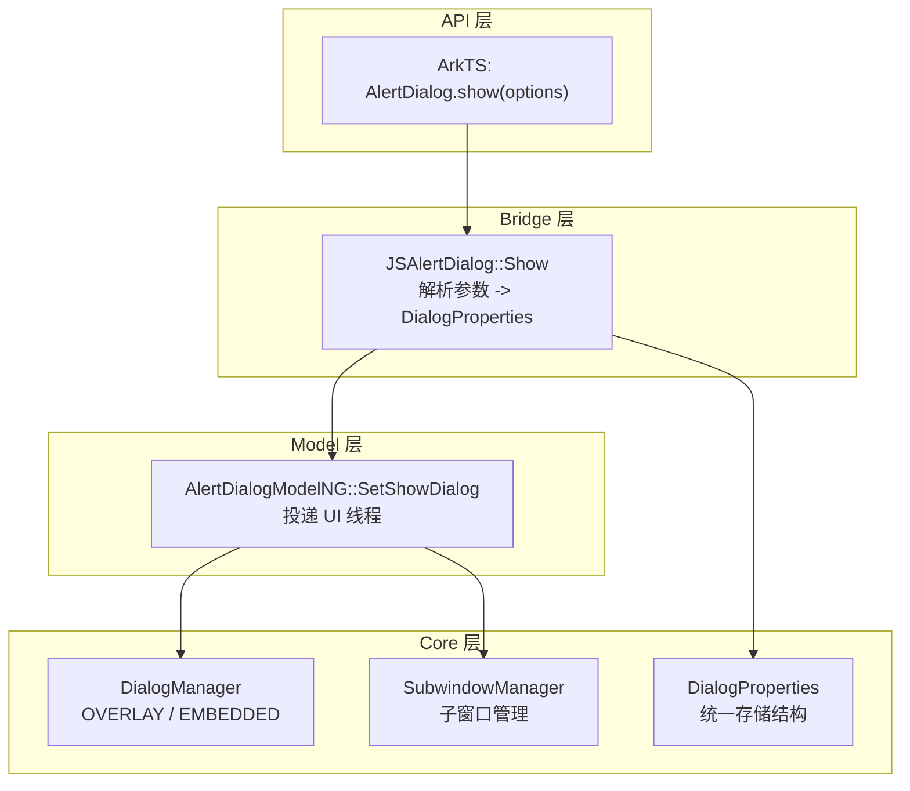

# 架构设计

> AlertDialog 是 ArkUI 弹窗类组件中的警告弹窗，通过命令式 API `AlertDialog.show()` 展示标题、消息和按钮，支持三种按钮配置模式。

## 设计元数据

| 字段 | 内容 |
|------|------|
| Design ID | DESIGN-Func-05-06-02 |
| 关联需求 | 已有能力补录（无独立 requirement.md） |
| 关联 Epic | 无 |
| 目标 Feature | Feat-01 AlertDialog 警告弹窗 |
| 复杂度 | 中等 |
| 目标版本 | API 7 起支持，API 10 subtitle/buttonDirection/maskRect，API 11 isModal/backgroundBlurStyle，API 12 textStyle，API 14 enableHoverMode，API 15 immersiveMode/levelMode，API 18 levelOrder + 废弃，API 19 生命周期回调，API 26 systemMaterial/distortionMode/edgeLightMode |
| Owner | ArkUI SIG |
| 状态 | Baselined（已有实现补录） |

## 需求基线

| 字段 | 内容 |
|------|------|
| 问题陈述 | 应用需要一种标准警告弹窗，通过命令式 API 展示标题/消息和 1~N 个按钮，支持对齐、遮罩、子窗口、层级模式等配置 |
| 核心目标 | （Feat-01）提供 AlertDialog.show() 命令式 API，支持 confirm/primary+secondary/buttons 三种按钮模式、对齐与 RTL、遮罩与模态、子窗口、层级模式、生命周期回调和废弃迁移 |
| P0 AC | AC-1.1~1.3（confirm）、AC-2.1~2.3（primary+secondary）、AC-3.1~3.3（buttons+direction）、AC-4.1~4.2（alignment+RTL）、AC-5.1~5.2（mask+modal）、AC-6.1（subwindow）、AC-7.1~7.2（levelMode）、AC-8.1~8.3（生命周期）、AC-9.1~9.2（废弃迁移+按钮样式） |

## 上下文和现状

### 涉及仓和模块

| 仓库 | 模块路径 | 当前职责 | 本 Feature 影响 |
|------|----------|----------|-----------------|
| ace_engine | `frameworks/bridge/declarative_frontend/jsview/dialog/js_alert_dialog.cpp/.h` | JS 桥接层，解析 AlertDialog 参数 | 全量涉及 |
| ace_engine | `frameworks/core/components_ng/pattern/dialog/alert_dialog_model_ng.cpp` | NG Model 层，ShowDialog 实现 | 全量涉及 |
| ace_engine | `frameworks/core/components/dialog/dialog_properties.h` | DialogProperties 结构体定义 | 全量涉及 |
| ace_engine | `frameworks/bridge/declarative_frontend/jsview/dialog/alert_dialog_model.h` | Model 抽象层 | 全量涉及 |
| ace_engine | `frameworks/core/components_ng/pattern/dialog/alert_dialog_accessor.cpp` | C-API accessor | 全量涉及 |

### 调用链层级分析

| 层 | 模块 | 职责 | 修改类型 |
|----|------|------|----------|
| JS Bridge | `frameworks/bridge/declarative_frontend/jsview/dialog/js_alert_dialog.cpp/.h` | JS→C++ 桥接，解析 title/subtitle/message/buttons/shadow/border/radius/alignment/offset/textStyle/maskRect/levelMode/levelOrder/systemMaterial/distortionMode/edgeLightMode | 无修改（规格补录） |
| Model | `frameworks/core/components_ng/pattern/dialog/alert_dialog_model_ng.cpp/.h` | NG Model 层：SetShowDialog 投递 UI 线程、LevelMode::EMBEDDED/SubwindowManager/isModal/onCancel/onWillDismiss | 无修改（规格补录） |
| Properties | `frameworks/core/components/dialog/dialog_properties.h` | DialogProperties 结构体存储所有弹窗参数 | 无修改（规格补录） |
| DialogManager | `frameworks/core/common/container_scope.h` + DialogManager | 弹窗管理，OVERLAY vs EMBEDDED | 无修改（规格补录） |
| C-API | `frameworks/core/components_ng/pattern/dialog/alert_dialog_accessor.cpp` | C-API 动态加载 Dialog 模块 | 无修改（规格补录） |

### 适用架构规则

| 规则 ID | 设计结论 |
|---------|----------|
| OH-ARCH-01 | 命令式弹窗通过 Model 层投递到 UI 线程创建，DialogProperties 为统一存储结构 |
| OH-ARCH-02 | OVERLAY（全局弹窗）与 EMBEDDED（页面级弹窗）通过 LevelMode 区分 |
| OH-ARCH-03 | 废弃 API 保留兼容性，引导迁移到 UIContext 实例方法 |

## 不涉及项承接

| 维度 | 结论 |
|------|------|
| 性能 | N/A — AlertDialog 为命令式弹窗，创建开销可接受 |
| 安全与权限 | N/A — AlertDialog 不涉及安全敏感操作 |
| 兼容性 | 展开设计 — API 18 废弃需兼容性声明和迁移指导 |
| API/SDK | 展开设计 — ArkTS API 签名需与 SDK 定义交叉验证 |
| IPC/跨进程 | N/A — AlertDialog 为进程内 UI 组件 |
| 构建与部件 | N/A — AlertDialog 源码已包含在现有构建配置中 |

## 关键设计决策

| 决策 ID | 问题 | 推荐方案 | 探索过的替代方案 | 取舍理由 | 影响 |
|---------|------|----------|------------------|----------|------|
| ADR-1 | 三种按钮模式统一存储 | DialogProperties.buttons 为 ButtonInfo 数组，confirm/primary+secondary/buttons 三种模式最终都转换为 buttons 数组 | 三种独立结构 | 统一存储简化底层处理 | 上层需区分按钮来源以设置 isPrimary 标志 |
| ADR-2 | RTL 对齐调整 | UpdateAlertAlignment 在 RTL 下交换 TopStart<->TopEnd、CenterStart<->CenterEnd、BottomStart<->BottomEnd | 不调整 | RTL 下视觉方向镜像 | 开发者设置的 alignment 会被 RTL 调整 |
| ADR-3 | 模态默认值 | isModal 默认 true，显示遮罩；showInSubWindow 默认 false | isModal 默认 false | 模态弹窗为常见场景，默认安全 | 非模态需显式设置 isModal=false |
| ADR-4 | LevelMode 默认 OVERLAY | 默认 dialogLevelMode=OVERLAY，通过 DialogManager::GetOverlay 创建 | 默认 EMBEDDED | 全局弹窗为常见场景 | 页面级弹窗需显式设置 LevelMode=EMBEDDED |
| ADR-5 | primary 按钮唯一性约束 | 多个按钮中仅一个可设置 primary=true，否则全部失效 | 允许多个 primary | 唯一性保证视觉焦点明确 | 多 primary 时全部降级为普通按钮 |
| ADR-6 | 按钮样式优先级 | fontColor+backgroundColor > style > defaultFocus | 固定样式 | 开发者可精细控制按钮外观 | 高优先级属性覆盖低优先级 |
| ADR-7 | 废弃策略 | API 18 废弃 AlertDialog.show，保留功能但引导迁移到 UIContext.showAlertDialog() | 直接移除 | 渐进式迁移保证兼容 | 旧代码仍可用但收到废弃警告 |

## 设计骨架

### 骨架范围

| 骨架项 | 目标 | 不包含 | 验证方式 |
|--------|------|--------|----------|
| DialogProperties | 统一弹窗参数存储 | 弹窗渲染逻辑 | 代码审查 |
| JSAlertDialog Show | JS 参数解析和 DialogProperties 构造 | NG Model 实现 | 代码审查 |
| AlertDialogModelNG SetShowDialog | UI 线程投递和弹窗创建 | JS 解析逻辑 | 单元测试 |
| 按钮模式 | confirm/primary+secondary/buttons 三种模式 | 弹窗布局 | 代码审查 |

### 骨架 Spec 拆分

| Task ID | 目标 | 受影响文件 | AC |
|---------|------|------------|-----|
| TASK-SKELETON-1 | DialogProperties 定义 | `dialog_properties.h:186-282` | AC-1.1, AC-4.1 |
| TASK-SKELETON-2 | JSAlertDialog Show 解析 | `js_alert_dialog.cpp:458-590` | AC-1.1~3.3, AC-4.1~4.2 |
| TASK-SKELETON-3 | AlertDialogModelNG SetShowDialog | `alert_dialog_model_ng.cpp:47-105` | AC-5.1~5.2, AC-6.1, AC-7.1~7.2 |
| TASK-SKELETON-4 | RTL 对齐调整 | `js_alert_dialog.cpp:307-318` | AC-4.2 |

## 后续 Task 拆分

| Task ID | 目标 | 受影响文件 | 依赖 |
|---------|------|------------|------|
| TASK-1 | AlertDialog 全部行为规格 | Feat-01-alert-dialog-full-spec.md | 无 |

## API 签名、Kit 与权限

### 新增 API

| API 签名 | 类型 | d.ts 位置 | 权限要求 | SysCap |
|----------|------|-----------|----------|--------|
| `AlertDialog.show(options: AlertDialogParamWithConfirm)` | Public | `alert_dialog.d.ts` | - | ArkUI.Component |
| `AlertDialog.show(options: AlertDialogParamWithButtons)` | Public | `alert_dialog.d.ts` | - | ArkUI.Component |
| `AlertDialog.show(options: AlertDialogParamWithOptions)` | Public | `alert_dialog.d.ts` | - | ArkUI.Component |

### 变更/废弃 API

| 原有 API | 变更类型 | 新 API | 迁移说明 |
|----------|----------|--------|----------|
| `AlertDialog.show()` | 废弃(API 18) | `UIContext.showAlertDialog()` | 建议迁移到 UIContext 实例方法 |

## 构建系统影响

### BUILD.gn 变更

```
无变更。AlertDialog 实现位于已有构建配置中。
```

### bundle.json 变更

无变更。

## 可选设计扩展

### 架构图



### 数据流/控制流

| 步骤 | 调用方 | 被调用方 | 数据/接口 | 说明 |
|------|--------|----------|-----------|------|
| 1 | ArkTS | JSAlertDialog::Show | options | 解析 title/subtitle/message/buttons 等参数 |
| 2 | JSAlertDialog::Show | DialogProperties | type=ALERT_DIALOG, isAlertDialog=true | 构造 DialogProperties |
| 3 | JSAlertDialog::Show | AlertDialogModelNG::SetShowDialog | DialogProperties | 调用 NG Model 层 |
| 4 | SetShowDialog | PostUIWorkspace | DialogProperties | 投递到 UI 线程执行 |
| 5 | SetShowDialog | DialogManager | LevelMode | 根据 levelMode 选择 OVERLAY 或 EMBEDDED |
| 6 | SetShowDialog | SubwindowManager | isShowInSubWindow | 子窗口模式下创建子窗口 |
| 7 | SetShowDialog | DialogPattern | onCancel, onWillDismiss | 设置事件回调 |

### 数据模型设计

**ArkTS (API 层类型)**

```typescript
interface AlertDialogParam {
  title?: string | Resource;
  subtitle?: string | Resource;
  message: string | Resource;
  autoCancel?: boolean;
  cancel?: () => void;
  alignment?: DialogAlignment;
  offset?: { dx: number | string; dy: number | string };
  maskRect?: Rectangle;
  showInSubWindow?: boolean;
  isModal?: boolean;
  backgroundColor?: ResourceColor;
  backgroundBlurStyle?: BlurStyle;
  levelMode?: LevelMode;
  levelUniqueId?: number;
  immersiveMode?: ImmersiveMode;
  levelOrder?: number;
  onWillAppear?: () => void;
  onDidAppear?: () => void;
  onWillDisappear?: () => void;
  onDidDisappear?: () => void;
}
interface AlertDialogParamWithConfirm extends AlertDialogParam {
  confirm?: AlertDialogButtonBaseOptions;
}
interface AlertDialogParamWithButtons extends AlertDialogParam {
  primaryButton: AlertDialogButtonOptions;
  secondaryButton: AlertDialogButtonOptions;
}
interface AlertDialogParamWithOptions extends AlertDialogParam {
  buttons: Array<AlertDialogButtonOptions>;
  buttonDirection?: DialogButtonDirection;
}
```

**C++ (框架层结构)**

```cpp
struct DialogProperties {
  DialogType type = DialogType::ALERT_DIALOG;
  bool isAlertDialog = true;
  std::string title;
  std::string subtitle;
  std::string content;
  bool autoCancel = true;
  std::vector<ButtonInfo> buttons;
  DialogAlignment alignment = DialogAlignment::DEFAULT;
  DimensionOffset offset = {0, 0};
  int32_t gridCount = -1;
  bool isShowInSubWindow = false;
  bool isModal = true;
  DialogButtonDirection buttonDirection = DialogButtonDirection::AUTO;
  std::optional<Color> backgroundColor;
  std::optional<BlurStyle> backgroundBlurStyle;
  std::optional<Dimension> borderRadius;
  std::optional<Shadow> shadow;
  DialogLevelMode dialogLevelMode = DialogLevelMode::OVERLAY;
  DialogImmersiveMode dialogImmersiveMode = DialogImmersiveMode::DEFAULT;
};
```

## 详细设计

### JS 参数解析流程

**入口**: `JSAlertDialog::Show()` (`js_alert_dialog.cpp:458-590`)

```
1. 创建 DialogProperties{type=ALERT_DIALOG, isAlertDialog=true}
2. 解析 title/subtitle/message (L217-239)
3. 解析按钮:
   - confirm -> buttons[0] (L189-215)
   - primaryButton+secondaryButton -> buttons[0,1]
   - buttons array + buttonDirection
4. 解析 shadow (L241-249), border (L251-266), radius (L268-275)
5. 解析 alignment + RTL 调整 UpdateAlertAlignment (L307-318)
6. 解析 offset (L320-337), textStyle (L339-355)
7. 解析 maskRect (L357-370)
8. 解析 levelMode (L372-396), levelOrder (L398-425)
9. 解析 systemMaterial (L427-434), distortionMode (L436-445), edgeLightMode (L447-456)
10. 调用 AlertDialogModelNG::SetShowDialog(properties)
```

### NG Model 创建流程

**入口**: `AlertDialogModelNG::SetShowDialog()` (`alert_dialog_model_ng.cpp:47-105`)

```
1. 投递到 UI 线程执行
2. IF levelMode == EMBEDDED -> 通过 DialogManager::GetEmbeddedOverlay 获取容器
3. IF isShowInSubWindow -> 通过 SubwindowManager 创建子窗口
4. IF isModal -> 创建遮罩
5. 在 DialogPattern 上设置 onCancel 和 onWillDismiss 回调
6. 调用 DialogManager::ShowDialog 创建弹窗
```

### 按钮模式处理

```
模式 1: confirm (AlertDialogParamWithConfirm)
  -> buttons 数组仅 1 个元素，isPrimary=true

模式 2: primary+secondary (AlertDialogParamWithButtons)
  -> buttons 数组 2 个元素
  -> primaryButton 若 defaultFocus=false 则 isPrimary=true

模式 3: buttons array (AlertDialogParamWithOptions)
  -> buttons 数组 N 个元素
  -> buttonDirection 控制布局方向 (AUTO/HORIZONTAL/VERTICAL)
  -> primary 标志: 仅一个按钮可设 primary=true，否则全部失效
```

### RTL 对齐调整

**入口**: `JSAlertDialog::UpdateAlertAlignment()` (`js_alert_dialog.cpp:307-318`)

```
RTL 下 alignment 映射:
  TopStart <-> TopEnd
  CenterStart <-> CenterEnd
  BottomStart <-> BottomEnd
  Top/Center/Bottom 不变
```

## 风险和开放问题

| 项 | 类型 | 影响 | 处理方式 | Owner |
|----|------|------|----------|-------|
| API 18 废弃 AlertDialog.show | 兼容性 | 高 | 保留功能，引导迁移到 UIContext.showAlertDialog() | ArkUI SIG |
| showInSubWindow 在 Preview 中被忽略 | 行为 | 低 | 输出警告日志，Preview 不支持子窗口 | ArkUI SIG |
| title 对齐 API 20 前后差异 | 兼容性 | 中 | API<20 左对齐，API>=20 居中对齐 | ArkUI SIG |
| 多个 primary=true 按钮全部失效 | 行为 | 中 | 文档化约束 | ArkUI SIG |
| levelOrder 排序 | 架构 | 低 | 需文档化多个 EMBEDDED 弹窗的排序规则 | ArkUI SIG |

## 设计审批

- [x] 需求基线已确认，设计覆盖 P0 AC
- [x] 不涉及项已承接，N/A 和展开项都有结论
- [x] 涉及仓和模块职责清楚
- [x] 适用架构规则已识别并形成设计结论
- [x] 分层和子系统边界合规
- [x] API 变更有签名、权限、错误码和兼容性说明
- [x] BUILD.gn/bundle.json 影响明确
- [x] 设计输出和后续 Task 拆分明确
- [x] 关键设计决策有理由和影响说明
- [x] 风险和开放问题有 Owner

**结论:** 通过（已有实现补录）
