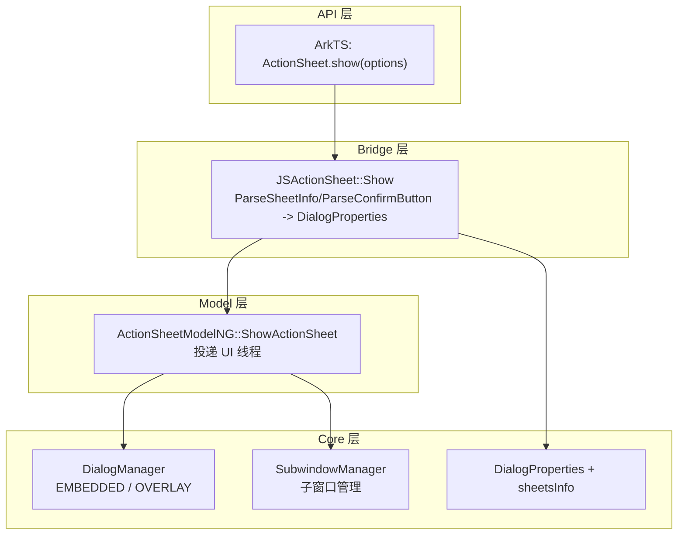

# 架构设计

> ActionSheet 是 ArkUI 弹窗类组件中的列表选择弹窗，通过命令式 API `ActionSheet.show()` 展示标题、消息和列表项（sheets），支持确认和取消按钮。

## 设计元数据

| 字段 | 内容 |
|------|------|
| Design ID | DESIGN-Func-05-06-03 |
| 关联需求 | 已有能力补录（无独立 requirement.md） |
| 关联 Epic | 无 |
| 目标 Feature | Feat-01 ActionSheet 列表选择弹窗 |
| 复杂度 | 中等 |
| 目标版本 | API 8 起支持，API 10 subtitle/maskRect，API 11 isModal，API 14 enableHoverMode，API 15 immersiveMode/levelMode，API 18 backgroundBlurStyleOptions/levelOrder + 废弃，API 19 生命周期回调，API 26 systemMaterial/distortionMode/edgeLightMode |
| Owner | ArkUI SIG |
| 状态 | Baselined（已有实现补录） |

## 需求基线

| 字段 | 内容 |
|------|------|
| 问题陈述 | 应用需要一种列表选择弹窗，通过命令式 API 展示标题/消息和可选择的列表项（sheets），支持确认和取消按钮 |
| 核心目标 | （Feat-01）提供 ActionSheet.show() 命令式 API，支持 sheets 列表数组、confirm/cancel 按钮、title/message、对齐 BOTTOM 与偏移、子窗口、层级模式、生命周期回调和废弃迁移 |
| P0 AC | AC-1.1~1.2（sheets）、AC-2.1~2.2（confirm）、AC-3.1~3.2（cancel）、AC-4.1~4.2（title/message）、AC-5.1~5.2（alignment+offset）、AC-6.1（subwindow）、AC-7.1~7.2（levelMode）、AC-8.1~8.3（生命周期+废弃） |

## 上下文和现状

### 涉及仓和模块

| 仓库 | 模块路径 | 当前职责 | 本 Feature 影响 |
|------|----------|----------|-----------------|
| ace_engine | `frameworks/bridge/declarative_frontend/jsview/dialog/js_action_sheet.cpp/.h` | JS 桥接层，解析 ActionSheet 参数 | 全量涉及 |
| ace_engine | `frameworks/core/components_ng/pattern/dialog/action_sheet_model_ng.cpp` | NG Model 层，ShowActionSheet 实现 | 全量涉及 |
| ace_engine | `frameworks/core/components/dialog/dialog_properties.h` | DialogProperties 结构体（含 sheetsInfo） | 全量涉及 |
| ace_engine | `frameworks/bridge/declarative_frontend/jsview/dialog/action_sheet_model.h` | Model 抽象层 | 全量涉及 |
| ace_engine | `frameworks/core/components_ng/pattern/dialog/action_sheet_accessor.cpp` | C-API accessor | 全量涉及 |

### 调用链层级分析

| 层 | 模块 | 职责 | 修改类型 |
|----|------|------|----------|
| JS Bridge | `frameworks/bridge/declarative_frontend/jsview/dialog/js_action_sheet.cpp/.h` | JS→C++ 桥接，ParseSheetInfo/ParseTitleAndMessage/ParseConfirmButton + shadow/border/radius/alignment/offset/maskRect/levelMode/levelOrder/systemMaterial/distortionMode/edgeLightMode | 无修改（规格补录） |
| Model | `frameworks/core/components_ng/pattern/dialog/action_sheet_model_ng.cpp/.h` | NG Model 层：ShowActionSheet 投递 UI 线程、LevelMode::EMBEDDED/SubwindowManager/isModal/SetAction/SetCancel/SetOnWillDismiss/SetConfirm | 无修改（规格补录） |
| Properties | `frameworks/core/components/dialog/dialog_properties.h` | DialogProperties + sheetsInfo vector<ActionSheetInfo> | 无修改（规格补录） |
| C-API | `frameworks/core/components_ng/pattern/dialog/action_sheet_accessor.cpp` | C-API 动态加载 Dialog 模块 | 无修改（规格补录） |

### 适用架构规则

| 规则 ID | 设计结论 |
|---------|----------|
| OH-ARCH-01 | 命令式弹窗通过 Model 层投递到 UI 线程创建，DialogProperties 为统一存储结构 |
| OH-ARCH-02 | ActionSheet 默认 alignment=BOTTOM、offset={0,-40vp}，区别于 AlertDialog 的 DEFAULT/{0,0} |
| OH-ARCH-03 | 废弃 API 保留兼容性，引导迁移到 UIContext 实例方法 |

## 不涉及项承接

| 维度 | 结论 |
|------|------|
| 性能 | N/A — ActionSheet 为命令式弹窗，创建开销可接受 |
| 安全与权限 | N/A — ActionSheet 不涉及安全敏感操作 |
| 兼容性 | 展开设计 — API 18 废弃需兼容性声明和迁移指导 |
| API/SDK | 展开设计 — ArkTS API 签名需与 SDK 定义交叉验证 |
| IPC/跨进程 | N/A — ActionSheet 为进程内 UI 组件 |
| 构建与部件 | N/A — ActionSheet 源码已包含在现有构建配置中 |

## 关键设计决策

| 决策 ID | 问题 | 推荐方案 | 探索过的替代方案 | 取舍理由 | 影响 |
|---------|------|----------|------------------|----------|------|
| ADR-1 | 默认对齐方式 | alignment=BOTTOM，offset={0,-40vp} | alignment=DEFAULT，offset={0,0}（AlertDialog 方式） | 列表选择弹窗从底部弹出更符合交互习惯 | 与 AlertDialog 默认行为不同 |
| ADR-2 | sheets 列表存储 | sheetsInfo 存入 DialogProperties 中的独立 vector | 合并到 buttons 数组 | sheets 有 title+icon+action 结构，与按钮不同 | 需独立解析和渲染逻辑 |
| ADR-3 | confirm 按钮主标志 | ParseConfirmButton 中 isPrimary=true 当 defaultFocus=false | 固定 isPrimary=false | 确认按钮为默认操作时设为主按钮 | defaultFocus=true 时 confirm 不设为 primary |
| ADR-4 | 模态默认值 | isModal 默认 true，显示遮罩 | isModal 默认 false | 模态弹窗为常见场景 | 非模态需显式设置 isModal=false |
| ADR-5 | LevelMode 默认 EMBEDDED | 默认 LevelMode::EMBEDDED | 默认 OVERLAY | 列表选择弹窗通常绑定页面上下文 | 全局弹窗需显式设置 LevelMode=OVERLAY |
| ADR-6 | 废弃策略 | API 18 废弃 ActionSheet.show，保留功能但引导迁移到 UIContext.showActionSheet() | 直接移除 | 渐进式迁移保证兼容 | 旧代码仍可用但收到废弃警告 |

## 设计骨架

### 骨架范围

| 骨架项 | 目标 | 不包含 | 验证方式 |
|--------|------|--------|----------|
| DialogProperties + sheetsInfo | 统一弹窗参数存储含 sheets | 弹窗渲染逻辑 | 代码审查 |
| JSActionSheet Show | JS 参数解析和 DialogProperties 构造 | NG Model 实现 | 代码审查 |
| ActionSheetModelNG ShowActionSheet | UI 线程投递和弹窗创建 | JS 解析逻辑 | 单元测试 |
| SheetInfo 解析 | ParseSheetInfo title/icon/action | 按钮解析 | 代码审查 |

### 骨架 Spec 拆分

| Task ID | 目标 | 受影响文件 | AC |
|---------|------|------------|-----|
| TASK-SKELETON-1 | DialogProperties + sheetsInfo | `dialog_properties.h:186-282` | AC-1.1 |
| TASK-SKELETON-2 | JSActionSheet Show 解析 | `js_action_sheet.cpp:394-552` | AC-1.1~4.2, AC-5.1~5.2 |
| TASK-SKELETON-3 | ActionSheetModelNG ShowActionSheet | `action_sheet_model_ng.cpp:25-86` | AC-6.1, AC-7.1~7.2 |
| TASK-SKELETON-4 | ParseSheetInfo/ParseConfirmButton | `js_action_sheet.cpp:73-188` | AC-1.2, AC-2.1~2.2 |

## 后续 Task 拆分

| Task ID | 目标 | 受影响文件 | 依赖 |
|---------|------|------------|------|
| TASK-1 | ActionSheet 全部行为规格 | Feat-01-action-sheet-full-spec.md | 无 |

## API 签名、Kit 与权限

### 新增 API

| API 签名 | 类型 | d.ts 位置 | 权限要求 | SysCap |
|----------|------|-----------|----------|--------|
| `ActionSheet.show(options: ActionSheetOptions)` | Public | `action_sheet.d.ts` | - | ArkUI.Component |

### 变更/废弃 API

| 原有 API | 变更类型 | 新 API | 迁移说明 |
|----------|----------|--------|----------|
| `ActionSheet.show()` | 废弃(API 18) | `UIContext.showActionSheet()` | 建议迁移到 UIContext 实例方法 |

## 构建系统影响

### BUILD.gn 变更

```
无变更。ActionSheet 实现位于已有构建配置中。
```

### bundle.json 变更

无变更。

## 可选设计扩展

### 架构图



### 数据流/控制流

| 步骤 | 调用方 | 被调用方 | 数据/接口 | 说明 |
|------|--------|----------|-----------|------|
| 1 | ArkTS | JSActionSheet::Show | options | 解析 title/subtitle/message/sheets/confirm/cancel 等 |
| 2 | JSActionSheet::Show | ParseSheetInfo | sheets array | 解析每个 SheetInfo 的 title/icon/action |
| 3 | JSActionSheet::Show | ParseConfirmButton | confirm | 解析确认按钮（isPrimary 当 defaultFocus=false） |
| 4 | JSActionSheet::Show | DialogProperties | type=ACTION_SHEET, alignment=BOTTOM, offset={0,-40vp} | 构造 DialogProperties |
| 5 | JSActionSheet::Show | ActionSheetModelNG::ShowActionSheet | DialogProperties | 调用 NG Model 层 |
| 6 | ShowActionSheet | PostUIWorkspace | DialogProperties | 投递到 UI 线程执行 |
| 7 | ShowActionSheet | DialogManager | LevelMode | 根据 levelMode 选择 OVERLAY 或 EMBEDDED |
| 8 | ShowActionSheet | SubwindowManager | isShowInSubWindow | 子窗口模式下创建子窗口 |
| 9 | ShowActionSheet | SetAction/SetCancel/SetConfirm | callbacks | 设置事件回调 |

### 数据模型设计

**ArkTS (API 层类型)**

```typescript
interface SheetInfo {
  title: string | Resource;
  icon?: string | Resource;
  action: () => void;
}
interface ActionSheetButtonOptions {
  enabled?: boolean;
  defaultFocus?: boolean;
  style?: DialogButtonStyle;
  value: string | Resource;
  action: () => void;
}
interface ActionSheetOptions {
  title: string | Resource;
  subtitle?: string | Resource;
  message: string | Resource;
  confirm?: ActionSheetButtonOptions;
  cancel?: ActionSheetButtonOptions;
  sheets: Array<SheetInfo>;
  autoCancel?: boolean;
  alignment?: SheetAlignment;
  offset?: { dx: number | string; dy: number | string };
  showInSubWindow?: boolean;
  isModal?: boolean;
  levelMode?: LevelMode;
  levelUniqueId?: number;
  immersiveMode?: ImmersiveMode;
  levelOrder?: number;
  onWillAppear?: () => void;
  onDidAppear?: () => void;
  onWillDisappear?: () => void;
  onDidDisappear?: () => void;
}
```

**C++ (框架层结构)**

```cpp
struct ActionSheetInfo {
  std::string title;
  std::string icon;
  std::function<void()> action;
};
struct DialogProperties {
  DialogType type = DialogType::ACTION_SHEET;
  DialogAlignment alignment = DialogAlignment::BOTTOM;
  DimensionOffset offset = {0, -40_vp};
  std::vector<ActionSheetInfo> sheetsInfo;
  ButtonInfo confirm;
  ButtonInfo cancel;
  // ... 其他通用弹窗属性
};
```

## 详细设计

### JS 参数解析流程

**入口**: `JSActionSheet::Show()` (`js_action_sheet.cpp:394-552`)

```
1. 创建 DialogProperties{type=ACTION_SHEET, alignment=BOTTOM, offset=ACTION_SHEET_OFFSET_DEFAULT={0,-40vp}}
2. ParseTitleAndMessage (L111-133) -> title/subtitle/message
3. ParseSheetInfo (L73-109) -> 遍历 sheets 数组，解析每个 title/icon/action
4. ParseConfirmButton (L135-188) -> 确认按钮，isPrimary=true 当 defaultFocus=false
5. 解析 cancel 按钮
6. 解析 shadow/border/radius (L190-265)
7. 解析 alignment/offset (L190-265)
8. 解析 maskRect/levelMode/levelOrder/systemMaterial/distortionMode/edgeLightMode
9. 调用 ActionSheetModelNG::ShowActionSheet(properties)
```

### NG Model 创建流程

**入口**: `ActionSheetModelNG::ShowActionSheet()` (`action_sheet_model_ng.cpp:25-86`)

```
1. 投递到 UI 线程执行
2. 获取子容器父节点
3. IF levelMode == EMBEDDED -> 通过 DialogManager 创建页面级弹窗
4. IF isShowInSubWindow -> 通过 SubwindowManager 创建子窗口
5. IF isModal -> 创建遮罩
6. 设置 SetAction (sheets 点击回调)
7. 设置 SetCancel (取消按钮回调)
8. 设置 SetOnWillDismiss (关闭拦截回调)
9. 设置 SetConfirm (确认按钮回调)
10. 调用 DialogManager::ShowDialog 创建弹窗
```

### 默认偏移量

```
ACTION_SHEET_OFFSET_DEFAULT = {0, -40vp}  // 底部对齐时向上偏移
ACTION_SHEET_OFFSET_DEFAULT_TOP = {0, 40vp}  // 顶部对齐时向下偏移
```

## 风险和开放问题

| 项 | 类型 | 影响 | 处理方式 | Owner |
|----|------|------|----------|-------|
| API 18 废弃 ActionSheet.show | 兼容性 | 高 | 保留功能，引导迁移到 UIContext.showActionSheet() | ArkUI SIG |
| 默认 alignment=BOTTOM 与 AlertDialog 不同 | 行为 | 低 | 文档化差异 | ArkUI SIG |
| 默认 offset={0,-40vp} 与 AlertDialog 不同 | 行为 | 低 | 文档化差异 | ArkUI SIG |
| showInSubWindow 在 Preview 中被忽略 | 行为 | 低 | 输出警告日志 | ArkUI SIG |
| levelOrder 排序 | 架构 | 低 | 需文档化多个 EMBEDDED 弹窗的排序规则 | ArkUI SIG |

## 设计审批

- [x] 需求基线已确认，设计覆盖 P0 AC
- [x] 不涉及项已承接，N/A 和展开项都有结论
- [x] 涉及仓和模块职责清楚
- [x] 适用架构规则已识别并形成设计结论
- [x] 分层和子系统边界合规
- [x] API 变更有签名、权限、错误码和兼容性说明
- [x] BUILD.gn/bundle.json 影响明确
- [x] 设计输出和后续 Task 拆分明确
- [x] 关键设计决策有理由和影响说明
- [x] 风险和开放问题有 Owner

**结论:** 通过（已有实现补录）
