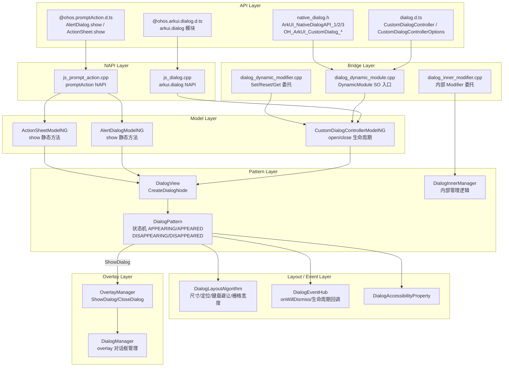
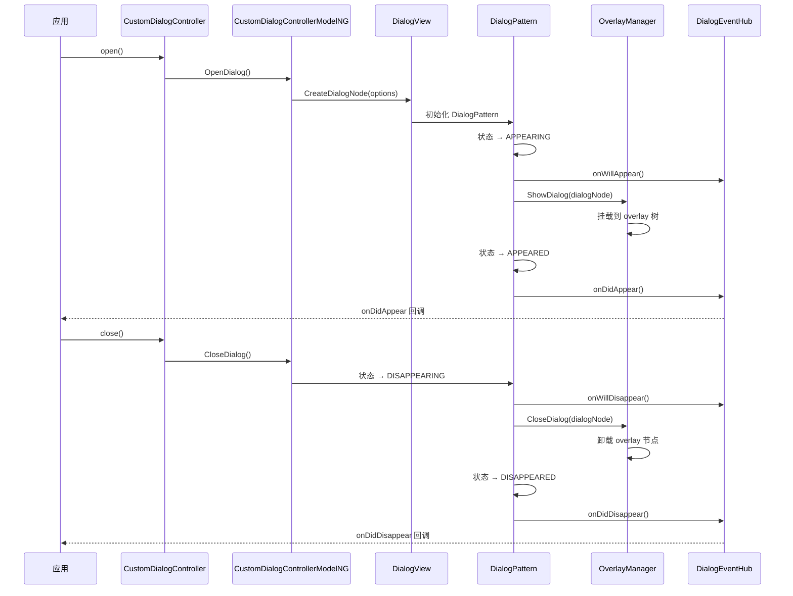
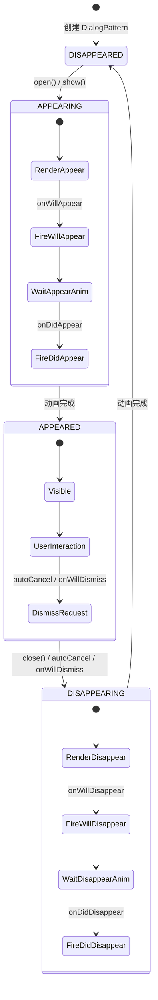

# 架构设计
> Dialog / CustomDialog 组件的架构设计文档，覆盖 CustomDialogController、AlertDialog、ActionSheet 三种对话框的统一生命周期管理、状态机、布局算法和扩展能力。

## 设计元数据

| 字段 | 内容 |
|------|------|
| Design ID | DESIGN-Func-05-06-04 |
| 关联需求 | 已有能力补录（无独立 requirement.md） |
| 关联 Epic | 无 |
| 目标 Feature | Feat-01: Dialog / CustomDialog 全量规格（CustomDialog/AlertDialog/ActionSheet 三形态、状态机、布局、C API） |
| 复杂度 | 复杂 |
| 目标版本 | API 7 ~ API 26+ |
| Owner | ArkUI SIG |
| 状态 | Baselined（已有实现补录） |

## 需求基线

> 需求基线详见 proposal.md。以下仅列出设计阶段需要额外强调的要点。

| 项 | 补充说明（如需） |
|----|------------------|
| 三形态覆盖 | CustomDialog（控制器模式）、AlertDialog（show 静态方法）、ActionSheet（show 静态方法）共享 DialogPattern 底层实现 |
| 状态机 | DialogPattern 内部维护 APPEARING/APPEARED/DISAPPEARING/DISAPPEARED 四态生命周期 |
| Overlay 管理 | 对话框通过 DialogManager 和 OverlayManager::ShowDialog/CloseDialog 挂载到 overlay 树 |
| C API 支持 | ArkUI_NativeDialogAPI_1/_2/_3 和 OH_ArkUI_CustomDialog_* 系列，@since 12/15/18/19 |
| 组件化 | 基础 Pattern 已组件化为 libarkui_dialog.z.so；AlertDialog/ActionSheet/CustomDialogController 仍有 JSView Bridge |

## 上下文和现状

### 涉及仓和模块

| 仓库 | 模块路径 | 当前职责 | 本 Feature 影响 |
|------|----------|----------|-----------------|
| ace_engine | `frameworks/core/components_ng/pattern/dialog/dialog_pattern.cpp` | DialogPattern：状态机、生命周期、show/hide | 核心实现，规格补录 |
| ace_engine | `frameworks/core/components_ng/pattern/dialog/dialog_layout_algorithm.cpp` | Dialog 布局：尺寸、定位、键盘避让、栅格宽度 | 规格补录 |
| ace_engine | `frameworks/core/components_ng/pattern/dialog/dialog_view.cpp` | CreateDialogNode：对话框节点创建 | 规格补录 |
| ace_engine | `frameworks/core/components_ng/pattern/dialog/dialog_event_hub.cpp` | 事件管理：onWillDismiss 等 | 规格补录 |
| ace_engine | `frameworks/core/components_ng/pattern/dialog/dialog_inner_manager.cpp` | Dialog 内部管理逻辑 | 规格补录 |
| ace_engine | `frameworks/core/components_ng/pattern/dialog/dialog_accessibility_property.cpp` | 无障碍属性 | 规格补录 |
| ace_engine | `frameworks/core/components_ng/pattern/dialog/custom_dialog/custom_dialog_controller_model_ng.cpp` | CustomDialogController Model：open/close | 规格补录 |
| ace_engine | `frameworks/core/components_ng/pattern/dialog/custom_dialog/custom_dialog_model.cpp` | CustomDialog Model | 规格补录 |
| ace_engine | `frameworks/core/components_ng/pattern/dialog/alert_dialog/alert_dialog_model_ng.cpp` | AlertDialog Model | 规格补录 |
| ace_engine | `frameworks/core/components_ng/pattern/dialog/action_sheet/action_sheet_model_ng.cpp` | ActionSheet Model | 规格补录 |
| ace_engine | `frameworks/core/components_ng/pattern/overlay/overlay_manager.cpp` | OverlayManager::ShowDialog/CloseDialog | 规格补录 |
| ace_engine | `frameworks/core/components_ng/pattern/overlay/dialog_manager.cpp` | DialogManager：overlay 对话框管理 | 规格补录 |
| ace_engine | `frameworks/core/components_ng/pattern/dialog/bridge/dialog_dynamic_module.cpp` | 组件化 SO 入口（libarkui_dialog.z.so） | 规格补录 |
| ace_engine | `frameworks/core/components_ng/pattern/dialog/bridge/dialog_dynamic_modifier.cpp` | Set/Reset/Get 属性委托 | 规格补录 |
| ace_engine | `interfaces/native/native_dialog.h` | C API 头文件：ArkUI_NativeDialogAPI_1/_2/_3, OH_ArkUI_CustomDialog_* | 规格补录 |
| ace_engine | `interfaces/napi/kits/promptaction/js_prompt_action.cpp` | NAPI：promptAction 模块（AlertDialog.show/ActionSheet.show） | 规格补录 |
| ace_engine | `interfaces/napi/kits/dialog/js_dialog.cpp` | NAPI：arkui.dialog 模块 | 规格补录 |
| interface/sdk-js | `api/@internal/component/ets/dialog.d.ts` | Dynamic API 声明 | 规格对照 |
| interface/sdk-js | `api/arkui/@ohos.promptAction.d.ts` | promptAction API 声明 | 规格对照 |
| interface/sdk-js | `api/arkui/@ohos.arkui.dialog.d.ts` | arkui.dialog API 声明 | 规格对照 |

### 调用链层级分析

| 层 | 模块 | 职责 | 修改类型 |
|----|------|------|----------|
| NAPI | `interfaces/napi/kits/promptaction/js_prompt_action.cpp`, `interfaces/napi/kits/dialog/js_dialog.cpp` | JS 层 API 入口（AlertDialog.show/ActionSheet.show/arkui.dialog） | 无修改（规格补录） |
| JS Bridge | `frameworks/bridge/declarative_frontend/` | ArkTS 属性解析入口（CustomDialogController） | 无修改（规格补录） |
| Bridge | `frameworks/core/components_ng/pattern/dialog/bridge/dialog_dynamic_module.cpp` | 组件化 SO 入口（libarkui_dialog.z.so） | 无修改（规格补录） |
| Bridge | `frameworks/core/components_ng/pattern/dialog/bridge/dialog_dynamic_modifier.cpp` | Set/Reset/Get 属性委托层 | 无修改（规格补录） |
| Bridge | `frameworks/core/components_ng/pattern/dialog/bridge/inner_modifier/dialog_inner_modifier.cpp` | 内部 Modifier 委托 | 无修改（规格补录） |
| Model (CustomDialog) | `frameworks/core/components_ng/pattern/dialog/custom_dialog/custom_dialog_controller_model_ng.cpp` | CustomDialogController Model：open/close 生命周期 | 无修改（规格补录） |
| Model (AlertDialog) | `frameworks/core/components_ng/pattern/dialog/alert_dialog/alert_dialog_model_ng.cpp` | AlertDialog Model：show 静态方法 | 无修改（规格补录） |
| Model (ActionSheet) | `frameworks/core/components_ng/pattern/dialog/action_sheet/action_sheet_model_ng.cpp` | ActionSheet Model：show 静态方法 | 无修改（规格补录） |
| Pattern | `frameworks/core/components_ng/pattern/dialog/dialog_pattern.cpp` | DialogPattern：状态机、生命周期、show/hide | 无修改（规格补录） |
| View | `frameworks/core/components_ng/pattern/dialog/dialog_view.cpp` | CreateDialogNode：对话框节点创建、初始化 | 无修改（规格补录） |
| Layout | `frameworks/core/components_ng/pattern/dialog/dialog_layout_algorithm.cpp` | 布局：尺寸、定位、键盘避让、栅格宽度 | 无修改（规格补录） |
| Event | `frameworks/core/components_ng/pattern/dialog/dialog_event_hub.cpp` | 事件管理：onWillDismiss、生命周期回调 | 无修改（规格补录） |
| Inner Manager | `frameworks/core/components_ng/pattern/dialog/dialog_inner_manager.cpp` | Dialog 内部管理逻辑 | 无修改（规格补录） |
| Overlay Manager | `frameworks/core/components_ng/pattern/overlay/overlay_manager.cpp` | OverlayManager::ShowDialog/CloseDialog | 无修改（规格补录） |
| Dialog Manager | `frameworks/core/components_ng/pattern/overlay/dialog_manager.cpp` | overlay 对话框嵌入管理 | 无修改（规格补录） |
| Accessibility | `frameworks/core/components_ng/pattern/dialog/dialog_accessibility_property.cpp` | 无障碍属性 | 无修改（规格补录） |
| C-API | `interfaces/native/native_dialog.h` | C API 定义：ArkUI_NativeDialogAPI_1/_2/_3, OH_ArkUI_CustomDialog_* | 无修改（规格补录） |

### 适用架构规则

| Rule ID | 适用原因 | 设计结论 | 验证方式 |
|---------|----------|----------|----------|
| OH-ARCH-LAYERING | Dialog 涉及 NAPI → Bridge → Model → Pattern → Overlay 多层调用 | 调用方向自上而下，Pattern 通过 OverlayManager 间接管理对话框挂载 | 代码评审 |
| OH-ARCH-API-LEVEL | Dialog 有 @since 7/8/10/11/12/14/15/18/19/20/23/26 等多版本 API | 各版本 API 通过 PlatformVersion 条件分支实现兼容 | API 评审 / XTS |
| OH-ARCH-COMPONENT-BUILD | 基础 Pattern 已组件化为独立 SO（libarkui_dialog.z.so） | DynamicModule 注册机制；AlertDialog/ActionSheet/CustomDialogController 仍有 JSView Bridge | 构建验证 |
| OH-ARCH-SUBSYSTEM | Dialog 依赖 OverlayManager 和 DialogManager 挂载对话框 | 同仓跨模块依赖，Pattern 通过 PipelineContext 获取 OverlayManager | 依赖检查 |

## 不涉及项承接

> proposal.md 已完成 N/A 判定。本节仅对 proposal 中标记为"涉及"且需展开设计的维度给出结论。

| 维度 | 设计结论 |
|------|----------|
| 无障碍 | Dialog 实现 AccessibilityProperty，报告角色为 Dialog，支持 ActionDismiss |
| 深色模式 | 颜色属性使用 ResourceColor 类型，支持 Token 主题切换，通过 DialogThemeWrapper 映射 |
| 版本升级兼容 | API 10 引入 maskColor/maskRect/openAnimation/closeAnimation/showInSubWindow/backgroundColor/cornerRadius；API 11 引入 isModal；API 12 引入 onWillDismiss/width/height/borderWidth/shadow/backgroundBlurStyle/keyboardAvoidMode；API 14 引入 enableHoverMode/hoverModeArea；API 15 引入 keyboardAvoidDistance/levelMode/levelUniqueId/immersiveMode；API 18 引入 levelOrder；API 19 引入 focusable/生命周期回调；API 20 引入 getState；API 26 引入 systemMaterial，废弃 AlertDialog/ActionSheet |
| 多窗口 | showInSubWindow（@since 10）允许对话框在独立子窗口显示；levelMode（@since 15）支持多层级对话框 |
| 悬浮态 | enableHoverMode（@since 14）/hoverModeArea 支持折叠屏悬浮态显示 |

## 关键设计决策

| 决策 ID | 问题 | 推荐方案 | 探索过的替代方案 | 取舍理由 | 影响 |
|---------|------|----------|-----------------|----------|------|
| ADR-1 | 三种对话框如何复用 Pattern | CustomDialog/AlertDialog/ActionSheet 共享 DialogPattern 底层实现，各自通过 Model 层设置差异化属性 | 三个独立 Pattern | 最大化复用状态机、布局、生命周期逻辑；差异通过属性和 Model 层控制 | AC-1.1, AC-4.1, AC-5.1 |
| ADR-2 | 状态机设计 | 四态：APPEARING → APPEARED → DISAPPEARING → DISAPPEARED | 两态（显示/隐藏） | 四态支持精细的生命周期回调（onWillAppear/onDidAppear/onWillDisappear/onDidDisappear），动画与状态联动 | AC-2.1 ~ AC-2.8 |
| ADR-3 | CustomDialog 控制器模式 | CustomDialogController 持有对话框引用，open()/close() 控制生命周期 | 声明式 API | 控制器模式更灵活，支持程序化打开/关闭；getState（@since 20）查询当前状态 | AC-1.2, AC-1.3 |
| ADR-4 | AlertDialog/ActionSheet 静态方法 | AlertDialog.show()/ActionSheet.show() 静态方法创建并显示对话框 | 组件式 | 对话框为模态弹出，非组件树内节点；静态方法更符合使用语义 | AC-4.1, AC-5.1 |
| ADR-5 | API 26 废弃 AlertDialog/ActionSheet | @since 26 标记 @deprecated，推荐使用 CustomDialog 替代 | 保留 | 统一到 CustomDialog 控制器模式，减少 API 分裂；systemMaterial 为新增统一属性 | AC-4.1, AC-5.1 |
| ADR-6 | 对话框布局算法 | DialogLayoutAlgorithm 处理尺寸、定位、键盘避让、栅格宽度 | 各形态独立布局 | 统一布局逻辑，通过属性差异化控制；栅格宽度支持 gridCount（@since 8） | AC-3.1 ~ AC-3.6 |
| ADR-7 | 多层级对话框 | levelMode（@since 15）+ levelUniqueId + levelOrder（@since 18）支持多层级对话框 Z 序管理 | 固定 Z 序 | 多层级对话框需要精细控制 Z 序，避免遮挡关系混乱 | AC-6.1 ~ AC-6.3 |
| ADR-8 | C API 设计 | ArkUI_NativeDialogAPI_1（@since 12）/_2（@since 15）/_3（@since 18）分版本暴露；OH_ArkUI_CustomDialog_* 系列（@since 19）提供细粒度控制 | 单一 API | 分版本暴露避免破坏性变更；OH_ArkUI_CustomDialog_* 系列提供更灵活的 Native 层控制 | AC-7.1 ~ AC-7.6 |
| ADR-9 | 键盘避让 | keyboardAvoidMode（@since 12）+ keyboardAvoidDistance（@since 15）控制键盘避让行为 | 固定避让 | 不同场景需要不同的键盘避让策略，由开发者控制 | AC-3.5, AC-3.6 |
| ADR-10 | 悬浮态支持 | enableHoverMode（@since 14）/hoverModeArea 支持折叠屏悬浮态 | 不支持 | 折叠屏场景需要对话框在悬浮态正确显示 | AC-8.1, AC-8.2 |

## 设计骨架

### 骨架范围

| 骨架项 | 目标 | 不包含 | 验证方式 |
|--------|------|--------|----------|
| CustomDialog 生命周期 | open()/close()/getState()、状态机四态 | 自定义动画曲线 | UT + 手工 |
| AlertDialog | AlertDialog.show()、title/message/confirm/primaryButton/secondaryButton | ActionSheet 特有属性 | UT |
| ActionSheet | ActionSheet.show()、title/message/sheets | AlertDialog 特有属性 | UT |
| 布局与定位 | DialogLayoutAlgorithm、alignment/offset/gridCount/width/height | 复杂嵌套场景 | UT |
| 样式定制 | backgroundColor/cornerRadius/borderWidth/borderColor/shadow/backgroundBlurStyle/maskColor | 通用样式 | UT |
| 多层级 | levelMode/levelUniqueId/levelOrder/immersiveMode | Z 序冲突解决算法 | UT + 手工 |
| 键盘避让 | keyboardAvoidMode/keyboardAvoidDistance | 输入法内部实现 | UT + 手工 |
| 悬浮态 | enableHoverMode/hoverModeArea | 折叠屏铰链细节 | 手工 |
| C API | ArkUI_NativeDialogAPI_1/_2/_3、OH_ArkUI_CustomDialog_* | NDK 内部实现 | C API UT |
| 生命周期回调 | onWillAppear/onDidAppear/onWillDisappear/onDidDisappear/onWillDismiss | 自定义回调 | UT |
| 组件化 | libarkui_dialog.z.so DynamicModule | JSView Bridge 残留 | 构建验证 |
| NAPI | promptAction/arkui.dialog 模块 | NAPI 框架本身 | UT |

### 骨架 Spec 拆分

| Task ID | 目标 | 受影响文件 | AC |
|---------|------|-----------|-----|
| TASK-SKELETON-1 | Dialog/CustomDialog 全量规格补录（三形态、状态机、布局、C API、生命周期） | Feat-01-custom-dialog-full-spec.md | AC-1.1 ~ AC-12.4 |

## 后续 Task 拆分

| Task ID | 目标 | 受影响文件 | 依赖 |
|---------|------|-----------|------|
| TASK-DIALOG-01 | Dialog/CustomDialog 全量规格补录 | Feat-01-custom-dialog-full-spec.md, design.md | 无 |

## API 签名、Kit 与权限

> 本节承接 spec.md"API 变更分析"中识别的 API，给出签名、权限和 d.ts 位置等实现细节。

### 新增 API

| API 签名 | 类型 | d.ts 位置 | 权限要求 | SysCap |
|----------|------|-----------|----------|--------|
| `CustomDialogController(options: CustomDialogControllerOptions)` | Public | `@internal/component/ets/dialog.d.ts` | 无 | SystemCapability.ArkUI.ArkUI.Full |
| `.open(): void` | Public | `dialog.d.ts` | 无 | 同上 |
| `.close(): void` | Public | `dialog.d.ts` | 无 | 同上 |
| `.getState(): DTState` | Public | `dialog.d.ts` | 无 | 同上 |
| `AlertDialog.show(options: AlertDialogParamObject)` | Public | `@ohos.promptAction.d.ts` | 无 | 同上 |
| `ActionSheet.show(options: ActionSheetOptions)` | Public | `@ohos.promptAction.d.ts` | 无 | 同上 |
| `ArkUI_NativeDialogAPI_1::{ showDialog, closeDialog, ... }` | NDK/Public | `native_dialog.h` | 无 | 同上 |
| `ArkUI_NativeDialogAPI_2::{ ... }` | NDK/Public | `native_dialog.h` | 无 | 同上 |
| `ArkUI_NativeDialogAPI_3::{ ... }` | NDK/Public | `native_dialog.h` | 无 | 同上 |
| `OH_ArkUI_CustomDialog_*` 函数族 | NDK/Public | `native_dialog.h` | 无 | 同上 |

### 变更/废弃 API

| 原有 API | 变更类型 | 新 API | 迁移说明 |
|----------|----------|--------|----------|
| `AlertDialog.show()` | 废弃（@since 26） | CustomDialogController | 使用 CustomDialogController 替代 AlertDialog |
| `ActionSheet.show()` | 废弃（@since 26） | CustomDialogController | 使用 CustomDialogController 替代 ActionSheet |

## 构建系统影响

### BUILD.gn 变更

Dialog 基础 Pattern 已完成组件化改造，输出独立 SO：

```
# frameworks/core/components_ng/pattern/dialog/BUILD.gn
# 构建目标：libarkui_dialog.z.so
# DynamicModule 入口：dialog_dynamic_module.cpp
# 包含 DialogPattern/Model/Layout/View/EventHub/Bridge 代码
# AlertDialog/ActionSheet/CustomDialogController 作为子目录
```

### bundle.json 变更

Dialog 组件作为 ace_engine 的内部 component，无独立 bundle.json 变更。

## 可选设计扩展

### 架构图



### 数据流/控制流

| 步骤 | 调用方 | 被调用方 | 数据/接口 | 说明 |
|------|--------|----------|-----------|------|
| 1 | ArkTS / NAPI / C API | Bridge / NAPI | CustomDialogControllerOptions / AlertDialogParam / ActionSheetOptions | 属性设置入口 |
| 2 | CustomDialogController | CustomDialogControllerModelNG | open() | 打开对话框 |
| 3 | CustomDialogControllerModelNG | DialogView | CreateDialogNode() | 创建对话框节点 |
| 4 | DialogView | DialogPattern | 初始化状态机 → APPEARING | 状态转换 |
| 5 | DialogPattern | OverlayManager::ShowDialog | 挂载对话框到 overlay 树 | 对话框显示 |
| 6 | DialogPattern | DialogLayoutAlgorithm | 布局计算 | 尺寸/定位/键盘避让 |
| 7 | DialogPattern | DialogEventHub | onWillAppear/onDidAppear | 生命周期回调 |
| 8 | CustomDialogController | CustomDialogControllerModelNG | close() | 关闭对话框 |
| 9 | DialogPattern | OverlayManager::CloseDialog | 卸载 overlay 节点 | 对话框关闭 |
| 10 | DialogPattern | DialogEventHub | onWillDisappear/onDidDisappear | 生命周期回调 |

### 时序设计



### 数据模型设计

**API 层类型 (TypeScript)**:

```typescript
// CustomDialogController 构造参数
interface CustomDialogControllerOptions {
  builder: CustomBuilder;
  cancel?: () => void;
  autoCancel?: boolean;
  alignment?: DialogAlignment;
  offset?: { dx: number | string; dy: number | string };
  customStyle?: boolean;
  gridCount?: number;                    // @since 8
  maskColor?: ResourceColor;             // @since 10
  maskRect?: DimensionRect;              // @since 10
  openAnimation?: TranslateOptions;     // @since 10
  closeAnimation?: TranslateOptions;     // @since 10
  showInSubWindow?: boolean;             // @since 10
  backgroundColor?: ResourceColor;       // @since 10
  cornerRadius?: Dimension;              // @since 10
  isModal?: boolean;                     // @since 11
  onWillDismiss?: (dialog: DismissDialogAction) => void;  // @since 12
  width?: Dimension;                     // @since 12
  height?: Dimension;                    // @since 12
  borderWidth?: Widths;                  // @since 12
  borderColor?: Colors;                  // @since 12
  borderStyle?: BorderStyles;            // @since 12
  shadow?: ShadowOptions;                // @since 12
  backgroundBlurStyle?: BlurStyle;       // @since 12
  keyboardAvoidMode?: KeyboardAvoidMode; // @since 12
  enableHoverMode?: boolean;             // @since 14
  hoverModeArea?: HoverModeAreaType;     // @since 14
  keyboardAvoidDistance?: Dimension;     // @since 15
  levelMode?: LevelMode;                 // @since 15
  levelUniqueId?: number;                 // @since 15
  immersiveMode?: ImmersiveMode;         // @since 15
  levelOrder?: number;                   // @since 18
  focusable?: boolean;                   // @since 19
  systemMaterial?: boolean;              // @since 26
}

// 对话框状态枚举 (@since 20)
enum DTState { CLOSED, OPENING, OPEN, CLOSING }

// 对齐方式
enum DialogAlignment {
  Top, Center, Bottom, Default,
  TopStart, TopEnd, BottomStart, BottomEnd, CenterStart, CenterEnd
}

// 多层级模式 (@since 15)
enum LevelMode { OVERLAY, EMBEDDED }
enum ImmersiveMode { DISABLE, ENABLE }

// 键盘避让模式 (@since 12)
enum KeyboardAvoidMode { NONE, TRANSLATE, RESIZE }

// 悬浮态区域 (@since 14)
enum HoverModeAreaType { ALL_SCREEN, HALF_SCREEN }
```

**框架层结构 (C++)**:

```cpp
// DialogPattern 状态枚举
enum class DialogState {
    APPEARING,    // 出现中
    APPEARED,      // 已出现
    DISAPPEARING,  // 消失中
    DISAPPEARED    // 已消失
};

// DialogLayoutProperty 关键字段
ACE_DEFINE_PROPERTY_ITEM_WITHOUT_GROUP(Alignment, DialogAlignment);
ACE_DEFINE_PROPERTY_ITEM_WITHOUT_GROUP(OffsetX, Dimension);
ACE_DEFINE_PROPERTY_ITEM_WITHOUT_GROUP(OffsetY, Dimension);
ACE_DEFINE_PROPERTY_ITEM_WITHOUT_GROUP(GridCount, int32_t);          // @since 8
ACE_DEFINE_PROPERTY_ITEM_WITHOUT_GROUP(MaskColor, Color);            // @since 10
ACE_DEFINE_PROPERTY_ITEM_WITHOUT_GROUP(MaskRect, DimensionRect);      // @since 10
ACE_DEFINE_PROPERTY_ITEM_WITHOUT_GROUP(BackgroundColor, Color);      // @since 10
ACE_DEFINE_PROPERTY_ITEM_WITHOUT_GROUP(CornerRadius, Dimension);      // @since 10
ACE_DEFINE_PROPERTY_ITEM_WITHOUT_GROUP(IsModal, bool);                // @since 11
ACE_DEFINE_PROPERTY_ITEM_WITHOUT_GROUP(Width, Dimension);            // @since 12
ACE_DEFINE_PROPERTY_ITEM_WITHOUT_GROUP(Height, Dimension);           // @since 12
ACE_DEFINE_PROPERTY_ITEM_WITHOUT_GROUP(Shadow, Shadow);             // @since 12
ACE_DEFINE_PROPERTY_ITEM_WITHOUT_GROUP(BackgroundBlurStyle, BlurStyle);  // @since 12
ACE_DEFINE_PROPERTY_ITEM_WITHOUT_GROUP(KeyboardAvoidMode, KeyboardAvoidMode);  // @since 12
ACE_DEFINE_PROPERTY_ITEM_WITHOUT_GROUP(EnableHoverMode, bool);       // @since 14
ACE_DEFINE_PROPERTY_ITEM_WITHOUT_GROUP(LevelMode, LevelMode);        // @since 15
ACE_DEFINE_PROPERTY_ITEM_WITHOUT_GROUP(LevelUniqueId, int32_t);      // @since 15
ACE_DEFINE_PROPERTY_ITEM_WITHOUT_GROUP(ImmersiveMode, ImmersiveMode); // @since 15
ACE_DEFINE_PROPERTY_ITEM_WITHOUT_GROUP(LevelOrder, int32_t);         // @since 18
ACE_DEFINE_PROPERTY_ITEM_WITHOUT_GROUP(Focusable, bool);             // @since 19
ACE_DEFINE_PROPERTY_ITEM_WITHOUT_GROUP(SystemMaterial, bool);        // @since 26
```

### 算法与状态机



### 测试性设计

| 测试层级 | 测试目标 | Mock 策略 | 验证方式 |
|----------|----------|-----------|----------|
| UT - Pattern | DialogPattern 状态机四态转换 | MockPipelineContext, MockOverlayManager | gtest_filter |
| UT - Layout | DialogLayoutAlgorithm 尺寸/定位/键盘避让/栅格宽度 | MockRenderContext | gtest_filter |
| UT - View | DialogView::CreateDialogNode | MockPipelineContext | gtest_filter |
| UT - Event | DialogEventHub onWillDismiss/生命周期回调 | MockEventHub | gtest_filter |
| UT - Model | CustomDialogControllerModelNG open/close | MockPipelineContext | gtest_filter |
| UT - Property | DialogLayoutProperty 设置/重置/默认值 | 直接构造 Property 对象 | gtest_filter |
| UT - Accessibility | DialogAccessibilityProperty 角色/操作 | MockAccessibilityNode | gtest_filter |
| UT - C API | ArkUI_NativeDialogAPI_1/2/3、OH_ArkUI_CustomDialog_* | C API UT 框架 | capi_all_modifiers_test |
| 手工 | 悬浮态、多层级对话框 Z 序 | 真机/折叠屏 | 视觉比对 |

### 接口参数规约

| 接口 | 参数 | 类型 | 合法范围 | 非法处理 | 边界说明 |
|------|------|------|----------|----------|----------|
| CustomDialogController() | builder | CustomBuilder | 有效 Builder | 无 Builder 时不显示 | 必填 |
| CustomDialogController() | autoCancel | boolean | true/false | 默认 true | 点击遮罩关闭 |
| CustomDialogController() | alignment | DialogAlignment | Top/Center/Bottom/Default 等 | 默认 Default | 对齐方式 |
| CustomDialogController() | gridCount | number | ≥ 0 | < 0 取 0 | 栅格列数 @since 8 |
| CustomDialogController() | isModal | boolean | true/false | 默认 true | 模态/非模态 @since 11 |
| CustomDialogController() | levelMode | LevelMode | OVERLAY/EMBEDDED | 默认 OVERLAY | 层级模式 @since 15 |
| CustomDialogController() | levelOrder | number | ≥ 0 | < 0 取 0 | Z 序 @since 18 |
| CustomDialogController() | focusable | boolean | true/false | 默认 true | 可聚焦 @since 19 |
| .open() | — | — | — | 已 open 时重复调用无效 | — |
| .close() | — | — | — | 已 close 时重复调用无效 | — |
| .getState() | — | DTState | CLOSED/OPENING/OPEN/CLOSING | — | @since 20 |
| ArkUI_NativeDialogAPI_1 | — | — | — | — | @since 12 |

### 线程与并发模型

| 操作 | 发起线程 | 回调线程 | 跨进程边界 | 线程安全 | 重入约束 |
|------|----------|----------|------------|----------|----------|
| open() | UI 线程 | UI 线程 | 无 | 是 | 重复 open 无效 |
| close() | UI 线程 | UI 线程 | 无 | 是 | 重复 close 无效 |
| onWillDismiss | UI 线程 | UI 线程 | 无 | 是 | 回调内可调用 DismissDialogAction |
| C API showDialog | UI 线程 | UI 线程 | 无 | 是 | 需在 UI 线程调用 |

## 详细设计

### DialogPattern 状态机

`DialogPattern`（`dialog_pattern.cpp`）内部维护四态状态机：

- **DISAPPEARED → APPEARING**: `open()` 或 `show()` 触发，开始出现动画
- **APPEARING → APPEARED**: 出现动画完成，触发 `onDidAppear` 回调
- **APPEARED → DISAPPEARING**: `close()`、`autoCancel` 或 `onWillDismiss` 触发，开始消失动画
- **DISAPPEARING → DISAPPEARED**: 消失动画完成，触发 `onDidDisappear` 回调，卸载 overlay 节点

生命周期回调通过 `DialogEventHub`（`dialog_event_hub.cpp`）触发：
- `onWillAppear`（@since 19）：APPEARING 状态触发
- `onDidAppear`（@since 19）：APPEARED 状态触发
- `onWillDisappear`（@since 19）：DISAPPEARING 状态触发
- `onDidDisappear`（@since 19）：DISAPPEARED 状态触发
- `onWillDismiss`（@since 12）：关闭请求时触发，开发者可通过 `DismissDialogAction` 决定是否真正关闭

### DialogView 创建对话框节点

`DialogView::CreateDialogNode`（`dialog_view.cpp`）负责：
- 创建对话框 FrameNode（标签 `DIALOG_ETS_TAG`）
- 初始化 `DialogPattern` 和 `DialogLayoutProperty`
- 设置 builder 内容（CustomDialog）或预设内容（AlertDialog/ActionSheet）
- 注册到 `OverlayManager`

### DialogLayoutAlgorithm 布局算法

`DialogLayoutAlgorithm`（`dialog_layout_algorithm.cpp`）负责：

**尺寸计算**:
- `width`/`height`（@since 12）：显式尺寸优先
- `gridCount`（@since 8）：栅格宽度，根据栅格列数计算对话框宽度
- 默认尺寸从 DialogTheme 获取

**定位计算**:
- `alignment`：对齐方式（Top/Center/Bottom 等）
- `offset`：偏移量（dx/dy）
- 根据 alignment 计算对话框在屏幕中的位置

**键盘避让**:
- `keyboardAvoidMode`（@since 12）：NONE/TRANSLATE/RESIZE
- `keyboardAvoidDistance`（@since 15）：自定义避让距离
- 软键盘弹出时根据模式调整对话框位置或尺寸

### CustomDialogController 生命周期

`CustomDialogControllerModelNG`（`custom_dialog_controller_model_ng.cpp`）管理控制器生命周期：

- **构造**: `CustomDialogController(options)` 暂存选项
- **open()**: 调用 `DialogView::CreateDialogNode` 创建节点，触发状态机 APPEARING
- **close()**: 触发状态机 DISAPPEARING，动画完成后卸载
- **getState()**（@since 20）：查询当前状态（CLOSED/OPENING/OPEN/CLOSING）

### AlertDialog

`AlertDialogModelNG`（`alert_dialog_model_ng.cpp`）通过 `AlertDialog.show()` 静态方法创建：
- `title`：标题
- `subtitle`（@since 10）：副标题
- `message`：消息内容
- `confirm`：确认按钮
- `primaryButton`/`secondaryButton`（@since 10）：主/次按钮
- `buttons`（@since 10）：按钮数组
- `buttonDirection`（@since 10）：按钮排列方向
- API 26 标记废弃，推荐使用 CustomDialogController

### ActionSheet

`ActionSheetModelNG`（`action_sheet_model_ng.cpp`）通过 `ActionSheet.show()` 静态方法创建：
- `title`：标题
- `subtitle`：副标题
- `message`：消息内容
- `confirm`：确认按钮
- `sheets`：选项列表
- `autoCancel`：自动取消
- API 26 标记废弃，推荐使用 CustomDialogController

### 多层级对话框

`levelMode`（@since 15）控制对话框层级模式：
- `OVERLAY`：覆盖模式（默认），通过 OverlayManager 挂载
- `EMBEDDED`：嵌入模式，挂载到指定父节点（通过 `levelUniqueId` 标识）

`levelOrder`（@since 18）控制同层级对话框的 Z 序排列。

`immersiveMode`（@since 15）控制沉浸式模式（DISABLE/ENABLE）。

### 悬浮态支持

`enableHoverMode`（@since 14）启用悬浮态支持：
- 折叠屏展开/折叠时，对话框在悬浮态正确显示
- `hoverModeArea`（@since 14）控制悬浮态区域（ALL_SCREEN/HALF_SCREEN）

### C API

C API 通过 `native_dialog.h` 暴露：

**ArkUI_NativeDialogAPI_1**（@since 12）:
- `showDialog`：显示对话框
- `closeDialog`：关闭对话框
- 基础属性设置接口

**ArkUI_NativeDialogAPI_2**（@since 15）:
- 扩展属性接口（levelMode 等）

**ArkUI_NativeDialogAPI_3**（@since 18）:
- 进一步扩展接口（levelOrder 等）

**OH_ArkUI_CustomDialog_*** 系列（@since 19）:
- `OH_ArkUI_CustomDialog_Create`：创建对话框
- `OH_ArkUI_CustomDialog_Show`：显示对话框
- `OH_ArkUI_CustomDialog_Close`：关闭对话框
- `OH_ArkUI_CustomDialog_Dispose`：释放对话框
- 细粒度属性设置函数

### NAPI 模块

- `js_prompt_action.cpp`：promptAction 模块，提供 `AlertDialog.show()` 和 `ActionSheet.show()` 的 NAPI 绑定
- `js_dialog.cpp`：arkui.dialog 模块，提供对话框相关 NAPI 接口

## 风险和开放问题

| 项 | 类型 | 影响 | 处理方式 | Owner |
|----|------|------|----------|-------|
| API 26 废弃 AlertDialog/ActionSheet | API | 中 | 已标记 @deprecated，推荐迁移到 CustomDialogController；需在迁移文档中明确 | ArkUI SIG |
| 组件化不完全 | 架构 | 低 | 基础 Pattern 已组件化（libarkui_dialog.z.so），但 AlertDialog/ActionSheet/CustomDialogController 仍有 JSView Bridge | ArkUI SIG |
| 多层级对话框 Z 序冲突 | 架构 | 中 | levelMode/levelOrder 需要正确配置，否则 Z 序可能混乱 | ArkUI SIG |
| C API 版本分片 | API | 低 | ArkUI_NativeDialogAPI_1/_2/_3 分版本暴露，需在文档中明确各版本能力差异 | ArkUI SIG |
| 悬浮态折叠屏兼容 | 兼容性 | 低 | enableHoverMode 为 @since 14，旧版本不支持悬浮态 | ArkUI SIG |

## 设计审批

- [x] 需求基线已确认，设计覆盖 P0/P1 AC
- [x] 不涉及项已承接，N/A 和展开项都有结论
- [x] 涉及仓和模块职责清楚
- [x] 调用链层级分析完整，每层覆盖到位
- [x] 适用架构规则已识别并形成设计结论
- [x] 分层和子系统边界合规
- [x] API 变更有签名、权限、错误码和兼容性说明
- [x] BUILD.gn/bundle.json 影响明确
- [x] 设计输出和后续 Task 拆分明确
- [x] 关键设计决策有理由和影响说明
- [x] 风险和开放问题有 Owner

**结论:** 通过（已有实现补录）
