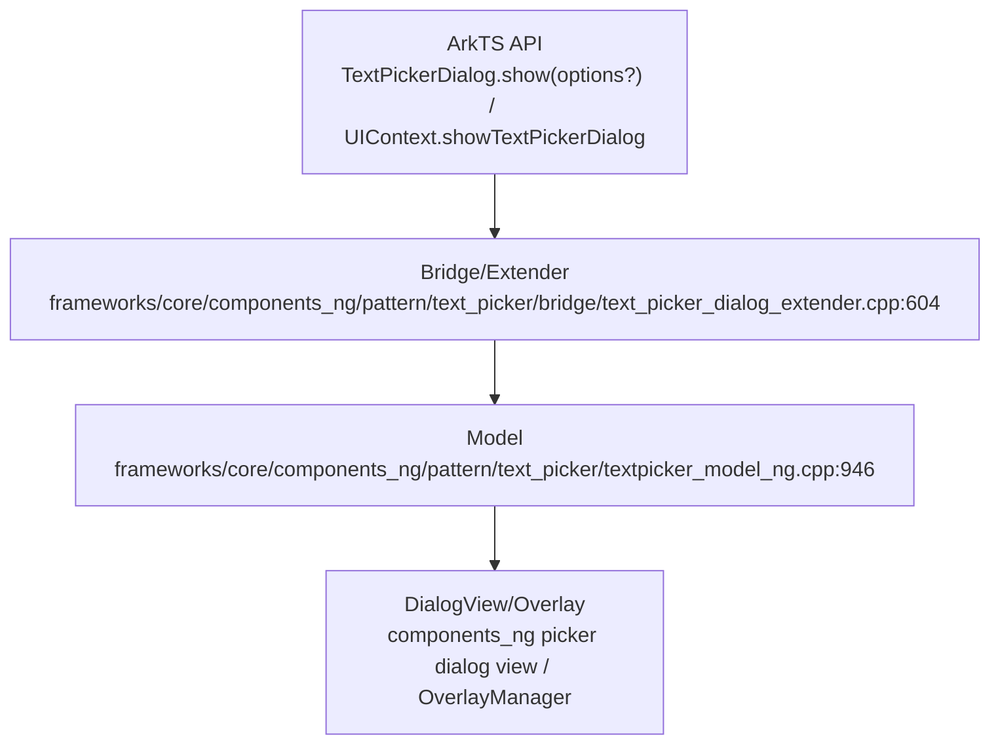
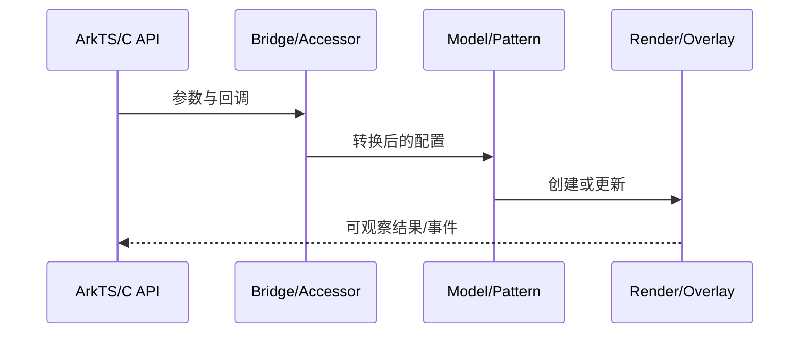
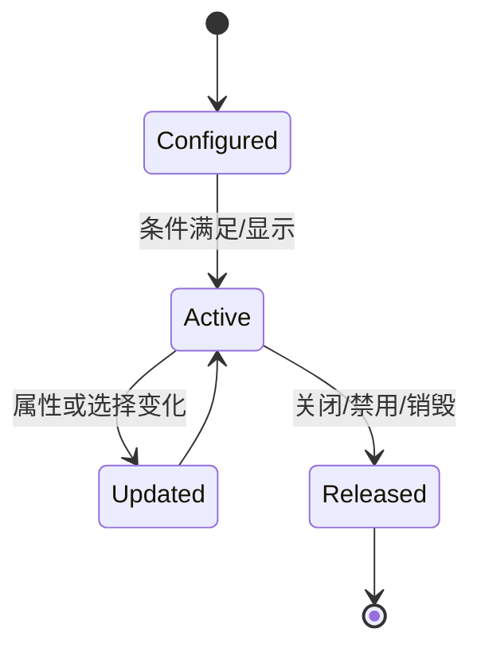
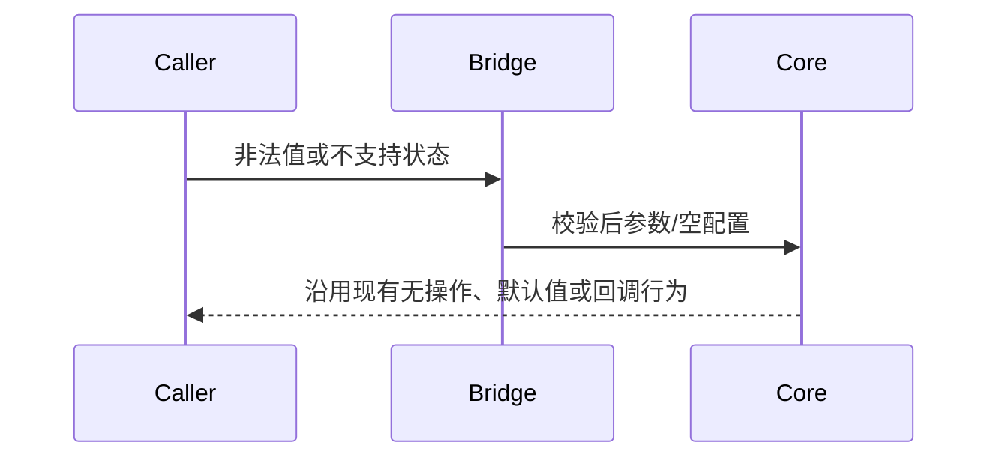

# 架构设计

> 确认目标仓和模块的架构约束、关键设计决策、Spec 拆分方向。

## 设计元数据

| 字段 | 内容 |
|---|---|
| Design ID | DESIGN-Func-05-06-08 |
| 关联需求 | 已有能力补录（无独立 requirement.md） |
| 关联 Epic | 无 |
| 目标 Feature | Feat-01 TextPickerDialog 完整能力 |
| 复杂度 | 关键 |
| 目标版本 | 按 Dynamic/Static SDK @since |
| Owner | ArkUI SIG |
| 状态 | Baselined（已有实现补录） |

## 需求基线

> 本设计记录现有实现，不提出产品行为修改。

| 项 | 补充说明（如需） |
|---|---|
| 完整 options | 覆盖数据、样式、按钮、布局、hover、材质和所有事件 |
| 接口边界 | Dynamic/Static 最终收敛到 Model/DialogView；generated accessor 非公开 NDK |

## 上下文和现状

### 涉及仓和模块

| 仓库 | 补充架构说明 |
|---|---|
| interface/sdk-js/api | interface/sdk-js/api/@internal/component/ets/text_picker.d.ts / interface/sdk-js/api/arkui/component/textPicker.static.d.ets |
| ace_engine/frameworks/core/components_ng/pattern | frameworks/core/components_ng/pattern/text_picker/bridge/text_picker_dialog_extender.cpp:604 |
| ace_engine/frameworks/core/interfaces/native/generated | Static generated 类型和 accessor（内部） |
| ace_engine/frameworks/core/components_ng/pattern/dialog | 共享 Dialog/Overlay 能力 |

### 调用链层级分析

| 层 | 模块 | 职责 | 修改类型 |
|---|---|---|---|
| ArkTS API | TextPickerDialog.show(options?) / UIContext.showTextPickerDialog | 接收 options 和 callbacks | 文档补录 |
| Bridge/Extender | frameworks/core/components_ng/pattern/text_picker/bridge/text_picker_dialog_extender.cpp:604 | 转换 DialogProperties/SettingData/事件 | 文档补录 |
| Model | frameworks/core/components_ng/pattern/text_picker/textpicker_model_ng.cpp:946 | 选择 NG 实现并请求显示 | 文档补录 |
| DialogView/Overlay | components_ng picker dialog view / OverlayManager | 创建节点、布局、生命周期和关闭 | 文档补录 |

- [x] 调用链每一层都已覆盖
- [x] 每层职责边界清晰
- [x] 每层修改类型明确

### 适用架构规则

| Rule ID | 适用原因 | 设计结论 | 验证方式 |
|---|---|---|---|
| OH-ARCH-LAYERING | 涉及前端到渲染/弹窗链路 | 保持现有单向分层调用 | 架构评审/源码审查 |
| OH-ARCH-SUBSYSTEM | 实现位于 ArkUI 仓内 | 不新增跨子系统依赖 | 依赖检查 |
| OH-ARCH-IPC-SAF | 无新增 IPC/SA | N/A | 源码审查 |
| OH-ARCH-API-LEVEL | 涉及存量公开 API | SDK 声明为契约，内部 accessor 不扩展为 NDK | API 评审 |
| OH-ARCH-COMPONENT-BUILD | 不修改构建边界 | BUILD.gn/bundle.json 无变更 | 索引校验 |
| OH-ARCH-ERROR-LOG | 沿用现有返回/降级行为 | 不新增错误码 | 定向测试 |

## 不涉及项承接

| 维度 | 设计结论 |
|---|---|
| 权限/隐私 | 除 enableHapticFeedback 既有 VIBRATE 要求外不新增权限；不持久化选择结果 |
| 持久化/迁移 | 不新增持久化数据和迁移逻辑 |
| 跨进程 | 不新增 IPC、SA 或跨进程协议 |

## 关键设计决策

| 决策 ID | 问题 | 推荐方案 | 探索过的替代方案 | 取舍理由 | 影响 |
|---|---|---|---|---|---|
| ADR-1 | 多前端如何复用实现 | Dynamic Bridge 与 Static Extender/Accessor 均转换到 Model/DialogView | 每个前端独立弹窗实现、暴露 generated accessor 为 NDK | 减少语义漂移并保持接口边界 | 全部 AC |
| ADR-2 | 全量 options 如何传递 | 拆分为 DialogProperties、SettingData、ButtonInfo 和事件 map/function | 直接传 JS 对象、仅支持核心字段 | 匹配现有强类型 C++ 模型 | AC-1.2, AC-1.3 |
| ADR-3 | 事件生命周期 | 由 DialogView/Overlay 按 SDK 顺序触发 | Bridge 立即触发、统一单回调 | 保持显示动画和交互时机 | AC-2.1, AC-2.2 |
| ADR-4 | 版本入口 | 按 SDK 保留/迁移全局 show；Static accessor 仅内部使用 | 删除全局入口、将 accessor 写成公开 C API | 保持生态兼容且不误导 NDK 用户 | AC-2.4 |

## 设计骨架

### 骨架范围

| 骨架项 | 目标 | 不包含 | 验证方式 |
|---|---|---|---|
| 规格补录 | 固定现有 API、边界和兼容行为 | 不修改产品实现 | spec 校验 + 源码审查 |
| 共享设计 | 同一 FuncID 的 Feat 共用 design.md | 不建立 Feat 独立 H2 | 章节检查 |

### 骨架 Spec 拆分

| Task ID | 目标 | 受影响文件 | AC |
|---|---|---|---|
| TASK-SKELETON-1 | Feat-01 TextPickerDialog 完整能力 | Feat-01-text-picker-dialog-spec.md | 见对应 spec |

## 后续 Task 拆分

| Task ID | 目标 | 受影响文件 | 依赖 |
|---|---|---|---|
| TASK-050608-01 | Feat-01 TextPickerDialog 完整能力 | Feat-01-text-picker-dialog-spec.md | 源码与 SDK 契约 |

## API 签名、Kit 与权限

### 新增 API

> 本次不新增 API；下表记录存量开放面。

| API 签名 | 类型 | Kit | d.ts 位置 | 权限要求 | SysCap |
|---|---|---|---|---|---|
| TextPickerDialog.show(options?) / UIContext.showTextPickerDialog | Public | ArkUI | interface/sdk-js/api/@internal/component/ets/text_picker.d.ts / interface/sdk-js/api/arkui/component/textPicker.static.d.ets | enableHapticFeedback 场景需 VIBRATE | SystemCapability.ArkUI.ArkUI.Full |

### 变更/废弃 API

| 原有 API | 变更类型 | 新 API | 迁移说明 |
|---|---|---|---|
| TextPickerDialog.show(options?) | 废弃 since 18 | UIContext.showTextPickerDialog | 迁移到绑定正确 UI 实例的 UIContext |

## 构建系统影响

### BUILD.gn 变更

```text
无。本文档补录现有实现，不修改 BUILD.gn。
```

### bundle.json 变更

无新增 component 或依赖关系。

## 可选设计扩展

### 架构图



### 数据流/控制流

| 步骤 | 调用方 | 被调用方 | 数据/接口 | 说明 |
|---|---|---|---|---|
| 1 | TextPickerDialog.show(options?) / UIContext.showTextPickerDialog | frameworks/core/components_ng/pattern/text_picker/bridge/text_picker_dialog_extender.cpp:604 | 接收 options 和 callbacks | 沿现有链路传递 |
| 2 | frameworks/core/components_ng/pattern/text_picker/bridge/text_picker_dialog_extender.cpp:604 | frameworks/core/components_ng/pattern/text_picker/textpicker_model_ng.cpp:946 | 转换 DialogProperties/SettingData/事件 | 沿现有链路传递 |
| 3 | frameworks/core/components_ng/pattern/text_picker/textpicker_model_ng.cpp:946 | components_ng picker dialog view / OverlayManager | 选择 NG 实现并请求显示 | 沿现有链路传递 |
| 4 | components_ng picker dialog view / OverlayManager | 渲染结果/回调 | 创建节点、布局、生命周期和关闭 | 沿现有链路传递 |

### 时序设计



### 数据模型设计

Options 在 Bridge/Extender 中转换为 `DialogProperties`、picker `SettingData`、`ButtonInfo` 和回调集合；Model 将这些值交给对应 DialogView/OverlayManager。

### 算法与状态机



### 测试性设计

| 测试层级 | 测试目标 | Mock 策略 | 验证方式 |
|---|---|---|---|
| 源码契约 | SDK 与实现映射 | 无 | 路径和行号审查 |
| 组件/预览 | 主路径与边界条件 | 平台能力按现有 mock | 定向 UT 或 previewer 用例 |
| 兼容性 | API 版本差异 | 设置 target API | 版本矩阵审查 |

### 异常传播时序图



### 资源所有权矩阵

| 资源 | 创建方 | 持有方 | 销毁触发 | 实际释放 | 异常回收 |
|---|---|---|---|---|---|
| Dialog FrameNode | DialogView/OverlayManager | OverlayManager | 确认/取消/关闭 | OverlayManager | 容器销毁时清理 |
| Callback closures | Bridge/Extender | 事件 map/Model | 弹窗销毁 | std::function/Global handle 生命周期 | 未配置则为空 |
| Static peer/accessor | generated runtime | Static frontend | runtime finalizer | generated finalizer | 不是公开 NDK |

### 接口参数规约

| 接口 | 参数 | 类型 | 合法范围 | 非法处理 | 边界说明 |
|---|---|---|---|---|---|
| TextPickerDialog.show(options?) / UIContext.showTextPickerDialog | options | DialogOptions | SDK 定义范围 | 无效可选字段按 converter 默认/忽略 | 字段按 @since 生效 |
| ButtonStyle | primary | boolean | 最多一个 true | 两者同时 true 均不生效 | SDK 明确约束 |
| 生命周期 | callbacks | VoidCallback | 可选 | 未配置不调用 | 正常顺序见 SDK |

### 线程与并发模型

| 操作 | 发起线程 | 回调线程 | 跨进程边界 | 线程安全 | 重入约束 |
|---|---|---|---|---|---|
| API 调用 | UI/ArkTS 线程 | UI/ArkTS 线程 | 无 | 沿用容器与 UI 线程约束 | 回调内修改配置按 SDK 生命周期说明生效 |

## 详细设计

### Options 转换

Bridge/Extender 将数据、主题、按钮、hover、材质和事件转换为核心结构。

实现证据：`frameworks/core/components_ng/pattern/text_picker/bridge/text_picker_dialog_extender.cpp:604`。
### Model 收敛

转换结果进入 picker DialogModel，再由 DialogView/OverlayManager 创建弹窗。

实现证据：`frameworks/core/components_ng/pattern/text_picker/textpicker_model_ng.cpp:946`。
### Static 接口边界

generated accessor/Extender 服务 Static ArkTS，不属于 interfaces/native 公开 NDK API。

实现证据：`frameworks/core/interfaces/native/generated/interface/arkoala_api_generated.h:29119`。

## 风险和开放问题

| 项 | 类型 | 影响 | 处理方式 | Owner |
|---|---|---|---|---|
| Dynamic/Static 字段开放版本可能不同 | API | 高 | 逐项以两份 SDK 类型定义为准 | ArkUI SIG |
| 全局 show 与 UIContext 迁移差异 | API | 高 | 兼容性章节突出入口状态 | ArkUI SIG |
| 按钮 primary 冲突和生命周期时序易遗漏 | 测试 | 中 | 加入冲突与快速关闭用例 | ArkUI SIG |

## 设计审批

- [x] 需求基线已确认，设计覆盖 P0/P1 AC
- [x] 不涉及项已承接，N/A 和展开项都有结论
- [x] 涉及仓和模块职责清楚
- [x] 调用链层级分析完整，每层覆盖到位
- [x] 适用架构规则已识别并形成设计结论
- [x] 分层和子系统边界合规
- [x] API 变更有签名、权限、错误码和兼容性说明
- [x] BUILD.gn/bundle.json 影响明确
- [x] 设计输出和后续 Task 拆分明确
- [x] 关键设计决策有理由和影响说明
- [x] 风险和开放问题有 Owner

**结论:** 通过（已有实现补录）。
