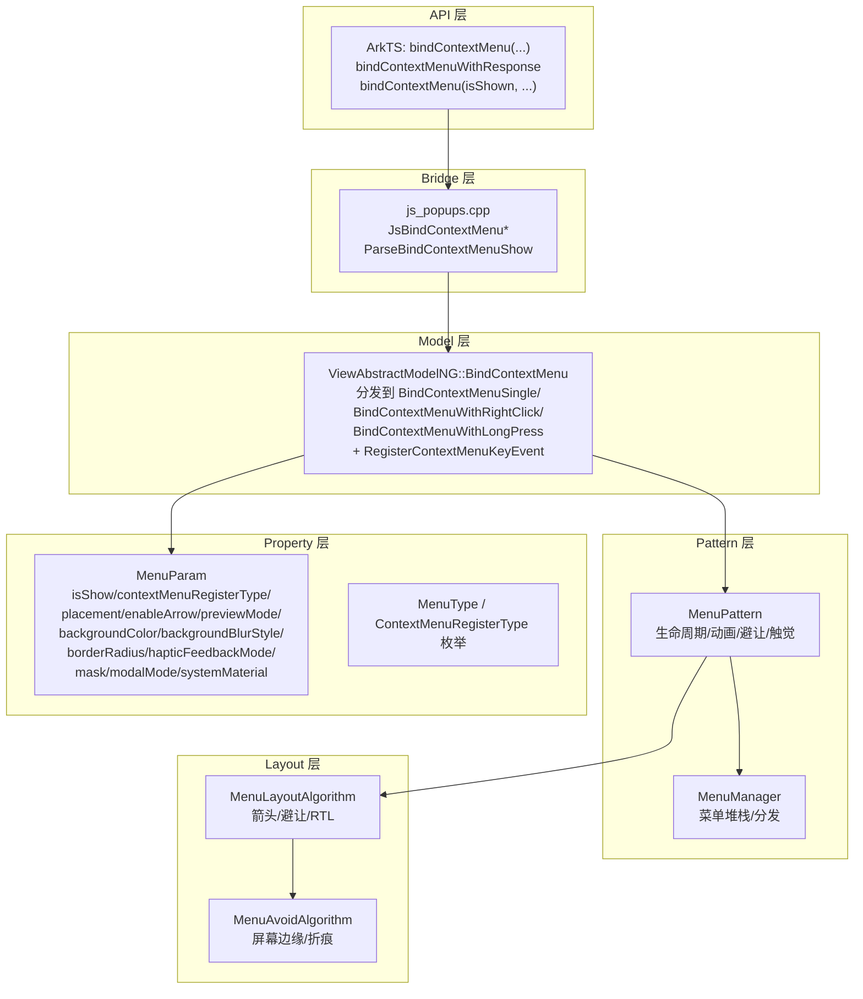

# 架构设计

> bindContextMenu 上下文菜单属性的架构设计文档，覆盖 MenuType/ContextMenuRegisterType 分发策略、响应类型范式与 isShown 范式双绑定、预览/箭头/避让布局、SheetObject 策略与组件化。

## 设计元数据

| 字段 | 内容 |
|------|------|
| Design ID | DESIGN-Func-05-06-09 |
| 关联需求 | 已有能力补录（无独立 requirement.md） |
| 关联 Epic | 无 |
| 目标 Feature | Feat-01: bindContextMenu 全量规格（响应类型范式 + isShown 范式 + WithResponse + 预览/箭头/避让 + Options） |
| 复杂度 | 复杂 |
| 目标版本 | API 8 ~ API 26+ |
| Owner | ArkUI SIG |
| 状态 | Baselined（已有实现补录） |

## 需求基线

| 字段 | 内容 |
|------|------|
| 问题陈述 | 组件需要根据长按/右键点击/显示状态触发上下文菜单，并支持预览、箭头、布局避让、触觉反馈等富交互 |
| 核心目标 | （Feat-01）提供 bindContextMenu 全套 API，覆盖响应类型范式（@since 8）、isShown 双绑定范式（@since 12）、WithResponse 范式（@since 23），统一 ContextMenuOptions 配置面 |
| P0 AC | AC-1.1 ~ AC-1.6（响应类型绑定）、AC-2.1 ~ AC-2.4（isShown 范式）、AC-3.1 ~ AC-3.3（WithResponse）、AC-4.1 ~ AC-4.4（预览）、AC-5.1 ~ AC-5.4（箭头）、AC-6.1 ~ AC-6.4（避让/Placement）、AC-7.1 ~ AC-7.4（Options）、AC-8.1 ~ AC-8.3（触觉/RTL） |

## 上下文和现状

### 涉及仓和模块

| 仓库 | 模块路径 | 当前职责 | 本 Feature 影响 |
|------|----------|----------|-----------------|
| ace_engine | `frameworks/core/components_ng/pattern/menu/menu_property.h` | MenuType/ContextMenuRegisterType 枚举、MenuParam 结构体（isShow/placement/enableArrow/previewMode/previewAnimationOptions/backgroundColor/backgroundBlurStyle/borderRadius/previewBorderRadius/layoutRegionMargin/transition/enableHoverMode/hapticFeedbackMode/outlineWidth/outlineColor/maskEnable/maskType/modalMode/systemMaterial） | 规格补录 |
| ace_engine | `frameworks/core/components_ng/pattern/menu/menu_pattern.h/.cpp` | MenuPattern，菜单生命周期/动画/避让 | 规格补录 |
| ace_engine | `frameworks/core/components_ng/pattern/menu/menu_layout_algorithm.h/.cpp` | 菜单布局算法（含箭头/避让/RTL） | 规格补录 |
| ace_engine | `frameworks/core/components_ng/pattern/menu/menu_avoid_algorithm.cpp` | 屏幕边缘/折痕避让 | 规格补录 |
| ace_engine | `frameworks/core/components_ng/pattern/menu/menu_manager.h/.cpp` | MenuManager 单例，菜单堆栈/分发 | 规格补录 |
| ace_engine | `frameworks/core/components_ng/pattern/menu/menu_model_ng.h/.cpp` | MenuModelNG，BindContextMenu* 系列分发入口 | 规格补录 |
| ace_engine | `frameworks/core/components_ng/base/view_abstract_model_ng.cpp` | BindContextMenu(ResponseType, buildFunc, menuParam, previewBuildFunc) 及重载，分发到 BindContextMenuSingle/BindContextMenuWithRightClick/BindContextMenuWithLongPress + RegisterContextMenuKeyEvent | 规格补录 |
| ace_engine | `frameworks/core/components_ng/base/view_abstract_model_static.cpp` | 静态前端 BindContextMenu 实现 | 规格补录 |
| ace_engine | `frameworks/bridge/declarative_frontend/jsview/js_popups.cpp` | JsBindContextMenu / JsBindContextMenuWithBuilderAndArray / JsBindContextMenuWithResponse / JsBindContextMenuByResponseType / JsBindContextMenuByIsShow + ParseBindContextMenuShow | 规格补录 |
| ace_engine | `frameworks/bridge/declarative_frontend/jsview/js_view_abstract.cpp` | 静态注册 bindContextMenu 系列 | 规格补录 |
| ace_engine | `frameworks/core/interfaces/native/node/context_menu_accessor.cpp` | C-API accessor | 规格补录 |
| ace_engine | `frameworks/core/interfaces/native/node/menu_modifier.cpp` | C-API modifier | 规格补录 |
| interface/sdk-js | `api/@internal/component/ets/common.d.ts` | ResponseType / MenuPreviewMode / ContextMenuAnimationOptions / ContextMenuOptions / MenuOptions / bindContextMenu* 声明 | 规格对照 |

### 调用链层级分析

| 层 | 模块 | 职责 | 修改类型 |
|----|------|------|----------|
| JS Bridge | `frameworks/bridge/declarative_frontend/jsview/js_popups.cpp` | JsBindContextMenu* 系列解析 content/responseType/options；ParseBindContextMenuShow 检测 boolean isShow→CUSTOM_TYPE/BOTTOM_LEFT vs object DoubleBind | 无修改（规格补录） |
| JS Bridge (WithResponse) | `js_popups.cpp` JsBindContextMenuWithResponse L2316-2372 | @since 23 builder 接收 MenuBindingType，同时注册 RIGHT_CLICK+LONG_PRESS | 无修改（规格补录） |
| Model (NG) | `view_abstract_model_ng.cpp` L894-988 | BindContextMenu 分发：BindContextMenuSingle(CUSTOM_TYPE)/BindContextMenuWithRightClick(RIGHT_CLICK)/BindContextMenuWithLongPress(LONG_PRESS)+RegisterContextMenuKeyEvent；Array 变体；WithResponse 双注册 | 无修改（规格补录） |
| Model (Static) | `view_abstract_model_static.cpp` L379-745 | 静态前端 BindContextMenu 实现 | 无修改（规格补录） |
| Model helpers | `view_abstract_model_ng.cpp` BindContextMenuSingle L345 / BindContextMenuWithLongPress L530 / BindContextMenuWithRightClick L591 / BindContextMenuWithLongPressOptions L637 / BindContextMenuWithRightClickOptions L731 / BindContextMenuSingleWithOptions L825 | 各范式落地 | 无修改（规格补录） |
| KeyEvent | `view_abstract_model_ng.cpp` RegisterContextMenuKeyEvent L1158-1182 | KEY_MENU / INTENTION_MENU → BindMenuWithCustomNode BOTTOM_LEFT | 无修改（规格补录） |
| Pattern | `menu_pattern.h/.cpp` | 菜单生命周期/动画/避让/触觉 | 无修改（规格补录） |
| Layout | `menu_layout_algorithm.h/.cpp` + `menu_avoid_algorithm.cpp` | 箭头计算、屏幕边缘/折痕避让、RTL 调整 | 无修改（规格补录） |
| C-API | `context_menu_accessor.cpp` L26-39 / `menu_modifier.cpp` | C-API accessor + modifier 委托 | 无修改（规格补录） |

### 适用架构规则

| Rule ID | 适用原因 | 设计结论 | 验证方式 |
|---------|----------|----------|----------|
| OH-ARCH-LAYERING | bindContextMenu 涉及 JSView → Model → MenuModelNG → MenuPattern → MenuLayoutAlgorithm 多层 | 调用方向自上而下，Pattern 不直接访问 JSView 层 | 代码评审 |
| OH-ARCH-API-LEVEL | bindContextMenu 有 @since 8/10/11/12/13/18/19/20/23/26 多版本 API | 各版本 API 通过 PlatformVersion 条件分支实现兼容 | API 评审 / XTS |
| OH-ARCH-OVERLAY | 菜单通过 OverlayManager 挂载到 overlay 层 | 菜单节点不进入业务节点树 | 集成测试 |
| OH-ARCH-ERROR-LOG | 菜单使用 TAG ACE_OVERLAY / ACE_MENU 日志标签 | 关键路径覆盖 hilog 打点 | hilog |

## 不涉及项承接

| 维度 | 结论 |
|------|------|
| 性能 | 展开设计 — 菜单为按需创建的浮层，需控制首次创建延迟与动画帧率 |
| 安全与权限 | 展开设计 — 触觉反馈（haptic level-1）需 ohos.permission.VIBRATE 权限 |
| 兼容性 | 展开设计 — 响应类型范式（@since 8）与 isShown 范式（@since 12）行为差异需兼容性声明 |
| API/SDK | 展开设计 — bindContextMenu 多重载签名需与 SDK common.d.ts 交叉验证 |
| IPC/跨进程 | N/A — 上下文菜单为进程内 UI 组件 |
| 构建与部件 | N/A — 菜单源码已包含在现有构建配置中 |

## 关键设计决策

| 决策 ID | 问题 | 推荐方案 | 探索过的替代方案 | 取舍理由 | 影响 |
|---------|------|----------|------------------|----------|------|
| ADR-1 | 响应类型范式与 isShown 范式如何共存 | 通过 MenuParam.contextMenuRegisterType 区分 NORMAL_TYPE/CUSTOM_TYPE；响应类型范式走 BindContextMenuWithRightClick/LongPress，isShown 范式走 BindContextMenuSingle(CUSTOM_TYPE) | 统一单一入口 | 双范式各自有默认行为差异（响应类型默认 LONG_PRESS/TOP，isShown 默认 CUSTOM_TYPE/BOTTOM_LEFT），统一会破坏向后兼容 | 两套 API 并存，开发者需按版本选择 |
| ADR-2 | LONG_PRESS 范式下鼠标是否支持 | 不支持长按触发 | 支持鼠标长按 | 鼠标长按语义不明确，与触摸长按冲突 | LONG_PRESS 仅触摸生效，鼠标需用 RIGHT_CLICK |
| ADR-3 | 预览模式下是否显示箭头 | 预览模式不显示箭头 | 预览 + 箭头共存 | 预览图自身承担"指向"语义，箭头冗余 | preview!=NONE 时强制 enableArrow=false |
| ADR-4 | 箭头安全偏移 | radius + 半个箭头宽度 | 固定偏移 | 动态计算避免箭头溢出圆角区域 | 箭头位置自动钳位 |
| ADR-5 | 触觉反馈权限 | haptic level-1 菜单需 ohos.permission.VIBRATE | 无权限触发 | 系统触觉资源需权限管控 | 未授权时静默跳过触觉 |
| ADR-6 | 圆角默认值 | 2-in-1 设备 8vp，其他设备 20vp | 统一 20vp | 2-in-1 鼠标交互风格更接近桌面菜单 | 设备形态差异化默认值 |
| ADR-7 | layoutRegionMargin 默认值 | 左右 12vp，上下 16vp | 统一 12vp | 上下需为状态栏/导航栏留更多避让 | 非对称边距 |
| ADR-8 | WithResponse 范式 builder 参数 | builder 接收 MenuBindingType 标识触发来源（RIGHT_CLICK/LONG_PRESS） | 无参数 builder | 开发者需根据触发来源差异化菜单内容 | builder 签名变更，@since 23 |
| ADR-9 | KEY_MENU 物理键触发 | 映射到 BindMenuWithCustomNode BOTTOM_LEFT | 不支持物理键 | 物理菜单键是设备标配交互 | 键盘/遥控器场景可用 |

## 设计骨架

### 骨架范围

| 骨架项 | 目标 | 不包含 | 验证方式 |
|--------|------|--------|----------|
| MenuParam | 统一参数结构体（isShow/menuBindType/contextMenuRegisterType/placement/enableArrow/arrowOffset/previewMode/previewAnimationOptions/backgroundColor/backgroundBlurStyle/borderRadius/previewBorderRadius/layoutRegionMargin/transition/enableHoverMode/hapticFeedbackMode/outlineWidth/outlineColor/maskEnable/maskType/modalMode/systemMaterial） | Menu 内部布局参数 | 代码审查 |
| MenuType 枚举 | MENU/CONTEXT_MENU/SUB_MENU 等区分 | 具体渲染 | 代码审查 |
| ContextMenuRegisterType | NORMAL_TYPE=0/CUSTOM_TYPE=1 区分范式 | 范式内部细分 | 代码审查 |
| BindContextMenu 分发 | ViewAbstractModelNG::BindContextMenu 分发到 BindContextMenuSingle/WithRightClick/WithLongPress | 具体落地实现 | 单元测试 |
| RegisterContextMenuKeyEvent | KEY_MENU/INTENTION_MENU 物理键注册 | 手势触发 | 单元测试 |

### 骨架 Spec 拆分

| Task ID | 目标 | 受影响文件 | AC |
|---------|------|------------|-----|
| TASK-SKELETON-1 | MenuParam + MenuType + ContextMenuRegisterType 定义 | `menu_property.h` | AC-1.1, AC-2.1, AC-7.1 |
| TASK-SKELETON-2 | BindContextMenu 分发与各范式落地 | `view_abstract_model_ng.cpp` L894-988 | AC-1.1~1.6, AC-2.1~2.4, AC-3.1~3.3 |
| TASK-SKELETON-3 | 预览/箭头/避让布局 | `menu_layout_algorithm.cpp` + `menu_avoid_algorithm.cpp` | AC-4.1~4.4, AC-5.1~5.4, AC-6.1~6.4 |
| TASK-SKELETON-4 | Options 配置面（bg/blur/border/mask/haptic/RTL） | `menu_property.h` MenuParam + `menu_pattern.cpp` | AC-7.1~7.4, AC-8.1~8.3 |

## 后续 Task 拆分

| Task ID | 目标 | 受影响文件 | 依赖 |
|---------|------|------------|------|
| TASK-1 | bindContextMenu 全部行为规格 | Feat-01-context-menu-full-spec.md | 无 |

## API 签名、Kit 与权限

### 新增 API

| API 签名 | 类型 | d.ts 位置 | 权限要求 | SysCap |
|----------|------|-----------|----------|--------|
| `bindContextMenu(content: CustomBuilder, responseType: ResponseType, options?: ContextMenuOptions): T` | Public | `common.d.ts:24223` | - | ArkUI |
| `bindContextMenuByResponseType(...)` | Public | `common.d.ts:24240` @since 26 | - | ArkUI |
| `bindContextMenuWithResponse(content, options?): T` | Public | `common.d.ts:24257` @since 23 / `:24273` @since 26 | - | ArkUI |
| `bindContextMenu(isShown: boolean, content: CustomBuilder, options?: ContextMenuOptions): T` | Public | `common.d.ts:24296` @since 12 | - | ArkUI |
| `bindContextMenuByIsShow(...)` | Public | `common.d.ts:24318` @since 26 | - | ArkUI |
| `ResponseType` enum (RightClick/LongPress) | Public | `enums.d.ts:3211` @since 8 | - | ArkUI |
| `MenuPreviewMode` enum (NONE=0/IMAGE=1) | Public | `common.d.ts:16410` @since 11 | - | ArkUI |
| `ContextMenuAnimationOptions` | Public | `common.d.ts:16453` @since 11/12/20 | - | ArkUI |
| `ContextMenuOptions` | Public | `common.d.ts:16937` @since 10+ | - | ArkUI |
| `MenuOptions extends ContextMenuOptions` | Public | `common.d.ts:17674` | - | ArkUI |

### 变更/废弃 API

| 原有 API | 变更类型 | 新 API | 迁移说明 |
|----------|----------|--------|----------|
| `bindContextMenu(content, responseType, options?)` @since 8 | 保留（不废弃） | `bindContextMenuWithResponse` @since 23 | 新增 WithResponse 范式，旧 API 继续可用 |
| — | — | — | 无废弃 API |

## 构建系统影响

### BUILD.gn 变更

```
无变更。菜单组件实现已包含在现有构建配置中。
```

### bundle.json 变更

无变更。

## 可选设计扩展

### 架构图



### 数据流/控制流

| 步骤 | 调用方 | 被调用方 | 数据/接口 | 说明 |
|------|--------|----------|-----------|------|
| 1 | ArkTS | JsBindContextMenu* | content/responseType/options | 解析参数与范式识别 |
| 2 | JsBridge | ParseBindContextMenuShow | isShow 类型 | boolean→CUSTOM_TYPE/BOTTOM_LEFT；object→DoubleBind |
| 3 | JsBridge | ViewAbstractModel::BindContextMenu | ResponseType/buildFunc/menuParam/previewBuildFunc | 进入 Model 层 |
| 4 | Model | BindContextMenuSingle/WithRightClick/WithLongPress | contextMenuRegisterType | 按 ResponseType 分发 |
| 5 | Model | RegisterContextMenuKeyEvent | KEY_MENU/INTENTION_MENU | 物理键触发注册 |
| 6 | Pattern | MenuLayoutAlgorithm | placement/enableArrow/arrowOffset/previewMode | 布局与箭头计算 |
| 7 | Layout | MenuAvoidAlgorithm | 屏幕边缘/折痕 | 避让计算 |
| 8 | Pattern | haptic feedback | hapticFeedbackMode | 触觉反馈（需权限） |

### 数据模型设计

**ArkTS (API 层类型)**

```typescript
// common.d.ts:16410
declare enum MenuPreviewMode {
    NONE = 0,
    IMAGE = 1
}

// common.d.ts:16937
declare interface ContextMenuOptions {
    offset?: Position;
    placement?: Placement;
    enableArrow?: boolean;
    arrowOffset?: Length;
    preview?: MenuPreviewMode | CustomBuilder;
    previewBorderRadius?: Dimension;
    borderRadius?: Dimension;
    onAppear?: () => void;
    onDisappear?: () => void;
    aboutToAppear?: () => void;
    aboutToDisappear?: () => void;
    layoutRegionMargin?: Dimension;
    previewAnimationOptions?: ContextMenuAnimationOptions;
    backgroundColor?: ResourceColor;
    backgroundBlurStyle?: BlurStyle;
    backgroundBlurStyleOptions?: BlurStyleOptions;
    backgroundEffect?: BackgroundEffectOptions;
    transition?: TransitionEffect;
    enableHoverMode?: boolean;
    outlineColor?: ResourceColor;
    outlineWidth?: Dimension;
    colorMode?: ThemeColorMode;
    hapticFeedbackMode?: HapticFeedbackMode;
    mask?: boolean;
    modalMode?: ModalMode;
    onDidAppear?: () => void;
    onDidDisappear?: () => void;
    onWillAppear?: () => void;
    onWillDisappear?: () => void;
}
```

**C++ (框架层结构)**

```cpp
// menu_property.h:40-57
enum class MenuType {
    MENU, CONTEXT_MENU, SUB_MENU, // ...
};

// menu_property.h:71-74
enum class ContextMenuRegisterType {
    NORMAL_TYPE = 0,
    CUSTOM_TYPE = 1,
};

// menu_property.h:112-226
struct MenuParam {
    std::optional<bool> isShow;
    std::optional<MenuBindType> menuBindType;
    std::optional<ContextMenuRegisterType> contextMenuRegisterType;
    std::optional<Placement> placement;
    std::optional<bool> enableArrow;
    std::optional<Dimension> arrowOffset;
    std::optional<MenuPreviewMode> previewMode;
    std::optional<ContextMenuAnimationOptions> previewAnimationOptions;
    std::optional<Color> backgroundColor;
    std::optional<BlurStyle> backgroundBlurStyle;
    std::optional<Dimension> borderRadius;
    std::optional<Dimension> previewBorderRadius;
    std::optional<Dimension> layoutRegionMargin;
    std::optional<TransitionEffect> transition;
    std::optional<bool> enableHoverMode;
    std::optional<HapticFeedbackMode> hapticFeedbackMode;
    std::optional<Dimension> outlineWidth;
    std::optional<Color> outlineColor;
    std::optional<bool> maskEnable;
    std::optional<MaskType> maskType;
    std::optional<ModalMode> modalMode;
    std::optional<SystemMaterial> systemMaterial;
    // ...
};
```

## 详细设计

### bindContextMenu 分发流程

**入口**: `ViewAbstractModelNG::BindContextMenu()` (`view_abstract_model_ng.cpp:894-988`)

```
1. 根据 ResponseType 分发：
   - RIGHT_CLICK → BindContextMenuWithRightClick
   - LONG_PRESS  → BindContextMenuWithLongPress
   - CUSTOM_TYPE(isShow 范式) → BindContextMenuSingle(CUSTOM_TYPE)
2. WithResponse 范式（@since 23）：
   - 同时注册 RIGHT_CLICK + LONG_PRESS
   - builder 接收 MenuBindingType 标识触发来源
3. Array 变体（L916-934）：CustomBuilder + Array 分支
4. 调用 RegisterContextMenuKeyEvent 注册 KEY_MENU / INTENTION_MENU
   → 物理键触发 BindMenuWithCustomNode BOTTOM_LEFT
```

### ParseBindContextMenuShow 范式识别

**入口**: `js_popups.cpp` ParseBindContextMenuShow L1031-1051

```
1. isShow 为 boolean：
   - true → CUSTOM_TYPE，placement 默认 BOTTOM_LEFT（isShown 范式）
   - 双绑定（DoubleBind）
2. isShow 为 object：
   - 进入响应类型范式或 WithResponse 参数对象
```

### 预览/箭头/避让布局

```
1. previewMode：
   - NONE（默认）：无预览图
   - IMAGE：系统预览图
   - CustomBuilder：自定义预览内容
2. preview != NONE 时强制 enableArrow = false
3. enableArrow = true 时：
   - 箭头位置 = placement 方向 + arrowOffset 偏移
   - 安全偏移 = radius + 半个箭头宽度（防止溢出圆角）
   - RTL 场景箭头位置自动调整
4. 避让：
   - 屏幕边缘 + 折痕区域
   - layoutRegionMargin：左右 12vp，上下 16vp
```

### 触觉反馈

```
1. hapticFeedbackMode 设置时，菜单显示触发触觉
2. level-1 菜单需 ohos.permission.VIBRATE 权限
3. 未授权时静默跳过，不抛出异常
```

### 圆角默认值

```
- 2-in-1 设备：borderRadius 默认 8vp
- 其他设备：borderRadius 默认 20vp
- 可通过 ContextMenuOptions.borderRadius 覆盖
```

## 风险和开放问题

| 项 | 类型 | 影响 | 处理方式 | Owner |
|----|------|------|----------|-------|
| 响应类型范式与 isShown 范式默认行为不兼容 | 兼容性 | 高 | 在兼容性声明中标注，提供迁移指导 | ArkUI SIG |
| LONG_PRESS 鼠标不支持 | 行为 | 中 | 文档化说明，鼠标场景需用 RIGHT_CLICK | ArkUI SIG |
| 预览模式强制隐藏箭头 | 行为 | 低 | 在规格中明确说明 | ArkUI SIG |
| 触觉反馈需权限 | 权限 | 中 | 未授权静默跳过，文档化权限要求 | ArkUI SIG |
| 2-in-1 与其他设备圆角默认值不同 | 兼容性 | 低 | 在兼容性声明中标注设备形态差异 | ArkUI SIG |
| bindContextMenu 多重载签名复杂 | API | 中 | 在 SDK 文档中提供范式选择指导 | ArkUI SIG |
| WithResponse builder 签名变更 | 兼容性 | 中 | @since 23 新增，不影响旧 API | ArkUI SIG |

## 设计审批

- [x] 需求基线已确认，设计覆盖 P0/P1 AC
- [x] 不涉及项已承接，N/A 和展开项都有结论
- [x] 涉及仓和模块职责清楚
- [x] 适用架构规则已识别并形成设计结论
- [x] 分层和子系统边界合规
- [x] API 变更有签名、权限、错误码和兼容性说明
- [x] BUILD.gn/bundle.json 影响明确
- [x] 设计输出和后续 Task 拆分明确
- [x] 关键设计决策有理由和影响说明
- [x] 风险和开放问题有 Owner

**结论:** 通过（已有实现补录）
