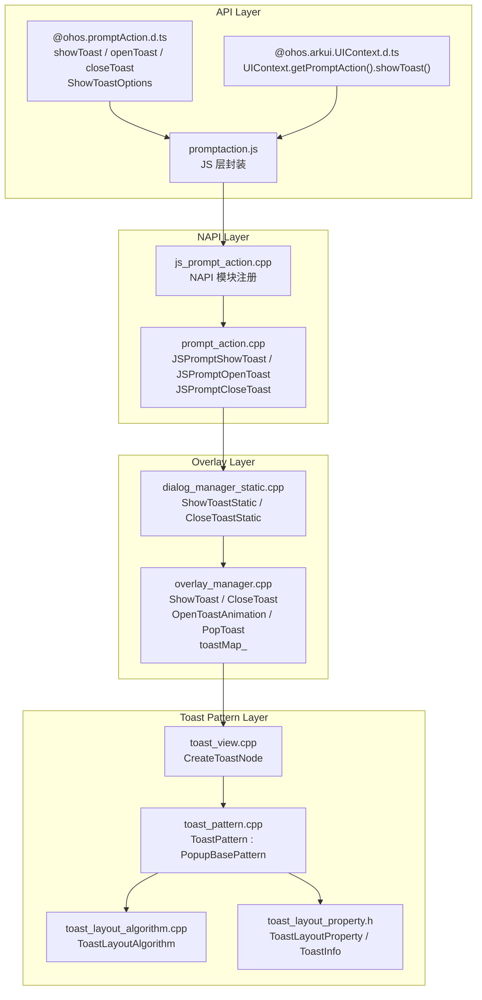
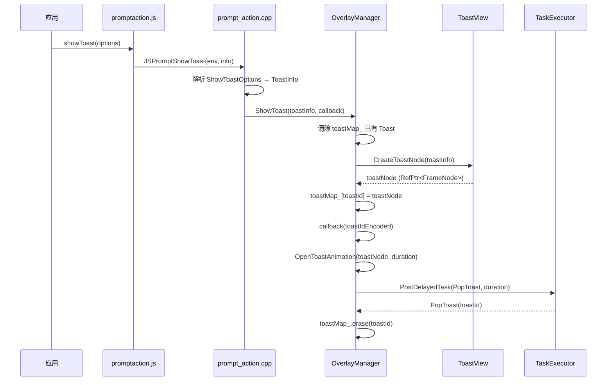

# 架构设计
> promptAction（Toast）的架构设计文档，覆盖 showToast / openToast / closeToast 命令式 API、ToastPattern 渲染、OverlayManager 管理和动画。

## 设计元数据

| 字段 | 内容 |
|------|------|
| Design ID | DESIGN-Func-05-06-10 |
| 关联需求 | 已有能力补录（无独立 requirement.md） |
| 关联 Epic | 无 |
| 目标 Feature | Feat-01: promptAction 全量规格（showToast/openToast/closeToast + ShowToastOptions） |
| 复杂度 | 标准 |
| 目标版本 | API 9 ~ API 26+ |
| Owner | ArkUI SIG |
| 状态 | Baselined（已有实现补录） |

## 需求基线

> 需求基线详见 proposal.md。以下仅列出设计阶段需要额外强调的要点。

| 项 | 补充说明（如需） |
|----|------------------|
| 命令式 API 演进 | showToast @since 9（deprecated 18）→ openToast/closeToast @since 18，返回 toastId 实现精确关闭 |
| UIContext 实例化 | UIContext.getPromptAction().showToast() @since 10，解决 ambiguous UI context 问题 |
| 单 Toast 策略 | ShowToast 先清除 toastMap_ 中所有已有 Toast 再显示新 Toast（API 9~17）；API 18+ 支持多 Toast |
| toastId 编码 | (toastId << 3) \| (showMode & 0b111)，高 29 位存 FrameNode ID，低 3 位存 showMode |
| 无组件化 | Toast 无 JSView/Bridge、无独立 SO、无 C API，纯命令式 NAPI → OverlayManager → ToastPattern 路径 |

## 上下文和现状

### 涉及仓和模块

| 仓库 | 模块路径 | 当前职责 | 本 Feature 影响 |
|------|----------|----------|-----------------|
| ace_engine | `interfaces/napi/kits/promptaction/prompt_action.cpp` | NAPI 实现：JSPromptShowToast / JSPromptOpenToast / JSPromptCloseToast | 规格补录 |
| ace_engine | `interfaces/napi/kits/promptaction/js_prompt_action.cpp` | NAPI 模块注册，"promptAction" 模块 | 规格补录 |
| ace_engine | `interfaces/napi/kits/promptaction/promptaction.js` | JS 层 showToast 封装 | 规格补录 |
| ace_engine | `frameworks/core/components_ng/pattern/toast/toast_pattern.cpp` | ToastPattern（继承 PopupBasePattern），Toast 显示/隐藏逻辑 | 规格补录 |
| ace_engine | `frameworks/core/components_ng/pattern/toast/toast_layout_algorithm.cpp` | ToastLayoutAlgorithm，Toast 布局计算 | 规格补录 |
| ace_engine | `frameworks/core/components_ng/pattern/toast/toast_layout_property.h` | ToastLayoutProperty、ToastInfo 数据结构 | 规格补录 |
| ace_engine | `frameworks/core/components_ng/pattern/toast/toast_view.cpp` | ToastView::CreateToastNode()，Toast 节点创建工厂 | 规格补录 |
| ace_engine | `frameworks/core/components_ng/pattern/overlay/overlay_manager.cpp` | OverlayManager::ShowToast/CloseToast/OpenToastAnimation/PopToast，toastMap_ 管理 | 规格补录 |
| ace_engine | `frameworks/core/components_ng/pattern/overlay/dialog_manager_static.cpp` | DialogManagerStatic::ShowToastStatic/CloseToastStatic，静态入口分发 | 规格补录 |
| interface/sdk-js | `api/@ohos.promptAction.d.ts` | Dynamic API 声明 | 规格对照 |
| interface/sdk-js | `api/@ohos.arkui.UIContext.d.ts` | UIContext.getPromptAction().showToast() 实例化 API | 规格对照 |

### 调用链层级分析

| 层 | 模块 | 职责 | 修改类型 |
|----|------|------|----------|
| JS API | `interfaces/napi/kits/promptaction/promptaction.js` | JS 层 showToast(options) 封装 | 无修改（规格补录） |
| NAPI 注册 | `interfaces/napi/kits/promptaction/js_prompt_action.cpp` | NAPI 模块注册，"showToast"→JSPromptShowToast，"openToast"→JSPromptOpenToast，"closeToast"→JSPromptCloseToast | 无修改（规格补录） |
| NAPI 实现 | `interfaces/napi/kits/promptaction/prompt_action.cpp` | JSPromptShowToast()/JSPromptOpenToast()/JSPromptCloseToast() 解析参数 → ShowToast()/CloseToast() 分发 | 无修改（规格补录） |
| 静态入口 | `frameworks/core/components_ng/pattern/overlay/dialog_manager_static.cpp` | DialogManagerStatic::ShowToastStatic()/CloseToastStatic()，静态入口分发 | 无修改（规格补录） |
| Overlay 管理 | `frameworks/core/components_ng/pattern/overlay/overlay_manager.cpp` | OverlayManager::ShowToast() 创建节点、toastMap_ 管理、OpenToastAnimation()/PopToast() 动画 | 无修改（规格补录） |
| Toast 节点 | `frameworks/core/components_ng/pattern/toast/toast_view.cpp` | ToastView::CreateToastNode() 创建 Toast FrameNode | 无修改（规格补录） |
| Toast Pattern | `frameworks/core/components_ng/pattern/toast/toast_pattern.cpp` | ToastPattern（继承 PopupBasePattern），Toast 生命周期管理 | 无修改（规格补录） |
| Toast 布局 | `frameworks/core/components_ng/pattern/toast/toast_layout_algorithm.cpp` | ToastLayoutAlgorithm，Toast 位置和尺寸计算 | 无修改（规格补录） |
| Toast 属性 | `frameworks/core/components_ng/pattern/toast/toast_layout_property.h` | ToastLayoutProperty + ToastInfo 结构体 | 无修改（规格补录） |

### 适用架构规则

| Rule ID | 适用原因 | 设计结论 | 验证方式 |
|---------|----------|----------|----------|
| OH-ARCH-LAYERING | Toast 涉及 NAPI → OverlayManager → ToastPattern → ToastLayoutAlgorithm 多层调用 | 调用方向自上而下，Pattern 不直接访问 NAPI 层 | 代码评审 |
| OH-ARCH-API-LEVEL | Toast 有 @since 9/10/11/12/14/18/26 等多版本 API | 各版本 API 通过 PlatformVersion 条件分支实现兼容 | API 评审 / XTS |
| OH-ARCH-SUBSYSTEM | Toast 涉及 SubwindowManager 跨窗口分发 | showToast 在子窗口场景由 SubwindowManager 分发 | 集成测试 |
| OH-ARCH-ERROR-LOG | Toast 使用 TAG ACE_OVERLAY / ACE_DIALOG 日志标签 | 关键路径覆盖 hilog 打点 | hilog |

## 不涉及项承接

> proposal.md 已完成 N/A 判定。本节仅对 proposal 中标记为"涉及"且需展开设计的维度给出结论。

| 维度 | 设计结论 |
|------|----------|
| 深色模式 | Toast 颜色属性使用 ResourceColor 类型，通过 ToastTheme 主题切换适配深色模式 |
| 多窗口/分屏 | Toast 通过 showMode（DEFAULT/TOP_MOST/SYSTEM_TOP_MOST）支持跨窗口显示，SYSTEM_TOP_MOST 在系统顶层窗口显示 |
| 版本升级兼容 | API 18 废弃 showToast，引入 openToast/closeToast；需在 spec 兼容性声明中明确 |

## 关键设计决策

| 决策 ID | 问题 | 推荐方案 | 探索过的替代方案 | 取舍理由 | 影响 |
|---------|------|----------|-----------------|----------|------|
| ADR-1 | Toast 是否使用声明式组件 | 否，使用命令式 NAPI API + OverlayManager 创建节点 | 声明式 Toast 组件 | Toast 是瞬态提示，无持久状态，命令式 API 更简洁；无需 JSView/Bridge 层 | 全部 AC |
| ADR-2 | API 18 是否废弃 showToast | 废弃，引入 openToast/closeToast 实现 toastId 精确关闭 | 修改 showToast 增加 toastId 返回值 | 保持旧 API 签名不变避免兼容性问题；新 API 语义更清晰 | AC-3.1, AC-3.2 |
| ADR-3 | Toast 显示前是否清除已有 Toast | API 9~17 清除所有已有 Toast（单 Toast 策略）；API 18+ 支持多 Toast | 始终支持多 Toast | 旧版本行为兼容；新版本通过 toastId 精确管理，避免误关闭 | AC-1.4, AC-3.3 |
| ADR-4 | toastId 编码方案 | (toastId << 3) \| (showMode & 0b111) | 独立 Map 存储 toastId→showMode | 将 showMode 编码到 toastId 低 3 位，回传时可直接解码，无需额外 Map | AC-3.4 |
| ADR-5 | Toast 动画曲线 | CubicCurve(0.2, 0, 0.1, 1.0)，opacity 0→1 + translate Y | 线性动画 | 该曲线提供自然的淡入效果，符合 Material Design 动画规范 | AC-2.1 |
| ADR-6 | Toast 是否暴露 C API | 否 | 暴露独立 C API | Toast 为瞬态提示，命令式 API 已满足需求；C API 场景可通过 NAPI 调用实现 | 无 |

## 设计骨架

### 骨架范围

| 骨架项 | 目标 | 不包含 | 验证方式 |
|--------|------|--------|----------|
| showToast 基础流程 | NAPI → OverlayManager → ToastView 节点创建 → 动画显示 → 定时关闭 | showDialog / showActionMenu / openCustomDialog | UT |
| openToast/closeToast | toastId 返回、精确关闭、多 Toast 管理 | showToast 废弃迁移 | UT |
| ShowToastOptions 全属性 | message/duration/bottom/showMode/alignment/offset/backgroundColor/textColor/backgroundBlurStyle/shadow/enableHoverMode/hoverModeArea/systemMaterial | 通用属性 | UT |
| Toast 动画 | 进入动画（CubicCurve + opacity + translate）+ 退出动画（PopToast） | 自定义动画 | UT + 手工 |
| showMode 分发 | DEFAULT / TOP_MOST / SYSTEM_TOP_MOST 三种窗口层级 | 子窗口内部路由 | UT |
| 折叠屏适配 | enableHoverMode + hoverModeArea | — | 手工 |

### 骨架 Spec 拆分

| Task ID | 目标 | 受影响文件 | AC |
|---------|------|-----------|-----|
| TASK-SKELETON-1 | promptAction 全量规格补录（showToast/openToast/closeToast + ShowToastOptions + 动画 + showMode） | Feat-01-prompt-action-full-spec.md | AC-1.1 ~ AC-7.4 |

## 后续 Task 拆分

| Task ID | 目标 | 受影响文件 | 依赖 |
|---------|------|-----------|------|
| TASK-PROMPT-ACTION-01 | promptAction 全量规格补录 | Feat-01-prompt-action-full-spec.md, design.md | 无 |

## API 签名、Kit 与权限

> 本节承接 spec.md"API 变更分析"中识别的 API，给出签名、权限和 d.ts 位置等实现细节。

### 新增 API

| API 签名 | 类型 | d.ts 位置 | 权限要求 | SysCap |
|----------|------|-----------|----------|--------|
| `promptAction.showToast(options: ShowToastOptions): void` | Public | `@ohos.promptAction.d.ts` | 无 | SystemCapability.ArkUI.ArkUI.Full |
| `promptAction.openToast(options: ShowToastOptions): Promise<number>` | Public | `@ohos.promptAction.d.ts` | 无 | 同上 |
| `promptAction.closeToast(toastId: number, showMode?: ToastShowMode): void` | Public | `@ohos.promptAction.d.ts` | 无 | 同上 |
| `UIContext.getPromptAction(): PromptAction` | Public | `@ohos.arkui.UIContext.d.ts` | 无 | 同上 |
| `PromptAction.showToast(options: ShowToastOptions): void` | Public | `@ohos.arkui.UIContext.d.ts` | 无 | 同上 |

### 变更/废弃 API

| 原有 API | 变更类型 | 新 API | 迁移说明 |
|----------|----------|--------|----------|
| `promptAction.showToast(options)` | 废弃（@since 9, @deprecated 18） | `promptAction.openToast(options)` | openToast 返回 toastId，配合 closeToast(toastId) 精确关闭 |

## 构建系统影响

### BUILD.gn 变更

Toast 无独立 SO，无组件化改造：

```
# frameworks/core/components_ng/pattern/toast/BUILD.gn
# Toast 作为 ace_engine 内部模块，随主工程编译
# 无 DynamicModule 注册，无独立 SO 输出
```

### bundle.json 变更

Toast 作为 ace_engine 内部模块，无独立 bundle.json 变更。

## 可选设计扩展

### 架构图



### 数据流/控制流

| 步骤 | 调用方 | 被调用方 | 数据/接口 | 说明 |
|------|--------|----------|-----------|------|
| 1 | ArkTS | promptaction.js | showToast(options) | JS 层封装调用 |
| 2 | promptaction.js | js_prompt_action.cpp | NAPI invoke | NAPI 模块分发 |
| 3 | js_prompt_action.cpp | prompt_action.cpp | JSPromptShowToast(env, info) | 参数解析入口 |
| 4 | prompt_action.cpp | ShowToast(env, toastInfo, callback) | ToastInfo 结构 | 参数组装 |
| 5 | ShowToast | delegate->ShowToast() / SubwindowManager::ShowToast() | showMode 分发 | 按窗口层级分发 |
| 6 | delegate | DialogManagerStatic::ShowToastStatic() | ToastInfo + callback | 静态入口 |
| 7 | ShowToastStatic | OverlayManager::ShowToast() | toastMap_ 管理 | 清除已有 Toast，创建新节点 |
| 8 | OverlayManager | ToastView::CreateToastNode() | ToastInfo | 创建 Toast FrameNode |
| 9 | OverlayManager | OpenToastAnimation() | CubicCurve(0.2,0,0.1,1.0) | 进入动画 |
| 10 | 定时器 | OverlayManager::PopToast() | toastId | duration 后关闭 |
| 11 | PopToast | toastMap_.erase(toastId) | — | 清理映射 |

### 时序设计



### 数据模型设计

**API 层类型 (TypeScript)**:

```typescript
// ShowToastOptions
interface ShowToastOptions {
  message: string;                    // @since 9
  duration?: number;                  // @since 9, default 1500, range [1500, 10000]
  bottom?: string | Resource;         // @since 9, default 80vp
  showMode?: ToastShowMode;           // @since 11, default DEFAULT
  alignment?: Alignment;              // @since 12
  offset?: Offset;                    // @since 12
  backgroundColor?: ResourceColor;    // @since 12
  textColor?: ResourceColor;          // @since 12
  backgroundBlurStyle?: BlurStyle;    // @since 12, default COMPONENT_ULTRA_THICK
  shadow?: Shadow;                   // @since 12, default OUTER_DEFAULT_MD
  enableHoverMode?: boolean;          // @since 14, default false
  hoverModeArea?: HoverModeAreaType;  // @since 14, default BOTTOM_SCREEN
  systemMaterial?: SystemUiMaterial;  // @since 26
}

// ToastShowMode enum
enum ToastShowMode { DEFAULT, TOP_MOST, SYSTEM_TOP_MOST }
```

**框架层结构 (C++)**:

```cpp
// ToastInfo (toast_layout_property.h:30-45)
struct ToastInfo {
    std::string message;
    int32_t duration = 0;
    std::string bottom;
    ToastShowMode showMode = ToastShowMode::DEFAULT;
    int32_t alignment = 0;
    std::optional<DimensionOffset> offset;
    std::optional<Color> backgroundColor;
    std::optional<Color> textColor;
    std::optional<int32_t> backgroundBlurStyle;
    std::optional<Shadow> shadow;
    bool enableHoverMode = false;
    HoverModeAreaType hoverModeArea = HoverModeAreaType::BOTTOM_SCREEN;
    RefPtr<UiMaterial> systemMaterial;
};
```

### 算法与状态机

```mermaid
stateDiagram-v2
    [*] --> Created : OverlayManager::ShowToast()
    Created --> Entering : OpenToastAnimation()
    Entering --> Visible : 动画完成 (opacity 0→1)
    Visible --> Exiting : duration 到期 → PopToast()
    Exiting --> Destroyed : 动画完成 + toastMap_.erase()
    Destroyed --> [*]

    Visible --> Exiting : closeToast(toastId) 手动关闭
```

### 测试性设计

| 测试层级 | 测试目标 | Mock 策略 | 验证方式 |
|----------|----------|-----------|----------|
| UT - OverlayManager | ShowToast/CloseToast/PopToast 流程 | MockOverlayManager | gtest_filter |
| UT - ToastPattern | Toast 节点创建和生命周期 | MockFrameNode | gtest_filter |
| UT - ToastLayoutAlgorithm | Toast 位置计算 | MockLayoutWrapper | gtest_filter |
| UT - NAPI | JSPromptShowToast/OpenToast/CloseToast 参数解析 | MockNapiEnv | gtest_filter |
| 手工 | 动画效果和视觉验证 | 真机 | 视觉比对 |

### 接口参数规约

| 接口 | 参数 | 类型 | 合法范围 | 非法处理 | 边界说明 |
|------|------|------|----------|----------|----------|
| showToast/openToast | message | string | 非空字符串 | 空字符串显示空 Toast | — |
| showToast/openToast | duration | number | [1500, 10000] ms | < 1500 取 1500，> 10000 取 10000 | 默认 1500 |
| showToast/openToast | bottom | string/Resource | 有效 Dimension | 默认 80vp | — |
| showToast/openToast | showMode | ToastShowMode | 0~2 | 越界取 DEFAULT | 0=DEFAULT, 1=TOP_MOST, 2=SYSTEM_TOP_MOST |
| closeToast | toastId | number | ≥ 0 | < 0 返回错误 | — |
| closeToast | showMode | ToastShowMode | 0~2 | 越界取 DEFAULT | 需与 openToast 时一致 |

### 线程与并发模型

| 操作 | 发起线程 | 回调线程 | 跨进程边界 | 线程安全 | 重入约束 |
|------|----------|----------|------------|----------|----------|
| showToast | UI 线程 | UI 线程 | 无 | toastMap_ 在 UI 线程访问 | 同一时刻仅一个 Toast（API 9~17） |
| openToast | UI 线程 | UI 线程（Promise resolve） | 无 | toastMap_ 在 UI 线程访问 | 支持多 Toast |
| closeToast | UI 线程 | UI 线程（callback） | 无 | toastMap_ 在 UI 线程访问 | — |
| PopToast（定时器） | TaskExecutor::UI | UI 线程 | 无 | PostDelayedTask 到 UI 线程 | — |

## 详细设计

### showToast 基础流程

`promptAction.showToast(options)` 调用链：

1. `promptaction.js::showToast(options)` → `js_prompt_action.cpp::JSPromptShowToast`（`prompt_action.cpp:537`）
2. `JSPromptShowToast` 解析 napi 参数为 `NG::ToastInfo`（`prompt_action.cpp:537-564`）
3. `ShowToast(env, toastInfo, toastCallback)` 分发：showMode=DEFAULT 走 `delegate->ShowToast()`，否则走 `SubwindowManager::ShowToast()`（`prompt_action.cpp:496-531`）
4. `OverlayManager::ShowToast(toastInfo, callback)`（`overlay_manager.cpp:579`）：
   - 清除 toastMap_ 中所有已有 Toast（`:589-593`）
   - `ToastView::CreateToastNode(toastInfo)` 创建新节点
   - `toastMap_[toastId] = toastNode`（`:603`）
   - callback 回传编码 toastId：`(toastId << 3) | (showMode & 0b111)`（`:606-607`）
   - `OpenToastAnimation(toastNode, duration)`（`:610`）

### openToast / closeToast（API 18+）

`promptAction.openToast(options)` → `JSPromptOpenToast`（`prompt_action.cpp:568`）：
- 与 showToast 相同的参数解析和分发流程
- 返回 `Promise<number>`，resolve 为编码 toastId

`promptAction.closeToast(toastId, showMode)` → `JSPromptCloseToast`（`prompt_action.cpp:649`）：
- 解析 toastId 和 showMode 参数（`:649-674`）
- `CloseToast(env, toastId, showMode)` 分发（`:608-644`）
- `OverlayManager::CloseToast(toastId, callback)`（`overlay_manager.cpp:620`）：
  - `toastMap_.find(toastId)` 查找节点（`:633`）
  - 未找到则返回错误
  - `PopToast(toastId)` 执行退出动画并移除（`:655`）

### toastId 编码方案

toastId 编码格式（`overlay_manager.cpp:606-607`）：

```
callbackToastId = (toastId << 3) | (showMode & 0b111)
```

- 高 29 位：FrameNode::GetId() 返回的 toastId
- 低 3 位：showMode 枚举值（0=DEFAULT, 1=TOP_MOST, 2=SYSTEM_TOP_MOST）

closeToast 时从 callbackToastId 解码：
- `toastId = callbackToastId >> 3`
- `showMode = callbackToastId & 0b111`

### Toast 动画

**进入动画** `OpenToastAnimation`（`overlay_manager.cpp:660-690`）：
- 曲线：`CubicCurve(0.2f, 0.0f, 0.1f, 1.0f)`（`:666`）
- opacity：0 → 1
- translate：Y 轴偏移 0
- duration 到期后触发 `PopToast`（`:671-690`）

**退出动画** `PopToast`（`overlay_manager.cpp:712-760`）：
- `PopLevelOrder(toastId)` 移除节点层级（`:716`）
- 曲线：`CubicCurve(0.2f, 0.0f, 0.1f, 1.0f)`（`:718`）
- opacity：1 → 0
- 动画完成后 `toastMap_.erase(toastId)`（`:739`）

### showMode 分发逻辑

`ShowToast` 中按 showMode 选择目标窗口（`overlay_manager.cpp:611-615`）：
- `DEFAULT`：挂载到当前页面的 overlay 节点
- `TOP_MOST`：挂载到顶层窗口的 overlay 节点
- `SYSTEM_TOP_MOST`：挂载到系统顶层窗口的 overlay 节点

### Toast 节点创建

`ToastView::CreateToastNode(toastInfo)`（`toast_view.cpp:31`）：
1. 创建 FrameNode（标签 `TOAST_ETS_TAG`）
2. `pattern->SetToastInfo(toastInfo)` 设置 ToastInfo 到 Pattern（`:59`）
3. 创建文本子节点，`UpdateTextLayoutProperty` 设置 message 和 textColor（`:61, 87`）
4. 解析 alignment 和 offset，更新 ToastLayoutProperty（`:64-71`）
5. `toastProperty->UpdateShowMode(toastInfo.showMode)`（`:77`）
6. 设置 backgroundColor、backgroundBlurStyle、shadow（`:241-342`）
7. `SetToastSystemMaterial` 设置 SystemMaterial（`:128`）

### Toast 布局

`ToastLayoutAlgorithm`（`toast_layout_algorithm.cpp`，185 行）：
- 根据 bottom（默认 80vp）计算 Toast 底部偏移
- 根据 alignment 和 offset 计算精确位置
- enableHoverMode 时适配折叠屏 hoverModeArea

## 风险和开放问题

| 项 | 类型 | 影响 | 处理方式 | Owner |
|----|------|------|----------|-------|
| showToast 废弃迁移 | API | 中 | API 18 废弃，需引导开发者迁移到 openToast/closeToast | ArkUI SIG |
| 多 Toast 场景内存 | 内存 | 低 | toastMap_ 管理多 Toast 节点，需确保退出时正确清理 | ArkUI SIG |
| Subwindow 分发一致性 | 架构 | 低 | showToast 在子窗口场景通过 SubwindowManager 分发，需确保 showMode 正确传递 | ArkUI SIG |
| systemMaterial @since 26 | 兼容性 | 低 | 新增属性需确保低版本设备降级处理 | ArkUI SIG |

## 设计审批

- [x] 需求基线已确认，设计覆盖 P0/P1 AC
- [x] 不涉及项已承接，N/A 和展开项都有结论
- [x] 涉及仓和模块职责清楚
- [x] 调用链层级分析完整，每层覆盖到位
- [x] 适用架构规则已识别并形成设计结论
- [x] 分层和子系统边界合规
- [x] API 变更有签名、权限、错误码和兼容性说明
- [x] BUILD.gn/bundle.json 影响明确
- [x] 设计输出和后续 Task 拆分明确
- [x] 关键设计决策有理由和影响说明
- [x] 风险和开放问题有 Owner

**结论:** 通过（已有实现补录）
