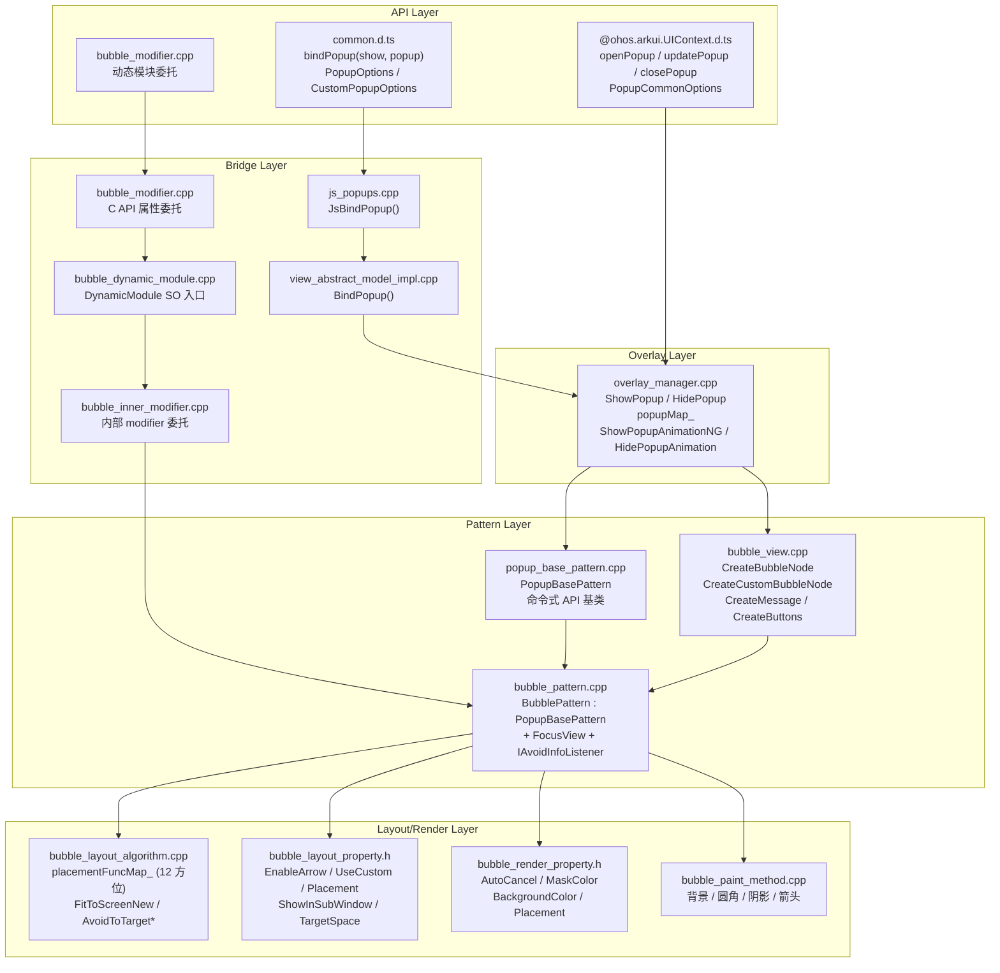
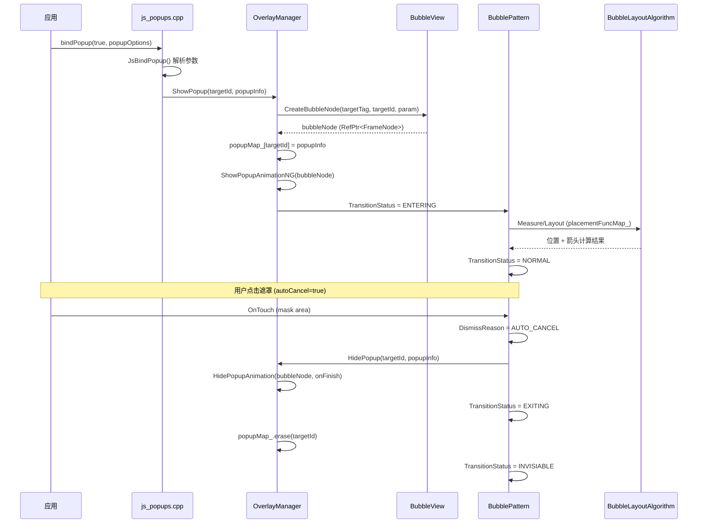
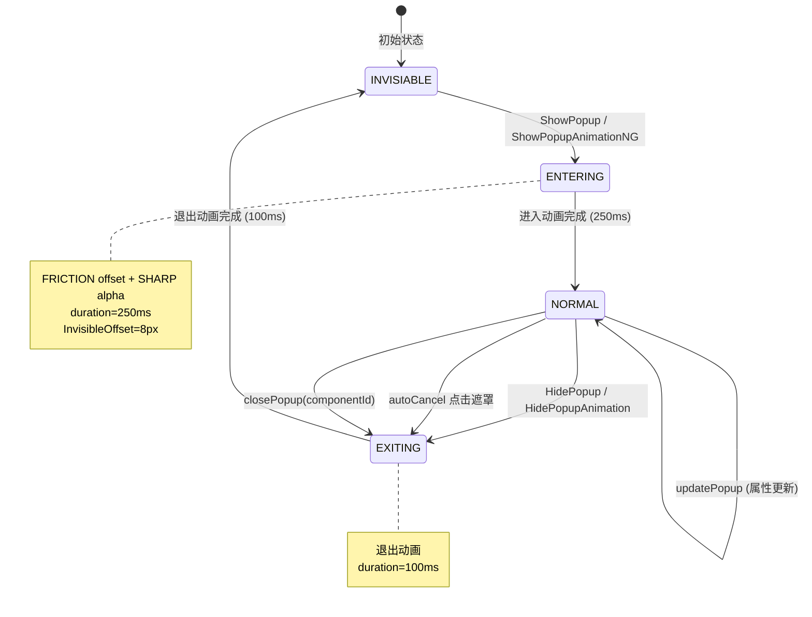

# 架构设计
> bindPopup 弹窗属性的架构设计文档，覆盖 BubblePattern 气泡渲染、BubbleLayoutAlgorithm 布局避让、PopupBasePattern 命令式 API、OverlayManager 管理和组件化。

## 设计元数据

| 字段 | 内容 |
|------|------|
| Design ID | DESIGN-Func-05-06-11 |
| 关联需求 | 已有能力补录（无独立 requirement.md） |
| 关联 Epic | 无 |
| 目标 Feature | Feat-01: bindPopup 全量规格（PopupOptions / CustomPopupOptions / PopupCommonOptions + BubblePattern + 命令式 API） |
| 复杂度 | 复杂 |
| 目标版本 | API 7 ~ API 26+ |
| Owner | ArkUI SIG |
| 状态 | Baselined（已有实现补录） |

## 需求基线

> 需求基线详见 proposal.md。以下仅列出设计阶段需要额外强调的要点。

| 项 | 补充说明（如需） |
|----|------------------|
| 双入口架构 | 声明式 bindPopup(show, popup) @since 7 + 命令式 openPopup/updatePopup/closePopup @since 18 |
| 三种 Options 类型 | PopupOptions（内置消息气泡，@since 7）、CustomPopupOptions（自定义 Builder 气泡，@since 8）、PopupCommonOptions（命令式 API 统一参数，@since 18） |
| 12 方位布局 | BubbleLayoutAlgorithm 通过 placementFuncMap_ 支持 12 种 Placement 方位 + NONE |
| 组件化改造 | Bubble Pattern 已完成组件化，输出独立 SO `libarkui_bubble.z.so` |
| 双 Pattern 架构 | BubblePattern（声明式 bindPopup）继承 PopupBasePattern（命令式 openPopup） |
| 避让算法 | BubbleLayoutAlgorithm 包含 FitToScreenNew、AvoidToTarget* 等避让策略（4146 行） |

## 上下文和现状

### 涉及仓和模块

| 仓库 | 模块路径 | 当前职责 | 本 Feature 影响 |
|------|----------|----------|-----------------|
| ace_engine | `frameworks/core/components_ng/pattern/bubble/bubble_pattern.cpp` | BubblePattern（继承 PopupBasePattern, FocusView, AutoFillTriggerStateHolder, IAvoidInfoListener），气泡显示/隐藏/动画/状态机 | 规格补录 |
| ace_engine | `frameworks/core/components_ng/pattern/bubble/bubble_layout_algorithm.cpp` | BubbleLayoutAlgorithm，气泡位置/箭头/避让计算（4146 行） | 规格补录 |
| ace_engine | `frameworks/core/components_ng/pattern/bubble/bubble_layout_property.h` | BubbleLayoutProperty（EnableArrow/UseCustom/IsTips/Placement/ShowInSubWindow/TargetSpace/ArrowWidth/ArrowHeight 等） | 规格补录 |
| ace_engine | `frameworks/core/components_ng/pattern/bubble/bubble_render_property.h` | BubbleRenderProperty（AutoCancel/MaskColor/BackgroundColor/Placement 等） | 规格补录 |
| ace_engine | `frameworks/core/components_ng/pattern/bubble/bubble_view.cpp` | BubbleView::CreateBubbleNode / CreateCustomBubbleNode / CreateMessage / CreateButtons（1536 行） | 规格补录 |
| ace_engine | `frameworks/core/components_ng/pattern/bubble/bubble_paint_method.cpp` | BubblePaintMethod，气泡背景/圆角/阴影/箭头绘制 | 规格补录 |
| ace_engine | `frameworks/core/components_ng/pattern/overlay/popup_base_pattern.cpp` | PopupBasePattern，命令式 openPopup/updatePopup/closePopup 基类 | 规格补录 |
| ace_engine | `frameworks/core/components_ng/pattern/overlay/overlay_manager.cpp` | OverlayManager::ShowPopup/HidePopup，popupMap_ 管理，ShowPopupAnimation/HidePopupAnimation | 规格补录 |
| ace_engine | `frameworks/bridge/declarative_frontend/jsview/js_popups.cpp` | JSViewAbstract::JsBindPopup()，bindPopup 属性解析入口 | 规格补录 |
| ace_engine | `frameworks/bridge/declarative_frontend/jsview/models/view_abstract_model_impl.cpp` | ViewAbstractModelImpl::BindPopup()，Model 层实现 | 规格补录 |
| ace_engine | `frameworks/core/components_ng/pattern/bubble/bridge/` | 组件化 Bridge / DynamicModule（libarkui_bubble.z.so 入口） | 规格补录 |
| ace_engine | `frameworks/core/interfaces/native/node/bubble_modifier.cpp` | C++ 属性委托层（bubble_modifier，动态模块加载） | 规格补录 |
| interface/sdk-js | `api/@internal/component/ets/common.d.ts` | bindPopup 属性声明；PopupOptions / CustomPopupOptions 类型 | 规格对照 |
| interface/sdk-js | `api/@ohos.arkui.UIContext.d.ts` | openPopup / updatePopup / closePopup 命令式 API | 规格对照 |

### 调用链层级分析

| 层 | 模块 | 职责 | 修改类型 |
|----|------|------|----------|
| JS Bridge (声明式) | `frameworks/bridge/declarative_frontend/jsview/js_popups.cpp` | JSViewAbstract::JsBindPopup() 解析 bindPopup 参数（PopupOptions / CustomPopupOptions）→ ViewAbstractModel::BindPopup() | 无修改（规格补录） |
| Model (声明式) | `frameworks/bridge/declarative_frontend/jsview/models/view_abstract_model_impl.cpp` | ViewAbstractModelImpl::BindPopup() 注册事件 | 无修改（规格补录） |
| JS Bridge (命令式) | `@ohos.arkui.UIContext.d.ts` → PromptAction | openPopup / updatePopup / closePopup 命令式 API | 无修改（规格补录） |
| Overlay 管理 | `frameworks/core/components_ng/pattern/overlay/overlay_manager.cpp` | OverlayManager::ShowPopup / HidePopup，popupMap_ 管理，ShowPopupAnimationNG / HidePopupAnimation | 无修改（规格补录） |
| Popup Base Pattern | `frameworks/core/components_ng/pattern/overlay/popup_base_pattern.cpp` | PopupBasePattern，命令式 API 基类（openPopup/updatePopup/closePopup） | 无修改（规格补录） |
| Bubble Pattern | `frameworks/core/components_ng/pattern/bubble/bubble_pattern.cpp` | BubblePattern（继承 PopupBasePattern + FocusView + AutoFillTriggerStateHolder + IAvoidInfoListener），气泡生命周期/动画/状态机 | 无修改（规格补录） |
| Bubble View | `frameworks/core/components_ng/pattern/bubble/bubble_view.cpp` | BubbleView::CreateBubbleNode / CreateCustomBubbleNode / CreateMessage / CreateButtons | 无修改（规格补录） |
| Bubble Layout | `frameworks/core/components_ng/pattern/bubble/bubble_layout_algorithm.cpp` | BubbleLayoutAlgorithm，placementFuncMap_（12 方位）、FitToScreenNew、AvoidToTarget* 避让策略 | 无修改（规格补录） |
| Bubble Property | `frameworks/core/components_ng/pattern/bubble/bubble_layout_property.h` | BubbleLayoutProperty（EnableArrow/UseCustom/IsTips/Placement/ShowInSubWindow/TargetSpace/ArrowWidth/ArrowHeight） | 无修改（规格补录） |
| Bubble Render Property | `frameworks/core/components_ng/pattern/bubble/bubble_render_property.h` | BubbleRenderProperty（AutoCancel/MaskColor/BackgroundColor/Placement） | 无修改（规格补录） |
| Bubble Paint | `frameworks/core/components_ng/pattern/bubble/bubble_paint_method.cpp` | BubblePaintMethod，气泡背景/圆角/阴影/箭头绘制 | 无修改（规格补录） |
| C-API (modifier) | `frameworks/core/interfaces/native/node/bubble_modifier.cpp` | bubble_modifier 委托层，通过 DynamicModuleHelper 转发到动态模块 | 无修改（规格补录） |
| 组件化 Bridge | `frameworks/core/components_ng/pattern/bubble/bridge/bubble_dynamic_module.cpp` | BubbleDynamicModule，libarkui_bubble.z.so 入口 | 无修改（规格补录） |

### 适用架构规则

| Rule ID | 适用原因 | 设计结论 | 验证方式 |
|---------|----------|----------|----------|
| OH-ARCH-LAYERING | bindPopup 涉及 JSView → Model → OverlayManager → BubblePattern → BubbleLayoutAlgorithm 多层调用 | 调用方向自上而下，Pattern 不直接访问 JSView 层 | 代码评审 |
| OH-ARCH-API-LEVEL | bindPopup 有 @since 7/8/9/10/11/12/18/22/23/26 等多版本 API | 各版本 API 通过 PlatformVersion 条件分支实现兼容 | API 评审 / XTS |
| OH-ARCH-COMPONENT-BUILD | Bubble Pattern 已组件化为独立 SO（libarkui_bubble.z.so） | DynamicModule 注册机制，通过 BubbleDynamicModule 入口 | 构建验证 |
| OH-ARCH-SUBSYSTEM | Bubble 涉及 SubwindowManager 跨窗口分发（showInSubWindow） | showInSubWindow=true 时由 SubwindowManager 创建子窗口 | 集成测试 |
| OH-ARCH-ERROR-LOG | Bubble 使用 TAG ACE_OVERLAY / ACE_DIALOG 日志标签 | 关键路径覆盖 hilog 打点 | hilog |

## 不涉及项承接

> proposal.md 已完成 N/A 判定。本节仅对 proposal 中标记为"涉及"且需展开设计的维度给出结论。

| 维度 | 设计结论 |
|------|----------|
| 无障碍 | BubblePattern 实现 BubbleAccessibilityProperty，支持气泡内容的无障碍读取和操作响应 |
| 深色模式 | 颜色属性使用 ResourceColor 类型，通过 PopupThemeWrapper 主题切换适配深色模式 |
| 多窗口/分屏 | showInSubWindow=true 时在子窗口中创建气泡，支持跨窗口显示 |
| 版本升级兼容 | API 18 引入命令式 openPopup/updatePopup/closePopup；API 12 引入 transition；需在 spec 兼容性声明中明确 |
| 焦点管理 | BubblePattern 继承 FocusView，focusable=true 时支持键盘焦点导航 |

## 关键设计决策

| 决策 ID | 问题 | 推荐方案 | 探索过的替代方案 | 取舍理由 | 影响 |
|---------|------|----------|-----------------|----------|------|
| ADR-1 | bindPopup 使用哪种 Pattern | BubblePattern（继承 PopupBasePattern），声明式和命令式共用渲染层 | 独立 Pattern 分别实现 | 声明式和命令式共享 BubbleLayoutAlgorithm 避让算法和 BubblePaintMethod 绘制逻辑，避免重复 | 全部 AC |
| ADR-2 | 气泡位置计算策略 | BubbleLayoutAlgorithm 使用 placementFuncMap_（12 方位函数指针）+ FitToScreenNew + AvoidToTarget* 避让 | 固定方位计算 | 函数指针映射支持灵活扩展新方位；避让算法确保气泡始终可见 | AC-4.1 ~ AC-4.4 |
| ADR-3 | 是否使用子窗口 | showInSubWindow 属性控制，默认 true（API 9+） | 始终使用 overlay 层 | 子窗口提供独立渲染上下文，避免被宿主节点裁剪；但消耗更多资源 | AC-5.1, AC-5.2 |
| ADR-4 | 进入/退出动画参数 | 进入 250ms（FRICTION offset + SHARP alpha），退出 100ms | 统一 250ms | 进入动画需要展示位移，使用 FRICTION 曲线；退出动画仅需淡出，使用更短时长 | AC-3.1, AC-3.2 |
| ADR-5 | InvisibleOffset 值 | 8.0_px（`bubble_pattern.cpp:44`） | 0（无偏移） | 8px 偏移提供气泡进入时的视觉位移效果，使动画更自然 | AC-3.1 |
| ADR-6 | 状态机设计 | TransitionStatus 枚举（INVISIABLE/ENTERING/NORMAL/EXITING） | 二态（visible/invisible） | 四态状态机精确描述过渡阶段，避免动画重叠和状态混淆 | AC-3.3, AC-3.4 |
| ADR-7 | 组件化方案 | Bubble Pattern 输出独立 SO libarkui_bubble.z.so | 随主工程编译 | 组件化减少主工程体积；通过 DynamicModule 注册机制按需加载 | — |
| ADR-8 | 命令式 API 架构 | PopupBasePattern 作为基类，openPopup/updatePopup/closePopup 通过 ComponentContent + TargetInfo 管理 | 独立管理器 | 复用 BubblePattern 的渲染和布局能力；PopupBasePattern 提供统一的命令式生命周期管理 | AC-6.1 ~ AC-6.4 |
| ADR-9 | autoCancel 默认值 | true（API 11+） | false | 默认允许点击遮罩关闭气泡，符合常见交互预期 | AC-7.1 |
| ADR-10 | focusable 默认值 | false（API 12+） | true | 气泡默认不获取焦点，避免干扰宿主组件的焦点链；需要时显式设置 focusable=true | AC-8.1 |

## 设计骨架

### 骨架范围

| 骨架项 | 目标 | 不包含 | 验证方式 |
|--------|------|--------|----------|
| PopupOptions 内置气泡 | message / placement / primaryButton / secondaryButton / onStateChange / arrowOffset / showInSubWindow / mask / messageOptions / targetSpace / enableArrow / offset / popupColor / autoCancel / width / arrowPointPosition / arrowWidth / arrowHeight / radius / shadow / backgroundBlurStyle / focusable / transition | CustomPopupOptions 的 builder 内容 | UT |
| CustomPopupOptions 自定义气泡 | builder / placement / popupColor / enableArrow / autoCancel / onStateChange / arrowOffset / showInSubWindow / mask / targetSpace / offset / width / arrowPointPosition / arrowWidth / arrowHeight / radius / shadow / backgroundBlurStyle / focusable / transition | — | UT |
| PopupCommonOptions 命令式 | openPopup / updatePopup / closePopup（@since 18），ComponentContent + TargetInfo | 声明式 bindPopup 属性入口 | UT |
| 12 方位布局 | TOP / TOP_LEFT / TOP_RIGHT / BOTTOM / BOTTOM_LEFT / BOTTOM_RIGHT / LEFT / LEFT_TOP / LEFT_BOTTOM / RIGHT / RIGHT_TOP / RIGHT_BOTTOM + NONE | 自定义方位 | UT |
| 避让策略 | FitToScreenNew / AvoidToTarget* / BubbleAvoidanceRule | — | UT |
| 进入/退出动画 | 进入 250ms（FRICTION offset + SHARP alpha），退出 100ms，InvisibleOffset=8px | 自定义 transition（@since 12） | UT + 手工 |
| 状态机 | TransitionStatus（INVISIABLE/ENTERING/NORMAL/EXITING）+ DismissReason | — | UT |
| 组件化 | libarkui_bubble.z.so，BubbleDynamicModule | — | 构建验证 |
| C API | bubble_modifier.cpp（动态模块加载） | 独立 NODE 枚举 | C API UT |

### 骨架 Spec 拆分

| Task ID | 目标 | 受影响文件 | AC |
|---------|------|-----------|-----|
| TASK-SKELETON-1 | bindPopup 全量规格补录（PopupOptions / CustomPopupOptions / PopupCommonOptions + BubblePattern + 布局避让 + 动画 + 命令式 API + 组件化） | Feat-01-bind-popup-full-spec.md | AC-1.1 ~ AC-10.4 |

## 后续 Task 拆分

| Task ID | 目标 | 受影响文件 | 依赖 |
|---------|------|-----------|------|
| TASK-BIND-POPUP-01 | bindPopup 全量规格补录 | Feat-01-bind-popup-full-spec.md, design.md | 无 |

## API 签名、Kit 与权限

> 本节承接 spec.md"API 变更分析"中识别的 API，给出签名、权限和 d.ts 位置等实现细节。

### 新增 API

| API 签名 | 类型 | d.ts 位置 | 权限要求 | SysCap |
|----------|------|-----------|----------|--------|
| `.bindPopup(show: boolean, popup: PopupOptions \| CustomPopupOptions): T` | Public | `@internal/component/ets/common.d.ts` | 无 | SystemCapability.ArkUI.ArkUI.Full |
| `UIContext.PromptAction.openPopup(options: PopupCommonOptions, target: TargetInfo): Promise<number>` | Public | `@ohos.arkui.UIContext.d.ts` | 无 | 同上 |
| `UIContext.PromptAction.updatePopup(componentId: number, options: PopupCommonOptions): void` | Public | `@ohos.arkui.UIContext.d.ts` | 无 | 同上 |
| `UIContext.PromptAction.closePopup(componentId: number): void` | Public | `@ohos.arkui.UIContext.d.ts` | 无 | 同上 |

### 变更/废弃 API

| 原有 API | 变更类型 | 新 API | 迁移说明 |
|----------|----------|--------|----------|
| `bindPopup(show, popup: PopupOptions)` placementOnTop | 废弃（@since 7, @deprecated 10） | `placement: Placement` | 使用 placement 属性替代 placementOnTop |

## 构建系统影响

### BUILD.gn 变更

Bubble Pattern 已完成组件化改造，输出独立 SO：

```
# frameworks/core/components_ng/pattern/bubble/BUILD.gn
# 构建目标：libarkui_bubble.z.so
# DynamicModule 入口：bubble_dynamic_module.cpp
# 包含 BubblePattern / BubbleLayoutAlgorithm / BubbleView / BubblePaintMethod / Bridge 代码
```

### bundle.json 变更

Bubble 组件作为 ace_engine 的内部 component，无独立 bundle.json 变更。

## 可选设计扩展

### 架构图



### 数据流/控制流

| 步骤 | 调用方 | 被调用方 | 数据/接口 | 说明 |
|------|--------|----------|-----------|------|
| 1 | ArkTS | js_popups.cpp | JsBindPopup(show, popup) | bindPopup 属性设置 |
| 2 | js_popups.cpp | view_abstract_model_impl.cpp | BindPopup(param, customNode) | Model 层注册 |
| 3 | Model | OverlayManager::ShowPopup | PopupInfo | 挂载气泡节点 |
| 4 | OverlayManager | BubbleView::CreateBubbleNode / CreateCustomBubbleNode | targetTag, targetId, popupParam | 创建气泡节点 |
| 5 | OverlayManager | ShowPopupAnimationNG(popupNode) | — | 进入动画 |
| 6 | BubblePattern | BubbleLayoutAlgorithm::Measure/Layout | placementFuncMap_[placement] | 位置和箭头计算 |
| 7 | 用户交互 | BubblePattern::OnTouch / autoCancel | — | 自动关闭 |
| 8 | OverlayManager | HidePopupAnimation(popupNode, onFinish) | — | 退出动画 |
| 9 | 动画完成 | popupMap_.erase / toastMap_ 清理 | — | 清理映射 |

### 时序设计



### 数据模型设计

**API 层类型 (TypeScript)**:

```typescript
// PopupOptions (@since 7)
interface PopupOptions {
  message: string;                          // @since 7
  placement?: Placement;                     // @since 10, default Bottom
  primaryButton?: { value: string; action: () => void };  // @since 7
  secondaryButton?: { value: string; action: () => void }; // @since 7
  onStateChange?: (event: { isVisible: boolean; reason: DismissReason }) => void;  // @since 7
  arrowOffset?: Length;                      // @since 9
  showInSubWindow?: boolean;                 // @since 9
  mask?: boolean | ResourceColor;            // @since 10
  messageOptions?: MessageOptions;           // @since 10
  targetSpace?: Length;                      // @since 10, default 8vp
  enableArrow?: boolean;                     // @since 10, default true
  offset?: Position;                         // @since 10
  popupColor?: Color | string | Resource;   // @since 11
  autoCancel?: boolean;                      // @since 11, default true
  width?: Dimension | string | Resource;    // @since 11
  arrowPointPosition?: ArrowPointPosition;  // @since 11
  arrowWidth?: Dimension;                    // @since 11, default 16vp
  arrowHeight?: Dimension;                   // @since 11, default 8vp
  radius?: Dimension;                        // @since 11, default 20vp
  shadow?: Shadow | ShadowStyle;            // @since 11
  backgroundBlurStyle?: BlurStyle;          // @since 11
  focusable?: boolean;                       // @since 11, default false (@since 12)
  transition?: Transition;                   // @since 12
}

// CustomPopupOptions (@since 8)
interface CustomPopupOptions {
  builder: CustomBuilder;                   // @since 8
  // ... (同 PopupOptions 除 message/primaryButton/secondaryButton/messageOptions 外)
}

// PopupCommonOptions (@since 18) - 命令式 API 统一参数
interface PopupCommonOptions {
  // ... (合并 PopupOptions 和 CustomPopupOptions 的公共属性)
}

// PopupMaskType (@since 18)
enum PopupMaskType { DEFAULT, TRANSPARENT, LIGHT, DARK }
```

**框架层结构 (C++)**:

```cpp
// BubbleLayoutProperty (bubble_layout_property.h)
ACE_DEFINE_PROPERTY_ITEM_WITHOUT_GROUP(EnableArrow, bool, PROPERTY_UPDATE_MEASURE);
ACE_DEFINE_PROPERTY_ITEM_WITHOUT_GROUP(UseCustom, bool, PROPERTY_UPDATE_MEASURE);
ACE_DEFINE_PROPERTY_ITEM_WITHOUT_GROUP(IsTips, bool, PROPERTY_UPDATE_RENDER);
ACE_DEFINE_PROPERTY_ITEM_WITHOUT_GROUP(Placement, Placement, PROPERTY_UPDATE_MEASURE);
ACE_DEFINE_PROPERTY_ITEM_WITHOUT_GROUP(ShowInSubWindow, bool, PROPERTY_UPDATE_MEASURE);
ACE_DEFINE_PROPERTY_ITEM_WITHOUT_GROUP(TargetSpace, Dimension, PROPERTY_UPDATE_RENDER);
ACE_DEFINE_PROPERTY_ITEM_WITHOUT_GROUP(ArrowHeight, Dimension, PROPERTY_UPDATE_LAYOUT);
ACE_DEFINE_PROPERTY_ITEM_WITHOUT_GROUP(ArrowWidth, Dimension, PROPERTY_UPDATE_LAYOUT);

// BubbleRenderProperty (bubble_render_property.h)
ACE_DEFINE_PROPERTY_ITEM_WITHOUT_GROUP(AutoCancel, bool, PROPERTY_UPDATE_RENDER);
ACE_DEFINE_PROPERTY_ITEM_WITHOUT_GROUP(MaskColor, Color, PROPERTY_UPDATE_RENDER);
ACE_DEFINE_PROPERTY_ITEM_WITHOUT_GROUP(BackgroundColor, Color, PROPERTY_UPDATE_RENDER);
ACE_DEFINE_PROPERTY_ITEM_WITHOUT_GROUP(Placement, Placement, PROPERTY_UPDATE_RENDER);

// TransitionStatus (bubble_pattern.h:42-46)
enum class TransitionStatus { INVISIABLE, ENTERING, NORMAL, EXITING };

// DismissReason (bubble_pattern.h:49)
enum class DismissReason { ... };
```

### 算法与状态机



### 测试性设计

| 测试层级 | 测试目标 | Mock 策略 | 验证方式 |
|----------|----------|-----------|----------|
| UT - BubblePattern | 状态机转换、autoCancel、focusable | MockRenderContext | gtest_filter |
| UT - BubbleLayoutAlgorithm | 12 方位布局计算、避让策略 | MockLayoutWrapper | gtest_filter |
| UT - BubbleView | CreateBubbleNode / CreateCustomBubbleNode | MockFrameNode | gtest_filter |
| UT - OverlayManager | ShowPopup / HidePopup / popupMap_ 管理 | MockOverlayManager | gtest_filter |
| UT - PopupBasePattern | 命令式 openPopup / updatePopup / closePopup | MockComponentContent | gtest_filter |
| UT - C API | bubble_modifier Set/Reset/Get | C API UT 框架 | capi_all_modifiers_test |
| 手工 | 动画效果和避让视觉验证 | 真机 | 视觉比对 |

### 接口参数规约

| 接口 | 参数 | 类型 | 合法范围 | 非法处理 | 边界说明 |
|------|------|------|----------|----------|----------|
| bindPopup | show | boolean | true/false | — | true=显示 false=隐藏 |
| bindPopup | popup | PopupOptions \| CustomPopupOptions | 有效对象 | — | — |
| PopupOptions | message | string | 非空字符串 | 空字符串显示空气泡 | — |
| PopupOptions | placement | Placement | 12 方位 + NONE | 默认 Bottom | — |
| PopupOptions | duration | number | — | — | 已废弃，由 autoCancel 替代 |
| PopupOptions | targetSpace | Length | ≥ 0 | 默认 8vp | — |
| PopupOptions | enableArrow | boolean | true/false | 默认 true | false 时隐藏箭头 |
| PopupOptions | autoCancel | boolean | true/false | 默认 true | 点击遮罩关闭 |
| PopupOptions | focusable | boolean | true/false | 默认 false (@since 12) | — |
| PopupOptions | arrowWidth | Dimension | ≥ 0 | 默认 16vp | — |
| PopupOptions | arrowHeight | Dimension | ≥ 0 | 默认 8vp | — |
| PopupOptions | radius | Dimension | ≥ 0 | 默认 20vp | — |
| openPopup | componentId | number | ≥ 0 | — | — |
| closePopup | componentId | number | ≥ 0 | 不存在则忽略 | — |

### 线程与并发模型

| 操作 | 发起线程 | 回调线程 | 跨进程边界 | 线程安全 | 重入约束 |
|------|----------|----------|------------|----------|----------|
| bindPopup (show=true) | UI 线程 | UI 线程 | 无 | popupMap_ 在 UI 线程访问 | 同一 target 同时仅一个气泡 |
| openPopup | UI 线程 | UI 线程（Promise resolve） | 无 | popupMap_ 在 UI 线程访问 | — |
| updatePopup | UI 线程 | UI 线程 | 无 | 属性更新在 UI 线程 | — |
| closePopup | UI 线程 | UI 线程 | 无 | popupMap_ 在 UI 线程访问 | — |
| onStateChange | UI 线程 | UI 线程（callback） | 无 | — | — |

## 详细设计

### BubblePattern 状态机

BubblePattern 使用 `TransitionStatus` 枚举（`bubble_pattern.h:42-46`）管理气泡生命周期：

- `INVISIABLE`：初始状态或退出动画完成后的状态
- `ENTERING`：进入动画进行中（250ms，FRICTION offset + SHARP alpha）
- `NORMAL`：正常显示状态
- `EXITING`：退出动画进行中（100ms）

状态转换通过 `SetTransitionStatus()`（`bubble_pattern.h:213`）触发。

`DismissReason` 枚举（`bubble_pattern.h:49`）记录关闭原因，通过 `onStateChange` 回调传递。

### 进入/退出动画

**进入动画**（`bubble_pattern.cpp:42, 645-663, 724-732`）：
- 持续时间：250ms（`ENTRY_ANIMATION_DURATION = 250`，`:42`）
- offset 动画：Curves::FRICTION（`:645`），从 `InvisibleOffset`（8px，`:44`）到 0
- alpha 动画：Curves::SHARP（`:663`），0 → 1

**退出动画**（`bubble_pattern.cpp:43, 724-745`）：
- 持续时间：100ms（`EXIT_ANIMATION_DURATION = 100`，`:43`）
- offset 动画：Curves::FRICTION（`:724`），0 到 `InvisibleOffset`（`:732`）
- alpha 动画：Curves::SHARP（`:745`），1 → 0

**InvisibleOffset**（`bubble_pattern.cpp:44, 779`）：
- 值：`8.0_px`（`:44`）
- 用于进入/退出动画时的位移偏移

### 12 方位布局

BubbleLayoutAlgorithm 通过 `placementFuncMap_`（`bubble_layout_algorithm.cpp:279-290`）映射 12 种 Placement 到对应的位置计算函数：

| Placement | 函数 |
|-----------|------|
| TOP | GetPositionWithPlacementTop |
| TOP_LEFT | GetPositionWithPlacementTopLeft |
| TOP_RIGHT | GetPositionWithPlacementTopRight |
| BOTTOM | GetPositionWithPlacementBottom |
| BOTTOM_LEFT | GetPositionWithPlacementBottomLeft |
| BOTTOM_RIGHT | GetPositionWithPlacementBottomRight |
| LEFT | GetPositionWithPlacementLeft |
| LEFT_TOP | GetPositionWithPlacementLeftTop |
| LEFT_BOTTOM | GetPositionWithPlacementLeftBottom |
| RIGHT | GetPositionWithPlacementRight |
| RIGHT_TOP | GetPositionWithPlacementRightTop |
| RIGHT_BOTTOM | GetPositionWithPlacementRightBottom |

方位分组（`:292-294`）：
- `setHorizontal_`：LEFT, LEFT_BOTTOM, LEFT_TOP, RIGHT, RIGHT_BOTTOM, RIGHT_TOP
- `setVertical_`：TOP, TOP_LEFT, TOP_RIGHT, BOTTOM, BOTTOM_LEFT, BOTTOM_RIGHT

### 避让策略

BubbleLayoutAlgorithm（4146 行）包含以下避让策略：
- `FitToScreenNew`：当气泡超出屏幕边界时自动调整位置确保可见
- `AvoidToTarget*`：避免遮挡目标节点
- `BubbleAvoidanceRule`：避让规则配置

`FOLLOW_CURSOR_TIPS`（`:95-97`）定义跟随光标的 Tips 方位集合。

### BubbleView 节点创建

`BubbleView::CreateBubbleNode`（`bubble_view.cpp:261`）：
1. 创建 Bubble FrameNode（标签 `BUBBLE_ETS_TAG`）
2. 创建 BubblePattern
3. `CreateMessage(message, useCustom, popupTheme)` 创建文本子节点（`:380, 967`）
4. `CreateButtons(param, popupId, targetId, popupTheme)` 创建按钮子节点（`:1068, 1091`）

`BubbleView::CreateCustomBubbleNode`（`:462`）：
- 使用 CustomBuilder 创建自定义内容子节点

### OverlayManager Popup 管理

`OverlayManager::ShowPopup`（`overlay_manager.cpp:944`）：
1. `popupMap_[targetId] = popupInfo`（`:1253`）
2. `ShowPopupAnimationNG(popupNode)` 或 `ShowPopupAnimation(popupNode)`（`:1323-1325`）
3. `popupMap_[targetId].isCurrentOnShow = true`（`:1312`）

`OverlayManager::HidePopup`（`overlay_manager.cpp:1367`）：
1. `HidePopupAnimation(popupNode, onFinish)`（`:1429`）
2. `popupMap_[targetId].isCurrentOnShow = false`（`:1408, 1418`）
3. 动画完成后 `popupMap_.erase`

### PopupBasePattern 命令式 API

`PopupBasePattern`（`popup_base_pattern.cpp`）作为命令式 API 基类：
- `openPopup(options: PopupCommonOptions, target: TargetInfo)` → 创建 ComponentContent + BubblePattern 节点
- `updatePopup(componentId: number, options: PopupCommonOptions)` → 更新已有气泡属性
- `closePopup(componentId: number)` → 关闭指定气泡

### 组件化（libarkui_bubble.z.so）

Bubble Pattern 已完成组件化改造：
- `bridge/bubble_dynamic_module.cpp`：BubbleDynamicModule 派生类，SO 入口
- `bridge/inner_modifier/bubble_inner_modifier.cpp`：内部 modifier 委托
- `frameworks/core/interfaces/native/node/bubble_modifier.cpp`：C API 属性委托，通过 DynamicModuleHelper 转发到动态模块

### C API（bubble_modifier）

C API 通过 `bubble_modifier.cpp`（35 行）委托到 DynamicModuleHelper：
- 不暴露独立 `ARKUI_NODE_*` 枚举
- 使用 modifier-based C API，通过属性设置委托到 BubbleDynamicModule

## 风险和开放问题

| 项 | 类型 | 影响 | 处理方式 | Owner |
|----|------|------|----------|-------|
| BubbleLayoutAlgorithm 复杂度高 | 架构 | 中 | 4146 行布局算法，需确保各方位和避让策略的测试覆盖率 | ArkUI SIG |
| 命令式与声明式双入口一致性 | 架构 | 中 | openPopup 和 bindPopup 共用 BubblePattern，需确保属性更新和状态机行为一致 | ArkUI SIG |
| showInSubWindow 子窗口资源 | 性能 | 低 | 子窗口创建消耗额外资源，需确保关闭时正确销毁 | ArkUI SIG |
| API 7~26 跨版本兼容 | 兼容性 | 中 | 大量 @since 版本属性，需通过 PlatformVersion 条件分支确保兼容 | ArkUI SIG |
| transition @since 12 自定义动画 | API | 低 | 自定义 transition 可能与默认进入/退出动画冲突，需确保优先级 | ArkUI SIG |

## 设计审批

- [x] 需求基线已确认，设计覆盖 P0/P1 AC
- [x] 不涉及项已承接，N/A 和展开项都有结论
- [x] 涉及仓和模块职责清楚
- [x] 调用链层级分析完整，每层覆盖到位
- [x] 适用架构规则已识别并形成设计结论
- [x] 分层和子系统边界合规
- [x] API 变更有签名、权限、错误码和兼容性说明
- [x] BUILD.gn/bundle.json 影响明确
- [x] 设计输出和后续 Task 拆分明确
- [x] 关键设计决策有理由和影响说明
- [x] 风险和开放问题有 Owner

**结论:** 通过（已有实现补录）
