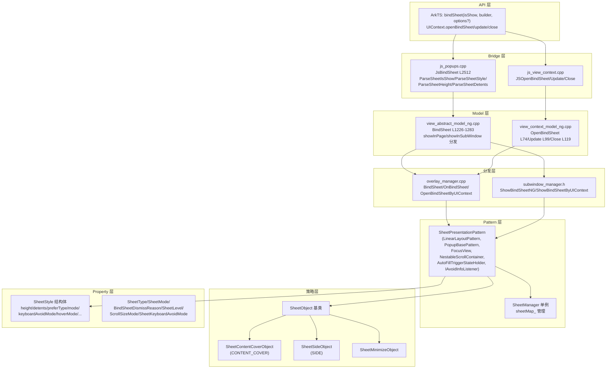

# 架构设计

> bindSheet 半模态弹窗的架构设计文档，覆盖 SheetPresentationPattern 多继承架构、SheetStyle/SheetType/SheetObject 策略模式、SheetManager 单例、避让/键盘/hoverMode/子窗口分发。

## 设计元数据

| 字段 | 内容 |
|------|------|
| Design ID | DESIGN-Func-05-07-01 |
| 关联需求 | 已有能力补录（无独立 requirement.md） |
| 关联 Epic | 无 |
| 目标 Feature | Feat-01: bindSheet 全量规格（半模态弹窗绑定 + SheetStyle + 生命周期 + 避让/键盘/hoverMode/子窗口） |
| 复杂度 | 复杂 |
| 目标版本 | API 10 ~ API 26+ |
| Owner | ArkUI SIG |
| 状态 | Baselined（已有实现补录） |

## 需求基线

| 字段 | 内容 |
|------|------|
| 问题陈述 | 应用需要一种半模态弹窗，从底部/侧边/中心弹出部分覆盖内容，支持拖拽高度档位、关闭按钮、避让键盘、悬浮态等富交互 |
| 核心目标 | （Feat-01）提供 bindSheet 全套 API，覆盖 height 模式（MEDIUM/LARGE/FIT_CONTENT）、detents 档位、preferType（bottom/center/popup/side/content_cover）、shouldDismiss/onWillDismiss/springBack、生命周期回调、mode OVERLAY/EMBEDDED、keyboardAvoid、hoverMode、子窗口 |
| P0 AC | AC-1.1 ~ AC-1.4（绑定与双向 isShow）、AC-2.1 ~ AC-2.4（height 模式）、AC-3.1 ~ AC-3.3（detents）、AC-4.1 ~ AC-4.3（dragBar/showClose）、AC-5.1 ~ AC-5.5（preferType）、AC-6.1 ~ AC-6.3（title）、AC-7.1 ~ AC-7.4（shouldDismiss/onWillDismiss/springBack）、AC-8.1 ~ AC-8.5（生命周期）、AC-9.1 ~ AC-9.4（mode/keyboardAvoid）、AC-10.1 ~ AC-10.4（blur/bg/mask）、AC-11.1 ~ AC-11.3（hoverMode/子窗口/attributeModifier 限制） |

## 上下文和现状

### 涉及仓和模块

| 仓库 | 模块路径 | 当前职责 | 本 Feature 影响 |
|------|----------|----------|-----------------|
| ace_engine | `frameworks/core/components_ng/pattern/sheet/sheet_presentation_pattern.h/.cpp` | SheetPresentationPattern（继承 LinearLayoutPattern, PopupBasePattern, FocusView, NestableScrollContainer, AutoFillTriggerStateHolder, IAvoidInfoListener）（.cpp 5254 行） | 规格补录 |
| ace_engine | `frameworks/core/components_ng/pattern/sheet/sheet_presentation_property.h` | SheetPresentationProperty（继承 LinearLayoutProperty），propSheetStyle_ PROPERTY_UPDATE_MEASURE | 规格补录 |
| ace_engine | `frameworks/core/components_ng/pattern/sheet/sheet_presentation_layout_algorithm.h/.cpp` | Sheet 布局算法 | 规格补录 |
| ace_engine | `frameworks/core/components_ng/pattern/sheet/sheet_style.h` | SheetStyle 结构体、SheetMode/SheetType/BindSheetDismissReason/SheetLevel/ScrollSizeMode/SheetKeyboardAvoidMode/SheetHeight 枚举 | 规格补录 |
| ace_engine | `frameworks/core/components_ng/pattern/sheet/sheet_manager.h/.cpp` | SheetManager 单例，OpenBindSheetByUIContext/UpdateBindSheetByUIContext/CloseBindSheetByUIContext/CleanBindSheetMap/SetDismissSheet/RemoveSheetByESC/RegisterDestroyCallback | 规格补录 |
| ace_engine | `frameworks/core/components_ng/pattern/sheet/sheet_object.h` | SheetObject 策略基类 + SheetContentCoverObject/SheetSideObject/SheetMinimizeObject | 规格补录 |
| ace_engine | `frameworks/core/components_ng/pattern/sheet/sheet_view.cpp` | SheetView（CLOSE_BUTTON L233） | 规格补录 |
| ace_engine | `frameworks/core/components_ng/pattern/sheet/sheet_wrapper_*` | SheetWrapper | 规格补录 |
| ace_engine | `frameworks/core/components_ng/pattern/sheet/sheet_drag_bar_*` | 拖拽条（grabber） | 规格补录 |
| ace_engine | `frameworks/core/components_ng/pattern/sheet/sheet_mask_*` | 遮罩 | 规格补录 |
| ace_engine | `frameworks/core/components_ng/pattern/sheet/sheet_theme.h` | SheetTheme（GetSheetHeightDefaultMode/GetMediumPercent/GetLargePercent/GetHeightApplyFullScreen/GetShowCloseIcon） | 规格补录 |
| ace_engine | `frameworks/core/components_ng/pattern/sheet/content_cover/sheet_content_cover_object.h` | SheetContentCoverObject（preferType==CONTENT_COVER，无 drag/scroll/keyboard avoid/shadow/border） | 规格补录 |
| ace_engine | `frameworks/core/components_ng/pattern/sheet/bridge/sheet_pattern_inner_modifier.h/.cpp` | sheetInteractiveDismiss（L29） | 规格补录 |
| ace_engine | `frameworks/core/components_ng/pattern/sheet/bridge/sheet_manager_inner_modifier.h/.cpp` | open/update/closeBindSheetByUIContext | 规格补录 |
| ace_engine | `frameworks/core/components_ng/pattern/overlay/overlay_manager.cpp` | BindSheet L3591 → OnBindSheet L3963 / OnBindSheetInner L4284 / OpenBindSheetByUIContext L4014 / Update L4039 / Close L4234 | 规格补录 |
| ace_engine | `frameworks/core/components_ng/base/view_abstract_model_ng.cpp` | BindSheet L1226-1283（ScopedViewStackProcessor, GetSheetContext, showInPage→findPageNodeOverlay, registerDestroyCallback, showInSubWindow→SubwindowManager::ShowBindSheetNG else overlayManager->BindSheet） | 规格补录 |
| ace_engine | `frameworks/core/components_ng/base/view_abstract_model_static.cpp` | 静态前端 BindSheet L873 | 规格补录 |
| ace_engine | `frameworks/core/components_ng/base/view_context_model_ng.cpp` | OpenBindSheet L74 / Update L99 / Close L119 | 规格补录 |
| ace_engine | `frameworks/bridge/declarative_frontend/jsview/js_popups.cpp` | JsBindSheet L2512 + ParseSheetIsShow L2491 + ParseSheetStyle L2606 + ParseSheetHeight L3255 + ParseSheetDetents L3002 + ParseSheetCallback L3116 | 规格补录 |
| ace_engine | `frameworks/bridge/declarative_frontend/jsview/js_view_context.cpp` | JSOpenBindSheet/JSUpdateBindSheet/JSCloseBindSheet 错误码 ERROR_CODE_BIND_SHEET_CONTENT_ERROR/_ALREADY_EXIST/_NOT_FOUND L98-100 | 规格补录 |
| ace_engine | `adapter/ohos/window/subwindow_manager.h` | ShowBindSheetNG / ShowBindSheetByUIContext | 规格补录 |
| interface/sdk-js | `api/@internal/component/ets/common.d.ts` | ModalTransition/SheetSize/BindOptions/DismissSheetAction/SpringBackAction/SheetOptions/DismissReason/bindSheet 声明 | 规格对照 |

### 调用链层级分析

| 层 | 模块 | 职责 | 修改类型 |
|----|------|------|----------|
| JS Bridge | `js_popups.cpp` JsBindSheet L2512 | 解析 isShow 双绑定、SheetStyle 默认值（L2530 sheetMode=LARGE/enableFloatingDragBar=false/showDragBar=true/showCloseIcon=true/showInPage=false）、ParseSheetStyle L2606、ParseSheetHeight L3255、ParseSheetDetents L3002 | 无修改（规格补录） |
| JS Bridge (命令式) | `js_view_context.cpp` JSOpenBindSheet/JSUpdateBindSheet/JSCloseBindSheet | 命令式 API，错误码 ERROR_CODE_BIND_SHEET_CONTENT_ERROR/_ALREADY_EXIST/_NOT_FOUND L98-100 | 无修改（规格补录） |
| Model (NG) | `view_abstract_model_ng.cpp` BindSheet L1226-1283 | ScopedViewStackProcessor, GetSheetContext, showInPage→findPageNodeOverlay, registerDestroyCallback, showInSubWindow→SubwindowManager::ShowBindSheetNG else overlayManager->BindSheet | 无修改（规格补录） |
| Model (Static) | `view_abstract_model_static.cpp` BindSheet L873 | 静态前端 BindSheet | 无修改（规格补录） |
| Model (命令式) | `view_context_model_ng.cpp` OpenBindSheet L74 / Update L99 / Close L119 | 命令式 Model | 无修改（规格补录） |
| Overlay 管理 | `overlay_manager.cpp` BindSheet L3591 → OnBindSheet L3963 / OnBindSheetInner L4284 | isShow=true 创建 FrameNode + SheetPresentationPattern 挂载；isShow=false 移除 | 无修改（规格补录） |
| Overlay (命令式) | `overlay_manager.cpp` OpenBindSheetByUIContext L4014 / Update L4039 / Close L4234 | 命令式 overlay 管理 | 无修改（规格补录） |
| Pattern | `sheet_presentation_pattern.cpp` | SheetPresentationPattern 多继承，生命周期/避让/键盘/hoverMode/拖拽档位/shouldDismiss/onWillDismiss/springBack | 无修改（规格补录） |
| Layout | `sheet_presentation_layout_algorithm.cpp` | Sheet 布局（height/detents/avoid） | 无修改（规格补录） |
| SheetManager | `sheet_manager.cpp` | SheetManager 单例，sheetMap_ 管理，OpenBindSheetByUIContext/Update/Close/CleanBindSheetMap/SetDismissSheet/RemoveSheetByESC/RegisterDestroyCallback | 无修改（规格补录） |
| SheetObject | `sheet_object.h` | SheetObject 策略基类，按 SheetType 派生 SheetContentCoverObject/SheetSideObject/SheetMinimizeObject | 无修改（规格补录） |
| Subwindow | `subwindow_manager.h` | showInSubWindow=true 时 ShowBindSheetNG/ShowBindSheetByUIContext | 无修改（规格补录） |

### 适用架构规则

| Rule ID | 适用原因 | 设计结论 | 验证方式 |
|---------|----------|----------|----------|
| OH-ARCH-LAYERING | bindSheet 涉及 JSView → Model → OverlayManager/SubwindowManager → SheetPresentationPattern → SheetLayoutAlgorithm 多层 | 调用方向自上而下，Pattern 不直接访问 JSView 层 | 代码评审 |
| OH-ARCH-API-LEVEL | bindSheet 有 @since 10/11/12/13/14/15/18/19/20/23/26 多版本 API | 各版本 API 通过 PlatformVersion 条件分支实现兼容 | API 评审 / XTS |
| OH-ARCH-OVERLAY | Sheet 默认通过 OverlayManager 挂载到 overlay 层（mode=OVERLAY） | EMBEDDED 模式挂载到嵌入节点 | 集成测试 |
| OH-ARCH-SUBSYSTEM | showInSubWindow=true 时由 SubwindowManager 创建子窗口 | 子窗口与 overlay 两套分发路径 | 集成测试 |
| OH-ARCH-STRATEGY | SheetObject 策略模式按 SheetType 派生不同 Object | 各 preferType 行为差异由策略对象承载 | 代码评审 |
| OH-ARCH-ERROR-LOG | Sheet 使用 TAG ACE_OVERLAY / ACE_SHEET 日志标签 | 关键路径覆盖 hilog 打点 | hilog |

## 不涉及项承接

| 维度 | 结论 |
|------|------|
| 性能 | 展开设计 — Sheet 为按需创建的浮层，需控制动画帧率与拖拽流畅度 |
| 安全与权限 | N/A — Sheet 不涉及安全敏感操作 |
| 兼容性 | 展开设计 — API 10→26 大量版本演进，height 模式、detents、preferType、mode、keyboardAvoid、hoverMode 等需兼容性声明 |
| API/SDK | 展开设计 — SheetOptions 字段众多，需与 SDK common.d.ts 交叉验证 |
| IPC/跨进程 | N/A — Sheet 为进程内 UI 组件 |
| 构建与部件 | N/A — Sheet 源码已包含在现有构建配置中 |

## 关键设计决策

| 决策 ID | 问题 | 推荐方案 | 探索过的替代方案 | 取舍理由 | 影响 |
|---------|------|----------|------------------|----------|------|
| ADR-1 | Sheet 高度模式 | SheetMode 枚举 MEDIUM/LARGE/AUTO + SheetSize MEDIUM/LARGE/FIT_CONTENT；MEDIUM→pageHeight*mediumSize（API<=10 0.5 else ~0.6），LARGE→largeHeight，FIT_CONTENT→fitContent capped | 固定高度 | 档位支持响应内容与屏幕 | API 10/11 mediumSize 比例变更 |
| ADR-2 | detents 档位 | 最多 3 档，升序排序去重 | 固定档位 | 拖拽体验更灵活 | detents 顺序与去重需文档化 |
| ADR-3 | preferType 策略 | SheetType 枚举 SHEET_BOTTOM/CENTER/POPUP/SIDE/CONTENT_COVER，由 SheetObject 策略派生 | 统一行为 | 各形态差异大，策略分离 | CONTENT_COVER 无 drag/scroll/keyboard avoid/shadow/border |
| ADR-4 | 双向 isShow | ParseSheetIsShow 检测双向绑定 | 单向 | 状态变量命令式控制更自然 | isShow $ 双向绑定 |
| ADR-5 | mode OVERLAY vs EMBEDDED | OVERLAY 挂载 overlay 层（默认），EMBEDDED 挂载嵌入节点 | 仅 OVERLAY | EMBEDDED 支持嵌入场景 | mode 默认 OVERLAY |
| ADR-6 | keyboardAvoidMode | 默认 TRANSLATE_AND_SCROLL | 固定 TRANSLATE | 不同场景需不同避让 | @since 13 |
| ADR-7 | hoverMode | 默认 false，hoverModeArea 默认 BOTTOM_SCREEN | 默认 true | 非悬浮态默认行为 | @since 14 |
| ADR-8 | shouldDismiss/onWillDismiss/springBack | shouldDismiss（bool 回调）→ onWillDismiss（DismissSheetAction）→ springBack（SpringBackAction）；无则 SheetInteractiveDismiss 直接 DismissTransition | 强制拦截 | 允许渐进式拦截 | L1414 SheetInteractiveDismiss |
| ADR-9 | showInSubWindow | showInSubWindow=true（默认 false）→ SubwindowManager::ShowBindSheetNG | 统一 overlay | 子窗口支持跨窗口场景 | @since 19 |
| ADR-10 | attributeModifier 限制 | bindSheet 不允许在 attributeModifier 中调用 | 允许 | attributeModifier 语义为纯属性修改 | 抛出异常 |
| ADR-11 | enableFloatingDragBar | 默认 false（@since 20），与 showDragBar 区分 | 统一 showDragBar | 悬浮态独立控制拖拽条 | @since 20 |
| ADR-12 | modalTransition | 仅 preferType==CONTENT_COVER 时生效，默认 DEFAULT | 全局生效 | 非 CONTENT_COVER 有自身动画 | @since 20 |
| ADR-13 | detentSelection | 默认 detents[0] | 固定首档 | 支持指定初始档位 | @since 15 |
| ADR-14 | placement | 默认 Bottom（@since 18） | 固定底部 | 支持不同方位 | @since 18 |

## 设计骨架

### 骨架范围

| 骨架项 | 目标 | 不包含 | 验证方式 |
|--------|------|--------|----------|
| SheetStyle | 统一样式结构体（height/dragBar/maskColor/detents/blurStyle/showClose/preferType/title/shouldDismiss/onWillDismiss/onWillSpringBackWhenDismiss/enableOutsideInteractive/width/border/shadow/onHeightDidChange/onDetentsDidChange/onWidthDidChange/onTypeDidChange/mode/scrollSizeMode/uiContext/keyboardAvoidMode/enableHoverMode/hoverModeArea/offset/effectEdge/radius/detentSelection/placement/placementOnTarget/showInSubWindow/enableFloatingDragBar/modalTransition/radiusRenderStrategy/systemMaterial/edgeLightMode/blurSnapshot） | Sheet 内部布局参数 | 代码审查 |
| SheetType 枚举 | SHEET_BOTTOM/CENTER/POPUP/SIDE/CONTENT_COVER | 具体渲染 | 代码审查 |
| SheetMode 枚举 | MEDIUM/LARGE/AUTO | — | 代码审查 |
| SheetObject 策略 | SheetObject 基类 + SheetContentCoverObject/SheetSideObject/SheetMinimizeObject | Pattern 内部 | 代码审查 |
| SheetPresentationPattern | 多继承架构（LinearLayoutPattern, PopupBasePattern, FocusView, NestableScrollContainer, AutoFillTriggerStateHolder, IAvoidInfoListener） | 单一职责拆分 | 单元测试 |
| SheetManager | 单例，sheetMap_ 管理 | — | 单元测试 |

### 骨架 Spec 拆分

| Task ID | 目标 | 受影响文件 | AC |
|---------|------|------------|-----|
| TASK-SKELETON-1 | SheetStyle + SheetType/SheetMode/枚举定义 | `sheet_style.h` | AC-2.1~2.4, AC-5.1~5.5 |
| TASK-SKELETON-2 | SheetPresentationPattern + SheetPresentationProperty | `sheet_presentation_pattern.h/.cpp` + `sheet_presentation_property.h` | AC-1.1~1.4, AC-8.1~8.5 |
| TASK-SKELETON-3 | SheetObject 策略 | `sheet_object.h` + `content_cover/sheet_content_cover_object.h` | AC-5.1~5.5 |
| TASK-SKELETON-4 | SheetManager + Overlay/Subwindow 分发 | `sheet_manager.h/.cpp` + `overlay_manager.cpp` + `view_abstract_model_ng.cpp` | AC-1.1~1.4, AC-11.1~11.3 |
| TASK-SKELETON-5 | shouldDismiss/onWillDismiss/springBack 交互 | `sheet_presentation_pattern.cpp` SheetInteractiveDismiss L1414 | AC-7.1~7.4 |

## 后续 Task 拆分

| Task ID | 目标 | 受影响文件 | 依赖 |
|---------|------|------------|------|
| TASK-1 | bindSheet 全部行为规格 | Feat-01-sheet-modal-full-spec.md | 无 |

## API 签名、Kit 与权限

### 新增 API

| API 签名 | 类型 | d.ts 位置 | 权限要求 | SysCap |
|----------|------|-----------|----------|--------|
| `bindSheet(isShow: boolean, builder: CustomBuilder, options?: SheetOptions): T` | Public | `common.d.ts:23239` @since 10 | - | ArkUI |
| `SheetSize` enum (MEDIUM/LARGE/FIT_CONTENT) | Public | `common.d.ts:8865` @since 10/11 | - | ArkUI |
| `ModalTransition` enum (DEFAULT/NONE/ALPHA) | Public | `common.d.ts:7842` @since 10 | - | ArkUI |
| `SheetOptions` | Public | `common.d.ts:12918` @since 10 | - | ArkUI |
| `DismissSheetAction` | Public | `common.d.ts:12844` @since 12 | - | ArkUI |
| `SpringBackAction` | Public | `common.d.ts:12875` @since 12 | - | ArkUI |
| `DismissReason` enum (PRESS_BACK/TOUCH_OUTSIDE/CLOSE_BUTTON/SLIDE_DOWN/SLIDE) | Public | `common.d.ts:13487` @since 12/20 | - | ArkUI |
| `BindOptions` | Public | `common.d.ts:12403` @since 11 | - | ArkUI |
| UIContext.openBindSheet/updateBindSheet/closeBindSheet | Public | `@ohos.arkui.UIContext.d.ts` | - | ArkUI |

### 变更/废弃 API

| 原有 API | 变更类型 | 新 API | 迁移说明 |
|----------|----------|--------|----------|
| — | — | — | 无废弃 API，SheetOptions 字段随版本增量扩展 |

## 构建系统影响

### BUILD.gn 变更

```
无变更。Sheet 组件实现已包含在现有构建配置中。
```

### bundle.json 变更

无变更。

## 可选设计扩展

### 架构图



### 数据流/控制流

| 步骤 | 调用方 | 被调用方 | 数据/接口 | 说明 |
|------|--------|----------|-----------|------|
| 1 | ArkTS | JsBindSheet | isShow/builder/options | 解析参数 |
| 2 | JsBridge | ParseSheetIsShow | isShow 类型 | 双向绑定检测 |
| 3 | JsBridge | ParseSheetStyle | SheetStyle 默认值（L2530 sheetMode=LARGE/enableFloatingDragBar=false/showDragBar=true/showCloseIcon=true/showInPage=false） | 样式解析 |
| 4 | JsBridge | ParseSheetHeight | SheetSize → SheetMode | medium/large/fitcontent 映射 |
| 5 | JsBridge | ParseSheetDetents | detents 数组 | 最多 3 档升序排序去重 |
| 6 | Model | BindSheet | ScopedViewStackProcessor/GetSheetContext/registerDestroyCallback | Model 层 |
| 7 | Model | showInPage/showInSubWindow | findPageNodeOverlay / SubwindowManager::ShowBindSheetNG | 分发路径选择 |
| 8 | Overlay | OnBindSheetInner | isShow=true 创建 FrameNode + SheetPresentationPattern 挂载 | isShow=false 移除 |
| 9 | Pattern | SheetInteractiveDismiss | shouldDismiss||onWillDismiss → register+springback+CallShouldDismiss+CallOnWillDismiss else DismissTransition | 交互式关闭 |
| 10 | Pattern | lifecycle | onWillAppear L4195/onAppear L4205/onWillDisappear L4241/onDisappear L4263 | 生命周期回调 |
| 11 | Pattern | onHeightDidChange L3212/onDetentsDidChange L3227/onWidthDidChange L3240/onTypeDidChange L3254 | 高度/档位/宽度/类型变化回调 |

### 数据模型设计

**ArkTS (API 层类型)**

```typescript
// common.d.ts:7842 @since 10
declare enum ModalTransition {
    DEFAULT = 0,
    NONE = 1,
    ALPHA = 2
}

// common.d.ts:8865 @since 10/11
declare enum SheetSize {
    MEDIUM,
    LARGE,
    FIT_CONTENT
}

// common.d.ts:12918 @since 10
declare interface SheetOptions {
    height?: SheetSize | Dimension;
    dragBar?: boolean;             // default true
    maskColor?: ResourceColor;
    detents?: SheetSize[];          // @since 11
    blurStyle?: BlurStyle;          // default NONE
    showClose?: boolean;            // default true
    preferType?: SheetType;         // @since 11
    title?: SheetTitleOptions | CustomBuilder;
    shouldDismiss?: () => boolean;  // @since 11
    onWillDismiss?: (action: DismissSheetAction) => void;  // @since 12
    onWillSpringBackWhenDismiss?: (action: SpringBackAction) => void;  // @since 12
    enableOutsideInteractive?: boolean;  // default false
    width?: Dimension;              // @since 12
    border?: BorderWidth/BorderColor/BorderRadius;  // @since 12
    shadow?: Shadow | ShadowStyle;  // @since 12
    onHeightDidChange?: ...;        // @since 12
    onDetentsDidChange?: ...;       // @since 12
    onWidthDidChange?: ...;         // @since 12
    onTypeDidChange?: ...;         // @since 12
    mode?: SheetMode;               // default OVERLAY
    scrollSizeMode?: ScrollSizeMode; // default FOLLOW_DETENT
    uiContext?: UIContext;
    keyboardAvoidMode?: SheetKeyboardAvoidMode;  // default TRANSLATE_AND_SCROLL @since 13
    enableHoverMode?: boolean;      // default false @since 14
    hoverModeArea?: HoverModeArea;  // default BOTTOM_SCREEN @since 14
    offset?: ...;                   // systemapi @since 14
    effectEdge?: ...;               // default 3 @since 18
    radius?: Dimension;             // @since 15
    detentSelection?: ...;          // default detents[0] @since 15
    placement?: Placement;          // default Bottom @since 18
    placementOnTarget?: boolean;     // default true
    showInSubWindow?: boolean;       // default false @since 19
    enableFloatingDragBar?: boolean; // default false @since 20
    modalTransition?: ModalTransition; // default DEFAULT, only preferType==CONTENT_COVER @since 20
    radiusRenderStrategy?: ...;     // default FAST @since 23
    systemMaterial?: ...;           // @since 26
    edgeLightMode?: ...;            // @since 26
    blurSnapshot?: ...;             // systemapi @since 26
}

// common.d.ts:12844 @since 12
declare interface DismissSheetAction {
    dismiss(): void;
    reason: DismissReason;
}

// common.d.ts:12875 @since 12
declare interface SpringBackAction {
    springBack(): void;
    reason: DismissReason;
}

// common.d.ts:13487 @since 12/20
declare enum DismissReason {
    PRESS_BACK,    // @since 12
    TOUCH_OUTSIDE, // @since 12
    CLOSE_BUTTON,  // @since 12
    SLIDE_DOWN,    // @since 12
    SLIDE          // @since 20
}
```

**C++ (框架层结构)**

```cpp
// sheet_style.h:50 SheetMode
enum class SheetMode { MEDIUM, LARGE, AUTO };

// sheet_style.h:56 SheetType
enum class SheetType {
    SHEET_BOTTOM = 0, CENTER = 1, POPUP = 2, SIDE = 3, CONTENT_COVER = 4
};

// sheet_style.h:93 BindSheetDismissReason
enum class BindSheetDismissReason {
    BACK_PRESSED, TOUCH_OUTSIDE, CLOSE_BUTTON, SLIDE_DOWN, SLIDE
};

// sheet_style.h:157 SheetLevel
enum class SheetLevel { OVERLAY, EMBEDDED };

// sheet_style.h:162 ScrollSizeMode
enum class ScrollSizeMode { /* ... */ };

// sheet_style.h:167 SheetHeight
struct SheetHeight { /* ... */ };

// sheet_style.h:182 SheetKeyboardAvoidMode
enum class SheetKeyboardAvoidMode { /* TRANSLATE_AND_SCROLL ... */ };

// sheet_style.h:198 SheetStyle struct
struct SheetStyle {
    SheetHeight sheetHeight;
    SheetMode sheetMode;
    SheetType sheetType;
    bool showDragBar;
    bool showCloseIcon;
    bool enableFloatingDragBar;
    bool showInPage;
    bool enableOutsideInteractive;
    bool enableHoverMode;
    HoverModeArea hoverModeArea;
    SheetLevel sheetLevel;
    ScrollSizeMode scrollSizeMode;
    SheetKeyboardAvoidMode keyboardAvoidMode;
    Color maskColor;
    Color backgroundColor;
    BlurStyle blurStyle;
    Dimension radius;
    Dimension effectEdge;
    // ... detents, callbacks, etc.
};

// sheet_presentation_pattern.h:58
class SheetPresentationPattern
    : public LinearLayoutPattern,
      public PopupBasePattern,
      public FocusView,
      public NestableScrollContainer,
      public AutoFillTriggerStateHolder,
      public IAvoidInfoListener { /* ... */ };

// sheet_presentation_property.h:30
class SheetPresentationProperty : public LinearLayoutProperty {
    ACE_PROPERTY(std::optional<SheetStyle>, propSheetStyle);  // L52 PROPERTY_UPDATE_MEASURE
};
```

## 详细设计

### bindSheet 创建流程

**入口**: `ViewAbstractModelNG::BindSheet()` (`view_abstract_model_ng.cpp:1226-1283`)

```
1. ScopedViewStackProcessor 处理 buildNodeFunc/buildTitleNodeFunc
2. GetSheetContext 获取 sheet 上下文
3. showInPage=true → findPageNodeOverlay 挂载到页面 overlay
4. registerDestroyCallback 注册销毁回调
5. showInSubWindow=true → SubwindowManager::ShowBindSheetNG
   else → overlayManager->BindSheet
6. OverlayManager::BindSheet L3591 → OnBindSheet L3963
7. isShow=true: 创建 FrameNode + SheetPresentationPattern 挂载（push modalStack_）
   isShow=false: 移除
```

### SheetInteractiveDismiss 交互式关闭

**入口**: `sheet_presentation_pattern.cpp` SheetInteractiveDismiss L1414

```
IF shouldDismiss || onWillDismiss:
    register + springback
    CallShouldDismiss (shouldDismiss bool 回调)
    CallOnWillDismiss (DismissSheetAction)
ELSE:
    DismissTransition (直接过渡关闭)
```

### SheetTransition 过渡

**入口**: `sheet_presentation_pattern.cpp` SheetTransition L1349

```
按 SheetType → SheetObject 策略决定过渡行为
CONTENT_COVER 走 modalTransition（默认 DEFAULT）
其他 SheetType 走各自策略过渡
```

### 生命周期回调

| 回调 | 位置 | 触发时机 |
|------|------|----------|
| onWillAppear | overlay_manager.cpp L4195 | Sheet 即将显示前 |
| onAppear | overlay_manager.cpp L4205 | Sheet 已显示 |
| onWillDisappear | overlay_manager.cpp L4241 | Sheet 即将隐藏前 |
| onDisappear | overlay_manager.cpp L4263 | Sheet 已隐藏 |
| onHeightDidChange | sheet_presentation_pattern.cpp L3212 | Sheet 高度变化 |
| onDetentsDidChange | sheet_presentation_pattern.cpp L3227 | detents 变化 |
| onWidthDidChange | sheet_presentation_pattern.cpp L3240 | 宽度变化 |
| onTypeDidChange | sheet_presentation_pattern.cpp L3254 | SheetType 变化 |

### height 模式计算

```
MEDIUM: pageHeight * mediumSize (API<=10: 0.5, else ~0.6)
LARGE: largeHeight (GetLargePercent)
FIT_CONTENT: fitContent, capped at largeHeight
```

### detents 处理

```
1. 最多 3 档
2. 升序排序
3. 去重
4. detentSelection 默认 detents[0]（@since 15）
```

### 键盘避让

```
keyboardAvoidMode 默认 TRANSLATE_AND_SCROLL (@since 13)
- TRANSLATE: Sheet 上移避让键盘
- SCROLL: 内容滚动避让
```

## 风险和开放问题

| 项 | 类型 | 影响 | 处理方式 | Owner |
|----|------|------|----------|-------|
| API 10→26 大量版本演进 | 兼容性 | 高 | 在兼容性声明中标注各版本差异 | ArkUI SIG |
| mediumSize 比例 API 10/11 变更 | 兼容性 | 中 | 文档化 mediumSize 0.5→0.6 变更 | ArkUI SIG |
| shouldDismiss/onWillDismiss/springBack 渐进式拦截链 | 行为 | 中 | 在规格中明确回调顺序与优先级 | ArkUI SIG |
| CONTENT_COVER 无 drag/scroll/keyboard avoid/shadow/border | 行为 | 中 | 在规格中明确 CONTENT_COVER 行为差异 | ArkUI SIG |
| attributeModifier 限制 | 行为 | 低 | 文档化限制，抛出异常 | ArkUI SIG |
| showInSubWindow 子窗口分发 | 架构 | 中 | 子窗口与 overlay 两套路径需独立验证 | ArkUI SIG |
| enableFloatingDragBar vs showDragBar | 兼容性 | 低 | 文档化两者区别（@since 20 悬浮态独立控制） | ArkUI SIG |
| modalTransition 仅 CONTENT_COVER 生效 | 行为 | 低 | 文档化限制条件（@since 20） | ArkUI SIG |
| SheetPresentationPattern 多继承复杂 | 架构 | 中 | 多继承（LinearLayoutPattern, PopupBasePattern, FocusView, NestableScrollContainer, AutoFillTriggerStateHolder, IAvoidInfoListener）需关注职责冲突 | ArkUI SIG |
| 命令式 API 错误码 | API | 低 | ERROR_CODE_BIND_SHEET_CONTENT_ERROR/_ALREADY_EXIST/_NOT_FOUND 需文档化 | ArkUI SIG |

## 设计审批

- [x] 需求基线已确认，设计覆盖 P0/P1 AC
- [x] 不涉及项已承接，N/A 和展开项都有结论
- [x] 涉及仓和模块职责清楚
- [x] 适用架构规则已识别并形成设计结论
- [x] 分层和子系统边界合规
- [x] API 变更有签名、权限、错误码和兼容性说明
- [x] BUILD.gn/bundle.json 影响明确
- [x] 设计输出和后续 Task 拆分明确
- [x] 关键设计决策有理由和影响说明
- [x] 风险和开放问题有 Owner

**结论:** 通过（已有实现补录）
