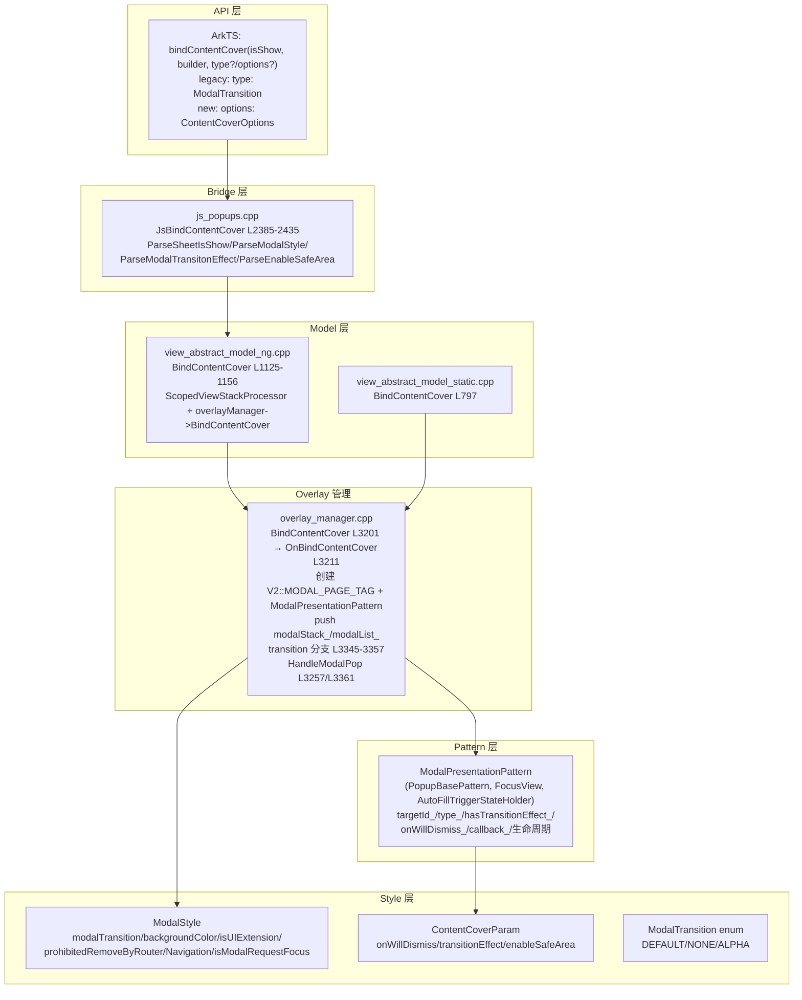

# 架构设计

> bindContentCover 全模态弹窗的架构设计文档，覆盖 ModalPresentationPattern 架构、ModalTransition 过渡、ModalStyle/ContentCoverParam、transition(TransitionEffect) 覆盖、onWillDismiss DismissContentCoverAction、overlay/subwindow 分发。

## 设计元数据

| 字段 | 内容 |
|------|------|
| Design ID | DESIGN-Func-05-07-02 |
| 关联需求 | 已有能力补录（无独立 requirement.md） |
| 关联 Epic | 无 |
| 目标 Feature | Feat-01: bindContentCover 全量规格（绑定 + ModalTransition + 自定义 transition + onWillDismiss + 生命周期 + enableSafeArea + backgroundColor） |
| 复杂度 | 中等 |
| 目标版本 | API 10 ~ API 20+ |
| Owner | ArkUI SIG |
| 状态 | Baselined（已有实现补录） |

## 需求基线

| 字段 | 内容 |
|------|------|
| 问题陈述 | 应用需要一种全屏模态弹窗，完全覆盖当前内容，支持滑动/无动画/透明度过渡与自定义 TransitionEffect |
| 核心目标 | （Feat-01）提供 bindContentCover 全套 API，覆盖双向 isShow、ModalTransition DEFAULT/NONE/ALPHA、自定义 transition（TransitionEffect 覆盖 modalTransition）、onWillDismiss DismissContentCoverAction、生命周期回调、enableSafeArea、backgroundColor |
| P0 AC | AC-1.1 ~ AC-1.4（绑定与双向 isShow）、AC-2.1 ~ AC-2.3（ModalTransition）、AC-3.1 ~ AC-3.3（自定义 transition）、AC-4.1 ~ AC-4.3（onWillDismiss）、AC-5.1 ~ AC-5.4（生命周期）、AC-6.1 ~ AC-6.2（enableSafeArea）、AC-7.1 ~ AC-7.2（backgroundColor）、AC-8.1 ~ AC-8.2（attributeModifier 限制 / isUIExtension） |

## 上下文和现状

### 涉及仓和模块

| 仓库 | 模块路径 | 当前职责 | 本 Feature 影响 |
|------|----------|----------|-----------------|
| ace_engine | `frameworks/core/components_ng/pattern/overlay/modal_presentation_pattern.h/.cpp` | ModalPresentationPattern（继承 PopupBasePattern, FocusView, AutoFillTriggerStateHolder）；构造 (targetId, ModalTransition type, callback)；members targetId_/type_/hasTransitionEffect_/onWillDismiss_/callback_/onDisappear_/onWillDisappear_/onAppear_/isExecuteOnDisappear_/enableSafeArea_/isUIExtension_/prohibitedRemoveByRouter_/prohibitedRemoveByNavigation_/isModalRequestFocus_ | 规格补录 |
| ace_engine | `frameworks/core/components_ng/pattern/overlay/modal_style.h` | ModalTransition 枚举 DEFAULT/NONE/ALPHA；ModalStyle 结构体（modalTransition/backgroundColor/isUIExtension/prohibitedRemoveByRouter/prohibitedRemoveByNavigation/isModalRequestFocus/backgroundColorObj_） | 规格补录 |
| ace_engine | `frameworks/core/components_ng/pattern/overlay/content_cover_param.h` | ContentCoverParam（onWillDismiss/transitionEffect RefPtr<ChainedTransitionEffect>/enableSafeArea） | 规格补录 |
| ace_engine | `frameworks/core/components_ng/pattern/overlay/overlay_manager.cpp` | BindContentCover L3201 → OnBindContentCover L3211（isShow=true 更新 pattern / 创建 FrameNode V2::MODAL_PAGE_TAG + ModalPresentationPattern L3282-3283 MountToParentWithService push modalStack_/modalList_；transition 分支 L3345-3357；isShow=false HandleModalPop L3257/L3361） | 规格补录 |
| ace_engine | `frameworks/core/components_ng/base/view_abstract_model_ng.cpp` | BindContentCover L1125-1156（ScopedViewStackProcessor, OverlayManager, destructor overlayManager->DeleteModal(id) V2::MODAL_PAGE_TAG, overlayManager->BindContentCover） | 规格补录 |
| ace_engine | `frameworks/core/components_ng/base/view_abstract_model_static.cpp` | 静态前端 BindContentCover L797→L826 | 规格补录 |
| ace_engine | `frameworks/core/components_ng/pattern/sheet/content_cover/sheet_content_cover_object.h` | SheetContentCoverObject（preferType==CONTENT_COVER 变体，无 drag/scroll/keyboard avoid/shadow/border） | 规格补录 |
| ace_engine | `frameworks/core/components_ng/pattern/sheet/content_cover/sheet_content_cover_layout_algorithm.h` | SheetContentCoverLayoutAlgorithm L25 | 规格补录 |
| ace_engine | `frameworks/bridge/declarative_frontend/jsview/js_popups.cpp` | JsBindContentCover L2385-2435（ParseSheetIsShow L2389 双向；builder L2396-2404；modalTransition=DEFAULT L2408；3rd arg object→ParseOverlayCallback/ParseModalStyle L2419/ContentCoverParam onWillDismiss L2420/ParseModalTransitonEffect L2421/ParseEnableSafeArea L2423；number→0..2 ModalTransition L2424-2429；ViewAbstractModel::BindContentCover L2432） | 规格补录 |
| ace_engine | `frameworks/bridge/declarative_frontend/jsview/js_view_abstract.cpp` | bindContentCover 静态注册 L10359 | 规格补录 |
| ace_engine | `frameworks/bridge/declarative_frontend/ark_component/src/ArkComponent.ts` | ArkComponent bindContentCover（attributeModifier 限制抛异常 L5826） | 规格补录 |
| ace_engine | `frameworks/core/interfaces/native/node/common_method_modifier.cpp` | SetBindContentCover0Impl L7000（legacy ModalTransition）/ SetBindContentCover1Impl L7033（options: ParseContentCoverCallbacks/modalTransition/backgroundColor/transitionEffect/enableSafeArea L7052-7061） L7652-7653 | 规格补录 |
| ace_engine | `frameworks/core/interfaces/native/node/bind_sheet_ops_accessor.cpp` | C-API accessor L110/134/139 | 规格补录 |
| ace_engine | `frameworks/core/interfaces/native/node/dismiss_content_cover_action_peer.h` | BindSheetDismissReason reason L21 | 规格补录 |
| ace_engine | `frameworks/core/interfaces/native/node/bind_sheet_utils.cpp` | ParseContentCoverCallbacks L255-286 | 规格补录 |
| interface/sdk-js | `api/@internal/component/ets/common.d.ts` | ModalTransition/BindOptions/DismissContentCoverAction/ContentCoverOptions/bindContentCover 声明 | 规格对照 |

### 调用链层级分析

| 层 | 模块 | 职责 | 修改类型 |
|----|------|------|----------|
| JS Bridge | `js_popups.cpp` JsBindContentCover L2385-2435 | ParseSheetIsShow 双向；builder；modalTransition=DEFAULT；3rd arg object→ParseOverlayCallback/ParseModalStyle/ContentCoverParam(onWillDismiss)/ParseModalTransitonEffect/ParseEnableSafeArea；number→0..2 ModalTransition；ViewAbstractModel::BindContentCover | 无修改（规格补录） |
| JS Bridge helpers | `js_popups.cpp` ParseModalTransitonEffect L2437 / ParseModalStyle L2447 / ParseModalTransition L2467 / ParseEnableSafeArea L2482 | 参数解析 | 无修改（规格补录） |
| JS Bridge (static) | `js_view_abstract.cpp` L10359 | bindContentCover 静态注册 | 无修改（规格补录） |
| Model (NG) | `view_abstract_model_ng.cpp` BindContentCover L1125-1156 | ScopedViewStackProcessor, OverlayManager, destructor overlayManager->DeleteModal(id) V2::MODAL_PAGE_TAG, overlayManager->BindContentCover | 无修改（规格补录） |
| Model (Static) | `view_abstract_model_static.cpp` BindContentCover L797→L826 | 静态前端 BindContentCover | 无修改（规格补录） |
| Overlay 管理 | `overlay_manager.cpp` BindContentCover L3201 → OnBindContentCover L3211 | isShow=true 更新 pattern（MarkDirtyNode PROPERTY_UPDATE_MEASURE_SELF L3241）/ 创建 FrameNode V2::MODAL_PAGE_TAG + ModalPresentationPattern(targetId, modalTransition.value_or(DEFAULT), callback) L3282-3283 MountToParentWithService push modalStack_/modalList_；transition 分支 L3345-3357；isShow=false HandleModalPop L3257/L3361 | 无修改（规格补录） |
| Pattern | `modal_presentation_pattern.h/.cpp` | ModalPresentationPattern（继承 PopupBasePattern, FocusView, AutoFillTriggerStateHolder），生命周期/过渡/onWillDismiss | 无修改（规格补录） |
| Style | `modal_style.h` | ModalTransition 枚举 + ModalStyle 结构体 | 无修改（规格补录） |
| Param | `content_cover_param.h` | ContentCoverParam（onWillDismiss/transitionEffect/enableSafeArea） | 无修改（规格补录） |
| C-API | `common_method_modifier.cpp` SetBindContentCover0Impl L7000 / SetBindContentCover1Impl L7033 | C-API modifier（legacy ModalTransition / options） | 无修改（规格补录） |
| C-API utils | `bind_sheet_ops_accessor.cpp` L110/134/139 + `dismiss_content_cover_action_peer.h` L21 + `bind_sheet_utils.cpp` ParseContentCoverCallbacks L255-286 | C-API accessor + utils | 无修改（规格补录） |
| ArkTS | `ArkComponent.ts` L5826 | bindContentCover 在 attributeModifier 中抛出异常 | 无修改（规格补录） |

### 适用架构规则

| Rule ID | 适用原因 | 设计结论 | 验证方式 |
|---------|----------|----------|----------|
| OH-ARCH-LAYERING | bindContentCover 涉及 JSView → Model → OverlayManager → ModalPresentationPattern 多层 | 调用方向自上而下 | 代码评审 |
| OH-ARCH-API-LEVEL | bindContentCover 有 @since 10/11/12/18/20 多版本 API | 各版本 API 通过 PlatformVersion 条件分支实现兼容 | API 评审 / XTS |
| OH-ARCH-OVERLAY | ContentCover 通过 OverlayManager 挂载到 overlay 层（V2::MODAL_PAGE_TAG + MountToParentWithService） | 模态节点 push 到 modalStack_/modalList_ | 集成测试 |
| OH-ARCH-ERROR-LOG | ContentCover 使用 TAG ACE_OVERLAY 日志标签 | 关键路径覆盖 hilog 打点 | hilog |

## 不涉及项承接

| 维度 | 结论 |
|------|------|
| 性能 | N/A — ContentCover 为轻量模态浮层，过渡动画开销可控 |
| 安全与权限 | N/A — ContentCover 不涉及安全敏感操作 |
| 兼容性 | 展开设计 — isShow 双向绑定 @since 10/!! since 18，enableSafeArea @since 20 需兼容性声明 |
| API/SDK | 展开设计 — bindContentCover 双重载签名（legacy type vs options）需与 SDK common.d.ts 交叉验证 |
| IPC/跨进程 | N/A — ContentCover 为进程内 UI 组件 |
| 构建与部件 | N/A — ContentCover 源码已包含在现有构建配置中 |

## 关键设计决策

| 决策 ID | 问题 | 推荐方案 | 探索过的替代方案 | 取舍理由 | 影响 |
|---------|------|----------|------------------|----------|------|
| ADR-1 | 双向 isShow | ParseSheetIsShow 检测双向绑定；@since 10 双向，@since 18 改为 !! 强制双向 | 单向 | 状态变量命令式控制更自然 | API 10/18 双向绑定语义差异 |
| ADR-2 | ModalTransition 默认值 | DEFAULT（滑动过渡） | NONE | 滑动过渡是模态弹窗的标准体验 | modalTransition 默认 DEFAULT |
| ADR-3 | 自定义 transition 覆盖 modalTransition | transitionEffect（TransitionEffect）!= null 时覆盖 modalTransition，走 PlayTransitionEffectIn/Out | 互斥配置 | transitionEffect 提供更灵活的自定义能力 | API 12 新增 transition |
| ADR-4 | NONE 过渡行为 | API<12 OR NONE → OnAppear 直接触发（无动画） | 强制动画 | NONE 明确无动画语义 | OnAppear 立即执行 |
| ADR-5 | DEFAULT/ALPHA 过渡行为 | DEFAULT→PlayDefaultModalTransition（滑动）；ALPHA→PlayAlphaModalTransition（透明度） | — | 各过渡类型独立动画 | — |
| ADR-6 | onWillDismiss 回调 | DismissContentCoverAction{dismiss, reason: DismissReason} | 强制关闭 | 允许条件关闭 | API 12 新增 onWillDismiss |
| ADR-7 | isExecuteOnDisappear_ 守卫 | OnAppear/OnDisappear/OnWillDisappear 受 isExecuteOnDismiss_ 守卫 | 每次触发 | 防止重复触发 | 避免重复回调 |
| ADR-8 | enableSafeArea 默认 false | enableSafeArea 默认 false（@since 20） | 默认 true | 默认不避让安全区，开发者显式启用 | API 20 新增 |
| ADR-9 | isUIExtension 默认 false | isUIExtension 默认 false；prohibitedRemoveByRouter=false；prohibitedRemoveByNavigation=true；isModalRequestFocus=true | — | 默认非 UIExtension，路由可移除，导航不可移除，模态请求焦点 | — |
| ADR-10 | 无效 ModalTransition 处理 | ParseModalTransition 验证 [0,2]，无效值→DEFAULT | 抛出异常 | 静默回退 DEFAULT 保持向后兼容 | 无效值不报错 |
| ADR-11 | attributeModifier 限制 | bindContentCover 不允许在 attributeModifier 中调用 | 允许 | attributeModifier 语义为纯属性修改 | ArkComponent.ts L5826 抛出异常 |
| ADR-12 | 双重载签名 | bindContentCover(isShow, builder, type?: ModalTransition) legacy + bindContentCover(isShow, builder, options?: ContentCoverOptions) | 统一签名 | 兼容旧 API（number type）与新 API（options object） | 3rd arg 类型分发 |

## 设计骨架

### 骨架范围

| 骨架项 | 目标 | 不包含 | 验证方式 |
|--------|------|--------|----------|
| ModalStyle | 结构体（modalTransition/backgroundColor/isUIExtension/prohibitedRemoveByRouter/prohibitedRemoveByNavigation/isModalRequestFocus/backgroundColorObj_） | — | 代码审查 |
| ModalTransition 枚举 | DEFAULT/NONE/ALPHA | — | 代码审查 |
| ContentCoverParam | onWillDismiss/transitionEffect/enableSafeArea | — | 代码审查 |
| ModalPresentationPattern | 继承 PopupBasePattern, FocusView, AutoFillTriggerStateHolder；生命周期/过渡/onWillDismiss | Sheet 专属行为 | 单元测试 |
| OverlayManager::OnBindContentCover | isShow=true 创建/更新；isShow=false HandleModalPop；transition 分支 | Sheet 分发 | 单元测试 |

### 骨架 Spec 拆分

| Task ID | 目标 | 受影响文件 | AC |
|---------|------|------------|-----|
| TASK-SKELETON-1 | ModalStyle + ModalTransition + ContentCoverParam | `modal_style.h` + `content_cover_param.h` | AC-2.1~2.3, AC-6.1~6.2 |
| TASK-SKELETON-2 | ModalPresentationPattern 生命周期/过渡 | `modal_presentation_pattern.h/.cpp` | AC-5.1~5.4 |
| TASK-SKELETON-3 | OnBindContentCover 创建/移除/transition 分支 | `overlay_manager.cpp` L3201-3361 | AC-1.1~1.4, AC-2.1~2.3, AC-3.1~3.3 |
| TASK-SKELETON-4 | JsBindContentCover 参数解析 + 双重载分发 | `js_popups.cpp` L2385-2435 | AC-1.1, AC-7.1~7.2 |

## 后续 Task 拆分

| Task ID | 目标 | 受影响文件 | 依赖 |
|---------|------|------------|------|
| TASK-1 | bindContentCover 全部行为规格 | Feat-01-full-modal-full-spec.md | 无 |

## API 签名、Kit 与权限

### 新增 API

| API 签名 | 类型 | d.ts 位置 | 权限要求 | SysCap |
|----------|------|-----------|----------|--------|
| `bindContentCover(isShow: boolean, builder: CustomBuilder, type?: ModalTransition): T` | Public (legacy) | `common.d.ts:23199` @since 10 | - | ArkUI |
| `bindContentCover(isShow: boolean, builder: CustomBuilder, options?: ContentCoverOptions): T` | Public | `common.d.ts:23218` @since 10 | - | ArkUI |
| `ModalTransition` enum (DEFAULT=0/NONE=1/ALPHA=2) | Public | `common.d.ts:7842` @since 10 | - | ArkUI |
| `BindOptions` | Public | `common.d.ts:12403` @since 11 | - | ArkUI |
| `DismissContentCoverAction` | Public | `common.d.ts:12496` @since 12 | - | ArkUI |
| `ContentCoverOptions extends BindOptions` | Public | `common.d.ts:12529` @since 10 | - | ArkUI |

### 变更/废弃 API

| 原有 API | 变更类型 | 新 API | 迁移说明 |
|----------|----------|--------|----------|
| `bindContentCover(isShow, builder, type?: ModalTransition)` legacy | 保留 | `bindContentCover(isShow, builder, options?: ContentCoverOptions)` | 推荐迁移到 options 重载以使用 transition/onWillDismiss/enableSafeArea |

## 构建系统影响

### BUILD.gn 变更

```
无变更。ContentCover 实现已包含在现有构建配置中。
```

### bundle.json 变更

无变更。

## 可选设计扩展

### 架构图



### 数据流/控制流

| 步骤 | 调用方 | 被调用方 | 数据/接口 | 说明 |
|------|--------|----------|-----------|------|
| 1 | ArkTS | JsBindContentCover | isShow/builder/type|options | 解析参数与重载分发 |
| 2 | JsBridge | ParseSheetIsShow | isShow 类型 | 双向绑定检测（@since 10 双向，@since 18 !! 强制双向） |
| 3 | JsBridge | 3rd arg 分发 | object→ParseOverlayCallback/ParseModalStyle/ContentCoverParam(onWillDismiss)/ParseModalTransitonEffect/ParseEnableSafeArea；number→0..2 ModalTransition | 重载分发 |
| 4 | JsBridge | ViewAbstractModel::BindContentCover | — | 进入 Model 层 |
| 5 | Model | ScopedViewStackProcessor | buildNodeFunc | 创建内容节点 |
| 6 | Model | overlayManager->BindContentCover | — | 进入 Overlay |
| 7 | Overlay | OnBindContentCover L3211 | isShow=true/false 分支 | 创建或移除 |
| 8 | Overlay (isShow=true) | 创建 FrameNode | V2::MODAL_PAGE_TAG + ModalPresentationPattern(targetId, modalTransition.value_or(DEFAULT), callback) L3282-3283 | MountToParentWithService，push modalStack_/modalList_ |
| 9 | Overlay (transition) | PlayTransitionEffectIn/PlayDefaultModalTransition/PlayAlphaModalTransition | transitionEffect / DEFAULT / ALPHA | L3345-3357 |
| 10 | Overlay (isShow=false) | HandleModalPop L3257/L3361 | OnWillDisappear + PlayTransitionEffectOut/PlayDefaultModalTransition(false)/PlayAlphaModalTransition(false) | 移除 |

### 数据模型设计

**ArkTS (API 层类型)**

```typescript
// common.d.ts:7842 @since 10
declare enum ModalTransition {
    DEFAULT = 0,  // slide
    NONE = 1,     // no animation
    ALPHA = 2     // opacity
}

// common.d.ts:12403 @since 11
declare interface BindOptions {
    backgroundColor?: ResourceColor;
    onAppear?: () => void;
    onDisappear?: () => void;
    onWillAppear?: () => void;
    onWillDisappear?: () => void;
}

// common.d.ts:12496 @since 12
declare interface DismissContentCoverAction {
    dismiss(): void;
    reason: DismissReason;
}

// common.d.ts:12529 @since 10
declare interface ContentCoverOptions extends BindOptions {
    modalTransition?: ModalTransition;  // default DEFAULT
    onWillDismiss?: (action: DismissContentCoverAction) => void;  // @since 12
    transition?: TransitionEffect;      // @since 12
    enableSafeArea?: boolean;            // default false @since 20
}

// common.d.ts:23199 @since 10 (legacy)
bindContentCover(isShow: boolean, builder: CustomBuilder, type?: ModalTransition): T;

// common.d.ts:23218 @since 10
bindContentCover(isShow: boolean, builder: CustomBuilder, options?: ContentCoverOptions): T;
```

**C++ (框架层结构)**

```cpp
// modal_style.h:25
enum class ModalTransition { DEFAULT, NONE, ALPHA };

// modal_style.h:31
struct ModalStyle {
    std::optional<ModalTransition> modalTransition;
    std::optional<Color> backgroundColor;
    bool isUIExtension = false;
    bool prohibitedRemoveByRouter = false;
    bool prohibitedRemoveByNavigation = true;
    bool isModalRequestFocus = true;
    Color backgroundColorObj_;  // L51-61
};

// content_cover_param.h
struct ContentCoverParam {
    std::optional<OnWillDismiss> onWillDismiss;
    RefPtr<ChainedTransitionEffect> transitionEffect;
    bool enableSafeArea = false;
};

// modal_presentation_pattern.h:27
enum class ContentCoverDismissReason {
    BACK_PRESSED, TOUCH_OUTSIDE, CLOSE_BUTTON  // NO SLIDE
};

// modal_presentation_pattern.h:33
class ModalPresentationPattern
    : public PopupBasePattern,
      public FocusView,
      public AutoFillTriggerStateHolder {
    // constructor (targetId, ModalTransition type, callback) L38
    // members:
    std::string targetId_;                                   // L220
    ModalTransition type_ = DEFAULT;                          // L221
    bool hasTransitionEffect_ = false;                        // L222
    std::optional<OnWillDismiss> onWillDismiss_;             // L223
    Callback callback_;                                      // L224
    // onDisappear_/onWillDisappear_/onAppear_ L225-227
    bool isExecuteOnDisappear_ = false;                       // L228
    bool enableSafeArea_ = false;                             // L229
    bool isUIExtension_ = false;                              // L217
    bool prohibitedRemoveByRouter_ = false;                    // L218
    bool prohibitedRemoveByNavigation_ = true;                 // L219
};
```

## 详细设计

### bindContentCover 创建流程

**入口**: `OverlayManager::OnBindContentCover` (`overlay_manager.cpp:3211`)

```
1. isShow=true:
   a. 已存在 → 更新 pattern，MarkDirtyNode(PROPERTY_UPDATE_MEASURE_SELF) L3241
   b. 否则 → onWillAppear → HandleModalShow L3248
      - 创建 FrameNode(V2::MODAL_PAGE_TAG) + ModalPresentationPattern(targetId, modalTransition.value_or(DEFAULT), callback) L3282-3283
      - MountToParentWithService
      - push modalStack_/modalList_
   c. transition 分支 L3345-3357:
      - transitionEffect != null → PlayTransitionEffectIn L3345-3346
      - API<12 OR NONE → OnAppear 直接触发 L3348-3352
      - DEFAULT → PlayDefaultModalTransition L3354-3355
      - ALPHA → PlayAlphaModalTransition L3356-3357
2. isShow=false → HandleModalPop L3257/L3361:
   - OnWillDisappear + PlayTransitionEffectOut/PlayDefaultModalTransition(false)/PlayAlphaModalTransition(false)
```

### JsBindContentCover 参数解析

**入口**: `js_popups.cpp` JsBindContentCover L2385-2435

```
1. ParseSheetIsShow L2389 双向绑定检测
2. builder L2396-2404 JsPopupsScoringCallback frame BindContentCover
3. modalTransition = DEFAULT L2408
4. 3rd arg 分发:
   a. object → ParseOverlayCallback/ParseModalStyle L2419 / ContentCoverParam(onWillDismiss) L2420 / ParseModalTransitonEffect L2421 / ParseEnableSafeArea L2423
   b. number → 0..2 ModalTransition L2424-2429（ParseModalTransition L2467 验证 [0,2]）
5. ViewAbstractModel::BindContentCover L2432
```

### transition 覆盖逻辑

```
1. transitionEffect（TransitionEffect）!= null 时 hasTransitionEffect_=true
2. 覆盖 modalTransition，走 PlayTransitionEffectIn/Out
3. transitionEffect == null 时按 modalTransition 分支（DEFAULT/NONE/ALPHA）
```

### 生命周期守卫

```
OnAppear/OnDisappear/OnWillDisappear 受 isExecuteOnDismiss_ 守卫
防止重复触发
```

## 风险和开放问题

| 项 | 类型 | 影响 | 处理方式 | Owner |
|----|------|------|----------|-------|
| isShow 双向绑定 @since 10/!! since 18 语义差异 | 兼容性 | 中 | 在兼容性声明中标注 @since 18 强制双向 | ArkUI SIG |
| transition 覆盖 modalTransition | 行为 | 低 | 文档化覆盖优先级 | ArkUI SIG |
| enableSafeArea 默认 false（@since 20） | 兼容性 | 低 | 默认不避让安全区，开发者显式启用 | ArkUI SIG |
| 无效 ModalTransition 静默回退 DEFAULT | 行为 | 低 | ParseModalTransition 验证 [0,2]，无效值→DEFAULT | ArkUI SIG |
| attributeModifier 限制 | 行为 | 低 | ArkComponent.ts L5826 抛出异常 | ArkUI SIG |
| 双重载签名（legacy vs options） | API | 中 | 文档化重载分发逻辑 | ArkUI SIG |
| ContentCoverDismissReason 无 SLIDE | 行为 | 低 | 与 BindSheetDismissReason 差异（无 SLIDE/SLIDE_DOWN） | ArkUI SIG |
| prohibitedRemoveByRouter vs Navigation 默认差异 | 行为 | 低 | Router=false 可移除，Navigation=true 不可移除 | ArkUI SIG |

## 设计审批

- [x] 需求基线已确认，设计覆盖 P0/P1 AC
- [x] 不涉及项已承接，N/A 和展开项都有结论
- [x] 涉及仓和模块职责清楚
- [x] 适用架构规则已识别并形成设计结论
- [x] 分层和子系统边界合规
- [x] API 变更有签名、权限、错误码和兼容性说明
- [x] BUILD.gn/bundle.json 影响明确
- [x] 设计输出和后续 Task 拆分明确
- [x] 关键设计决策有理由和影响说明
- [x] 风险和开放问题有 Owner

**结论:** 通过（已有实现补录）
