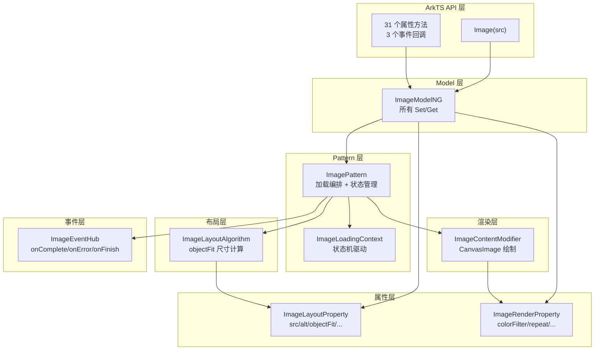

# 架构设计

> Image 组件功能域的架构设计文档，补录已有实现。

## 设计元数据

| 字段 | 内容 |
|------|------|
| Design ID | DESIGN-Func-05-08-01 |
| 关联需求 | 已有能力补录（无独立 requirement.md） |
| 关联 Epic | 无 |
| 目标 Feature | Feat-01 核心显示属性, Feat-02 颜色与效果, Feat-03 高级功能, Feat-04 事件回调 |
| 复杂度 | 复杂 |
| 目标版本 | API 7 起支持 |
| Owner | ArkUI SIG |
| 状态 | Baselined（已有实现补录） |

## 需求基线

| 项 | 补充说明 |
|----|----------|
| 核心目标 | 提供 Image 组件，支持多源图片显示（31 个属性 + 3 个事件），覆盖图片加载、渲染、效果、事件回调和高级功能 |

## 上下文和现状

### 涉及仓和模块

| 仓库 | 模块/路径 | 当前职责 | 本 Feature 影响 |
|------|-----------|----------|-----------------|
| ace_engine | `frameworks/core/components_ng/pattern/image/image_pattern.h/.cpp` | ImagePattern 主逻辑，持有 ImageLoadingContext，编排加载/渲染生命周期 | 核心调度层 |
| ace_engine | `frameworks/core/components_ng/pattern/image/image_layout_property.h/.cpp` | 布局属性：src, alt, objectFit, autoResize, sourceSize, orientation 等 | Feat-01 |
| ace_engine | `frameworks/core/components_ng/pattern/image/image_render_property.h/.cpp` | 渲染属性：colorFilter, objectRepeat, fillColor, hdrBrightness 等 | Feat-02 |
| ace_engine | `frameworks/core/components_ng/pattern/image/image_event_hub.h` | 事件回调：onComplete, onError, onFinish | Feat-04 |
| ace_engine | `frameworks/core/components_ng/pattern/image/image_layout_algorithm.h/.cpp` | 布局算法，根据 objectFit 和图片尺寸计算组件尺寸 | Feat-01 |
| ace_engine | `frameworks/core/components_ng/pattern/image/image_paint_method.h/.cpp` | 绘制方法，创建 ImageContentModifier | Feat-01/02 |
| ace_engine | `frameworks/core/components_ng/pattern/image/image_content_modifier.h/.cpp` | 内容绘制 modifier，执行 CanvasImage 渲染 | Feat-01/02 |
| ace_engine | `frameworks/core/components_ng/pattern/image/image_model_ng.h/.cpp` | NG Model，所有属性的 Set/Get 方法 | API 层 |
| ace_engine | `frameworks/bridge/declarative_frontend/engine/jsi/nativeModule/arkts_native_image_bridge.h/.cpp` | ArkTS 桥接层，34 个 Set/Reset 方法 | 桥接层 |

### 适用架构规则

| Rule ID | 适用原因 | 设计结论 | 验证方式 |
|---------|----------|----------|----------|
| OH-ARCH-LAYERING | Image 涉及 API 层 → Layout Property → Layout Algorithm → Render | 单向调用，无反向依赖 | 代码评审 |
| OH-ARCH-API-LEVEL | 部分 API 在 API 9/11/12 有增强 | 各属性标注 @since 版本 | API 评审/XTS |
| OH-ARCH-COMPONENT-BUILD | Image 属于 ace_core_ng | 无需新增 target | 构建验证 |

## 不涉及项承接

| 维度 | 设计结论 |
|------|----------|
| 性能 | 是 — 展开：autoResize 功率对齐、syncLoad 控制线程模型、图片加载管线已在 04-01-01 覆盖 |
| 安全与权限 | N/A |
| 兼容性 | 是 — 展开：autoResize 默认值 API 9 vs 后续版本差异，需标注 |
| IPC/跨进程 | N/A |

## 关键设计决策

| 决策 ID | 问题 | 推荐方案 | 探索过的替代方案 | 取舍理由 | 影响 |
|---------|------|----------|-----------------|----------|------|
| ADR-1 | Image 属性分哪几层存储 | 布局属性（LayoutProperty）、渲染属性（RenderProperty）、Pattern 成员变量三层分离 | 方案A：全部放在 LayoutProperty（渲染变更也触发重测）；方案B：全部放在 Pattern（无法利用属性继承） | 布局属性触发 MEASURE/LAYOUT，渲染属性仅触发 RENDER，Pattern 成员无 dirty flag。分层减少不必要的重测 | `image_layout_property.h` / `image_render_property.h` / `image_pattern.h` |
| ADR-2 | objectFit 默认值为 COVER | COVER 保持图片比例填满容器，裁剪溢出部分 | 方案A：CONTAIN（留白）；方案B：FILL（拉伸变形） | COVER 是最常见的图片展示模式，对齐 Android/iOS 默认行为 | `image_layout_property.cpp:87` |
| ADR-3 | autoResize 默认值双重逻辑 | JSON 反序列化默认 false；Pattern 构造时 autoResizeDefault_=true | 方案A：统一 false（浪费内存）；方案B：统一 true（可能过度解码） | 未显式设置时 Pattern 使用 true（启用功率对齐优化），显式设置 false 时关闭 | `image_layout_property.cpp:30` / `image_pattern.h:425` |
| ADR-4 | 图片加载与渲染管线的关系 | ImagePattern 持有 ImageLoadingContext（在 04-01-01 中规格化），通过回调驱动属性更新和重绘 | 方案A：Image 组件直接管理加载（逻辑耦合）；方案B：完全独立加载器（回调复杂） | ImagePattern 作为加载管线的消费者，通过 LoadNotifier 回调获取加载结果，职责清晰 | 图片加载机制已在 Func-04-01-01 中规格化 |

## 设计骨架

### 骨架范围

| 骨架项 | 目标 | 不包含 | 验证方式 |
|--------|------|--------|----------|
| 属性三层存储 | LayoutProperty / RenderProperty / Pattern 分层 | 各属性内部实现细节 | 代码审查 |
| objectFit 布局算法 | 18 种 ImageFit 的尺寸计算 | ImageMatrix 变换 | 单元测试 |
| 事件回调数据结构 | ImageCompleteEvent / ImageError 字段 | 回调内部实现 | 单元测试 |

### 骨架 Spec 拆分

| Task ID | 目标 | 受影响文件 | AC |
|---------|------|-----------|-----|
| TASK-SKELETON-1 | objectFit 布局计算验证 | `image_layout_algorithm.cpp` | Feat-01 AC |
| TASK-SKELETON-2 | 颜色效果渲染验证 | `image_content_modifier.cpp` | Feat-02 AC |
| TASK-SKELETON-3 | 事件回调触发验证 | `image_event_hub.h`, `image_pattern.cpp` | Feat-04 AC |

## 后续 Task 拆分

| Spec | 目的 | 依赖 | 输出 |
|------|------|------|------|
| Feat-01-image-core-display-spec.md | 固化核心显示属性行为规格 | 本 Design + 04-01-01 图片加载机制 | 完整行为规格与 AC |
| Feat-02-image-color-effects-spec.md | 固化颜色与效果属性行为规格 | 本 Design | 完整行为规格与 AC |
| Feat-03-image-advanced-spec.md | 固化高级功能属性行为规格 | 本 Design | 完整行为规格与 AC |
| Feat-04-image-events-spec.md | 固化事件回调行为规格 | 本 Design | 完整行为规格与 AC |

---

## API 签名与权限

### 新增 API

| API 签名 | 类型 | 功能描述 | 关联 Feat |
|----------|------|----------|----------|
| `Image(src: PixelMap \| ResourceStr \| DrawableDescriptor, options?)` | Public | Image 组件构造函数 | Feat-01 |
| `alt(value: string \| Resource \| PixelMap \| ImageAlt): T` | Public | 设置占位图/错误图 | Feat-01 |
| `objectFit(value: ImageFit): T` | Public | 设置图片缩放模式（默认 COVER） | Feat-01 |
| `objectRepeat(value: ImageRepeat): T` | Public | 设置图片重复模式 | Feat-01 |
| `renderMode(value: ImageRenderMode): T` | Public | 设置渲染模式（ORIGINAL/TEMPLATE） | Feat-01 |
| `autoResize(value: boolean): T` | Public | 设置是否自动调整解码尺寸 | Feat-01 |
| `sourceSize(value: ImageSourceSize): T` | Public | 设置解码目标尺寸 | Feat-01 |
| `interpolation(value: ImageInterpolation): T` | Public | 设置插值质量 | Feat-01 |
| `fitOriginalSize(value: boolean): T` | Public | 设置是否适应原始图片尺寸 | Feat-01 |
| `orientation(value: ImageRotateOrientation): T` | Public | 设置图片旋转方向 | Feat-01 |
| `fillColor(value: ResourceColor): T` | Public | 设置 SVG 填充颜色 | Feat-02 |
| `colorFilter(value: ColorFilter): T` | Public | 设置颜色滤镜矩阵 | Feat-02 |
| `dynamicRangeMode(value: DynamicRangeMode): T` | Public | 设置动态范围模式 | Feat-02 |
| `hdrBrightness(value: number): T` | Public | 设置 HDR 亮度 | Feat-02 |
| `imageMatrix(value: Matrix4Transit): T` | Public | 设置变换矩阵 | Feat-02 |
| `edgeAntialiasing(value: number): T` | Public | 设置边缘抗锯齿 | Feat-02 |
| `antialiased(value: boolean): T` | Public | 设置抗锯齿 | Feat-02 |
| `contentTransition(value: ContentTransitionEffect): T` | Public | 设置内容过渡效果 | Feat-02 |
| `resizable(value: ResizableOptions): T` | Public | 设置可拉伸配置 | Feat-03 |
| `enableAnalyzer(value: boolean): T` | Public | 启用图片分析器 | Feat-03 |
| `copyOption(value: CopyOptions): T` | Public | 设置复制选项 | Feat-03 |
| `syncLoad(value: boolean): T` | Public | 设置同步加载 | Feat-03 |
| `matchTextDirection(value: boolean): T` | Public | 设置匹配文本方向 | Feat-03 |
| `supportSvg2(value: boolean): T` | Public | 启用 SVG2 支持 | Feat-03 |
| `privacySensitive(value: boolean): T` | Public | 设置隐私敏感标记 | Feat-03 |
| `enhancedImageQuality(value: ResolutionQuality): T` | Public | 设置增强图像质量 | Feat-03 |
| `onComplete(callback: ImageOnCompleteCallback): T` | Public | 图片加载完成回调 | Feat-04 |
| `onError(callback: ImageErrorCallback): T` | Public | 图片加载失败回调 | Feat-04 |
| `onFinish(callback: VoidCallback): T` | Public | 图片加载结束回调 | Feat-04 |

### 变更/废弃 API

无。

## 构建系统影响

### BUILD.gn 变更

无新增 target。Image 组件已在 `ace_core_ng_source_set` 中。

### bundle.json 变更

无。

## 可选设计扩展

### 架构图



### 数据模型设计

```typescript
// ArkTS 类型定义
interface ImageSourceSize { width: number; height: number }
interface ImageAlt { placeholder?: ResourceStr | PixelMap; error?: ResourceStr | PixelMap }
interface ImageCompleteEvent {
  width: number; height: number;
  componentWidth: number; componentHeight: number;
  loadingStatus: number;
  contentWidth: number; contentHeight: number;
  contentOffsetX: number; contentOffsetY: number;
}
interface ImageError {
  componentWidth: number; componentHeight: number;
  message: string; error?: BusinessError;
}
```

### 线程与并发模型

| 操作 | 发起线程 | 回调线程 | 说明 |
|------|----------|----------|------|
| 属性设置 (Set*) | UI | UI | 直接写入 Property |
| 图片加载 | UI → BG | BG → UI | 通过 ImageLoadingContext |
| 事件回调 | UI | UI | 由 Pattern 在加载回调中触发 |

## 详细设计

### 属性三层存储模型

Image 组件的 31 个属性分布在三个存储层：

**层 1 — LayoutProperty**（触发 MEASURE/LAYOUT）：
- src, alt, objectFit, autoResize, sourceSize, fitOriginalSize, orientation, verticalAlign, isYUVDecode
- → `image_layout_property.h`

**层 2 — RenderProperty**（触发 RENDER）：
- objectRepeat, renderMode, colorFilter, fillColor, dynamicRangeMode, hdrBrightness, imageMatrix, edgeAntialiasing, antialiased, contentTransition, resizable
- → `image_render_property.h`

**层 3 — Pattern 成员**（无 dirty flag，需手动标记）：
- syncLoad, copyOption, interpolation, enableAnalyzer, supportSvg2, imageQuality, smoothEdge
- → `image_pattern.h`

### objectFit 布局算法

`ImageLayoutAlgorithm::MeasureContent` 根据 ImageFit 枚举计算组件尺寸：

| ImageFit | 行为 | 组件尺寸 | 图片显示区域 |
|---------|------|----------|-------------|
| COVER(2) | 保持比例填满容器 | 容器约束尺寸 | 居中裁剪溢出 |
| CONTAIN(1) | 保持比例完整显示 | 容器约束尺寸 | 居中留白 |
| FILL(0) | 拉伸填满 | 容器约束尺寸 | 完全填充 |
| NONE(5) | 原始尺寸不缩放 | 图片原始尺寸 | 原始大小 |
| SCALE_DOWN(6) | 同 NONE 但不放大 | min(原始, 容器) | 不超过原始 |
| FITWIDTH(3) | 宽度适配 | 宽=容器宽, 高按比例 | 宽度填满 |
| FITHEIGHT(4) | 高度适配 | 高=容器高, 宽按比例 | 高度填满 |
| TOP_LEFT(7)~BOTTOM_END(15) | 9 宫格定位 | 容器约束尺寸 | 对应方位对齐 |
| MATRIX(17) | 使用 imageMatrix 变换 | 容器约束尺寸 | 矩阵变换 |

→ `image_layout_algorithm.cpp`

### 事件触发时序

```
ImagePattern::OnImageLoadSuccess(canvasImage)
  → stores canvasImage, srcRect, dstRect
  → MarkDirty(PROPERTY_UPDATE_RENDER)
  → fires onComplete with ImageCompleteEvent

ImagePattern::OnImageLoadFail(errorMsg, errorInfo)
  → fires onError with ImageError
  → tries alt image (if alt set)
  → if alt also fails, fires onFinish

ImagePattern::OnImageLoadSuccess (after render)
  → fires onFinish (after both success and alt-error paths complete)
```

→ `image_pattern.cpp`

## 风险和开放问题

| 项 | 类型 | 影响 | 处理方式 | Owner |
|----|------|------|----------|-------|
| autoResize 默认值双重逻辑 | 兼容性 | 中 | JSON 反序列化默认 false，Pattern 构造默认 true；未显式设置时行为取决于路径 | ArkUI SIG |
| objectFit 18 种枚举值 | API | 低 | 包含 9 宫格定位（TOP_LEFT~BOTTOM_END）和 MATRIX 模式，部分模式开发者不熟悉 | 文档/标注 |
| colorFilter 双类型（ColorFilter/DrawingColorFilter） | 架构 | 低 | 同时支持数组矩阵和 DrawingColorFilter 对象，桥接层按类型分派 | 标注 |
| 图片加载管线跨功能域依赖 | 架构 | 中 | Image 组件依赖 04-01-01 的加载管线，管线行为变更可能影响 Image 组件表现 | ArkUI SIG |
| interpolation 默认值不一致 | 枚举 | 低 | 属性定义默认 NONE(0)，Pattern 字段默认 LOW(1)，实际使用 Pattern 字段值 | 标注 |

## 设计审批

- [x] 需求基线已确认，设计覆盖 P0/P1 AC
- [x] 不涉及项已承接，N/A 和展开项都有结论
- [x] 涉及仓和模块职责清楚
- [x] 适用架构规则已识别并形成设计结论
- [x] 分层和子系统边界合规
- [x] API 变更有签名、权限、错误码和兼容性说明
- [x] BUILD.gn/bundle.json 影响明确
- [x] 设计输出和后续 Task 拆分明确
- [x] 关键设计决策有理由和影响说明
- [x] 风险和开放问题有 Owner

**结论:** 通过（已有实现补录）

---

## Feat-05: Image 组件基础内存优化（增量设计）

### 设计元数据

| 字段 | 内容 |
|------|------|
| Design ID | ADR-F5-1（继承 DESIGN-Func-05-08-01） |
| 关联 Feature | Feat-05 基础内存优化 |
| 关联 Spec | Feat-05-image-base-memory-opt-spec.md |
| 复杂度 | 标准 |
| 目标版本 | TBD |
| 状态 | Baselined |

### ADR-F5-1: ImageDfxConfig 改为 shared_ptr 共享

**问题：** ImageDfxConfig（~152B）在单 Image 节点中存在 5-6 份拷贝（ImagePattern 3 份 + ImageLoadingContext 1 份 + ImageSourceInfo 内嵌 1 份）。

**方案：** 将 ImagePattern、ImageLoadingContext、ImageObject、CanvasImage 中的 ImageDfxConfig 存储从值类型改为 `std::shared_ptr<ImageDfxConfig>`，`CreateImageDfxConfig()` 返回 shared_ptr，下游共享同一实例。

**取舍：** 优势——单节点从 5-6 份降至 1 份，节省 ~576B；风险——空指针访问需添加保护。

### ADR-F5-2: ImageSourceInfo 改为 shared_ptr 共享

**问题：** ImageSourceInfo（~448B）在单节点中存在 5 份拷贝（ImageLayoutProperty 4 个 optional + ImageLoadingContext 1 份）。

**方案：** ImageLayoutProperty 中 4 个 ImageSourceInfo 属性从 `std::optional<ImageSourceInfo>` 改为 `std::shared_ptr<ImageSourceInfo>` 存储，脱离原有宏手动实现 getter/setter。保留旧 API（`GetImageSourceInfo()` 返回 `std::optional<ImageSourceInfo>`）兼容现有调用方，新增 `GetImageSourceInfoShared()` 返回 shared_ptr 供零拷贝共享。

**取舍：** 优势——单节点 ImageSourceInfo 从 ~2,240B 降至 ~536B；风险——shared_ptr 共享后需确保 ImageSourceInfo 不可变（copy-on-write）。

### ADR-F5-3: 移除 ImageSourceInfo::pixmapBuffer_

**问题：** `const uint8_t* pixmapBuffer_`（8B）缓存了 `pixmap_->GetPixels()` 的指针，但可在需要时内联调用。

**方案：** 移除该成员，在相等比较中用 `pixmap_->GetPixels()` 直接调用。

### 执行结果

| 优化项 | 结构体级节省 | 编译 |
|--------|-------------|------|
| ImageDfxConfig shared_ptr 共享 | ~576B/节点 | 通过 |
| ImageSourceInfo shared_ptr 共享 | ~1,792B/节点 | 通过 |
| 移除 pixmapBuffer_ | ~8B/节点 | 通过 |
| **合计** | **~2,376B/节点** | |
| Alt 状态合并 | 取消（ROI 低） | — |
| Bool 位域合并 | 取消（ROI 低） | — |
